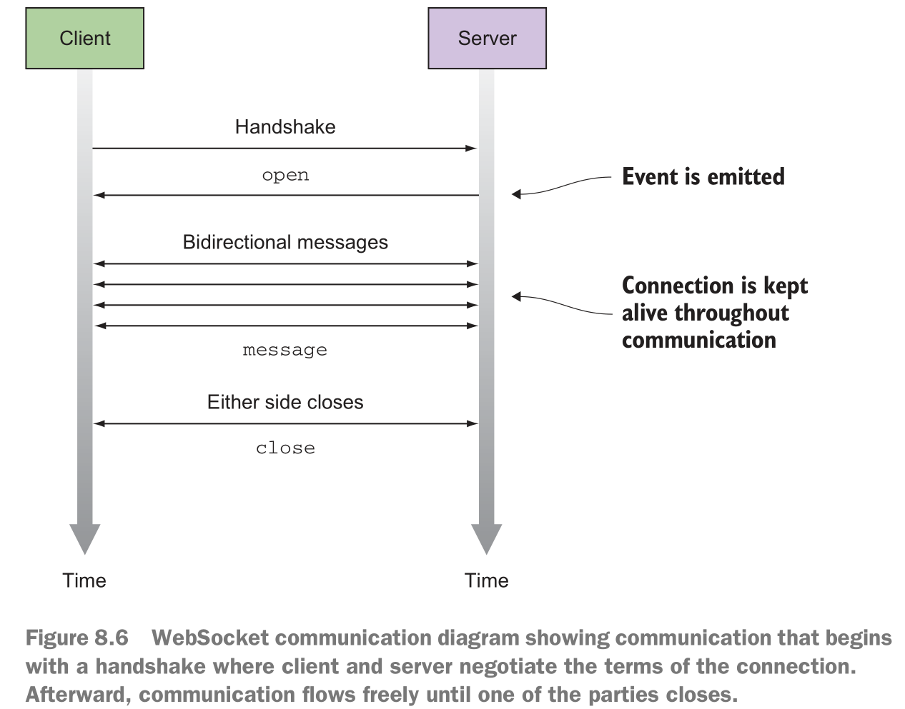

# Heating up observables

## study goal
- The difference between hot and cold observables
- Working with WebSockets and event emitters viav RxJS
- Sharing streams with multiple subscribers
- Understanding how hot and cold pertains to how the producer is created
- Sending events as unicast or multicast to one or multiple subscribers

## Introducing hot and cold observables

### Cold observables
In simple terms, a cold observable is one that doesn’t begin emitting all of its values until
an observer subscribes to it

> 翻译：冷可观察对象，就是它不会发射所有它的值，直到有一个观察者订阅它。

> 这些可观察对象在其创建和执行中是懒惰的。Lazy ！=> Cold

Furthermore, the declaration of a cold observable frequently begins with static
  operators such as of() or from(), and timing observables interval() and timer()
  also behave coldly
  
冷的可观察对象可以比喻为工厂函数，该函数根据模板（其pipeline）生成流实例，以供每个订阅者完全消耗。

例子
```js
const interval$ = Rx.Observable.interval(500);

const isEven = x => x % 2 === 0;

interval$
    .filter(isEven)
    .take(5)
    .subscribe(x => { //#A
        console.log(`Even number found: ${x}`);
    });

interval$
    .filter(R.compose(R.not, isEven))
    .take(5)
    .subscribe(x => { //#A
        console.log(`Odd number found: ${x}`);
    });
```
对于同一个interval$，存在两个不同的subscribers。

```
Even number found: 0
Odd number found: 1
Even number found: 2
Odd number found: 3
Even number found: 4
Odd number found: 5
Even number found: 6
Odd number found: 7
Even number found: 8
Odd number found: 9
```

### Hot observables

> Unlike the cold counterpart where each subscription triggers a new
  stream, subscribers to hot observables tend to receive only the events that are emitted
  after the subscription is created

> 这意味着，与冷订阅每个订阅都会触发新流的情况不同，热的可观察对象的订阅者往往只接收创建订阅后发出的事件。
> 主动权在于热的可观察对象一方，而不是订阅者。

> 任何类型的Promise都是热的可观察对象，因为它在fulfilled后不会重新执行。

> 与冷观测对象创建独立的数据源副本以发送给每个订户不同，热观测对象与侦听它的所有观察者共享相同的订阅。

**定义：热可观察对象，是指那些与订户无关，可以主动生产事件的对象。热可观察对象是有状态的。**

## websockets

像HTTP一样，WS在基于TCP的连接上运行，但优点是可以在保持连接打开的情况下来回传递信息。
（利用浏览器的多路复用功能和keep-alive功能）

流程
1. Establish a socket connection between parties for the initial handshake.（握手请求）
2. Switch or upgrade the communication protocol from regular HTTP to a socket-
based protocol.(提升协议为ws)
3. Send messages in both directions (known as full duplex).（全双工通信）
4. Issue a disconnect, via either the server or the client（任意一方断开连接）



### the difference between resubscribing and replaying in RxJS
- A replay is about reemitting the same sequence of events to each subscriber—in
  effect, replaying the entire sequence
- A resubscribe re-creates the same pipeline and reexecutes the code that produces
  events
> 这部分区别建议查阅更多文档

## Changing the temperature of an observable
> unicast：In the world of computer networking, a unicast transmission
        involves the sending of messages to a single network destination identified by
        a unique source address.

> multicast: In the world of computer networking, a unicast transmission
            involves the sending of messages to a single network destination identified by
            a unique source address.

- Cold -> Hot
- Hot -> Cold

### share()
```js
const source$ = Rx.Observable.interval(1000)
    .take(10)
    .do(num => {
        console.log(`Running some code with ${num}`);
    });
const shared$ = source$.share();
shared$.subscribe(createObserver('SourceA'));
shared$.subscribe(createObserver('SourceB'));

function createObserver(tag) {
    return {
        next: x => {
            console.log(`Next: ${tag} ${x}`);
        },
        error: err => {
            console.log(`Error: ${err}`);
        },
        complete: () => {
            console.log('Completed');
        }
    };
}
```
```
"Running some code with 0"
"Next: SubA 0"
"Next: SubB 0"
"Running some code with 1"
"Next: SubA 1"
"Next: SubB 1"
... and so on...
"Completed"
"Completed"
```
于是，对于同一份请求结果，可以发给两个订阅者
```js
const ticks$ = symbol$.mergeMap(fetchDataInterval$).share();
const sub1 = ticks$.subscribe(
    quoteDetails => updatePanel1(quoteDetails.symbol, quoteDetails.price)
);
const sub1 = ticks$.subscribe(
    quoteDetails => updatePanel2(quoteDetails.symbol, quoteDetails.price)
);
```

### recap knowledge

- You learned how to use higher-order observables and flattening
operators such as mergeMap().
- You learned to coordinate multiple observables with combineLatest().
- You added fault tolerance to your streams with retry and error handling.
- You learned how to convert a cold observable into a hot observable
that shares its event data with many subscribers. To demonstrate this, you’ll
have two subscribers updating different parts of the site.

## Connecting one observable to many observers

- Publish
  > 等于multicast
- Publish with replay
  ```js
  const source$ = Rx.Observable.interval(1000)
      .take(10)
      .do(num => {
          console.log(`Running some code with ${num}`);
      });
  // Creates an observable that can store two past events
  // and reemit them to any new subscribers
  const published$ = source$.publishReplay(2);
  
  // Subscriber A connects subscribers immediately, and begins receiving events from count 0.
  published$.subscribe(createObserver('SubA'));
  
  // Subscribing 5 seconds later,subscriber B should begin receiving events starting with
  // the number 4, but because of the replay it will first receive 2 and 3.
  setTimeout(() => {
      published$.subscribe(createObserver('SubB'));
  }, 5000)
  published$.connect()
  ```
  ```
  "Running some code with 0"
  "Next: SubA 0"
  "Running some code with 1"
  "Next: SubA 1"
  "Running some code with 2"
  "Next: SubA 2"
  "Running some code with 3"
  "Next: SubA 3"
  "Next: SubB 2"  // SubB will begin receiving the last two events (previous and current).
  "Next: SubB 3"
  "Running some code with 4"
  "Next: SubA 4"
  "Next: SubB 4"
  "Running some code with 5"
  "Next: SubA 5"
  "Next: SubB 5"
  ...
  "Next: SubA 9"
  "Next: SubB 9"
  "Completed"
  "Completed"
  ```
- Publish last
  > 仅multicast最后一个通知事件

## Summary
- A cold observable is passive in that it waits until a subscriber is listening to execute an individual pipeline for each subscriber. Cold observables manage the
lifecycle of the event producer.
> 类比，你去线上视频网站看视频，你不点开播放按钮，其实不会开始播放。
- Hot observables are active and can begin emitting events regardless of whether
subscribers are listening. Hot observables close over the producer of events, so
their lifecycles are independent of the source.
> 类比，你去实地电影院看电影，电影按时间播放，不管座位有没人一样。
- Event emitters such as WebSockets and DOM elements are examples of hot
observables.
> WebSockets 和 DOM elements都是热可观察对象。
- Events from hot observables will be lost if no one is listening, whereas cold
observables will always rebuild their pipeline upon every subscription
> 类比DOM元素的点击事件，即使没有事件监听器函数。依然会触发点击事件。
- share() makes observers use the same underlying source stream and disconnects 
when all the subscribers stop listening. This operator can be used to make
a cold observable hot—or at least warm.
> share() 可以使得observers使用相同的背后事件源。
- Using operators such as publish(), publishReplay(), and publishLast() creates multicast observables.
> publish(), publishReplay(), publishLast() 可以创建多播可观察对象。