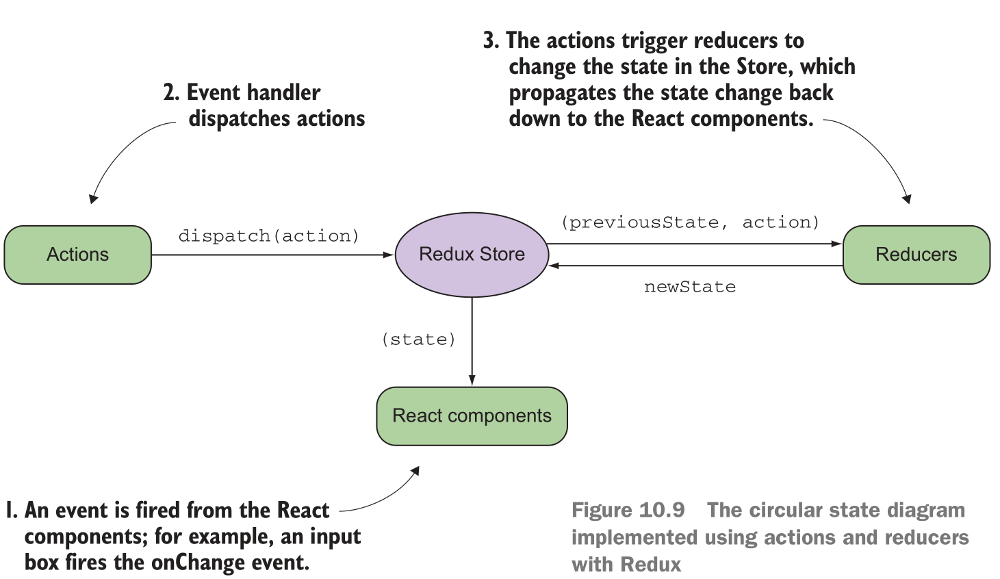
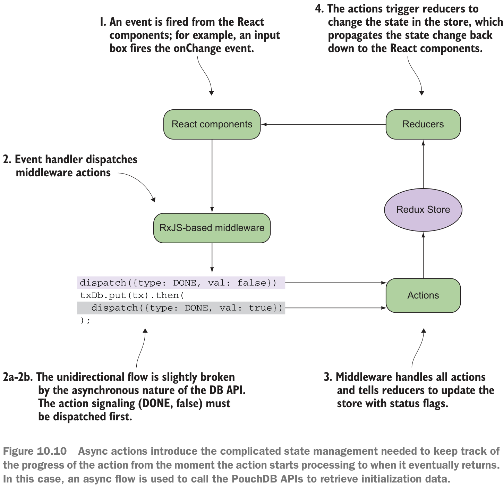

# RxJS in the wild

## study goals
- Integrating RxJS with other popular JavaScript libraries
- Introducing React and Redux
- Compartmentalizing UI components using React
- Feed-forward state propagation using Redux
- Rolling your own functional, asynchronous middleware using RxJS subjects
- Building a banking application using only reactive frameworks

## redux


事件流描述：
```
react component trigger event -> dispatch Actions -> Reducers -> store -> react components
```

## The asynchronous middleware with RxJS Subject


RxJS + Redux + DB operations 步骤解析

1. DOM 触发events
2. event handler 
  - 2.1 首先派发 DONE = false 标记到 Actions进行标记
  - 2.2 执行 DB operations 事务处理，如果成功，派发 DONE = true 标记到 Actions 进行更新
3. Actions -> reducers -> store ，store中心数据更新
4. store 传播数据更新到 DOM UI组件。

## Multicast operators
