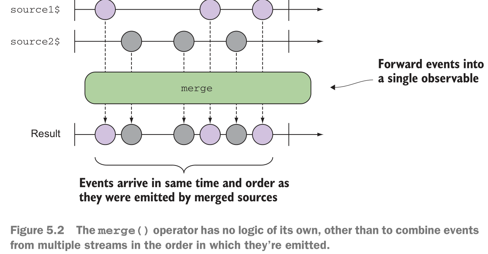
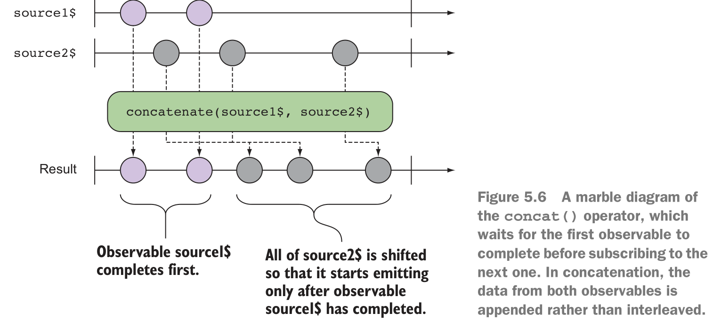
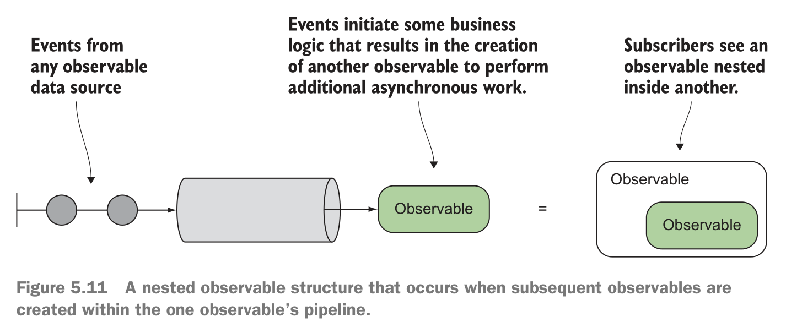
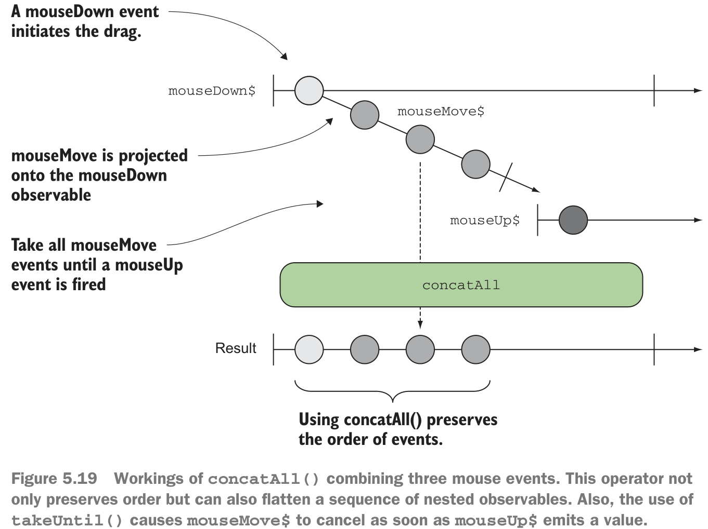

# reactive stream

## join multiple streams into one
There are many different ways to join multiple streams into one and take advantage of using a single observer to handle them all.

- **Interleave events by merging streams**—This strategy is useful for forwarding events
from multiple streams and is ideal for handling different types of user interaction events like mouse or touch.
- **Preserve order of events by concatenating streams**—This one is used when the order
of the events emitted by multiple streams needs to be preserved.
- **Switch to the latest stream data**—This is used when one type of event kicks off
another, such as a button click initiating a remote HTTP call or beginning a
timer.

### Interleave events by merging streams


```js
const source1$ = Rx.Observable.interval(1000)
    .map(x => `Source 1 ${x}`)
    .take(3);
const source2$ = Rx.Observable.interval(1000)
    .map(y => `Source 2 ${y}`)
    .take(3);
Rx.Observable.merge(source1$, source2$)
    .subscribe(console.log);
```
Application demo
```js
/**
 *  RxJS in Action
 *  Listing 5.1
 *  @author Paul Daniels
 *  @author Luis Atencio
 */

const mouseUp$ = Rx.Observable.fromEvent(document, 'mouseup');
const touchEnd$ = Rx.Observable.fromEvent(document, 'touchend');

  Rx.Observable.merge(mouseUp$, touchEnd$)
  .do(event => console.log(event.type))
  .map(event => {
      switch(event.type) {
         case 'touchend':
            return {left: event.changedTouches[0].clientX,
                    top: event.changedTouches[0].clientY};
         case 'mouseup':
            return {left: event.clientX,
                    top:  event.clientY};
      }
  })
  .subscribe(obj =>
      console.log(`Left: ${obj.left}, Top: ${obj.top}`));
```

Normalizing upstream event data merges the streams
```js
/**
 *  RxJS in Action
 *  Listing 5.2
 *  @author Paul Daniels
 *  @author Luis Atencio
 */

const mouseUp$ = Rx.Observable.fromEvent(document, 'mouseup');
const touchEnd$ = Rx.Observable.fromEvent(document, 'touchend');

const conformantMouseUp$ = mouseUp$.map(event => ({
  left: event.clientX,
  top: event.clientY
}));

const conformantTouchEnd$ = touchEnd$.map(event => ({
  left: event.changedTouches[0].clientX,
  top: event.changedTouches[0].clientY,
}));

Rx.Observable.merge(conformantMouseUp$, conformantTouchEnd$)
   .subscribe(obj =>
      console.log(`Left: ${obj.left}, Top: ${obj.top}`));
```

总结：merge就是依据响应返回的时间来排序输出，先到的排在前面。

### Preserve order of events by concatenating streams


```js
const source1$ = Rx.Observable.range(1, 3).delay(3000);
const source2$ = Rx.Observable.of('a', 'b', 'c');
const result = Rx.Observable.concat(source1$, source2$);
result.subscribe(console.log);
```


也就是说：source1$完成后，source2$才会继续emit事件。保证输出顺序和输入顺序一致。

### Switch to the latest observable data

```js
Rx.Observable.fromEvent(document, 'click')
    .map(click => Rx.Observable.range(1, 3))
    .switch()
    .subscribe(console.log);
```
click -> Observable(1,2,3) -> log

订阅者永远不会看到点击事件进入-因为发生了切换。Observable(1,2,3)替换掉click事件。

## Unwinding nested observables: the case of mergeMap


```
const search$ = Rx.Observable.fromEvent(inputText, 'keyup')
...
.mergeMap(query => Rx.Observable.from(queryResults(query)));
```

## Mastering asynchronous streams
```js
const panel = document.querySelector('#dragTarget');
const mouseDown$ = Rx.Observable.fromEvent(panel, 'mousedown');
const mouseUp$ = Rx.Observable.fromEvent(document, 'mouseup');
const mouseMove$ = Rx.Observable.fromEvent(document, 'mousemove');

//  Listing 5.8
const drag$ = mouseDown$.concatMap(() => mouseMove$.takeUntil(mouseUp$));

drag$.forEach(event => {
  panel.style.left = event.clientX + 'px';
  panel.style.top = event.clientY + 'px';
});
```
关键：监听mouseDown，直到mouseMove变成mouseUp。此时鼠标已经松开，代表拖拽完成。


---
```js
const interval$ = Rx.Observable.interval(1000);
const clicks$ = Rx.Observable.fromEvent(document, 'click');
interval$.takeUntil(clicks$)
    .subscribe(
        x => console.log(x),
        err => console.log(`Error: ${err}`),
        () => console.log('OK, user is back!'))
```

发出点击事件后，间隔流将被取消

## 总结

- You can interleave streams with `merge()`, cancel and switch to a new projected
observable with `switch()`, or preserve entire observable sequences in order by
using `concat()`.
- You can use split operators to combine and flatten a series of nested observable
streams.
- You can combine and project observables into a source observable using the
higher-order operators such as `mergeMap()` and `concatMap()`.
- You implemented an auto-suggest search box.
- You implemented drag and drop using stream concatenation.