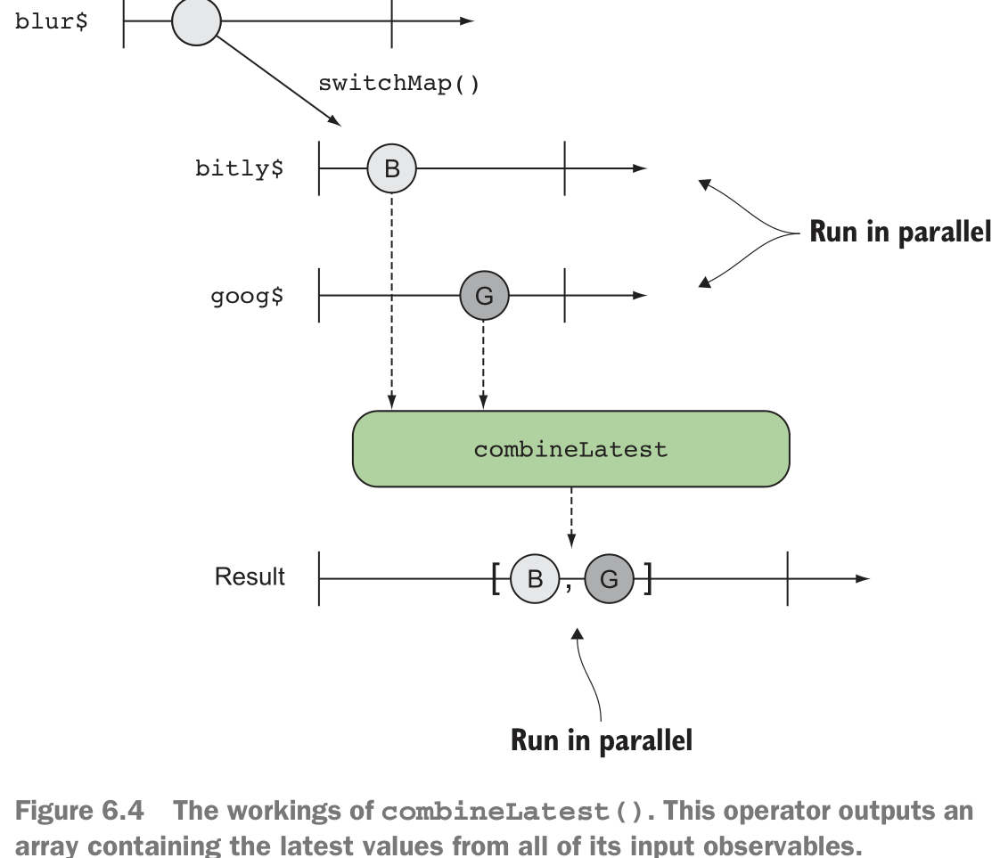
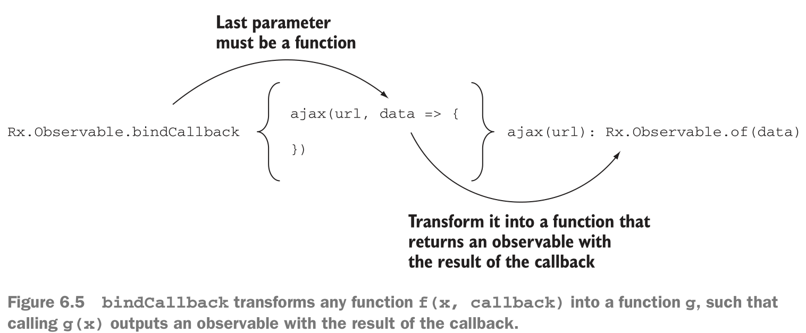

# coordinating business processes

## Joining parallel streams with combineLatest and forkJoin

### initial solution
```js
button.addEventListener('click', () => {
    let result1, result2 = {};
    ajax('/source1', data => {
        result1 = data;
    });
    ajax('/source2', data => {
        result2 = data;
    });
    setTimeout(() => {
        processResults(result1, result2);
    }, arbitraryWaitTimeMs);
    // Would need to be long enough so that both AJAX calls have enough time to finish
});
```
because it is difficult to wait and combine the results later.

### convert to serial request
```js
button.addEventListener('click', () => {
    ajax('/source1', result1 => {
        ajax('/source2', result2 => {
            processResults(result1, result2);
        });
    });
});
```
```js
button.addEventListener('click', () => {
    let firstResult;
    ajax('/source1', result => {
        if (firstResult) processResults(result, firstResult);
        else firstResult = result;
    });
    ajax('/source2', result => {
        if (firstResult) processResults(firstResult, result);
        else firstResult = result;
    });
});
```
这些都不是优雅的实现。

### Use Async.js 
> https://github.com/caolan/async
```js
button.addEventListener('click', () => {
    async.parallel([
            ajax('/source1'),
            ajax('/source2')
        ],
        (err, ([result1, result2])) => {
        processResults(result1, result1);
    });
});
```

目标：规定两个任务必须并行运行，但仅在所有任务都已完成时才触发收集结果。

### promise
```js
button.addEventListener('click', () => {
    Promise.all(ajax('/source1'), ajax('/source2'))
        .then(([result1, result2]) => {
            processResults(result1, result2);
        });
});
```

### Combining parallel streams
```js
const urlField = document.querySelector('#url');
const url$ = Rx.Observable.fromEvent(urlField, 'blur')
    .pluck('target', 'value')
    .filter(isUrl)
    .switchMap(input =>
        Rx.Observable.combineLatest(bitly$(input), goog$(input)))
    .subscribe(([bitly, goog]) => {
        console.log(`From Bitly: ${bitly}`);
        console.log(`From Google: ${goog}`)
    });
```
> 注意：通常，因果流（一个取决于另一个）是使用mergeMap（）或switchMap（）组合的，
>而独立的流是使用combineLatest（）合并。



do more better:
```
.switchMap(input =>
  Rx.Observable.combineLatest(bitly$(input), goog$(input),
  (b, g) => b.length > g.length ? b : g))
```

### Rx.Observable.bindCallback


``` 
                        Rx.Observable.bindCallback
function(x,callback) --------------------------------> g(x) : Rx.Observable.of(data)
```