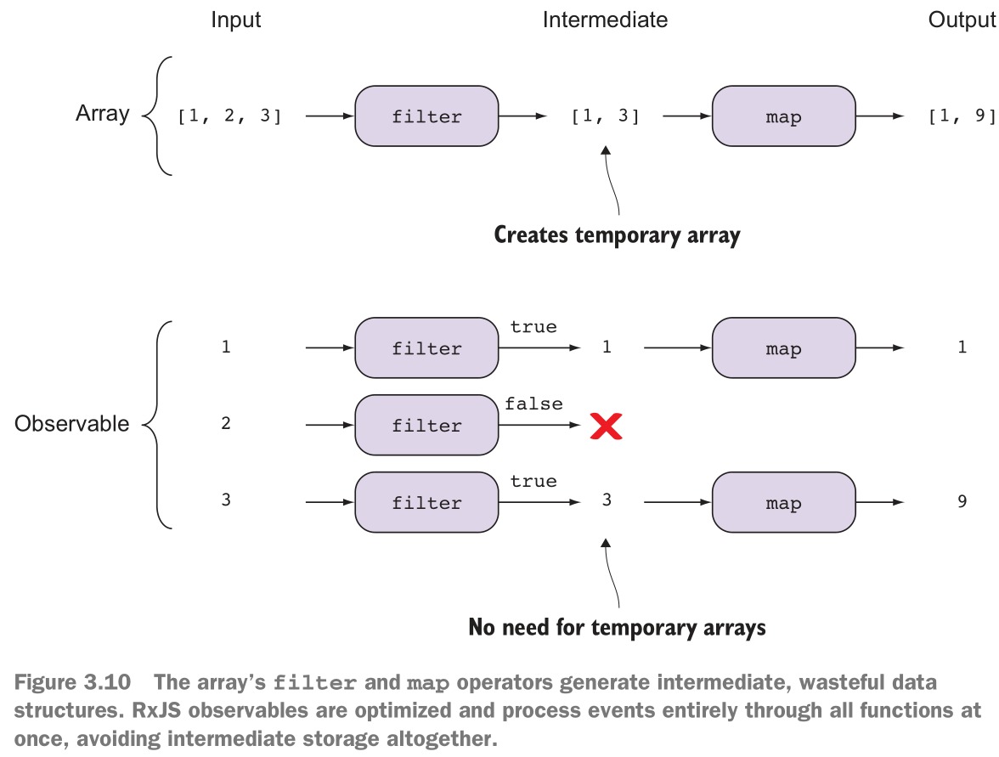
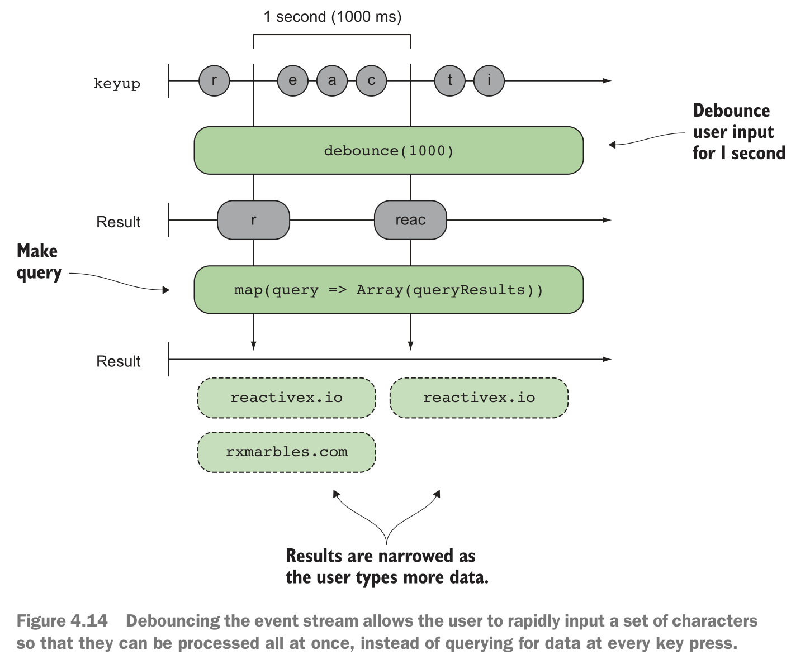
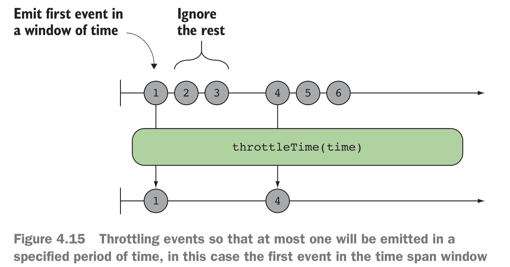
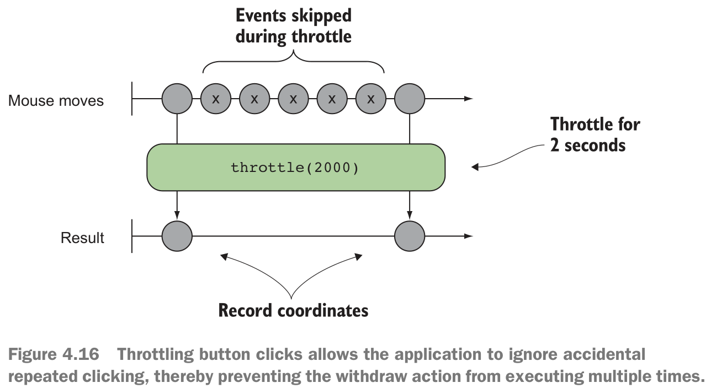
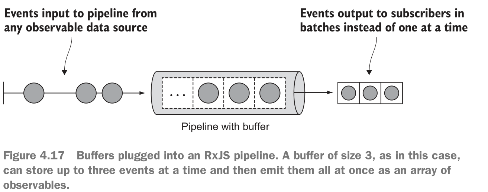
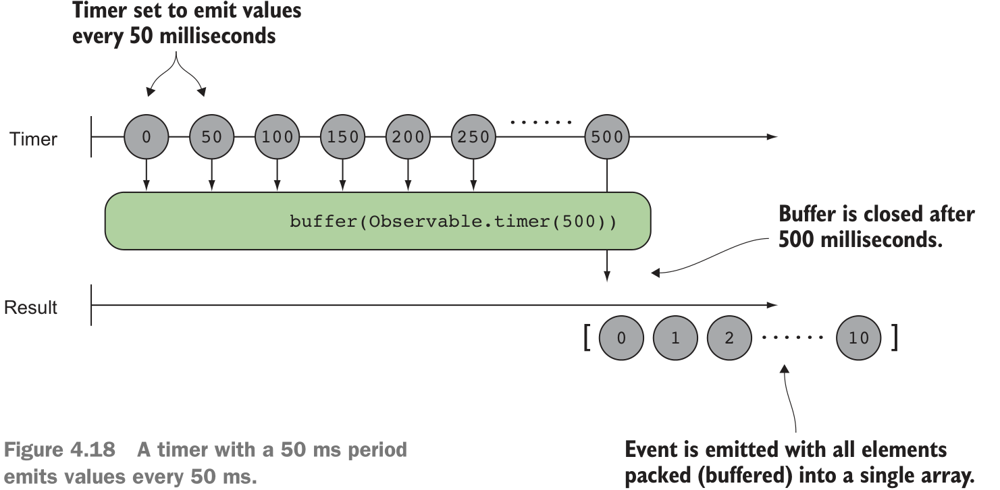

# RxJS 性能
## 序列化时RxJS的性能优势



RxJS 没有中间存储。直接拆分事件流处理。

## debounce
> 防反跳

> debouncing means  “execute a function or some
action only if a certain period has passed without it being called.”

> 翻译：仅在经过一定时间后才会执行一个函数或者某些操作。

**即使某些操作触发频率很高，我也只会按照固定的时间间隔来执行操作**。


### DOM click
```js
Rx.Observable.fromEvent(document, 'click')
    .debounceTime(1000)
    .subscribe(c => {
        console.log(`Clicked at position
        ${c.clientX} and ${c.clientY}`)
});
```
也就是说，触发click的时间间隔不会低于1000ms，即使我疯狂点击。

### debouncing logic for smart search widget
```js
let timeoutId = null;
searchBox.addEventListener('keyup', function (event) {
    clearTimeout(timeoutId);
    timeoutId = setTimeout(function (query) {
        console.log('querying...');
        let searchResults = [];
        if (query && query.length > 0) {
            clearResults(results);
            for (let result of testData) {
                if (result.startsWith(query)) {
                    searchResults.push(result);
                }
            }
        }
        for (let result of searchResults) {
            appendResults(result, results);
        }
    }, 1000, event.target.value);
});
```
```js
function clearResults(container) {
    while (container.childElementCount > 0) {
        container.removeChild(container.firstChild);
    }
}

function appendResults(result, container) {
    let li = document.createElement('li');
    let text = document.createTextNode(result);
    li.appendChild(text);
    container.appendChild(li);
}
```

### extract debounce function
```js
const copyToArray = arrayLike => Array.prototype.slice.call(arrayLike);

function debounce(fn, time) {
    let timeoutId;
    return function () {
        const args = [fn, time]
            .concat(copyToArray(arguments));
        clearTimeout(timeoutId);
        timeoutId = window.setTimeout.apply(window, args);
    }
}
```
```js
function sendRequest(query) {
    console.log('querying...');
    let searchResults = [];
    if (query && query.length > 0) {
        clearResults(results);
        for (result of testData) {
            if (result.startsWith(query)) {
                searchResults.push(result);
            }
        }
    }

    for (let result of searchResults) {
        appendResults(result, results);
    }
}

let debouncedRequest = debounce(sendRequest, 1000);
searchBox.addEventListener('keyup', function (event) {
    debouncedRequest(event.target.value);// event.target.value is arguments
});
```

### debounce-optimized search program
```js
const notEmpty = input => !!input && input.trim().length > 0;
const sendRequest = function (arr, query) {
    return arr.filter(item => {
        return query.length > 0 && item.startsWith(query);
    });
}
const search$ = Rx.Observable.fromEvent(searchBox, 'keyup')
    .debounceTime(1000)
    .pluck('target', 'value')
    .filter(notEmpty)
    .do(query => console.log(`Querying for ${query}...`))
    .map(query =>
        sendRequest(testData, query))
    .subscribe(result => {
        if (result.length === 0) {
            clearResults(results);
        } else {
            appendResults(result, results);
        }
    });
```

### 示意图


## Throttling
> v 节流，减速；

> Let’s say you’re executing an expensive computation in response to a user scroll-
ing or moving the mouse. It’s probably best to wait for the user to finish scrolling
instead of executing this function thousands of times

> 翻译：假如你需要在用户滚动鼠标时执行复杂计算，那么最好是等待用户停止滚动鼠标时再执行计算。
> 而不是一滚动鼠标就计算，那样的话会执行成千上万次，没这个必要。

节流会忽略可观察序列中的某些值，这些值在一定时间之前紧跟着另一个值。
简单来说，这意味着“每个周期最多执行一次功能”。

### 示意图


关键一点：throttle 会忽略中间时间段的值，而debounce不会忽略这些值。

### Controlling button action with throttle
```js
Rx.Observable.fromEvent(document, 'mousemove')
    .throttleTime(2000)
    .subscribe(event => {
        console.log(`Mouse at: ${event.x} and ${event.y}`);
    });
```



## debounce vs throttle
- 使用时机

## Buffering in RxJS



批处理，一次传递多个值作为一个处理单位。

### 例子
```js
Rx.Observable.timer(0, 50)
    .buffer(Rx.Observable.timer(500))
    .subscribe(
        function (val) {
        console.log(`Data in buffer: [${val}]`);
});
//-> "Data in buffer: [0,1,2,3,4,5,6,7,8,9]"
```



## 小结
- Implicit time manifests in the latency waiting for asynchronous HTTP calls to
respond. You have no control over how long these functions take.
- Explicit time is controlled by you and takes advantage of JavaScript’s timers.
 Delaying shifts the observable sequence by a due time (in milliseconds).
- Debouncing emits an event from an observable sequence only after a particular
time span (in milliseconds) has passed without it omitting any other item.
- Throttling enforces a maximum number of times a function can be called over
time.
- Buffering operations use many of the same semantics as the timing operations.
- RxJS features size-based as well as time-based buffers