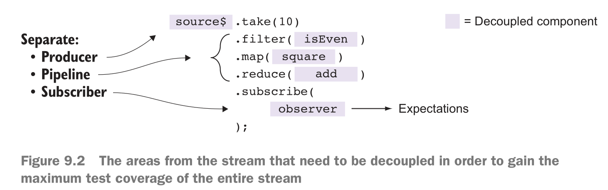

# testable reactive programs

## study goals
- Understanding functional programming’s inherent testability
- Testing asynchronous code with Mocha.js
- Exploring the tools for testing observables
- Understanding the need for using virtual time instead of physical time
- Introducing RxJS schedulers
- Refactoring streams to enhance testability

## use mocha & chai

Mocha.js is a full-fledged JavaScript testing framework built for both the browser and
Node.js. It allows you to easily plug in any assertion library you want,
 - whether you’re familiar with the xUnit assertion APIs like `assert.js `
 - or other varieties such as `expect.js` (used previously) 
 - and `should.js`, to name a few.
 - a flexible API or a domain-specific language (DSL) called `Chai.js`

### 例子
```json
{
  "name": "test",
  "version": "1.0.0",
  "dependencies": {},
  "scripts": {
    "test": "mocha use-mocha.js"
  },
  "devDependencies": {
    "chai": "^4.2.0",
    "mocha": "^8.2.1"
  }
}
```
```js
let expect = require('chai').expect;

function isEmpty(value) {
    return typeof value == 'string' && !value.trim() || typeof value == 'undefined' || value === null;
}

function negate(fn) {
    return function (val) {
        return !fn(val);
    }
}

const notEmpty = negate(isEmpty);

describe('Validation', function () {
    it('Should validate that a string is not empty', function () {
        expect(notEmpty('some input')).to.be.equal(true);
        expect(notEmpty(' ')).to.be.equal(false);
        expect(notEmpty(null)).to.be.equal(false);
        expect(notEmpty(undefined)).to.be.equal(false);
    });
});
```

## Testing asynchronous code and promises
> RxJS/RxJS-in-Action/test/src/ajax.test.html

## Testing reactive streams
```js
let Rx = require('rxjs/Rx');
let expect = require('chai').expect;

describe('Adding numbers', function () {
    it('Should add numbers together', function () {
        const adder = (total, delta) => total + delta;
        Rx.Observable.from([1, 2, 3, 4, 5, 6, 7, 8, 9])
            .reduce(adder)
            .subscribe(total => {
                expect(total).to.equal(45);
            });
    });
});
```

## making streams testable


## Scheduling values in RxJS
```js
it('Emits values synchronously on default scheduler', function () {
    let temp = [];
    Rx.Observable.range(1, 5)
        .do([].push.bind(temp))
        .subscribe(value => {
            expect(temp).to.have.length(value);
            expect(temp).to.contain(value);
        });
});

it('Emits values on an asynchronous scheduler', function (done) {
    let temp = [];
    Rx.Observable.range(1, 5, Rx.Scheduler.async)
        .do(console.log)
        .do([].push.bind(temp))
        .subscribe(value => {
            expect(temp).to.have.length(value);
            expect(temp).to.contain(value);
        }, done, done);
});
```

## test map() marbles
> RxJS/RxJS-in-Action/test/src/map.test.js
```js
describe('Map operator', function () {
    it('Should map multiple values', function () {
        let scheduler = new Rx.TestScheduler(assertDeepEqual);

        let source = scheduler.createColdObservable(
            '--1--2--3--4--5--6--7--8--9--|');

        let expected = '--a--b--c--d--e--f--g--h--i--|';

        let r = source.map(square);

        scheduler.expectObservable(r).toBe(expected,
            { 'a': 1, 'b': 4, 'c': 9, 'd': 16, 'e': 25,
                'f': 36, 'g':49, 'h': 64, 'i': 81});

        scheduler.flush();
    });
});
```

## test runInternal()
> RxJS/RxJS-in-Action/test/src/run-internal.test.js

## Summary
- Functional programs are easy to test, given that all functions are pure and have
 clear signatures.
- Testing asynchronous code can be challenging, and you need to leverage async-
 aware unit-testing frameworks like Mocha.
- You can combine Mocha with powerful assertion interfaces like Chai.js to create
 elegant and fluent tests.
- Testing synchronous observables follows the same procedures as testing any
 pure function.
- Testing asynchronous behavior as well as streams that bend time can be done
 effectively using the virtual scheduler.
- It’s best to make your streams testable and modular. Attempt to keep your busi-
 ness logic separate, as a set of functions, and to decouple a stream from its pro-
 ducer and observer; this will allow you to manipulate its test boundaries to suit
 the different use cases you want to test