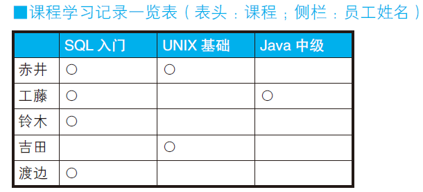
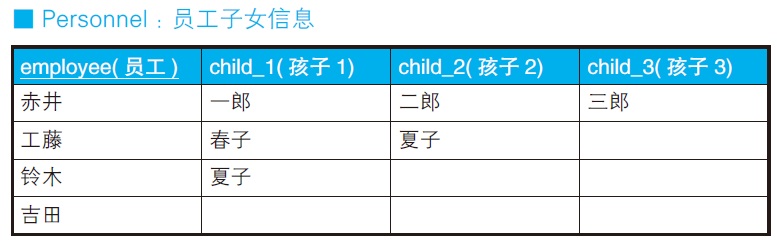
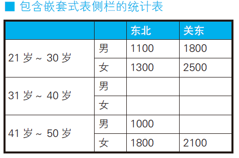
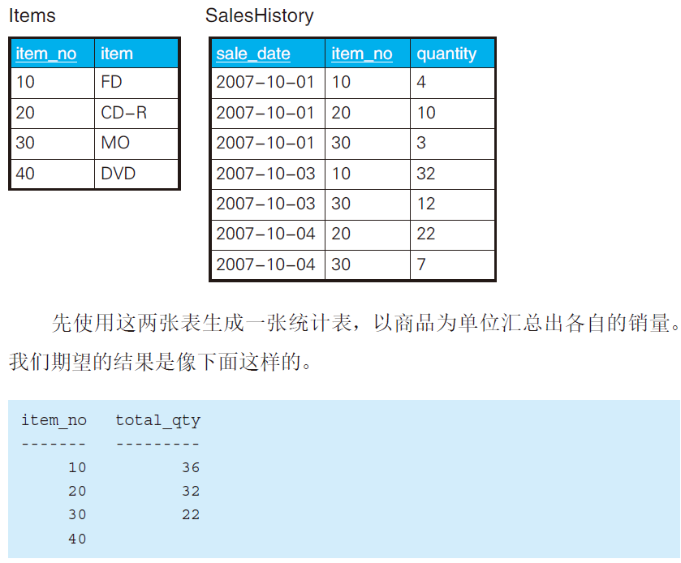
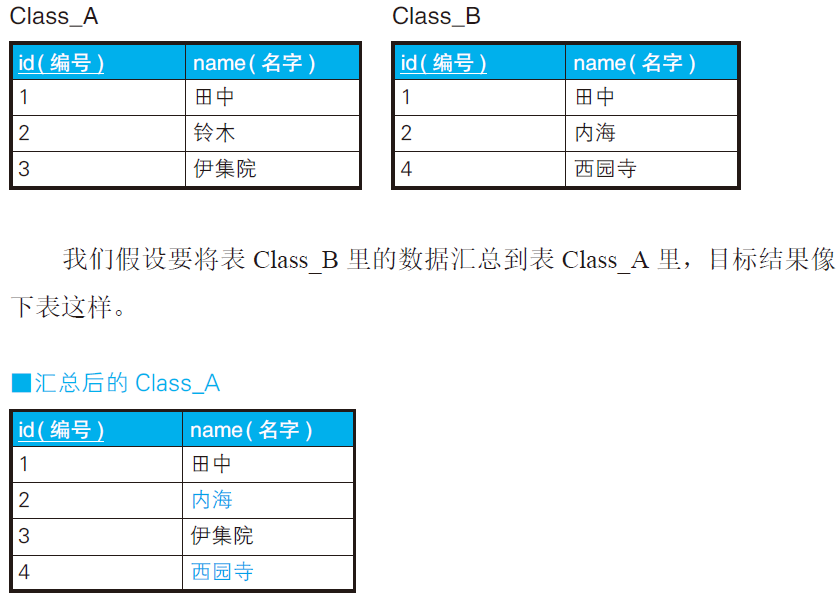

# 外连接

## 外连接（行→列）：制作交叉表


目标是转化为以下



解法一

```sql
-- 使用外连接
SELECT C0.name,
       CASE WHEN C1.name IS NOT NULL THEN '○' ELSE NULL END AS "SQL入门",
       CASE WHEN C2.name IS NOT NULL THEN '○' ELSE NULL END AS "UNIX基础",
       CASE WHEN C3.name IS NOT NULL THEN '○' ELSE NULL END AS "Java中级"
  FROM  (SELECT DISTINCT name FROM  Courses) C0
    LEFT OUTER JOIN
    (SELECT name FROM Courses WHERE course = 'SQL入门' ) C1
    ON  C0.name = C1.name
      LEFT OUTER JOIN
        (SELECT name FROM Courses WHERE course = 'UNIX基础' ) C2
        ON  C0.name = C2.name
          LEFT OUTER JOIN
            (SELECT name FROM Courses WHERE course = 'Java中级' ) C3
            ON  C0.name = C3.name;
```

根据源表Courses 生成C0 ～ C3 这4 个子集。


C0 包含了全部员工，起到了“员工主表”的作用。C1 ～ C3 是每个课程的学习者的集合。
这里以C0 为主表，依次对C1 ～ C3 进行外连接操作。**如果某位员工学习过某个课程，则相应的课程列会出现他的姓名，否则为NULL**。

---

解法二

```sql
-- 使用标量子查询，性能较差
SELECT  C0.name,
  (SELECT '○'
     FROM Courses C1
    WHERE course = 'SQL入门'
      AND C1.name = C0.name) AS "SQL入门",
  (SELECT '○'
     FROM Courses C2
    WHERE course = 'UNIX基础'
      AND C2.name = C0.name) AS "UNIX基础",
  (SELECT '○'
     FROM Courses C3
    WHERE course = 'Java中级'
      AND C3.name = C0.name) AS "Java中级"
  FROM (SELECT DISTINCT name FROM Courses) C0;
```

---

解法三

```sql
-- 嵌套使用CASE 表达式
SELECT name,
    CASE WHEN SUM(CASE WHEN course = 'SQL入门' THEN 1 ELSE NULL END) = 1
         THEN '○' ELSE NULL END AS "SQL 入门",
    CASE WHEN SUM(CASE WHEN course = 'UNIX基础' THEN 1 ELSE NULL END) = 1
         THEN '○' ELSE NULL END AS "UNIX 基础",
    CASE WHEN SUM(CASE WHEN course = 'Java中级' THEN 1 ELSE NULL END) = 1
         THEN '○' ELSE NULL END AS "Java 中级"
FROM Courses
GROUP BY name;
```

---

## 外连接（列→行）：汇总重复项于一列



需要将其转化为


第一步：创建辅助VIEW

```sql
CREATE VIEW Children(child)
AS SELECT child_1 FROM Personnel
   UNION
   SELECT child_2 FROM Personnel
   UNION
   SELECT child_3 FROM Personnel;
```

```
child
-----
一郎
二郎
三郎
春子
夏子
```

第二步：

```sql
SELECT
	EMP.employee,
	CHILDREN.child 
FROM
	Personnel EMP
	LEFT OUTER JOIN Children ON CHILDREN.child IN ( EMP.child_1, EMP.child_2, EMP.child_3 );
```

当表Personnel 里“孩子1～孩子3”列的名字存在于Children视图里时，返回该名字，否则返回NULL。

## 交叉表里制作嵌套式表侧栏


需要生成汇总统计表



第一步：先按照需要的格式准备好主表

对表TblAge
和表TblSex 进行交叉连接运算，生成下面这样的笛卡儿积。行数是
3×2 ＝ 6

```sql
SELECT age_class, sex_cd
FROM TblAge CROSS JOIN TblSex
```


第二步：主表master左外连接其余表

```sql
SELECT 
  MASTER.age_class AS age_class,
	MASTER.sex_cd AS sex_cd,
	DATA.pop_tohoku AS pop_tohoku,
	DATA.pop_kanto AS pop_kanto 
FROM
	( SELECT age_class, sex_cd FROM TblAge CROSS JOIN TblSex ) MASTER 
	LEFT OUTER JOIN (
	SELECT
		age_class,
		sex_cd,
		SUM( CASE WHEN pref_name IN ( '青森', '秋田' ) THEN population ELSE NULL END ) AS pop_tohoku,
		SUM( CASE WHEN pref_name IN ( '东京', '千叶' ) THEN population ELSE NULL END ) AS pop_kanto 
	FROM
		TblPop 
	GROUP BY
		age_class,
		sex_cd 
	) DATA ON MASTER.age_class = DATA.age_class 
	AND MASTER.sex_cd = DATA.sex_cd;
```

## 乘法运算的连接



```sql
SELECT
	I.item_no,
	SUM( SH.quantity ) AS total_qty 
FROM
	Items I
	LEFT OUTER JOIN SalesHistory SH ON I.item_no = SH.item_no 
GROUP BY
	I.item_no;
```

## 全外连接

标准SQL 里定义了外连接的三种类型。

- 左外连接（LEFT OUTER JOIN）
  
- 右外连接（RIGHT OUTER JOIN）
  
- 全外连接（FULL OUTER JOIN）

**用作主表的表写在运算符左边时用左外连接，写在运算符右边时用右外连接**。

**全外连接**能够从两张内容不一致的表里，没有遗漏地获取全部信息，也可以理解成“**把两张表都当作主表来使用**”。

> COALESCE 是
> SQL 的标准函数，可以接受多个参数，功能是返回第一个非NULL 的参数。

Class_A

| id   | name   |
| ---- | ------ |
| 1    | 田中   |
| 2    | 铃木   |
| 3    | 伊集院 |

Class_B

| id   | name   |
| ---- | ------ |
| 1    | 田中   |
| 2    | 铃木   |
| 4    | 西园寺 |

```sql
SELECT COALESCE(A.id, B.id) AS id,
        A.name AS A_name,
        B.name AS B_name
FROM Class_A A FULL OUTER JOIN Class_B B
ON A.id = B.id;
```

```
id A_name B_name
---- ------ ------
1 田中     田中
2 铃木     铃木
3 伊集院
4         西园寺
```

**当数据库不支持全外连接，可以分别左外连接和右外连接，再把两个结果通过UNION合并**。

内连接相当于求集合的积（INTERSECT，交集），**全外连接相当于求集合的和（UNION，**
**也称并集）**。

## 外连接求差集：A - B

```sql
SELECT A.id AS id, A.name AS A_name
FROM Class_A A LEFT OUTER JOIN Class_B B
ON A.id = B.id
WHERE B.name IS NULL;
```

```
id A_name
---- ------
3 伊集院
```

## 全外连接求异或集

一种是(A UNION B)
EXCEPT (A INTERSECT B)。

另一种是(A EXCEPT B) UNION (B EXCEPT A)。

异或集合表示的是**在A中但不在B中的部分，加上在B中但不在A中的部分**。

```sql
SELECT COALESCE(A.id, B.id) AS id,
       COALESCE(A.name , B.name ) AS name
FROM Class_A A FULL OUTER JOIN Class_B B
ON A.id = B.id
WHERE A.name IS NULL
   OR B.name IS NULL;
```

## 小结

1. SQL 不是用来生成报表的语言，不建议用来格式转换。
2. 必要时考虑用外连接或CASE 表达式。
3. 生成嵌套式表侧栏时，如果先生成主表的笛卡儿积再进行连接，很容易完成。
4. **从行数来看，表连接可以看成乘法。因此，当表之间是一对多的关系时，连接后行数不会增加**。
5. 外连接的思想和集合运算很像，使用外连接可以实现各种集合运算。

## 练习

### 问题1

求每个员工抚养的孩子的人数。

```
employee child_cnt
-------- ---------
赤井       3
工藤       2
铃木       1
吉田       0
```

```sql
SELECT
	EMP.employee,
	COUNT( Children.child ) AS child_cnt 
FROM
	Personnel EMP
	LEFT OUTER JOIN Children ON Children.child IN ( EMP.child_1, EMP.child_2, EMP.child_3 ) 
GROUP BY
	EMP.employee;
```

### 问题2

MERGE 运算符是在SQL:2003 标准中引入的新特性。



```sql
MERGE INTO Class_A A
    USING (SELECT * FROM Class_B ) B
      ON (A.id = B.id)
    WHEN MATCHED THEN
        UPDATE SET A.name = B.name
    WHEN NOT MATCHED THEN
        INSERT (id, name) VALUES (B.id, B.name);
```

> Merge在MYSQL 5.7中执行失败。