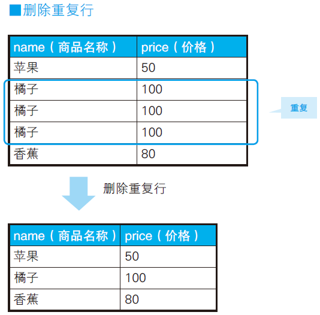
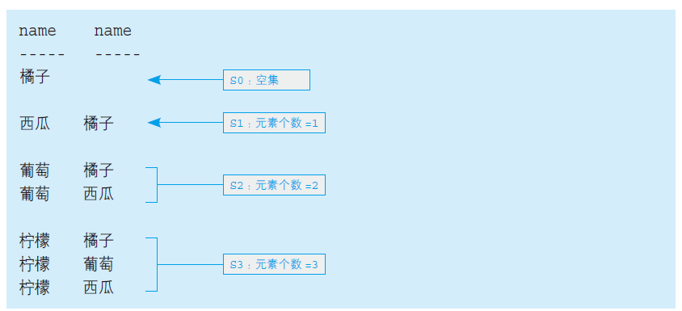
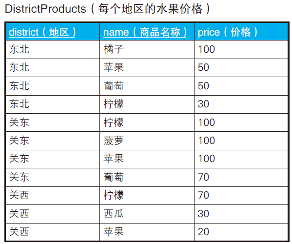
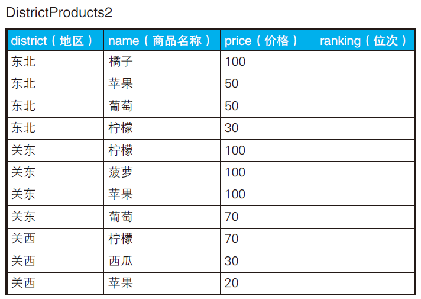

# 自连接

针对相同的表进行的连接被称为“自连接”（self join）。

自连接技术充分体现了SQL 面向集合的特性。

## 交叉连接

> 生成N x N 的组合。

Products表

```
pname price
----- -----
橘子	100
苹果	50
香蕉	80
```

```sql
SELECT P1.pname AS name_1, P2.pname AS name_2
FROM Products P1, Products P2;
```

```
name_1 name_2
------ ------
苹果 苹果
苹果 橘子
苹果 香蕉
橘子 苹果
橘子 橘子
橘子 香蕉
香蕉 苹果
香蕉 橘子
香蕉 香蕉
```

## 交叉连接V2

> 排除掉由相同元素构成的对。

```sql
SELECT P1.pname AS name_1, P2.pname AS name_2
FROM Products P1, Products P2
WHERE P1.pname <> P2.pname;
```

```
name_1 name_2
------ ------
苹果 橘子
苹果 香蕉
橘子 苹果
橘子 香蕉
香蕉 苹果
香蕉 橘子
```

## 交叉连接V3

> 对只调换了元素顺序的对进行去重。

```sql
SELECT P1.pname AS name_1, P2.pname AS name_2
FROM Products P1, Products P2
WHERE P1.pname > P2.pname;
```

> 理论上 P1.name < P2.name 也能得出正确结果，这里利用了对称性。

```
name_1 name_2
------ ------
苹果 橘子
香蕉 橘子
香蕉 苹果
```

如果觉得字典排序不好理解。可以将A，B，C分别看成数字，30，20，10。

这样满足P1.pname > P2.pname的结果只有：

```
A>B
A>C
B>C
```

## 删除重复行



```sql
-- 用于删除重复行的SQL 语句(1) ：使用极值函数
DELETE FROM Products P1
WHERE rowid < ( SELECT MAX(P2.rowid)
                FROM Products P2
                WHERE P1.pname = P2.pname
                AND P1.price = P2.price ) ;
```

例如这个表中，橘子重复的行id为2,3,4，那么删除步骤为：

```
2<4 删除id=2的行
3<4 删除id=3的行
4<4不成立，保留id=4的行
```

## 查找局部不一致的列


```sql
SELECT DISTINCT
	A1.NAME,
	A1.address 
FROM
	Addresses A1,
	Addresses A2 
WHERE
	A1.family_id = A2.family_id 
	AND A1.address <> A2.address;
```

```
name address
---- -------
前田义明	东京都港区虎之门3-2-29
前田由美	东京都港区虎之门3-2-92
```

## 排序

按价格从高到低排序。


```sql
SELECT pname,
	price,
	RANK () OVER ( ORDER BY price DESC ) AS rank_1,
	DENSE_RANK () OVER ( ORDER BY price DESC ) AS rank_2 
FROM
	Products;
```

> MySQL 5.7 执行失败，没有 RANK 和 DENSE_RANK 函数。

```sql
-- 排序从1开始。如果已出现相同位次，则跳过之后的位次
SELECT P1.pname,
	   P1.price,
       (SELECT COUNT(P2.price)
        FROM Products P2
        WHERE P2.price > P1.price) + 1 AS rank_1
FROM Products P1
ORDER BY rank_1;
```

```
name price rank
----- ------ ------
橘子 100    1
西瓜 80     2
苹果 50     3
葡萄 50     3
香蕉 50     3
柠檬 30 	  6
```

如果需要不跳过相同位次的记录，

```sql
COUNT(P2.price) -> COUNT(DISTINCT P2.price)
```

## 自连接排序

```sql
SELECT P1.pname, P2.pname
FROM Products P1 LEFT OUTER JOIN Products P2
ON P1.price < P2.price;
```

上面的SQL使用了左外连接



排序时，只需要计算第二列name的个数，加上1，就得到第一列name的价格排位。

```sql
-- 排序：使用自连接
SELECT P1.name,
        MAX(P1.price) AS price,
        COUNT(P2.name) +1 AS rank_1
FROM Products P1 LEFT OUTER JOIN Products P2
	ON P1.price < P2.price
GROUP BY P1.name
ORDER BY rank_1;
```

## 小结

1. 自连接经常和非等值连接结合起来使用。
2. 将自连接看作不同表之间的连接更容易理解。
3. 应把表看作行的集合，用面向集合的方法来思考。
4. 自连接的性能开销更大，应尽量给用于连接的列建立索引。

## 练习

### 问题1

地区水果价格局部排序。如果出现相同位次，就跳过之后的位次。



期望结果。

```
district name price rank_1
-------- ----- ----- ------
东北 橘子 100 1
东北 苹果 50 2
东北 葡萄 50 2
东北 柠檬 30 4
关东 柠檬 100 1
关东 菠萝 100 1
关东 苹果 100 1
关东 葡萄 70 4
关西 柠檬 70 1
关西 西瓜 30 2
关西 苹果 20 3
```

解法一：

```sql
SELECT
	district,
	name,
	price,
	RANK() OVER ( PARTITION BY district ORDER BY price DESC ) AS rank_1 
FROM
	DistrictProducts;
```

> MYSQL 5.7 无法运行， 8.0+理论上可以。

解法二：普通查询

```sql
SELECT P1.district, P1.name,
       P1.price,
       (SELECT COUNT(P2.price)
          FROM DistrictProducts P2
         WHERE P1.district = P2.district
           AND P2.price > P1.price) + 1 AS rank_1
  FROM DistrictProducts P1
```

解法三：自连接

```sql
SELECT P1.district, P1.name,
       MAX(P1.price) AS price, 
       COUNT(P2.name) +1 AS rank_1
  FROM DistrictProducts P1 LEFT OUTER JOIN DistrictProducts P2
    ON  P1.district = P2.district
   AND P1.price < P2.price
 GROUP BY P1.district, P1.name;
```

### 问题2



往位次写入地区水果价格排位的值。（跳过相同位次的记录，正确结果例如1,2,2,4）

```sql
UPDATE DistrictProducts2 P1
   SET ranking = (SELECT COUNT(P2.price) + 1
                    FROM DistrictProducts2 P2
                   WHERE P1.district = P2.district
                     AND P2.price > P1.price);
```

> MYSQL 5.7: 1093 - You can't specify target table 'P1' for update in FROM clause

就是MySQL不允许在子查询(...)中引用要更新的表 P1。

解决思路：

```sql
UPDATE DistrictProducts2 D2
   SET ranking =
         (SELECT P3.ranking
            FROM (在这里求出包含正确排名的表) P1
                   WHERE P3.district = D2.district
                     AND P3.name = D2.name);
```

这样，中间结果表 P3 不再是要更新的表，D2才是要更新的表。

下面补充中间表的求解SQL：

```sql
UPDATE DistrictProducts2 D2
   SET ranking =
         (SELECT P3.rank_1
            FROM (
-- 		在这里求出包含正确排名的表
				SELECT P1.district, P1.name,P1.price,
                        (SELECT COUNT(P2.price)
                        FROM DistrictProducts P2
                        WHERE P1.district = P2.district
                        AND P2.price > P1.price) + 1 AS rank_1
				FROM DistrictProducts P1
-- 
				) P3
                WHERE P3.district = D2.district
                AND P3.name = D2.name);
```

注意下临时表的缩写别名即可。