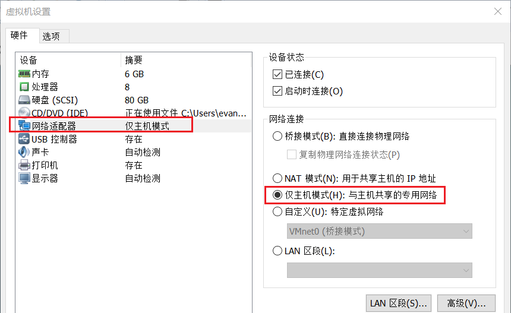
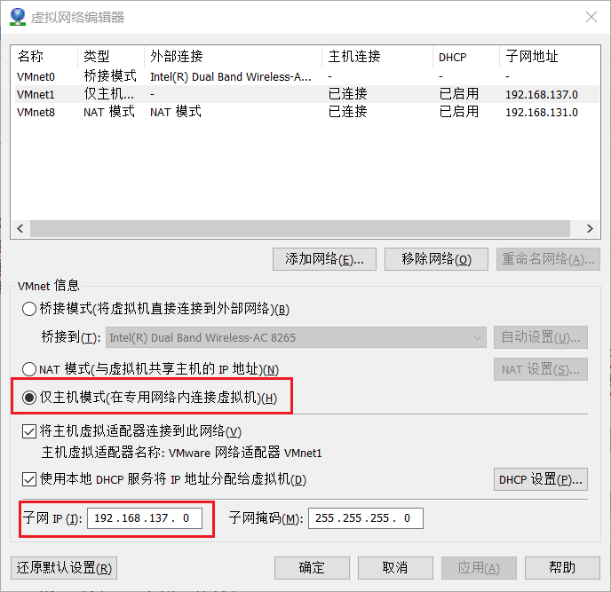
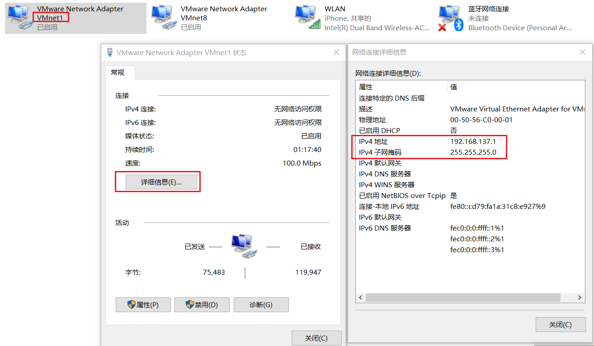
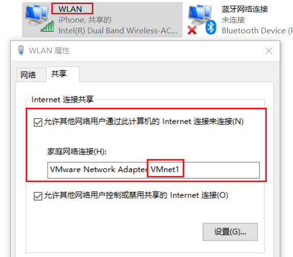

# VMware 使用仅主机模式上网

> - Vmware 实例使用仅主机模式（host-only mode）
> - 宿主机使用 WIFI 上网环境

1. 在虚拟机实例右键 -> 设置 -> 网络适配器 -> 仅主机模式。

   

2. VMware 顶部工具栏 -> 编辑 -> 虚拟网络编辑器 ，设置子网地址。示例中为 192.168.137.0

   

3. VMware 实例重新设置 IPv4 地址和网关。

   ```bash
   nano /etc/sysconfig/network-scripts/ifcfg-ens33
   ```

   ```bash
   TYPE=Ethernet
   PROXY_METHOD=none
   BROWSER_ONLY=no
   BOOTPROTO=none
   DEFROUTE=yes
   IPV4_FAILURE_FATAL=no
   IPV6INIT=yes
   IPV6_AUTOCONF=yes
   IPV6_DEFROUTE=yes
   IPV6_FAILURE_FATAL=no
   IPV6_ADDR_GEN_MODE=stable-privacy
   NAME=ens33
   UUID=336d1356-714c-4318-86cc-ebd94c397455
   DEVICE=ens33
   ONBOOT=yes
   IPADDR=192.168.137.12 #1
   PREFIX=24
   GATEWAY=192.168.137.1 #2
   IPV6_PRIVACY=no
   DNS1=8.8.8.8
   ```

   ip地址设置为192.168.137.X 即可。网关必须为 192.168.137.1。

   重启该VMware实例。

   ```bash
   reboot
   ```

4. 检查宿主机系统（示例中为Windows 10）设置。

   

5. 将宿主机 wifi 共享网络连接。

   

6. 测试 VMware 实例的上网环境。

   ```bash
   [root@master ~]# ping www.baidu.com
   PING www.wshifen.com (104.193.88.77) 56(84) bytes of data.
   64 bytes from 104.193.88.77 (104.193.88.77): icmp_seq=1 ttl=46 time=228 ms
   64 bytes from 104.193.88.77 (104.193.88.77): icmp_seq=2 ttl=41 time=247 ms
   64 bytes from 104.193.88.77 (104.193.88.77): icmp_seq=3 ttl=44 time=242 ms
   ```

   