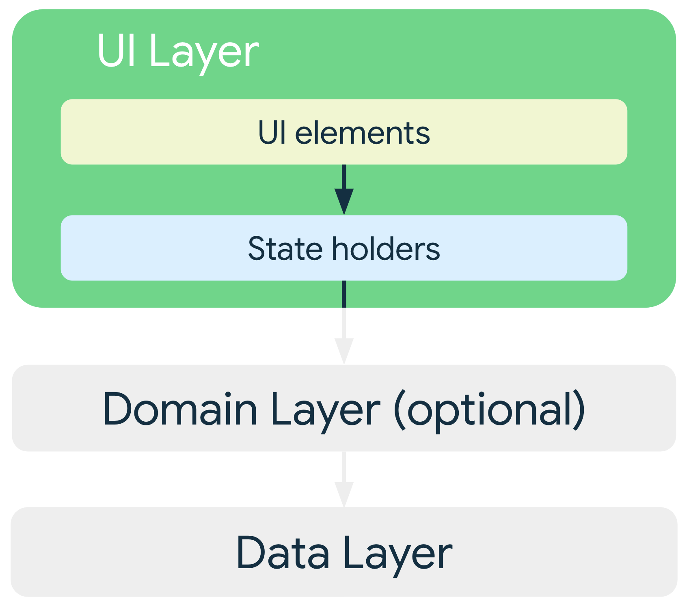

# 现代 Android 应用架构

[现代 Android 应用架构](https://developer.android.com/courses/pathways/android-architecture?hl=zh-cn)



- 界面层ui layer(compose as ui elements + viewModel as a state holder) 

- domain layer：网域层负责封装复杂的业务逻辑，或者由多个 ViewModel 重复使用的简单业务逻辑。

- 数据层data layer(repository)

- 管理组件之间的依赖关系。

  应用中的类要依赖其他类才能正常工作。您可以使用以下任一设计模式来收集特定类的依赖项：

  - [依赖注入 (DI)](https://developer.android.com/training/dependency-injection?hl=zh-cn)：依赖注入使类能够定义其依赖项而不构造它们。在运行时，另一个类负责提供这些依赖项。
  - [服务定位器](https://en.wikipedia.org/wiki/Service_locator_pattern)：服务定位器模式提供了一个注册表，类可以从中获取其依赖项而不构造它们。

  建议在 Android 应用中采用依赖项注入模式并使用 [Hilt 库](https://developer.android.com/training/dependency-injection/hilt-android?hl=zh-cn)。Hilt 通过遍历依赖项树自动构造对象，为依赖项提供编译时保证，并为 Android 框架类创建依赖项容器。

- 以下 Google 示例展示了良好的应用架构。

  - [Architecture](https://github.com/android/architecture-samples/tree/main) TOREAD
  - [Architecture starter template (single module)](https://github.com/android/architecture-templates/tree/base) TOREAD
  - [Architecture starter template (multi-module) ](https://github.com/android/architecture-templates/tree/multimodule) TOREAD


## 实际项目中的文件夹组织结构

在 Kotlin/Android 项目中，通常采用**分层架构**和**按功能分包**相结合的方式。以下是标准的 Clean Architecture 文件夹结构：

### 基础包结构

```
com.yourcompany.yourapp/
├── data/           # 数据层
├── domain/         # 领域层 (Use Case)
└── presentation/   # 表现层
```

### 详细结构示例

```
com.yourcompany.yourapp/
│
├── data/                           # 数据层
│   ├── model/                      # 数据模型 (DTO)
│   │   ├── UserEntity.kt
│   │   └── ProductEntity.kt
│   │
│   ├── repository/                  # Repository 实现
│   │   ├── UserRepositoryImpl.kt
│   │   └── ProductRepositoryImpl.kt
│   │
│   ├── local/                       # 本地数据源
│   │   ├── dao/
│   │   │   ├── UserDao.kt
│   │   │   └── ProductDao.kt
│   │   ├── database/
│   │   │   └── AppDatabase.kt
│   │   └── preferences/
│   │       └── UserPreferences.kt
│   │
│   └── remote/                      # 远程数据源
│       ├── api/
│       │   ├── UserApi.kt
│       │   └── ProductApi.kt
│       ├── model/
│       │   ├── UserResponse.kt
│       │   └── ProductResponse.kt
│       └── service/
│           └── ApiService.kt
│
├── domain/                          # 领域层
│   ├── model/                       # 领域模型
│   │   ├── User.kt
│   │   └── Product.kt
│   │
│   ├── repository/                   # Repository 接口
│   │   ├── UserRepository.kt
│   │   └── ProductRepository.kt
│   │
│   └── usercase/                     # Use Case (Interactor)
│       ├── user/                     # 按业务模块组织
│       │   ├── GetUserUseCase.kt
│       │   ├── UpdateUserUseCase.kt
│       │   └── ValidateUserUseCase.kt
│       ├── product/
│       │   ├── GetProductsUseCase.kt
│       │   └── SearchProductsUseCase.kt
│       └── checkout/
│           ├── CalculatePriceUseCase.kt
│           ├── ValidateOrderUseCase.kt
│           └── PlaceOrderUseCase.kt
│
└── presentation/                     # 表现层
    ├── theme/                        # 主题相关
    │   ├── Theme.kt
    │   └── Color.kt
    │
    ├── common/                       # 公共组件
    │   ├── components/
    │   │   ├── LoadingButton.kt
    │   │   └── ErrorDialog.kt
    │   └── utils/
    │       └── ViewExtensions.kt
    │
    └── features/                      # 按功能模块分包
        ├── auth/                       # 认证模块
        │   ├── LoginScreen.kt
        │   ├── RegisterScreen.kt
        │   ├── AuthViewModel.kt
        │   └── AuthState.kt
        │
        ├── home/                        # 首页模块
        │   ├── HomeScreen.kt
        │   ├── HomeViewModel.kt
        │   └── HomeState.kt
        │
        └── profile/                     # 个人资料模块
            ├── ProfileScreen.kt
            ├── EditProfileScreen.kt
            ├── ProfileViewModel.kt
            └── ProfileState.kt
```

## 各层内部文件示例

### Domain 层 - 定义接口和模型

```kotlin
// domain/model/User.kt
data class User(
    val id: String,
    val name: String,
    val email: String,
    val isVIP: Boolean
)

// domain/repository/UserRepository.kt
interface UserRepository {
    suspend fun getUser(id: String): User?
    suspend fun saveUser(user: User)
    suspend fun deleteUser(id: String)
}

// domain/usercase/user/GetUserUseCase.kt
class GetUserUseCase(
    private val repository: UserRepository
) {
    suspend operator fun invoke(id: String): Result<User> = try {
        val user = repository.getUser(id)
            ?: return Result.failure(Exception("User not found"))
        Result.success(user)
    } catch (e: Exception) {
        Result.failure(e)
    }
}
```

`Result<T>` 是 Kotlin 标准库（`kotlin` 包）提供的一个**密封类**，用于**封装可能成功或失败的操作结果**。

### **Data 层 - 实现接口**

```kotlin
// data/model/UserEntity.kt
@Entity(tableName = "users")
data class UserEntity(
    @PrimaryKey val id: String,
    val name: String,
    val email: String,
    val isVIP: Boolean
) {
    // 和domain对象类型之间互相转化的函数
    fun toDomain(): User = User(id, name, email, isVIP)
    
    companion object {
        fun fromDomain(user: User): UserEntity = 
            UserEntity(user.id, user.name, user.email, user.isVIP)
    }
}

// data/local/dao/UserDao.kt
@Dao
interface UserDao {
    @Query("SELECT * FROM users WHERE id = :id")
    suspend fun getUser(id: String): UserEntity?
    
    @Insert(onConflict = OnConflictStrategy.REPLACE)
    suspend fun insertUser(user: UserEntity)
}

// data/remote/api/UserApi.kt
interface UserApi {
    @GET("users/{id}")
    suspend fun getUser(@Path("id") id: String): UserResponse
}

// data/repository/UserRepositoryImpl.kt
class UserRepositoryImpl(
    private val local: UserDao,
    private val remote: UserApi
) : UserRepository {
    override suspend fun getUser(id: String): User? {
        // 尝试从本地获取
        local.getUser(id)?.let { return it.toDomain() }
        
        // 本地没有，从网络获取
        return try {
            val response = remote.getUser(id)
            val user = response.toEntity().toDomain()
            local.insertUser(response.toEntity())
            user
        } catch (e: Exception) {
            null
        }
    }
    
    override suspend fun saveUser(user: User) {
        local.insertUser(UserEntity.fromDomain(user))
    }
    
    override suspend fun deleteUser(id: String) {
        // 实现删除逻辑
    }
}
```

- UserDao 拿到的是 UserEntity
  - UserEntity 和 User 之间可以互相转化
- UserApi 拿到的是 UserResponse
  - UserResponse 可以被转化为 UserEntity，用于本地持久化

```kotlin
// data/remote/model/UserResponse.kt
data class UserResponse(
    val id: String,
    val firstName: String,
    val lastName: String,
    val emailAddress: String,
    val vipStatus: Boolean,
    val createdAt: String
)

// data/ext/UserResponseExt.kt (扩展函数文件)
fun UserResponse.toEntity(): UserEntity {
    return UserEntity(
        id = this.id,
        name = "${this.firstName} ${this.lastName}".trim(),
        email = this.emailAddress,
        isVIP = this.vipStatus
    )
}
```

### **Presentation 层 - UI 和 ViewModel**

```kotlin
// presentation/features/profile/ProfileState.kt
data class ProfileState(
    val isLoading: Boolean = false,
    val user: User? = null,
    val error: String? = null
)

// presentation/features/profile/ProfileViewModel.kt
class ProfileViewModel(
    private val getUserUseCase: GetUserUseCase
) : ViewModel() {
    
    private val _state = MutableStateFlow(ProfileState())
    val state: StateFlow<ProfileState> = _state.asStateFlow()
    
    fun loadUser(userId: String) {
        viewModelScope.launch {
            _state.update { it.copy(isLoading = true) }
            
            getUserUseCase(userId)
                .onSuccess { user ->
                    _state.update { it.copy(user = user, isLoading = false) }
                }
                .onFailure { error ->
                    _state.update { 
                        it.copy(error = error.message, isLoading = false) 
                    }
                }
        }
    }
}

// presentation/features/profile/ProfileScreen.kt
@Composable
fun ProfileScreen(
    viewModel: ProfileViewModel,
    userId: String
) {
    val state by viewModel.state.collectAsState()
    
    LaunchedEffect(userId) {
        viewModel.loadUser(userId)
    }
    
    when {
        state.isLoading -> LoadingIndicator()
        state.error != null -> ErrorMessage(state.error!!)
        state.user != null -> UserProfile(user = state.user!!)
    }
}
```

ErrorMessage 简易实现

```kotlin
@Composable
fun ErrorMessage(message: String) {
    Box(
        modifier = Modifier.fillMaxSize(),
        contentAlignment = Alignment.Center
    ) {
        Text(
            text = "错误: $message",
            color = MaterialTheme.colorScheme.error,
            fontSize = 16.sp
        )
    }
}
```

UserProfile 简易实现

```kotlin
@Composable
fun UserProfile(user: User) {
    Column(
        modifier = Modifier
            .fillMaxSize()
            .padding(16.dp)
    ) {
        Text(
            text = "用户信息",
            fontSize = 24.sp,
            fontWeight = FontWeight.Bold
        )
        
        Spacer(modifier = Modifier.height(16.dp))
        
        Text("ID: ${user.id}")
        Text("姓名: ${user.name}")
        Text("邮箱: ${user.email}")
        
        if (user.isVIP) {
            Text(
                text = "VIP 用户",
                color = Color(0xFFFFD700) // 金色
            )
        }
    }
}
```

