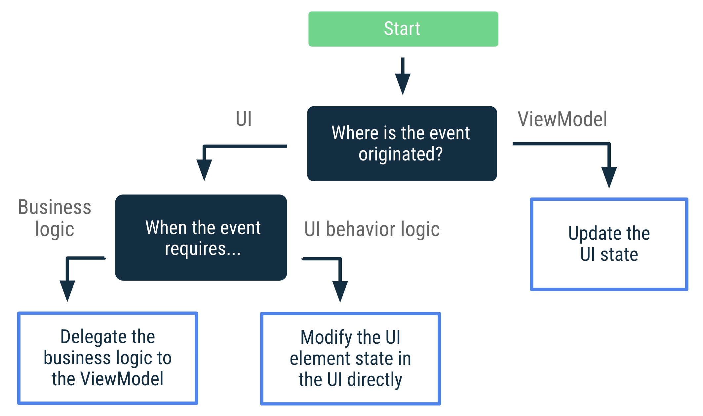
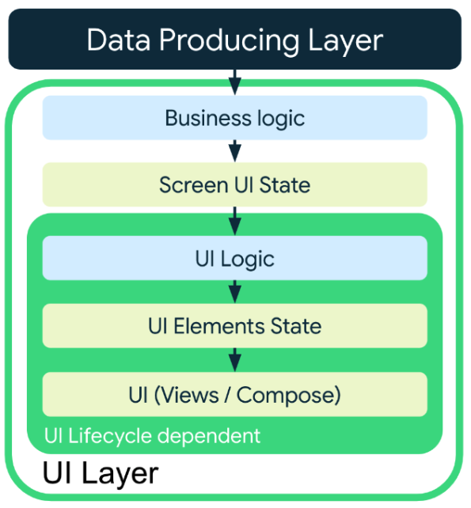
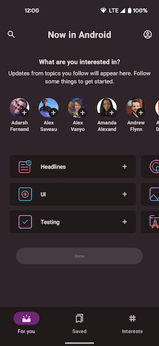
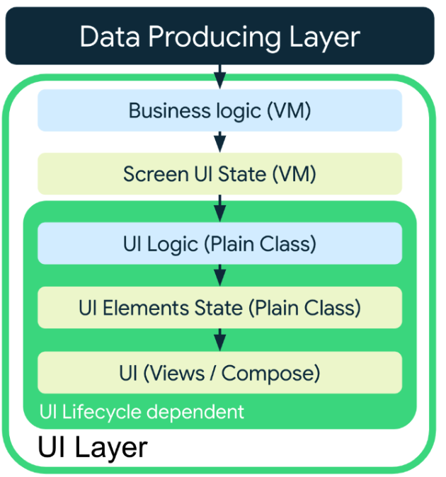
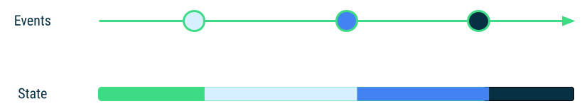
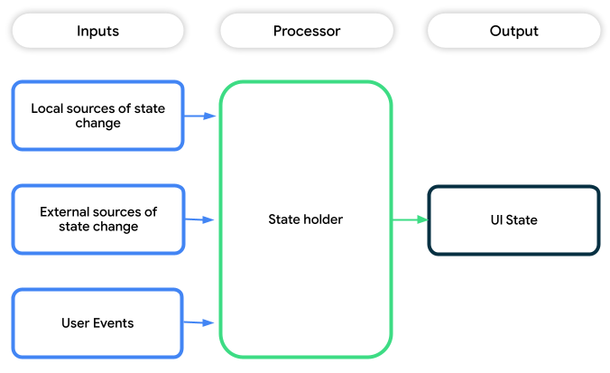

# 界面层

## 界面层简介

> 界面状态是呈现界面所需的详细信息的不可变快照。不过，应用中数据的动态特性意味着状态可能会随时间而变化。这可能是因为用户互动，也可能是因为其他事件修改了用于填充应用的底层数据。

状态向下流动、事件向上流动的这种模式称为单向数据流 (UDF)。这种模式对应用架构的影响如下：

- ViewModel 会存储并公开界面要使用的状态。界面状态是经过 ViewModel 转换的应用数据。
- 界面会向 ViewModel 发送用户事件通知，ViewModel 会处理用户操作并更新状态，更新后的状态将反馈给界面以进行呈现。
- 系统会对导致状态更改的所有事件重复上述操作。

您应在 `LiveData` 或 `StateFlow` 等可观察数据容器中公开界面状态。

> **注意**：在 Jetpack Compose 应用中，您可以使用 Compose 的可观察[状态 API](https://developer.android.com/jetpack/compose/state?hl=zh-cn#state-in-composables)（例如 `mutableStateOf` 或 `snapshotFlow`），以便公开界面状态。在 Compose 中，您可以通过适当的[扩展程序](https://developer.android.com/jetpack/compose/libraries?hl=zh-cn#streams)，轻松使用任何类型的可观察数据容器，例如 `StateFlow` 或 `LiveData`。

注意区分 Views 和 Compose 两种模式：

```kotlin
class NewsViewModel(...) : ViewModel() {

    // Views，这里 mutable -> read-only 也是一种常见的最佳实践
    private val _uiState = MutableStateFlow(NewsUiState())
    val uiState: StateFlow<NewsUiState> = _uiState.asStateFlow()

    ...
    
    // Compose 
    var uiState by mutableStateOf(NewsUiState())
        private set

}
```

下面是一段http请求列表数据的示范处理逻辑：

```kotlin
class NewsViewModel(
    private val repository: NewsRepository,
    ...
) : ViewModel() {

   var uiState by mutableStateOf(NewsUiState())
        private set

    private var fetchJob: Job? = null

    fun fetchArticles(category: String) {
        fetchJob?.cancel()
        fetchJob = viewModelScope.launch {
            try {
                val newsItems = repository.newsItemsForCategory(category)
                uiState = uiState.copy(newsItems = newsItems)
            } catch (ioe: IOException) {
                // Handle the error and notify the UI when appropriate.
                val messages = getMessagesFromThrowable(ioe)
                uiState = uiState.copy(userMessages = messages)
            }
        }
    }
}
```

关于UiState字段更新的一个优化思路：

- **`UiState` diffing**：`UiState` 对象中的字段越多，数据流就越有可能因为其中一个字段被更新而发出。由于视图没有 diffing 机制来了解连续发出的数据流是否相同，因此每次发出都会导致视图更新。这意味着，可能必须要对 `LiveData` 使用 `Flow` API 或 [`distinctUntilChanged()`](https://kotlin.github.io/kotlinx.coroutines/kotlinx-coroutines-core/kotlinx.coroutines.flow/distinct-until-changed.html) 等方法来缓解这个问题。

在界面中使用可观察数据容器时，请务必考虑界面的生命周期。

```kotlin
class NewsActivity : AppCompatActivity() {

    private val viewModel: NewsViewModel by viewModels()

    override fun onCreate(savedInstanceState: Bundle?) {
        ...

        lifecycleScope.launch {
            repeatOnLifecycle(Lifecycle.State.STARTED) {
                viewModel.uiState.collect {
                    // Update UI elements
                }
            }
        }
    }
}
```

### 显示正在执行的操作

```kotlin
data class NewsUiState(
    val isFetchingArticles: Boolean = false,
)
```

```kotlin
@Composable
fun LatestNewsScreen(
    modifier: Modifier = Modifier,
    viewModel: NewsViewModel = viewModel()
) {
    Box(modifier.fillMaxSize()) {

        if (viewModel.uiState.isFetchingArticles) {
            CircularProgressIndicator(Modifier.align(Alignment.Center))
        }

        // Add other UI elements. For example, the list.
    }
}
```

### 在屏幕上显示错误

```kotlin
data class Message(val id: Long, val message: String)

data class NewsUiState(
    val userMessages: List<Message> = listOf(),
)
```


### 线程处理和并发

在 ViewModel 中执行的所有工作都应具有主线程安全性（即从主线程调用是安全的）。这是基于响应时间的考量，任何复杂费时的操作，一律考虑使用协程处理，不要置于主线程中。


### 分页

参阅 [Android Paging Advanced Codelab](https://developer.android.com/codelabs/android-paging?hl=zh-cn#0)


### 动画

参阅 [Android Motion 示例](https://github.com/android/animation-samples/tree/main/Motion)


## 界面事件

> [界面事件  | Android Developers](https://developer.android.com/topic/architecture/ui-layer/events?hl=zh-cn)

界面事件决策树



代码示例

```kotlin
@Composable
fun LatestNewsScreen(viewModel: LatestNewsViewModel = viewModel()) {

    // State of whether more details should be shown
    var expanded by remember { mutableStateOf(false) }

    Column {
        Text("Some text")
        if (expanded) {
            Text("More details")
        }

        Button(
          // The expand details event is processed by the UI that
          // modifies this composable's internal state.
          onClick = { expanded = !expanded }
        ) {
          val expandText = if (expanded) "Collapse" else "Expand"
          Text("$expandText details")
        }

        // The refresh event is processed by the ViewModel that is in charge
        // of the UI's business logic.
        Button(onClick = { viewModel.refreshNews() }) {
            Text("Refresh data")
        }
    }
}
```

上面两个button分别对应UI行为逻辑和业务逻辑。

### RecyclerView 中的用户事件

```kotlin
data class NewsItemUiState(
    val title: String,
    val body: String,
    val bookmarked: Boolean = false,
    val publicationDate: String,
    val onBookmark: () -> Unit
)

class LatestNewsViewModel(
    private val formatDateUseCase: FormatDateUseCase,
    private val repository: NewsRepository
)
    val newsListUiItems = repository.latestNews.map { news ->
        NewsItemUiState(
            title = news.title,
            body = news.body,
            bookmarked = news.bookmarked,
            publicationDate = formatDateUseCase(news.publicationDate),
            // Business logic is passed as a lambda function that the
            // UI calls on click events.
            onBookmark = {
                repository.addBookmark(news.id)
            }
        )
    }
}
```

注意 onBookmark() 的实现。ViewModel 是通过 XXUiState 的 onBookmark() 接口来间接执行 addBookmark() 的。


### 处理 ViewModel 事件

- 源自 ViewModel 的界面操作（ViewModel 事件）应始终引发[界面状态](https://developer.android.com/jetpack/guide/ui-layer?hl=zh-cn#expose-ui-state)更新。
- 不需要考虑界面需要执行哪些操作，而是要思考这些操作会对界面状态造成什么影响。优先考虑数据的变化，界面是表象。


例如，要考虑在用户登录时从登录屏幕切换到主屏幕的情况。您可以在界面状态中进行如下建模：

```kotlin
class LoginViewModel : ViewModel() {
    var uiState by mutableStateOf(LoginUiState())
        private set
}

@Composable
fun LoginScreen(
    viewModel: LoginViewModel = viewModel(),
    onUserLogIn: () -> Unit
) {
    val currentOnUserLogIn by rememberUpdatedState(onUserLogIn)

    // Whenever the uiState changes, check if the user is logged in.
    LaunchedEffect(viewModel.uiState)  {
        if (viewModel.uiState.isUserLoggedIn) {
            currentOnUserLogIn()
        }
    }

    // Rest of the UI for the login screen.
}
```

- rememberUpdatedState(onUserLogIn) 这里使用rememberUpdatedXXX API来保证 onUserLogIn 持续监听最新的数据变化。

- `LaunchedEffect`的作用是类似于`useEffect` Hook，用于处理副作用或异步操作。在这里，它的作用是在`viewModel.uiState`变化时执行相应的操作，从而实现登录成功后的逻辑处理。`LaunchedEffect` 就是监听的含义，函数体就是相应的处理。


使用事件可能会触发状态更新。

```kotlin
// Models the UI state for the Latest news screen.
data class LatestNewsUiState(
    val news: List<News> = emptyList(),
    val isLoading: Boolean = false,
    val userMessage: String? = null
)
```

```kotlin
class LatestNewsViewModel(/* ... */) : ViewModel() {

    var uiState by mutableStateOf(LatestNewsUiState())
        private set

    fun refreshNews() {
        viewModelScope.launch {
            // If there isn't internet connection, show a new message on the screen.
            if (!internetConnection()) {
                uiState = uiState.copy(userMessage = "No Internet connection")
                return@launch
            }

            // Do something else.
        }
    }

    fun userMessageShown() {
        uiState = uiState.copy(userMessage = null)
    }
}
```

显示瞬时消息后，界面需要通知 ViewModel，这会引发另一个界面状态更新并清除 `userMessage` 属性。

```kotlin
@Composable
fun LatestNewsScreen(
    snackbarHostState: SnackbarHostState,
    viewModel: LatestNewsViewModel = viewModel(),
) {
    // Rest of the UI content.

    // If there are user messages to show on the screen,
    // show it and notify the ViewModel.
    viewModel.uiState.userMessage?.let { userMessage ->
        LaunchedEffect(userMessage) {
            snackbarHostState.showSnackbar(userMessage)
            // Once the message is displayed and dismissed, notify the ViewModel.
            viewModel.userMessageShown()
        }
    }
}
```

- `snackbarHostState.showSnackbar(userMessage)` 表示以 snackbar 显示消息。
- `viewModel.userMessageShown()` 表示重置记录的消息状态。


### 导航事件

```kotlin
@Composable
fun LoginScreen(
    onHelp: () -> Unit, // Caller navigates to the right screen
    viewModel: LoginViewModel = viewModel()
) {
    // Rest of the UI

    Button(onClick = onHelp) {
        Text("Get help")
    }
}
```

下面是一个更加复杂的例子。

```kotlin
@Composable
fun LoginScreen(
    onUserLogIn: () -> Unit, // Caller navigates to the right screen
    viewModel: LoginViewModel = viewModel()
) {
    Button(
        onClick = {
            // ViewModel validation is triggered
            viewModel.login()
        }
    ) {
        Text("Log in")
    }
    // Rest of the UI

    val lifecycle = LocalLifecycleOwner.current.lifecycle
    val currentOnUserLogIn by rememberUpdatedState(onUserLogIn)
    LaunchedEffect(viewModel, lifecycle)  {
        // Whenever the uiState changes, check if the user is logged in and
        // call the `onUserLogin` event when `lifecycle` is at least STARTED
        snapshotFlow { viewModel.uiState }
            .filter { it.isUserLoggedIn }
            .flowWithLifecycle(lifecycle)
            .collect {
                currentOnUserLogIn()
            }
    }
}
```


目的地保留在返回堆栈中时的导航事件。

假设您已进入应用的注册流程。在“出生日期”验证屏幕中，如果用户输入某个日期，当用户点按“继续”按钮时，ViewModel 会验证该日期。ViewModel 会将相应验证逻辑委托给数据层。如果日期有效，用户会进入下一个屏幕。**作为一项额外功能，用户可以在不同的注册屏幕之间来回切换，以便在想要更改某些数据时能够进行所需的操作**。因此，注册流程中的所有目的地都保留在同一个返回堆栈中。

```kotlin
class DobValidationViewModel(/* ... */) : ViewModel() {
    var uiState by mutableStateOf(DobValidationUiState())
        private set
}

@Composable
fun DobValidationScreen(
    onNavigateToNextScreen: () -> Unit, // Caller navigates to the right screen
    viewModel: DobValidationViewModel = viewModel()
) {
    // TextField that updates the ViewModel when a date of birth is selected

    var validationInProgress by rememberSaveable { mutableStateOf(false) }

    Button(
        onClick = {
            viewModel.validateInput()
            validationInProgress = true
        }
    ) {
        Text("Continue")
    }
    // Rest of the UI

    /*
     * The following code implements the requirement of advancing automatically
     * to the next screen when a valid date of birth has been introduced
     * and the user wanted to continue with the registration process.
     */

    if (validationInProgress) {
        val lifecycle = LocalLifecycleOwner.current.lifecycle
        val currentNavigateToNextScreen by rememberUpdatedState(onNavigateToNextScreen)
        LaunchedEffect(viewModel, lifecycle) {
            // If the date of birth is valid and the validation is in progress,
            // navigate to the next screen when `lifecycle` is at least STARTED,
            // which is the default Lifecycle.State for the `flowWithLifecycle` operator.
            snapshotFlow { viewModel.uiState }
                .filter { it.isDobValid }
                .flowWithLifecycle(lifecycle)
                .collect {
                    validationInProgress = false
                    currentNavigateToNextScreen()
                }
        }
    }
}
```


## 状态容器和界面状态

[状态容器和界面状态  | Android Developers](https://developer.android.com/topic/architecture/ui-layer/stateholders?hl=zh-cn)

[界面状态](https://developer.android.com/topic/architecture/ui-layer?hl=zh-cn#define-ui-state)是描述界面的属性。界面状态有两种类型：

- **屏幕界面状态**是需要在屏幕上显示的内容。例如，`NewsUiState` 类可以包含呈现界面所需的新闻报道和其他信息。由于该状态包含应用数据，因此通常会与层次结构中的其他层相关联。
- **界面元素状态**是指界面元素的固有属性，这些属性会影响界面元素的呈现方式。界面元素可能处于显示或隐藏状态，并且可能具有特定的字体、字号或颜色。在 Android View 中，View 会自行管理此状态（因为它本身是有状态的），并公开用于修改或查询其状态的方法。例如，[`TextView`](https://developer.android.com/reference/android/widget/TextView?hl=zh-cn) 类的 [`get`](https://developer.android.com/reference/android/widget/TextView?hl=zh-cn#getText()) 和 [`set`](https://developer.android.com/reference/android/widget/TextView?hl=zh-cn#setText(java.lang.CharSequence)) 方法用于显示该类的文本。在 Jetpack Compose 中，状态在可组合项之外，您甚至可以将状态从可组合项附近提升到执行调用的可组合函数或状态容器中。例如，[`Scaffold`](https://developer.android.com/reference/kotlin/androidx/compose/material/package-summary?hl=zh-cn#Scaffold(androidx.compose.ui.Modifier,androidx.compose.material.ScaffoldState,kotlin.Function0,kotlin.Function0,kotlin.Function1,kotlin.Function0,androidx.compose.material.FabPosition,kotlin.Boolean,kotlin.Function1,kotlin.Boolean,androidx.compose.ui.graphics.Shape,androidx.compose.ui.unit.Dp,androidx.compose.ui.graphics.Color,androidx.compose.ui.graphics.Color,androidx.compose.ui.graphics.Color,androidx.compose.ui.graphics.Color,androidx.compose.ui.graphics.Color,kotlin.Function1)) 可组合项的 [`ScaffoldState`](https://developer.android.com/reference/kotlin/androidx/compose/material/ScaffoldState?hl=zh-cn)。

### Android 生命周期以及界面状态和逻辑的类型

| 不依赖于界面生命周期 | 依赖于界面生命周期 |
| :------------------- | :----------------- |
| 业务逻辑             | 界面逻辑           |
| 屏幕界面状态         |                    |

### 界面状态生成流水线

- 由界面本身生成和管理的界面状态。例如，一个简单且可重复使用的基本计数器：

  ```kotlin
  @Composable
  fun Counter() {
      // The UI state is managed by the UI itself
      var count by remember { mutableStateOf(0) }
      Row {
          Button(onClick = { ++count }) {
              Text(text = "Increment")
          }
          Button(onClick = { --count }) {
              Text(text = "Decrement")
          }
      }
  }
  ```

- 界面逻辑 → 界面。例如，显示或隐藏允许用户跳转到列表顶部的按钮。

  ```kotlin
  @Composable
  fun ContactsList(contacts: List<Contact>) {
      val listState = rememberLazyListState()
      val isAtTopOfList by remember {
          derivedStateOf {
              listState.firstVisibleItemIndex < 3
          }
      }
  
      // Create the LazyColumn with the lazyListState
      ...
  
      // Show or hide the button (UI logic) based on the list scroll position
      AnimatedVisibility(visible = !isAtTopOfList) {
          ScrollToTopButton()
      }
  }
  ```

- 业务逻辑 → 界面。在屏幕上展示当前用户的照片的界面元素。

  ```kotlin
  @Composable
  fun UserProfileScreen(viewModel: UserProfileViewModel = hiltViewModel()) {
      // Read screen UI state from the business logic state holder
      val uiState by viewModel.uiState.collectAsStateWithLifecycle()
  
      // Call on the UserAvatar Composable to display the photo
      UserAvatar(picture = uiState.profilePicture)
  }
  ```

- 业务逻辑 → 界面逻辑 → 界面。会针对给定界面状态在屏幕上滚动以显示正确信息的界面元素。

  ```kotlin
  @Composable
  fun ContactsList(viewModel: ContactsViewModel = hiltViewModel()) {
      // Read screen UI state from the business logic state holder
      val uiState by viewModel.uiState.collectAsStateWithLifecycle()
      val contacts = uiState.contacts
      val deepLinkedContact = uiState.deepLinkedContact
  
      val listState = rememberLazyListState()
  
      // Create the LazyColumn with the lazyListState
      ...
  
      // Perform UI logic that depends on information from business logic
      if (deepLinkedContact != null && contacts.isNotEmpty()) {
          LaunchedEffect(listState, deepLinkedContact, contacts) {
              val deepLinkedContactIndex = contacts.indexOf(deepLinkedContact)
              if (deepLinkedContactIndex >= 0) {
                // Scroll to deep linked item
                listState.animateScrollToItem(deepLinkedContactIndex)
              }
          }
      }
  }
  ```



### 业务逻辑及其状态容器

业务逻辑状态容器通常使用 [`ViewModel`](https://developer.android.com/topic/libraries/architecture/viewmodel?gclid=CjwKCAjwv-GUBhAzEiwASUMm4jGM5Xw9jQrNGwjdH6dspujLXTiJAfDYLC3bOuur7QFYn1tRnojAKRoCqE0QAvD_BwE&%3Bgclsrc=aw.ds&hl=zh-cn) 实例来实现。

案例分析：


```kotlin
@HiltViewModel
class AuthorViewModel @Inject constructor(
    savedStateHandle: SavedStateHandle,
    private val authorsRepository: AuthorsRepository,
    newsRepository: NewsRepository
) : ViewModel() {

    val uiState: StateFlow<AuthorScreenUiState> = …

    // Business logic
    fun followAuthor(followed: Boolean) {
      …
    }
}
```

| 属性                             | 详细信息                                                     |
| :------------------------------- | :----------------------------------------------------------- |
| 生成 `AuthorScreenUiState`       | `AuthorViewModel` 从 `AuthorsRepository` 和 `NewsRepository` 中读取数据，并使用这些数据来生成 `AuthorScreenUiState`。通过委托给 `AuthorsRepository`，它还会在用户希望关注或取消关注 `Author` 时应用业务逻辑。 |
| 有权访问数据层                   | 将 `AuthorsRepository` 和 `NewsRepository` 的实例传递至其构造函数，从而让其实现遵循 `Author` 的业务逻辑。 |
| 在 `Activity` 重新创建后仍然有效 | 由于它是使用 [`ViewModel`](https://developer.android.com/topic/libraries/architecture/viewmodel?gclid=Cj0KCQjw4uaUBhC8ARIsANUuDjWnr2D2RL5QDLrOFZBl4TQSF7AF4hkuEEtsz1EV3fbPN-6DD4PLH1MaAvF1EALw_wcB&gclsrc=aw.ds&hl=zh-cn) 实现的，因此会在快速重新创建 `Activity` 后保留下来。在进程终止情形中，可以读取 [`SavedStateHandle`](https://developer.android.com/topic/libraries/architecture/viewmodel-savedstate?hl=zh-cn) 对象，以提供从数据层恢复界面状态所需的最少量信息。 |
| 具有长期存在的状态               | `ViewModel` 的作用域限定为导航图，因此，除非从导航图中移除作者目标位置，否则 `uiState` `StateFlow` 中的界面状态会保留在内存中。使用 `StateFlow` 还增加了通过应用业务逻辑来产生状态延迟的优势，因为只有当存在界面状态的收集器时才会生成状态。 |
| 对界面来说独一无二               | `AuthorViewModel` 仅适用于作者导航目的地，不能在其他地方重复使用。如果存在任何可为不同导航目的地重复使用的业务逻辑，该业务逻辑必须封装在数据层或网域层范围的组件中。 |

> **警告**：**请勿将 ViewModel 实例向下传递到其他可组合函数**。这样会导致可组合函数与 ViewModel 类型形成耦合，从而降低其可重用性。此外，没有明确的单一数据源 (SSOT) 可以管理 ViewModel 实例。向下传递 ViewModel 可允许多个可组合项调用 ViewModel 函数并修改其状态，从而导致更难以调试 bug。作为替代方案，请遵循 UDF 最佳实践并仅向下传递必要的状态。同样，请向上传递传播事件，直到它们到达 ViewModel 的可组合 SSOT。也就是 用于处理事件并调用相应 ViewModel 方法的 SSOT。


### 界面逻辑及其状态容器

界面逻辑状态容器与界面具有相同的生命周期。



Now in Android 示例会根据设备的屏幕大小来显示用于导航的底部应用栏或导航栏。较小的屏幕使用底部应用栏，较大的屏幕则使用导航栏。

由于决定 `NiaApp` 可组合函数中使用的适当导航界面元素的逻辑不依赖于业务逻辑，因此可以通过名称为 [`NiaAppState`](https://github.com/android/nowinandroid/blob/main/app/src/main/java/com/google/samples/apps/nowinandroid/ui/NiaAppState.kt) 的普通类状态容器来管理：

```kotlin
@Stable
class NiaAppState(
    val navController: NavHostController,
    val windowSizeClass: WindowSizeClass
) {

    // UI logic
    val shouldShowBottomBar: Boolean
        get() = windowSizeClass.widthSizeClass == WindowWidthSizeClass.Compact ||
            windowSizeClass.heightSizeClass == WindowHeightSizeClass.Compact

    // UI logic
    val shouldShowNavRail: Boolean
        get() = !shouldShowBottomBar

   // UI State
    val currentDestination: NavDestination?
        @Composable get() = navController
            .currentBackStackEntryAsState().value?.destination

    // UI logic
    fun navigate(destination: NiaNavigationDestination, route: String? = null) { /* ... */ }

     /* ... */
}
```

注意：建议为可重用的界面部分（如搜索栏或条状标签组）使用普通状态容器类。在这种情况下，您不应使用 ViewModel，因为 ViewModel 最适合用于管理导航目的地的状态和对业务逻辑的访问权限。


### 为状态容器选择 ViewModel 和普通类

下图显示了状态容器在界面状态生成流水线中的位置：




## 界面状态生成 

[界面状态生成  | Android Developers](https://developer.android.com/topic/architecture/ui-layer/state-production?hl=zh-cn)

事件和状态的区别。

**状态始终存在，而事件则不时发生**。下图以时间轴的形式直观展示了在事件发生时的状态变化。每个事件都由适当的[状态容器](https://developer.android.com/topic/architecture/ui-layer/stateholders?hl=zh-cn)进行处理，这会导致状态发生变化。



### 界面状态生成流水线




### 状态生成 API

| 流水线阶段 | API                                                          |
| :--------- | :----------------------------------------------------------- |
| 输入       | 应使用异步 API 在界面线程外执行工作，以保证界面不会卡顿。 例如 Kotlin 中的协程或 Flow，以及 Java 编程语言中的 RxJava 或回调。 |
| 输出       | 当状态发生变化时，应使用可观测的数据容器 API 使界面失效并重新渲染。例如 StateFlow、Compose State 或 LiveData。可观测的数据容器可保证界面始终具有要在屏幕上显示的界面状态。 |


### 状态生成流水线组建

- **可感知生命周期**：如果界面不可见或未处于活动状态，除非明确要求，否则状态生成流水线不应消耗任何资源。
- **易于使用**：界面应能够轻松呈现生成的界面状态。状态生成流水线输出的相关注意事项因不同的 View API（例如 View 系统或 Jetpack Compose）而异。


### 状态生成流水线中的输入

- 可能是同步或异步的一次性操作，例如对 `suspend` 函数的调用。
- 流 API，例如 `Flows`。

---

**使用一次性 API 作为状态变化来源**。

以简单的掷骰子应用中的状态更新为例。用户每次掷骰子都会调用同步 [`Random.nextInt()`](https://kotlinlang.org/api/latest/jvm/stdlib/kotlin.random/next-int.html) 方法，并且系统会将结果写入界面状态。

```kotlin
data class DiceUiState(
    val firstDieValue: Int? = null,
    val secondDieValue: Int? = null,
    val numberOfRolls: Int = 0,
)

class DiceRollViewModel : ViewModel() {

    private val _uiState = MutableStateFlow(DiceUiState())
    val uiState: StateFlow<DiceUiState> = _uiState.asStateFlow()

    // Called from the UI
    fun rollDice() {
        _uiState.update { currentState ->
            currentState.copy(
            firstDieValue = Random.nextInt(from = 1, until = 7),
            secondDieValue = Random.nextInt(from = 1, until = 7),
            numberOfRolls = currentState.numberOfRolls + 1,
            )
        }
    }
}
```

---

**通过异步调用更改界面状态**。

对于需要异步结果的状态更改，请在相应的 `CoroutineScope` 中启动协程。

以[架构示例](https://github.com/android/architecture-samples)中的 `AddEditTaskViewModel` 为例。当挂起的 `saveTask()` 方法异步保存任务时，MutableStateFlow 上的 [`update`](https://kotlinlang.org/api/kotlinx.coroutines/kotlinx-coroutines-core/kotlinx.coroutines.flow/update.html) 方法会将状态变化传播到界面状态。

```kotlin
data class AddEditTaskUiState(
    val title: String = "",
    val description: String = "",
    val isTaskCompleted: Boolean = false,
    val isLoading: Boolean = false,
    val userMessage: String? = null,
    val isTaskSaved: Boolean = false
)

class AddEditTaskViewModel(...) : ViewModel() {

   private val _uiState = MutableStateFlow(AddEditTaskUiState())
   val uiState: StateFlow<AddEditTaskUiState> = _uiState.asStateFlow()

   private fun createNewTask() {
        viewModelScope.launch {
            val newTask = Task(uiState.value.title, uiState.value.description)
            try {
                tasksRepository.saveTask(newTask)
                // Write data into the UI state.
                _uiState.update {
                    it.copy(isTaskSaved = true)
                }
            }
            catch(cancellationException: CancellationException) {
                throw cancellationException
            }
            catch(exception: Exception) {
                _uiState.update {
                    it.copy(userMessage = getErrorMessage(exception))
                }
            }
        }
    }
}
```

---

通过后台线程更改界面状态。

例如，假设在下面的 `DiceRollViewModel` 代码段中，`SlowRandom.nextInt()` 是一个计算密集型 `suspend` 函数，需要从受 CPU 限制的协程进行调用。

```kotlin
class DiceRollViewModel(
    private val defaultDispatcher: CoroutineScope = Dispatchers.Default
) : ViewModel() {

    private val _uiState = MutableStateFlow(DiceUiState())
    val uiState: StateFlow<DiceUiState> = _uiState.asStateFlow()

  // Called from the UI
  fun rollDice() {
        viewModelScope.launch() {
            // Other Coroutines that may be called from the current context
            …
            withContext(defaultDispatcher) {
                _uiState.update { currentState ->
                    currentState.copy(
                        firstDieValue = SlowRandom.nextInt(from = 1, until = 7),
                        secondDieValue = SlowRandom.nextInt(from = 1, until = 7),
                        numberOfRolls = currentState.numberOfRolls + 1,
                    )
                }
            }
        }
    }
}
```

---

使用流 API 作为状态变化来源

```kotlin
class InterestsViewModel(
    authorsRepository: AuthorsRepository,
    topicsRepository: TopicsRepository
) : ViewModel() {

    val uiState = combine(
        authorsRepository.getAuthorsStream(),
        topicsRepository.getTopicsStream(),
    ) { availableAuthors, availableTopics ->
        InterestsUiState.Interests(
            authors = availableAuthors,
            topics = availableTopics
        )
    }
        .stateIn(
            scope = viewModelScope,
            started = SharingStarted.WhileSubscribed(5_000),
            initialValue = InterestsUiState.Loading
    )
}
```

在大多数情况下，combine 都是从流 API 生成状态的可行方法。

使用 `stateIn` 运算符创建 `StateFlows`，可使界面能够更精细地控制状态生成流水线的活动，因为它可能只需在界面可见时才处于活动状态。

- 如果仅当界面可见，同时正在以生命周期感知方式收集数据流时，流水线才应处于活动状态，则使用 `SharingStarted.WhileSubscribed()`。
- 如果只要用户可能返回界面（即界面位于后台堆栈上或屏幕外的其他标签页中），流水线就应该处于活动状态，则使用 `SharingStarted.Lazily`。

---

使用一次性的流 API 作为状态变化来源。

```kotlin
class TaskDetailViewModel @Inject constructor(
    private val tasksRepository: TasksRepository,
    savedStateHandle: SavedStateHandle
) : ViewModel() {

    private val _isTaskDeleted = MutableStateFlow(false)
    private val _task = tasksRepository.getTaskStream(taskId)

    val uiState: StateFlow<TaskDetailUiState> = combine(
        _isTaskDeleted,
        _task
    ) { isTaskDeleted, task ->
        TaskDetailUiState(
            //taskAsync?
            task = taskAsync.data,
            isTaskDeleted = isTaskDeleted
        )
    }
        // Convert the result to the appropriate observable API for the UI
        .stateIn(
            scope = viewModelScope,
            started = SharingStarted.WhileSubscribed(5_000),
            initialValue = TaskDetailUiState()
        )

    fun deleteTask() = viewModelScope.launch {
        tasksRepository.deleteTask(taskId)
        _isTaskDeleted.update { true }
    }
}
```

### 状态生成流水线中的输出类型

下表总结了对于任何给定的输入和使用方，应该在状态生成流水线中使用哪些 API：

| 输入                | 使用方  | 输出                           |
| :------------------ | :------ | :----------------------------- |
| 一次性 API          | View    | `StateFlow` 或 `LiveData`      |
| 一次性 API          | Compose | `StateFlow` 或 Compose `State` |
| 流 API              | View    | `StateFlow` 或 `LiveData`      |
| 流 API              | Compose | `StateFlow`                    |
| 一次性 API 和流 API | View    | `StateFlow` 或 `LiveData`      |
| 一次性 API 和流 API | Compose | `StateFlow`                    |


### 状态生成流水线初始化

 定义一个[幂等函数](https://en.wikipedia.org/wiki/Idempotence) `initialize()` 函数，用于显式启动状态生成流水线：

```kotlin
class MyViewModel : ViewModel() {

    private var initializeCalled = false

    // This function is idempotent provided it is only called from the UI thread.
    @MainThread
    fun initialize() {
        if(initializeCalled) return
        initializeCalled = true

        viewModelScope.launch {
            // seed the state production pipeline
        }
    }
}
```