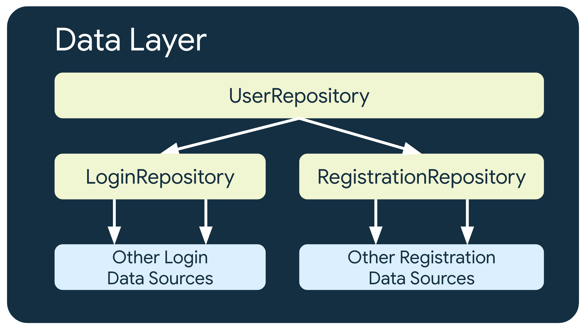

# 数据层

## 数据层简介

按照[依赖项注入](https://developer.android.com/training/dependency-injection?hl=zh-cn)方面的最佳实践，存储库应在其构造函数中将数据源作为依赖项（构造器注入模式）：

```kotlin
class ExampleRepository(
    private val exampleRemoteDataSource: ExampleRemoteDataSource, // network
    private val exampleLocalDataSource: ExampleLocalDataSource // database
) { /* ... */ }
```

### 公开 API

- **一次性操作**：在 Kotlin 中，数据层应公开挂起函数；对于 Java 编程语言，数据层应公开用于提供回调来通知操作结果的函数，或公开 RxJava `Single`、`Maybe` 或 `Completable` 类型。
- **接收关于数据随时间变化的通知**：在 Kotlin 中，数据层应公开[数据流](https://developer.android.com/kotlin/flow?hl=zh-cn)；对于 Java 编程语言，数据层应公开用于发出新数据的回调，或公开 RxJava `Observable` 或 `Flowable` 类型。

```kotlin
class ExampleRepository(
    private val exampleRemoteDataSource: ExampleRemoteDataSource, // network
    private val exampleLocalDataSource: ExampleLocalDataSource // database
) {

    // 公开数据流
    val data: Flow<Example> = ...

    // 公开挂起函数
    suspend fun modifyData(example: Example) { ... }
}
```


### 命名惯例

- 存储库类以其负责的数据命名。具体命名惯例如下：数据类型 + Repository。

例如：`NewsRepository`、`MoviesRepository` 或 `PaymentsRepository`。

- 数据源类以其负责的数据以及使用的来源命名。具体命名惯例如下：数据类型 + 来源类型 + DataSource。

对于数据的类型，可以使用 Remote 或 Local。例如：`NewsRemoteDataSource` 或 `NewsLocalDataSource`。在来源非常重要的情况下，为了更加具体，可以使用来源的类型。例如：`NewsNetworkDataSource` 或 `NewsDiskDataSource`。

请勿根据实现细节来为数据源命名（例如 `UserSharedPreferencesDataSource`），因为使用相应数据源的存储库应该不知道数据是如何保存的。不要依赖细节，而是要依赖抽象的接口。如果您遵循此规则，便可以更改数据源的实现（例如，从 [SharedPreferences](https://developer.android.com/training/data-storage/shared-preferences?hl=zh-cn) 迁移到 [DataStore](https://developer.android.com/topic/libraries/architecture/datastore?hl=zh-cn)），而不会影响调用相应数据源的层。


### 多层存储库

负责处理用户身份验证数据的存储库 `UserRepository` 可以依赖于其他存储库（例如 `LoginRepository` 和 `RegistrationRepository`），以满足其要求。



传统上，一些开发者将依赖于其他存储库类的存储库类称为 manager，例如称为 `UserManager` 而非 `UserRepository`。如果您愿意，可以使用此命名惯例。


### 可信来源

每个存储库都只定义单个可信来源，这一点非常重要。

应用中的不同存储库可以具有不同的可信来源。例如，`LoginRepository` 类可以将其缓存用作可信来源，`PaymentsRepository` 类则可以使用网络数据源。

为了提供离线优先支持，**建议使用本地数据源（例如数据库）作为可信来源**。


### 线程处理

大部分数据源都已提供具有主线程安全性的 API，例如 [Room](https://developer.android.com/training/data-storage/room?hl=zh-cn)、[Retrofit](https://square.github.io/retrofit/) 或 [Ktor](https://ktor.io/) 提供的挂起方法调用。

对于 Kotlin 用户，建议使用[协程](https://developer.android.com/kotlin/coroutines?hl=zh-cn)。


### 生命周期

某个类包含内存中的数据（例如缓存），您可能希望在特定时间段内重复使用该类的同一实例。这也称为类实例的生命周期。

- 如果该类的职责对于整个应用至关重要，可以将该类的实例的作用域限定为 `Application` 类。这可让该实例遵循应用的生命周期。

- 如果您只需要在应用内的特定流程（例如注册流程或登录流程）中重复使用同一实例，则应将该实例的作用域限定为负责相应流程的生命周期的类。例如，您可以将包含内存中数据的 `RegistrationRepository` 的作用域限定为 `RegistrationActivity`，或限定为注册流程的[导航图](https://developer.android.com/guide/navigation/navigation-getting-started?hl=zh-cn#create-nav-graph) 。


### 表示业务模式

假设有一个 News API 服务器，它不仅返回报道信息，还会返回修改记录、用户评论和部分元数据：

```kotlin
data class ArticleApiModel(
    val id: Long,
    val title: String,
    val content: String,
    val publicationDate: Date,
    val modifications: Array<ArticleApiModel>,
    val comments: Array<CommentApiModel>,
    val lastModificationDate: Date,
    val authorId: Long,
    val authorName: String,
    val authorDateOfBirth: Date,
    val readTimeMin: Int
)
```

该应用不需要这么多关于报道的信息，因为它在屏幕上只显示报道内容，以及关于作者的基本信息。**一种很好的做法是，分离模型类，并让存储库仅公开层次结构的其他层所需的数据。**以下代码段展示了如何从网络中删减 `ArticleApiModel`，以便将 `Article` 模型类公开给网域层和界面层：

```kotlin
data class Article(
    val id: Long,
    val title: String,
    val content: String,
    val publicationDate: Date,
    val authorName: String,
    val readTimeMin: Int
)
```

建议在数据源接收的数据与应用其余部分所需的数据不符时，创建新模型。


### 公开错误

- 对于协程和数据流，您应使用 Kotlin 的[内置错误处理机制](https://kotlinlang.org/docs/exception-handling.html)。

- 对于可能由挂起函数触发的错误，可使用 `try/catch` 代码块。如果使用这种方式，界面层应负责处理在调用数据层时出现的异常。

数据层可以理解和处理不同类型的错误，并可以使用自定义异常（例如 `UserNotAuthenticatedException`）公开这些错误。

若要为与数据层的互动结果建模，另一种方法是使用 `Result` 类。此模式会为在处理结果时可能出现的错误和其他信号进行建模。在此模式中，数据层会返回 `Result<T>` 类型，而非 `T`，以便让界面知道在特定情况下可能发生的已知错误。对于没有适当异常处理机制的反应式编程 API（例如 [LiveData](https://developer.android.com/topic/architecture/data-layer/topic/libraries/architecture/livedata?hl=zh-cn)）来说，必须要使用这种方法。


### 常见任务

#### 发出网络请求

1. 创建数据源。

```kotlin
class NewsRemoteDataSource(
  private val newsApi: NewsApi,
  private val ioDispatcher: CoroutineDispatcher
) {
    /**
     * Fetches the latest news from the network and returns the result.
     * This executes on an IO-optimized thread pool, the function is main-safe.
     */
    suspend fun fetchLatestNews(): List<ArticleHeadline> =
        // Move the execution to an IO-optimized thread since the ApiService
        // doesn't support coroutines and makes synchronous requests.
        withContext(ioDispatcher) {
            newsApi.fetchLatestNews()
        }
    }

// Makes news-related network synchronous requests.
interface NewsApi {
    fun fetchLatestNews(): List<ArticleHeadline>
}
```

`NewsApi` 接口会隐藏网络 API 客户端的实现；接口是由 [Retrofit](https://square.github.io/retrofit/) 还是由 [`HttpURLConnection`](https://developer.android.com/reference/java/net/HttpURLConnection?hl=zh-cn) 提供支持，并没有区别。

- 依赖于接口能够使 API 实现在应用中可交换。

- 还有利于进行测试，因为您可以在测试时注入虚构的数据源实现。

---

2. 创建存储库。

```kotlin
// NewsRepository is consumed from other layers of the hierarchy.
class NewsRepository(
    private val newsRemoteDataSource: NewsRemoteDataSource
) {
    suspend fun fetchLatestNews(): List<ArticleHeadline> =
        newsRemoteDataSource.fetchLatestNews()
}
```

#### 实现内存中数据缓存

假设为“新闻”应用引入了一项新的要求：当用户打开屏幕时，如果用户之前已发出请求，那么该应用必须向用户显示缓存的新闻。否则，该应用应发出网络请求以获取最新新闻。

鉴于这项新的要求，当用户已打开该应用时，该应用必须在内存中保留最新新闻。

---

缓存。

通过添加内存中数据缓存，您可以在用户位于您的应用中时保留数据。在此示例中，只要用户位于该应用中，就一直保存相应信息。缓存实现可以采用不同的形式。从简单的可变变量，到更为复杂、可以防止在多个线程上进行读/写操作的类。可以在存储库中实现缓存，也可以在数据源类中实现缓存。

---

缓存网络请求结果。

以下实现将最新新闻信息缓存到存储库中的一个变量，该变量由 `Mutex` 提供写保护。如果网络请求结果是成功，数据将分配给 `latestNews` 变量。

```kotlin
class NewsRepository(
  private val newsRemoteDataSource: NewsRemoteDataSource
) {
    // Mutex to make writes to cached values thread-safe.
    private val latestNewsMutex = Mutex()

    // Cache of the latest news got from the network.
    private var latestNews: List<ArticleHeadline> = emptyList()

    suspend fun getLatestNews(refresh: Boolean = false): List<ArticleHeadline> {
        if (refresh || latestNews.isEmpty()) {
            val networkResult = newsRemoteDataSource.fetchLatestNews()
            // Thread-safe write to latestNews
            latestNewsMutex.withLock {
                this.latestNews = networkResult
            }
        }

        return latestNewsMutex.withLock { this.latestNews }
    }
}
```

对 this.latestNews 变量的读写都被一个 Mutex 锁进行保护，因此线程安全。

---

让操作拥有比屏幕更长的生命周期。

场景：如果用户在网络请求正在进行时离开屏幕，系统将取消该请求，并且不会缓存结果。`NewsRepository` 不应使用调用方的 `CoroutineScope` 来执行此逻辑。`NewsRepository` 应使用附加到其生命周期的 `CoroutineScope`。**获取最新新闻必须是面向应用的操作。**

为了遵循依赖项注入方面的最佳实践，`NewsRepository` 应在其构造函数中接收一个作用域作为参数，而不是创建自己的 `CoroutineScope`。由于存储库应在后台线程中执行大部分工作，因此应使用 `Dispatchers.Default` 或您自己的线程池来配置 `CoroutineScope`

```kotlin
class NewsRepository(
    ...,
    // This could be CoroutineScope(SupervisorJob() + Dispatchers.Default).
    private val externalScope: CoroutineScope
) { ... }
```

完整代码逻辑如下：

```kotlin
class NewsRepository(
    private val newsRemoteDataSource: NewsRemoteDataSource,
    private val externalScope: CoroutineScope
) {
    /* ... */

    suspend fun getLatestNews(refresh: Boolean = false): List<ArticleHeadline> {
        return if (refresh) {
            externalScope.async {
                newsRemoteDataSource.fetchLatestNews().also { networkResult ->
                    // Thread-safe write to latestNews.
                    latestNewsMutex.withLock {
                        latestNews = networkResult
                    }
                }
            }.await()
        } else {
            return latestNewsMutex.withLock { this.latestNews }
        } 
    }
}
```

`async` 用于在外部作用域内启动协程。`await` 在新的协程上调用，以便在网络请求返回结果并且结果保存到缓存中之前，一直保持挂起状态。如果那时用户仍位于屏幕上，就会看到最新新闻；如果用户已离开屏幕，`await` 将被取消，但 `async` 内部的逻辑将继续执行。


#### 将数据保存到磁盘以及从磁盘检索数据

如果您处理的数据需要在进程终止后继续保留，则您需要通过以下方式之一将其存储在磁盘上：

- 对于需要查询、需要实现引用完整性或需要部分更新的大型数据集，请将数据保存在 Room 数据库中。在“新闻”应用示例中，新闻报道或作者信息可以保存在该数据库中。
- 对于只需要检索和设置（不需要查询，也不需要部分更新）的小型数据集，请使用 DataStore。在“新闻”应用示例中，用户的首选日期格式或其他显示偏好设置可以保存在 DataStore 中。
- 对于数据块（例如 JSON 对象），可以使用文件。

使用 Room 作为数据源。

例如，`NewsLocalDataSource` 可以接收 `NewsDao` 的实例作为参数，`AuthorsLocalDataSource` 则可以接收 `AuthorsDao` 的实例。

如果不需要额外的逻辑，您可以直接将 DAO 注入存储库，因为 DAO 是一种可以在测试中轻松替换的接口。

---

使用 DataStore 作为数据源

[DataStore](https://developer.android.com/topic/libraries/architecture/datastore?hl=zh-cn) 非常适合存储键值对，例如用户设置，具体示例可能包括时间格式、通知偏好设置，以及是显示还是隐藏用户已阅读的新闻报道。DataStore 还可以使用[协议缓冲区](https://developers.google.com/protocol-buffers?hl=zh-cn)来存储类型化对象。

例如，您可以创建一个仅处理通知相关偏好设置的 `NotificationsDataStore`，并创建一个仅处理新闻屏幕相关偏好设置的 `NewsPreferencesDataStore`。这样，您就可以更好地限定更新作用域，因为只有当与相应屏幕相关的偏好设置发生变化时，`newsScreenPreferencesDataStore.data` 流才会发出。这也意味着该对象的生命周期可以更短，因为它只能在新闻屏幕显示时存在。

详细了解如何使用 DataStore API，请参阅 [DataStore 指南](https://developer.android.com/topic/libraries/architecture/datastore?hl=zh-cn)。

---

使用文件作为数据源。

处理大型对象（例如 JSON 对象或位图）时，您需要使用 `File` 对象并处理线程切换。

详细了解如何使用文件存储空间，请参阅[存储空间概览](https://developer.android.com/training/data-storage?hl=zh-cn)页面。


#### 使用 WorkManager 调度任务

假设为“新闻”应用引入了一项新的要求：**只要设备正在充电并且已连接到不按流量计费的网络，该应用就必须为用户提供用于选择定期自动获取最新新闻的选项。**

我们创建了一个 [`Worker`](https://developer.android.com/topic/libraries/architecture/workmanager/advanced/coroutineworker?hl=zh-cn) 类：`RefreshLatestNewsWorker`。此类以 `NewsRepository` 作为依赖项，以便获取最新新闻并将其缓存到磁盘中。

```kotlin
class RefreshLatestNewsWorker(
    private val newsRepository: NewsRepository,
    context: Context,
    params: WorkerParameters
) : CoroutineWorker(context, params) {

    override suspend fun doWork(): Result = try {
        newsRepository.refreshLatestNews()
        Result.success()
    } catch (error: Throwable) {
        Result.failure()
    }
}
```

必须从 `NewsRepository` 调用这个与新闻相关的任务，前者会将一个新的数据源作为依赖项：`NewsTasksDataSource`。实现方式如下：

```kotlin
private const val REFRESH_RATE_HOURS = 4L
private const val FETCH_LATEST_NEWS_TASK = "FetchLatestNewsTask"
private const val TAG_FETCH_LATEST_NEWS = "FetchLatestNewsTaskTag"

class NewsTasksDataSource(
    private val workManager: WorkManager
) {
    fun fetchNewsPeriodically() {
        val fetchNewsRequest = PeriodicWorkRequestBuilder<RefreshLatestNewsWorker>(
            REFRESH_RATE_HOURS, TimeUnit.HOURS
        ).setConstraints(
            Constraints.Builder()
                .setRequiredNetworkType(NetworkType.TEMPORARILY_UNMETERED)
                .setRequiresCharging(true)
                .build()
        )
            .addTag(TAG_FETCH_LATEST_NEWS)

        workManager.enqueueUniquePeriodicWork(
            FETCH_LATEST_NEWS_TASK,
            ExistingPeriodicWorkPolicy.KEEP,
            fetchNewsRequest.build()
        )
    }

    fun cancelFetchingNewsPeriodically() {
        workManager.cancelAllWorkByTag(TAG_FETCH_LATEST_NEWS)
    }
}
```

如果任务需要在应用启动时触发，建议使用从 [`Initializer`](https://developer.android.com/reference/kotlin/androidx/startup/Initializer?hl=zh-cn) 调用存储库的 [App Startup](https://developer.android.com/topic/libraries/app-startup?hl=zh-cn) 库触发 WorkManager 请求。


### 测试

[WireMock](http://wiremock.org/) 或 [MockWebServer](https://github.com/square/okhttp/tree/master/mockwebserver) 让您可以模拟 HTTP 和 HTTPS 调用，可以了解一下。


## 离线优先

### 本地数据源

- 结构化数据源，例如 [Room](https://developer.android.com/training/data-storage/room?hl=zh-cn) 等关系型数据库。
- 非结构化数据源。例如，Datastore 的协议缓冲区。
- 简单文件

### 网络数据源

应用的网域层和界面层绝不应直接与网络层通信，而应由托管 `repository` 负责与其通信并用其更新本地数据源。

### 公开资源

```
data/
├─ local/
│ ├─ entities/
│ │ ├─ AuthorEntity
│ ├─ dao/
│ ├─ NiADatabase
├─ network/
│ ├─ NiANetwork
│ ├─ models/
│ │ ├─ NetworkAuthor
├─ model/
│ ├─ Author
├─ repository/
```

`AuthorEntity` 表示从应用的本地数据库读取的作者，而 `NetworkAuthor` 表示通过网络序列化的作者。

接下来是 `AuthorEntity` 和 `NetworkAuthor` 的详细信息：

```kotlin
/**
 * Network representation of [Author]
 */
@Serializable
data class NetworkAuthor(
    val id: String,
    val name: String,
    val imageUrl: String,
    val twitter: String,
    val mediumPage: String,
    val bio: String,
)

/**
 * Defines an author for either an [EpisodeEntity] or [NewsResourceEntity].
 * It has a many-to-many relationship with both entities
 */
@Entity(tableName = "authors")
data class AuthorEntity(
    @PrimaryKey
    val id: String,
    val name: String,
    @ColumnInfo(name = "image_url")
    val imageUrl: String,
    @ColumnInfo(defaultValue = "")
    val twitter: String,
    @ColumnInfo(name = "medium_page", defaultValue = "")
    val mediumPage: String,
    @ColumnInfo(defaultValue = "")
    val bio: String,
)
```

上面分别对网络模型和数据库存储模型进行建模。本质就是分别对应API和DB。然而App显示的是用户界面，因此还需要数据关于用户界面的一种模型，即View。

最好将 `AuthorEntity` 和 `NetworkAuthor` 都留在数据层内部，公开第三种类型供外部层使用。这可以保护外部层免受本地数据源和网络数据源从根本上改变应用行为的细微影响。如以下代码段所示：

```kotlin
/**
 * External data layer representation of a "Now in Android" Author
 */
data class Author(
    val id: String,
    val name: String,
    val imageUrl: String,
    val twitter: String,
    val mediumPage: String,
    val bio: String,
)
```

然后，网络模型可定义一种用于将其转换为本地模型的扩展方法，本地模型同样也可定义一种用于将其转换为外部表示形式的扩展方法，如下所示：

```kotlin
/**
 * Converts the network model to the local model for persisting
 * by the local data source
 */
fun NetworkAuthor.asEntity() = AuthorEntity(
    id = id,
    name = name,
    imageUrl = imageUrl,
    twitter = twitter,
    mediumPage = mediumPage,
    bio = bio,
)

/**
 * Converts the local model to the external model for use
 * by layers external to the data layer
 */
fun AuthorEntity.asExternalModel() = Author(
    id = id,
    name = name,
    imageUrl = imageUrl,
    twitter = twitter,
    mediumPage = mediumPage,
    bio = bio,
)
```

个人觉得命名可以这样改进：NetworkAuthor/DatabaseAuthor/UiAuthor。


### 读取

```kotlin
class OfflineFirstTopicsRepository(
    private val topicDao: TopicDao,
    private val network: NiaNetworkDataSource,
) : TopicsRepository {

    override fun getTopicsStream(): Flow<List<Topic>> =
        topicDao.getTopicEntitiesStream()
            .map { it.map(TopicEntity::asExternalModel) }
}
```

从离线优先应用中的存储库读取数据**应直接从本地数据源读取**。所有更新均应先写入本地数据源，本地数据源会更新其使用方，因为它可观察。

1.当读取本地数据源发生错误：

```kotlin
class AuthorViewModel(
    authorsRepository: AuthorsRepository,
    ...
) : ViewModel() {
   private val authorId: String = ...

   // Observe author information
    private val authorStream: Flow<Author> =
        authorsRepository.getAuthorStream(
            id = authorId
        )
        .catch { emit(Author.empty()) }
}
```

2.从网络数据源读取数据时如果发生错误：

应用需要**采用启发法来重试提取数据**。常见的启发法包括：

- ##### 指数退避算法。

  评估应用是否应继续退避的标准包括：

  - 网络数据源指出的错误类型。例如，如果网络调用返回的错误指出没有连接，就应该重试该网络调用。反之，如果 HTTP 请求未获授权，那么在获得正确的凭据之前，就不应重试该 HTTP 请求。也就是重试具有价值意义时，应该重试，否则不要白费力气。
  - 允许的最大重试次数。

- ##### 网络连接监控。

  这个方式就是持续监控网络状态，一旦网络恢复，就可以通知用户可以重试了。在此方法中，在应用确定可以连接到网络数据源之前，系统会将读取请求加入队列。连接建立后，系统会将读取请求移出队列，读取数据并更新本地数据源。在 Android 上，可使用 Room 数据库维护此队列，并使用 WorkManager 将其作为持久性工作排空。


### 写入

```kotlin
interface UserDataRepository {
    /**
     * Updates the bookmarked status for a news resource
     */
    suspend fun updateNewsResourceBookmark(newsResourceId: String, bookmarked: Boolean)
}
```

下面是写入策略的讨论：

- 尝试跨网络边界写入数据。如果成功，就更新本地数据源，否则抛出异常并留待调用方进行适当响应。这种方式的案例是银行转账。
- 加入队列的写入。如果您有想要写入的对象，请将其插入队列。当应用恢复在线状态时，继续使用指数退避算法排空队列。在 Android 上，排空离线队列是一项持久性工作，通常委托给 [`WorkManager`](https://developer.android.com/topic/libraries/architecture/workmanager?hl=zh-cn) 。这种方式适用的场景有如下特点：将数据写入网络并非必不可少；事务对时效的要求不高；如果操作失败，并非一定要通知用户。

- 延迟写入。先写入本地数据源，然后将写入请求加入队列，以便尽快通知网络数据源。写入本地数据源这一步很容易完成，但是写入请求队列这一步的持久化维护非常复杂，因为用户可能会直接在中途直接关掉这个应用或者手机。此时请求队列的一些积压的请求任务该如何处理才能不丢失？如果放任丢失，那么本地数据库的数据和远程数据库对应的数据就会存在不一致。因此这个方式一般不优先考虑。


### 同步和解决冲突

离线优先应用恢复连接时，需要使本地数据源中的数据与网络数据源中的数据一致。此过程称为**同步**。应用与网络数据源同步主要有两种方式：

- 基于拉取的同步
- 基于推送的同步

#### 基于拉取的同步

在没有网络连接的情况下，存储库可以只向本地数据源请求数据。以下是 [Jetpack Paging 库](https://developer.android.com/topic/libraries/architecture/paging/v3-network-db?hl=zh-cn)通过其 [RemoteMediator](https://developer.android.com/reference/kotlin/androidx/paging/RemoteMediator?hl=zh-cn) API 使用的模式

```kotlin
class FeedRepository(...) {

    fun feedPagingSource(): PagingSource<FeedItem> { ... }
}

class FeedViewModel(
    private val repository: FeedRepository
) : ViewModel() {
    private val pager = Pager(
        config = PagingConfig(
            pageSize = NETWORK_PAGE_SIZE,
            enablePlaceholders = false
        ),
        remoteMediator = FeedRemoteMediator(...),
        pagingSourceFactory = feedRepository::feedPagingSource
    )

    val feedPagingData = pager.flow
}
```

下表总结了基于拉取的同步的优缺点：

| 优点                     | 缺点                                                         |
| :----------------------- | :----------------------------------------------------------- |
| 实现相对容易。           | 容易消耗大量流量。这是因为重复访问导航目的地会触发不必要的操作，重新提取未更改的信息。您可以通过适当的缓存来减少此问题。若要使用缓存，可在界面层使用 [`cachedIn`](https://developer.android.com/reference/kotlin/androidx/paging/package-summary?hl=zh-cn#(kotlinx.coroutines.flow.Flow).cachedIn(kotlinx.coroutines.CoroutineScope)) 操作符或在网络层使用 HTTP 缓存。 |
| 绝不会提取不需要的数据。 | 不能使用关系型数据很好地扩展，因为拉取的模型需要自给自足。如果待同步的模型依赖于需要提取的其他模型来填充自己，那么上面提到的消耗大量流量的问题将变得更加严重。此外，它还可能导致父模型的存储库与嵌套模型的存储库之间存在依赖关系。 |

#### 基于推送的同步

在基于推送的同步中，本地数据源会尽力尝试模拟网络数据源的副本集。它会**在首次启动时主动提取适当数量的数据来设置基准，之后依靠来自服务器的通知提醒自己数据何时过时**。

```kotlin
class UserDataRepository(...) {

    suspend fun synchronize() {
        val userData = networkDataSource.fetchUserData()
        localDataSource.saveUserData(userData)
    }
}
```

在此方法中，应用对网络数据源的依赖要低得多，而且长时间无法使用网络数据源也能正常运行。它可以在离线状态下提供读写访问，因为系统假定本地存储着来自网络数据源的最新信息。

下表总结了基于推送的同步的优缺点：

| 优点                                                         | 缺点                                       |
| :----------------------------------------------------------- | :----------------------------------------- |
| 应用可以无限期离线使用。                                     | 为了解决冲突，对数据进行版本控制非常重要。 |
| 可将流量消耗降到最低。应用仅提取经过更改的数据。             | 需要考虑同步期间的写入问题。               |
| 非常适合关系型数据。每个存储库只负责为其支持的模型提取数据。 | 网络数据源需要支持同步。                   |


### 冲突解决

如果应用处于离线状态时在本地写入的数据与网络数据源的数据不一致，说明存在冲突，必须解决冲突后才能进行同步。

解决冲突问题通常需要借助版本控制。应用需要通过一些簿记来跟踪发生更改的时间。这样，它就能将元数据传递给网络数据源。**然后，由网络数据源负责提供绝对可信来源**。根据应用的需求，可以考虑的冲突解决策略还有很多。对于移动应用，常见的方法是“最后写入内容生效”。

last write wins.

在此方法中，设备将时间戳元数据附加到其写入网络数据源的数据中。网络数据源在收到这些数据后，会舍弃比当前状态旧的所有数据而接受比当前状态新的数据。


### 离线优先应用中的 WorkManager

在前面介绍的读取和写入策略中，有两个常用的实用程序：

- 队列
  - 读取：用于将读取操作**推迟**到网络连接可用时。
  - 写入：用于将写入操作**推迟**到网络连接可用时，并将写入操作重新加入队列进行重试。
- 网络连接监视器
  - 读取：在应用连接时用作排空读取队列的信号，也用于同步
  - 写入：在应用连接时用作排空写入队列的信号，也用于同步

代码示例：

```kotlin
class SyncInitializer : Initializer<Sync> {
   override fun create(context: Context): Sync {
       WorkManager.getInstance(context).apply {
           // Queue sync on app startup and ensure only one
           // sync worker runs at any time
           enqueueUniqueWork(
               SyncWorkName,
               ExistingWorkPolicy.KEEP,
               SyncWorker.startUpSyncWork()
           )
       }
       return Sync
   }
}
```

使用 [WorkManager](https://developer.android.com/topic/libraries/architecture/workmanager?gclid=Cj0KCQjwio6XBhCMARIsAC0u9aHzO8I5koMyVoXhyCg9M5fkH4CnUhjDAo4MlC5lgKV2kO9iUTsMaEcaAsWDEALw_wcB&%3Bgclsrc=aw.ds&hl=zh-cn) 将同步工作加入队列后，使用 `KEEP` [`ExistingWorkPolicy`](https://developer.android.com/reference/androidx/work/ExistingWorkPolicy?hl=zh-cn) 将其指定为[唯一工作](https://developer.android.com/topic/libraries/architecture/workmanager/how-to/managing-work?hl=zh-cn#unique-work) 。

其中，`SyncWorker.startupSyncWork()` 的定义如下：

```kotlin
/**
 Create a WorkRequest to call the SyncWorker using a DelegatingWorker.
 This allows for dependency injection into the SyncWorker in a different
 module than the app module without having to create a custom WorkManager
 configuration.
*/
fun startUpSyncWork() = OneTimeWorkRequestBuilder<DelegatingWorker>()
    // Run sync as expedited work if the app is able to.
    // If not, it runs as regular work.
   .setExpedited(OutOfQuotaPolicy.RUN_AS_NON_EXPEDITED_WORK_REQUEST)
   .setConstraints(SyncConstraints)
    // Delegate to the SyncWorker. delegatedData() ?
   .setInputData(SyncWorker::class.delegatedData())
   .build()

val SyncConstraints
   get() = Constraints.Builder()
       .setRequiredNetworkType(NetworkType.CONNECTED)
       .build()
```

由 `SyncConstraints` 定义的 [`Constraints`](https://developer.android.com/reference/androidx/work/Constraints?hl=zh-cn) 要求 [`NetworkType`](https://developer.android.com/reference/androidx/work/NetworkType?hl=zh-cn) 为 `NetworkType.CONNECTED`。它会等到网络可用后再运行。

当网络可用后，[工作器](https://developer.android.com/reference/androidx/work/Worker?hl=zh-cn)将 `SyncWorkName` 指定的唯一工作队列委托给适当的 `Repository` 实例来排空该队列。

- 如果同步失败，`doWork()` 方法会返回 `Result.retry()`。WorkManager 将采用指数退避算法自动重试同步。
- 否则，返回 `Result.success()` 完成同步。

```kotlin
class SyncWorker(...) : CoroutineWorker(appContext, workerParams), Synchronizer {

    override suspend fun doWork(): Result = withContext(ioDispatcher) {
        // First sync the repositories in parallel
        val syncedSuccessfully = awaitAll(
            async { topicRepository.sync() },
            async { authorsRepository.sync() },
            async { newsRepository.sync() },
        ).all { it }

        if (syncedSuccessfully) Result.success()
        else Result.retry()
    }
}
```

案例参考：[Now in Android App](https://github.com/android/nowinandroid/tree/main) 。