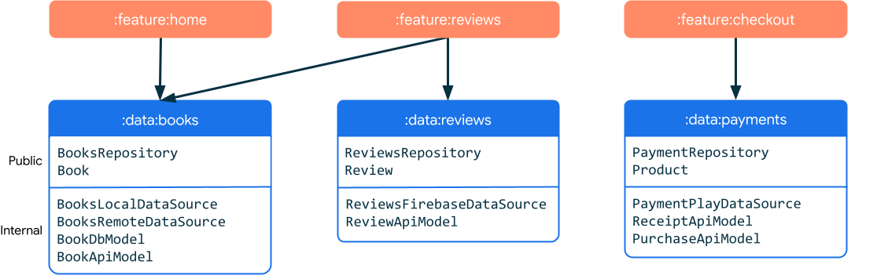
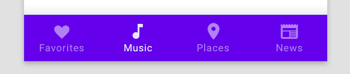
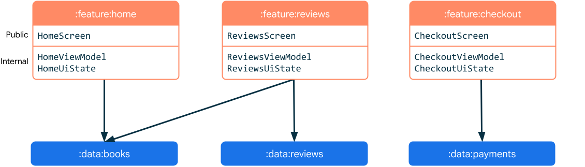
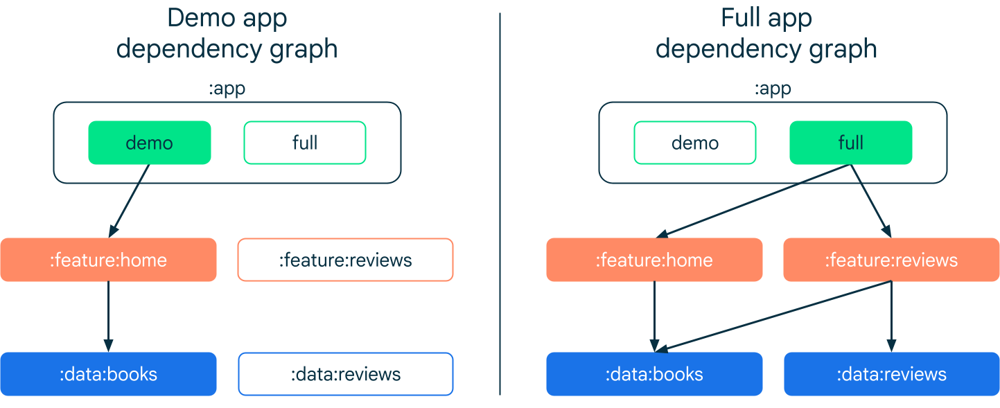
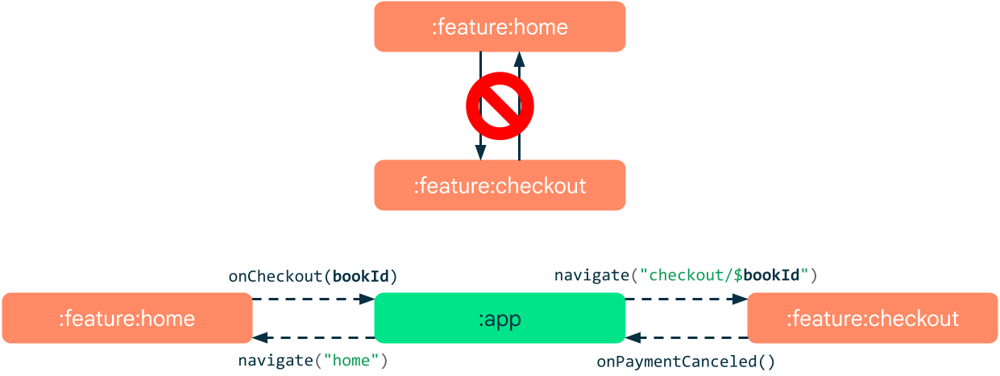
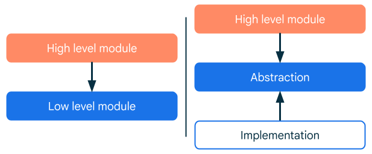

# Android 应用模块化指南

## 模块类型

### 数据模块




### 功能模块



功能与应用中的页面或目标位置相关联。因此，它们可能具有相关联的界面和 `ViewModel`，用于[处理其逻辑和状态](https://developer.android.com/topic/architecture/ui-layer/stateholders?hl=zh-cn)。一项功能并不一定仅限于单一视图或导航目标位置。**功能模块依赖于数据模块。**



### 应用模块

应用模块是应用的入口点。它们依赖于功能模块，并且通常提供根导航。



### 通用模块

通用模块（也称为核心模块）包含其他模块经常使用的代码。它们可减少冗余，并且不代表应用架构中的任何特定层。下面列出了通用模块的一些示例：

- **界面模块**：如果您在应用中使用自定义界面元素或精心设计品牌元素，则应考虑将 widget 集合封装到一个模块中，以便重复使用所有功能。
- **分析模块**：跟踪通常取决于业务需求，而几乎不用考虑软件架构。分析跟踪器经常应用于许多不相关的组件。
- **网络模块**：当许多模块需要网络连接时，您可以考虑创建一个专用于提供 http 客户端的模块。当客户端需要自定义配置，该模块尤为实用。例如二次封装Retrofit或者okhttp库。
- **实用程序模块**：实用程序（也称为辅助程序）通常是在应用中重复使用的小段代码。实用程序的示例包括测试辅助程序、货币格式设置函数、电子邮件验证程序和自定义运算符。常见的util工具应该就放于这里。


### 测试模块

/


## 模块间通信



有时，与架构约束一样，两个模块之间进行直接通信是不可取的方式。

在我们的示例应用中，即使事件源自属于不同功能的单独页面，结账页面也需要知道要购买哪本图书。在这种情况下，拥有导航图的模块将充当中间模块（通常是应用模块）。在此示例中，我们使用[**导航**](https://developer.android.com/guide/navigation/navigation-pass-data?hl=zh-cn)组件将数据从主屏幕功能传递至结账功能。

```kotlin
navController.navigate("checkout/$bookId")
```

结账目标接收图书 ID 作为参数，用于获取图书的相关信息。可使用[已保存的状态句柄](https://developer.android.com/topic/libraries/architecture/viewmodel-savedstate?hl=zh-cn)来检索目标功能的 `ViewModel` 内的导航参数。

```kotlin
class CheckoutViewModel(savedStateHandle: SavedStateHandle, …) : ViewModel() {

   val uiState: StateFlow<CheckoutUiState> =
      savedStateHandle.getStateFlow<String>("bookId", "").map { bookId ->
          // produce UI state calling bookRepository.getBook(bookId)
      }
      …
}
```


## 依赖项反转

依赖于抽象模块中定义的行为的模块应仅依赖于抽象本身，而不是特定的实现。=> 面向接口编程。



功能模块如何与实现模块连接？答案是[依赖项注入](https://developer.android.com/training/dependency-injection?hl=zh-cn)。功能模块不会直接创建所需的数据库实例，而是指定所需的依赖项。然后，从外部提供（通常位于[应用模块](https://developer.android.com/topic/modularization/patterns?hl=zh-cn#app-modules)中）这些依赖项。

```kotlin
releaseImplementation(project(":database:impl:firestore"))

debugImplementation(project(":database:impl:room"))

androidTestImplementation(project(":database:impl:mock"))
```


## 多模块项目的导航最佳实践

>[多模块项目的导航最佳实践  | Android Developers](https://developer.android.com/guide/navigation/integrations/multi-module?hl=zh-cn)

如下图所示，`app` 模块依赖于每个功能模块，并会将其作为实现详情添加到自己的 `build.gradle` 文件中：

```kotlin
dependencies {
    ...
    implementation(project(":feature:home"))
    implementation(project(":feature:favorites"))
    implementation(project(":feature:settings"))
```


### app 模块中的顶级导航

示例 `app` 模块在其主 activity 中定义了 [`BottomNavigationView`](https://developer.android.com/reference/com/google/android/material/bottomnavigation/BottomNavigationView?hl=zh-cn)。菜单中的菜单项 ID 与库图的导航图 ID 匹配。

```xml
<?xml version="1.0" encoding="utf-8"?>
<menu xmlns:android="http://schemas.android.com/apk/res/android"
    xmlns:app="http://schemas.android.com/apk/res-auto">

    <item
        android:id="@id/home_nav_graph"
        android:icon="@drawable/ic_home"
        android:title="Home"
        app:showAsAction="ifRoom"/>

    <item
        android:id="@id/favorites_nav_graph"
        android:icon="@drawable/ic_favorite"
        android:title="Favorites"
        app:showAsAction="ifRoom"/>

    <item
        android:id="@id/settings_nav_graph"
        android:icon="@drawable/ic_settings"
        android:title="Settings"
        app:showAsAction="ifRoom" />
</menu>
```


### 跨功能模块导航

可以在设置导航图中添加目的地的深层链接的定义。

```xml
<?xml version="1.0" encoding="utf-8"?>
<navigation xmlns:android="http://schemas.android.com/apk/res/android"
    xmlns:app="http://schemas.android.com/apk/res-auto"
    xmlns:tools="http://schemas.android.com/tools"
    android:id="@+id/settings_nav_graph"
    app:startDestination="@id/settings_fragment_one">

    ...

    <fragment
        android:id="@+id/settings_fragment_two"
        android:name="com.example.google.login.SettingsFragmentTwo"
        android:label="@string/settings_fragment_two" >

        <deepLink
            app:uri="android-app://example.google.app/settings_fragment_two" />
    </fragment>
</navigation>
```

用例：

```kotlin
button.setOnClickListener {
    val request = NavDeepLinkRequest.Builder
        .fromUri("android-app://example.google.app/settings_fragment_two".toUri())
        .build()
    findNavController().navigate(request)
}
```

