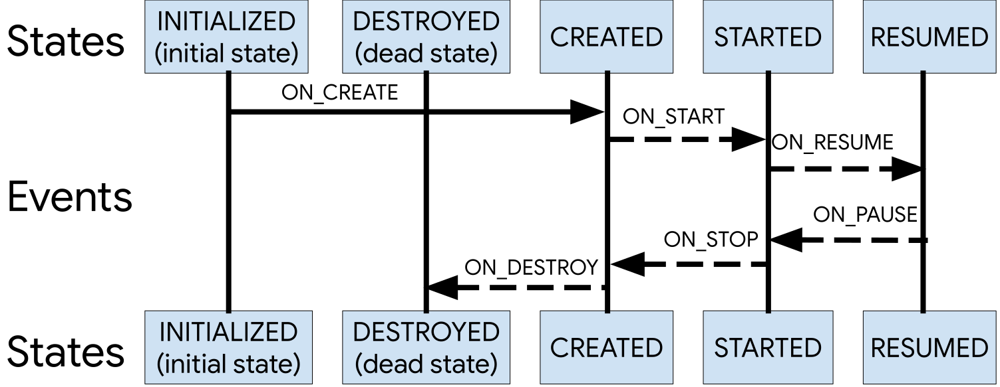
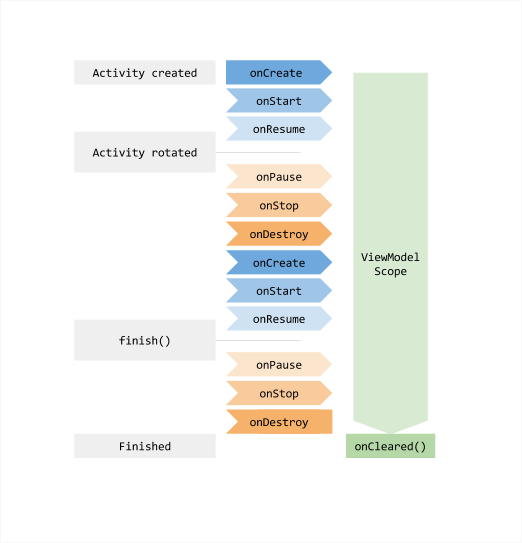

# 生命周期感知型组件

## 生命周期

### 使用生命周期感知型组件处理生命周期

一种常见的模式是在 activity 和 fragment 的生命周期方法中实现依赖组件的操作。但是，这种模式会导致代码条理性很差而且会扩散错误。通过使用生命周期感知型组件，您可以将依赖组件的代码从生命周期方法移入组件本身内。

假设我们有一个在屏幕上显示设备位置信息的 activity。常见的实现可能如下所示：

```kotlin
internal class MyLocationListener(
        private val context: Context,
        private val callback: (Location) -> Unit
) {

    fun start() {
        // connect to system location service
    }

    fun stop() {
        // disconnect from system location service
    }
}

class MyActivity : AppCompatActivity() {
    private lateinit var myLocationListener: MyLocationListener

    override fun onCreate(...) {
        myLocationListener = MyLocationListener(this) { location ->
            // update UI
        }
    }

    public override fun onStart() {
        super.onStart()
        myLocationListener.start()
        // manage other components that need to respond
        // to the activity lifecycle
    }

    public override fun onStop() {
        super.onStop()
        myLocationListener.stop()
        // manage other components that need to respond
        // to the activity lifecycle
    }
}
```

虽然此示例看起来没问题，但在真实的应用中，为了响应生命周期的当前状态，将会进行过多的调用来管理界面和其他组件。管理多个组件会在生命周期方法（如 `onStart()` 和 `onStop()`）中包含大量代码，这使得它们难以维护。


### Lifecycle

*构成 Android activity 生命周期的状态和事件*



类可以通过实现 [`DefaultLifecycleObserver`](https://developer.android.com/reference/androidx/lifecycle/DefaultLifecycleObserver?hl=zh-cn) 并替换相应的方法（如 `onCreate` 和 `onStart` 等）来监控组件的生命周期状态。然后，您可以通过调用 [`Lifecycle`](https://developer.android.com/reference/androidx/lifecycle/Lifecycle?hl=zh-cn) 类的 [`addObserver()`](https://developer.android.com/reference/androidx/lifecycle/Lifecycle?hl=zh-cn#addObserver(androidx.lifecycle.LifecycleObserver)) 方法并传递观测者的实例来添加观测者，如下例所示：

```kotlin
class MyObserver : DefaultLifecycleObserver {
    override fun onResume(owner: LifecycleOwner) {
        connect()
    }

    override fun onPause(owner: LifecycleOwner) {
        disconnect()
    }
}

myLifecycleOwner.getLifecycle().addObserver(MyObserver())
```

### LifecycleOwner

[`LifecycleOwner`](https://developer.android.com/reference/androidx/lifecycle/LifecycleOwner?hl=zh-cn) 是只包含一个方法的接口，指明类具有 [`Lifecycle`](https://developer.android.com/reference/androidx/lifecycle/Lifecycle?hl=zh-cn)。它包含一个方法（即 [`getLifecycle()`](https://developer.android.com/reference/androidx/lifecycle/LifecycleOwner?hl=zh-cn#getLifecycle())），该方法必须由类实现。如果您要尝试管理整个应用进程的生命周期，请参阅 [`ProcessLifecycleOwner`](https://developer.android.com/reference/androidx/lifecycle/ProcessLifecycleOwner?hl=zh-cn)。

```kotlin
class MyActivity : AppCompatActivity() {
    private lateinit var myLocationListener: MyLocationListener

    override fun onCreate(...) {
        myLocationListener = MyLocationListener(this, lifecycle) { location ->
            // update UI
        }
        Util.checkUserStatus { result ->
            if (result) {
                myLocationListener.enable()
            }
        }
    }
}
```

```kotlin
internal class MyLocationListener(
        private val context: Context,
        private val lifecycle: Lifecycle,
        private val callback: (Location) -> Unit
): DefaultLifecycleObserver {

    private var enabled = false

    override fun onStart(owner: LifecycleOwner) {
        if (enabled) {
            // connect
        }
    }

    fun enable() {
        enabled = true
        if (lifecycle.currentState.isAtLeast(Lifecycle.State.STARTED)) {
            // connect if not connected
        }
    }

    override fun onStop(owner: LifecycleOwner) {
        // disconnect if connected
    }
}
```


### 实现自定义 LifecycleOwner

```kotlin
class MyActivity : Activity(), LifecycleOwner {

    private lateinit var lifecycleRegistry: LifecycleRegistry

    override fun onCreate(savedInstanceState: Bundle?) {
        super.onCreate(savedInstanceState)

        lifecycleRegistry = LifecycleRegistry(this)
        lifecycleRegistry.markState(Lifecycle.State.CREATED)
    }

    public override fun onStart() {
        super.onStart()
        lifecycleRegistry.markState(Lifecycle.State.STARTED)
    }

    override fun getLifecycle(): Lifecycle {
        return lifecycleRegistry
    }
}
```


## ViewModel

```kotlin
data class DiceUiState(
    val firstDieValue: Int? = null,
    val secondDieValue: Int? = null,
    val numberOfRolls: Int = 0,
)

class DiceRollViewModel : ViewModel() {

    // Expose screen UI state
    private val _uiState = MutableStateFlow(DiceUiState())
    val uiState: StateFlow<DiceUiState> = _uiState.asStateFlow()

    // Handle business logic
    fun rollDice() {
        _uiState.update { currentState ->
            currentState.copy(
                firstDieValue = Random.nextInt(from = 1, until = 7),
                secondDieValue = Random.nextInt(from = 1, until = 7),
                numberOfRolls = currentState.numberOfRolls + 1,
            )
        }
    }
}
```

您可以从 activity 访问 ViewModel，如下所示：

```kotlin
import androidx.activity.viewModels

class DiceRollActivity : AppCompatActivity() {

    override fun onCreate(savedInstanceState: Bundle?) {
        // Create a ViewModel the first time the system calls an activity's onCreate() method.
        // Re-created activities receive the same DiceRollViewModel instance created by the first activity.

        // Use the 'by viewModels()' Kotlin property delegate
        // from the activity-ktx artifact
        val viewModel: DiceRollViewModel by viewModels()
        lifecycleScope.launch {
            repeatOnLifecycle(Lifecycle.State.STARTED) {
                viewModel.uiState.collect {
                    // Update UI elements
                }
            }
        }
    }
}
```

注意：由于 ViewModel 的生命周期大于界面的生命周期，因此在 ViewModel 中保留与生命周期相关的 API 可能会导致内存泄漏。


### ViewModel 的生命周期

[`ViewModel`](https://developer.android.com/reference/androidx/lifecycle/ViewModel?hl=zh-cn) 的生命周期与其作用域直接关联。`ViewModel` 会一直保留在内存中，直到其作用域 [`ViewModelStoreOwner`](https://developer.android.com/reference/kotlin/androidx/lifecycle/ViewModelStoreOwner?hl=zh-cn) 消失。以下上下文中可能会发生这种情况：

- 对于 activity，是在 activity 完成时。
- 对于 fragment，是在 fragment 分离时。
- 对于 Navigation 条目，是在 Navigation 条目从返回堆栈中移除时。



### 清除 ViewModel 依赖项

```kotlin
class MyViewModel(
    private val coroutineScope: CoroutineScope =
        CoroutineScope(SupervisorJob() + Dispatchers.Main.immediate)
) : ViewModel() {

    // Other ViewModel logic ...

    override fun onCleared() {
        coroutineScope.cancel()
    }
}
```


### ViewModel 作用域

#### ViewModel 的作用域限定为最近的 ViewModelStoreOwner

```kotlin
import androidx.activity.viewModels

class MyActivity : AppCompatActivity() {
    // ViewModel API available in activity.activity-ktx
    // The ViewModel is scoped to `this` Activity
    val viewModel: MyViewModel by viewModels()
}

import androidx.fragment.app.viewModels

class MyFragment : Fragment() {
    // ViewModel API available in fragment.fragment-ktx
    // The ViewModel is scoped to `this` Fragment
    val viewModel: MyViewModel by viewModels()
}
```


#### ViewModel 的作用域限定为任何 ViewModelStoreOwner

```kotlin
import androidx.fragment.app.viewModels

class MyFragment : Fragment() {

    // ViewModel API available in fragment.fragment-ktx
    // The ViewModel is scoped to the parent of `this` Fragment
    val viewModel: SharedViewModel by viewModels(
        ownerProducer = { requireParentFragment() }
    )
}
```

通过 ownerProducer 参数指定。

从 fragment 获取作用域限定为 activity 的 ViewModel 是一种常见用例。

```kotlin
import androidx.fragment.app.activityViewModels

class MyFragment : Fragment() {

    // ViewModel API available in fragment.fragment-ktx
    // The ViewModel is scoped to the host Activity
    val viewModel: SharedViewModel by activityViewModels()
}
```


#### ViewModel 的作用域限定为 Navigation 图

```kotlin
import androidx.lifecycle.viewmodel.compose.viewModel

@Composable
fun MyAppNavHost() {
    // ...
    composable("myScreen") { backStackEntry ->
        // Retrieve the NavBackStackEntry of "parentNavigationRoute"
        val parentEntry = remember(backStackEntry) {
            navController.getBackStackEntry("parentNavigationRoute")
        }
        // Get the ViewModel scoped to the `parentNavigationRoute` Nav graph
        val parentViewModel: SharedViewModel = viewModel(parentEntry)
        // ...
    }
}
```


## LiveData

[`LiveData`](https://developer.android.com/reference/androidx/lifecycle/LiveData?hl=zh-cn) 是一种可观察的数据存储器类。LiveData 具有生命周期感知能力，它遵循其他应用组件（如 activity、fragment 或 service）的生命周期。这种感知能力可确保 LiveData 仅更新处于活跃生命周期状态的应用组件观察者。

### 使用 LiveData 对象

LiveData 是一种可用于任何数据的封装容器，包括可实现 `Collections` 的对象，如 `List`。[`LiveData`](https://developer.android.com/reference/androidx/lifecycle/LiveData?hl=zh-cn) 对象通常存储在 [`ViewModel`](https://developer.android.com/reference/androidx/lifecycle/ViewModel?hl=zh-cn) 对象中，并可通过 getter 方法进行访问，如以下示例中所示：

```kotlin
class NameViewModel : ViewModel() {

    // Create a LiveData with a String
    val currentName: MutableLiveData<String> by lazy {
        MutableLiveData<String>()
    }

    // Rest of the ViewModel...
}
```

### 观察 LiveData 对象

在大多数情况下，应用组件的 `onCreate()` 方法是开始观察 [`LiveData`](https://developer.android.com/reference/androidx/lifecycle/LiveData?hl=zh-cn) 对象的正确着手点，原因如下：

- 确保系统不会从 Activity 或 Fragment 的 `onResume()` 方法进行冗余调用。
- 确保 activity 或 fragment 变为活跃状态后具有可以立即显示的数据。一旦应用组件处于 [`STARTED`](https://developer.android.com/reference/androidx/lifecycle/Lifecycle.State?hl=zh-cn#STARTED) 状态，就会从它正在观察的 `LiveData` 对象接收最新值。只有在设置了要观察的 `LiveData` 对象时，才会发生这种情况。

```kotlin
class NameActivity : AppCompatActivity() {

    // Use the 'by viewModels()' Kotlin property delegate
    // from the activity-ktx artifact
    private val model: NameViewModel by viewModels()

    override fun onCreate(savedInstanceState: Bundle?) {
        super.onCreate(savedInstanceState)

        // Other code to setup the activity...

        // Create the observer which updates the UI.
        val nameObserver = Observer<String> { newName ->
            // Update the UI, in this case, a TextView.
            nameTextView.text = newName
        }

        // Observe the LiveData, passing in this activity as the LifecycleOwner and the observer.
        model.currentName.observe(this, nameObserver)
    }
}
```

在传递 `nameObserver` 参数的情况下调用 [`observe()`](https://developer.android.com/reference/androidx/lifecycle/LiveData?hl=zh-cn#observe(androidx.lifecycle.LifecycleOwner, androidx.lifecycle.Observer)) 后，系统会立即调用 [`onChanged()`](https://developer.android.com/reference/androidx/lifecycle/Observer?hl=zh-cn#onChanged(T))，从而提供 `CurrentName` 中存储的最新值。如果 `LiveData` 对象尚未在 `CurrentName` 中设置值，系统不会调用 `onChanged()`。

### 更新 LiveData 对象

```kotlin
button.setOnClickListener {
    val anotherName = "John Doe"
    model.currentName.setValue(anotherName)
}
```

在所有情况下，调用 `setValue()` 或 `postValue()` 都会触发观察者并更新界面。

> 您必须调用 [`setValue(T)`](https://developer.android.com/reference/androidx/lifecycle/MutableLiveData?hl=zh-cn#setValue(T)) 方法以从主线程更新 `LiveData` 对象。如果在工作器线程中执行代码，您可以改用 [`postValue(T)`](https://developer.android.com/reference/androidx/lifecycle/MutableLiveData?hl=zh-cn#postValue(T)) 方法来更新 `LiveData` 对象。


### 将 LiveData 与 Room 一起使用

[Room](https://developer.android.com/training/data-storage/room?hl=zh-cn) 持久性库支持返回 [`LiveData`](https://developer.android.com/reference/androidx/lifecycle/LiveData?hl=zh-cn) 对象的可观察查询。可观察查询属于数据库访问对象 (DAO) 的一部分。


### 应用架构中的 LiveData

下方是一段示例代码，展示了在 `Repository` 中保留 `LiveData` 如何阻塞主线程：

```kotlin
class UserRepository {

    // DON'T DO THIS! LiveData objects should not live in the repository.
    fun getUsers(): LiveData<List<User>> {
        ...
    }

    fun getNewPremiumUsers(): LiveData<List<User>> {
        return getUsers().map { users ->
            // This is an expensive call being made on the main thread and may
            // cause noticeable jank in the UI!
            users
                .filter { user ->
                  user.isPremium
                }
          .filter { user ->
              val lastSyncedTime = dao.getLastSyncedTime()
              user.timeCreated > lastSyncedTime
                }
    }
}
```


### 其他资源

案例参考：[带 View 的 Android Room - Kotlin](https://developer.android.com/codelabs/android-room-with-a-view-kotlin?hl=zh-cn#0)


## 保存界面状态

如需使系统行为符合用户预期，您可组合使用以下方法：

- [`ViewModel`](https://developer.android.com/reference/androidx/lifecycle/ViewModel?hl=zh-cn) 对象。
- 以下情境中的已存实例状态：
  - Jetpack Compose：[`rememberSaveable`](https://developer.android.com/reference/kotlin/androidx/compose/runtime/saveable/package-summary?hl=zh-cn#rememberSaveable(kotlin.Array,androidx.compose.runtime.saveable.Saver,kotlin.String,kotlin.Function0))。
  - 视图：[`onSaveInstanceState()`](https://developer.android.com/reference/android/app/Activity?hl=zh-cn#onSaveInstanceState(android.os.Bundle)) API。
  - ViewModels：[`SavedStateHandle`](https://developer.android.com/topic/libraries/architecture/viewmodel/viewmodel-savedstate?hl=zh-cn)。

- 本地存储空间，以便在应用和 activity 过渡期间保持界面状态。

#### 用于保持界面状态的选项

按照以下几个会影响用户体验的维度考量，用于保持界面状态的每个选项都有所差异：

|                                                      | ViewModel                              | 保存的实例状态*                            | 永久性存储空间                              |
| :--------------------------------------------------- | :------------------------------------- | :----------------------------------------- | :------------------------------------------ |
| 存储位置                                             | 在内存中                               | 在内存中                                   | 在磁盘或网络上                              |
| 在配置更改后继续存在                                 | 是                                     | 是                                         | 是                                          |
| 在系统发起的进程终止后继续存在                       | 否                                     | 是                                         | 是                                          |
| 在用户完全关闭 activity 或触发 onFinish() 后继续存在 | 否                                     | 否                                         | 是                                          |
| 数据限制                                             | 支持复杂对象，但是空间受可用内存的限制 | 仅适用于基元类型和简单的小对象，例如字符串 | 仅受限于磁盘空间或从网络资源检索的成本/时间 |
| 读取/写入时间                                        | 快（仅限内存访问）                     | 慢（需要序列化/反序列化）                  | 慢（需要磁盘访问或网络事务）                |

> **注意**：上表中的保存的实例状态包括 `onSaveInstanceState()` 和 `rememberSaveable` API，以及 `SavedStateHandle`（作为 ViewModel 的一部分）。


### 使用保存的实例状态作为后备方法来处理系统发起的进程终止

View 系统中的 [`onSaveInstanceState()`](https://developer.android.com/reference/android/app/Activity?hl=zh-cn#onSaveInstanceState(android.os.Bundle)) 回调、Jetpack Compose 中的 [`rememberSaveable`](https://developer.android.com/reference/kotlin/androidx/compose/runtime/saveable/package-summary?hl=zh-cn#rememberSaveable(kotlin.Array,androidx.compose.runtime.saveable.Saver,kotlin.String,kotlin.Function0)) 以及 ViewModel 中的 [`SavedStateHandle`](https://developer.android.com/topic/libraries/architecture/viewmodel/viewmodel-savedstate?hl=zh-cn) 会存储一些数据（如 activity 或 fragment），以供系统在销毁界面控制器后重新创建时，用于重新加载界面控制器的状态。

> **要点** ：要使用的 API 取决于存储状态的位置以及所需的资源：
>
> 对于[业务逻辑](https://developer.android.com/architecture/ui-layer/stateholders?hl=zh-cn#logic)中使用的状态，请将其存储在 ViewModel 中，并使用 `SavedStateHandle` 保存。
>
> 对于[界面逻辑](https://developer.android.com/architecture/ui-layer/stateholders?hl=zh-cn#logic)中使用的状态，请使用 View 系统中的 `onSaveInstanceState` API 或 Compose 中的 `rememberSaveable`。


使用 SavedStateRegistry 接入已保存状态。

```kotlin
class SearchManager(registryOwner: SavedStateRegistryOwner) : SavedStateRegistry.SavedStateProvider {
    companion object {
        private const val PROVIDER = "search_manager"
        private const val QUERY = "query"
    }

    private val query: String? = null

    init {
        // Register a LifecycleObserver for when the Lifecycle hits ON_CREATE
        registryOwner.lifecycle.addObserver(LifecycleEventObserver { _, event ->
            if (event == Lifecycle.Event.ON_CREATE) {
                val registry = registryOwner.savedStateRegistry

                // Register this object for future calls to saveState()
                registry.registerSavedStateProvider(PROVIDER, this)

                // Get the previously saved state and restore it
                val state = registry.consumeRestoredStateForKey(PROVIDER)

                // Apply the previously saved state
                query = state?.getString(QUERY)
            }
        }
    }

    override fun saveState(): Bundle {
        return bundleOf(QUERY to query)
    }

    ...
}

class SearchFragment : Fragment() {
    private var searchManager = SearchManager(this)
    ...
}
```


### 管理界面状态：分而治之

- 本地持久性存储：存储在您打开和关闭 activity 时不希望丢失的所有应用数据。
  - 示例：歌曲对象的集合，其中可能包括音频文件和元数据。
- `ViewModel`：将显示关联界面所需的所有数据（即屏幕界面状态）存储在内存中。
  - 示例：最近搜索的歌曲对象和最近的搜索查询。
- 保存的实例状态：存储少量的数据，以便在系统停止界面后又重新创建时，用于轻松重新加载界面状态。这里不存储复杂对象，而是将复杂对象保留在本地存储空间中，并将这些对象的唯一 ID 存储在保存的实例状态 API 中。
  - 示例：存储最近的搜索查询。

例如，假设有一个用于搜索歌曲库的 activity。应按如下方式处理不同的事件：

当用户添加歌曲时，[`ViewModel`](https://developer.android.com/reference/androidx/lifecycle/ViewModel?hl=zh-cn) 会立即委托在本地保留此数据。如果新添加的这首歌曲应显示在界面中，则您还应更新 `ViewModel` 对象中的数据以表明该歌曲已添加。切记要在主线程以外执行所有数据库插入操作。

当用户搜索歌曲时，从数据库加载的任何复杂歌曲数据都应作为屏幕界面状态的一部分立即存储在 `ViewModel` 对象中。

当 activity 进入后台且系统调用保存的实例状态 API 时，应将搜索查询存储在保存的实例状态中，以备进程重新创建时使用。由于加载在此过程中保留下来的应用数据需要用到搜索查询，因此应将其存储在 ViewModel `SavedStateHandle` 中。


### 恢复复杂的状态：重组碎片

当到了用户该返回 activity 的时候，重新创建 activity 存在两种可能情况：

- 在系统停止 activity 后，需要重新创建该 activity。系统已将查询保存在保存的实例状态捆绑包中，如果未使用 `SavedStateHandle`，则界面应将查询传递给 `ViewModel`。`ViewModel` 看到没有缓存任何搜索结果时，会委托使用指定的搜索查询加载搜索结果。
- 在配置更改后创建 activity。由于 `ViewModel` 实例尚未销毁，因此 `ViewModel` 会将所有信息缓存在内存中，而无需重新查询数据库。


### 将 Kotlin 协程与生命周期感知型组件一起使用

添加 KTX 依赖项。

本主题中介绍的内置协程范围包含在每个相应组件的 [KTX 扩展](https://developer.android.com/kotlin/ktx?hl=zh-cn)中。请务必在使用这些范围时添加相应的依赖项。

- 对于 [`ViewModelScope`](https://developer.android.com/topic/libraries/architecture/coroutines?hl=zh-cn#viewmodelscope)，请使用 `androidx.lifecycle:lifecycle-viewmodel-ktx:2.4.0` 或更高版本。
- 对于 [`LifecycleScope`](https://developer.android.com/topic/libraries/architecture/coroutines?hl=zh-cn#lifecyclescope)，请使用 `androidx.lifecycle:lifecycle-runtime-ktx:2.4.0` 或更高版本。
- 对于 [`liveData`](https://developer.android.com/topic/libraries/architecture/coroutines?hl=zh-cn#livedata)，请使用 `androidx.lifecycle:lifecycle-livedata-ktx:2.4.0` 或更高版本。

ViewModelScope

```kotlin
class MyViewModel: ViewModel() {
    init {
        viewModelScope.launch {
            // Coroutine that will be canceled when the ViewModel is cleared.
        }
    }
}
```

---

LifecycleScope

以下示例演示了如何使用 `lifecycleOwner.lifecycleScope` 异步创建预计算文本：

```kotlin
class MyFragment: Fragment() {
    override fun onViewCreated(view: View, savedInstanceState: Bundle?) {
        super.onViewCreated(view, savedInstanceState)
        viewLifecycleOwner.lifecycleScope.launch {
            val params = TextViewCompat.getTextMetricsParams(textView)
            val precomputedText = withContext(Dispatchers.Default) {
                PrecomputedTextCompat.create(longTextContent, params)
            }
            TextViewCompat.setPrecomputedText(textView, precomputedText)
        }
    }
}
```

可重启生命周期感知型协程。

在某些情况下，您可能需要在 `Lifecycle` 处于某个特定状态时开始执行代码块，并在其处于其他状态时取消。例如，您可能希望在 `Lifecycle` 处于 `STARTED` 状态时收集数据流，并在其处于 `STOPPED` 状态时取消收集。通过此方法，应用仅在界面显示在屏幕上时才处理数据流发出操作，从而节省资源并可能避免发生应用崩溃问题。

对于这些情况，`Lifecycle` 和 `LifecycleOwner` 提供了挂起 `repeatOnLifecycle` API 来确切实现相应操作。以下示例中的代码块会在关联的 `Lifecycle` 至少处于 `STARTED` 状态时运行，并且会在 `Lifecycle` 处于 `STOPPED` 状态时取消运行：

```kotlin
class MyFragment : Fragment() {

    val viewModel: MyViewModel by viewModel()

    override fun onViewCreated(view: View, savedInstanceState: Bundle?) {
        super.onViewCreated(view, savedInstanceState)

        // Create a new coroutine in the lifecycleScope
        viewLifecycleOwner.lifecycleScope.launch {
            // repeatOnLifecycle launches the block in a new coroutine every time the
            // lifecycle is in the STARTED state (or above) and cancels it when it's STOPPED.
            viewLifecycleOwner.repeatOnLifecycle(Lifecycle.State.STARTED) {
                // Trigger the flow and start listening for values.
                // This happens when lifecycle is STARTED and stops
                // collecting when the lifecycle is STOPPED
                viewModel.someDataFlow.collect {
                    // Process item
                }
            }
        }
    }
}
```

如果您需要并行对多个数据流执行生命周期感知型收集，则必须在不同的协程中收集每个数据流。在这种情况下，直接使用 `repeatOnLifecycle()` 会更加高效：

```kotlin
viewLifecycleOwner.lifecycleScope.launch {
    viewLifecycleOwner.repeatOnLifecycle(Lifecycle.State.STARTED) {
        // Because collect is a suspend function, if you want to
        // collect multiple flows in parallel, you need to do so in
        // different coroutines.
        launch {
            flow1.collect { /* Process the value. */ }
        }

        launch {
            flow2.collect { /* Process the value. */ }
        }
    }
}
```

---

挂起生命周期感知型协程。

```kotlin
class MyFragment: Fragment {
    init { // Notice that we can safely launch in the constructor of the Fragment.
        lifecycleScope.launch {
            whenStarted {
                // The block inside will run only when Lifecycle is at least STARTED.
                // It will start executing when fragment is started and
                // can call other suspend methods.
                loadingView.visibility = View.VISIBLE
                val canAccess = withContext(Dispatchers.IO) {
                    checkUserAccess()
                }

                // When checkUserAccess returns, the next line is automatically
                // suspended if the Lifecycle is not *at least* STARTED.
                // We could safely run fragment transactions because we know the
                // code won't run unless the lifecycle is at least STARTED.
                loadingView.visibility = View.GONE
                if (canAccess == false) {
                    findNavController().popBackStack()
                } else {
                    showContent()
                }
            }

            // This line runs only after the whenStarted block above has completed.

        }
    }
}
```

将协程与 LiveData 一起使用。

```kotlin
val user: LiveData<User> = liveData {
    val data = database.loadUser() // loadUser is a suspend function.
    emit(data)
}
```

可以从代码块中发出多个值。每次 `emit()` 调用都会挂起代码块的执行，直到在主线程上设置 `LiveData` 值。

```kotlin
val user: LiveData<Result> = liveData {
    emit(Result.loading())
    try {
        emit(Result.success(fetchUser()))
    } catch(ioException: Exception) {
        emit(Result.error(ioException))
    }
}
```

您可以从 `LiveData` 中发出多个值，方法是在每次想要发出新值时调用 `emitSource()` 函数。请注意，每次调用 `emit()` 或 `emitSource()` 都会移除之前添加的来源。

```kotlin
class UserDao: Dao {
    @Query("SELECT * FROM User WHERE id = :id")
    fun getUser(id: String): LiveData<User>
}

class MyRepository {
    fun getUser(id: String) = liveData<User> {
        val disposable = emitSource(
            userDao.getUser(id).map {
                Result.loading(it)
            }
        )
        try {
            val user = webservice.fetchUser(id)
            // Stop the previous emission to avoid dispatching the updated user
            // as `loading`.
            disposable.dispose()
            // Update the database.
            userDao.insert(user)
            // Re-establish the emission with success type.
            emitSource(
                userDao.getUser(id).map {
                    Result.success(it)
                }
            )
        } catch(exception: IOException) {
            // Any call to `emit` disposes the previous one automatically so we don't
            // need to dispose it here as we didn't get an updated value.
            emitSource(
                userDao.getUser(id).map {
                    Result.error(exception, it)
                }
            )
        }
    }
}
```

