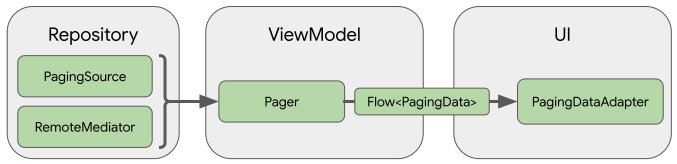
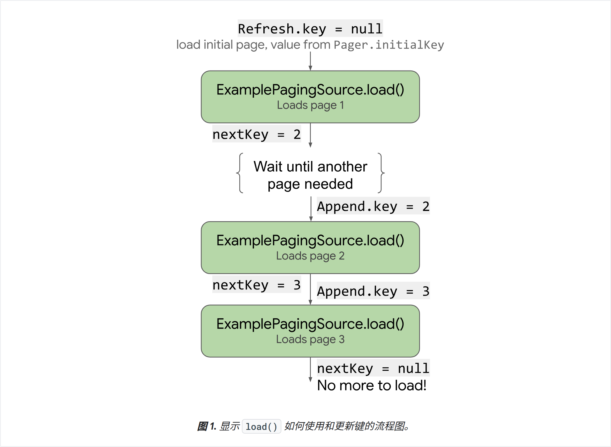
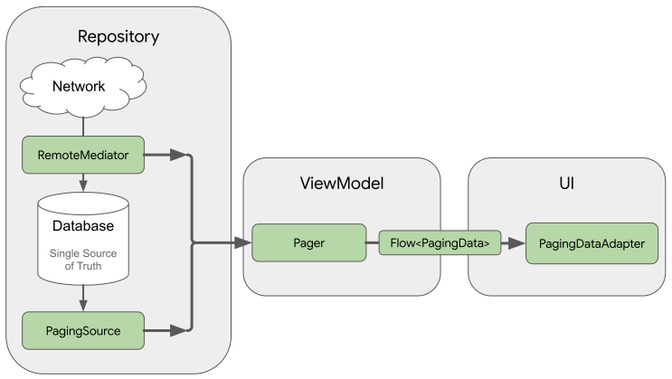
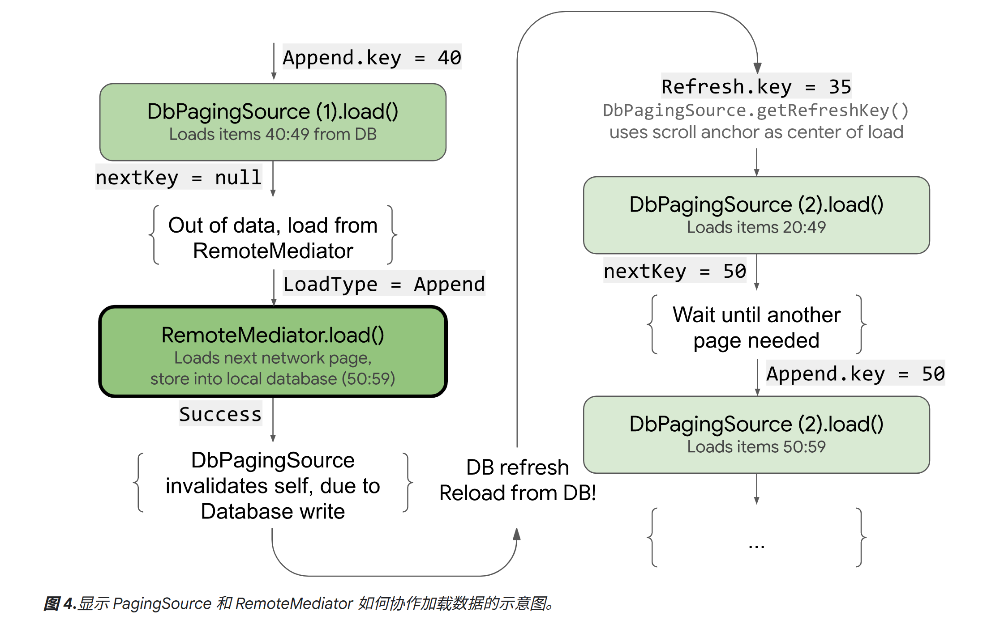

# Paging 库

## 简介

### 使用 Paging 库的优势

Paging 库包含以下功能：

- 分页数据的内存中缓存。该功能有助于确保您的应用在处理分页数据时高效使用系统资源。
- 内置的请求去重功能，可确保您的应用高效利用网络带宽和系统资源。
- 可配置的 [`RecyclerView`](https://developer.android.com/reference/kotlin/androidx/recyclerview/widget/RecyclerView?hl=zh-cn) 适配器，会在用户滚动到已加载数据的末尾时自动请求数据。
- 对 Kotlin 协程和数据流以及 [`LiveData`](https://developer.android.com/reference/kotlin/androidx/lifecycle/LiveData?hl=zh-cn) 和 RxJava 的一流支持。
- 内置对错误处理功能的支持，包括刷新和重试功能。


### 初始设置

```kotlin
dependencies {
  val paging_version = "3.3.2"

  implementation("androidx.paging:paging-runtime:$paging_version")

  // alternatively - without Android dependencies for tests
  testImplementation("androidx.paging:paging-common:$paging_version")

  // optional - RxJava2 support
  implementation("androidx.paging:paging-rxjava2:$paging_version")

  // optional - RxJava3 support
  implementation("androidx.paging:paging-rxjava3:$paging_version")

  // optional - Guava ListenableFuture support
  implementation("androidx.paging:paging-guava:$paging_version")

  // optional - Jetpack Compose integration
  implementation("androidx.paging:paging-compose:3.3.2")
}
```


### 库架构



- 代码库层

代码库层中的主要 Paging 库组件是 [`PagingSource`](https://developer.android.com/reference/kotlin/androidx/paging/PagingSource?hl=zh-cn)。每个 `PagingSource` 对象都定义了数据源，以及如何从该数据源检索数据。`PagingSource` 对象可以从任何单个数据源（包括网络来源和本地数据库）加载数据。

您可能使用的另一个 Paging 库组件是 [`RemoteMediator`](https://developer.android.com/reference/kotlin/androidx/paging/RemoteMediator?hl=zh-cn)。`RemoteMediator` 对象会处理来自分层数据源（例如具有本地数据库缓存的网络数据源）的分页。

- ViewModel 层

[`Pager`](https://developer.android.com/reference/kotlin/androidx/paging/Pager?hl=zh-cn) 组件提供了一个公共 API，基于 `PagingSource` 对象和 [`PagingConfig`](https://developer.android.com/reference/kotlin/androidx/paging/PagingConfig?hl=zh-cn) 配置对象来构造在响应式流中公开的 `PagingData` 实例。

将 `ViewModel` 层连接到界面的组件是 [`PagingData`](https://developer.android.com/reference/kotlin/androidx/paging/PagingData?hl=zh-cn)。`PagingData` 对象是用于存放分页数据快照的容器。它会查询 [`PagingSource`](https://developer.android.com/reference/kotlin/androidx/paging/PagingSource?hl=zh-cn) 对象并存储结果。

- UI 层

界面层中的主要 Paging 库组件是 [`PagingDataAdapter`](https://developer.android.com/reference/kotlin/androidx/paging/PagingDataAdapter?hl=zh-cn)，它是一种处理分页数据的 [`RecyclerView`](https://developer.android.com/reference/kotlin/androidx/recyclerview/widget/RecyclerView?hl=zh-cn) 适配器。

此外，您也可以使用随附的 [`AsyncPagingDataDiffer`](https://developer.android.com/reference/kotlin/androidx/paging/AsyncPagingDataDiffer?hl=zh-cn) 组件构建自己的自定义适配器。

> 如果您的应用对界面使用 [Compose](https://developer.android.com/jetpack/compose?hl=zh-cn)，请改为使用 [`androidx.paging:paging-compose`](https://developer.android.com/reference/kotlin/androidx/paging/compose/package-summary?hl=zh-cn) 工件将 Paging 与您的界面层集成。


### 其他资源

如需详细了解 Paging 库，请参阅下列其他资源：

Codelab

- [“Android Paging 基础知识”Codelab](https://developer.android.com/codelabs/android-paging-basics?hl=zh-cn)
- [“Android Paging 高级知识”Codelab](https://codelabs.developers.google.com/codelabs/android-paging?hl=zh-cn)

示例

- [Android 架构组件示例：Paging](https://github.com/android/architecture-components-samples/tree/main/PagingSample)
- [Android 架构组件 Paging 与网络搭配使用示例](https://github.com/android/architecture-components-samples/tree/main/PagingWithNetworkSample)


## 加载并显示分页数据

本指南将演示如何使用 Paging 库设置来自网络数据源的分页数据流并将其显示在 [`RecyclerView`](https://developer.android.com/guide/topics/ui/layout/recyclerview?hl=zh-cn) 中。

### 定义数据源

第一步是定义用于标识数据源的 [`PagingSource`](https://developer.android.com/reference/kotlin/androidx/paging/PagingSource?hl=zh-cn) 实现。`PagingSource` API 类包含 [`load()`](https://developer.android.com/reference/kotlin/androidx/paging/PagingSource?hl=zh-cn#load) 方法，您需要替换该方法，以指明如何从相应数据源检索分页数据。

直接使用 `PagingSource` 类即可通过 Kotlin 协程进行异步加载。

#### 选择键和值类型

`PagingSource<Key, Value>` 有两种类型参数：`Key` 和 `Value`。键定义了用于加载数据的标识符，值是数据本身的类型。例如，如果您通过将 `Int` 页码传递给 [Retrofit](https://square.github.io/retrofit/) 来从网络加载各页 `User` 对象，则应选择 `Int` 作为 `Key` 类型，选择 `User` 作为 `Value` 类型。

#### 定义 PagingSource

下面的示例实现了按页码加载各页对象的 [`PagingSource`](https://developer.android.com/reference/kotlin/androidx/paging/PagingSource?hl=zh-cn)。`Key` 类型为 `Int`，`Value` 类型为 `User`。

```kotlin
class ExamplePagingSource(
    val backend: ExampleBackendService,
    val query: String
) : PagingSource<Int, User>() {
  override suspend fun load(
    params: LoadParams<Int>
  ): LoadResult<Int, User> {
    try {
      // Start refresh at page 1 if undefined.
      val nextPageNumber = params.key ?: 1
      val response = backend.searchUsers(query, nextPageNumber)
      return LoadResult.Page(
        data = response.users,
        prevKey = null, // Only paging forward.
        nextKey = response.nextPageNumber
      )
    } catch (e: Exception) {
      // Handle errors in this block and return LoadResult.Error for
      // expected errors (such as a network failure).
    }
  }

  override fun getRefreshKey(state: PagingState<Int, User>): Int? {
    // Try to find the page key of the closest page to anchorPosition from
    // either the prevKey or the nextKey; you need to handle nullability
    // here.
    //  * prevKey == null -> anchorPage is the first page.
    //  * nextKey == null -> anchorPage is the last page.
    //  * both prevKey and nextKey are null -> anchorPage is the
    //    initial page, so return null.
    return state.anchorPosition?.let { anchorPosition ->
      val anchorPage = state.closestPageToPosition(anchorPosition)
      anchorPage?.prevKey?.plus(1) ?: anchorPage?.nextKey?.minus(1)
    }
  }
}
```

构造参数说明：

- `backend`：提供数据的后端服务实例。

- `query`：要发送到 `backend` 指示的服务的搜索查询。

`LoadResult` 是一个密封的类，根据 `load()` 调用是否成功，采用如下两种形式之一：

- 如果加载成功，则返回 `LoadResult.Page` 对象。
- 如果加载失败，则返回 `LoadResult.Error` 对象。

下图说明了此示例中的 `load()` 函数如何接收每次加载的键并为后续加载提供键：



`PagingSource` 实现还必须实现 [`getRefreshKey()`](https://developer.android.com/reference/kotlin/androidx/paging/PagingSource?hl=zh-cn#getrefreshkey) 方法，该方法接受 [`PagingState`](https://developer.android.com/reference/kotlin/androidx/paging/PagingState?hl=zh-cn) 对象作为参数。当数据在初始加载后刷新或失效时，该方法会返回要传递给 `load()` 方法的键。在后续刷新数据时，Paging 库会自动调用此方法。

#### 处理错误

对于上一个示例，您可以通过向 `load()` 方法添加以下内容来捕获和报告 `ExamplePagingSource` 中的加载错误：

```kotlin
catch (e: IOException) {
  // IOException for network failures.
  return LoadResult.Error(e)
} catch (e: HttpException) {
  // HttpException for any non-2xx HTTP status codes.
  return LoadResult.Error(e)
}
```


### 设置 PagingData 流

Paging 库支持使用多种流类型，包括 `Flow`、`LiveData` 以及 RxJava 中的 `Flowable` 和 `Observable` 类型。

当您创建 `Pager` 实例来设置响应式流时，必须为实例提供 [`PagingConfig`](https://developer.android.com/reference/kotlin/androidx/paging/PagingConfig?hl=zh-cn) 配置对象和告知 `Pager` 如何获取 `PagingSource` 实现实例的函数：

```kotlin
val flow = Pager(
  // Configure how data is loaded by passing additional properties to
  // PagingConfig, such as prefetchDistance.
  PagingConfig(pageSize = 20)
) {
  ExamplePagingSource(backend, query)
}.flow
  .cachedIn(viewModelScope)
```

`cachedIn()` 运算符使数据流可共享，并使用提供的 `CoroutineScope` 缓存加载的数据。此示例使用生命周期 `lifecycle-viewmodel-ktx` 工件提供的 `viewModelScope`。

`Pager` 对象会调用 `PagingSource` 对象的 `load()` 方法，为其提供 [`LoadParams`](https://developer.android.com/reference/kotlin/androidx/paging/PagingSource.LoadParams?hl=zh-cn) 对象，并接收 [`LoadResult`](https://developer.android.com/reference/kotlin/androidx/paging/PagingSource.LoadResult?hl=zh-cn) 对象作为交换。


### 定义 RecyclerView 适配器

在此示例中，`UserAdapter` 扩展了 `PagingDataAdapter`，用于为 `User` 类型的列表项提供 `RecyclerView` 适配器，并使用 `UserViewHolder` 作为 [ViewHolder](https://developer.android.com/reference/kotlin/androidx/recyclerview/widget/RecyclerView.ViewHolder?hl=zh-cn)：

```kotlin
class UserAdapter(diffCallback: DiffUtil.ItemCallback<User>) :
  PagingDataAdapter<User, UserViewHolder>(diffCallback) {
  override fun onCreateViewHolder(
    parent: ViewGroup,
    viewType: Int
  ): UserViewHolder {
    return UserViewHolder(parent)
  }

  override fun onBindViewHolder(holder: UserViewHolder, position: Int) {
    val item = getItem(position)
    // Note that item can be null. ViewHolder must support binding a
    // null item as a placeholder.
    holder.bind(item)
  }
}
```

您的适配器还必须定义 `onCreateViewHolder()` 和 `onBindViewHolder()` 方法，并指定 [`DiffUtil.ItemCallback`](https://developer.android.com/reference/kotlin/androidx/recyclerview/widget/DiffUtil.ItemCallback?hl=zh-cn)。这与定义 `RecyclerView` 列表 Adapter 时的通常做法相同：

```kotlin
object UserComparator : DiffUtil.ItemCallback<User>() {
  override fun areItemsTheSame(oldItem: User, newItem: User): Boolean {
    // Id is unique.
    return oldItem.id == newItem.id
  }

  override fun areContentsTheSame(oldItem: User, newItem: User): Boolean {
    return oldItem == newItem
  }
}
```


### 在界面中显示分页数据

在 Activity 的 `onCreate` 或 Fragment 的 `onViewCreated` 方法中执行以下步骤：

1. 创建 `PagingDataAdapter` 类的实例。
2. 将 `PagingDataAdapter` 实例传递给您要显示分页数据的 [`RecyclerView`](https://developer.android.com/reference/kotlin/androidx/recyclerview/widget/RecyclerView?hl=zh-cn) 列表。
3. 观察 `PagingData` 流，并将生成的每个值传递给适配器的 `submitData()` 方法。

```kotlin
val viewModel by viewModels<ExampleViewModel>()

val pagingAdapter = UserAdapter(UserComparator)
val recyclerView = findViewById<RecyclerView>(R.id.recycler_view)
recyclerView.adapter = pagingAdapter

// Activities can use lifecycleScope directly; 
// fragments use viewLifecycleOwner.lifecycleScope.
lifecycleScope.launch {
  viewModel.flow.collectLatest { pagingData ->
    pagingAdapter.submitData(pagingData)
  }
}
```


## 从网络和数据库加载页面

### 基本用法

假设您希望应用将 `User` 项的页面从由项进行键控的网络数据源加载到存储在 Room 数据库中的本地缓存内。



`RemoteMediator` 实现有助于将来自网络的分页数据加载到数据库中，但不会直接将数据加载到界面中，而是会将数据库用作[可信来源](https://developer.android.com/jetpack/guide/data-layer?hl=zh-cn#source-of-truth)。换句话说，该应用仅显示已在数据库中缓存的数据。`PagingSource` 实现（例如，由 Room 生成的实现）可处理将缓存数据从数据库加载到界面的过程。

#### 创建 Room 实体

```kotlin
@Entity(tableName = "users")
data class User(val id: String, val label: String)
```

还必须按照[使用 Room DAO 访问数据](https://developer.android.com/training/data-storage/room/accessing-data?hl=zh-cn)中所述为此 Room 实体定义数据访问对象 (DAO)。该列表项实体的 DAO 必须包含以下方法：

- `insertAll()` 方法，用于将一系列项插入到表中。
- 一个以查询字符串作为参数并返回结果列表的 `PagingSource` 对象的方法。这样，`Pager` 对象就可以将此表用作分页数据源。
- `clearAll()` 方法，用于删除表中的所有数据。

```kotlin
@Dao
interface UserDao {
  @Insert(onConflict = OnConflictStrategy.REPLACE)
  suspend fun insertAll(users: List<User>)

  @Query("SELECT * FROM users WHERE label LIKE :query")
  fun pagingSource(query: String): PagingSource<Int, User>

  @Query("DELETE FROM users")
  suspend fun clearAll()
}
```

#### 实现 RemoteMediator

`RemoteMediator` 的主要作用是：在 `Pager` 耗尽数据或现有数据失效时，从网络加载更多数据。它包含 `load()` 方法，您必须替换该方法才能定义加载行为。

典型的 `RemoteMediator` 实现包括以下参数：

- `query`：用于定义要从后端服务检索哪些数据的查询字符串。
- `database`：充当本地缓存的 Room 数据库。
- `networkService`：后端服务的 API 实例。

```kotlin
@OptIn(ExperimentalPagingApi::class)
class ExampleRemoteMediator(
  private val query: String,
  private val database: RoomDb,
  private val networkService: ExampleBackendService
) : RemoteMediator<Int, User>() {
  val userDao = database.userDao()

  override suspend fun load(
    loadType: LoadType,
    state: PagingState<Int, User>
  ): MediatorResult {
    // ...
  }
}
```

`load()` 方法负责更新后备数据集以及使 `PagingSource` 失效。某些支持分页的库（例如 Room）会自动处理使其实现的 `PagingSource` 对象失效的过程。

`load()` 方法接受以下两个参数：

- [`PagingState`](https://developer.android.com/reference/kotlin/androidx/paging/PagingState?hl=zh-cn)：包含到目前为止已加载的页面、最近访问的索引以及用于初始化分页数据流的 [`PagingConfig`](https://developer.android.com/reference/kotlin/androidx/paging/PagingConfig?hl=zh-cn) 对象的相关信息。

- [`LoadType`](https://developer.android.com/reference/kotlin/androidx/paging/LoadType?hl=zh-cn)：指示加载的类型：[`REFRESH`](https://developer.android.com/reference/kotlin/androidx/paging/LoadType?hl=zh-cn#refresh)、[`APPEND`](https://developer.android.com/reference/kotlin/androidx/paging/LoadType?hl=zh-cn#append) 或 [`PREPEND`](https://developer.android.com/reference/kotlin/androidx/paging/LoadType?hl=zh-cn#prepend)。

   | `APPEND`  | Load at the end of a `PagingData`.                           |
   | --------- | ------------------------------------------------------------ |
   | `PREPEND` | Load at the start of a `PagingData`.                         |
   | `REFRESH` | `PagingData` content being refreshed, which can be a result of `PagingSource` invalidation, refresh that may contain content updates, or the initial load. |

`load()` 方法的返回值是 [`MediatorResult`](https://developer.android.com/reference/kotlin/androidx/paging/RemoteMediator.MediatorResult?hl=zh-cn) 对象。`MediatorResult` 可以是 [`MediatorResult.Error`](https://developer.android.com/reference/kotlin/androidx/paging/RemoteMediator.MediatorResult.Error?hl=zh-cn)（包含错误说明）或 [`MediatorResult.Success`](https://developer.android.com/reference/kotlin/androidx/paging/RemoteMediator.MediatorResult.Success?hl=zh-cn)（包含指示是否有更多数据要加载的信号）。

`load()` 方法必须执行以下步骤：

1. 根据加载类型和到目前为止已加载的数据，确定要从网络中加载哪个页面。
2. 触发网络请求。
3. 根据加载操作的结果执行操作：
   - 如果加载成功且收到的项列表不是空的，则将相应的列表项存储到数据库中并返回 `MediatorResult.Success(endOfPaginationReached = false)`。存储数据后，使数据源失效，以通知 Paging 库新数据的存在。
   - 如果加载成功并且接收到的项列表为空或为最后一页索引，则返回 `MediatorResult.Success(endOfPaginationReached = true)`。存储数据后，使数据源失效，以通知 Paging 库新数据的存在。
   - 如果请求导致错误，则返回 `MediatorResult.Error`。

```kotlin
override suspend fun load(
  loadType: LoadType,
  state: PagingState<Int, User>
): MediatorResult {
  return try {
    // The network load method takes an optional after=<user.id>
    // parameter. For every page after the first, pass the last user
    // ID to let it continue from where it left off. For REFRESH,
    // pass null to load the first page.
    val loadKey = when (loadType) {
      LoadType.REFRESH -> null
      // In this example, you never need to prepend, since REFRESH
      // will always load the first page in the list. Immediately
      // return, reporting end of pagination.
      LoadType.PREPEND ->
        return MediatorResult.Success(endOfPaginationReached = true)
      LoadType.APPEND -> {
        val lastItem = state.lastItemOrNull()

        // You must explicitly check if the last item is null when
        // appending, since passing null to networkService is only
        // valid for initial load. If lastItem is null it means no
        // items were loaded after the initial REFRESH and there are
        // no more items to load.
        if (lastItem == null) {
          return MediatorResult.Success(
            endOfPaginationReached = true
          )
        }

        lastItem.id
      }
    }

    // Suspending network load via Retrofit. This doesn't need to be
    // wrapped in a withContext(Dispatcher.IO) { ... } block since
    // Retrofit's Coroutine CallAdapter dispatches on a worker
    // thread.
    val response = networkService.searchUsers(
      query = query, after = loadKey
    )

    database.withTransaction {
      if (loadType == LoadType.REFRESH) {
        userDao.deleteByQuery(query)
      }

      // Insert new users into database, which invalidates the
      // current PagingData, allowing Paging to present the updates
      // in the DB.
      userDao.insertAll(response.users)
    }

    MediatorResult.Success(
      endOfPaginationReached = response.nextKey == null
    )
  } catch (e: IOException) {
    MediatorResult.Error(e)
  } catch (e: HttpException) {
    MediatorResult.Error(e)
  }
}
```


#### 定义 initialize 方法

`RemoteMediator` 实现还可以替换 [`initialize()`](https://developer.android.com/reference/kotlin/androidx/paging/RemoteMediator?hl=zh-cn#initialize) 方法，以检查缓存的数据是否已过期，并决定是否触发远程刷新。此方法在执行任何加载之前运行，因此您可以在触发任何本地或远程加载之前操控数据库（例如，清除旧数据）。

`initialize()` 实现应返回一个 `InitializeAction`，如下所示：

- 如果需要完全刷新本地数据，`initialize()` 应返回 [`InitializeAction.LAUNCH_INITIAL_REFRESH`](https://developer.android.com/reference/kotlin/androidx/paging/RemoteMediator.InitializeAction?hl=zh-cn#launch_initial_refresh)。这会使 `RemoteMediator` 执行远程刷新以完全重新加载数据。任何远程 `APPEND` 或 `PREPEND` 加载都会等待 `REFRESH` 加载成功，然后再继续。
- 如果本地数据不需要刷新，`initialize()` 应返回 [`InitializeAction.SKIP_INITIAL_REFRESH`](https://developer.android.com/reference/kotlin/androidx/paging/RemoteMediator.InitializeAction?hl=zh-cn#skip_initial_refresh)。这会使 `RemoteMediator` 跳过远程刷新并加载缓存的数据。

```kotlin
override suspend fun initialize(): InitializeAction {
  val cacheTimeout = TimeUnit.MILLISECONDS.convert(1, TimeUnit.HOURS)
  return if (System.currentTimeMillis() - db.lastUpdated() <= cacheTimeout)
  {
    // Cached data is up-to-date, so there is no need to re-fetch
    // from the network.
    InitializeAction.SKIP_INITIAL_REFRESH
  } else {
    // Need to refresh cached data from network; returning
    // LAUNCH_INITIAL_REFRESH here will also block RemoteMediator's
    // APPEND and PREPEND from running until REFRESH succeeds.
    InitializeAction.LAUNCH_INITIAL_REFRESH
  }
}
```


#### 创建分页器

- 不能直接传递 `PagingSource` 构造函数，而是必须提供从 DAO 返回 `PagingSource` 对象的查询方法。
- 必须提供 `RemoteMediator` 实现的实例作为 `remoteMediator` 参数。

```kotlin
val userDao = database.userDao()
val pager = Pager(
  config = PagingConfig(pageSize = 50)
  remoteMediator = ExampleRemoteMediator(query, database, networkService)
) {
  userDao.pagingSource(query)
}
```


### 处理竞态条件

Room 会在插入任何数据时使查询失效。这意味着，将新数据插入数据库时，系统将向待处理的加载请求提供包含已刷新数据的新 `PagingSource` 对象。

在任何情况下，您都可以使用[远程键](https://developer.android.com/topic/libraries/architecture/paging/v3-network-db?hl=zh-cn#remote-keys)保存从服务器请求的最新页面的相关信息。您的应用可以使用此信息来识别和请求接下来要加载的正确数据页面。


### 管理远程键

远程键供 `RemoteMediator` 实现用来告知后端服务下一步要加载哪些数据。在最简单的场景下，每一项分页数据都包含一个可供您轻松引用的远程键。不过，如果远程键不与单个项对应，则必须单独存储它们，并通过 `load()` 方法管理它们。

下面介绍如何收集、存储和更新未存储在各个项中的远程键。

#### 项键

附加操作确实需要 ID。为此，您需要从数据库中加载最后一项，并使用其 ID 加载下一页数据。如果数据库中没有任何项目，则 `endOfPaginationReached` 设为 true，指示需要刷新数据。

```kotlin
@OptIn(ExperimentalPagingApi::class)
class ExampleRemoteMediator(
  private val query: String,
  private val database: RoomDb,
  private val networkService: ExampleBackendService
) : RemoteMediator<Int, User>() {
  val userDao = database.userDao()

  override suspend fun load(
    loadType: LoadType,
    state: PagingState<Int, User>
  ): MediatorResult {
    return try {
      // The network load method takes an optional String
      // parameter. For every page after the first, pass the String
      // token returned from the previous page to let it continue
      // from where it left off. For REFRESH, pass null to load the
      // first page.
      val loadKey = when (loadType) {
        LoadType.REFRESH -> null
        // In this example, you never need to prepend, since REFRESH
        // will always load the first page in the list. Immediately
        // return, reporting end of pagination.
        LoadType.PREPEND -> return MediatorResult.Success(
          endOfPaginationReached = true
        )
        // Get the last User object id for the next RemoteKey.
        LoadType.APPEND -> {
          val lastItem = state.lastItemOrNull()

          // You must explicitly check if the last item is null when
          // appending, since passing null to networkService is only
          // valid for initial load. If lastItem is null it means no
          // items were loaded after the initial REFRESH and there are
          // no more items to load.
          if (lastItem == null) {
            return MediatorResult.Success(
              endOfPaginationReached = true
            )
          }

          lastItem.id
        }
      }

      // Suspending network load via Retrofit. This doesn't need to
      // be wrapped in a withContext(Dispatcher.IO) { ... } block
      // since Retrofit's Coroutine CallAdapter dispatches on a
      // worker thread.
      val response = networkService.searchUsers(query, loadKey)

      // Store loaded data, and next key in transaction, so that
      // they're always consistent.
      database.withTransaction {
        if (loadType == LoadType.REFRESH) {
          userDao.deleteByQuery(query)
        }

        // Insert new users into database, which invalidates the
        // current PagingData, allowing Paging to present the updates
        // in the DB.
        userDao.insertAll(response.users)
      }

      // End of pagination has been reached if no users are returned from the
      // service
      MediatorResult.Success(
        endOfPaginationReached = response.users.isEmpty()
      )
    } catch (e: IOException) {
      MediatorResult.Error(e)
    } catch (e: HttpException) {
      MediatorResult.Error(e)
    }
  }
}
```


#### 页面键

本部分介绍如何使用与单个项不相对应的远程键。

如果远程键未与列表项直接关联，最好将其存储在本地数据库内的单独表中。定义一个代表远程键表的 Room 实体：

```kotlin
@Entity(tableName = "remote_keys")
data class RemoteKey(val label: String, val nextKey: String?)
```

还必须为该 `RemoteKey` 实体定义一个 DAO：

```kotlin
@Dao
interface RemoteKeyDao {
  @Insert(onConflict = OnConflictStrategy.REPLACE)
  suspend fun insertOrReplace(remoteKey: RemoteKey)

  @Query("SELECT * FROM remote_keys WHERE label = :query")
  suspend fun remoteKeyByQuery(query: String): RemoteKey

  @Query("DELETE FROM remote_keys WHERE label = :query")
  suspend fun deleteByQuery(query: String)
}
```

使用远程键加载。

当 `load()` 方法需要管理远程页面键时，您必须使用与 `RemoteMediator` 的[基本用法](https://developer.android.com/topic/libraries/architecture/paging/v3-network-db?hl=zh-cn#basic-usage)不同的以下方式来定义它。

- 额外添加一个属性，用于存放对远程键表的 DAO 的引用。
- 通过查询远程键表（而不是使用 `PagingState`）确定下一步要加载哪个键。
- 除分页数据本身外，还要从网络数据源插入或存储返回的远程键。

```kotlin
@OptIn(ExperimentalPagingApi::class)
class ExampleRemoteMediator(
  private val query: String,
  private val database: RoomDb,
  private val networkService: ExampleBackendService
) : RemoteMediator<Int, User>() {
  val userDao = database.userDao()
  val remoteKeyDao = database.remoteKeyDao()

  override suspend fun load(
    loadType: LoadType,
    state: PagingState<Int, User>
  ): MediatorResult {
    return try {
      // The network load method takes an optional String
      // parameter. For every page after the first, pass the String
      // token returned from the previous page to let it continue
      // from where it left off. For REFRESH, pass null to load the
      // first page.
      val loadKey = when (loadType) {
        LoadType.REFRESH -> null
        // In this example, you never need to prepend, since REFRESH
        // will always load the first page in the list. Immediately
        // return, reporting end of pagination.
        LoadType.PREPEND -> return MediatorResult.Success(
          endOfPaginationReached = true
        )
        // Query remoteKeyDao for the next RemoteKey.
        LoadType.APPEND -> {
          val remoteKey = database.withTransaction {
            remoteKeyDao.remoteKeyByQuery(query)
          }

          // You must explicitly check if the page key is null when
          // appending, since null is only valid for initial load.
          // If you receive null for APPEND, that means you have
          // reached the end of pagination and there are no more
          // items to load.
          if (remoteKey.nextKey == null) {
            return MediatorResult.Success(
              endOfPaginationReached = true
            )
          }

          remoteKey.nextKey
        }
      }

      // Suspending network load via Retrofit. This doesn't need to
      // be wrapped in a withContext(Dispatcher.IO) { ... } block
      // since Retrofit's Coroutine CallAdapter dispatches on a
      // worker thread.
      val response = networkService.searchUsers(query, loadKey)

      // Store loaded data, and next key in transaction, so that
      // they're always consistent.
      database.withTransaction {
        if (loadType == LoadType.REFRESH) {
          remoteKeyDao.deleteByQuery(query)
          userDao.deleteByQuery(query)
        }

        // Update RemoteKey for this query.
        remoteKeyDao.insertOrReplace(
          RemoteKey(query, response.nextKey)
        )

        // Insert new users into database, which invalidates the
        // current PagingData, allowing Paging to present the updates
        // in the DB.
        userDao.insertAll(response.users)
      }

      MediatorResult.Success(
        endOfPaginationReached = response.nextKey == null
      )
    } catch (e: IOException) {
      MediatorResult.Error(e)
    } catch (e: HttpException) {
      MediatorResult.Error(e)
    }
  }
}
```


### 就地刷新

如果您的应用只需要像前面的示例那样支持自列表顶部的网络刷新，您的 `RemoteMediator` 就不需要定义前置加载行为。

但是，如果您的应用需要支持将数据从网络逐步加载到本地数据库，您就必须支持从锚点（即用户的滚动位置）开始恢复分页。

Room 的 `PagingSource` 实现会为您处理此情况，但如果您未使用 Room，也可以通过替换 [`PagingSource.getRefreshKey()`](https://developer.android.com/reference/kotlin/androidx/paging/PagingSource?hl=zh-cn#getrefreshkey) 来实现此目的。

图 4 说明了先从本地数据库加载数据，然后在数据库中不再有数据后从网络加载数据的过程。

> [getRefreshKey](https://developer.android.com/reference/kotlin/androidx/paging/PagingSource#getRefreshKey(androidx.paging.PagingState))



疑问：上图的 35 = last *top-most* (40) - pageSize(5),  why Load 20:49 ？这个起始点20是根据什么来的？


## 转换数据流

数据流转换的另一个常见用例是[添加列表分隔符](https://developer.android.com/topic/libraries/architecture/paging/v3-transform?hl=zh-cn#separators)。直接对数据流进行转换，您便可将仓库构造和界面构造保持分开。

### 执行基本转换

```kotlin
pager.flow // Type is Flow<PagingData<User>>.
  // Map the outer stream so that the transformations are applied to
  // each new generation of PagingData.
  .map { pagingData ->
    // Transformations in this block are applied to the items
    // in the paged data.
}
```

#### 转换数据

该操作的一个常见用例是将某个网络或数据库层对象映射到界面层中专用的某个对象。以下示例演示了如何执行此类映射操作：

```kotlin
pager.flow // Type is Flow<PagingData<User>>.
  .map { pagingData ->
    pagingData.map { user -> UiModel(user) }
  }
```

另一种常见的数据转换是获取用户输入（例如查询字符串），然后将其转换为要显示的请求输出。若要设置该数据转换，您需要监听并捕获用户查询输入、执行相应请求并将查询结果推送回界面。

您可以使用数据流 API 来监听查询输入。将数据流引用保留在 `ViewModel` 中。界面层不应直接访问该类；相反，应该定义一个函数来通知 ViewModel 相关用户查询。

```kotlin
private val queryFlow = MutableStateFlow("")

fun onQueryChanged(query: String) {
  queryFlow.value = query
}
```

当数据流中的查询值发生更改时，可以执行操作将查询值转换为所需的数据类型，并将结果返回到界面层。

```kotlin
val querySearchResults = queryFlow.flatMapLatest { query ->
  // The database query returns a Flow which is output through
  // querySearchResults
  userDatabase.searchBy(query)
}
```

使用 `flatMapLatest` 或 `switchMap` 等操作可以确保只将最新结果返回到界面。如果用户在数据库操作结束前更改查询输入，这些操作会舍弃旧查询的结果，并立即启动新的搜索。


#### 过滤数据

需要将这些过滤操作放入 `map()` 调用中，因为该过滤条件适用于 `PagingData` 对象。数据从 `PagingData` 中过滤掉后，系统会将新的 `PagingData` 实例传递到界面层进行显示。

```kotlin
pager.flow // Type is Flow<PagingData<User>>.
  .map { pagingData ->
    pagingData.filter { user -> !user.hiddenFromUi }
  }
```


### 添加列表分隔符

Paging 库支持动态列表分隔符。可以通过将分隔符作为 `RecyclerView` 列表项直接插入到数据流中来提高列表的可读性。因此，分隔符是功能完备的 `ViewHolder` 对象，可支持互动、无障碍功能焦点以及 `View` 提供的所有其他功能。

将分隔符插入到分页列表中需要执行以下三个步骤：

1. 转换界面模型，以适应分隔符项。
2. 转换数据流，以便在加载数据之后、呈现数据之前动态添加分隔符。
3. 更新界面，以处理分隔符项。


#### 转换界面模型

```kotlin
sealed class UiModel {
  class UserModel(val id: String, val label: String) : UiModel() {
    constructor(user: User) : this(user.id, user.label)
  }

  class SeparatorModel(val description: String) : UiModel()
}
```


#### 转换数据流

在加载数据流之后、呈现数据流之前必须对数据流进行转换。转换过程应该执行以下操作：

- 转换加载的列表项，以反映新的基本项类型。
- 使用 `PagingData.insertSeparators()` 方法添加分隔符。

以下示例演示了用于将 `PagingData<User>` 流更新为添加了分隔符的 `PagingData<UiModel>` 流的转换操作：

```kotlin
pager.flow.map { pagingData: PagingData<User> ->
  // Map outer stream, so you can perform transformations on
  // each paging generation.
  pagingData
  .map { user ->
    // Convert items in stream to UiModel.UserModel.
    UiModel.UserModel(user)
  }
  .insertSeparators<UiModel.UserModel, UiModel> { before, after ->
    when {
      before == null -> UiModel.SeparatorModel("HEADER")
      after == null -> UiModel.SeparatorModel("FOOTER")
      shouldSeparate(before, after) -> UiModel.SeparatorModel(
        "BETWEEN ITEMS $before AND $after"
      )
      // Return null to avoid adding a separator between two items.
      else -> null
    }
  }
}
```


#### 处理界面中的分隔符

最后一步是更改界面以适应分隔符项类型。为您的分隔符项创建布局和 ViewHolder，并将列表 Adapter 更改为使用 `RecyclerView.ViewHolder` 作为其 ViewHolder 类型，以便 Adapter 可以处理多种类型的 ViewHolder。或者，您也可以定义项和分隔符 ViewHolder 类都可扩展的通用基类。

必须对列表 Adapter 进行以下更改：

- 向 `onCreateViewHolder()` 和 `onBindViewHolder()` 方法添加用于分隔符列表项的用例。
- 实现新的比较器。

```kotlin
class UiModelAdapter :
  PagingDataAdapter<UiModel, RecyclerView.ViewHolder>(UiModelComparator) {

  override fun onCreateViewHolder(
    parent: ViewGroup,
    viewType: Int
  ) = when (viewType) {
    R.layout.item -> UserModelViewHolder(parent)
    else -> SeparatorModelViewHolder(parent)
  }

  override fun getItemViewType(position: Int) {
    // Use peek over getItem to avoid triggering page fetch / drops, since
    // recycling views is not indicative of the user's current scroll position.
    return when (peek(position)) {
      is UiModel.UserModel -> R.layout.item
      is UiModel.SeparatorModel -> R.layout.separator_item
      null -> throw IllegalStateException("Unknown view")
    }
  }

  override fun onBindViewHolder(
    holder: RecyclerView.ViewHolder,
    position: Int
  ) {
    // 根据 holder 类型将item转换为对应类型
    val item = getItem(position)
    if (holder is UserModelViewHolder) {
      holder.bind(item as UserModel)
    } else if (holder is SeparatorModelViewHolder) {
      holder.bind(item as SeparatorModel)
    }
  }
}

object UiModelComparator : DiffUtil.ItemCallback<UiModel>() {
  override fun areItemsTheSame(
    oldItem: UiModel,
    newItem: UiModel
  ): Boolean {
    val isSameRepoItem = oldItem is UiModel.UserModel
      && newItem is UiModel.UserModel
      && oldItem.id == newItem.id

    val isSameSeparatorItem = oldItem is UiModel.SeparatorModel
      && newItem is UiModel.SeparatorModel
      && oldItem.description == newItem.description

    return isSameRepoItem || isSameSeparatorItem
  }

  override fun areContentsTheSame(
    oldItem: UiModel,
    newItem: UiModel
  ) = oldItem == newItem
}
```


### 避免重复工作

`cachedIn()` 操作会缓存在它执行之前发生的任何转换的结果。因此，`cachedIn()` 应该是 ViewModel 中的最后一次调用。

```kotlin
pager.flow // Type is Flow<PagingData<User>>.
  .map { pagingData ->
    pagingData.filter { user -> !user.hiddenFromUi }
      .map { user -> UiModel.UserModel(user) }
  }
  .cachedIn(viewModelScope)
```


## 管理和显示加载状态

Paging 库会跟踪分页数据的加载请求状态，并通过 [`LoadState`](https://developer.android.com/reference/kotlin/androidx/paging/LoadState?hl=zh-cn) 类将其公开。应用可以向 [`PagingDataAdapter`](https://developer.android.com/reference/kotlin/androidx/paging/PagingDataAdapter?hl=zh-cn) 注册一个监听器，用于接收有关当前状态的信息并相应地更新界面。

每个 [`LoadType`](https://developer.android.com/reference/kotlin/androidx/paging/LoadType?hl=zh-cn) 和数据源类型（[`PagingSource`](https://developer.android.com/reference/kotlin/androidx/paging/PagingSource?hl=zh-cn) 或 [`RemoteMediator`](https://developer.android.com/reference/kotlin/androidx/paging/RemoteMediator?hl=zh-cn)）都会获得一个单独的 `LoadState` 信号。监听器提供的 [`CombinedLoadStates`](https://developer.android.com/reference/kotlin/androidx/paging/CombinedLoadStates?hl=zh-cn) 对象则会提供来自所有这些信号的加载状态的信息。您可以利用此详细信息向用户显示相应的加载指示器。


### 加载状态

Paging 库通过 `LoadState` 对象公开要在界面中使用的加载状态。`LoadState` 对象根据当前的加载状态采用以下三种形式之一：

- 如果没有正在执行的加载操作且没有错误，那么 `LoadState` 为 [`LoadState.NotLoading`](https://developer.android.com/reference/kotlin/androidx/paging/LoadState.NotLoading?hl=zh-cn) 对象。此子类还包含 [`endOfPaginationReached`](https://developer.android.com/reference/kotlin/androidx/paging/LoadState?hl=zh-cn#endOfPaginationReached()) 属性，用于指示是否已到达分页结束处。
- 如果有正在执行的加载操作，那么 `LoadState` 为 [`LoadState.Loading`](https://developer.android.com/reference/kotlin/androidx/paging/LoadState.Loading?hl=zh-cn) 对象。
- 如果出现错误，那么 `LoadState` 为 [`LoadState.Error`](https://developer.android.com/reference/kotlin/androidx/paging/LoadState.Error?hl=zh-cn) 对象。

可通过两种方法在界面中使用 `LoadState`：使用监听器，或使用特殊的列表适配器直接在 [`RecyclerView`](https://developer.android.com/reference/kotlin/androidx/recyclerview/widget/RecyclerView?hl=zh-cn) 列表中显示加载状态

```kotlin
// Activities can use lifecycleScope directly, but Fragments should instead use
// viewLifecycleOwner.lifecycleScope.
lifecycleScope.launch {
  pagingAdapter.loadStateFlow.collectLatest { loadStates ->
    progressBar.isVisible = loadStates.refresh is LoadState.Loading
    retry.isVisible = loadState.refresh !is LoadState.Loading
    errorMsg.isVisible = loadState.refresh is LoadState.Error
  }
}
```


### 使用适配器显示加载状态

Paging 库提供了另一个名为 [`LoadStateAdapter`](https://developer.android.com/reference/kotlin/androidx/paging/LoadStateAdapter?hl=zh-cn) 的列表适配器，用于直接在显示的分页数据列表中呈现加载状态。您可以通过此适配器获取列表的当前加载状态，将该状态传递给显示该信息的自定义 ViewHolder。

首先，创建一个 ViewHolder 类，用于保留对屏幕上的加载视图和错误视图的引用。创建一个接受 `LoadState` 作为参数的 `bind()` 函数。此函数应根据加载状态参数切换视图可见性：

```kotlin
class LoadStateViewHolder(
  parent: ViewGroup,
  retry: () -> Unit
) : RecyclerView.ViewHolder(
  LayoutInflater.from(parent.context)
    .inflate(R.layout.load_state_item, parent, false)
) {
  private val binding = LoadStateItemBinding.bind(itemView)
  private val progressBar: ProgressBar = binding.progressBar
  private val errorMsg: TextView = binding.errorMsg
  private val retry: Button = binding.retryButton
    .also {
      it.setOnClickListener { retry() }
    }

  fun bind(loadState: LoadState) {
    if (loadState is LoadState.Error) {
      errorMsg.text = loadState.error.localizedMessage
    }

    progressBar.isVisible = loadState is LoadState.Loading
    retry.isVisible = loadState is LoadState.Error
    errorMsg.isVisible = loadState is LoadState.Error
  }
}
```

首先，创建一个实现 `LoadStateAdapter` 的类，并定义 [`onCreateViewHolder()`](https://developer.android.com/reference/kotlin/androidx/paging/LoadStateAdapter?hl=zh-cn#onCreateViewHolder(android.view.ViewGroup,androidx.paging.LoadState)) 和 [`onBindViewHolder()`](https://developer.android.com/reference/kotlin/androidx/paging/LoadStateAdapter?hl=zh-cn#onBindViewHolder(androidx.recyclerview.widget.RecyclerView.ViewHolder,androidx.paging.LoadState)) 方法：这些方法会创建自定义 ViewHolder 的一个实例，并绑定关联的加载状态。

```kotlin
// Adapter that displays a loading spinner when
// state is LoadState.Loading, and an error message and retry
// button when state is LoadState.Error.
class ExampleLoadStateAdapter(
  private val retry: () -> Unit
) : LoadStateAdapter<LoadStateViewHolder>() {

  override fun onCreateViewHolder(
    parent: ViewGroup,
    loadState: LoadState
  ) = LoadStateViewHolder(parent, retry)

  override fun onBindViewHolder(
    holder: LoadStateViewHolder,
    loadState: LoadState
  ) = holder.bind(loadState)
}
```

在页眉或页脚中显示加载状态。

```kotlin
pagingAdapter
  .withLoadStateHeaderAndFooter(
    header = ExampleLoadStateAdapter(adapter::retry),
    footer = ExampleLoadStateAdapter(adapter::retry)
  )
```

如果您想让 `RecyclerView` 列表仅在页眉中或仅在页脚中显示加载状态，可改为调用 [`withLoadStateHeader()`](https://developer.android.com/reference/kotlin/androidx/paging/PagingDataAdapter?hl=zh-cn#withloadstateheader) 或 [`withLoadStateFooter()`](https://developer.android.com/reference/kotlin/androidx/paging/PagingDataAdapter?hl=zh-cn#withloadstatefooter)。

### 获取更多加载状态信息

`PagingDataAdapter` 中的 `CombinedLoadStates` 对象会提供 `PagingSource` 实现的加载状态信息，如果存在 `RemoteMediator` 实现，也会提供其加载状态信息。

```kotlin
lifecycleScope.launch {
  pagingAdapter.loadStateFlow.collectLatest { loadStates ->
    // Observe refresh load state from RemoteMediator if present, or
    // from PagingSource otherwise.
    refreshLoadState: LoadState = loadStates.refresh
    // Observe prepend load state from RemoteMediator if present, or
    // from PagingSource otherwise.
    prependLoadState: LoadState = loadStates.prepend
    // Observe append load state from RemoteMediator if present, or
    // from PagingSource otherwise.
    appendLoadState: LoadState = loadStates.append
  }
}
```

注意，只有 `PagingSource` 加载状态一定会与界面更新保持同步。由于 `refresh`、`append` 和 `prepend` 属性可能会从 `PagingSource` 获取加载状态，也可能会从 `RemoteMediator` 获取加载状态，因此不能保证它们一定会与界面更新保持同步。这可能会导致以下界面问题：在任何新数据添加到界面中之前，加载似乎就已完成。

`CombinedLoadStates` 提供了 [`source`](https://developer.android.com/reference/kotlin/androidx/paging/CombinedLoadStates?hl=zh-cn#source()) 和 [`mediator`](https://developer.android.com/reference/kotlin/androidx/paging/CombinedLoadStates?hl=zh-cn#mediator()) 属性。这两个属性会各公开一个 [`LoadStates`](https://developer.android.com/reference/kotlin/androidx/paging/LoadStates?hl=zh-cn) 对象，分别包含 `PagingSource` 或 `RemoteMediator` 的 `LoadState` 对象：

```kotlin
lifecycleScope.launch {
  pagingAdapter.loadStateFlow.collectLatest { loadStates ->
    // Directly access the RemoteMediator refresh load state.
    mediatorRefreshLoadState: LoadState? = loadStates.mediator.refresh
    // Directly access the RemoteMediator append load state.
    mediatorAppendLoadState: LoadState? = loadStates.mediator.append
    // Directly access the RemoteMediator prepend load state.
    mediatorPrependLoadState: LoadState? = loadStates.mediator.prepend
    // Directly access the PagingSource refresh load state.
    sourceRefreshLoadState: LoadState = loadStates.source.refresh
    // Directly access the PagingSource append load state.
    sourceAppendLoadState: LoadState = loadStates.source.append
    // Directly access the PagingSource prepend load state.
    sourcePrependLoadState: LoadState = loadStates.source.prepend
  }
}
```

### LoadState 中的链操作符

假设您想显示一个空视图，但仅在初始数据加载完成后显示。此用例需要验证数据刷新加载是否已开始，然后等待 `NotLoading` 状态以确认刷新已完成。您必须过滤掉除所需信号外的所有信号：

```kotlin
lifecycleScope.launchWhenCreated {
  adapter.loadStateFlow
    // Only emit when REFRESH LoadState for RemoteMediator changes.
    .distinctUntilChangedBy { it.refresh }
    // Only react to cases where REFRESH completes, such as NotLoading.
    .filter { it.refresh is LoadState.NotLoading }
    // Scroll to top is synchronous with UI updates, even if remote load was
    // triggered.
    .collect { binding.list.scrollToPosition(0) }
}
```

此示例将一直等到刷新加载状态更新，但仅在状态为 `NotLoading` 时触发。**这样确保在发生任何界面更新之前，远程刷新已完全完成。**

流 API 使此类操作成为可能。应用可以指定需要的加载事件，并在满足相应条件时处理新数据。


## 测试 Paging 实现

介绍如何在应用的不同[架构层](https://developer.android.com/topic/architecture?hl=zh-cn)中测试 Paging 库，以及如何为整个 Paging 实现编写端到端测试。

### 界面层测试

使用 Paging 库提取的数据会作为 `Flow<PagingData<Value>>` 在界面中使用。若要编写测试以验证界面中的数据是否符合您的预期，请添加 `paging-testing` 依赖项。它包含对 `Flow<PagingData<Value>>` 的 `asSnapshot()` 扩展，并且其 lambda 接收器中提供了一些 API，这些 API 用于模拟滚动互动。它会返回一个由模拟的滚动互动生成的标准 `List<Value>`，让您可以断言分页数据包含由这些互动生成的预期元素。如以下代码段所示：

```kotlin
fun test_items_contain_one_to_ten() = runTest {
  // Get the Flow of PagingData from the ViewModel under test
  val items: Flow<PagingData<String>> = viewModel.items

  val itemsSnapshot: List<String> = items.asSnapshot {
    // Scroll to the 50th item in the list. This will also suspend till
    // the prefetch requirement is met if there's one.
    // It also suspends until all loading is complete.
    scrollTo(index = 50)
  }

  // With the asSnapshot complete, you can now verify that the snapshot
  // has the expected values
  assertEquals(
    expected = (0..50).map(Int::toString),
    actual = itemsSnapshot
  )
}
```

或者，您也可以一直滚动，直至满足给定的谓词，如以下代码段所示：

```kotlin
fun test_footer_is_visible() = runTest {
  // Get the Flow of PagingData from the ViewModel under test
  val items: Flow<PagingData<String>> = viewModel.items

  val itemsSnapshot: List<String> = items.asSnapshot {
    // Scroll till the footer is visible
    appendScrollWhile {  item: String -> item != "Footer" }
  }
```

#### 测试转换

编写单元测试，以涵盖您应用于 `PagingData` 流的所有转换。使用 `asPagingSourceFactory` 扩展。此扩展适用于以下数据类型：

- `List<Value>`。
- `Flow<List<Value>>`。

具体选择使用哪一个扩展取决于您要测试的内容。 使用：

- `List<Value>.asPagingSourceFactory()`：如果要测试数据的静态转换（如 `map()` 和 `insertSeparators()`）。
- `Flow<List<Value>>.asPagingSourceFactory()`：如果要测试数据更新（例如写入后备数据源）对分页流水线有何影响。

> **注意：**每次发出与 `asPagingSourceFactory` 搭配使用的 `Flow` 都是一次新的 `PagingData` 生成操作。这样您就可以测试界面中的 `PagingSource` [失效](https://developer.android.com/reference/kotlin/androidx/paging/PagingSource?hl=zh-cn#invalidate())行为。

```kotlin
class MyViewModel(
  myRepository: myRepository
) {
  val items = Pager(
    config: PagingConfig,
    initialKey = null,
    pagingSourceFactory = { myRepository.pagingSource() }
  )
  .flow
  .map { pagingData ->
    pagingData.insertSeparators<String, String> { before, _ ->
      when {
        // Add a dashed String separator if the prior item is a multiple of 10
        before.last() == '0' -> "---------"
        // Return null to avoid adding a separator between two items.
        else -> null
      }
  }
}
```

若要在 `MyViewModel` 中测试转换，请提供 `MyRepository` 的虚构实例以委托给代表要转换的数据的 `List`，如以下代码段所示：

```kotlin
class FakeMyRepository(): MyRepository {
    private val items = (0..100).map(Any::toString)

    private val pagingSourceFactory = items.asPagingSourceFactory()

    val pagingSource = pagingSourceFactory()
}
```

然后，您可编写针对分隔符逻辑的测试，如以下代码段所示：

```kotlin
fun test_separators_are_added_every_10_items() = runTest {
  // Create your ViewModel
  val viewModel = MyViewModel(
    myRepository = FakeMyRepository()
  )
  // Get the Flow of PagingData from the ViewModel with the separator transformations applied
  val items: Flow<PagingData<String>> = viewModel.items
                  
  val snapshot: List<String> = items.asSnapshot()

  // With the asSnapshot complete, you can now verify that the snapshot
  // has the expected separators.
}
```


### 数据层测试

需要在代码库层中测试的主要组件是 `PagingSource` 和 `RemoteMediator`。后续部分中的示例基于[使用网络进行分页的示例](https://github.com/android/architecture-components-samples/tree/master/PagingWithNetworkSample) 。


#### PagingSource 测试

```kotlin
class SubredditPagingSourceTest {
  private val mockPosts = listOf(
    postFactory.createRedditPost(DEFAULT_SUBREDDIT),
    postFactory.createRedditPost(DEFAULT_SUBREDDIT),
    postFactory.createRedditPost(DEFAULT_SUBREDDIT)
  )
  private val fakeApi = FakeRedditApi().apply {
    mockPosts.forEach { post -> addPost(post) }
  }

  @Test
  fun loadReturnsPageWhenOnSuccessfulLoadOfItemKeyedData() = runTest {
    val pagingSource = RedditPagingSource(
      fakeApi,
      DEFAULT_SUBREDDIT
    )

    val pager = TestPager(CONFIG, pagingSource)

    val result = pager.refresh() as LoadResult.Page

    // Write assertions against the loaded data
    assertThat(result.data)
    .containsExactlyElementsIn(mockPosts)
    .inOrder()
  }
}
```

借助 `TestPager`，您还可以执行以下操作：

- 测试从 `PagingSource` 的连续加载情况：

```kotlin
    @Test
    fun test_consecutive_loads() = runTest {

      val page = with(pager) {
        refresh()
        append()
        append()
      } as LoadResult.Page

      assertThat(page.data)
      .containsExactlyElementsIn(testPosts)
      .inOrder()
    }
```

- 测试 `PagingSource` 中的错误场景：

```kotlin
  @Test
    fun refresh_returnError() {
        val pagingSource = RedditPagingSource(
          fakeApi,
          DEFAULT_SUBREDDIT
        )
        // Configure your fake to return errors
        fakeApi.setReturnsError()
        // source typo?-> pagingSource
        val pager = TestPager(CONFIG, source)

        runTest {
            source.errorNextLoad = true
            val result = pager.refresh()
            assertTrue(result is LoadResult.Error)

            val page = pager.getLastLoadedPage()
            assertThat(page).isNull()
        }
    }
```


#### RemoteMediator 测试

`RemoteMediator` 单元测试的目的是验证 `load()` 函数是否会返回正确的 [`MediatorResult`](https://developer.android.com/reference/kotlin/androidx/paging/RemoteMediator.MediatorResult?hl=zh-cn)。副效应测试（例如将数据插入数据库）更适合[集成测试](https://developer.android.com/topic/libraries/architecture/paging/test?hl=zh-cn#end-to-end)。

第一步是确定 `RemoteMediator` 实现需要的依赖项。以下示例演示了需要 Room 数据库、Retrofit 接口和搜索字符串的 `RemoteMediator` 实现：

```kotlin
@OptIn(ExperimentalPagingApi::class)
class PageKeyedRemoteMediator(
  private val db: RedditDb,
  private val redditApi: RedditApi,
  private val subredditName: String
) : RemoteMediator<Int, RedditPost>() {
  ...
}
```

定义拆解函数，以确保状态不会在测试函数之间泄漏。这可确保测试运行之间结果的一致。

```kotlin
@ExperimentalPagingApi
@OptIn(ExperimentalCoroutinesApi::class)
@RunWith(AndroidJUnit4::class)
class PageKeyedRemoteMediatorTest {
  private val postFactory = PostFactory()
  private val mockPosts = listOf(
    postFactory.createRedditPost(SubRedditViewModel.DEFAULT_SUBREDDIT),
    postFactory.createRedditPost(SubRedditViewModel.DEFAULT_SUBREDDIT),
    postFactory.createRedditPost(SubRedditViewModel.DEFAULT_SUBREDDIT)
  )
  private val mockApi = mockRedditApi()

  private val mockDb = RedditDb.create(
    ApplicationProvider.getApplicationContext(),
    useInMemory = true
  )

  @After
  fun tearDown() {
    mockDb.clearAllTables()
    // Clear out failure message to default to the successful response.
    mockApi.failureMsg = null
    // Clear out posts after each test run.
    mockApi.clearPosts()
  }
}
```

下一步是测试 `load()` 函数。要测试三种情况：

- 第一种情况是 `mockApi` 返回有效数据。`load()` 函数应返回 `MediatorResult.Success`，`endOfPaginationReached` 属性应为 `false`。
- 第二种情况是 `mockApi` 返回成功响应，但返回的数据为空。`load()` 函数应返回 `MediatorResult.Success`，`endOfPaginationReached` 属性应为 `true`。
- 第三种情况是 `mockApi` 在获取数据时抛出异常。`load()` 函数应返回 `MediatorResult.Error`。

按以下步骤测试第一种情况：

1. 使用要返回的 post 数据设置 `mockApi`。
2. 初始化 `RemoteMediator` 对象：
3. 测试 `load()` 函数。

```kotlin
@Test
fun refreshLoadReturnsSuccessResultWhenMoreDataIsPresent() = runTest {
  // Add mock results for the API to return.
  mockPosts.forEach { post -> mockApi.addPost(post) }
  val remoteMediator = PageKeyedRemoteMediator(
    mockDb,
    mockApi,
    SubRedditViewModel.DEFAULT_SUBREDDIT
  )
  val pagingState = PagingState<Int, RedditPost>(
    listOf(),
    null,
    PagingConfig(10),
    10
  )
  val result = remoteMediator.load(LoadType.REFRESH, pagingState)
  assertTrue { result is MediatorResult.Success }
  assertFalse { (result as MediatorResult.Success).endOfPaginationReached }
}
```

---

第二个测试要求 `mockApi` 返回一个空结果。由于您在每次运行测试后都清除 `mockApi` 中的数据，因此默认情况下它会返回一个空结果。

```kotlin
@Test
fun refreshLoadSuccessAndEndOfPaginationWhenNoMoreData() = runTest {
  // To test endOfPaginationReached, don't set up the mockApi to return post
  // data here.
  val remoteMediator = PageKeyedRemoteMediator(
    mockDb,
    mockApi,
    SubRedditViewModel.DEFAULT_SUBREDDIT
  )
  val pagingState = PagingState<Int, RedditPost>(
    listOf(),
    null,
    PagingConfig(10),
    10
  )
  val result = remoteMediator.load(LoadType.REFRESH, pagingState)
  assertTrue { result is MediatorResult.Success }
  assertTrue { (result as MediatorResult.Success).endOfPaginationReached }
}
```

最后一项测试要求 `mockApi` 抛出异常，以便测试可以验证 `load()` 函数是否会正确返回 `MediatorResult.Error`。

```kotlin
@Test
fun refreshLoadReturnsErrorResultWhenErrorOccurs() = runTest {
  // Set up failure message to throw exception from the mock API.
  mockApi.failureMsg = "Throw test failure"
  val remoteMediator = PageKeyedRemoteMediator(
    mockDb,
    mockApi,
    SubRedditViewModel.DEFAULT_SUBREDDIT
  )
  val pagingState = PagingState<Int, RedditPost>(
    listOf(),
    null,
    PagingConfig(10),
    10
  )
  val result = remoteMediator.load(LoadType.REFRESH, pagingState)
  assertTrue {result is MediatorResult.Error }
}
```


### 端到端测试

以下示例使用基本的[服务定位器实现](https://developer.android.com/training/dependency-injection?hl=zh-cn#di-alternatives)来按需提供和更改依赖项。在较大的应用中，使用 [Hilt](https://developer.android.com/training/dependency-injection/hilt-android?hl=zh-cn) 等依赖项注入库，有助于管理更复杂的依赖项关系图。

```kotlin
class RedditActivityTest {

  companion object {
    private const val TEST_SUBREDDIT = "test"
  }

  private val postFactory = PostFactory()
  private val mockApi = MockRedditApi().apply {
    addPost(postFactory.createRedditPost(DEFAULT_SUBREDDIT))
    addPost(postFactory.createRedditPost(TEST_SUBREDDIT))
    addPost(postFactory.createRedditPost(TEST_SUBREDDIT))
  }

  @Before
  fun init() {
    val app = ApplicationProvider.getApplicationContext<Application>()
    // Use a controlled service locator with a mock API.
    ServiceLocator.swap(
      object : DefaultServiceLocator(app = app, useInMemoryDb = true) {
        override fun getRedditApi(): RedditApi = mockApi
      }
    )
  }
}
```

设置测试结构后，下一步是验证 `Pager` 实现返回的数据是否正确。应有一个测试来确保在页面首次加载时 `Pager` 对象会加载默认数据，还应有一个测试来验证 `Pager` 对象是否会根据用户输入正确加载其他数据。在以下示例中，测试会验证：当用户输入不同的 subreddit 进行搜索时，`Pager` 对象是否会使用从 API 返回的正确数量的项来更新 `RecyclerView.Adapter`。

```kotlin
@Test
fun loadsTheDefaultResults() {
    ActivityScenario.launch(RedditActivity::class.java)

    onView(withId(R.id.list)).check { view, noViewFoundException ->
        if (noViewFoundException != null) {
            throw noViewFoundException
        }

        val recyclerView = view as RecyclerView
        assertEquals(1, recyclerView.adapter?.itemCount)
    }
}

@Test
// Verify that the default data is swapped out when the user searches for a
// different subreddit.
fun loadsTheTestResultsWhenSearchingForSubreddit() {
  ActivityScenario.launch(RedditActivity::class.java )

  onView(withId(R.id.list)).check { view, noViewFoundException ->
    if (noViewFoundException != null) {
      throw noViewFoundException
    }

    val recyclerView = view as RecyclerView
    // Verify that it loads the default data first.
    assertEquals(1, recyclerView.adapter?.itemCount)
  }

  // Search for test subreddit instead of default to trigger new data load.
  onView(withId(R.id.input)).perform(
    replaceText(TEST_SUBREDDIT),
    pressKey(KeyEvent.KEYCODE_ENTER)
  )

  onView(withId(R.id.list)).check { view, noViewFoundException ->
    if (noViewFoundException != null) {
      throw noViewFoundException
    }

    val recyclerView = view as RecyclerView
    assertEquals(2, recyclerView.adapter?.itemCount)
  }
}
```

可以通过以下两种方式之一来实现此目的：

- 验证 `RecyclerView.Adapter` 中是否存在正确数量的项，
- 或者遍历各个行视图并验证数据格式是否正确。