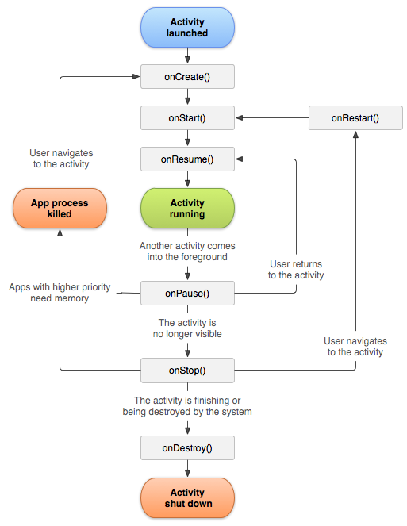

# Activity 活动

## 生命周期

### 概述

| Stage         | 描述                                                         |
| ------------- | ------------------------------------------------------------ |
| `onCreate()`  | 此处调用 `setContentView()` 定义 Activity 界面的布局。       |
| `onStart()`   | 当 `onCreate()` 退出时，activity 进入“已开始”状态，且用户可以看到相应的 activity。 此回调包含 Activity 对 Activity 的最终准备工作， 进入前台并具有互动性。当 activity 进入“已启动”状态时，所有具有生命周期感知能力的组件 activity 生命周期的剩余时间会收到 [`ON_START`](https://developer.android.com/reference/androidx/lifecycle/Lifecycle.Event?hl=zh-cn#ON_START) 事件（以此类推其他hook）。 |
| `onResume()`  | 系统会在 Activity 开始交互之前调用此回调。与用户交互时，activity 位于 activity stack的顶部。会捕获所有用户输入的内容应用的大部分核心功能，都是在 `onResume()` 方法中实现。这是应用与用户互动的状态。应用会一直保持这种状态，直到 使焦点远离应用，例如接听来电的设备、用户 导航到其他 activity，或设备屏幕关闭。 |
| `onPause()`   | 处于“已暂停”状态的 activity 可以继续更新界面。此类 activity 的示例包括显示导航的 activity 地图屏幕或媒体播放器。即使此类 activity 失去焦点，用户预期其界面会继续更新。`onPause()` 执行完毕后， 下一个回调是 `onStop()` 或 `onResume()`。 |
| `onStop()`    | 停止。系统会在发生以下情况时调用 `onStop()`： 活动对用户不再可见。 发生这种情况可能是因为 activity 被销毁，一个新的 activity 或现有活动进入 “已恢复”状态且包含已停止的 activity。系统调用的下一个回调是 `onRestart()`（如果 再次与用户进行互动）；如果此活动将完全终止，那就进入  `onDestroy()` 。 |
| `onRestart()` | 当处于“已停止”状态的 activity 出现以下情况时，系统会调用此回调 即将重启。`onRestart()` 从 Activity 停止时的状态恢复 Activity。该回调后面始终跟有 `onStart()`。 |
| `onDestroy()` | 系统会在销毁 activity 之前调用此回调。此回调是 Activity 接收的最后一个回调。 “`onDestroy()`”现为 通常用于确保活动的所有资源 在 activity 或包含它的进程被销毁时释放。 |



无论您选择在哪个构建事件中执行初始化操作，都请务必使用相应的生命周期事件来释放资源。观察图中右侧的返回路径。

- 如果 `ON_START` 事件后， `ON_STOP` 事件。
- 如果您 在 `ON_RESUME` 事件后初始化，在 `ON_PAUSE` 事件。


### Activity 状态和从内存中弹出

| 系统终止进程的可能性 | 进程状态                   | 最终 activity 状态 |
| :------------------- | :------------------------- | :----------------- |
| 最低                 | 前台（拥有或即将获得焦点） | 已恢复             |
| 低                   | 可见（无焦点）             | 已开始/已暂停      |
| 较高                 | 背景（不可见）             | 已停止             |
| 最高                 | 未连接                     | 已销毁             |


### 保存和恢复瞬时界面状态

在大多数情况下，您同时使用 `ViewModel` 和 `onSaveInstance()`。

- 实例状态 => bundle 对象

- 使用 onSaveInstanceState() 保存简单轻量的界面状态

  ```kotlin
  override fun onSaveInstanceState(outState: Bundle?) {
      // Save the user's current game state.
      outState?.run {
          putInt(STATE_SCORE, currentScore)
          putInt(STATE_LEVEL, currentLevel)
      }
  
      // Always call the superclass so it can save the view hierarchy state.
      super.onSaveInstanceState(outState)
  }
  
  companion object {
      val STATE_SCORE = "playerScore"
      val STATE_LEVEL = "playerLevel"
  }
  ```

- 使用保存的实例状态恢复 Activity 界面状态

  ```kotlin
  override fun onCreate(savedInstanceState: Bundle?) {
      super.onCreate(savedInstanceState) // Always call the superclass first
  
      // Check whether we're recreating a previously destroyed instance.
      if (savedInstanceState != null) {
          with(savedInstanceState) {
              // Restore value of members from saved state.
              currentScore = getInt(STATE_SCORE)
              currentLevel = getInt(STATE_LEVEL)
          }
      } else {
          // Probably initialize members with default values for a new instance.
      }
      // ...
  }
  ```

  或者使用这个 onRestoreInstanceState 方法覆盖，此时不需要 check null。

  ```kotlin
  override fun onRestoreInstanceState(savedInstanceState: Bundle?) {
      // Always call the superclass so it can restore the view hierarchy.
      super.onRestoreInstanceState(savedInstanceState)
  
      // Restore state members from saved instance.
      savedInstanceState?.run {
          currentScore = getInt(STATE_SCORE)
          currentLevel = getInt(STATE_LEVEL)
      }
  }
  ```

  


### 从一个 Activity 启动另一个 Activity

- startActivity()： 用于启动精确的Activity

```kotlin
val intent = Intent(this, SignInActivity::class.java)
startActivity(intent)
```

- Intent 启动：按照意图区分，例如发送邮件，用户可以选择要使用哪一个程序来发送。

```kotlin
val intent = Intent(Intent.ACTION_SEND).apply {
    putExtra(Intent.EXTRA_EMAIL, recipientArray)
}
startActivity(intent)
```

- startActivityForResult()：例如，您可以开始 一个 activity，可让用户在联系人列表中选择一个人。当它结束时，返回所选对象。

```kotlin
class MyActivity : Activity() {
    // ...

    override fun onKeyDown(keyCode: Int, event: KeyEvent?): Boolean {
        if (keyCode == KeyEvent.KEYCODE_DPAD_CENTER) {
            // When the user center presses, let them pick a contact.
            startActivityForResult(
                    Intent(Intent.ACTION_PICK,Uri.parse("content://contacts")),
                    PICK_CONTACT_REQUEST)
            return true
        }
        return false
    }

    override fun onActivityResult(requestCode: Int, resultCode: Int, intent: Intent?) {
        when (requestCode) {
            PICK_CONTACT_REQUEST ->
                if (resultCode == RESULT_OK) {
                    // A contact was picked. Display it to the user.
                    startActivity(Intent(Intent.ACTION_VIEW, intent?.data))
                }
        }
    }

    companion object {
        internal val PICK_CONTACT_REQUEST = 0
    }
}
```

- 协调 Activity

当一个 Activity 启动另一个 Activity 时，它们会经历生命周期转换。第一个 Activity 停止运行并进入“已暂停”或“已停止”状态，同时创建另一个 Activity。如果这些 Activity 共享保存到磁盘或其他位置的数据，必须要明确第一个 Activity 在创建第二个 Activity 之前并未完全停止。


## Activity 状态变更

### Activity 或对话框显示在前台

- 如果新的 activity 或对话框出现在前台，使其获得焦点并**部分覆盖**正在进行的 activity，被覆盖的 activity 会失去焦点并进入“已暂停”状态。然后，系统会对其调用 [`onPause()`](https://developer.android.com/reference/android/app/Activity?hl=zh-cn#onPause())。当被覆盖的 activity 返回前台并重新获得焦点时，系统会调用 [`onResume()`](https://developer.android.com/reference/android/app/Activity?hl=zh-cn#onResume())。

- 如果新的 activity 或对话框出现在前台，使其获得焦点并**完全覆盖**正在进行的 activity，被覆盖的 activity 会失去焦点并进入“已停止”状态。然后，系统会快速连续调用 `onPause()` 和 [`onStop()`](https://developer.android.com/reference/android/app/Activity?hl=zh-cn#onStop())。当被覆盖的 activity 的同一实例返回前台时，系统会对该 activity 调用 [`onRestart()`](https://developer.android.com/reference/android/app/Activity?hl=zh-cn#onRestart())、[`onStart()`](https://developer.android.com/reference/android/app/Activity?hl=zh-cn#onStart()) 和 `onResume()`。如果是被覆盖的 activity 的新实例进入后台，则系统不会调用 `onRestart()`，而只会调用 `onStart()` 和 `onResume()`。

>**注意** ：当用户点按“概览”或“主屏幕”按钮时，系统的行为就好像当前 activity 已被完全覆盖一样。


### 用户点按或手势“返回”

覆盖  [`onBackPressed()`](https://developer.android.com/reference/android/app/Activity?hl=zh-cn#onBackPressed()) 方法来实现自定义行为。


## 测试Activity

### 创建 Activity

```kotlin
@RunWith(AndroidJUnit4::class)
class MyTestSuite {
    @Test fun testEvent() {
       launchActivity<MyActivity>().use {
       }
    }
}
```

也可以使用 `ActivityScenarioRule` 自动调用

```kotlin
@RunWith(AndroidJUnit4::class)
class MyTestSuite {
    @get:Rule var activityScenarioRule = activityScenarioRule<MyActivity>()

    @Test fun testEvent() {
        val scenario = activityScenarioRule.scenario
    }
}
```

### 使 Activity 转换到新的状态

使用 moveToState 进行状态转换。

```kotlin
@RunWith(AndroidJUnit4::class)
class MyTestSuite {
    @Test fun testEvent() {
        launchActivity<MyActivity>().use { scenario ->
            scenario.moveToState(State.CREATED)
        }
    }
}
```

### 确定当前的 Activity 状态

请获取 `ActivityScenario` 对象中的 `state` 字段：

```kotlin
@RunWith(AndroidJUnit4::class)
class MyTestSuite {
    @Test fun testEvent() {
        launchActivity<MyActivity>().use { scenario ->
            scenario.onActivity { activity ->
              startActivity(Intent(activity, MyOtherActivity::class.java))
            }

            val originalActivityState = scenario.state
        }
    }
}
```


### 重新创建 Activity

```kotlin
@RunWith(AndroidJUnit4::class)
class MyTestSuite {
    @Test fun testEvent() {
        launchActivity<MyActivity>().use { scenario ->
            scenario.recreate()
        }
    }
}
```


### 检索 Activity 结果

```kotlin
@RunWith(AndroidJUnit4::class)
class MyTestSuite {
    @Test fun testResult() {
        launchActivity<MyActivity>().use {
            onView(withId(R.id.finish_button)).perform(click())

            // Activity under test is now finished.

            val resultCode = scenario.result.resultCode
            val resultData = scenario.result.resultData
        }
    }
}
```


## 任务和返回堆栈 

### 定义启动模式

#### 使用清单文件定义启动模式

- standard：标准，每次创建都是新实例。
- singleTop：单顶，
  - 已在栈顶，直接重用，通过 `onNewIntent()` 接收 intent。
  - 不在栈顶，假设活动栈为A-B-C-D，B为singleTop模式，那么会清除CD（简化导航，省内存），新建B，最后栈为A-B。
- singleTask
  - 已在任务栈中发现了相同的实例，将其上面的任务终止并移除，重用该实例。
  - 不在任务栈中，新建实例并入栈。
- singleInstance：单独管理，不属于普通的活动栈，而且是该Activity是单例模式。
- singleInstancePerTask

#### 使用 Intent 标志定义启动模式

- [`FLAG_ACTIVITY_NEW_TASK`](https://developer.android.com/reference/android/content/Intent?hl=zh-cn#FLAG_ACTIVITY_NEW_TASK)
- [`FLAG_ACTIVITY_SINGLE_TOP`](https://developer.android.com/reference/android/content/Intent?hl=zh-cn#FLAG_ACTIVITY_SINGLE_TOP)
- [`FLAG_ACTIVITY_CLEAR_TOP`](https://developer.android.com/reference/android/content/Intent?hl=zh-cn#FLAG_ACTIVITY_CLEAR_TOP)


### 处理亲和性

See also  [`taskAffinity`](https://developer.android.com/guide/topics/manifest/activity-element?hl=zh-cn#aff)


### 清除返回堆栈

- [`alwaysRetainTaskState`](https://developer.android.com/guide/topics/manifest/activity-element#always)
- [`clearTaskOnLaunch`](https://developer.android.com/guide/topics/manifest/activity-element#clear)

- [`finishOnTaskLaunch`](https://developer.android.com/guide/topics/manifest/activity-element#finish)


## Parcelable 和 Bundle

`Parcel` 并非通用型 序列化机制，您不得 将任何 `Parcel` 数据存储在磁盘上或通过网络发送。

- [writeToParcel(android.os.Parcel, int)](https://developer.android.com/reference/android/os/Parcelable?hl=zh-cn#writeToParcel(android.os.Parcel, int))
- [createFromParcel()](https://developer.android.com/reference/android/os/Parcelable.Creator?hl=zh-cn#createFromParcel(android.os.Parcel))

