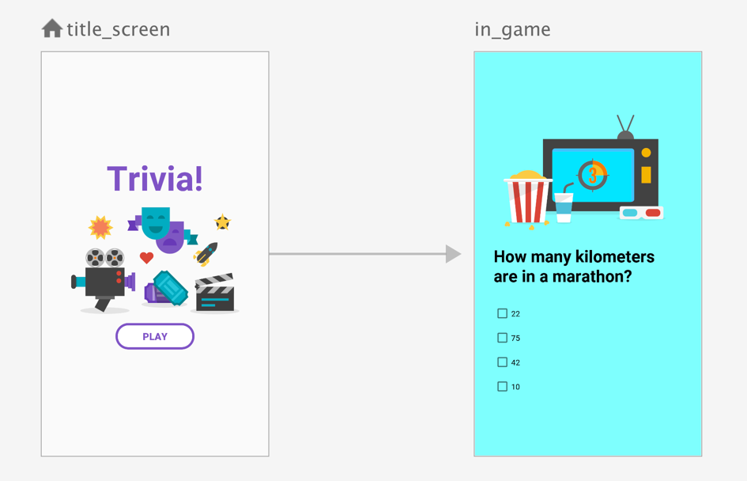

# Navigation组件

## 概览

### 主要概念

| 构思     | 目的                                                         | 类型                                                         |
| :------- | :----------------------------------------------------------- | :----------------------------------------------------------- |
| 宿主     | 包含当前导航目的地的界面元素。也就是说，当用户浏览应用时，该应用实际上会在导航宿主中切换目的地。 | **Compose**：[`NavHost`](https://developer.android.com/reference/kotlin/androidx/navigation/compose/package-summary?hl=zh-cn#NavHost(androidx.navigation.NavHostController,androidx.navigation.NavGraph,androidx.compose.ui.Modifier,androidx.compose.ui.Alignment,kotlin.Function1,kotlin.Function1,kotlin.Function1,kotlin.Function1)) <br>**fragment**：[`NavHostFragment`](https://developer.android.com/reference/androidx/navigation/fragment/NavHostFragment?hl=zh-cn) |
| 图表     | 一种数据结构，用于定义应用中的所有导航目的地以及它们如何连接在一起。 | [`NavGraph`](https://developer.android.com/reference/androidx/navigation/NavGraph?hl=zh-cn) |
| 控制器   | 用于管理目的地之间导航的中央协调器。该控制器提供了一些方法，可在目的地之间导航、处理深层链接、管理返回堆栈等。 | [`NavController`](https://developer.android.com/reference/androidx/navigation/NavController?hl=zh-cn) |
| 目标网址 | 导航图中的节点。当用户导航到此节点时，主机会显示其内容。     | [`NavDestination`](https://developer.android.com/reference/androidx/navigation/NavDestination?hl=zh-cn)通常在构建导航图时创建。 |
| 路线     | 唯一标识目的地及其所需的任何数据。您可以使用路线进行导航。路线可带您前往目的地。 |                                                              |


### 设置您的环境

```kotlin
dependencies {
  val nav_version = "2.7.7"

  // Jetpack Compose integration
  implementation("androidx.navigation:navigation-compose:$nav_version")

  // Views/Fragments integration
  implementation("androidx.navigation:navigation-fragment:$nav_version")
  implementation("androidx.navigation:navigation-ui:$nav_version")

  // Feature module support for Fragments
  implementation("androidx.navigation:navigation-dynamic-features-fragment:$nav_version")

  // Testing Navigation
  androidTestImplementation("androidx.navigation:navigation-testing:$nav_version")

}
```


### 其他资源

文档

- [创建导航控制器](https://developer.android.com/guide/navigation/navcontroller?hl=zh-cn)：概述如何创建 `NavController`。
- [创建导航图](https://developer.android.com/guide/navigation/design?hl=zh-cn)：详细了解如何创建导航宿主和导航图。
- [导航到目的地](https://developer.android.com/guide/navigation/use-graph/navigate?hl=zh-cn)：演示了如何使用 `NavController` 在图中的目的地之间移动。

Codelab

- [了解 Jetpack Navigation](https://developer.android.com/codelabs/android-navigation?hl=zh-cn)
- [fragment 和 Navigation 组件](https://developer.android.com/codelabs/basic-android-kotlin-training-fragments-navigation-component?hl=zh-cn)
- [构建具有动态导航栏的自适应应用](https://developer.android.com/codelabs/basic-android-kotlin-compose-adaptive-navigation-for-large-screens?hl=zh-cn#0)

视频

- [浏览导航组件](https://www.youtube.com/watch?v=09qjn706ITA&hl=zh-cn)
- [移到一个 activity 的 10 大最佳实践](https://www.youtube.com/watch?v=9O1D_Ytk0xg&hl=zh-cn)
- [一个 activity：为何、何时以及如何（2018 年 Android 开发者峰会）](https://www.youtube.com/watch?v=2k8x8V77CrU&hl=zh-cn)
- [Android Jetpack：使用导航控制器管理界面导航（2018 年 Google I/O 大会）](https://www.youtube.com/watch?v=8GCXtCjtg40&hl=zh-cn)


## 创建导航控制器

您创建的每个 `NavHost` 各自都有对应的 `NavController`。`NavController` 提供对 `NavHost` 的图表的访问权限。

```kotlin
val navController = rememberNavController()
```

### View

如果您使用的是 View 界面框架，可以根据上下文使用下列方法之一来检索 NavController：

Kotlin：

- [`Fragment.findNavController()`](https://developer.android.com/reference/kotlin/androidx/navigation/fragment/package-summary?hl=zh-cn#(androidx.fragment.app.Fragment).findNavController())
- [`View.findNavController()`](https://developer.android.com/reference/kotlin/androidx/navigation/package-summary?hl=zh-cn#(android.view.View).findNavController())
- [`Activity.findNavController(viewId: Int)`](https://developer.android.com/reference/kotlin/androidx/navigation/package-summary?hl=zh-cn#(android.app.Activity).findNavController(kotlin.Int))

通常，您需要先获取 `NavHostFragment`，然后从 fragment 检索 `NavController`。以下代码段演示了此过程：

```kotlin
val navHostFragment =
    supportFragmentManager.findFragmentById(R.id.nav_host_fragment) as NavHostFragment
val navController = navHostFragment.navController
```


## 设计导航图

### 目的地类型

| 类型     | 说明                                                         | 用例                                                         |
| :------- | :----------------------------------------------------------- | :----------------------------------------------------------- |
| 托管     | 填充整个导航宿主。也就是说，托管目的地的大小与导航宿主的大小相同，之前的目的地不会显示。 | 主界面和详情界面。                                           |
| 对话框   | 显示叠加界面组件。此界面与导航宿主的位置或大小无关。之前的目的地会显示在该目的地下方。 | 提醒、选择、表单。                                           |
| activity | 表示应用中的独特界面或功能。                                 | 充当导航图的退出点，启动与 Navigation 组件分开管理的新 Android activity。在 Modern Android Development 中，应用由 1 个 activity 组成。因此，当与第三方 activity 互动或作为[迁移过程](https://developer.android.com/guide/navigation/migrate?hl=zh-cn)的一部分时，最适合使用 activity 目的地。 |


### Compose

```kotlin
@Serializable
object Profile
@Serializable
object FriendsList

val navController = rememberNavController()

NavHost(navController = navController, startDestination = Profile) {
    composable<Profile> { ProfileScreen( /* ... */ ) }
    composable<FriendsList> { FriendsListScreen( /* ... */ ) }
    // Add more destinations similarly.
}
```

1. 可序列化对象表示两个路由（`Profile` 和 `FriendsList`。
2. 调用 `NavHost` 可组合项会传递 `NavController` 和路线 为起始目的地。
3. 传递给 `NavHost` 的 lambda 最终会调用 [`NavController.createGraph()`](https://developer.android.com/reference/androidx/navigation/NavController?hl=zh-cn#(androidx.navigation.NavController).createGraph(kotlin.Int,kotlin.Int,kotlin.Function1)) 并返回 `NavGraph`。
4. 每条路线均作为类型参数提供到 [`NavGraphBuilder.composable()`](https://developer.android.com/reference/kotlin/androidx/navigation/NavGraphBuilder?hl=zh-cn#(androidx.navigation.NavGraphBuilder).composable(kotlin.collections.Map,kotlin.collections.List,kotlin.Function1,kotlin.Function1,kotlin.Function1,kotlin.Function1,kotlin.Function1,kotlin.Function2))，用于将目的地添加到 `NavGraph`。
5. 传递给 `composable` 的 lambda 就是 `NavHost` 为此显示的 lambda 目标。

或者使用这种定义：

```kotlin
val navGraph by remember(navController) {
  navController.createGraph(startDestination = Profile)) {
    composable<Profile> { ProfileScreen( /* ... */ ) }
    composable<FriendsList> { FriendsListScreen( /* ... */ ) }
  }
}
NavHost(navController, navGraph)
```

#### 获取路由实例

```kotlin
@Serializable
data class Profile(val name: String)

val navController = rememberNavController()

NavHost(navController = navController, startDestination = Profile(name="John Smith")) {
    composable<Profile> { backStackEntry ->
        val profile: Profile = backStackEntry.toRoute()
        ProfileScreen(name = profile.name) }
}
```

- `Profile` 路线指定导航中的起始目的地 使用 `"John Smith"` 作为 `name` 的参数。
- 目的地本身是 `composable<Profile>{}` 代码块。
- `ProfileScreen` 可组合项会自行接受 `profile.name` 的值 `name` 参数。
- 因此，值 `"John Smith"` 会传递给 `ProfileScreen`。

#### 最小示例

```kotlin
@Serializable
data class Profile(val name: String)

@Serializable
object FriendsList

// Define the ProfileScreen composable.
@Composable
fun ProfileScreen(
    profile: Profile
    onNavigateToFriendsList: () -> Unit,
  ) {
  Text("Profile for ${profile.name}")
  Button(onClick = { onNavigateToFriendsList() }) {
    Text("Go to Friends List")
  }
}

// Define the FriendsListScreen composable.
@Composable
fun FriendsListScreen(onNavigateToProfile: () -> Unit) {
  Text("Friends List")
  Button(onClick = { onNavigateToProfile() }) {
    Text("Go to Profile")
  }
}

// Define the MyApp composable, including the `NavController` and `NavHost`.
@Composable
fun MyApp() {
  val navController = rememberNavController()
  NavHost(navController, startDestination = Profile(name = "John Smith")) {
    composable<Profile> { backStackEntry ->
        val profile: Profile = backStackEntry.toRoute()
        ProfileScreen(
            profile = profile,
            onNavigateToFriendsList = {
                navController.navigate(route = FriendsList)
            }
        )
    }
    composable<FriendsList> {
      FriendsListScreen(
        onNavigateToProfile = {
          navController.navigate(
            route = Profile(name = "Aisha Devi")
          )
        }
      )
    }
  }
}
```

如代码段所示，向 `NavHost` 公开事件，而不是将 `NavController` 传递给可组合项。也就是说，可组合项应具有一个 `() -> Unit` 类型的参数，`NavHost` 可为该参数传递一个会调用 `NavController.navigate()` 的 lambda。


### Fragment

#### 以程序化方式

Navigation 组件适用于具有一个主 activity 和多个 fragment 目的地的应用。主 activity 与导航图关联，且包含一个负责根据需要交换目的地的 `NavHostFragment`。在具有多个 activity 目的地的应用中，每个 activity 均拥有其自己的导航图。

创建 `NavHostFragment`：

```kotlin
<FrameLayout xmlns:android="http://schemas.android.com/apk/res/android"
    xmlns:app="http://schemas.android.com/apk/res-auto"
    android:layout_width="match_parent"
    android:layout_height="match_parent">

    <androidx.fragment.app.FragmentContainerView
        android:id="@+id/nav_host_fragment"
        android:name="androidx.navigation.fragment.NavHostFragment"
        android:layout_width="match_parent"
        android:layout_height="match_parent" />
</FrameLayout>
```

将 `NavHostFragment` 的 `id` 传递给 [`NavController.findNavController`](https://developer.android.com/reference/androidx/navigation/Navigation?hl=zh-cn#findNavController(android.view.View))()。

随后，调用 [`NavController.createGraph()`](https://developer.android.com/reference/androidx/navigation/NavController?hl=zh-cn#(androidx.navigation.NavController).createGraph(kotlin.Int,kotlin.Int,kotlin.Function1)) 会将图表链接到 `NavController`，并对 `NavHostFragment`：

```kotlin
@Serializable
data class Profile(val name: String)

@Serializable
object FriendsList

// Retrieve the NavController.
val navController = findNavController(R.id.nav_host_fragment)

// Add the graph to the NavController with `createGraph()`.
navController.graph = navController.createGraph(
    startDestination = Profile(name = "John Smith")
) {
    // Associate each destination with one of the route constants.
    fragment<ProfileFragment, Profile> {
        label = "Profile"
    }

    fragment<FriendsListFragment, FriendsList>() {
        label = "Friends List"
    }

    // Add other fragment destinations similarly.
}
```

#### XML方式

`NavHostFragment` 的最小实现：

```xml
<FrameLayout xmlns:android="http://schemas.android.com/apk/res/android"
    xmlns:app="http://schemas.android.com/apk/res-auto"
    android:layout_width="match_parent"
    android:layout_height="match_parent">

    <androidx.fragment.app.FragmentContainerView
        android:id="@+id/nav_host_fragment"
        android:name="androidx.navigation.fragment.NavHostFragment"
        android:layout_width="match_parent"
        android:layout_height="match_parent"
        app:navGraph="@navigation/nav_graph" />

</FrameLayout>
```

nav_graph 的定义：

```kotlin
<navigation xmlns:android="http://schemas.android.com/apk/res/android"
    xmlns:app="http://schemas.android.com/apk/res-auto"
    android:id="@+id/nav_graph"
    app:startDestination="@id/profile">

    <fragment
        android:id="@+id/profile"
        android:name="com.example.ProfileFragment"
        android:label="Profile">

        <!-- Action to navigate from Profile to Friends List. -->
        <action
            android:id="@+id/action_profile_to_friendslist"
            app:destination="@id/friendslist" />
    </fragment>

    <fragment
        android:id="@+id/friendslist"
        android:name="com.example.FriendsListFragment"
        android:label="Friends List" />

    <!-- Add other fragment destinations similarly. -->
</navigation>
```


### 对话框目的地

“对话框目的地”一词是指应用导航图中的目的地，会以对话框窗口的形式叠加在应用界面元素和内容之上。


#### 对话框可组合项

```kotlin
@Serializable
object Home
@Serializable
object Settings
@Composable
fun HomeScreen(onNavigateToSettings: () -> Unit){
    Column {
        Text("Home")
        Button(onClick = onNavigateToSettings){
            Text("Open settings")
        }
    }
}

// This screen will be displayed as a dialog
@Composable
fun SettingsScreen(){
    Text("Settings")
    // ...
}

@Composable
fun MyApp() {
    val navController = rememberNavController()
    NavHost(navController, startDestination = Home) {
        composable<Home> { HomeScreen(onNavigateToSettings = { navController.navigate(route = Settings) }) }
        dialog<Settings> { SettingsScreen() }
    }
}
```

### activity 目的地

#### XML

```xml
<?xml version="1.0" encoding="utf-8"?>
<navigation xmlns:android="http://schemas.android.com/apk/res/android"
    xmlns:app="http://schemas.android.com/apk/res-auto"
    android:id="@+id/navigation_graph"
    app:startDestination="@id/simpleFragment">

    <activity
        android:id="@+id/sampleActivityDestination"
        android:name="com.example.android.navigation.activity.DestinationActivity"
        android:label="@string/sampleActivityTitle" />
</navigation>
```

或者使用intent定义。目的地 `Activity` 的清单条目中的 [`intent-filter`](https://developer.android.com/guide/topics/manifest/intent-filter-element?hl=zh-cn) 决定了您需要如何构造 `Activity` 目的地。

```xml
<?xml version="1.0" encoding="utf-8"?>
<manifest xmlns:android="http://schemas.android.com/apk/res/android"
    package="com.example.android.navigation.activity">
    <application>
        <activity android:name=".DestinationActivity">
            <intent-filter>
                <action android:name="android.intent.action.VIEW" />
                <data
                    android:host="example.com"
                    android:scheme="https" />
                <category android:name="android.intent.category.BROWSABLE" />
                <category android:name="android.intent.category.DEFAULT" />
            </intent-filter>
        </activity>
    </application>
</manifest>
```

您需要使用与清单条目中匹配的 [`action`](https://developer.android.com/reference/androidx/navigation/ActivityNavigator.Destination?hl=zh-cn#setAction(java.lang.String)) 和 [`data`](https://developer.android.com/reference/androidx/navigation/ActivityNavigator.Destination?hl=zh-cn#setData(android.net.Uri)) 属性来配置相应的 `Activity` 目的地：

```xml
<?xml version="1.0" encoding="utf-8"?>
<navigation xmlns:android="http://schemas.android.com/apk/res/android"
    xmlns:app="http://schemas.android.com/apk/res-auto"
    android:id="@+id/navigation_graph"
    app:startDestination="@id/simpleFragment">
    <activity
        android:id="@+id/localDestinationActivity"
        android:label="@string/localActivityTitle"
        app:action="android.intent.action.VIEW"
        app:data="https://example.com"
        app:targetPackage="${applicationId}" />
</navigation>
```

为当前 [`applicationId`](https://developer.android.com/studio/build/configure-app-module?hl=zh-cn#set_the_application_id) 指定 [`targetPackage`](https://developer.android.com/reference/kotlin/androidx/navigation/ActivityNavigator.Destination?hl=zh-cn#setTargetPackage(kotlin.String))可将作用域限定为当前应用（其包含主应用）。

例如： `app:targetPackage="com.example.android.another.app"`。


#### 动态参数

可以在格式类似于 `https://example.com?userId=<actual user ID>` 的网址中发送用户 ID。

在这种情况下，请使用 [`dataPattern`](https://developer.android.com/reference/androidx/navigation/ActivityNavigator.Destination?hl=zh-cn#setDataPattern(java.lang.String))，而不是 [`data`](https://developer.android.com/reference/androidx/navigation/ActivityNavigator.Destination?hl=zh-cn#setData(android.net.Uri)) 属性。然后，可为 `dataPattern` 值中的具名占位符提供要被替代的参数：

```xml
<?xml version="1.0" encoding="utf-8"?>
<navigation xmlns:android="http://schemas.android.com/apk/res/android"
    xmlns:app="http://schemas.android.com/apk/res-auto"
    android:id="@+id/navigation_graph"
    app:startDestination="@id/simpleFragment">
    <activity
        android:id="@+id/localDestinationActivity"
        android:label="@string/localActivityTitle"
        app:action="android.intent.action.VIEW"
        app:dataPattern="https://example.com?userId={userId}"
        app:targetPackage="com.example.android.another.app">
        <argument
            android:name="userId"
            app:argType="string" />
    </activity>
</navigation>
```

接着可以使用 [Safe Args](https://developer.android.com/guide/navigation/navigation-pass-data?hl=zh-cn#Safe-args) 或 `Bundle` 指定 `userId` 值：

```kotlin
navController.navigate(
    R.id.localDestinationActivity,
    bundleOf("userId" to "someUser")
)
```


### 嵌套图

```kotlin
// Routes
@Serializable object Title
@Serializable object Register

// Route for nested graph
@Serializable object Game

// Routes inside nested graph
@Serializable object Match
@Serializable object InGame
@Serializable object ResultsWinner
@Serializable object GameOver

NavHost(navController, startDestination = Title) {
   composable<Title> {
       TitleScreen(
           onPlayClicked = { navController.navigate(route = Register) },
           onLeaderboardsClicked = { /* Navigate to leaderboards */ }
       )
   }
   composable<Register> {
       RegisterScreen(
           onSignUpComplete = { navController.navigate(route = Game) }
       )
   }
   navigation<Game>(startDestination = Match) {
       composable<Match> {
           MatchScreen(
               onStartGame = { navController.navigate(route = InGame) }
           )
       }
       composable<InGame> {
           InGameScreen(
               onGameWin = { navController.navigate(route = ResultsWinner) },
               onGameLose = { navController.navigate(route = GameOver) }
           )
       }
       composable<ResultsWinner> {
           ResultsWinnerScreen(
               onNextMatchClicked = {
                   navController.navigate(route = Match) {
                       popUpTo(route = Match) { inclusive = true }
                   }
               },
               onLeaderboardsClicked = { /* Navigate to leaderboards */ }
           )
       }
       composable<GameOver> {
           GameOverScreen(
               onTryAgainClicked = {
                   navController.navigate(route = Match) {
                       popUpTo(route = Match) { inclusive = true }
                   }
               }
           )
       }
   }
}
```


#### 其他资源

示例

- [NavigationBasicSample](https://github.com/android/architecture-components-samples/tree/main/NavigationBasicSample)

Codelab

- [了解 Jetpack Navigation](https://codelabs.developers.google.com/codelabs/android-navigation/index.html?index=..%2F..%2Findex&hl=zh-cn#0)

视频

- [Android Jetpack：使用导航控制器管理界面导航（2018 年 Google I/O 大会）](https://www.youtube.com/watch?v=8GCXtCjtg40&hl=zh-cn)


### 为目标创建深层链接 

在 Android 中，深层链接是指将用户直接定向到应用内特定目的地的链接。

借助 Navigation 组件，您可以创建两种不同类型的深层链接：显式深层链接和隐式深层链接。


#### 创建显式深层链接

使用 `NavDeepLinkBuilder()`

```kotlin
val pendingIntent = NavDeepLinkBuilder(context)
    .setGraph(R.navigation.nav_graph)
    .setDestination(R.id.android)
    .setArguments(args)
    .setComponentName(DestinationActivity::class.java)
    .createPendingIntent()
```

#### 创建隐式深层链接

```xml
<fragment android:id="@+id/a"
          android:name="com.example.myapplication.FragmentA"
          tools:layout="@layout/a">
        <deepLink app:uri="www.example.com"
                app:action="android.intent.action.MY_ACTION"
                app:mimeType="type/subtype"/>
</fragment>
```

可以通过 URI、intent 操作和 MIME 类型匹配深层链接。您可以为单个深层链接指定多个匹配类型，但请注意，匹配的优先顺序依次是 URI 参数、操作和 MIME 类型。

如需启用隐式深层链接，还必须向应用的 `manifest.xml` 文件中添加内容。将一个 `<nav-graph>` 元素添加到指向现有导航图的 activity，如以下示例所示。

```xml
<?xml version="1.0" encoding="utf-8"?>
<manifest xmlns:android="http://schemas.android.com/apk/res/android"
    package="com.example.myapplication">
    <application ... >
        <activity name=".MainActivity" ...>
            <nav-graph android:value="@navigation/nav_graph" />
        </activity>
    </application>
</manifest>
```


#### 处理深层链接

使用 Navigation 时，强烈建议您始终使用默认[`launchMode`](https://developer.android.com/guide/topics/manifest/activity-element?hl=zh-cn#lmode)：`standard`。使用 `standard` 启动模式时，Navigation 会调用 [`handleDeepLink()`](https://developer.android.com/reference/androidx/navigation/NavController?hl=zh-cn#handleDeepLink(android.content.Intent)) 来处理 `Intent` 中的任何显式或隐式深层链接，从而自动处理深层链接。

否则，需要手动处理。

```kotlin
override fun onNewIntent(intent: Intent?) {
    super.onNewIntent(intent)
    navController.handleDeepLink(intent)
}
```


### 封装导航代码

将

```kotlin
// MyApp.kt

@Serializable
object Contacts

@Composable
fun MyApp() {
  ...
  NavHost(navController, startDestination = Contacts) {
    composable<Contacts> { ContactsScreen( /* ... */ ) }
  }
}
```

重构为

```kotlin
// ContactsNavigation.kt

@Serializable
object Contacts

// 通过在 NavGraphBuilder 上创建扩展函数来公开目的地
fun NavGraphBuilder.contactsDestination() {
    composable<Contacts> { ContactsScreen( /* ... */ ) }
}

// MyApp.kt

@Composable
fun MyApp() {
  ...
  NavHost(navController, startDestination = Contacts) {
     contactsDestination()
  }
}
```

---

#### 示例

```kotlin
// ContactsNavigation.kt

@Serializable
object Contacts

// Adds contacts destination to `this` NavGraphBuilder
fun NavGraphBuilder.contactsDestination(
  // Navigation events are exposed to the caller to be handled at a higher level
  onNavigateToContactDetails: (contactId: String) -> Unit
) {
  composable<Contacts> {
    // The ViewModel as a screen level state holder produces the screen
    // UI state and handles business logic for the ConversationScreen
    val viewModel: ContactsViewModel = hiltViewModel()
    val uiState = viewModel.uiState.collectAsStateWithLifecycle()
    ContactsScreen(
      uiState,
      onNavigateToContactDetails
    )
  }
}
```

```kotlin
// ContactsNavigation.kt

// 使用 internal 确保屏幕和路由类型不会公开
@Serializable
internal data class ContactDetails(val id: String)

fun NavGraphBuilder.contactDetailsScreen() {
  composable<ContactDetails> { navBackStackEntry ->
    ContactDetailsScreen(contact = navBackStackEntry.toRoute())
  }
}
```

```kotlin
// ContactsNavigation.kt

// 通过在 NavController 上创建扩展函数来公开导航事件
fun NavController.navigateToContactDetails(id: String) {
  navigate(route = ContactDetails(id = id))
}
```

```kotlin
// MyApp.kt

@Composable
fun MyApp() {
  ...
  NavHost(navController, startDestination = Contacts) {
     contactsDestination(onNavigateToContactDetails = { contactId ->
        // .navigateToContactDetails()的使用
        navController.navigateToContactDetails(id = contactId)
     })
      // typo ?=> contactDetailsScreen
     contactDetailsDestination()
  }
}
```


### 全局操作

不妨参考以下示例。`results_winner` 和 `game_over` 目的地都需要弹出到主目的地。`action_pop_out_of_game` 操作提供了这样做的能力；`action_pop_out_of_game` 是任何特定 fragment 之外的全局操作。您可以在 `in_game_nav_graph` 中的任意位置引用和调用它。

```xml
<?xml version="1.0" encoding="utf-8"?>
<navigation xmlns:android="http://schemas.android.com/apk/res/android"
   xmlns:app="http://schemas.android.com/apk/res-auto"
   android:id="@+id/in_game_nav_graph"
   app:startDestination="@id/in_game">

   <!-- Action back to destination which launched into this in_game_nav_graph -->
   <action android:id="@+id/action_pop_out_of_game"
                       app:popUpTo="@id/in_game_nav_graph"
                       app:popUpToInclusive="true" />

   <fragment
       android:id="@+id/in_game"
       android:name="com.example.android.gamemodule.InGame"
       android:label="Game">
       <action
           android:id="@+id/action_in_game_to_resultsWinner"
           app:destination="@id/results_winner" />
       <action
           android:id="@+id/action_in_game_to_gameOver"
           app:destination="@id/game_over" />
   </fragment>

   <fragment
       android:id="@+id/results_winner"
       android:name="com.example.android.gamemodule.ResultsWinner" />

   <fragment
       android:id="@+id/game_over"
       android:name="com.example.android.gamemodule.GameOver"
       android:label="fragment_game_over"
       tools:layout="@layout/fragment_game_over" />

</navigation>
```


## 使用导航图

### 案例：用户登录

`UserViewModel` 中的用户数据是通过 `LiveData` 提供的，因此，为了确定要导航到的位置，您应观察此数据。导航到 `ProfileFragment` 后，如果存在用户数据，应用会显示欢迎辞。如果用户数据为 `null`，您随后应导航到 `LoginFragment`，因为用户需要先进行身份验证，然后才能看到其个人资料。

```kotlin
class ProfileFragment : Fragment() {
    private val userViewModel: UserViewModel by activityViewModels()

    override fun onViewCreated(view: View, savedInstanceState: Bundle?) {
        super.onViewCreated(view, savedInstanceState)
        val navController = findNavController()
        userViewModel.user.observe(viewLifecycleOwner, Observer { user ->
            if (user != null) {
                showWelcomeMessage()
            } else {
                navController.navigate(R.id.login_fragment)
            }
        })
    }

    private fun showWelcomeMessage() {
        ...
    }
}
```

如果用户到达 `ProfileFragment` 时用户数据为 `null`，则系统会将用户重定向到 `LoginFragment`。

可以使用 [`NavController.getPreviousBackStackEntry()`](https://developer.android.com/reference/androidx/navigation/NavController?hl=zh-cn#getPreviousBackStackEntry()) 来检索上一个目的地的 [`NavBackStackEntry`](https://developer.android.com/reference/androidx/navigation/NavBackStackEntry?hl=zh-cn)，它可封装目的地的 `NavController` 专用状态。`LoginFragment` 会使用上一个 `NavBackStackEntry` 的 [`SavedStateHandle`](https://developer.android.com/reference/androidx/lifecycle/SavedStateHandle?hl=zh-cn) 来设置一个初始值，指示用户是否已成功登录。这是我们希望在用户直接按系统返回按钮后返回的状态。使用 `SavedStateHandle` 设置此状态可以确保状态在进程终止后继续存在。

```kotlin
class LoginFragment : Fragment() {
    companion object {
        const val LOGIN_SUCCESSFUL: String = "LOGIN_SUCCESSFUL"
    }

    private val userViewModel: UserViewModel by activityViewModels()
    private lateinit var savedStateHandle: SavedStateHandle

    override fun onViewCreated(view: View, savedInstanceState: Bundle?) {
        savedStateHandle = findNavController().previousBackStackEntry!!.savedStateHandle
        savedStateHandle.set(LOGIN_SUCCESSFUL, false)
    }
}
```

用户输入用户名和密码后，系统会将相关信息传递给 `UserViewModel` 以进行身份验证。如果成功通过身份验证，`UserViewModel` 会存储用户数据。`LoginFragment` 随后会更新 `SavedStateHandle` 上的 `LOGIN_SUCCESSFUL` 值，并将其自身从返回堆栈上弹出。

```kotlin
class LoginFragment : Fragment() {
    companion object {
        const val LOGIN_SUCCESSFUL: String = "LOGIN_SUCCESSFUL"
    }

    private val userViewModel: UserViewModel by activityViewModels()
    private lateinit var savedStateHandle: SavedStateHandle

    override fun onViewCreated(view: View, savedInstanceState: Bundle?) {
        savedStateHandle = findNavController().previousBackStackEntry!!.savedStateHandle
        savedStateHandle.set(LOGIN_SUCCESSFUL, false)

        val usernameEditText = view.findViewById(R.id.username_edit_text)
        val passwordEditText = view.findViewById(R.id.password_edit_text)
        val loginButton = view.findViewById(R.id.login_button)

        loginButton.setOnClickListener {
            val username = usernameEditText.text.toString()
            val password = passwordEditText.text.toString()
            login(username, password)
        }
    }

    fun login(username: String, password: String) {
        userViewModel.login(username, password).observe(viewLifecycleOwner, Observer { result ->
            if (result.success) {
                savedStateHandle.set(LOGIN_SUCCESSFUL, true)
                findNavController().popBackStack()
            } else {
                showErrorMessage()
            }
        })
    }

    fun showErrorMessage() {
        // Display a snackbar error message
    }
}
```

注意，与身份验证相关的所有逻辑均保存在 `UserViewModel` 中。因为 `LoginFragment` 或 `ProfileFragment` 均不负责确定用户的身份验证方式。将逻辑封装在 `ViewModel` 中，可以更轻松地进行共享和测试。如果您的导航逻辑非常复杂，您应注意通过测试来验证该逻辑。

回到 `ProfileFragment` 中，存储在 `SavedStateHandle` 中的 `LOGIN_SUCCESSFUL` 值可以在 [`onCreate()`](https://developer.android.com/reference/androidx/fragment/app/Fragment?hl=zh-cn#onCreate(android.os.Bundle)) 方法中进行观察。当用户返回 `ProfileFragment` 时，系统会检查 `LOGIN_SUCCESSFUL` 值。如果值为 `false`，则可以将用户重定向回 `MainFragment`。

```kotlin
class ProfileFragment : Fragment() {
    ...

    override fun onCreate(savedInstanceState: Bundle?) {
        super.onCreate(savedInstanceState)

        val navController = findNavController()

        val currentBackStackEntry = navController.currentBackStackEntry!!
        val savedStateHandle = currentBackStackEntry.savedStateHandle
        savedStateHandle.getLiveData<Boolean>(LoginFragment.LOGIN_SUCCESSFUL)
                .observe(currentBackStackEntry, Observer { success ->
                    if (!success) {
                        // startDestination 这里是 MainFragment
                        val startDestination = navController.graph.startDestination
                        val navOptions = NavOptions.Builder()
                                .setPopUpTo(startDestination, true)
                                .build()
                        navController.navigate(startDestination, null, navOptions)
                    }
                })
    }

    ...
}
```

用户成功登录后，`ProfileFragment` 会显示欢迎辞。

此处使用的检查结果的方法可让您区分两种不同的情况：

- 在最初的情况下，用户未登录，系统应要求其登录。 
- 用户未登录，是因为**他们选择不登录**（结果为 `false`）。


### 修改膨胀的导航图

```xml
<?xml version="1.0" encoding="utf-8"?>
<navigation xmlns:android="http://schemas.android.com/apk/res/android"
    xmlns:app="http://schemas.android.com/apk/res-auto"
    xmlns:tools="http://schemas.android.com/tools"
    android:id="@+id/nav_graph"
    app:startDestination="@id/home">
    <fragment
        android:id="@+id/home"
        android:name="com.example.android.navigation.HomeFragment"
        android:label="fragment_home"
        tools:layout="@layout/fragment_home" />
    <fragment
        android:id="@+id/location"
        android:name="com.example.android.navigation.LocationFragment"
        android:label="fragment_location"
        tools:layout="@layout/fragment_location" />
    <fragment
        android:id="@+id/shop"
        android:name="com.example.android.navigation.ShopFragment"
        android:label="fragment_shop"
        tools:layout="@layout/fragment_shop" />
    <fragment
        android:id="@+id/settings"
        android:name="com.example.android.navigation.SettingsFragment"
        android:label="fragment_settings"
        tools:layout="@layout/fragment_settings" />
</navigation>
```

加载此图表时，`app:startDestination` 属性会指定要显示 `HomeFragment`。如需动态替换起始目的地，执行以下操作：

1. 首先，手动膨胀 `NavGraph`。
2. 替换起始目的地。
3. 最后，手动将图表附加到 `NavController`。

```kotlin
val navHostFragment =
        supportFragmentManager.findFragmentById(R.id.nav_host_fragment) as NavHostFragment

val navController = navHostFragment.navController
val navGraph = navController.navInflater.inflate(R.navigation.bottom_nav_graph)
navGraph.startDestination = R.id.shop
navController.graph = navGraph
binding.bottomNavView.setupWithNavController(navController)
```


## 返回堆栈

### 对话框目的地 

一个或多个对话框目的地只能存在于返回堆栈的顶部。当用户导航到不是对话框目的地的目的地时，`NavController` 会自动将所有对话框目的地从堆栈顶部弹出。这样可确保当前目的地始终完全显示在返回堆栈上的其他目的地之上。


### 循环导航 

假设您的应用有 3 个目的地：A、B 和 C。它还包含从 A 到 B、从 B 到 C，以及从 C 返回到 A 的操作。对应的导航图如下所示：

因此，反复导航图中的流程会导致返回堆栈包含每个目的地的多个集合：A、B、C、A、B、C、A、B、C。

为避免返回堆栈中出现重复，请在对 `NavController.navigate()` 的调用或在导航操作中指定 [`popUpTo()`](https://developer.android.com/guide/navigation/backstack?hl=zh-cn#pop) 和 [`inclusive`](https://developer.android.com/guide/navigation/backstack?hl=zh-cn#pop-back-destination)。

假设在到达目的地 C 之后，返回堆栈包含每个目的地（A、B、C）的一个实例。您需要确保在操作中或调用 `navigate()` 时定义了 `popUpTo()` 和 `inclusive`，这会将用户从目的地 C 引导至目的地 A。

**在这种情况下，当用户从目的地 C 导航回目的地 A 时，`NavController` 也弹出到 A。这意味着，它会从堆栈中移除 B 和 C**。使用 `inclusive = true` 时，它还会弹出第一个 A，从而有效地清除堆栈。


### 支持多个返回堆栈

在某些情况下，同时维护多个返回堆栈可能很有帮助，用户可以在这些返回堆栈之间来回移动。例如，如果您的应用包含[底部导航栏](https://developer.android.com/guide/navigation/navigation-ui?hl=zh-cn#bottom_navigation)或[抽屉式导航栏](https://developer.android.com/guide/navigation/navigation-ui?hl=zh-cn#add_a_navigation_drawer)，支持多个返回堆栈可让您的用户在各个流程之间自由切换，同时不会在任何流程中丢失所处的位置。

参考：

- [MAD 技巧：Navigation 多个返回堆栈](https://medium.com/androiddevelopers/navigation-multiple-back-stacks-6c67ba41952f)（Medium 博文）
- [Navigation：多个返回堆栈深入分析](https://medium.com/androiddevelopers/multiple-back-stacks-b714d974f134)（Medium 博文)


### 集成

#### 监听导航事件

与 [`NavController`](https://developer.android.com/reference/androidx/navigation/NavController?hl=zh-cn) 进行交互是在不同目的地之间导航的主要方法。`NavController` 负责将 [`NavHost`](https://developer.android.com/reference/androidx/navigation/NavHost?hl=zh-cn) 的内容替换为新目的地。在大多数情况下，界面元素（如顶部应用栏或 `BottomNavigationBar` 等其他持续性导航控件）位于 `NavHost` 之外，并且随您在各个目的地之间导航进行更新。

`NavController` 提供 `OnDestinationChangedListener` 接口，该接口在 `NavController` 的[当前目的地](https://developer.android.com/reference/androidx/navigation/NavController?hl=zh-cn#getCurrentDestination())或其参数发生更改时调用。可以通过 [`addOnDestinationChangedListener()`](https://developer.android.com/reference/androidx/navigation/NavController?hl=zh-cn#addOnDestinationChangedListener(androidx.navigation.NavController.OnDestinationChangedListener)) 方法注册新监听器。

示例：

```kotlin
navController.addOnDestinationChangedListener { _, destination, _ ->
   if(destination.id == R.id.full_screen_destination) {
       toolbar.visibility = View.GONE
       bottomNavigationView.visibility = View.GONE
   } else {
       toolbar.visibility = View.VISIBLE
       bottomNavigationView.visibility = View.VISIBLE
   }
}
```

---

基于参数的监听器。

```xml
<?xml version="1.0" encoding="utf-8"?>
<navigation xmlns:android="http://schemas.android.com/apk/res/android"
    xmlns:app="http://schemas.android.com/apk/res-auto"
    android:id="@+id/navigation\_graph"
    app:startDestination="@id/fragmentOne">
    <fragment
        android:id="@+id/fragmentOne"
        android:name="com.example.android.navigation.FragmentOne"
        android:label="FragmentOne">
        <action
            android:id="@+id/action\_fragmentOne\_to\_fragmentTwo"
            app:destination="@id/fragmentTwo" />
    </fragment>
    <fragment
        android:id="@+id/fragmentTwo"
        android:name="com.example.android.navigation.FragmentTwo"
        android:label="FragmentTwo">
        <argument
            android:name="ShowAppBar"
            android:defaultValue="true" />
    </fragment>
</navigation>
```

```kotlin
navController.addOnDestinationChangedListener { _, _, arguments ->    appBar.isVisible = arguments?.getBoolean("ShowAppBar", false) == true } 
```

每当导航目的地发生更改时，[`NavController`](https://developer.android.com/reference/kotlin/androidx/navigation/NavController?hl=zh-cn) 就会调用此回调。`Activity` 现在可以根据回调中收到的参数，更新其拥有的界面组件的状态或可见性。


#### 其他资源

示例

- [Android 架构组件基本导航示例](https://github.com/android/architecture-components-samples/tree/main/NavigationBasicSample)
- [Android 架构组件高级导航示例](https://github.com/android/architecture-components-samples/tree/main/NavigationAdvancedSample)

Codelab

- [Navigation Codelab](https://codelabs.developers.google.com/codelabs/android-navigation/index.html?index=..%2F..%2Findex&hl=zh-cn#0)

博文

- [LiveData 与信息提示控件、导航和其他事件（SingleLiveEvent 情景）](https://medium.com/androiddevelopers/livedata-with-snackbar-navigation-and-other-events-the-singleliveevent-case-ac2622673150)

视频

- [移到一个 activity 的 10 大最佳实践](https://www.youtube.com/watch?v=9O1D_Ytk0xg&hl=zh-cn)
- [一个 activity：为何、何时以及如何（2018 年 Android 开发者峰会）](https://www.youtube.com/watch?v=2k8x8V77CrU&hl=zh-cn)
- [Android Jetpack：使用导航控制器管理界面导航（2018 年 Google I/O 大会）](https://www.youtube.com/watch?v=8GCXtCjtg40&hl=zh-cn)


### 测试导航

#### 测试 fragment 导航

添加依赖

```kotlin
dependencies {
  val nav_version = "2.7.7"

  androidTestImplementation("androidx.navigation:navigation-testing:$nav_version")
}
```

假设您需要构建一个知识问答游戏。游戏从 **title_screen** 开始，当用户点击“PLAY”时会转到 **in_game** 屏幕。



表示 **title_screen** 的 Fragment 大致如下所示：

```kotlin
class TitleScreen : Fragment() {
    override fun onCreateView(
        inflater: LayoutInflater,
        container: ViewGroup?,
        savedInstanceState: Bundle?
    ) = inflater.inflate(R.layout.fragment_title_screen, container, false)

    override fun onViewCreated(view: View, savedInstanceState: Bundle?) {
        view.findViewById<Button>(R.id.play_btn).setOnClickListener {
            view.findNavController().navigate(R.id.action_title_screen_to_in_game)
        }
    }
}
```

如需测试应用能否在用户点击 **Play** 时正确地将其导航到 **in_game** 屏幕，您的测试需要验证该 Fragment 是否正确地将 `NavController` 移至 `R.id.in_game` 屏幕。

结合使用 `FragmentScenario`、[Espresso](https://developer.android.com/training/testing/espresso?hl=zh-cn) 和 `TestNavHostController` 重新创建测试此场景所需的条件：

```kotlin
@RunWith(AndroidJUnit4::class)
class TitleScreenTest {

    @Test
    fun testNavigationToInGameScreen() {
        // Create a TestNavHostController
        val navController = TestNavHostController(
            ApplicationProvider.getApplicationContext())

        // Create a graphical FragmentScenario for the TitleScreen
        val titleScenario = launchFragmentInContainer<TitleScreen>()

        titleScenario.onFragment { fragment ->
            // Set the graph on the TestNavHostController
            navController.setGraph(R.navigation.trivia)

            // Make the NavController available via the findNavController() APIs
            Navigation.setViewNavController(fragment.requireView(), navController)
        }

        // Verify that performing a click changes the NavController’s state
        onView(ViewMatchers.withId(R.id.play_btn)).perform(ViewActions.click())
        assertThat(navController.currentDestination?.id).isEqualTo(R.id.in_game)
    }
}
```


#### 相关主题

- [构建插桩单元测试](https://developer.android.com/training/testing/unit-testing/instrumented-unit-tests?hl=zh-cn) - 了解如何设置插桩测试套件和在 Android 设备上运行测试。
- [Espresso](https://developer.android.com/training/testing/ui-testing/espresso-testing?hl=zh-cn) - 使用 Espresso 测试应用界面。
- [JUnit4 规则与 AndroidX Test](https://developer.android.com/training/testing/junit-rules?hl=zh-cn) - 结合使用 JUnit4 规则与 AndroidX Test 库可提供更高的灵活性，并减少测试中所需的样板代码。
- [测试应用的 Fragment](https://developer.android.com/training/basics/fragments/testing?hl=zh-cn) - 了解如何使用 `FragmentScenario` 单独测试应用 Fragment。
- [针对 AndroidX Test 设置项目](https://developer.android.com/training/testing/set-up-project?hl=zh-cn) - 了解如何在应用的项目文件中声明使用 AndroidX Test 所需的库。

