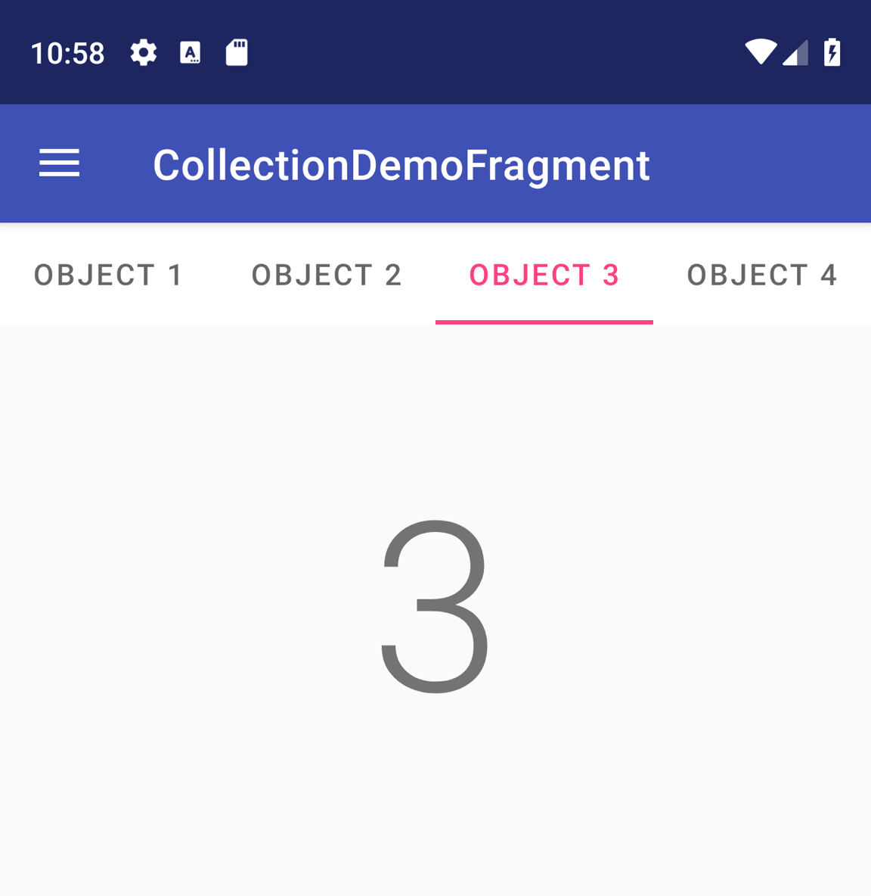

# ViewPager2 使用

## 实现滑动视图

```kotlin
class CollectionDemoFragment : Fragment() {
    // When requested, this adapter returns a DemoObjectFragment,
    // representing an object in the collection.
    private lateinit var demoCollectionAdapter: DemoCollectionAdapter
    private lateinit var viewPager: ViewPager2

    override fun onCreateView(
        inflater: LayoutInflater,
        container: ViewGroup?,
        savedInstanceState: Bundle?
    ): View? {
        return inflater.inflate(R.layout.collection_demo, container, false)
    }

    override fun onViewCreated(view: View, savedInstanceState: Bundle?) {
        demoCollectionAdapter = DemoCollectionAdapter(this)
        viewPager = view.findViewById(R.id.pager)
        viewPager.adapter = demoCollectionAdapter
    }
}

class DemoCollectionAdapter(fragment: Fragment) : FragmentStateAdapter(fragment) {

    override fun getItemCount(): Int = 100

    override fun createFragment(position: Int): Fragment {
        // Return a NEW fragment instance in createFragment(int)
        val fragment = DemoObjectFragment()
        fragment.arguments = Bundle().apply {
            // Our object is just an integer :-P
            putInt(ARG_OBJECT, position + 1)
        }
        return fragment
    }
}

private const val ARG_OBJECT = "object"

// Instances of this class are fragments representing a single
// object in our collection.
class DemoObjectFragment : Fragment() {

    override fun onCreateView(
        inflater: LayoutInflater,
        container: ViewGroup?,
        savedInstanceState: Bundle?
    ): View {
        return inflater.inflate(R.layout.fragment_collection_object, container, false)
    }

    override fun onViewCreated(view: View, savedInstanceState: Bundle?) {
        arguments?.takeIf { it.containsKey(ARG_OBJECT) }?.apply {
            val textView: TextView = view.findViewById(android.R.id.text1)
            textView.text = getInt(ARG_OBJECT).toString()
        }
    }
}
```


## 使用 TabLayout 添加标签页

[`TabLayout`](https://developer.android.com/reference/com/google/android/material/tabs/TabLayout?hl=zh-cn) 提供了一种横向显示标签页的方式。当与 `ViewPager2` 结合使用时，`TabLayout` 可以提供一种熟悉的界面，让用户在滑动视图中浏览各个页面。



如需在 `ViewPager2` 中包含 `TabLayout`，请在 `<ViewPager2>` 元素上方添加 `<TabLayout>` 元素，如下所示：

```xml
<LinearLayout xmlns:android="http://schemas.android.com/apk/res/android"
    android:layout_width="match_parent"
    android:layout_height="match_parent"
    android:orientation="vertical">

    <com.google.android.material.tabs.TabLayout
        android:id="@+id/tab_layout"
        android:layout_width="match_parent"
        android:layout_height="wrap_content" />

    <androidx.viewpager2.widget.ViewPager2
        android:id="@+id/pager"
        android:layout_width="match_parent"
        android:layout_height="0dp"
        android:layout_weight="1" />

</LinearLayout>
```

接下来，创建 [`TabLayoutMediator`](https://developer.android.com/reference/com/google/android/material/tabs/TabLayoutMediator?hl=zh-cn) 以将 `TabLayout` 与 `ViewPager2` 关联，并按如下所示将它附加到其中：

```kotlin
class CollectionDemoFragment : Fragment() {
    ...
    override fun onViewCreated(view: View, savedInstanceState: Bundle?) {
        val tabLayout = view.findViewById(R.id.tab_layout)
        TabLayoutMediator(tabLayout, viewPager) { tab, position ->
            tab.text = "OBJECT ${(position + 1)}"
        }.attach()
    }
    ...
}
```

如果您有大量页面或数量不受限制的页面，请将 `TabLayout` 上的 `android:tabMode` 属性设置为“可滚动”。


## 其他资源

### 示例

- GitHub 上的 [ViewPager2 示例](https://goo.gle/viewpager2-sample)

### 视频

- [新篇章：迁移到 ViewPager2](https://www.youtube.com/watch?v=lAP6cz1HSzA&hl=zh-cn)（2019 年 Android 开发者峰会）