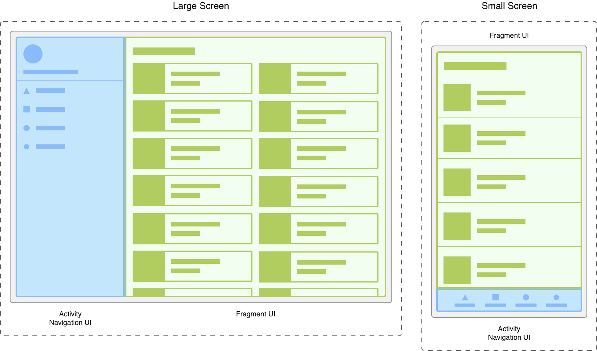
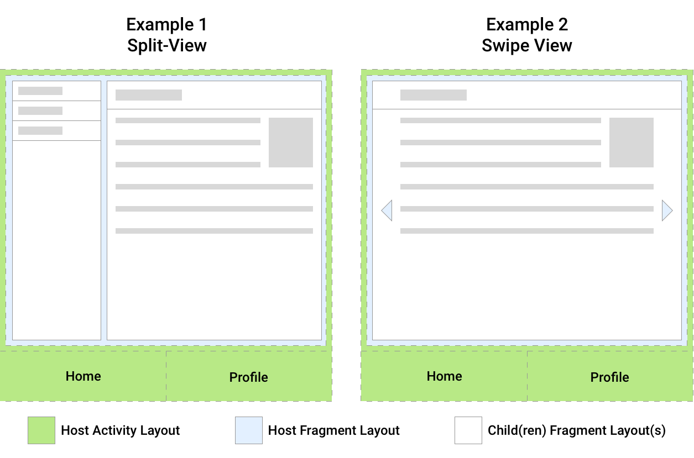
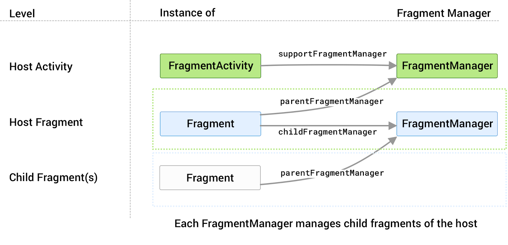
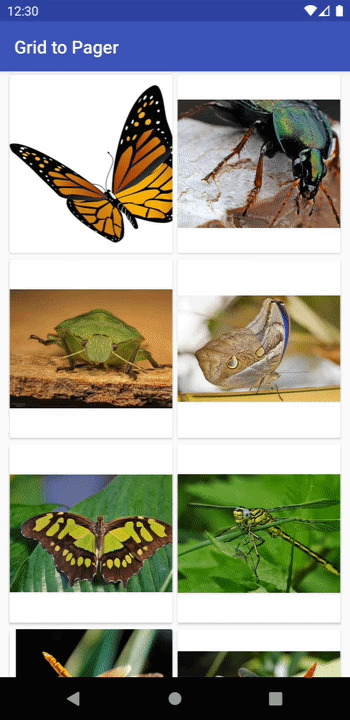
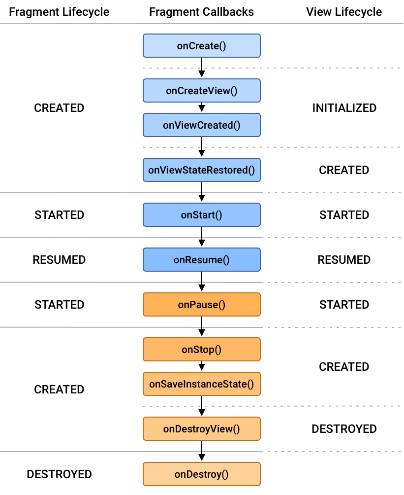
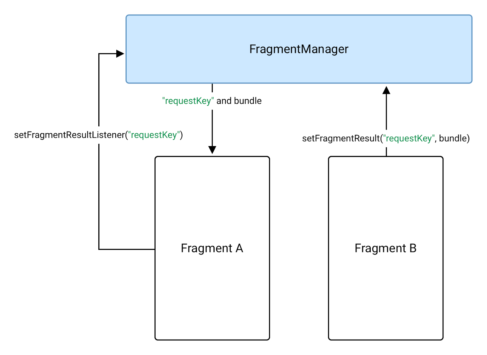

# Fragment

## 简介

因为Activity资源占用过重，启动速度较慢。于是Google设计了一种“轻量级的Activity"来满足一些屏幕切换的场景，这就是Fragment的设计动机。activity 负责显示正确的导航界面，而 fragment 采用适当的布局显示列表。




## 创建 Fragment

### 添加依赖

```kotlin
dependencyResolutionManagement {
    repositoriesMode.set(RepositoriesMode.FAIL_ON_PROJECT_REPOS)
    repositories {
        google()
        ...
    }
}
```

```kotlin
dependencies {
    val fragment_version = "1.8.3"

    // Java language implementation
    implementation("androidx.fragment:fragment:$fragment_version")
    // Kotlin
    implementation("androidx.fragment:fragment-ktx:$fragment_version")
}
```


### 创建 Fragment 类

如需创建 Fragment，请扩展 AndroidX [`Fragment`](https://developer.android.com/reference/androidx/fragment/app/Fragment?hl=zh-cn) 类，然后替换其方法以插入您的应用逻辑，创建方式类似于 [`Activity`](https://developer.android.com/reference/android/app/Activity?hl=zh-cn) 类。如需创建可定义自身布局的最小 Fragment，请向基本构造函数提供 Fragment 的布局资源，如以下所示：

```kotlin
class ExampleFragment : Fragment(R.layout.example_fragment)
```

Fragment 库还提供更专业的 Fragment 基类：

- [`DialogFragment`](https://developer.android.com/reference/androidx/fragment/app/DialogFragment?hl=zh-cn)

  显示浮动对话框。使用此类创建对话框可有效代替使用 [`Activity`](https://developer.android.com/reference/android/app/Activity?hl=zh-cn) 类中的对话框辅助方法，因为 Fragment 会自动处理 `Dialog` 的创建和清理。参阅[使用 `DialogFragment` 显示对话框](https://developer.android.com/guide/fragments/dialogs?hl=zh-cn)。

- [`PreferenceFragmentCompat`](https://developer.android.com/reference/androidx/preference/PreferenceFragmentCompat?hl=zh-cn)

  以列表形式显示 [`Preference`](https://developer.android.com/reference/androidx/preference/Preference?hl=zh-cn) 对象的层次结构。您可以使用 `PreferenceFragmentCompat` 为您的应用[创建设置屏幕](https://developer.android.com/develop/ui/views/components/settings?hl=zh-cn)。

### 向 Activity 添加 Fragment

可以将 Fragment 添加到 Activity 的视图层次结构中，方法是在 Activity 的布局文件中定义 Fragment，或在 Activity 的布局文件中定义 Fragment 容器然后从您的 Activity 内以编程方式添加 Fragment。无论是哪种情况，都需要添加一个 [`FragmentContainerView`](https://developer.android.com/reference/androidx/fragment/app/FragmentContainerView?hl=zh-cn)，以定义应该将 Fragment 放置在 Activity 的视图层次结构中的哪个位置。

- 通过 XML 添加 Fragment

```xml
<!-- res/layout/example_activity.xml -->
<androidx.fragment.app.FragmentContainerView
    xmlns:android="http://schemas.android.com/apk/res/android"
    android:id="@+id/fragment_container_view"
    android:layout_width="match_parent"
    android:layout_height="match_parent"
    android:name="com.example.ExampleFragment" />
```

- 以编程方式添加 Fragment

如需以编程方式将 Fragment 添加到 Activity 布局，布局应包含 `FragmentContainerView` 作为 Fragment 容器，如以下示例所示：

```xml
<!-- res/layout/example_activity.xml -->
<androidx.fragment.app.FragmentContainerView
    xmlns:android="http://schemas.android.com/apk/res/android"
    android:id="@+id/fragment_container_view"
    android:layout_width="match_parent"
    android:layout_height="match_parent" />
```

与 XML 方法不同，`android:name` 属性不在此处的 `FragmentContainerView` 上使用，因此不会自动实例化特定 Fragment。而是使用 [`FragmentTransaction`](https://developer.android.com/reference/androidx/fragment/app/FragmentTransaction?hl=zh-cn) 实例化 Fragment 并将其添加到 Activity 的布局。

```kotlin
class ExampleActivity : AppCompatActivity(R.layout.example_activity) {
    override fun onCreate(savedInstanceState: Bundle?) {
        super.onCreate(savedInstanceState)
        if (savedInstanceState == null) {
            supportFragmentManager.commit {
                setReorderingAllowed(true)
                add<ExampleFragment>(R.id.fragment_container_view)
            }
        }
    }
}
```

> **注意**：执行 `FragmentTransaction` 时，请**务必**使用 `setReorderingAllowed(true)`。如需详细了解重新排序的事务，请参阅 [Fragment 事务](https://developer.android.com/guide/fragments/transactions?hl=zh-cn#reordering)。

在上面的示例中，只有在 `savedInstanceState` 为 `null` 时，才会创建 Fragment 事务。这是确保仅添加该 Fragment 一次，即在首次创建 Activity 时添加。当配置发生更改并且重新创建 Activity 时，`savedInstanceState` 不再为 `null`，并且不需要再次添加 Fragment，因为 Fragment 会自动从 `savedInstanceState` 恢复。

如果您的 Fragment 需要一些初始数据，可以通过在 `FragmentTransaction.add()` 调用中提供 `Bundle` 将参数传递到 Fragment：

```kotlin
class ExampleActivity : AppCompatActivity(R.layout.example_activity) {
      override fun onCreate(savedInstanceState: Bundle?) {
        super.onCreate(savedInstanceState)
        if (savedInstanceState == null) {
            val bundle = bundleOf("some_int" to 0)
            supportFragmentManager.commit {
                setReorderingAllowed(true)
                add<ExampleFragment>(R.id.fragment_container_view, args = bundle)
            }
        }
    }
}
```

然后可以通过调用 [`requireArguments()`](https://developer.android.com/reference/androidx/fragment/app/Fragment?hl=zh-cn#requireArguments()) 从 Fragment 中检索参数 `Bundle`，并可以使用适当的 `Bundle` getter 方法检索每个参数。

```kotlin
class ExampleFragment : Fragment(R.layout.example_fragment) {
    override fun onViewCreated(view: View, savedInstanceState: Bundle?) {
        val someInt = requireArguments().getInt("some_int")
        ...
    }
}
```


## Fragment 管理器

### 访问 FragmentManager



图 1 显示了两个示例，每个示例中都有一个 activity 宿主。这两个示例中的宿主 activity 都以 [`BottomNavigationView`](https://developer.android.com/reference/com/google/android/material/bottomnavigation/BottomNavigationView?hl=zh-cn) 的形式向用户显示顶级导航，该视图负责使用不同的屏幕在应用中换出宿主 fragment。每个屏幕都作为一个独立的 fragment 实现。

示例 1 中的宿主 fragment 托管两个子 fragment，这些子 fragment 构成拆分视图屏幕。示例 2 中的宿主 fragment 托管一个子 fragment，该子 fragment 构成[滑动视图](https://developer.android.com/guide/navigation/navigation-swipe-view-2?hl=zh-cn#implement_swipe_views)的显示 fragment。

您可以将每个宿主视为具有与其关联的 `FragmentManager`，用于管理其子 fragment。图 2 显示了 `supportFragmentManager`、`parentFragmentManager` 和 `childFragmentManager` 之间的属性映射。



需要引用的相应 `FragmentManager` 属性取决于调用点在 fragment 层次结构中的位置，以及您尝试访问的 fragment 管理器。

子 fragment 的其他用例如下：

- [屏幕滑动](https://developer.android.com/training/animation/screen-slide-2?hl=zh-cn)，使用父 fragment 中的 `ViewPager2` 管理一系列子 fragment 视图。
- 一组相关屏幕中的子导航。
- Jetpack Navigation 将子 fragment 用作各个目的地。一个 activity 托管一个父 `NavHostFragment`，并在用户浏览应用时以不同的子目的地 fragment 填充它的空间。

### 使用 FragmentManager

当用户点按设备上的“返回”按钮时，或者当您调用 [`FragmentManager.popBackStack()`](https://developer.android.com/reference/androidx/fragment/app/FragmentManager?hl=zh-cn#popBackStack()) 时，最上面的 fragment 事务会从堆栈中弹出。如果堆栈上没有更多 fragment 事务，并且您没有使用子 fragment，则返回事件会向上传递到 activity。如果您使用子 fragment，请参阅[有关子 fragment 和同级 fragment 的特殊注意事项](https://developer.android.com/guide/fragments/fragmentmanager?hl=zh-cn#considerations)。


### 执行事务

一个简单的 `FragmentTransaction` 可能如下所示：

```kotlin
supportFragmentManager.commit {
   replace<ExampleFragment>(R.id.fragment_container)
   setReorderingAllowed(true)
   addToBackStack("name") // Name can be null
}
```

- `ExampleFragment` 会替换当前在布局容器中的 fragment（如有），该布局容器由 `R.id.fragment_container` ID 进行标识。
- [`setReorderingAllowed(true)`](https://developer.android.com/reference/androidx/fragment/app/FragmentTransaction?hl=zh-cn#setReorderingAllowed(boolean)) 可优化事务中涉及的 fragment 的状态变化，以使动画和过渡正常运行。
- 调用 [`addToBackStack()`](https://developer.android.com/reference/androidx/fragment/app/FragmentTransaction?hl=zh-cn#addToBackStack(java.lang.String)) 会将事务提交到返回堆栈。用户稍后可以通过点按“返回”按钮反转事务，并恢复上一个 fragment。在 `addToBackStack()` 调用中提供的可选名称能让您使用 [`popBackStack()`](https://developer.android.com/reference/androidx/fragment/app/FragmentManager?hl=zh-cn#popBackStack(java.lang.String, int)) 弹回到该特定事务。

  如果您在执行移除 fragment 的事务时未调用 `addToBackStack()`，则提交事务时会销毁已移除的 fragment，用户无法返回到该 fragment。如果您在移除某个 fragment 时调用 `addToBackStack()`，则该 fragment 只是 `STOPPED`，稍后当用户返回时，其 fragment 为 `RESUMED`。在这种情况下，其视图会被销毁。

---

查找现有 fragment。

```kotlin
supportFragmentManager.commit {
   replace<ExampleFragment>(R.id.fragment_container)
   setReorderingAllowed(true)
   addToBackStack(null)
}
...
val fragment: ExampleFragment =
        supportFragmentManager.findFragmentById(R.id.fragment_container) as ExampleFragment
```

可以为 fragment 分配一个唯一的标记，并使用 [`findFragmentByTag()`](https://developer.android.com/reference/androidx/fragment/app/FragmentManager?hl=zh-cn#findFragmentByTag(java.lang.String)) 获取引用。您可以在布局中定义的 fragment 上使用 `android:tag` XML 属性来分配标记，也可以在 `FragmentTransaction` 中的 `add()` 或 `replace()` 操作期间分配标记。

```kotlin
supportFragmentManager.commit {
   replace<ExampleFragment>(R.id.fragment_container, "tag")
   setReorderingAllowed(true)
   addToBackStack(null)
}
...
val fragment: ExampleFragment =
        supportFragmentManager.findFragmentByTag("tag") as ExampleFragment
```


### 支持多个返回堆栈

例如，假设您之前使用 `addToBackStack()` 提交 `FragmentTransaction`，从而将 fragment 添加到返回堆栈，如以下示例所示：

```kotlin
supportFragmentManager.commit {
  replace<ExampleFragment>(R.id.fragment_container)
  setReorderingAllowed(true)
  addToBackStack("replacement")
}
```

在这种情况下，您可以通过调用 `saveBackStack()` 来保存此 fragment 事务和 `ExampleFragment` 的状态：

```kotlin
supportFragmentManager.saveBackStack("replacement")
```

> **注意：**您只能将 `saveBackStack()` 用于调用 `setReorderingAllowed(true)` 的事务，这样才能将事务还原为单一原子操作。

您可以使用相同的名称参数调用 `restoreBackStack()`，以恢复所有弹出的事务以及所有保存的 fragment 状态：

```kotlin
supportFragmentManager.restoreBackStack("replacement")
```


## Fragment 过渡动画

### 设置动画

例如，您可能需要使当前 Fragment 淡出，并从屏幕右边缘滑入新的 Fragment，如图 1 所示。


xml定义动画：

```xml
<!-- res/anim/fade_out.xml -->
<?xml version="1.0" encoding="utf-8"?>
<alpha xmlns:android="http://schemas.android.com/apk/res/android"
    android:duration="@android:integer/config_shortAnimTime"
    android:interpolator="@android:anim/decelerate_interpolator"
    android:fromAlpha="1"
    android:toAlpha="0" />
```

```xml

<!-- res/anim/slide_in.xml --> 
<?xml version="1.0" encoding="utf-8"?>
<translate xmlns:android="http://schemas.android.com/apk/res/android"
    android:duration="@android:integer/config_shortAnimTime"
    android:interpolator="@android:anim/decelerate_interpolator"
    android:fromXDelta="100%"
    android:toXDelta="0%" />
```

> 疑似有误?，slide_in 的from应该是0，to应该是1。

---

弹出动画。

还可以为弹出返回堆栈时显示的进入和退出效果指定动画，用户点按“向上”或“返回”按钮时会弹出返回堆栈。这称为 `popEnter` 和 `popExit` 动画。例如，当用户返回到上一个屏幕时，您可能希望当前的 Fragment 从屏幕右边缘滑出，且上一个 Fragment 淡入。


```xml
<!-- res/anim/slide_out.xml -->
<translate xmlns:android="http://schemas.android.com/apk/res/android"
    android:duration="@android:integer/config_shortAnimTime"
    android:interpolator="@android:anim/decelerate_interpolator"
    android:fromXDelta="0%"
    android:toXDelta="100%" />
```

```xml
<!-- res/anim/fade_in.xml -->
<alpha xmlns:android="http://schemas.android.com/apk/res/android"
    android:duration="@android:integer/config_shortAnimTime"
    android:interpolator="@android:anim/decelerate_interpolator"
    android:fromAlpha="0"
    android:toAlpha="1" />
```

定义动画后，通过调用 [`FragmentTransaction.setCustomAnimations()`](https://developer.android.com/reference/androidx/fragment/app/FragmentTransaction?hl=zh-cn#setCustomAnimations(int, int)) 使用这些动画，并按照动画资源 ID 传入动画资源：

```kotlin
val fragment = FragmentB()
supportFragmentManager.commit {
    setCustomAnimations(
        enter = R.anim.slide_in,
        exit = R.anim.fade_out,
        popEnter = R.anim.fade_in,
        popExit = R.anim.slide_out
    )
    replace(R.id.fragment_container, fragment)
    addToBackStack(null)
}
```

### 设置转换

您还可以使用转换来定义进入和退出效果。这些转换可以在 XML 资源文件中定义。例如，您可能希望当前 Fragment 淡出，且新的 Fragment 从屏幕右边缘滑入。这些转换可以定义如下：

```xml
<!-- res/transition/fade.xml -->
<fade xmlns:android="http://schemas.android.com/apk/res/android"
    android:duration="@android:integer/config_shortAnimTime"/>
```

```xml
<!-- res/transition/slide_right.xml -->
<slide xmlns:android="http://schemas.android.com/apk/res/android"
    android:duration="@android:integer/config_shortAnimTime"
    android:slideEdge="right" />
```

定义转换后，通过对进入的 Fragment 调用 [`setEnterTransition()`](https://developer.android.com/reference/android/app/Fragment?hl=zh-cn#setEnterTransition(android.transition.Transition)) 并对退出的 Fragment 调用 [`setExitTransition()`](https://developer.android.com/reference/android/app/Fragment?hl=zh-cn#setExitTransition(android.transition.Transition)) 以应用转换，按照膨胀转换资源的 ID 传入这些资源，如以下示例所示：

```kotlin
class FragmentA : Fragment() {
    override fun onCreate(savedInstanceState: Bundle?) {
        super.onCreate(savedInstanceState)
        val inflater = TransitionInflater.from(requireContext())
        exitTransition = inflater.inflateTransition(R.transition.fade)
    }
}

class FragmentB : Fragment() {
    override fun onCreate(savedInstanceState: Bundle?) {
        super.onCreate(savedInstanceState)
        val inflater = TransitionInflater.from(requireContext())
        enterTransition = inflater.inflateTransition(R.transition.slide_right)
    }
}
```


### 使用共享元素转换

共享元素转换是[转换框架](https://developer.android.com/training/transitions?hl=zh-cn)的一部分，它决定了 Fragment 转换期间，对应视图如何在两个 Fragment 之间移动。例如，您可能希望 Fragment A 上 `ImageView` 中显示的图片在 B 变为可见后转换到 Fragment B 中，如图 3 所示。



以下展示了如何使用共享元素进行 Fragment 转换：

1. 为每个共享元素视图指定唯一的转换名称。
2. 将共享元素视图和转换名称添加到 [`FragmentTransaction`](https://developer.android.com/reference/androidx/fragment/app/FragmentTransaction?hl=zh-cn)。
3. 设置共享元素转换动画。

例如，Fragment A 和 B 中 `ImageView` 的转换名称可按如下方式分配：

```kotlin
class FragmentA : Fragment() {
    override fun onViewCreated(view: View, savedInstanceState: Bundle?) {
        ...
        val itemImageView = view.findViewById<ImageView>(R.id.item_image)
        ViewCompat.setTransitionName(itemImageView, “item_image”)
    }
}

class FragmentB : Fragment() {
    override fun onViewCreated(view: View, savedInstanceState: Bundle?) {
        ...
        val heroImageView = view.findViewById<ImageView>(R.id.hero_image)
        ViewCompat.setTransitionName(heroImageView, “hero_image”)
    }
}
```

如需在 Fragment 转换中包含共享元素，您的 `FragmentTransaction` 必须了解每个共享元素的视图如何从一个 Fragment 映射到下一个 Fragment。通过调用 [`FragmentTransaction.addSharedElement()`](https://developer.android.com/reference/androidx/fragment/app/FragmentTransaction?hl=zh-cn#addSharedElement(android.view.View, java.lang.String)) 将各个共享元素添加至 `FragmentTransaction`，传入视图和下一个 Fragment 中相应视图的转换名称，如以下示例所示：

```kotlin
val fragment = FragmentB()
supportFragmentManager.commit {
    setCustomAnimations(...)
    addSharedElement(itemImageView, “hero_image”)
    replace(R.id.fragment_container, fragment)
    addToBackStack(null)
}
```


### 推迟转换

如需推迟“进入”转换，请在进入 Fragment 的 `onViewCreated()` 方法中调用 [`Fragment.postponeEnterTransition()`](https://developer.android.com/reference/androidx/fragment/app/Fragment?hl=zh-cn#postponeEnterTransition())：

```kotlin
class FragmentB : Fragment() {
    override fun onViewCreated(view: View, savedInstanceState: Bundle?) {
        ...
        postponeEnterTransition()
    }
}
```

完成加载数据并为开始转换准备就绪后，请调用 [`Fragment.startPostponedEnterTransition()`](https://developer.android.com/reference/androidx/fragment/app/Fragment?hl=zh-cn#startPostponedEnterTransition())。以下示例使用 [Glide](https://bumptech.github.io/glide/) 库将图片加载到共享 `ImageView` 中，推迟相应的转换直到完成图片加载。

```kotlin
class FragmentB : Fragment() {
    override fun onViewCreated(view: View, savedInstanceState: Bundle?) {
        ...
        Glide.with(this)
            .load(url)
            .listener(object : RequestListener<Drawable> {
                override fun onLoadFailed(...): Boolean {
                    startPostponedEnterTransition()
                    return false
                }

                override fun onResourceReady(...): Boolean {
                    startPostponedEnterTransition()
                    return false
                }
            })
            .into(headerImage)
    }
}
```


## fragment 生命周期 

为了管理生命周期，`Fragment` 会实现 [`LifecycleOwner`](https://developer.android.com/reference/androidx/lifecycle/LifecycleOwner?hl=zh-cn)，公开可通过 [`getLifecycle()`](https://developer.android.com/reference/androidx/lifecycle/LifecycleOwner?hl=zh-cn#getLifecycle()) 方法访问的 [`Lifecycle`](https://developer.android.com/reference/androidx/lifecycle/Lifecycle?hl=zh-cn) 对象。

每种可能的 `Lifecycle` 状态均在 [`Lifecycle.State`](https://developer.android.com/reference/androidx/lifecycle/Lifecycle.State?hl=zh-cn) 枚举中表示。

- [`INITIALIZED`](https://developer.android.com/reference/androidx/lifecycle/Lifecycle.State?hl=zh-cn#INITIALIZED)
- [`CREATED`](https://developer.android.com/reference/androidx/lifecycle/Lifecycle.State?hl=zh-cn#CREATED)
- [`STARTED`](https://developer.android.com/reference/androidx/lifecycle/Lifecycle.State?hl=zh-cn#STARTED)
- [`RESUMED`](https://developer.android.com/reference/androidx/lifecycle/Lifecycle.State?hl=zh-cn#RESUMED)
- [`DESTROYED`](https://developer.android.com/reference/androidx/lifecycle/Lifecycle.State?hl=zh-cn#DESTROYED)

作为使用 [`LifecycleObserver`](https://developer.android.com/reference/androidx/lifecycle/LifecycleObserver?hl=zh-cn) 的替代方法，`Fragment` 类包含与 Fragment 生命周期中每项变化相对应的回调方法。其中包括 [`onCreate()`](https://developer.android.com/reference/androidx/fragment/app/Fragment?hl=zh-cn#onCreate(android.os.Bundle))、[`onStart()`](https://developer.android.com/reference/androidx/fragment/app/Fragment?hl=zh-cn#onStart())、[`onResume()`](https://developer.android.com/reference/androidx/fragment/app/Fragment?hl=zh-cn#onResume())、[`onPause()`](https://developer.android.com/reference/androidx/fragment/app/Fragment?hl=zh-cn#onPause())、[`onStop()`](https://developer.android.com/reference/androidx/fragment/app/Fragment?hl=zh-cn#onStop()) 和 [`onDestroy()`](https://developer.android.com/reference/androidx/fragment/app/Fragment?hl=zh-cn#onDestroy())。

Fragment 的视图有一个单独的 `Lifecycle`，独立于 Fragment 的 `Lifecycle` 进行管理。Fragment 为其视图维护一个 [`LifecycleOwner`](https://developer.android.com/reference/androidx/lifecycle/LifecycleOwner?hl=zh-cn)，可使用 [`getViewLifecycleOwner()`](https://developer.android.com/reference/androidx/fragment/app/Fragment?hl=zh-cn#getViewLifecycleOwner()) 或 [`getViewLifecycleOwnerLiveData()`](https://developer.android.com/reference/androidx/fragment/app/Fragment?hl=zh-cn#getViewLifecycleOwnerLiveData()) 进行访问。


### Fragment 生命周期状态和回调

图 1 显示了 fragment 的每个 `Lifecycle` 状态，以及它们与 fragment 的生命周期回调和 fragment 的视图 `Lifecycle` 之间的关系。

在 Fragment 历经其生命周期的各个阶段时，会上下切换其状态。例如，添加到返回堆栈顶部的 Fragmen 会从 `CREATED` 向上转为 `STARTED`，再向上转为 `RESUMED`。相反，将 Fragment 从返回堆栈中弹出时，其会向下转换这些状态，即从 `RESUMED` 转为 `STARTED`，再转为 `CREATED`，最后转为 `DESTROYED`。



上面View Lifecycle的生命长度其实比Fragment Lifecycle的长度要短一点。也就是视图层比实际的Fragment结构层稍短。

和Acitivity一样，转换为 `RESUMED` 即表示用户现在可以与您的 Fragment 互动。如果 Fragment 的状态并非为 `RESUMED`，您就不应对其视图手动设置焦点，也不应尝试[处理输入法可见性](https://developer.android.com/training/keyboard-input/visibility?hl=zh-cn)。


## 保存与 Fragment 相关的状态

### SavedState

已保存状态应使用 `onSaveInstanceState(Bundle)` 来持久保留，如以下示例所示：

```kotlin
override fun onSaveInstanceState(outState: Bundle) {
    super.onSaveInstanceState(outState)
    outState.putBoolean(IS_EDITING_KEY, isEditing)
    outState.putString(RANDOM_GOOD_DEED_KEY, randomGoodDeed)
}
```

如需恢复 `onCreate(Bundle)` 中的状态，请从捆绑包中检索存储的值：

```kotlin
override fun onCreate(savedInstanceState: Bundle?) {
    super.onCreate(savedInstanceState)
    isEditing = savedInstanceState?.getBoolean(IS_EDITING_KEY, false)
    randomGoodDeed = savedInstanceState?.getString(RANDOM_GOOD_DEED_KEY)
            ?: viewModel.generateRandomGoodDeed()
}
```


### NonConfig

应将 NonConfig 数据放置在 fragment 之外，例如放置在 [`ViewModel`](https://developer.android.com/reference/androidx/lifecycle/ViewModel?hl=zh-cn) 中。在这个示例中，`seed`（NonConfig 状态）是在 `ViewModel` 中生成的。维护其状态的逻辑由 `ViewModel` 拥有。

```kotlin
public class RandomGoodDeedViewModel : ViewModel() {
    private val seed = ... // Generate the seed

    private fun generateRandomGoodDeed(): String {
        val goodDeed = ... // Generate a random good deed using the seed
        return goodDeed
    }
}
```


## 与 fragment 通信

### 使用 ViewModel 共享数据

与宿主 activity 共享数据

```kotlin
class ItemViewModel : ViewModel() {
    private val mutableSelectedItem = MutableLiveData<Item>()
    val selectedItem: LiveData<Item> get() = mutableSelectedItem

    fun selectItem(item: Item) {
        mutableSelectedItem.value = item
    }
}
```

在此示例中，存储的数据封装在 [`MutableLiveData`](https://developer.android.com/reference/androidx/lifecycle/MutableLiveData?hl=zh-cn) 类中。[`LiveData`](https://developer.android.com/reference/androidx/lifecycle/LiveData?hl=zh-cn) 是生命周期感知型可观测数据存储器类。`MutableLiveData` 支持更改其值。

fragment 及其宿主 activity 均可通过将 activity 传入 [`ViewModelProvider`](https://developer.android.com/reference/androidx/lifecycle/ViewModelProvider?hl=zh-cn) 构造函数来使用 activity 范围检索 `ViewModel` 的共享实例。`ViewModelProvider` 负责实例化 `ViewModel` 或检索它（如果已存在）。这两个组件都可以观察和修改此数据。

```kotlin
class MainActivity : AppCompatActivity() {
    // Using the viewModels() Kotlin property delegate from the activity-ktx
    // artifact to retrieve the ViewModel in the activity scope.
    private val viewModel: ItemViewModel by viewModels()
    override fun onCreate(savedInstanceState: Bundle?) {
        super.onCreate(savedInstanceState)
        viewModel.selectedItem.observe(this, Observer { item ->
            // Perform an action with the latest item data.
        })
    }
}

class ListFragment : Fragment() {
    // Using the activityViewModels() Kotlin property delegate from the
    // fragment-ktx artifact to retrieve the ViewModel in the activity scope.
    private val viewModel: ItemViewModel by activityViewModels()

    // Called when the item is clicked.
    fun onItemClicked(item: Item) {
        // Set a new item.
        viewModel.selectItem(item)
    }
}
```

---

在 fragment 之间共享数据

同一 activity 中的两个或更多 fragment 通常需要相互通信。例如，假设有一个 fragment 显示一个列表，另一个 ragment 允许用户对该列表应用各种过滤器。

这两个 fragment 可以使用其 activity 范围共享 `ViewModel` 来处理这种通信。通过以这种方式共享 `ViewModel`，fragment 不需要相互了解，activity 也不需要执行任何操作来促进通信。

以下示例展示了两个 fragment 如何使用共享的 `ViewModel` 进行通信：

```kotlin
class ListViewModel : ViewModel() {
    val filters = MutableLiveData<Set<Filter>>()

    private val originalList: LiveData<List<Item>>() = ...
    val filteredList: LiveData<List<Item>> = ...

    fun addFilter(filter: Filter) { ... }

    fun removeFilter(filter: Filter) { ... }
}

class ListFragment : Fragment() {
    // Using the activityViewModels() Kotlin property delegate from the
    // fragment-ktx artifact to retrieve the ViewModel in the activity scope.
    private val viewModel: ListViewModel by activityViewModels()
    override fun onViewCreated(view: View, savedInstanceState: Bundle?) {
        viewModel.filteredList.observe(viewLifecycleOwner, Observer { list ->
            // Update the list UI.
        }
    }
}

class FilterFragment : Fragment() {
    private val viewModel: ListViewModel by activityViewModels()
    override fun onViewCreated(view: View, savedInstanceState: Bundle?) {
        viewModel.filters.observe(viewLifecycleOwner, Observer { set ->
            // Update the selected filters UI.
        }
    }

    fun onFilterSelected(filter: Filter) = viewModel.addFilter(filter)

    fun onFilterDeselected(filter: Filter) = viewModel.removeFilter(filter)
}
```

这两个 fragment 都将其宿主 activity 用作 `ViewModelProvider` 的范围。由于这两个 fragment 使用同一范围，因此它们会收到 `ViewModel` 的同一实例，这使它们能够来回通信。


### 使用 Fragment Result API 获取结果

在 fragment 版本 1.3.0 及更高版本中，每个 [`FragmentManager`](https://developer.android.com/reference/androidx/fragment/app/FragmentManager?hl=zh-cn) 都实现了 [`FragmentResultOwner`](https://developer.android.com/reference/androidx/fragment/app/FragmentResultOwner?hl=zh-cn)。这意味着，`FragmentManager` 可以充当 fragment 结果的集中存储区。此更改通过设置 fragment 结果并监听这些结果，而不要求组件直接相互引用，让这些组件能够相互通信。

在 fragment 之间传递结果

如需将数据从 fragment B 传回 fragment A，请先在 fragment A（即接收结果的 fragment）上设置结果监听器。对 fragment A 的 `FragmentManager` 调用 [`setFragmentResultListener()`](https://developer.android.com/reference/androidx/fragment/app/FragmentManager?hl=zh-cn#setfragmentresultlistener)，如以下示例所示：

```kotlin
override fun onCreate(savedInstanceState: Bundle?) {
    super.onCreate(savedInstanceState)
    // Use the Kotlin extension in the fragment-ktx artifact.
    setFragmentResultListener("requestKey") { requestKey, bundle ->
        // We use a String here, but any type that can be put in a Bundle is supported.
        val result = bundle.getString("bundleKey")
        // Do something with the result.
    }
}
```



在 fragment B（即生成结果的 fragment）中，使用相同的 `requestKey` 在同一 `FragmentManager` 上设置结果。您可以使用 [`setFragmentResult()`](https://developer.android.com/reference/androidx/fragment/app/FragmentManager?hl=zh-cn#setfragmentresult) API 来完成此操作：

```kotlin
button.setOnClickListener {
    val result = "result"
    // Use the Kotlin extension in the fragment-ktx artifact.
    setFragmentResult("requestKey", bundleOf("bundleKey" to result))
}
```

---

测试 fragment 结果。

使用 [`FragmentScenario`](https://developer.android.com/reference/androidx/fragment/app/testing/FragmentScenario?hl=zh-cn) 测试对 `setFragmentResult()` 和 `setFragmentResultListener()` 的调用。使用 [`launchFragmentInContainer`](https://developer.android.com/reference/kotlin/androidx/fragment/app/testing/package-summary?hl=zh-cn#launchFragmentInContainer(android.os.Bundle,kotlin.Int,androidx.lifecycle.Lifecycle.State,androidx.fragment.app.FragmentFactory)) 或 [`launchFragment`](https://developer.android.com/reference/kotlin/androidx/fragment/app/testing/package-summary?hl=zh-cn#top-level-functions) 为被测 fragment 创建一个场景，然后手动调用当前未测试的方法。

如需测试 `setFragmentResultListener()`，请使用调用 `setFragmentResultListener()` 的 fragment 创建一个场景。接下来，直接调用 `setFragmentResult()` 并验证结果：

```kotlin
@Test
fun testFragmentResultListener() {
    val scenario = launchFragmentInContainer<ResultListenerFragment>()
    scenario.onFragment { fragment ->
        val expectedResult = "result"
        fragment.parentFragmentManager.setFragmentResult("requestKey", bundleOf("bundleKey" to expectedResult))
        assertThat(fragment.result).isEqualTo(expectedResult)
    }
}

class ResultListenerFragment : Fragment() {
    var result : String? = null
    override fun onCreate(savedInstanceState: Bundle?) {
        super.onCreate(savedInstanceState)
        // Use the Kotlin extension in the fragment-ktx artifact.
        setFragmentResultListener("requestKey") { requestKey, bundle ->
            result = bundle.getString("bundleKey")
        }
    }
}
```

如需测试 `setFragmentResult()`，请使用调用 `setFragmentResult()` 的 Fragment 创建一个场景。接下来，直接调用 `setFragmentResultListener()` 并验证结果：

```kotlin
@Test
fun testFragmentResult() {
    val scenario = launchFragmentInContainer<ResultFragment>()
    lateinit var actualResult: String?
    scenario.onFragment { fragment ->
        fragment.parentFragmentManager
                .setFragmentResultListener("requestKey") { requestKey, bundle ->
            actualResult = bundle.getString("bundleKey")
        }
    }
    onView(withId(R.id.result_button)).perform(click())
    assertThat(actualResult).isEqualTo("result")
}

class ResultFragment : Fragment(R.layout.fragment_result) {
    override fun onViewCreated(view: View, savedInstanceState: Bundle?) {
        view.findViewById(R.id.result_button).setOnClickListener {
            val result = "result"
            // Use the Kotlin extension in the fragment-ktx artifact.
            setFragmentResult("requestKey", bundleOf("bundleKey" to result))
        }
    }
}
```


## 使用 DialogFragment 显示对话框

### 创建 DialogFragment

```kotlin
class PurchaseConfirmationDialogFragment : DialogFragment() {
    override fun onCreateDialog(savedInstanceState: Bundle?): Dialog =
            AlertDialog.Builder(requireContext())
                .setMessage(getString(R.string.order_confirmation))
                .setPositiveButton(getString(R.string.ok)) { _,_ -> }
                .create()

    companion object {
        const val TAG = "PurchaseConfirmationDialog"
    }
}
```

与 `onCreateView()` 一样，您可以从 `onCreateDialog()` 返回 `Dialog` 的任何子类，并且不限于使用 [`AlertDialog`](https://developer.android.com/reference/androidx/appcompat/app/AlertDialog?hl=zh-cn)。

### 显示 DialogFragment

从 `Fragment` 内创建 `DialogFragment` 时，请使用 fragment 的子 `FragmentManager`，以便在配置更改后状态可以正确恢复。非 null 标记让您可以使用 `findFragmentByTag()` 稍后检索 `DialogFragment`。

```kotlin
// From another Fragment or Activity where you wish to show this
// PurchaseConfirmationDialogFragment.
PurchaseConfirmationDialogFragment().show(
     childFragmentManager, PurchaseConfirmationDialog.TAG)
```


### DialogFragment 生命周期

`DialogFragment` 遵循标准 fragment 生命周期，还有几个额外的生命周期回调。最常见的如下所示：

- [`onCreateDialog()`](https://developer.android.com/reference/androidx/fragment/app/DialogFragment?hl=zh-cn#onCreateDialog(android.os.Bundle))：替换此回调以提供 `Dialog`，以便管理和显示 fragment。
- [`onDismiss()`](https://developer.android.com/reference/androidx/fragment/app/DialogFragment?hl=zh-cn#onDismiss(android.content.DialogInterface))：如果您需要在 `Dialog` 关闭时执行任何自定义逻辑（例如释放资源或退订可观察资源），请替换此回调。
- [`onCancel()`](https://developer.android.com/reference/androidx/fragment/app/DialogFragment?hl=zh-cn#onCancel(android.content.DialogInterface))：如果您需要在 `Dialog` 取消时执行任何自定义逻辑，请替换此回调。

`DialogFragment` 还包含用于关闭或设置 `DialogFragment` 的可取消性的方法：

- [`dismiss()`](https://developer.android.com/reference/androidx/fragment/app/DialogFragment?hl=zh-cn#dismiss())：关闭 fragment 及其对话框。如果 fragment 已添加到返回堆栈，会弹出所有返回堆栈状态（包括此条目）。 否则，会提交新事务以移除 fragment。
- [`setCancelable()`](https://developer.android.com/reference/androidx/fragment/app/DialogFragment?hl=zh-cn#setCancelable(boolean))：控制所显示的 `Dialog` 是否可取消。


## 调试 fragment 

### FragmentManager 日志记录

```bash
adb shell setprop log.tag.FragmentManager DEBUG
```


## 测试 fragment

AndroidX `fragment-testing` 库提供了 [`FragmentScenario`](https://developer.android.com/reference/kotlin/androidx/fragment/app/testing/FragmentScenario?hl=zh-cn) 类，用于创建 fragment 以及更改其 [`Lifecycle.State`](https://developer.android.com/reference/kotlin/androidx/lifecycle/Lifecycle.State?hl=zh-cn) 。

```kotlin
dependencies {
    val fragment_version = "1.8.3"
    debugImplementation("androidx.fragment:fragment-testing-manifest:$fragment_version")
    androidTestImplementation("androidx.fragment:fragment-testing:$fragment_version")
}
```

下面测试示例使用了 [Espresso](https://developer.android.com/training/testing/espresso?hl=zh-cn) 和 [Truth](https://truth.dev/) 库中的断言。

### 创建 Fragment

`FragmentScenario` 包含下面几种用于在测试中启动 fragment 的方法：

- [`launchInContainer()`](https://developer.android.com/reference/kotlin/androidx/fragment/app/testing/FragmentScenario?hl=zh-cn#launchInContainer(java.lang.Class))，用于测试 fragment 的界面。`FragmentScenario` 会将 fragment 附加到 activity 的根视图控制器。包含 fragment 的这一 activity 原本为空。
- [`launch()`](https://developer.android.com/reference/kotlin/androidx/fragment/app/testing/FragmentScenario?hl=zh-cn#launch(java.lang.Class))，用于在没有 fragment 界面的情况下进行测试。`FragmentScenario` 会将这种类型的 fragment 附加到一个空 activity，即没有根视图的 activity。

启动其中一种类型的 fragment 后，`FragmentScenario` 会将被测 fragment 推动到指定状态。默认情况下，此状态为 `RESUMED`，但您可以使用 `initialState` 参数替换此状态。`RESUMED` 状态表示 fragment 正在运行且对用户可见。您可以使用 [Espresso 界面测试](https://developer.android.com/training/testing/espresso?hl=zh-cn)评估有关其界面元素的信息。

**launchInContainer() 示例**

```kotlin
@RunWith(AndroidJUnit4::class)
class MyTestSuite {
    @Test fun testEventFragment() {
        // The "fragmentArgs" argument is optional.
        val fragmentArgs = bundleOf(“selectedListItem” to 0)
        val scenario = launchFragmentInContainer<EventFragment>(fragmentArgs)
        ...
    }
}
```

**launch() 示例**

```kotlin
@RunWith(AndroidJUnit4::class)
class MyTestSuite {
    @Test fun testEventFragment() {
        // The "fragmentArgs" arguments are optional.
        val fragmentArgs = bundleOf("numElements" to 0)
        val scenario = launchFragment<EventFragment>(fragmentArgs)
        ...
    }
}
```


### 提供依赖项

如果 fragment 具有依赖项，通过向 `launchInContainer()` 或 `launch()` 提供自定义 `FragmentFactory` 来提供这些依赖项的测试版本。

```kotlin
@RunWith(AndroidJUnit4::class)
class MyTestSuite {
    @Test fun testEventFragment() {
        val someDependency = TestDependency()
        launchFragmentInContainer {
            EventFragment(someDependency)
        }
        ...
    }
}
```


### 将 Fragment 推动到新状态

在应用的界面测试中，通常只需启动被测 fragment 并从 `RESUMED` 状态开始对其进行测试即可。不过，在更精细的单元测试中，还可以评估 fragment 从一种生命周期状态转换为另一种生命周期状态时的行为。您可以通过向任何 `launchFragment*()` 函数传递 `initialState` 参数来指定初始状态。

如需将 fragment 推动到其他生命周期状态，请调用 [`moveToState()`](https://developer.android.com/reference/kotlin/androidx/fragment/app/testing/FragmentScenario?hl=zh-cn#moveToState(androidx.lifecycle.Lifecycle.State))。此方法支持以下状态作为参数：`CREATED`、`STARTED`、`RESUMED` 和 `DESTROYED`。此方法会模拟 fragment 或包含 fragment 的 activity 出于任何原因而改变其状态的情况。

```kotlin
@RunWith(AndroidJUnit4::class)
class MyTestSuite {
    @Test fun testEventFragment() {
        val scenario = launchFragmentInContainer<EventFragment>(
            initialState = Lifecycle.State.INITIALIZED
        )
        // EventFragment has gone through onAttach(), but not onCreate().
        // Verify the initial state.
        scenario.moveToState(Lifecycle.State.RESUMED)
        // EventFragment moves to CREATED -> STARTED -> RESUMED.
        ...
    }
}
```


### 与界面 Fragment 交互

使用 [Espresso 视图匹配器](https://developer.android.com/reference/kotlin/androidx/test/espresso/matcher/ViewMatchers?hl=zh-cn)与视图中的元素交互：

```kotlin
@RunWith(AndroidJUnit4::class)
class MyTestSuite {
    @Test fun testEventFragment() {
        val scenario = launchFragmentInContainer<EventFragment>()
        onView(withId(R.id.refresh)).perform(click())
        // Assert some expected behavior
        ...
    }
}
```

如果需要对 fragment 本身调用某种方法（如响应选项菜单中的选择），可以安全地执行此操作，使用 [`FragmentScenario.onFragment()`](https://developer.android.com/reference/kotlin/androidx/fragment/app/testing/FragmentScenario?hl=zh-cn#onFragment(androidx.fragment.app.testing.FragmentScenario.FragmentAction)) 并传入 [`FragmentAction`](https://developer.android.com/reference/kotlin/androidx/fragment/app/testing/FragmentScenario.FragmentAction?hl=zh-cn) 来获取对 fragment 的引用：

```kotlin
@RunWith(AndroidJUnit4::class)
class MyTestSuite {
    @Test fun testEventFragment() {
        val scenario = launchFragmentInContainer<EventFragment>()
        scenario.onFragment { fragment ->
            fragment.myInstanceMethod()
        }
    }
}
```


### 测试对话框操作

使用 `FragmentScenario.launch()` 测试对话框 Fragment。以下示例将测试对话框关闭过程：

```kotlin
@RunWith(AndroidJUnit4::class)
class MyTestSuite {
    @Test fun testDismissDialogFragment() {
        // Assumes that "MyDialogFragment" extends the DialogFragment class.
        with(launchFragment<MyDialogFragment>()) {
            onFragment { fragment ->
                assertThat(fragment.dialog).isNotNull()
                assertThat(fragment.requireDialog().isShowing).isTrue()
                fragment.dismiss()
                fragment.parentFragmentManager.executePendingTransactions()
                assertThat(fragment.dialog).isNull()
            }
        }

        // Assumes that the dialog had a button
        // containing the text "Cancel".
        onView(withText("Cancel")).check(doesNotExist())
    }
}
```