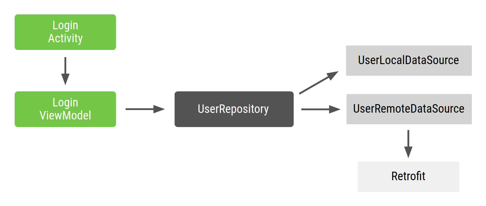
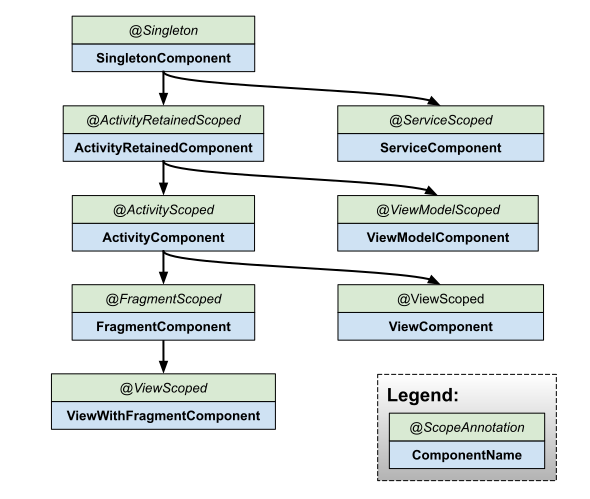

# 依赖注入

类可通过以下三种方式获取所需的对象：

1. 类构造其所需的依赖项。在上面的示例中，`Car` 将创建并初始化自己的 `Engine` 实例。
2. 从其他地方抓取。某些 Android API（如 `Context` getter 和 `getSystemService()`）便是如此获取对象的。
3. 以参数形式提供。应用可以在构造类时提供这些依赖项，或者将这些依赖项传入需要各个依赖项的函数。在上面的示例中，`Car` 构造函数将接收 `Engine` 作为参数。

第三种方式就是依赖项注入。使用这种方法，您可以获取并提供类的依赖项，而不必让类实例自行获取。

```kotlin
class Car(private val engine: Engine) {
    fun start() {
        engine.start()
    }
}

fun main(args: Array) {
    val engine = Engine()
    val car = Car(engine)
    car.start()
}
```

Android 中实现依赖项注入的方式主要有两种：

- **构造函数注入**。您将某个类的依赖项传入其构造函数。

- **字段注入（或 setter 注入）**。某些 Android 框架类（如 activity 和 fragment）由系统实例化，因此无法进行构造函数注入。使用字段注入时，依赖项将在创建类后实例化。代码如下所示：

  ```kotlin
  class Car {
      lateinit var engine: Engine
  
      fun start() {
          engine.start()
      }
  }
  
  fun main(args: Array) {
      val car = Car()
      car.engine = Engine()
      car.start()
  }
  ```

这两种方式的关键区别是注入的时机不一样。


## 自动依赖项注入

手动依赖项注入还会带来多个问题：

- 对于大型应用，获取所有依赖项并正确连接它们可能需要大量样板代码。在多层架构中，要为顶层创建一个对象，必须提供下层的所有依赖项。例如，要制造一辆真车，可能需要引擎、变速器、底盘以及其他部件；而要制造引擎，则需要汽缸和火花塞。
- 如果您无法在传入依赖项之前构造依赖项（例如，当使用延迟初始化或将对象作用域限定为应用流时），则需要编写并维护用于管理内存中依赖项生命周期的自定义容器（或依赖关系图）。

有一些库通过自动执行创建和提供依赖项的过程解决此问题。它们归为两类：

- 基于反射的解决方案，可在运行时连接依赖项。
- 静态解决方案，可在编译时生成连接依赖项的代码。

[Dagger](https://dagger.dev/) 是适用于 Java、Kotlin 和 Android 的热门依赖项注入库，由 Google 进行维护。Dagger 会为您创建和管理依赖关系图，方便您在应用中使用 DI。它提供了完全静态和编译时依赖项，解决了基于反射的解决方案（如 [Guice](https://en.wikipedia.org/wiki/Google_Guice)）的诸多开发和性能问题。


## 依赖项注入的替代方法

依赖项注入的替代方法是使用[服务定位器](https://en.wikipedia.org/wiki/Service_locator_pattern)。服务定位器设计模式还改进了类与具体依赖项的分离。您可以创建一个名为服务定位器的类，该类可创建和存储依赖项，然后按需提供这些依赖项。

```kotlin
object ServiceLocator {
    fun getEngine(): Engine = Engine()
}

class Car {
    private val engine = ServiceLocator.getEngine()

    fun start() {
        engine.start()
    }
}

fun main(args: Array) {
    val car = Car()
    car.start()
}
```

与依赖项注入相比：

- 服务定位器所需的依赖项集合使得代码更难测试，因为所有测试都必须与同一全局服务定位器进行交互。
- 依赖项在类实现中编码，而不是在 API surface 中编码。因此，很难从外部了解类需要什么。所以，更改 `Car` 或服务定位器中可用的依赖项可能会导致引用失败，从而导致运行时或测试失败。
- 如果您想将作用域限定为除了整个应用的生命周期之外的任何区间，就会更难管理对象的生命周期。


## 在 Android 应用中使用 Hilt

[Hilt](https://developer.android.com/training/dependency-injection/hilt-android?hl=zh-cn) 是推荐用于在 Android 中实现依赖项注入的 Jetpack 库。Hilt 定义了一种在应用中实现 DI 的标准方法，它会为项目中的每个 Android 类提供容器并自动为您管理其生命周期。

Hilt 在热门 DI 库 [Dagger](https://developer.android.com/training/dependency-injection/dagger-basics?hl=zh-cn) 的基础上构建而成，因而能够受益于 Dagger 提供的编译时正确性、运行时性能、可伸缩性和 Android Studio 支持。


## 手动管理依赖注入

### 手动依赖项注入的基础知识

在介绍典型 Android 应用的登录流程时，`LoginActivity` 依赖于 `LoginViewModel`，而后者又依赖于 `UserRepository`。然后，`UserRepository` 依赖于 `UserLocalDataSource` 和 `UserRemoteDataSource`，而后者依赖于 [`Retrofit`](https://square.github.io/retrofit/) 服务。



```kotlin
class UserRepository(
    private val localDataSource: UserLocalDataSource,
    private val remoteDataSource: UserRemoteDataSource
) { ... }

class UserLocalDataSource { ... }
class UserRemoteDataSource(
    private val loginService: LoginRetrofitService
) { ... }
```

```kotlin
class LoginActivity: Activity() {

    private lateinit var loginViewModel: LoginViewModel

    override fun onCreate(savedInstanceState: Bundle?) {
        super.onCreate(savedInstanceState)

        // In order to satisfy the dependencies of LoginViewModel, you have to also
        // satisfy the dependencies of all of its dependencies recursively.
        // First, create retrofit which is the dependency of UserRemoteDataSource
        val retrofit = Retrofit.Builder()
            .baseUrl("https://example.com")
            .build()
            .create(LoginService::class.java)

        // Then, satisfy the dependencies of UserRepository
        val remoteDataSource = UserRemoteDataSource(retrofit)
        val localDataSource = UserLocalDataSource()

        // Now you can create an instance of UserRepository that LoginViewModel needs
        val userRepository = UserRepository(localDataSource, remoteDataSource)

        // Lastly, create an instance of LoginViewModel with userRepository
        loginViewModel = LoginViewModel(userRepository)
    }
}
```

这种层层依赖的构建方法存在以下问题：

1. 有大量样板代码。如需在代码的另一部分中创建另一个 `LoginViewModel` 实例，则需要使用重复代码。
2. 必须按顺序声明依赖项。必须在 `LoginViewModel` 之前实例化 `UserRepository` 才能创建它。
3. 很难重复使用对象。如需在多项功能中重复使用 `UserRepository`，必须使其遵循[单例模式](https://en.wikipedia.org/wiki/Singleton_pattern)。单例模式使测试变得更加困难，因为所有测试共享相同的单例实例。


### 使用容器管理依赖项

如需解决重复使用对象的问题，您可以创建自己的依赖项容器类，用于获取依赖项。此容器提供的所有实例可以是公共实例。在该示例中，由于您仅需要 `UserRepository` 的一个实例，您可以将其依赖项设为私有，并且可以在将来需要提供依赖项时将其公开：

```kotlin
// Container of objects shared across the whole app
class AppContainer {

    // Since you want to expose userRepository out of the container, you need to satisfy
    // its dependencies as you did before
    private val retrofit = Retrofit.Builder()
                            .baseUrl("https://example.com")
                            .build()
                            .create(LoginService::class.java)

    private val remoteDataSource = UserRemoteDataSource(retrofit)
    private val localDataSource = UserLocalDataSource()

    // userRepository is not private; it'll be exposed
    val userRepository = UserRepository(localDataSource, remoteDataSource)
}
```

由于这些依赖项在整个应用中使用，因此需要将它们放置在所有 activity 都可以使用的通用位置：[`Application`](https://developer.android.com/reference/android/app/Application?hl=zh-cn) 类。创建一个包含 `AppContainer` 实例的自定义 `Application` 类。

```kotlin
// Custom Application class that needs to be specified
// in the AndroidManifest.xml file
class MyApplication : Application() {

    // Instance of AppContainer that will be used by all the Activities of the app
    val appContainer = AppContainer()
}
```

**注意**：`AppContainer` 只是一个常规类，在放置在 `Application` 类中的应用之间共享唯一实例。

现在可以从应用中获取 `AppContainer` 的实例并获取共享 `UserRepository` 实例：

```kotlin
class LoginActivity: Activity() {

    private lateinit var loginViewModel: LoginViewModel

    override fun onCreate(savedInstanceState: Bundle?) {
        super.onCreate(savedInstanceState)

        // Gets userRepository from the instance of AppContainer in Application
        val appContainer = (application as MyApplication).appContainer
        loginViewModel = LoginViewModel(appContainer.userRepository)
    }
}
```

如果需要在应用的更多位置使用 `LoginViewModel`，则具有一个可创建 `LoginViewModel` 实例的集中位置是有必要的。您可以将 `LoginViewModel` 的创建移至容器，并为该类型的新对象提供工厂。`LoginViewModelFactory` 的代码如下所示：

```kotlin
// Definition of a Factory interface with a function to create objects of a type
interface Factory<T> {
    fun create(): T
}

// Factory for LoginViewModel.
// Since LoginViewModel depends on UserRepository, in order to create instances of
// LoginViewModel, you need an instance of UserRepository that you pass as a parameter.
class LoginViewModelFactory(private val userRepository: UserRepository) : Factory
```

您可以在 `AppContainer` 中添加 `LoginViewModelFactory` 并让 `LoginActivity` 使用它：

```kotlin
// AppContainer can now provide instances of LoginViewModel with LoginViewModelFactory
class AppContainer {
    ...
    val userRepository = UserRepository(localDataSource, remoteDataSource)

    val loginViewModelFactory = LoginViewModelFactory(userRepository)
}

class LoginActivity: Activity() {

    private lateinit var loginViewModel: LoginViewModel

    override fun onCreate(savedInstanceState: Bundle?) {
        super.onCreate(savedInstanceState)

        // Gets LoginViewModelFactory from the application instance of AppContainer
        // to create a new LoginViewModel instance
        val appContainer = (application as MyApplication).appContainer
        loginViewModel = appContainer.loginViewModelFactory.create()
    }
}
```

此方法比前一种方法更好，但仍需考虑一些挑战：

1. 您必须自行管理 `AppContainer`，手动为所有依赖项创建实例。
2. 仍然有大量样板代码。您需要手动创建工厂或参数，具体取决于是否要重复使用某个对象。


### 管理应用流程中的依赖项

如需在项目中添加更多功能，`AppContainer` 会变得非常复杂。当应用变大并且可以引入不同功能流程时，还会出现更多问题：

1. 当您具有不同的流程时，您可能希望对象仅位于该流程的作用域内。例如，在创建 `LoginUserData` 时（可能包含仅在登录流程中使用的用户名和密码），您不希望保留来自其他用户的旧登录流程中的数据。您需要为每个新流程创建一个新实例。您可以通过在 `AppContainer` 内部创建 `FlowContainer` 对象实现这一目标，如下面的代码示例所示。
2. 对应用图表和流程容器进行优化可能也非常困难。您需要注意删除不需要的实例，具体取决于您所处的流程。

假设您的登录流程由一个 activity (`LoginActivity`) 和多个 fragment（`LoginUsernameFragment` 和 `LoginPasswordFragment`）组成。这些视图需要：

1. 访问需要共享的同一 `LoginUserData` 实例，直至登录流程完成。
2. 当该流程再次开始时，创建一个新的 `LoginUserData` 实例。

您可以使用登录流程容器实现这一目标。此容器需要在登录流程开始时创建，并在流程结束时将其从内存中移除。

我们将 `LoginContainer` 添加到示例代码中。您希望能够在应用中创建多个 `LoginContainer` 实例，因此，请不要将其设为单例，而应使其成为具有登录流程需要从 `AppContainer` 中获取的依赖项的类。

```kotlin
class LoginContainer(val userRepository: UserRepository) {

    val loginData = LoginUserData()

    val loginViewModelFactory = LoginViewModelFactory(userRepository)
}

// AppContainer contains LoginContainer now
class AppContainer {
    ...
    val userRepository = UserRepository(localDataSource, remoteDataSource)

    // LoginContainer will be null when the user is NOT in the login flow
    var loginContainer: LoginContainer? = null
}
```

**拥有某个流程专用的容器后，必须决定何时创建和删除容器实例。**由于您的登录流程在 activity (`LoginActivity`) 中是独立的，因此该 activity 是管理该容器生命周期的 activity。`LoginActivity` 可以在 `onCreate()` 中创建实例并在 `onDestroy()` 中将其删除。

```kotlin
class LoginActivity: Activity() {
    private lateinit var loginViewModel: LoginViewModel
    private lateinit var loginData: LoginUserData
    private lateinit var appContainer: AppContainer

    override fun onCreate(savedInstanceState: Bundle?) {
        super.onCreate(savedInstanceState)
        appContainer = (application as MyApplication).appContainer

        // Login flow has started. Populate loginContainer in AppContainer
        appContainer.loginContainer = LoginContainer(appContainer.userRepository)

        loginViewModel = appContainer.loginContainer.loginViewModelFactory.create()
        loginData = appContainer.loginContainer.loginData
    }

    override fun onDestroy() {
        // Login flow is finishing
        // Removing the instance of loginContainer in the AppContainer
        appContainer.loginContainer = null
        super.onDestroy()
    }
}
```

与 `LoginActivity` 一样，登录 fragment 可以从 `AppContainer` 访问 `LoginContainer` 并使用共享的 `LoginUserData` 实例。

在这种情况下，您需要处理视图生命周期逻辑，因此使用[生命周期观察](https://developer.android.com/topic/libraries/architecture/lifecycle?hl=zh-cn)较为合理。


### 总结

依赖项注入对于创建可扩展且可测试的 Android 应用而言是一项适合的技术。将容器作为在应用的不同部分共享各个类实例的一种方式，以及使用工厂创建各个类实例的集中位置。

在 [Dagger 部分](https://developer.android.com/training/dependency-injection/dagger-basics?hl=zh-cn)中，您将学习如何使用 Dagger 自动执行该过程，并生成与手动编写相同的代码。


## Hilt 实现依赖项注入

```kotlin
plugins {
  ...
  id("com.google.dagger.hilt.android") version "2.44" apply false
}
```

应用 Gradle 插件并在 `app/build.gradle` 文件中添加以下依赖项：

```kotlin
plugins {
  id("kotlin-kapt")
  id("com.google.dagger.hilt.android")
}

android {
  ...
}

dependencies {
  implementation("com.google.dagger:hilt-android:2.44")
  kapt("com.google.dagger:hilt-android-compiler:2.44")
}

// Allow references to generated code
kapt {
  correctErrorTypes = true
}
```


### Hilt 应用类

所有使用 Hilt 的应用都必须包含一个带有 `@HiltAndroidApp` 注解的 [`Application`](https://developer.android.com/reference/android/app/Application?hl=zh-cn) 类。

`@HiltAndroidApp` 会触发 Hilt 的代码生成操作，生成的代码包括应用的一个基类，该基类充当应用级依赖项容器。

```kotlin
@HiltAndroidApp
class ExampleApplication : Application() { ... }
```

生成的这一 Hilt 组件会附加到 `Application` 对象的生命周期，并为其提供依赖项。此外，它也是应用的父组件，这意味着，其他组件可以访问它提供的依赖项。


### 将依赖项注入 Android 类

在 `Application` 类中设置了 Hilt 且有了应用级组件后，Hilt 可以为带有 `@AndroidEntryPoint` 注解的其他 Android 类提供依赖项：

```kotlin
@AndroidEntryPoint
class ExampleActivity : AppCompatActivity() { ... }
```

Hilt 目前支持以下 Android 类：

- `Application`（通过使用 `@HiltAndroidApp`）
- `ViewModel`（通过使用 `@HiltViewModel`）
- `Activity`
- `Fragment`
- `View`
- `Service`
- `BroadcastReceiver`

> **注意**：在 Hilt 对 Android 类的支持方面适用以下几项例外情况：
>
> - Hilt 仅支持扩展 [`ComponentActivity`](https://developer.android.com/reference/kotlin/androidx/activity/ComponentActivity?hl=zh-cn) 的 activity，如 [`AppCompatActivity`](https://developer.android.com/reference/kotlin/androidx/appcompat/app/AppCompatActivity?hl=zh-cn)。
> - Hilt 仅支持扩展 `androidx.Fragment` 的 Fragment。
> - Hilt 不支持保留的 fragment。

`@AndroidEntryPoint` 为项目中的每个 Android 类生成一个单独的 Hilt 组件。这些组件可以从它们各自的父类接收依赖项，如[组件层次结构](https://developer.android.com/training/dependency-injection/hilt-android?hl=zh-cn#component-hierarchy)中所述。

如需从组件获取依赖项，使用 `@Inject` 注解执行字段注入：

```kotlin
@AndroidEntryPoint
class ExampleActivity : AppCompatActivity() {

  @Inject lateinit var analytics: AnalyticsAdapter
  ...
}
```


### 定义 Hilt 绑定

向 Hilt 提供绑定信息的一种方法是构造函数注入。在某个类的构造函数中使用 `@Inject` 注解，以告知 Hilt 如何提供该类的实例：

```kotlin
class AnalyticsAdapter @Inject constructor(
  private val service: AnalyticsService
) { ... }
```


### Hilt 模块

#### 使用 @Binds 注入接口实例

以 `AnalyticsService` 为例。如果 `AnalyticsService` 是一个接口，则您无法通过构造函数注入它，而应向 Hilt 提供绑定信息，方法是在 Hilt 模块内创建一个带有 `@Binds` 注解的抽象函数。

`@Binds` 注解会告知 Hilt 在需要提供接口的实例时要使用哪种实现。

带有注解的函数会向 Hilt 提供以下信息：

- 函数返回类型会告知 Hilt 该函数提供哪个接口的实例。
- 函数参数会告知 Hilt 要提供哪种实现。

```kotlin
interface AnalyticsService {
  fun analyticsMethods()
}

// Constructor-injected, because Hilt needs to know how to
// provide instances of AnalyticsServiceImpl, too.
class AnalyticsServiceImpl @Inject constructor(
  ...
) : AnalyticsService { ... }

@Module
@InstallIn(ActivityComponent::class)
abstract class AnalyticsModule {

  @Binds
  abstract fun bindAnalyticsService(
    analyticsServiceImpl: AnalyticsServiceImpl
  ): AnalyticsService
}
```

Hilt 模块 `AnalyticsModule` 带有 `@InstallIn(ActivityComponent.class)` 注解，因为您希望 Hilt 将该依赖项注入 `ExampleActivity`。此注解意味着，`AnalyticsModule` 中的所有依赖项都可以在应用的所有 activity 中使用。


#### 使用 @Provides 注入实例

接口不是无法通过构造函数注入类型的唯一一种情况。如果某个类不归您所有（因为它来自外部库，如 [Retrofit](https://square.github.io/retrofit/)、[`OkHttpClient`](https://square.github.io/okhttp/) 或 [Room 数据库](https://developer.android.com/topic/libraries/architecture/room?hl=zh-cn)等类），或者必须使用[构建器模式](https://en.wikipedia.org/wiki/Builder_pattern)创建实例，也无法通过构造函数注入。

接着前面的例子来讲。如果 `AnalyticsService` 类不直接归您所有，您可以告知 Hilt 如何提供此类型的实例，方法是在 Hilt 模块内创建一个函数，并使用 `@Provides` 为该函数添加注解。

带有注解的函数会向 Hilt 提供以下信息：

- 函数返回类型会告知 Hilt 函数提供哪个类型的实例。
- 函数参数会告知 Hilt 相应类型的依赖项。
- 函数主体会告知 Hilt 如何提供相应类型的实例。每当需要提供该类型的实例时，Hilt 都会执行函数主体。

```kotlin
@Module
@InstallIn(ActivityComponent::class)
object AnalyticsModule {

  @Provides
  fun provideAnalyticsService(
    // Potential dependencies of this type
  ): AnalyticsService {
      return Retrofit.Builder()
               .baseUrl("https://example.com")
               .build()
               .create(AnalyticsService::class.java)
  }
}
```


#### 为同一类型提供多个绑

```kotlin
@Qualifier
@Retention(AnnotationRetention.BINARY)
annotation class AuthInterceptorOkHttpClient

@Qualifier
@Retention(AnnotationRetention.BINARY)
annotation class OtherInterceptorOkHttpClient
```

然后，Hilt 需要知道如何提供与每个限定符对应的类型的实例。在这种情况下，您可以使用带有 `@Provides` 的 Hilt 模块。这两种方法具有相同的返回类型，但限定符将它们标记为两个不同的绑定：

```kotlin
@Module
@InstallIn(SingletonComponent::class)
object NetworkModule {

  @AuthInterceptorOkHttpClient
  @Provides
  fun provideAuthInterceptorOkHttpClient(
    authInterceptor: AuthInterceptor
  ): OkHttpClient {
      return OkHttpClient.Builder()
               .addInterceptor(authInterceptor)
               .build()
  }

  @OtherInterceptorOkHttpClient
  @Provides
  fun provideOtherInterceptorOkHttpClient(
    otherInterceptor: OtherInterceptor
  ): OkHttpClient {
      return OkHttpClient.Builder()
               .addInterceptor(otherInterceptor)
               .build()
  }
}
```

您可以通过使用相应的限定符为字段或参数添加注解来注入所需的特定类型：

```kotlin
// As a dependency of another class.
@Module
@InstallIn(ActivityComponent::class)
object AnalyticsModule {

  @Provides
  fun provideAnalyticsService(
    @AuthInterceptorOkHttpClient okHttpClient: OkHttpClient
  ): AnalyticsService {
      return Retrofit.Builder()
               .baseUrl("https://example.com")
               .client(okHttpClient)
               .build()
               .create(AnalyticsService::class.java)
  }
}

// As a dependency of a constructor-injected class.
class ExampleServiceImpl @Inject constructor(
  @AuthInterceptorOkHttpClient private val okHttpClient: OkHttpClient
) : ...

// At field injection.
@AndroidEntryPoint
class ExampleActivity: AppCompatActivity() {

  @AuthInterceptorOkHttpClient
  @Inject lateinit var okHttpClient: OkHttpClient
}
```


#### Hilt 中的预定义限定符

Hilt 提供了一些预定义的限定符。例如，由于您可能需要来自应用或 activity 的 `Context` 类，因此 Hilt 提供了 `@ApplicationContext` 和 `@ActivityContext` 限定符。

假设本例中的 `AnalyticsAdapter` 类需要 activity 的上下文。以下代码演示了如何向 `AnalyticsAdapter` 提供 activity 上下文：

```kotlin
class AnalyticsAdapter @Inject constructor(
    @ActivityContext private val context: Context,
    private val service: AnalyticsService
) { ... }
```


### 为 Android 类生成的组件

对于您可以从中执行字段注入的每个 Android 类，都有一个关联的 Hilt 组件，您可以在 `@InstallIn` 注解中引用该组件。每个 Hilt 组件负责将其绑定注入相应的 Android 类。

前面的示例演示了如何在 Hilt 模块中使用 `ActivityComponent`。

Hilt 提供了以下组件：

| Hilt 组件                   | 注入器面向的对象                           |
| :-------------------------- | :----------------------------------------- |
| `SingletonComponent`        | `Application`                              |
| `ActivityRetainedComponent` | 不适用                                     |
| `ViewModelComponent`        | `ViewModel`                                |
| `ActivityComponent`         | `Activity`                                 |
| `FragmentComponent`         | `Fragment`                                 |
| `ViewComponent`             | `View`                                     |
| `ViewWithFragmentComponent` | 带有 `@WithFragmentBindings` 注解的 `View` |
| `ServiceComponent`          | `Service`                                  |


#### 组件生命周期

Hilt 会按照相应 Android 类的生命周期自动创建和销毁生成的组件类的实例。

| 生成的组件                  | 创建时机                 | 销毁时机               |
| :-------------------------- | :----------------------- | :--------------------- |
| `SingletonComponent`        | `Application#onCreate()` | `Application` 已销毁   |
| `ActivityRetainedComponent` | `Activity#onCreate()`    | `Activity#onDestroy()` |
| `ViewModelComponent`        | `ViewModel` 已创建       | `ViewModel` 已销毁     |
| `ActivityComponent`         | `Activity#onCreate()`    | `Activity#onDestroy()` |
| `FragmentComponent`         | `Fragment#onAttach()`    | `Fragment#onDestroy()` |
| `ViewComponent`             | `View#super()`           | `View` 已销毁          |
| `ViewWithFragmentComponent` | `View#super()`           | `View` 已销毁          |
| `ServiceComponent`          | `Service#onCreate()`     | `Service#onDestroy()`  |


#### 组件作用域

默认情况下，Hilt 中的所有绑定都未限定作用域。这意味着，每当应用请求绑定时，Hilt 都会创建所需类型的一个新实例。

在本例中，每当 Hilt 提供 `AnalyticsAdapter` 作为其他类型的依赖项或通过字段注入提供它（如在 `ExampleActivity` 中）时，Hilt 都会提供 `AnalyticsAdapter` 的一个新实例。

不过，Hilt 也允许将绑定的作用域限定为特定组件。Hilt 只为绑定作用域限定到的组件的每个实例创建一次限定作用域的绑定，对该绑定的所有请求共享同一实例。

下表列出了生成的每个组件的作用域注解：

| Android 类                                 | 生成的组件                  | 作用域                    |
| :----------------------------------------- | :-------------------------- | :------------------------ |
| `Application`                              | `SingletonComponent`        | `@Singleton`              |
| `Activity`                                 | `ActivityRetainedComponent` | `@ActivityRetainedScoped` |
| `ViewModel`                                | `ViewModelComponent`        | `@ViewModelScoped`        |
| `Activity`                                 | `ActivityComponent`         | `@ActivityScoped`         |
| `Fragment`                                 | `FragmentComponent`         | `@FragmentScoped`         |
| `View`                                     | `ViewComponent`             | `@ViewScoped`             |
| 带有 `@WithFragmentBindings` 注解的 `View` | `ViewWithFragmentComponent` | `@ViewScoped`             |
| `Service`                                  | `ServiceComponent`          | `@ServiceScoped`          |

在本例中，如果您使用 `@ActivityScoped` 将 `AnalyticsAdapter` 的作用域限定为 `ActivityComponent`，Hilt 会在相应 activity 的整个生命周期内提供 `AnalyticsAdapter` 的同一实例：

```kotlin
@ActivityScoped
class AnalyticsAdapter @Inject constructor(
  private val service: AnalyticsService
) { ... }
```

假设 `AnalyticsService` 的内部状态要求每次都使用同一实例 - 不只是在 `ExampleActivity` 中，而是在应用中的任何位置。在这种情况下，将 `AnalyticsService` 的作用域限定为 `SingletonComponent` 是一种恰当的做法。结果是，每当组件需要提供 `AnalyticsService` 的实例时，都会提供同一实例。

以下示例演示了如何将绑定的作用域限定为 Hilt 模块中的某个组件。绑定的作用域必须与其安装到的组件的作用域一致，因此在本例中，您必须将 `AnalyticsService` 安装在 `SingletonComponent` 中，而不是安装在 `ActivityComponent` 中：

```kotlin
// If AnalyticsService is an interface.
@Module
@InstallIn(SingletonComponent::class)
abstract class AnalyticsModule {

  @Singleton
  @Binds
  abstract fun bindAnalyticsService(
    analyticsServiceImpl: AnalyticsServiceImpl
  ): AnalyticsService
}

// If you don't own AnalyticsService.
@Module
@InstallIn(SingletonComponent::class)
object AnalyticsModule {

  @Singleton
  @Provides
  fun provideAnalyticsService(): AnalyticsService {
      return Retrofit.Builder()
               .baseUrl("https://example.com")
               .build()
               .create(AnalyticsService::class.java)
  }
}
```


#### 组件层次结构

将模块安装到组件后，其绑定就可以用作该组件中其他绑定的依赖项，也可以用作组件层次结构中该组件下的任何子组件中其他绑定的依赖项：



#### 组件默认绑定

每个 Hilt 组件都附带一组默认绑定，Hilt 可以将其作为依赖项注入您自己的自定义绑定。请注意，这些绑定对应于常规 activity 和 fragment 类型，而不对应于任何特定子类。这是因为，Hilt 会使用单个 activity 组件定义来注入所有 activity。每个 activity 都有此组件的不同实例。

| Android 组件                | 默认绑定                                      |
| :-------------------------- | :-------------------------------------------- |
| `SingletonComponent`        | `Application`                                 |
| `ActivityRetainedComponent` | `Application`                                 |
| `ViewModelComponent`        | `SavedStateHandle`                            |
| `ActivityComponent`         | `Application` 和 `Activity`                   |
| `FragmentComponent`         | `Application`、`Activity` 和 `Fragment`       |
| `ViewComponent`             | `Application`、`Activity` 和 `View`           |
| `ViewWithFragmentComponent` | `Application`、`Activity`、`Fragment`、`View` |
| `ServiceComponent`          | `Application` 和 `Service`                    |


## Hilt 测试指南

### 单元测试

Hilt 对于单元测试来说不必要，因为对使用构造函数注入的类进行测试时，无需使用 Hilt 实例化该类。相反，可以直接调用类构造函数，传入虚假或模拟依赖项，就像构造函数没有注解时所做的一样：

```kotlin
@ActivityScoped
class AnalyticsAdapter @Inject constructor(
  private val service: AnalyticsService
) { ... }

class AnalyticsAdapterTest {

  @Test
  fun `Happy path`() {
    // You don't need Hilt to create an instance of AnalyticsAdapter.
    // You can pass a fake or mock AnalyticsService.
    val adapter = AnalyticsAdapter(fakeAnalyticsService)
    assertEquals(...)
  }
}
```


### 端到端测试

对于集成测试，Hilt 会像在生产代码中一样注入依赖项。使用 Hilt 进行测试不需要维护，因为 Hilt 会自动为每个测试生成一组新的组件。

如需在测试中使用 Hilt，请在项目中添加 `hilt-android-testing` 依赖项：

```kotlin
dependencies {
    // For Robolectric tests.
    testImplementation("com.google.dagger:hilt-android-testing:2.44")
    // ...with Kotlin.
    kaptTest("com.google.dagger:hilt-android-compiler:2.44")
    // ...with Java.
    testAnnotationProcessor("com.google.dagger:hilt-android-compiler:2.44")


    // For instrumented tests.
    androidTestImplementation("com.google.dagger:hilt-android-testing:2.44")
    // ...with Kotlin.
    kaptAndroidTest("com.google.dagger:hilt-android-compiler:2.44")
    // ...with Java.
    androidTestAnnotationProcessor("com.google.dagger:hilt-android-compiler:2.44")
}
```


#### 界面测试设置

必须用 `@HiltAndroidTest` 为任何使用 Hilt 的界面测试添加注释。此注释负责为每个测试生成 Hilt 组件。

此外，还需要向测试类添加 `HiltAndroidRule`。它管理组件的状态，并用于对测试执行注入：

```kotlin
@HiltAndroidTest
class SettingsActivityTest {

  @get:Rule
  var hiltRule = HiltAndroidRule(this)

  // UI tests here.
}
```

在插桩测试中设置测试应用。

如需在[插桩测试](https://developer.android.com/training/testing/ui-testing?hl=zh-cn)中使用 Hilt 测试应用，您需要配置一个新的测试运行程序。这使得 Hilt 可适用于项目中的所有插桩测试。请执行以下步骤：

1. 在 `androidTest` 文件夹中创建一个扩展 [`AndroidJUnitRunner`](https://developer.android.com/reference/androidx/test/runner/AndroidJUnitRunner?hl=zh-cn) 的自定义类。
2. 替换 `newApplication` 函数并传入生成的 Hilt 测试应用的名称。

```kotlin
// A custom runner to set up the instrumented application class for tests.
class CustomTestRunner : AndroidJUnitRunner() {

    override fun newApplication(cl: ClassLoader?, name: String?, context: Context?): Application {
        return super.newApplication(cl, HiltTestApplication::class.java.name, context)
    }
}
```

接下来，在 Gradle 文件中配置此测试运行程序，如[插桩单元测试指南](https://developer.android.com/training/testing/unit-testing/instrumented-unit-tests?hl=zh-cn#setup)中所述。务必使用完整的类路径：

```kotlin
android {
    defaultConfig {
        // Replace com.example.android.dagger with your class path.
        testInstrumentationRunner = "com.example.android.dagger.CustomTestRunner"
    }
}
```


#### 测试功能

一旦 Hilt 可供在测试中使用，您就可以使用几项功能来自定义测试流程。

查看以下插桩测试示例：

```kotlin
@HiltAndroidTest
class SettingsActivityTest {

  @get:Rule
  var hiltRule = HiltAndroidRule(this)

  @Inject
  lateinit var analyticsAdapter: AnalyticsAdapter

  @Before
  fun init() {
    hiltRule.inject()
  }

  @Test
  fun `happy path`() {
    // Can already use analyticsAdapter here.
  }
}
```

---

替换绑定

如果您需要注入依赖项的虚假或模拟实例，则需要告知 Hilt 不要使用它在生产代码中使用的绑定，而应改用其他绑定。如需替换绑定，需要将包含该绑定的模块替换为包含您要在测试中使用的绑定的测试模块。

假设生产代码声明了 `AnalyticsService` 的绑定，如下所示：

```kotlin
@Module
@InstallIn(SingletonComponent::class)
abstract class AnalyticsModule {

  @Singleton
  @Binds
  abstract fun bindAnalyticsService(
    analyticsServiceImpl: AnalyticsServiceImpl
  ): AnalyticsService
}
```

如需替换测试中的 `AnalyticsService` 绑定，在 `test` 或 `androidTest` 文件夹中使用虚假依赖项创建新的 Hilt 模块，并为其添加 `@TestInstallIn` 注解。该文件夹中的所有测试都会改为注入虚假依赖项。

```kotlin
@Module
@TestInstallIn(
    components = [SingletonComponent::class],
    replaces = [AnalyticsModule::class]
)
abstract class FakeAnalyticsModule {

  @Singleton
  @Binds
  abstract fun bindAnalyticsService(
    fakeAnalyticsService: FakeAnalyticsService
  ): AnalyticsService
}
```

---

替换单个测试中的绑定

如需替换单个测试（而不是所有测试）中的绑定，使用 `@UninstallModules` 注解从测试中卸载 Hilt 模块，然后在测试中创建新的测试模块。

按照上一版本中的 `AnalyticsService` 示例进行操作，首先在测试类中使用 `@UninstallModules` 注解，以告知 Hilt 忽略正式版模块：

```kotlin
@UninstallModules(AnalyticsModule::class)
@HiltAndroidTest
class SettingsActivityTest { ... }
```

接下来，必须替换该绑定。在测试类中创建一个用于定义测试绑定的新模块：

```kotlin
@UninstallModules(AnalyticsModule::class)
@HiltAndroidTest
class SettingsActivityTest {

  @Module
  @InstallIn(SingletonComponent::class)
  abstract class TestModule {

    @Singleton
    @Binds
    abstract fun bindAnalyticsService(
      fakeAnalyticsService: FakeAnalyticsService
    ): AnalyticsService
  }

  ...
}
```

---

绑定新值

在 `AnalyticsService` 示例中，您可以使用 `@BindValue` 将 `AnalyticsService` 替换为虚假对象：

```kotlin
@UninstallModules(AnalyticsModule::class)
@HiltAndroidTest
class SettingsActivityTest {

  @BindValue @JvmField
  val analyticsService: AnalyticsService = FakeAnalyticsService()

  ...
}
```


## Hilt 和 Dagger 注解备忘单

[Hilt 和 Dagger 注解备忘单  | Android Developers](https://developer.android.com/training/dependency-injection/hilt-cheatsheet?hl=zh-cn)