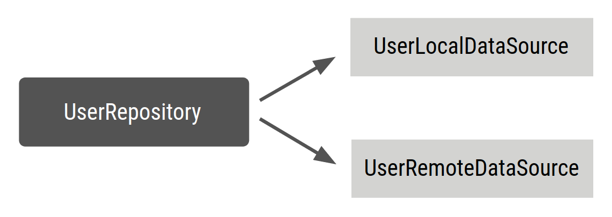
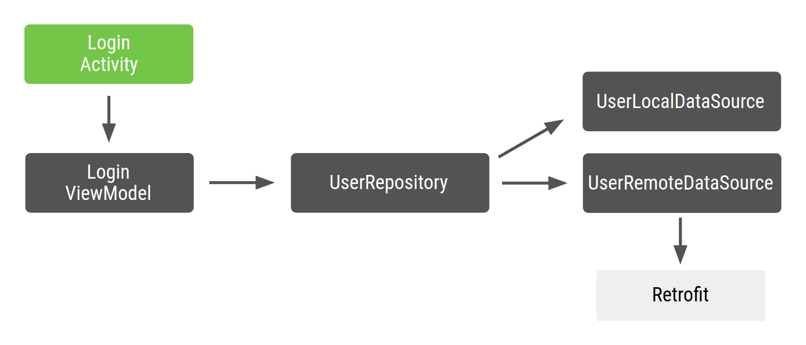
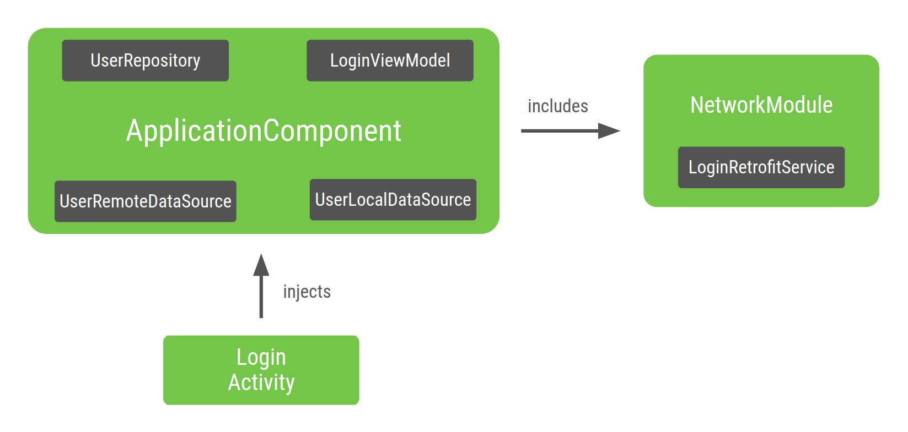
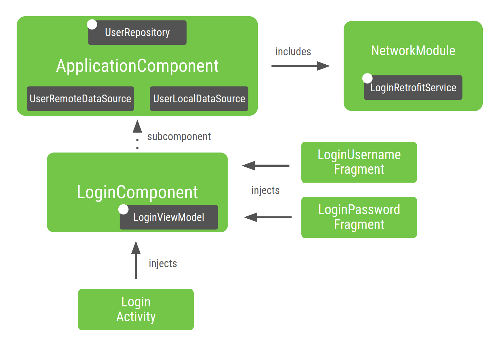
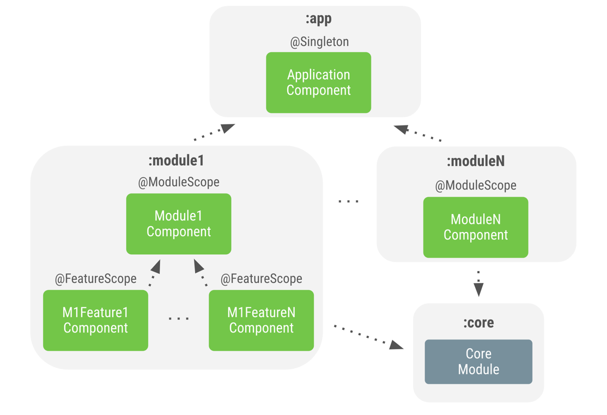
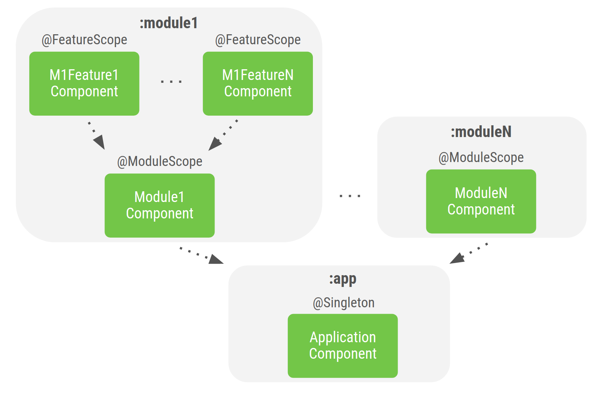

# Dagger

## Dagger基础

Android 应用中的手动依赖项注入或服务定位器可能会出现问题。可以使用 [Dagger](https://dagger.dev/) 来管理依赖项，从而在项目规模扩大时限制项目的复杂性。

Dagger 会自动生成代码，该代码与您原本需要手动编写的代码相似。由于该代码在编译时生成，因此具有可追溯性，而且性能要高于其他基于反射的解决方案（如 [Guice](https://en.wikipedia.org/wiki/Google_Guice)）。


### Dagger 的优势

Dagger 可以执行以下操作，使您无需再编写冗长乏味又容易出错的样板代码：

- 生成您在手动 DI 部分手动实现的 `AppContainer` 代码（应用图）。
- 为应用图中提供的类创建工厂。这就是在内部满足依赖关系的方式。
- 决定是重复使用依赖项还是使用“作用域”来创建新实例。
- 为特定流程创建容器，操作方法与上一部分中使用 Dagger 子组件为登录流程创建容器的方法相同。这样可以释放内存中不再需要的对象，从而提升应用性能。


### Dagger 的简单用例：生成工厂

为了演示如何使用 Dagger，我们为 `UserRepository` 类创建一个简单的[工厂](https://en.wikipedia.org/wiki/Factory_method_pattern)，如下图所示：



按以下方式定义 `UserRepository`：

```kotlin
class UserRepository(
    private val localDataSource: UserLocalDataSource,
    private val remoteDataSource: UserRemoteDataSource
) { ... }
```

向 `UserRepository` 构造函数添加 `@Inject` 注解，以便告知 Dagger 如何创建 `UserRepository`：

```kotlin
// @Inject lets Dagger know how to create instances of this object
class UserRepository @Inject constructor(
    private val localDataSource: UserLocalDataSource,
    private val remoteDataSource: UserRemoteDataSource
) { ... }
```

在上面的代码段中，您告知 Dagger：

1. 如何使用带有 `@Inject` 注解的构造函数创建 `UserRepository` 实例。
2. 它的依赖项为：`UserLocalDataSource` 和 `UserRemoteDataSource`。

现在，Dagger 已经知道了如何创建 `UserRepository` 的实例，但不知道如何创建其依赖项。如果您也为其他类添加了注解，Dagger 便会知道如何创建它们：

```kotlin
// @Inject lets Dagger know how to create instances of these objects
class UserLocalDataSource @Inject constructor() { ... }
class UserRemoteDataSource @Inject constructor() { ... }
```


### Dagger 组件

```kotlin
// @Component makes Dagger create a graph of dependencies
@Component
interface ApplicationGraph {
    // The return type  of functions inside the component interface is
    // what can be provided from the container
    fun repository(): UserRepository
}
```

在您构建项目时，Dagger 会为您生成 `ApplicationGraph` 接口的实现：`DaggerApplicationGraph`。Dagger 通过其注解处理器创建了一个依赖关系图，其中包含三个类（`UserRepository`、`UserLocalDatasource` 和 `UserRemoteDataSource`）之间的关系，并且只有一个入口点：用于获取 `UserRepository` 实例。您可以按以下方式使用：

```kotlin
// Create an instance of the application graph
val applicationGraph: ApplicationGraph = DaggerApplicationGraph.create()
// Grab an instance of UserRepository from the application graph
val userRepository: UserRepository = applicationGraph.repository()
```

Dagger 在每次收到请求时都会创建 `UserRepository` 的新实例。

```kotlin
val applicationGraph: ApplicationGraph = DaggerApplicationGraph.create()

val userRepository: UserRepository = applicationGraph.repository()
val userRepository2: UserRepository = applicationGraph.repository()

assert(userRepository != userRepository2)
```

有时，您需要在容器中包含某个依赖项的唯一实例。原因如下：

1. 您希望以此类型作为依赖项的其他类型共享同一实例，例如登录流程中使用同一 `LoginUserData` 的多个 `ViewModel` 对象。
2. 对象的创建成本很高，您不希望在每次将其声明为依赖项时都创建新实例（例如，JSON 解析器）。

在本例中，您可能希望在图中包含 `UserRepository` 的唯一实例，以便每次请求 `UserRepository` 时，都能获得同一实例。这在您的示例中非常有用，因为在具有更复杂应用图的真实应用中，您可能会具有多个依赖于 `UserRepository` 的 `ViewModel` 对象，而且您不希望在每次需要提供 `UserRepository` 时都创建 `UserLocalDataSource` 和 `UserRemoteDataSource` 的新实例。

**在手动注入依赖项时，您可以通过将 `UserRepository` 的同一实例传递给 ViewModel 类的构造函数来实现此目的**；但在 Dagger 中，由于您不用手动编写该代码，**因此您必须告知 Dagger 您希望使用同一实例。这可以通过作用域注解来实现。**

---

Dagger 中的作用域限定。

您可以使用作用域注解将某个对象的生命周期限定为其组件的生命周期。这意味着，每次需要提供该类型时，都会使用依赖项的同一实例。

为了在请求 `ApplicationGraph` 中的代码库时获得 `UserRepository` 的唯一实例，应针对 `@Component` 接口和 `UserRepository` 使用同一作用域注解。您可以使用 Dagger 所使用的 `javax.inject` 软件包随附的 `@Singleton` 注解：

```kotlin
// Scope annotations on a @Component interface informs Dagger that classes annotated
// with this annotation (i.e. @Singleton) are bound to the life of the graph and so
// the same instance of that type is provided every time the type is requested.
@Singleton
@Component
interface ApplicationGraph {
    fun repository(): UserRepository
}

// Scope this class to a component using @Singleton scope (i.e. ApplicationGraph)
@Singleton
class UserRepository @Inject constructor(
    private val localDataSource: UserLocalDataSource,
    private val remoteDataSource: UserRemoteDataSource
) { ... }
```

或者，您也可以创建并使用自定义作用域注解：

```kotlin
// Creates MyCustomScope
@Scope
@MustBeDocumented
@Retention(value = AnnotationRetention.RUNTIME)
annotation class MyCustomScope
```

然后，您可以像往常那样使用它：

```kotlin
@MyCustomScope
@Component
interface ApplicationGraph {
    fun repository(): UserRepository
}

@MyCustomScope
class UserRepository @Inject constructor(
    private val localDataSource: UserLocalDataSource,
    private val service: UserService
) { ... }
```

**在这两种情况下，为对象提供了同一作用域，该作用域用于为 `@Component` 接口添加注解**。因此，您每次调用 `applicationGraph.repository()` 时，都会获得 `UserRepository` 的同一实例。

```kotlin
val applicationGraph: ApplicationGraph = DaggerApplicationGraph.create()

val userRepository: UserRepository = applicationGraph.repository()
val userRepository2: UserRepository = applicationGraph.repository()

assert(userRepository == userRepository2)
```


## 在 Android 应用中使用 Dagger

### 最佳做法摘要

- 如果有可能，请通过 `@Inject` 进行构造函数注入，以向 Dagger 图中添加类型。如果没有可能，请执行以下操作：
  - 使用 `@Binds` 告知 Dagger 接口应采用哪种实现。
  - 使用 `@Provides` 告知 Dagger 如何提供您的项目所不具备的类。
- 您只能在组件中声明一次模块。
- 根据注释的使用生命周期，为作用域注释命名。示例包括 `@ApplicationScope`、`@LoggedUserScope` 和 `@ActivityScope`。


### 添加依赖项

如需在项目中使用 Dagger，在 `build.gradle` 文件中向应用添加以下依赖项。

```kotlin
plugins {
  id 'kotlin-kapt'
}

dependencies {
    implementation 'com.google.dagger:dagger:2.x'
    kapt 'com.google.dagger:dagger-compiler:2.x'
}
```


### Android 中的 Dagger

假设有一个示例 Android 应用的依赖关系图如图 1 所示。



由于生成该图的接口带有 `@Component` 注解，您可以将其命名为 `ApplicationComponent` 或 `ApplicationGraph`。通常会将该组件的实例保留在自定义 `Application` 类中，并在每次需要应用图时调用该实例，如以下代码段所示：

```kotlin
// Definition of the Application graph
@Component
interface ApplicationComponent { ... }

// appComponent lives in the Application class to share its lifecycle
class MyApplication: Application() {
    // Reference to the application graph that is used across the whole app
    val appComponent = DaggerApplicationComponent.create()
}
```

由于某些 Android 框架类（如 Activity 和 Fragment）由系统实例化，因此 Dagger 无法为您创建这些类。具体而言，对于 activity，任何初始化代码都需要放入 `onCreate()` 方法中。这意味着，无法像在前面的示例中那样，在类的构造函数中使用 `@Inject` 注解（构造函数注入）。必须改为使用字段注入。

您希望 Dagger 为您填充 activity 所需的依赖项，而不是在 `onCreate()` 方法中创建这些依赖项。对于字段注入，应将 `@Inject` 注解应用于您要从 Dagger 图中获取的字段。

```kotlin
class LoginActivity: Activity() {
    // You want Dagger to provide an instance of LoginViewModel from the graph
    @Inject lateinit var loginViewModel: LoginViewModel
}
```

#### 注入activity

```kotlin
@Component
interface ApplicationComponent {
    // This tells Dagger that LoginActivity requests injection so the graph needs to
    // satisfy all the dependencies of the fields that LoginActivity is requesting.
    fun inject(activity: LoginActivity)
}
```

通用 `inject()` 方法不会告知 Dagger 需要提供的内容。接口中的函数可以具有任何名称，但在它们以参数形式接收要注入的对象时将其称为 `inject()` 是 Dagger 中的一种惯例。

```kotlin
class LoginActivity: Activity() {
    // You want Dagger to provide an instance of LoginViewModel from the graph
    @Inject lateinit var loginViewModel: LoginViewModel

    override fun onCreate(savedInstanceState: Bundle?) {
        // Make Dagger instantiate @Inject fields in LoginActivity
        (applicationContext as MyApplication).appComponent.inject(this)
        // Now loginViewModel is available

        super.onCreate(savedInstanceState)
    }
}

// @Inject tells Dagger how to create instances of LoginViewModel
class LoginViewModel @Inject constructor(
    private val userRepository: UserRepository
) { ... }
```

下面告知 Dagger 如何提供剩余依赖项以构建该图：

```kotlin
class UserRepository @Inject constructor(
    private val localDataSource: UserLocalDataSource,
    private val remoteDataSource: UserRemoteDataSource
) { ... }

class UserLocalDataSource @Inject constructor() { ... }
class UserRemoteDataSource @Inject constructor(
    private val loginService: LoginRetrofitService
) { ... }
```


#### Dagger 模块

在本例中，您使用的是 [Retrofit](https://square.github.io/retrofit/) 网络库。`UserRemoteDataSource` 依赖于 `LoginRetrofitService`。不过，创建 `LoginRetrofitService` 实例的方法与您到目前为止一直执行的操作有所不同。它不是类实例化，而是调用 `Retrofit.Builder()` 并传入不同参数以配置登录服务的结果。

除了 `@Inject` 注解之外，还有一种方法可告知 Dagger 如何提供类实例，即使用 Dagger 模块中的信息。Dagger 模块是一个带有 `@Module` 注释的类。您可以在其中使用 `@Provides` 注解定义依赖项。

```kotlin
// @Module informs Dagger that this class is a Dagger Module
@Module
class NetworkModule {

    // @Provides tell Dagger how to create instances of the type that this function
    // returns (i.e. LoginRetrofitService).
    // Function parameters are the dependencies of this type.
    @Provides
    fun provideLoginRetrofitService(): LoginRetrofitService {
        // Whenever Dagger needs to provide an instance of type LoginRetrofitService,
        // this code (the one inside the @Provides method) is run.
        return Retrofit.Builder()
                .baseUrl("https://example.com")
                .build()
                .create(LoginService::class.java)
    }
}
```

为了使 Dagger 图了解此模块，必须将其添加到 `@Component` 接口，如下所示：

```kotlin
// The "modules" attribute in the @Component annotation tells Dagger what Modules
// to include when building the graph
@Component(modules = [NetworkModule::class])
interface ApplicationComponent {
    ...
}
```

示例中的 Dagger 图目前如下所示：



**图 2.** 由 Dagger 注入 `LoginActivity` 的图的表示法

图的入口点为 `LoginActivity`。由于 `LoginActivity` 注入了 `LoginViewModel`，因此 Dagger 构建的图知道如何提供 `LoginViewModel` 的实例，以及如何以递归方式提供其依赖项的实例。Dagger 知道如何执行此操作，因为类的构造函数上有 `@Inject` 注释。

在由 Dagger 生成的 `ApplicationComponent` 内，有一种工厂类型方法，可用于获取它知道如何提供的所有类的实例。在本例中，Dagger 委托给 `ApplicationComponent` 中包含的 `NetworkModule` 来获取 `LoginRetrofitService` 的实例。


#### Dagger 作用域

[`@Singleton`](https://docs.oracle.com/javaee/7/api/javax/inject/Singleton.html) 是 `javax.inject` 软件包随附的唯一一个作用域注解。您可以使用它为 `ApplicationComponent` 以及要在整个应用中重复使用的对象添加注解。

```kotlin
@Singleton
@Component(modules = [NetworkModule::class])
interface ApplicationComponent {
    fun inject(activity: LoginActivity)
}

@Singleton
class UserRepository @Inject constructor(
    private val localDataSource: UserLocalDataSource,
    private val remoteDataSource: UserRemoteDataSource
) { ... }

@Module
class NetworkModule {
    // Way to scope types inside a Dagger Module
    @Singleton
    @Provides
    fun provideLoginRetrofitService(): LoginRetrofitService { ... }
}
```

**注意**：使用构造函数注入（通过 `@Inject`）时，应在类中添加作用域注解；使用 Dagger 模块时，应在 `@Provides` 方法中添加作用域注解。

#### Dagger 子组件

如果登录流程（由单个 `LoginActivity` 管理）由多个 Fragment 组成，您应在所有 Fragment 中重复使用 `LoginViewModel` 的同一实例。`@Singleton` 无法为 `LoginViewModel` 添加注解以重复使用该实例，原因如下：

1. 流程结束后，`LoginViewModel` 的实例将继续保留在内存中。
2. 您希望为每个登录流程使用不同的 `LoginViewModel` 实例。例如，如果用户退出，您希望使用不同的 `LoginViewModel` 实例，而不是用户首次登录时的实例。

如需将 `LoginViewModel` 的作用域限定为 `LoginActivity` 的生命周期，您需要为登录流程创建新组件（新子图）和新作用域。

我们来创建一个特定于登录流程的图。

```kotlin
@Component interface LoginComponent {} 
```

现在，`LoginActivity` 应从 `LoginComponent` 获得注入，因为它具有特定于登录的配置。这可免‘于从 `ApplicationComponent` 类注入 `LoginActivity`。

```kotlin
@Component
interface LoginComponent {
    fun inject(activity: LoginActivity)
}
```

`LoginComponent` 必须能够访问 `ApplicationComponent` 中的对象，因为 `LoginViewModel` 依赖于 `UserRepository`。如需告知 Dagger 您希望新组件使用其他组件的一部分，方法是使用 Dagger 子组件。

如需创建子组件的实例，您需要父组件的实例。因此，父组件向子组件提供的对象的作用域仍限定为父组件。

在本例中，您必须将 `LoginComponent` 定义为 `ApplicationComponent` 的子组件。为此，请使用 `@Subcomponent` 为 `LoginComponent` 添加注释：

```kotlin
// @Subcomponent annotation informs Dagger this interface is a Dagger Subcomponent
@Subcomponent
interface LoginComponent {

    // This tells Dagger that LoginActivity requests injection from LoginComponent
    // so that this subcomponent graph needs to satisfy all the dependencies of the
    // fields that LoginActivity is injecting
    fun inject(loginActivity: LoginActivity)
}
```

还必须在 `LoginComponent` 内定义子组件 factory，以便 `ApplicationComponent` 知道如何创建 `LoginComponent` 的实例。

```kotlin
@Subcomponent
interface LoginComponent {

    // Factory that is used to create instances of this subcomponent
    @Subcomponent.Factory
    interface Factory {
        fun create(): LoginComponent
    }

    fun inject(loginActivity: LoginActivity)
}
```

如需告知 Dagger `LoginComponent` 是 `ApplicationComponent` 的子组件，您必须通过以下方式予以指明：

1. 创建新的 Dagger 模块（例如 `SubcomponentsModule`），并将子组件的类传递给注解的 `subcomponents` 属性。

   ```kotlin
   // The "subcomponents" attribute in the @Module annotation tells Dagger what
   // Subcomponents are children of the Component this module is included in.
   @Module(subcomponents = LoginComponent::class)
   class SubcomponentsModule {}
   ```

2. 将新模块（即 `SubcomponentsModule`）添加到 `ApplicationComponent`：

   ```kotlin
   // Including SubcomponentsModule, tell ApplicationComponent that
   // LoginComponent is its subcomponent.
   @Singleton
   @Component(modules = [NetworkModule::class, SubcomponentsModule::class])
   interface ApplicationComponent {
   }
   ```

3. 提供在接口中创建 `LoginComponent` 实例的 factory：

   ```kotlin
   @Singleton
   @Component(modules = [NetworkModule::class, SubcomponentsModule::class])
   interface ApplicationComponent {
   // This function exposes the LoginComponent Factory out of the graph so consumers
   // can use it to obtain new instances of LoginComponent
   fun loginComponent(): LoginComponent.Factory
   }
   ```

#### 为子组件分配作用域

`LoginComponent` 的生命周期是什么？需要 `LoginComponent` 的其中一项原因是，您需要在与登录相关的 Fragment 之间共享 `LoginViewModel` 的同一实例。此外，每当有新的登录流程时，您都希望使用不同的 `LoginViewModel` 实例。`LoginActivity` 表示 `LoginComponent` 的正确生命周期：对于每个新 activity，您都需要 `LoginComponent` 的新实例以及可使用该 `LoginComponent` 实例的 fragment。

由于 `LoginComponent` 会附加到 `LoginActivity` 生命周期，因此必须在 activity 中保留对该组件的引用，方式与在 `Application` 类中保留对 `applicationComponent` 的引用相同。这样，fragment 就可以访问该组件了。

```kotlin
class LoginActivity: Activity() {
    // Reference to the Login graph
    lateinit var loginComponent: LoginComponent
    ...
}
```

请注意，由于您不希望变量 `loginComponent` 由 Dagger 提供，因此该变量不带 `@Inject` 注解。

可以使用 `ApplicationComponent` 获取对 `LoginComponent` 的引用，然后注入 `LoginActivity`，如下所示：

```kotlin
class LoginActivity: Activity() {
    // Reference to the Login graph
    lateinit var loginComponent: LoginComponent

    // Fields that need to be injected by the login graph
    @Inject lateinit var loginViewModel: LoginViewModel

    override fun onCreate(savedInstanceState: Bundle?) {
        // Creation of the login graph using the application graph
        loginComponent = (applicationContext as MyDaggerApplication)
                            .appComponent.loginComponent().create()

        // Make Dagger instantiate @Inject fields in LoginActivity
        loginComponent.inject(this)

        // Now loginViewModel is available

        super.onCreate(savedInstanceState)
    }
}
```

`LoginComponent` 是在 activity 的 `onCreate()` 方法中创建的，将随着 activity 的销毁而被隐式销毁。

每次请求时，`LoginComponent` 必须始终提供 `LoginViewModel` 的同一实例。您可以通过创建自定义注解作用域并使用该作用域为 `LoginComponent` 和 `LoginViewModel` 添加注解确保这一点。**请注意，不可使用 `@Singleton` 注解，因为该注解已被父组件使用，并且使对象成为应用单例（整个应用中的唯一实例）**。您需要创建不同的注释作用域。

>作用域限定规则如下：
> - 如果某个类型标记有作用域注解，该类型就只能由带有相同作用域注解的组件使用。
> - 如果某个组件标记有作用域注解，该组件就只能提供带有该注解的类型或不带注解的类型。
> - 子组件不能使用其某一父组件使用的作用域注解。

在这种情况下，您可能已将此作用域命名为 `@LoginScope`，但这种做法并不理想。作用域注释的名称不应明确指明其实现目的。相反，作用域注释应根据其生命周期进行命名，因为注释可以由同级组件（如 `RegistrationComponent` 和 `SettingsComponent`）重复使用。因此，**您应将其命名为 `@ActivityScope` 而不是 `@LoginScope`。**

```kotlin
// Definition of a custom scope called ActivityScope
@Scope
@Retention(value = AnnotationRetention.RUNTIME)
annotation class ActivityScope

// Classes annotated with @ActivityScope are scoped to the graph and the same
// instance of that type is provided every time the type is requested.
@ActivityScope
@Subcomponent
interface LoginComponent { ... }

// A unique instance of LoginViewModel is provided in Components
// annotated with @ActivityScope
@ActivityScope
class LoginViewModel @Inject constructor(
    private val userRepository: UserRepository
) { ... }
```

现在，如果您有两个需要 `LoginViewModel` 的 fragment，系统就会为它们提供同一实例。例如，如果您有 `LoginUsernameFragment` 和 `LoginPasswordFragment`，它们需要由 `LoginComponent` 注入：

```kotlin
@ActivityScope
@Subcomponent
interface LoginComponent {

    @Subcomponent.Factory
    interface Factory {
        fun create(): LoginComponent
    }

    // All LoginActivity, LoginUsernameFragment and LoginPasswordFragment
    // request injection from LoginComponent. The graph needs to satisfy
    // all the dependencies of the fields those classes are injecting
    fun inject(loginActivity: LoginActivity)
    fun inject(usernameFragment: LoginUsernameFragment)
    fun inject(passwordFragment: LoginPasswordFragment)
}
```

组件访问位于 `LoginActivity` 对象中的组件的实例。`LoginUserNameFragment` 的示例代码显示在以下代码段中：

```kotlin
class LoginUsernameFragment: Fragment() {

    // Fields that need to be injected by the login graph
    @Inject lateinit var loginViewModel: LoginViewModel

    override fun onAttach(context: Context) {
        super.onAttach(context)

        // Obtaining the login graph from LoginActivity and instantiate
        // the @Inject fields with objects from the graph
        (activity as LoginActivity).loginComponent.inject(this)

        // Now you can access loginViewModel here and onCreateView too
        // (shared instance with the Activity and the other Fragment)
    }
}
```

同样适用于 `LoginPasswordFragment`：

```kotlin
class LoginPasswordFragment: Fragment() {

    // Fields that need to be injected by the login graph
    @Inject lateinit var loginViewModel: LoginViewModel

    override fun onAttach(context: Context) {
        super.onAttach(context)

        (activity as LoginActivity).loginComponent.inject(this)

        // Now you can access loginViewModel here and onCreateView too
        // (shared instance with the Activity and the other Fragment)
    }
}
```

图 3 显示了新子组件的 Dagger 图。带有白色圆点的类（`UserRepository`、`LoginRetrofitService` 和 `LoginViewModel`）是唯一实例作用域限定为各自组件的类。



1. `NetworkModule`（以及由此产生的 `LoginRetrofitService`）包含在 `ApplicationComponent` 中，因为您在组件中指定了它。

2. `UserRepository` 保留在 `ApplicationComponent` 中，因为其作用域限定为 `ApplicationComponent`。如果项目扩大，您会希望跨不同功能（例如注册）共享同一实例。

   由于 `UserRepository` 是 `ApplicationComponent` 的一部分，其依赖项（即 `UserLocalDataSource` 和 `UserRemoteDataSource`）也必须位于此组件中，以便能够提供 `UserRepository` 的实例。

3. `LoginViewModel` 包含在 `LoginComponent` 中，因为只有 `LoginComponent` 注入的类才需要它。`LoginViewModel` 未包含在 `ApplicationComponent` 中，因为 `ApplicationComponent` 中的任何依赖项都不需要 `LoginViewModel`。

   同样，如果您尚未将 `UserRepository` 的作用域限定为 `ApplicationComponent`，Dagger 会自动将 `UserRepository` 及其依赖项作为 `LoginComponent` 的一部分包含在内，因为这是目前使用 `UserRepository` 的唯一位置。


### 构建 Dagger 图的最佳实践

为应用构建 Dagger 图时：

- 创建组件时，您应该考虑什么元素会决定该组件的生命周期。在本例中，`Application` 类负责 `ApplicationComponent`，且 `LoginActivity` 类负责 `LoginComponent`。
- 请仅在必要时使用作用域限定。过度使用作用域限定可能会对应用的运行时性能产生负面影响：只要组件在内存中，对象就会在内存中；获取限定作用域的对象的成本更高。当 Dagger 提供对象时，它使用 `DoubleCheck` 锁定，而不是 factory 类型提供程序。


## 在多模块应用中使用 Dagger 

包含多个 Gradle 模块的项目称为多模块项目。在作为单个 APK 发布且不包含功能模块的多模块项目中，通常具有一个可依赖于项目中大多数模块的 `app` 模块和一个其他模块通常可依赖的 `base` 或 `core` 模块。`app` 模块通常包含 [`Application`](https://developer.android.com/reference/android/app/Application?hl=zh-cn) 类，而 `base` 模块包含在项目中所有模块之间共享的所有通用类。

`app` 模块非常适合用来声明应用组件（例如，下图中的 `ApplicationComponent`），应用组件可以提供其他组件可能需要的对象以及应用的单例。例如，**像 `OkHttpClient` 这样的类、JSON 解析器、数据库的访问函数或可能在 `core` 模块中定义的 `SharedPreferences` 对象，都将由 `app` 模块中定义的 `ApplicationComponent` 提供。**

在项目的不同模块中，您可以至少定义一个具有该模块的专属逻辑的子组件，如图 1 所示。



### 使用 Dagger 子组件实现

```kotlin
interface LoginComponentProvider {
    fun provideLoginComponent(): LoginComponent
}
```

`LoginActivity` 将使用该接口：

```kotlin
class LoginActivity: Activity() {
  ...

  override fun onCreate(savedInstanceState: Bundle?) {
    loginComponent = (applicationContext as LoginComponentProvider)
                        .provideLoginComponent()

    loginComponent.inject(this)
    ...
  }
}
```

现在，`MyApplication` 需要实现该接口以及所需的方法：

```kotlin
class MyApplication: Application(), LoginComponentProvider {
  // Reference to the application graph that is used across the whole app
  val appComponent = DaggerApplicationComponent.create()

  override fun provideLoginComponent(): LoginComponent {
    return appComponent.loginComponent().create()
  }
}
```

这就是在多模块项目中使用 Dagger 子组件的方法。


### 包含功能模块时的组件依赖关系

包含[功能模块](https://developer.android.com/studio/projects/dynamic-delivery?hl=zh-cn#customize_delivery)时，模块之间相互依赖的方式通常是相反的。不是 `app` 模块包含功能模块，而是功能模块依赖于 `app` 模块。如需了解这些模块之间的依赖关系，请参见图 2。



例如，名为 `login` 的功能模块需要构建一个 `LoginComponent`，该组件依赖于 `app` Gradle 模块中提供的 `AppComponent`。

以下是作为 `app` Gradle 模块一部分的类和 `AppComponent` 的定义：

```kotlin
// UserRepository's dependencies
class UserLocalDataSource @Inject constructor() { ... }
class UserRemoteDataSource @Inject constructor() { ... }

// UserRepository is scoped to AppComponent
@Singleton
class UserRepository @Inject constructor(
    private val localDataSource: UserLocalDataSource,
    private val remoteDataSource: UserRemoteDataSource
) { ... }

@Singleton
@Component
interface AppComponent { ... }
```

在包含 `app` Gradle 模块的 `login` Gradle 模块中，有一个需要注入 `LoginViewModel` 实例的 `LoginActivity`：

```kotlin
// LoginViewModel depends on UserRepository that is scoped to AppComponent
class LoginViewModel @Inject constructor(
    private val userRepository: UserRepository
) { ... }
```

`LoginViewModel` 依赖于可用且作用域限定为 `AppComponent` 的 `UserRepository`。我们创建一个依赖于 `AppComponent` 注入 `LoginActivity` 的 `LoginComponent`：

```kotlin
// Use the dependencies attribute in the Component annotation to specify the
// dependencies of this Component
@Component(dependencies = [AppComponent::class])
interface LoginComponent {
    fun inject(activity: LoginActivity)
}
```

`LoginComponent` 通过将 `AppComponent` 添加到组件注解的 dependencies 参数中来指定对 AppComponent 的依赖。由于 `LoginActivity` 将由 Dagger 注入，因此应将 `inject()` 方法添加到接口。

在创建 `LoginComponent` 时，需要传入 `AppComponent` 的实例。请使用组件工厂执行此操作：

```kotlin
@Component(dependencies = [AppComponent::class])
interface LoginComponent {

    @Component.Factory
    interface Factory {
        // Takes an instance of AppComponent when creating
        // an instance of LoginComponent
        fun create(appComponent: AppComponent): LoginComponent
    }

    fun inject(activity: LoginActivity)
}
```

现在，`LoginActivity` 即可创建 `LoginComponent` 的实例并调用 `inject()` 方法。

```kotlin
class LoginActivity: Activity() {

    // You want Dagger to provide an instance of LoginViewModel from the Login graph
    @Inject lateinit var loginViewModel: LoginViewModel

    override fun onCreate(savedInstanceState: Bundle?) {
        // Gets appComponent from MyApplication available in the base Gradle module
        val appComponent = (applicationContext as MyApplication).appComponent

        // Creates a new instance of LoginComponent
        // Injects the component to populate the @Inject fields
        DaggerLoginComponent.factory().create(appComponent).inject(this)

        super.onCreate(savedInstanceState)

        // Now you can access loginViewModel
    }
}
```

`LoginViewModel` 依赖于 `UserRepository`；为了让 `LoginComponent` 能够从 `AppComponent` 访问 UserRepository，`AppComponent` 需要在其接口中提供 UserRepository。

```kotlin
@Singleton
@Component
interface AppComponent {
    fun userRepository(): UserRepository
}
```

如果您希望将 `LoginViewModel` 的作用域限定为 `LoginComponent`，可以按照之前使用自定义 `@ActivityScope` 注解的方法操作。

```kotlin
@ActivityScope
@Component(dependencies = [AppComponent::class])
interface LoginComponent { ... }

@ActivityScope
class LoginViewModel @Inject constructor(
    private val userRepository: UserRepository
) { ... }
```


### 最佳实践

- `ApplicationComponent` 应始终位于 `app` 模块中。
- 如果需要在某个模块中执行字段注入，或者需要为应用的特定流程限定对象的作用域，请在该模块中创建 Dagger 组件。
- 对于要用作实用程序或帮助程序且无需构建图表（这就是您需要 Dagger 组件的原因）的 Gradle 模块，请使用不支持构造函数注入的类的 @Provides 和 @Binds 方法来创建和提供公共 Dagger 模块。
- 若要在包含功能模块的 Android 应用中使用 Dagger，请使用组件依赖项，以便访问 `app` 模块中定义的 `ApplicationComponent` 所提供的依赖项。