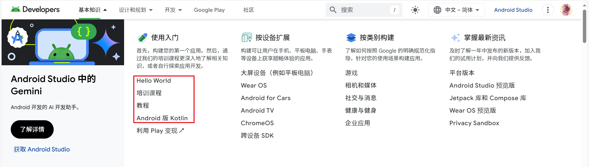
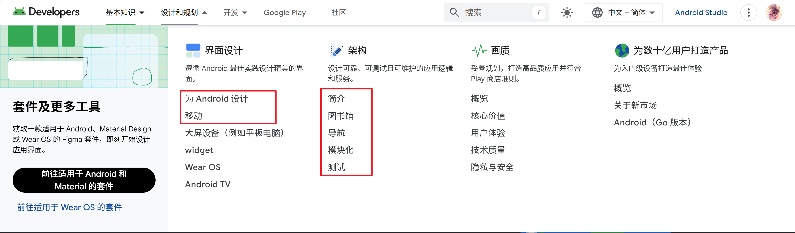
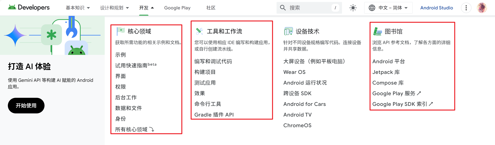

【DONE】
入口地址 https://m3.material.io/
简介与导航 https://m3.material.io/ => 大纲，泛读即可。
基础知识准备 https://m3.material.io/foundations => 理论知识准备，需要过一次。
样式风格指南 https://m3.material.io/styles => color elevation icons motion shape typography 样式理论的知识准备，过一次。
组件 https://m3.material.io/components => 具体的组件说明，提供了各平台的代码实现的链接。了解有哪些组件名称，需要时再细看。

关于色彩设计：
https://m3.material.io/styles/color/resources 这里有几个很有用的链接，可以探索。
需要注意 Material Theme Builder

一个经典M3 app教程参考：
https://developer.android.com/develop/ui/compose/designsystems/material3?hl=zh-tw

---

【Done】
Android 之 Compose 开发基础
https://developer.android.com/courses/android-basics-compose/course?hl=zh-cn

```
Android 之 Compose 开发基础
- 第 1 单元：您的首个 Android 应用
- 第 2 单元：构建应用界面
  - Kotlin 基础知识
  - 为应用添加按钮
  - 与界面和状态交互
```

0. Android Studio的安装与界面熟悉。
1. Hello Android App的构建
2. 运行方式：AVD/真机（USB或者wifi调试）
---
学会 Text() 类型的创建和显示，以及row（行，水平方向） column（列，垂直方向） box布局概念。
学会利用 resource manager规范地导入图片资源。
学会利用alt+enter快速提取hard-coded string to strings.xml

关于C盘 .android路径的问题的解决方案
> https://developer.android.com/tools/variables?hl=zh-cn
>
> 更新 AS版本到2023，
>
> - 设置ANDROID_AVD_HOME。
>
> - 或者设置ANDROID_PREFS_ROOT 变量为D:\AndroidAVD

---

练习：

- [Compose 文章](https://github.com/google-developer-training/basic-android-kotlin-compose-training-practice-problems/tree/main/Unit 1/Pathway 3/ComposeArticle)

- [任务管理器](https://github.com/google-developer-training/basic-android-kotlin-compose-training-practice-problems/tree/main/Unit 1/Pathway 3/TaskCompleted)

- ###### [Compose 象限](https://github.com/google-developer-training/basic-android-kotlin-compose-training-practice-problems/tree/main/Unit 1/Pathway 3/ComposeQuadrant)

调试程序：[使用 Android Studio 中的调试程序](https://developer.android.com/codelabs/basic-android-kotlin-compose-intro-debugger?hl=zh-cn&continue=https%3A%2F%2Fdeveloper.android.com%2Fcourses%2Fpathways%2Fandroid-basics-compose-unit-2-pathway-2%3Fhl%3Dzh-cn%23codelab-https%3A%2F%2Fdeveloper.android.com%2Fcodelabs%2Fbasic-android-kotlin-compose-intro-debugger#3)

---

remember 在每次UI recompose时重新记住状态，但是有个弊端，无法支持例如屏幕方向旋转这种改变，此时状态依旧会重置。

rememberSavable 类似remember，但是可以支持屏幕方向旋转这种改变。推荐使用这个API。

MutableStateList API是可变list。

ViewModel 将composeable函数的状态改变逻辑转移到外部自定义的模型中。最佳实践：您不应该将 ViewModel 传递给其他可组合函数。不要违背single source of truth原则。

- Compose 中的状态提升是一种将状态移至可组合函数的调用方以使可组合函数无状态的模式。

数据库SQLite持久层抽象：[Room  | Jetpack  | Android Developers](https://developer.android.com/jetpack/androidx/releases/room?hl=zh-cn)

---

sparse-checkout example:

```bash
 git clone --no-checkout https://github.com/android/codelab-android-compose
 cd .\codelab-android-compose\
 git sparse-checkout set BasicStateCodelab
 # main表示检出对应set [path]中的path在main分支的状态
 git checkout main
```
---

利用工具加快开发速度

- IDE live templates such as WC(Column)、WR(Row)。
- Gutter icons to select or change color/images
- @Preview to quick preview UI design
- live edit to see realtime updates

---

[迁移到 Jetpack Compose (android.com)](https://developer.android.com/codelabs/jetpack-compose-migration?hl=zh-cn) 讲解了如何从传统XML UI 迁移到 compose 写法。

---

[使用 Material Design 3 为应用设置主题](https://developer.android.com/codelabs/jetpack-compose-theming?hl=zh-cn)

这是一个很好的关于 list、listItem和 listDetail 的例子，注意点：

`Theme.kt`

```kotlin
val context = LocalContext.current
val colors = when {
    // 这部分代码在SDK >= 31 的设备/模拟器中，如果你没有实现动态设置theme的代码逻辑，那么将会回退到默认主题。
    // 这个主题颜色不是 DarkColors ，也不是 LightColors！
    Build.VERSION.SDK_INT >= Build.VERSION_CODES.S -> {
        if (useDarkTheme) dynamicDarkColorScheme(context)
        else dynamicLightColorScheme(context)
    }
    useDarkTheme -> DarkColors
    else -> LightColors
}
```

---

compose 动画，案例：[在 Jetpack Compose 中为元素添加动画效果](https://developer.android.com/codelabs/jetpack-compose-animation?hl=zh-cn)

一些高级别动画 API

- `animatedContentSize`
- `AnimatedVisibility`

一些较低级别的动画 API：

- `animate*AsState`，用于为单个值添加动画效果
- `updateTransition`，用于为多个值添加动画效果
- `infiniteTransition` 用于为多个值无限期地添加动画效果
- `Animatable`，用于结合触摸手势构建自定义动画效果

---

约束条件和修饰符顺序：constraints down ↓ , size up ↑。约束从父元素往子元素传递，元素的实际大小从最底层子元素开始向上报告。

参考视频：[布局、主题设置和动画  —— 约束条件和修饰符顺序](https://developer.android.com/courses/pathways/jetpack-compose-for-android-developers-2?hl=zh-cn)

流程：Data -> [composition  -> layout(measurement and placement) -> drawing] -> UI

---

案例学习：[Jetpack Compose 中的高级状态和附带效应  | Android Developers](https://developer.android.com/codelabs/jetpack-compose-advanced-state-side-effects?hl=zh-cn)

> Compose 中的附带效应是指发生在可组合函数作用域之外的应用状态的变化。

- 附带效应 API，如 [`LaunchedEffect`](https://developer.android.com/reference/kotlin/androidx/compose/runtime/package-summary?hl=zh-cn#LaunchedEffect(kotlin.Any,kotlin.coroutines.SuspendFunction1))、[`rememberUpdatedState`](https://developer.android.com/reference/kotlin/androidx/compose/runtime/package-summary?hl=zh-cn#rememberUpdatedState(kotlin.Any))、[`DisposableEffect`](https://developer.android.com/reference/kotlin/androidx/compose/runtime/package-summary?hl=zh-cn#DisposableEffect(kotlin.Any,kotlin.Function1))、[`produceState`](https://developer.android.com/reference/kotlin/androidx/compose/runtime/package-summary?hl=zh-cn#produceState(kotlin.Any,kotlin.coroutines.SuspendFunction1)) 和 [`derivedStateOf`](https://developer.android.com/reference/kotlin/androidx/compose/runtime/package-summary?hl=zh-cn#derivedStateOf(kotlin.Function0))。
- 如何使用 [`rememberCoroutineScope`](https://developer.android.com/reference/kotlin/androidx/compose/runtime/package-summary?hl=zh-cn#rememberCoroutineScope(kotlin.Function0)) API 在可组合项中创建协程并调用挂起函数。

---

导航案例：[Navigation](https://developer.android.com/codelabs/jetpack-compose-navigation?hl=zh-cn)

学习目标：如何设置可组合目的地的导航图、定义导航路线和操作、通过实参向路线传递额外信息、设置深层链接以及测试导航等。

---

[compose UI测试案例](https://developer.android.com/codelabs/jetpack-compose-testing?hl=zh-cn)

---

一个性能优化的案例：将scroll值的传递从及早提取变为lambda，并尽可能推迟读取。[调试重组](https://youtu.be/SWBN0y0lFNY)

更多关于性能优化的提示，[相关视频](https://youtu.be/ahXLwg2JYpc)：

- Macrobenchmark: The answer to if your performance optimisations are working.
- Defer reading state: Use lambdas to read state as late as possible.
- Stability: Compose determines the stability of your Composables to determine if they can be skipped.
- derivedStateOf: Used when your state or key is changing more than you need to update your Ul.
- reportFullyDrawn: Allows Android to optimise your apps startup.
- Making apps blazing fast with Baseline Profiles: Learn how to create Baseline Profiles and more importantly how to benchmark and tune profiles.

---

响应式布局：[使用 Jetpack Compose 构建自适应应用](https://codelabs.developers.google.com/jetpack-compose-adaptability?hl=zh-cn)

学习目标：如何检查设备的大小和折叠状态，以及如何相应地更新应用的界面、导航栏和其他功能。

## 阅读路线

> 第一步：筛选出需要重点关注的章节。

### 基础知识

[Android 必备知识  | Android Developers](https://developer.android.com/get-started?hl=zh-cn)




---

- [ ] [让您的 Android 应用使用起来更没有障碍](https://developer.android.com/courses/pathways/make-your-android-app-accessible?hl=zh-cn) 阅读优先级低
- [ ] [“在常见 Android 用例中使用协程”测验](https://developer.android.com/courses/pathways/android-coroutines?hl=zh-cn)
- [ ] [Kotlin bootcamp for programmers](https://developer.android.com/courses/kotlin-bootcamp/overview)
- [ ] [Kotlin for Java developers](https://developer.android.com/courses/pathways/kotlin-for-java)
- [ ] [Android Room with a View - Java](https://developer.android.com/codelabs/android-room-with-a-view)
- [ ] [Background work with WorkManager - Java](https://developer.android.com/codelabs/android-workmanager-java)
- [ ] [学习采用 Kotlin Flow 和 LiveData 的高级协程](https://developer.android.com/codelabs/advanced-kotlin-coroutines?hl=zh-cn#0)

---

~~培训课程~~

~~教程~~

---

- [ ] [Android 的 Kotlin 优先方法](https://developer.android.com/kotlin/first?hl=zh-cn)
- [ ] [Android 之 Compose 开发基础](https://developer.android.com/kotlin/androidbasics?hl=zh-cn)
- [ ] [将 Kotlin 添加到现有应用](https://developer.android.com/kotlin/add-kotlin?hl=zh-cn)
- [ ] [Android 上的 Kotlin 协程](https://developer.android.com/kotlin/coroutines?hl=zh-cn)

 

### 设计和规划

[设计和规划  | Android Developers](https://developer.android.com/design?hl=zh-cn)



~~为 Android 设计~~

- [ ] [移动设计指南](https://developer.android.com/design/ui/mobile/guides/foundations/system-bars?hl=zh-cn)

其余链接均指向了开发部分，这里就省略。

### 开发

[针对 Android 进行开发  | Android Developers](https://developer.android.com/develop?hl=zh-cn)



- [x] ~~示例~~
- [x] ~~试用快速指南~~
- [x] ~~界面~~
- [ ] 权限 -> 开发指南——权限 [Android 中的权限  | Android Developers](https://developer.android.com/guide/topics/permissions/overview?hl=zh-cn)
- [ ] [后台工作](https://developer.android.com/develop/background-work?hl=zh-cn)
- [ ] 数据和文件 -> 开发指南 [应用数据和文件  | Android Developers](https://developer.android.com/guide/topics/data?hl=zh-cn)
- [ ] 身份 [Add a sign-in workflow  | Identity  | Android Developers](https://developer.android.com/identity/sign-in)
- [ ] [开发者指南](https://developer.android.com/guide?hl=zh-cn)
- [ ] [core area - UI](https://developer.android.com/develop/ui/compose/documentation?hl=zh-cn)

---

工具和工具流

- [ ] ~~编写和调试代码~~
- [ ] ~~构建项目~~
- [ ] ~~测试应用~~
- [ ] [应用性能指南  | App quality  | Android Developers](https://developer.android.com/topic/performance/overview?hl=zh-cn)
- [ ] [命令行工具  | Android Studio  | Android Developers](https://developer.android.com/tools?hl=zh-cn)

---

构建和测试

- [ ] [配置 build | Android Studio | Android Developers](https://developer.android.com/build?hl=zh-cn)
- [ ] [在 Android 平台上测试应用 | Android Developers](https://developer.android.com/training/testing?hl=zh-cn)

---

jetpack 库

- [ ] [按类型探索 Jetpack 库  | Android Developers](https://developer.android.com/jetpack/androidx/explorer?hl=zh-cn)


## reading 

- jetpack-compose 系列教程：
  https://developer.android.com/courses/jetpack-compose/course?hl=zh-cn

- Jetpack Compose 教程
  [Jetpack Compose 使用入门  | Android Developers](https://developer.android.com/develop/ui/compose/documentation?hl=zh-cn)

- Compose samples

  [android/compose-samples: Official Jetpack Compose samples](https://github.com/android/compose-samples)

-  Android TODO App 

  [architecture-samples](https://github.com/android/architecture-samples)

