# Jetpack Compose Codelabs 实践

> [android/codelab-android-compose](https://github.com/android/codelab-android-compose)

仅记录必要步骤。

## 运行准备

使用稳定版AGP。

```
distributionUrl=https\://mirrors.aliyun.com/macports/distfiles/gradle/gradle-8.7-bin.zip
```

gradle.properties 中打开配置缓存以加速构建过程。

```properties
org.gradle.configuration-cache=true
```

以 ThemingCodelab 为例进行说明。

ThemingCodelab/build.gradle中，注释掉关于repositories的配置

```config
//    repositories {
//        google()
//        mavenCentral()
//    }
```

ThemingCodelab/settings.gradle.kts 中

```kotlin
pluginManagement {
    repositories {
        // 阿里云镜像 - 注意使用双引号
        maven { url = uri("https://maven.aliyun.com/repository/google") }
        maven { url = uri("https://maven.aliyun.com/repository/public") }
        maven { url = uri("https://maven.aliyun.com/repository/gradle-plugin") }
        // 官方仓库作为备选
        gradlePluginPortal()
        google()
        mavenCentral()
    }
}

dependencyResolutionManagement {
    repositoriesMode.set(RepositoriesMode.FAIL_ON_PROJECT_REPOS)
    repositories {
        // 阿里云镜像 - 注意使用双引号
        maven { url = uri("https://maven.aliyun.com/repository/google") }
        maven { url = uri("https://maven.aliyun.com/repository/public") }
        maven { url = uri("https://maven.aliyun.com/repository/central") }
        // 官方仓库作为备选
        google()
        mavenCentral()
    }
}
```

repositoriesMode 三种模式的对比

| 模式                        | 行为                       | 适用场景                   |
| :-------------------------- | :------------------------- | :------------------------- |
| **`FAIL_ON_PROJECT_REPOS`** | 模块级有仓库声明就**报错** | 严格统一管理仓库，防止分散 |
| **`PREFER_PROJECT`**        | 优先使用模块级仓库         | 需要局部覆盖全局配置       |
| **`PREFER_SETTINGS`**       | 优先使用 settings 中的仓库 | 大多数项目的默认推荐       |


## [Basics codelab](https://developer.android.com/codelabs/jetpack-compose-basics)

- `Surface` 会了解，当该背景设置为 `primary` 颜色后，其上的任何文本都应使用 `onPrimary` 颜色，此颜色也在主题中进行了定义。
- [修饰符参阅文档](https://developer.android.com/develop/ui/compose/modifiers-list?hl=zh-cn#Size)
- Compose 中的三个基本标准布局元素是 `Column`、`Row` 和 `Box` 可组合项。
- [尾随 lambda](https://kotlinlang.org/docs/lambdas.html#passing-trailing-lambdas) 可以移到括号之外。
- 可组合函数可以按任意顺序频繁执行，因此您不能以代码的执行顺序或该函数的重组次数为判断依据。
- `State` 和 `MutableState` 是两个接口，它们具有特定的值，每当该值发生变化时，它们就会触发界面更新（重组）。
- 如需在重组后保留状态，请使用 `remember` 记住可变状态。`remember` 函数**仅在可组合项包含在组合中时**起作用。旋转屏幕后，整个 activity 都会重启，所有状态都将丢失。当发生任何配置更改或者进程终止时，也会出现这种情况。可以使用 `rememberSaveable`，而不使用 `remember`。这会保存每个在配置更改（如旋转）和进程终止后保留下来的状态。
- **您可以将内部状态视为类中的私有变量**。
- `shouldShowOnboarding` 使用的是 `by` 关键字，而不是 `=`。这是一个属性委托，可让您无需每次都输入 `.value`。
- `LazyColumn` 和 `LazyRow` 相当于 Android View 中的 `RecyclerView`。`LazyColumn` 不会像 `RecyclerView` 一样回收其子级。它会在您滚动它时发出新的可组合项，并保持高效运行。请确保导入 `androidx.compose.foundation.lazy.items`。

动画效果

```kotlin
    Row(
        modifier = Modifier
            .padding(12.dp)
            .animateContentSize(
                animationSpec = spring(
                    dampingRatio = Spring.DampingRatioMediumBouncy,
                    stiffness = Spring.StiffnessLow
                )
            )
    ) {}
```

- `dampingRatio`（阻尼比）：控制弹簧动画的**弹性程度**和**停止速度**。
- `stiffness`（刚度）：控制弹簧的**硬度**，影响动画的速度。

## [Basic layouts codelab](https://developer.android.com/codelabs/jetpack-compose-layouts)


- 为了保持相同的内边距，同时确保在父级列表的边界内滚动内容时内容不会被截断，所有列表都需向 `LazyRow` 提供一个名为 `contentPadding` 的形参，并将其设置为 `16.dp`。

```kotlin
import androidx.compose.foundation.layout.PaddingValues

@Composable
fun AlignYourBodyRow(
   modifier: Modifier = Modifier
) {
   LazyRow(
       horizontalArrangement = Arrangement.spacedBy(8.dp),
       contentPadding = PaddingValues(horizontal = 16.dp),
       modifier = modifier
   ) {
       items(alignYourBodyData) { item ->
           AlignYourBodyElement(item.drawable, item.text)
       }
   }
}
```

- 可以通过设置底部导航栏的 `containerColor` 形参来更新其背景颜色。
- 窗口大小类别分为三种宽度：较小、中等和较大。应用处于竖屏模式时，使用较小宽度；处于横屏模式时，使用较大宽度。在此 Codelab 中，不会用到中等宽度。

```kotlin
@Composable
fun MySootheApp(windowSize: WindowSizeClass) {
   when (windowSize.widthSizeClass) {
       WindowWidthSizeClass.Compact -> {
           MySootheAppPortrait()
       }
       WindowWidthSizeClass.Expanded -> {
           MySootheAppLandscape()
       }
   }
}
```

- 尺寸计算问题。

```kotlin
@Composable
fun FavoriteCollectionsGrid(
    modifier: Modifier = Modifier
) {
    LazyHorizontalGrid(
        rows = GridCells.Fixed(2),
        contentPadding = PaddingValues(horizontal = 16.dp),
        horizontalArrangement = Arrangement.spacedBy(16.dp),
        verticalArrangement = Arrangement.spacedBy(16.dp),
        modifier = modifier.height(168.dp)
    ) {
        items(favoriteCollectionsData) { item ->
            FavoriteCollectionCard(item.drawable, item.text, Modifier.height(80.dp))
        }
    }
}
```

这里两个卡片高度都是80dp，垂直中间有一个gap为16dp，一共176dp，与modifier.height(168.dp)定义不一致。这是因为

.height(168.dp) 指定的高度不是严格意义的高度，只是参考高度。

> public fun Modifier.height( height: Dp ): Modifier
>
> Declare the preferred height of the content to be exactly heightdp. The incoming measurement Constraints may override this value, forcing the content to be either smaller or larger

预览示意图。

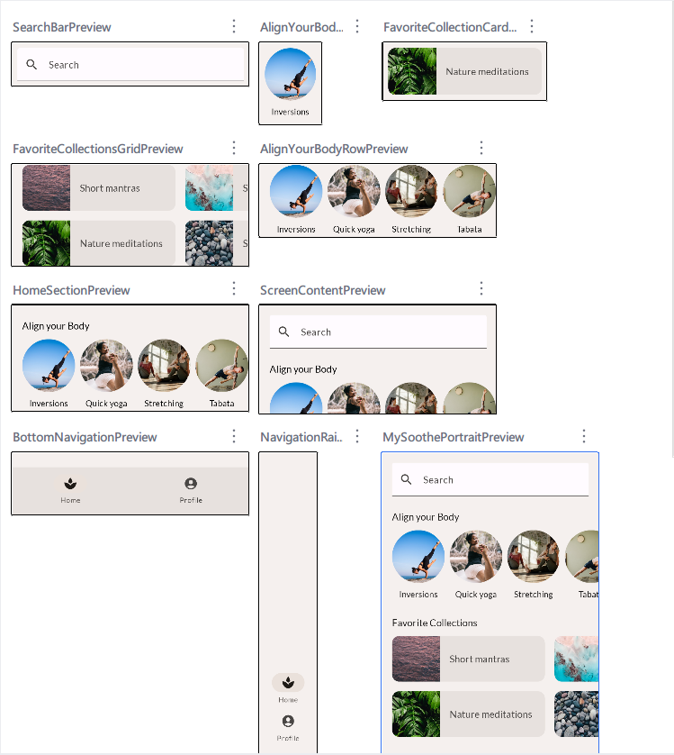

点击对应的预览标题名称时，会跳转到编辑器页面的对应的代码行，非常实用。

## [State codelab](https://developer.android.com/codelabs/jetpack-compose-state)

- 状态提升。Compose 中的状态提升是一种将状态移至可组合函数的调用方以使可组合函数无状态的模式。

  状态下降、事件上升的这种模式称为单向数据流 (UDF)。

- 有状态可组合函数和无状态可组合函数

- Compose 如何使用 `State<T>` API 自动跟踪状态

- 您可能已经在使用其他可观察类型，例如使用 [LiveData](https://developer.android.com/topic/libraries/architecture/livedata?hl=zh-cn)、[StateFlow](https://kotlin.github.io/kotlinx.coroutines/kotlinx-coroutines-core/kotlinx.coroutines.flow/-state-flow/)、[Flow](https://kotlin.github.io/kotlinx.coroutines/kotlinx-coroutines-core/kotlinx.coroutines.flow/-flow/index.html) 和 RxJava 的 [Observable](http://reactivex.io/documentation/observable.html) 在应用中存储状态。

- Compose 是一个声明性界面框架。它描述界面在特定状况下的状态，而不是在状态发生变化时移除界面组件或更改其可见性。

-  `remember` 可帮助您在重组后保持状态，但不会帮助您**在配置更改后保持状态**。为此，您必须使用 [`rememberSaveable`](https://developer.android.com/reference/kotlin/androidx/compose/runtime/saveable/package-summary?hl=zh-cn#rememberSaveable(kotlin.Array,androidx.compose.runtime.saveable.Saver,kotlin.String,kotlin.Function0))，而不是 `remember`。

- 可组合函数 `rememberLazyListState` 使用 `rememberSaveable` 为列表创建初始状态。重新创建 activity 后，无需任何编码即可保持滚动状态。

- 定义可观察的 `MutableList`。扩展函数 [`toMutableStateList()`](https://developer.android.com/reference/kotlin/androidx/compose/runtime/package-summary?hl=zh-cn#(kotlin.collections.Collection).toMutableStateList()) 用于根据初始可变或不可变的 `Collection`（例如 `List`）来创建可观察的 `MutableList`。

- [ViewModels](https://developer.android.com/topic/libraries/architecture/viewmodel?hl=zh-cn) 提供界面状态以及对位于应用其他层中的业务逻辑的访问。

- 将 `ViewModel` 实例传递给其他可组合函数是一种不好的做法。您应仅传递它们需要的数据以及将所需逻辑作为参数来执行的函数。

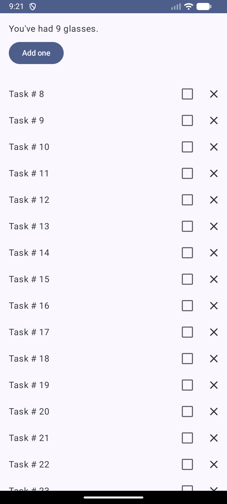

## ThemingCodelab

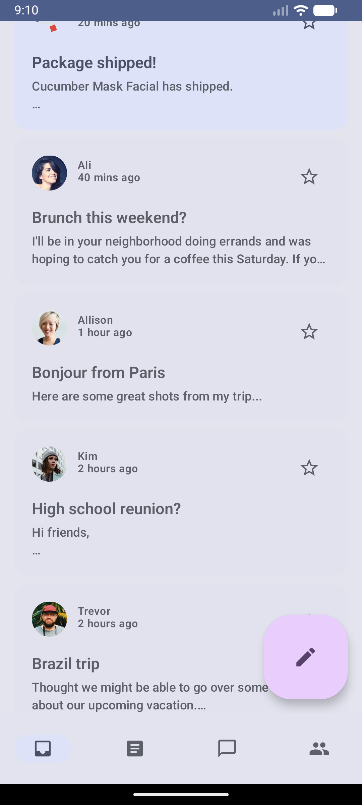


- 底部导航栏
- 常规 list 视图
- 常规 itemDetail 视图
- 本地 mockDataProvider 的写法
- 返回键的处理
- application’s colors, typography and shapes and support light and dark themes.
- 在 Material 3 中，背景颜色在整个主题中保持一致，而 Surface 颜色不是静态的。Surface 颜色根据 Surface 的高度从主色中提取色调。
- 动态颜色适用于 Android 12 及更高版本。如果动态颜色可用，您可以使用 `dynamicDarkColorScheme()` 或 `dynamicLightColorScheme()` 设置动态配色方案。如果不可用，您应回退采用默认的浅色或深色 `ColorScheme`。

```kotlin
@Composable
fun AppTheme(
   useDarkTheme: Boolean =  isSystemInDarkTheme(),
   content: @Composable () -> Unit
) {
   val context = LocalContext.current
   val colors = when {
       (Build.VERSION.SDK_INT >= Build.VERSION_CODES.S) -> {
           if (useDarkTheme) dynamicDarkColorScheme(context)
           else dynamicLightColorScheme(context)
       }
       useDarkTheme -> DarkColors
       else -> LightColors
   }
   
      MaterialTheme(
       colorScheme = colors,
       content = content
     )
}
```

- 状态栏的样式也能根据用于为应用设置主题的配色方案进行动态变化。

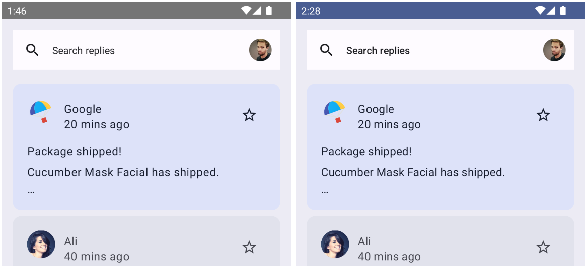

```kotlin
@Composable
fun AppTheme(
   useDarkTheme: Boolean =  isSystemInDarkTheme(),
   content: @Composable () -> Unit
) {
 
 // color scheme selection code

 // Add primary status bar color from chosen color scheme.
 val view = LocalView.current
 if (!view.isInEditMode) {
    SideEffect {
        val window = (view.context as Activity).window
        window.statusBarColor = colors.primary.toArgb()
        WindowCompat
            .getInsetsController(window, view)
            .isAppearanceLightStatusBars = useDarkTheme
    }
 }
   
  MaterialTheme(
    colorScheme = colors,
     content = content
   )
}
```

- Material Design 3 定义了一个[字体比例](https://m3.material.io/styles/typography/overview)。命名和分组已简化为：显示、大标题、标题、正文和标签，每个都有大号、中号和小号。

一个注意的地方

```kotlin
@Composable
fun ReplyEmailListContent(
    replyHomeUIState: ReplyHomeUIState,
    emailLazyListState: LazyListState,
    modifier: Modifier = Modifier,
    closeDetailScreen: () -> Unit,
    navigateToDetail: (Long) -> Unit
) {
    if (replyHomeUIState.selectedEmail != null && replyHomeUIState.isDetailOnlyOpen) {
        BackHandler {
            closeDetailScreen()
        }
        ReplyEmailDetail(email = replyHomeUIState.selectedEmail) {
            closeDetailScreen()
        }
    } else {
        ReplyEmailList(
            emails = replyHomeUIState.emails,
            emailLazyListState = emailLazyListState,
            modifier = modifier,
            navigateToDetail = navigateToDetail
        )
    }
}
```

- ReplyEmailListContent 函数中有关注selectedEmail的值，如果不为空，就显示详情页
- 否则，显示的是email list 列表页。


## [Migration codelab](https://developer.android.com/codelabs/jetpack-compose-migration)

Understand how Jetpack Compose and View-based UIs can co-exist and interact, making it easy to adopt Compose at your own pace.

- [`LiveData.observeAsState()`](https://cs.android.com/androidx/platform/frameworks/support/+/androidx-main:compose/runtime/runtime-livedata/src/main/java/androidx/compose/runtime/livedata/LiveDataAdapter.kt?hl=zh-cn) 开始观察 LiveData，并以 `State` 对象表示它的值。每次向 LiveData 发布一个新值时，返回的 `State` 都会更新，这会导致所有 `State.value` 用例重组。

- 使用 AndroidView 组件显示HTML文本

```kotlin
@Composable
private fun PlantDescription(description: String) {
    // Remembers the HTML formatted description. Re-executes on a new description
    val htmlDescription = remember(description) {
        HtmlCompat.fromHtml(description, HtmlCompat.FROM_HTML_MODE_COMPACT)
    }

    // Displays the TextView on the screen and updates with the HTML description when inflated
    // Updates to htmlDescription will make AndroidView recompose and update the text
    AndroidView(
        factory = { context ->
            TextView(context).apply {
                movementMethod = LinkMovementMethod.getInstance()
            }
        },
        update = {
            it.text = htmlDescription
        }
    )
}

@Preview
@Composable
private fun PlantDescriptionPreview() {
    MaterialTheme {
        PlantDescription("HTML<br><br>description")
    }
}
```

这个仓库涉及了room的基本CRUD，可以学习如何进行数据本地持久化。

## [Animation codelab](https://developer.android.com/codelabs/jetpack-compose-animation)

Learn how to use Jetpack Compose Animation APIs.

- 为简单的值变化添加动画效果

```kotlin
// val backgroundColor = if (tabPage == TabPage.Home) Seashell else GreenLight

val backgroundColor by animateColorAsState(
        targetValue = if (tabPage == TabPage.Home) Seashell else GreenLight,
        label = "background color")
```

- 为可见性添加动画效果。

```kotlin
if (extended) {
    Text(
        text = stringResource(R.string.edit),
        modifier = Modifier
            .padding(start = 8.dp, top = 3.dp)
    )
}
```

```kotlin
// 只需将 if 替换为 AnimatedVisibility 可组合项
AnimatedVisibility(extended) {
    Text(
        text = stringResource(R.string.edit),
        modifier = Modifier
            .padding(start = 8.dp, top = 3.dp)
    )
}
```

一个顶部tip在Y轴滑入滑出的过渡动画。

```kotlin
AnimatedVisibility(
    visible = shown,
    enter = slideInVertically(
        // Enters by sliding down from offset -fullHeight to 0.
        initialOffsetY = { fullHeight -> -fullHeight },
        animationSpec = tween(durationMillis = 150, easing = LinearOutSlowInEasing)
    ),
    exit = slideOutVertically(
        // Exits by sliding up from offset 0 to -fullHeight.
        targetOffsetY = { fullHeight -> -fullHeight },
        animationSpec = tween(durationMillis = 250, easing = FastOutLinearInEasing)
    )
) {
    Surface(
        modifier = Modifier.fillMaxWidth(),
        color = MaterialTheme.colorScheme.secondary,
        elevation = 4.dp
    ) {
        Text(
            text = stringResource(R.string.edit_message),
            modifier = Modifier.padding(16.dp)
        )
    }
}
```

- 为内容大小变化添加动画效果

| 收起                                                         | 展开                                                         |
| ------------------------------------------------------------ | ------------------------------------------------------------ |
| 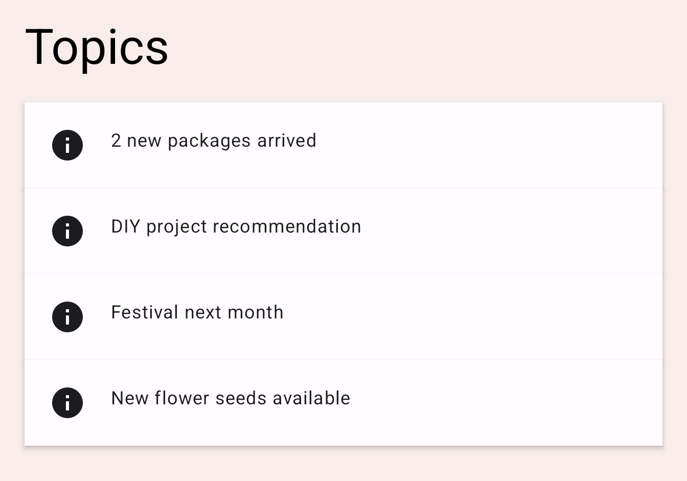 | 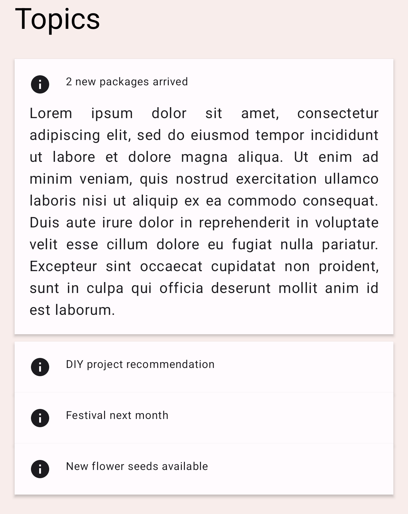 |

```kotlin
Column(
    modifier = Modifier
        .fillMaxWidth()
        .padding(16.dp)
        .animateContentSize()
) {
    // ... the title and the body
}
```

- 为多个值添加动画效果。Transition API  让我们能够在不同状态之间转换时定义不同的 transitionSpec。

```
屏幕宽度
├─────────────────────────────────────┤
│  [Home]    [Work]    [Weather]      │  ← 标签栏
│   ↑        ↑         ↑               │
│   left0    left1     left2           │
│         right0  right1    right2      │
│                                      │
│   └──────┘                           │  ← 指示器在 Home 下
│          └──────┘                     │  ← 指示器在 Work 下
│                 └──────┘              │  ← 指示器在 Weather 下
└─────────────────────────────────────┘
```

```kotlin
val transition = updateTransition(tabPage, label = "Tab indicator")
val indicatorLeft by transition.animateDp(label = "Indicator left") { page ->
   tabPositions[page.ordinal].left
}
val indicatorRight by transition.animateDp(label = "Indicator right") { page ->
   tabPositions[page.ordinal].right
}
val color by transition.animateColor(label = "Border color") { page ->
   if (page == TabPage.Home) PaleDogwood else Green
}
```

此时，点击标签页会更改 `tabPage` 状态的值，这时与 `transition` 关联的所有动画值会开始以动画方式切换至为目标状态指定的值。

可以让靠近目标页面的一边比另一边移动得更快来实现指示器的弹性效果。可以在 `transitionSpec` lambda 中使用 `isTransitioningTo` infix 函数来确定状态变化的方向。

```kotlin
val transition = updateTransition(
    tabPage,
    label = "Tab indicator"
)
val indicatorLeft by transition.animateDp(
    transitionSpec = {
        if (TabPage.Home isTransitioningTo TabPage.Work) {
            // Indicator moves to the right.
            // The left edge moves slower than the right edge.
            spring(stiffness = Spring.StiffnessVeryLow)
        } else {
            // Indicator moves to the left.
            // The left edge moves faster than the right edge.
            spring(stiffness = Spring.StiffnessMedium)
        }
    },
    label = "Indicator left"
) { page ->
    tabPositions[page.ordinal].left
}
val indicatorRight by transition.animateDp(
    transitionSpec = {
        if (TabPage.Home isTransitioningTo TabPage.Work) {
            // Indicator moves to the right
            // The right edge moves faster than the left edge.
            spring(stiffness = Spring.StiffnessMedium)
        } else {
            // Indicator moves to the left.
            // The right edge moves slower than the left edge.
            spring(stiffness = Spring.StiffnessVeryLow)
        }
    },
    label = "Indicator right"
) { page ->
    tabPositions[page.ordinal].right
}
val color by transition.animateColor(
    label = "Border color"
) { page ->
    if (page == TabPage.Home) PaleDogwood else Green
}
```

- 重复呈现动画效果

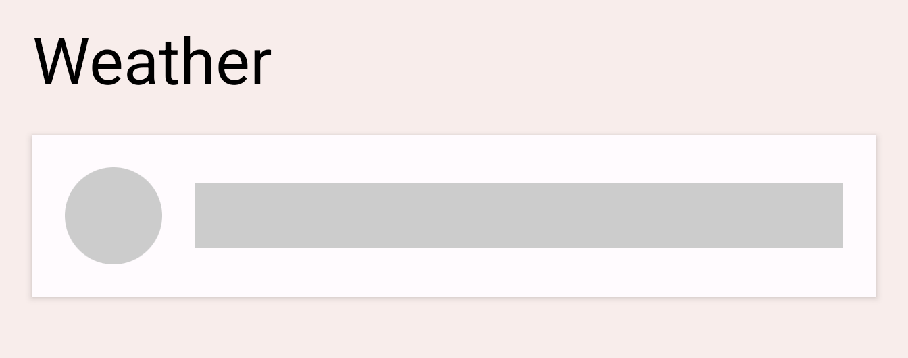

加载指示器，即一个灰色圆圈和一个条形。

之前的`Transition` 会根据状态变化为值添加动画效果，而这里的 `InfiniteTransition` 则无限期地为值添加动画效果。

```kotlin
val infiniteTransition = rememberInfiniteTransition()
val alpha by infiniteTransition.animateFloat(
    initialValue = 0f,
    targetValue = 1f,
    animationSpec = infiniteRepeatable(
        animation = keyframes {
            durationMillis = 1000
            0.7f at 500
        },
        repeatMode = RepeatMode.Reverse
    ),
    label = "alpha"
)
```

RepeatMode.Reverse 表示 1-0-1交替。

`keyFrames` 动画是另一种类型的 `animationSpec`（另外还有一些是 `tween` 和 `spring`），可允许在不同的毫秒数下更改播放中的值。

- 手势动画。例如滑动删除的手势。

构建 `swipeToDismiss` 修饰符，需要理解几个关键概念。用户将手指放在屏幕上会生成包含 x 和 y 坐标的触摸事件，随后用户将手指向右或向左移动，x 和 y 坐标也会随之移动。用户需要通过移动手指来移动所触摸的项，因此我们将根据触摸事件的位置和速度来更新项的位置。

使用 [Compose 手势文档](https://developer.android.com/jetpack/compose/gestures?hl=zh-cn)中所述的几个概念。使用 [`pointerInput`](https://developer.android.com/reference/kotlin/androidx/compose/ui/input/pointer/package-summary?hl=zh-cn#(androidx.compose.ui.Modifier).pointerInput(kotlin.Any,kotlin.coroutines.SuspendFunction1)) 修饰符，我们可以获取对传入指针触摸事件的低级别访问，并跟踪用户使用同一指针拖动的速度。如果用户在项越过忽略边界之前就放开手指，则项会退回到原有位置。

`Animatable` 是最低级别的 API。它具有多项适用于手势场景的功能，例如能够快速捕捉来自手势的新值，并在触发新的触摸事件时停止任何正在运行中的动画。

> [在 Jetpack Compose 中为元素添加动画效果  | Android Developers](https://developer.android.com/codelabs/jetpack-compose-animation?hl=zh-cn#7)

```kotlin
private fun Modifier.swipeToDismiss(
    onDismissed: () -> Unit
): Modifier = composed {
    // This Animatable stores the horizontal offset for the element.
    val offsetX = remember { Animatable(0f) }
    pointerInput(Unit) {
        // Used to calculate a settling position of a fling animation.
        val decay = splineBasedDecay<Float>(this)
        // Wrap in a coroutine scope to use suspend functions for touch events and animation.
        coroutineScope {
            while (true) {
                // Wait for a touch down event.
                val pointerId = awaitPointerEventScope { awaitFirstDown().id }
                // Interrupt any ongoing animation.
                offsetX.stop()
                // Prepare for drag events and record velocity of a fling.
                val velocityTracker = VelocityTracker()
                // Wait for drag events.
                awaitPointerEventScope {
                    horizontalDrag(pointerId) { change ->
                        // Record the position after offset
                        val horizontalDragOffset = offsetX.value + change.positionChange().x
                        launch {
                            // Overwrite the Animatable value while the element is dragged.
                            offsetX.snapTo(horizontalDragOffset)
                        }
                        // Record the velocity of the drag.
                        velocityTracker.addPosition(change.uptimeMillis, change.position)
                        // Consume the gesture event, not passed to external
                        change.consumePositionChange()
                    }
                }
                // Dragging finished. Calculate the velocity of the fling.
                val velocity = velocityTracker.calculateVelocity().x
                // Calculate where the element eventually settles after the fling animation.
                val targetOffsetX = decay.calculateTargetValue(offsetX.value, velocity)
                // The animation should end as soon as it reaches these bounds.
                offsetX.updateBounds(
                    lowerBound = -size.width.toFloat(),
                    upperBound = size.width.toFloat()
                )
                launch {
                    if (targetOffsetX.absoluteValue <= size.width) {
                        // Not enough velocity; Slide back to the default position.
                        offsetX.animateTo(targetValue = 0f, initialVelocity = velocity)
                    } else {
                        // Enough velocity to slide away the element to the edge.
                        offsetX.animateDecay(velocity, decay)
                        // The element was swiped away.
                        onDismissed()
                    }
                }
            }
        }
    }
        // Apply the horizontal offset to the element.
        .offset { IntOffset(offsetX.value.roundToInt(), 0) }
}
```

回顾：

一些高级别动画 API

- `animatedContentSize`
- `AnimatedVisibility`

一些较低级别的动画 API：

- `animate*AsState`，用于为单个值添加动画效果
- `updateTransition`，用于为多个值添加动画效果
- `infiniteTransition` 用于为多个值无限期地添加动画效果
- `Animatable`，用于结合触摸手势构建自定义动画效果

## Navigation codelab

> [Jetpack Compose Navigation  | Android Developers](https://developer.android.com/codelabs/jetpack-compose-navigation?hl=zh-cn#0)

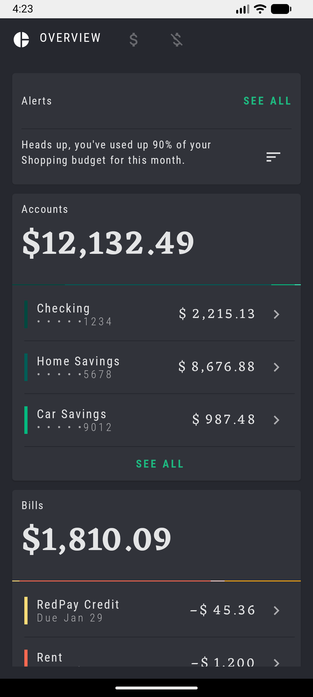

Learn how to use the Jetpack Navigation library in Compose, navigate within your application,
navigate with arguments, support deep-links, and test your navigation.

```bash
adb shell am start -d "rally://single_account/Checking" -a android.intent.action.VIEW
adb shell am start -d "rally://single_account/Vacation" -a android.intent.action.VIEW
```

注意，-d 的数据不支持空格，因此 "Home Savings"无法跳转。

在浏览器地址栏中输入rally://single_account/Vacation是无法跳转的，默认行为是打开网站。必须构造为Link让用户点击，才能支持INTENT跳转。

- 顶部Tab 实现
- App中不同route的跳转
- 外部隐式Intent跳转到App内


## [Performance codelab](https://developer.android.com/codelabs/jetpack-compose-performance)

- 不要在主线程上加载大图片。缓解方案：
  - 异步加载图片。
  - 缩小图片，以便加快加载速度。
  - 使用根据所需尺寸缩放的矢量可绘制对象
- 将繁重操作分流到后台线程。`scope.launch(Dispatchers.IO) {}`
- 移除不必要的子组合。不要盲目使用 `LazyRow` 实现，有时用 `Row` 更精准。


## [Testing codelab](https://developer.android.com/codelabs/jetpack-compose-testing)

Learn about testing Jetpack Compose UIs. Write your first tests, and learn about testing in isolation, debugging tests, the semantics tree, and test synchronization.

- 不合并语义树，进行节点查找和断言。

```bash
        |-Node #6 at (l=189.0, t=105.0, r=468.0, b=168.0)px
        | Role = 'Tab'
        | Selected = 'true'
        | StateDescription = 'Selected'
        | ContentDescription = 'Accounts'
        | Actions = [OnClick]
        | MergeDescendants = 'true'
        |  |-Node #9 at (l=284.0, t=105.0, r=468.0, b=154.0)px
        |    Text = 'ACCOUNTS'
        |    Actions = [GetTextLayoutResult]
```

```kotlin
    @Test
    fun rallyTopAppBarTest_currentLabelExists() {
        composeTestRule.setContent {
            RallyTopAppBar(
                allScreens = RallyScreen.entries,
                onTabSelected = { },
                currentScreen = RallyScreen.Accounts
            )
        }

        composeTestRule
            .onNode(
                hasText(RallyScreen.Accounts.name.uppercase()) and
                    hasParent(
                        hasContentDescription(RallyScreen.Accounts.name)
                    ),
                useUnmergedTree = true
            )
            .assertExists()
    }
```

上面的匹配器，用于查找一个文本为“ACCOUNTS”且父节点的内容说明为“Accounts”的节点。

可以和源代码进行比对。

```kotlin
    Row(
        modifier = Modifier
             ...
            .clearAndSetSemantics { contentDescription = text }
    ) {
        if (selected) {
            Text(text.uppercase(Locale.getDefault()), color = tabTintColor)
        }
    }
```

- **无限循环动画**是 Compose 测试可以理解的一种特殊情况，因此不会导致测试一直忙碌。

```kotlin
    val infiniteElevationAnimation = rememberInfiniteTransition()
    val animatedElevation: Dp by infiniteElevationAnimation.animateValue(
        initialValue = 1.dp,
        targetValue = 8.dp,
        typeConverter = Dp.VectorConverter,
        animationSpec = infiniteRepeatable(
            animation = tween(500),
            repeatMode = RepeatMode.Reverse
        )
    )
    Card(elevation = animatedElevation) {}
```

- 截图比对测试。这个测试在模拟器420dpi中没有通过，并且data/data目录下无法找到截图来分析。

```kotlin
@ExperimentalTestApi
@SdkSuppress(minSdkVersion = Build.VERSION_CODES.O)
class AnimatingCircleTests {

    @get:Rule
    val composeTestRule = createComposeRule()

    @Test
    fun circleAnimation_idle_screenshot() {
        composeTestRule.mainClock.autoAdvance = true
        showAnimatedCircle()
        assertScreenshotMatchesGolden("circle_done", composeTestRule.onRoot())
    }
}    
```

## [Accessibility codelab](https://developer.android.com/codelabs/jetpack-compose-accessibility)

改进无障碍功能：

- 触摸目标。
  - 48dp 的触摸目标区域。
- 视觉元素描述和状态描述。
  - [`Image`](https://developer.android.com/reference/kotlin/androidx/compose/foundation/package-summary?hl=zh-cn#Image(androidx.compose.ui.graphics.vector.ImageVector,kotlin.String,androidx.compose.ui.Modifier,androidx.compose.ui.Alignment,androidx.compose.ui.layout.ContentScale,kotlin.Float,androidx.compose.ui.graphics.ColorFilter)) 和 [`Icon`](https://developer.android.com/reference/androidx/wear/compose/material/IconKt?hl=zh-cn#Icon(androidx.compose.ui.graphics.vector.ImageVector,kotlin.String,androidx.compose.ui.Modifier,androidx.compose.ui.graphics.Color)) 等视觉可组合项包含一个 `contentDescription` 参数。可以在其中传递该视觉元素的**本地化**描述，如果该元素是纯装饰性的，则传递 `null`。
- 点击标签。`.semantics { onClick(label = readArticleLabel, action = null) },`
- 标题。

```kotlin
 ParagraphType.Header -> {
               Text(
                   modifier = Modifier.padding(4.dp)
                     .semantics { heading() },
                   text = annotatedString,
                   style = textStyle.merge(paragraphStyle)
               )
           }
```

- 自定义操作。

```kotlin
 .semantics {
                customActions = listOf(
                    CustomAccessibilityAction(
                        label = showFewerLabel,
                        // action returns boolean to indicate success
                        action = { openDialog = true; true }
                    )
                )
            }
```

- 添加自定义合并。

```kotlin
Row(Modifier.semantics(mergeDescendants = true) {}) {
       Image(
           // ...
       )
       Spacer(Modifier.width(8.dp))
       Column {
           Text(
               // ...
           )

           CompositionLocalProvider(LocalContentColor provides MaterialTheme.colorScheme.onSurfaceVariant) {
               Text(
                   // ..
               )
           }
       }
   }
```

- 以及如何使用切换开关和复选框。当 TalkBack 选定 `Switch` 和 `Checkbox` 等可切换元素时，会大声读出其选中状态。如果没有上下文，就很难理解这些可切换元素指的是什么。可以通过提升可切换状态来包含可切换元素的上下文，这样用户就可以通过按可组合项本身或描述它的标签来切换 `Switch` 或 `Checkbox`。

```kotlin
@Composable
private fun TopicItem(itemTitle: String, selected: Boolean, onToggle: () -> Unit) {
   // ...
   Row(
       modifier = Modifier
           .toggleable(
               value = selected,
               onValueChange = { _ -> onToggle() }, // <------------看这里
               role = Role.Checkbox
           )
           .padding(horizontal = 16.dp, vertical = 8.dp)
   ) {
       // ...
       Checkbox(
           checked = selected,
           onCheckedChange = null,
           modifier = Modifier.align(Alignment.CenterVertically)
       )
   }
}
```


## [Adaptive codelab](https://codelabs.developers.google.com/jetpack-compose-adaptability)

**gradle/libs.versions.toml**

```toml
[versions]
material3Adaptive = "1.0.0"

[libraries]
androidx-material3-adaptive = { module = "androidx.compose.material3.adaptive:adaptive", version.ref = "material3Adaptive" }
```
**app/build.gradle.kts**

```kts
dependencies {
    implementation(libs.androidx.material3.adaptive)
}
```

可以使用 [`currentWindowAdaptiveInfo()`](https://developer.android.com/reference/kotlin/androidx/compose/material3/adaptive/package-summary?hl=zh-cn#currentWindowAdaptiveInfo()) 获取 [`WindowAdaptiveInfo`](https://developer.android.com/reference/kotlin/androidx/compose/material3/adaptive/WindowAdaptiveInfo?hl=zh-cn) 对象，其中包含当前窗口大小类别和设备是否处于桌上模式等折叠状态等信息。

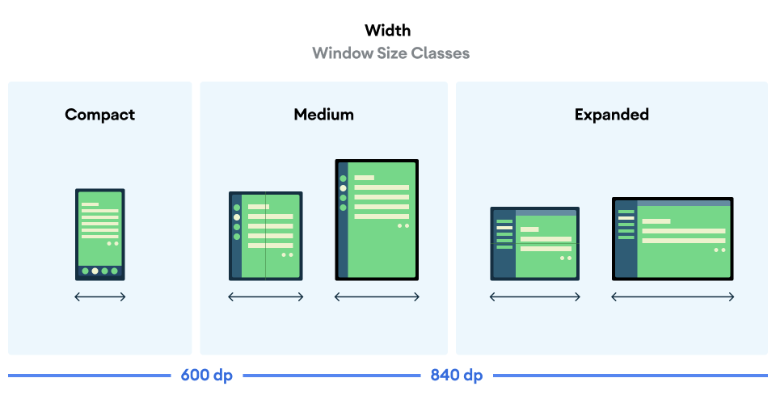

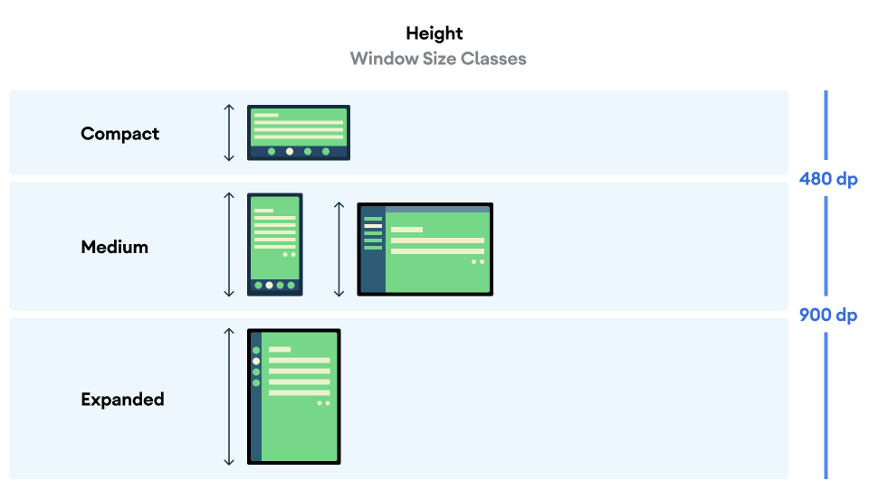

```kotlin
 val adaptiveInfo = currentWindowAdaptiveInfo()
            val sizeClassText =
                "${adaptiveInfo.windowSizeClass.windowWidthSizeClass}\n" +
                "${adaptiveInfo.windowSizeClass.windowHeightSizeClass}"
```

常见导航模式：

- 底部导航栏

  底部导航栏非常适合**较小**的设备。

- 侧边导航栏

  对于**中等**宽度的窗口大小，侧边导航栏非常适合单手操作，因为我们的拇指会自然而然地放在设备侧边。还可以将侧边导航栏与抽屉式导航栏搭配使用，以便显示更多信息。

- 抽屉式导航栏

  抽屉式导航栏允许您轻松查看导航标签页的详细信息，而且便于在您使用**平板电脑或更大的设备**时访问。可用的抽屉式导航栏有两种：模态抽屉式导航栏和永久性抽屉式导航栏。

| 模态抽屉式                                                   | 永久性抽屉式                                                 |
| ------------------------------------------------------------ | ------------------------------------------------------------ |
| 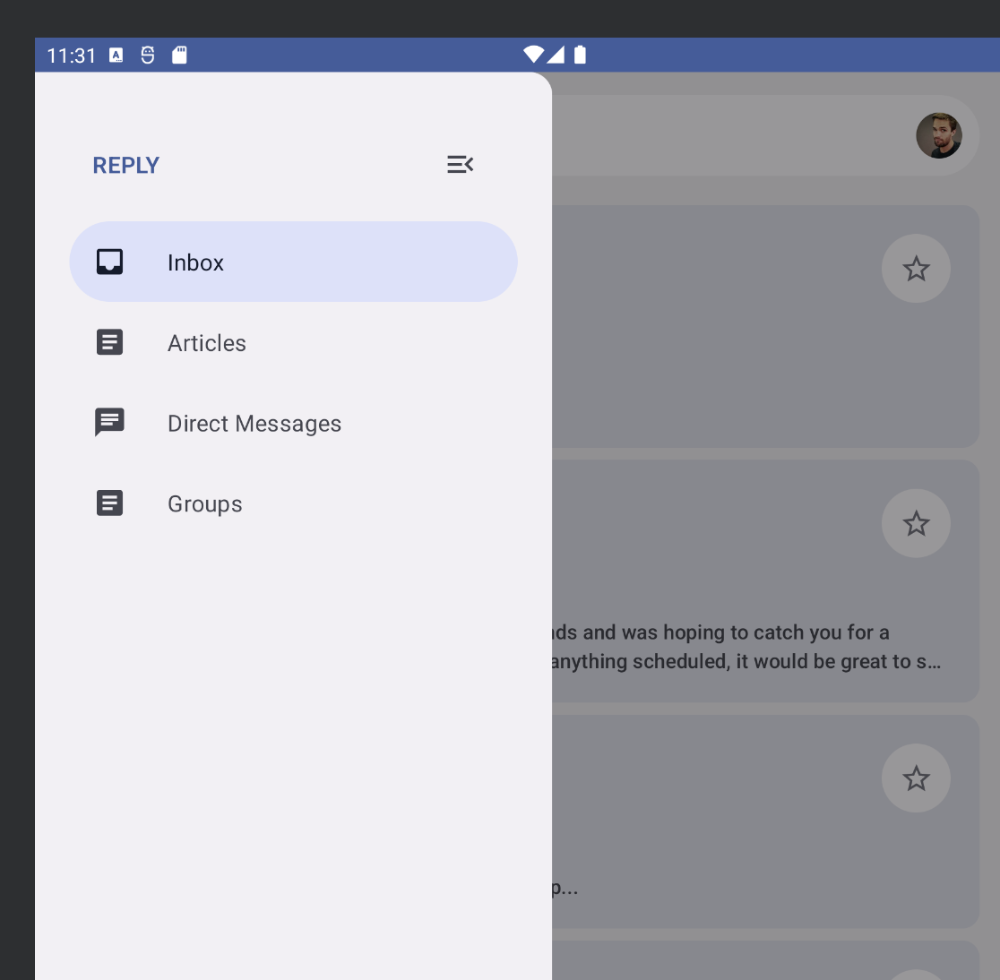 | 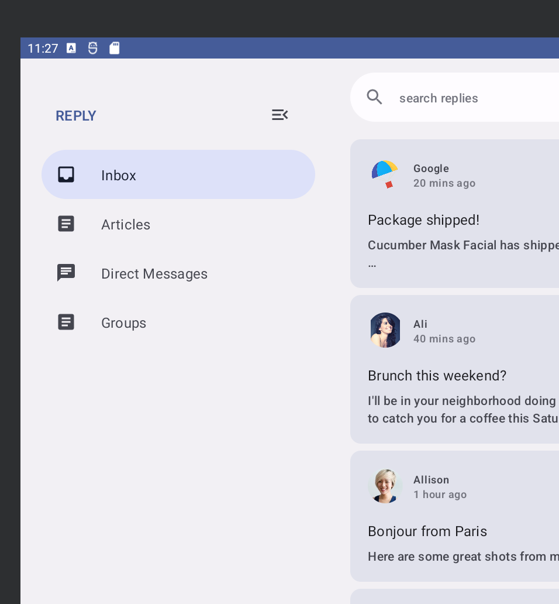 |

实现动态导航栏

**gradle/libs.versions.toml**

```toml
[versions]
material3AdaptiveNavSuite = "1.3.0"

[libraries]
androidx-material3-adaptive-navigation-suite = { module = "androidx.compose.material3:material3-adaptive-navigation-suite", version.ref = "material3AdaptiveNavSuite" }
```

**app/build.gradle.kts**

```kts
dependencies {
    implementation(libs.androidx.material3.adaptive.navigation.suite)
}
```

```kotlin
@Composable
private fun ReplyNavigationWrapperUI(
    content: @Composable () -> Unit = {}
) {
    var selectedDestination: ReplyDestination by remember {
        mutableStateOf(ReplyDestination.Inbox)
    }

    // replace Column with NavigationSuiteScaffold
    NavigationSuiteScaffold(
        navigationSuiteItems = {
            ReplyDestination.entries.forEach {
                item(
                    selected = it == selectedDestination,
                    onClick = { /*TODO update selection*/ },
                    icon = {
                        Icon(
                            imageVector = it.icon,
                            contentDescription = stringResource(it.labelRes)
                        )
                    },
                    label = {
                        Text(text = stringResource(it.labelRes))
                    },
                )
            }
        }
    ) {
        content()
    }
}
```

在非常宽的窗口中（例如在横屏模式下的平板电脑上），可能需要显示永久性抽屉式导航栏。`NavigationSuiteScaffold` 确实支持显示永久抽屉，但不会显示在任何当前 `WindowWidthSizeClass` 值中。不过，您只需稍作更改即可实现。

```kotlin
@Composable
private fun ReplyNavigationWrapperUI(
    content: @Composable () -> Unit = {}
) {
    var selectedDestination: ReplyDestination by remember {
        mutableStateOf(ReplyDestination.Inbox)
    }

    val windowSize = with(LocalDensity.current) {
        currentWindowSize().toSize().toDpSize()
    }
    val layoutType = if (windowSize.width >= 1200.dp) {
        NavigationSuiteType.NavigationDrawer
    } else {
        NavigationSuiteScaffoldDefaults.calculateFromAdaptiveInfo(
            currentWindowAdaptiveInfo()
        )
    }

    NavigationSuiteScaffold(
        layoutType = layoutType,
        ...
    ) {
        content()
    }
}
```

经典布局：列表页和详情页

**gradle/libs.versions.toml**

```toml
[libraries]
androidx-material3-adaptive-layout = { module = "androidx.compose.material3.adaptive:adaptive-layout", version.ref = "material3Adaptive" }
androidx-material3-adaptive-navigation = { module = "androidx.compose.material3.adaptive:adaptive-navigation", version.ref = "material3Adaptive" }
```

**app/build.gradle.kts**

```kts
dependencies {
    implementation(libs.androidx.material3.adaptive.layout)
    implementation(libs.androidx.material3.adaptive.navigation)
}
```

```kotlin
@OptIn(ExperimentalMaterial3AdaptiveApi::class)
@Composable
fun ReplyAppContent(
    replyHomeUIState: ReplyHomeUIState,
    onEmailClick: (Email) -> Unit,
) {
    val navigator = rememberListDetailPaneScaffoldNavigator<Long>()

    ListDetailPaneScaffold(
        directive = navigator.scaffoldDirective,
        value = navigator.scaffoldValue,
        listPane = {
            ReplyListPane(replyHomeUIState, onEmailClick)
        },
        detailPane = {
            ReplyDetailPane(replyHomeUIState.emails.first())
        }
    )
}
```

此代码首先使用 `rememberListDetailPaneNavigator()` 创建一个导航器。导航器可让您控制要显示哪个窗格以及该窗格中应显示的内容，具体方法将在后面介绍。

当窗口宽度大小类别处于“展开”状态时，`ListDetailPaneScaffold` 将显示两个窗格。否则，它将根据为两个参数（即框架指令和框架值）提供的值显示一个窗格或另一个窗格。为了获取默认行为，此代码使用了导航器提供的框架指令和框架值。

现在，当用户点按列表窗格中的电子邮件时，该电子邮件应随所有回复一起显示在详情窗格中。目前，该应用不会跟踪所选的电子邮件，点按某个项也不会产生任何效果。保存此类信息的最佳位置是在 `ReplyHomeUIState` 中的其余界面状态中。

**ReplyHomeViewModel.kt**

```kotlin
data class ReplyHomeUIState(
    val emails : List<Email> = emptyList(),
    val selectedEmail: Email? = null, // <----------
    val loading: Boolean = false,
    val error: String? = null
)
```

在同一个文件中，`ReplyHomeViewModel` 具有 `setSelectedEmail()` 函数，当用户点按列表项时，系统会调用该函数。修改此函数，以复制界面状态并记录所选电子邮件：

**ReplyHomeViewModel.kt**

```kotlin
fun setSelectedEmail(email: Email) {
    _uiState.update {
        it.copy(selectedEmail = email)
    }
}
```

在用户点按任何内容之前，以及所选电子邮件地址为 `null` 时，可以默认显示列表中的第一项。

**ReplyHomeViewModel.kt**

```kotlin
private fun observeEmails() {
    viewModelScope.launch {
        emailsRepository.getAllEmails()
            .catch { ex ->
                _uiState.value = ReplyHomeUIState(error = ex.message)
            }
            .collect { emails ->
                val currentSelection = _uiState.value.selectedEmail
                _uiState.value = ReplyHomeUIState(
                    emails = emails,
                    selectedEmail = currentSelection ?: emails.first()
                )
            }
    }
}
```

返回 **`ReplyApp.kt`**，然后使用所选电子邮件地址（如果有）填充详细信息窗格内容：

**ReplyApp.kt**

```kotlin
ListDetailPaneScaffold(
    // ...
    detailPane = {
        if (replyHomeUIState.selectedEmail != null) {
            ReplyDetailPane(replyHomeUIState.selectedEmail)
        }
    }
)
```

再次运行应用，将模拟器切换为平板电脑大小，然后您会看到点按列表项会更新详情窗格的内容。

这在两个窗格均可见时效果非常好，但当窗口仅有空间显示一个窗格时，当您点按某项时，看起来好像什么都没有发生。尝试将模拟器视图切换为手机或纵向折叠设备，您会发现即使点按某个项，也只会看到列表窗格。这是因为，即使所选电子邮件已更新，在这些配置中，`ListDetailPaneScaffold` 仍会将焦点保持在列表窗格上。

**ReplyApp.kt**

```kotlin
ListDetailPaneScaffold(
    // ...
    listPane = {
        ReplyListPane(
            replyHomeUIState = replyHomeUIState,
            onEmailClick = { email ->
                onEmailClick(email)
                navigator.navigateTo(ListDetailPaneScaffoldRole.Detail, email.id)
            }
        )
    },
    // ...
)
```

应用还需要处理用户从详情窗格中按下返回按钮时发生的情况，并且此行为会因只显示一个窗格还是两个窗格而有所不同。

**ReplyApp.kt**

```kotlin
ListDetailPaneScaffold(
    // ...
    listPane = {
        ReplyListPane(
            replyHomeUIState = replyHomeUIState,
            onEmailClick = { email ->
                onEmailClick(email)
                navigator.navigateTo(ListDetailPaneScaffoldRole.Detail, email.id)
            }
        )
    },
    // ...
)
```

此 lambda 使用之前创建的导航器在用户点击某个项时添加其他行为。它会调用传递给此函数的原始 lambda，然后还会调用 `navigator.navigateTo()` 以指定应显示哪个窗格。框架中的每个窗格都与一个角色相关联，详情窗格的角色为 `ListDetailPaneScaffoldRole.Detail`。在较小的窗口中，这会使应用看起来已导航到下一页。

应用还需要处理用户从详情窗格中按下返回按钮时发生的情况，并且此行为会因只显示一个窗格还是两个窗格而有所不同。

1. 添加以下代码，支持返回导航。

**ReplyApp.kt**

```kotlin
@OptIn(ExperimentalMaterial3AdaptiveApi::class)
@Composable
fun ReplyAppContent(
    replyHomeUIState: ReplyHomeUIState,
    onEmailClick: (Email) -> Unit,
) {
    val navigator = rememberListDetailPaneScaffoldNavigator<Long>()

    BackHandler(navigator.canNavigateBack()) {
        navigator.navigateBack()
    }

    ListDetailPaneScaffold(
        directive = navigator.scaffoldDirective,
        value = navigator.scaffoldValue,
        listPane = {
            AnimatedPane {
                ReplyListPane(
                    replyHomeUIState = replyHomeUIState,
                    onEmailClick = { email ->
                        onEmailClick(email)
                        navigator.navigateTo(ListDetailPaneScaffoldRole.Detail, email.id)
                    }
                )
            }
        },
        detailPane = {
            AnimatedPane {
                if (replyHomeUIState.selectedEmail != null) {
                    ReplyDetailPane(replyHomeUIState.selectedEmail)
                }
            }
        }
    )
}
```

此外，为了使窗格之间的转换更加流畅，每个窗格都封装在 `AnimatedPane()` 可组合项中。

现在，每当屏幕配置发生变化或您展开折叠设备时，导航和屏幕内容都会动态变化以响应设备状态变化。您还可以尝试点按列表窗格中的电子邮件，看看布局在不同屏幕上的行为方式（并排显示两个窗格或在两个窗格之间流畅显示动画效果）。

不管是什么尺寸或者设备折叠状态：

- 如果当前处于列表页和详情页都可见的状态，按下返回键，则退出应用。
- 如果当前仅显示详情页，按下返回键，则回到仅显示列表页。
- 如果当前仅显示列表页，按下返回键，则退出应用。


## AdvancedStateAndSideEffectsCodelab

- [界面状态生成](https://developer.android.google.cn/topic/architecture/ui-layer/state-production?hl=zh-cn)是指以下过程：应用访问数据层、应用业务规则（如果需要），以及公开要从界面取用的界面状态。
- 你希望每当有新项被发送到 `suggestedDestinations` 数据流时 `CraneHomeContent` 可组合项中的界面都会更新。可以使用 [`collectAsStateWithLifecycle()`](https://developer.android.google.cn/reference/kotlin/androidx/lifecycle/compose/package-summary?hl=zh-cn#(kotlinx.coroutines.flow.Flow).collectAsStateWithLifecycle(kotlin.Any,androidx.lifecycle.Lifecycle,androidx.lifecycle.Lifecycle.State,kotlin.coroutines.CoroutineContext)) 函数。`collectAsStateWithLifecycle()` 会以生命周期感知型方式从 `StateFlow` 收集值并通过 Compose 的 [State](https://developer.android.google.cn/reference/kotlin/androidx/compose/runtime/State?hl=zh-cn) API 表示最新值。这样会使读取该状态值的 Compose 代码在发出新项时重组。如需详细了解 `collectAsStateWithLifecycle()` API，请参阅[在 Jetpack Compose 中安全地使用流](https://medium.com/androiddevelopers/consuming-flows-safely-in-jetpack-compose-cde014d0d5a3)这篇博文。

> Compose 还为最热门的基于数据流的 Android 解决方案提供了 API：
> 
> - [`LiveData.observeAsState()`](https://developer.android.google.cn/reference/kotlin/androidx/compose/runtime/livedata/package-summary?hl=zh-cn#observeAsState(androidx.lifecycle.LiveData)) 包含在 `androidx.compose.runtime:runtime-livedata:$composeVersion` 工件中。
> - [`Observable.subscribeAsState()`](https://developer.android.google.cn/reference/kotlin/androidx/compose/runtime/rxjava2/package-summary?hl=zh-cn#subscribeAsState(io.reactivex.Observable,kotlin.Any)) 包含在 `androidx.compose.runtime:runtime-rxjava2:$composeVersion` 或 `androidx.compose.runtime:runtime-rxjava3:$composeVersion` 工件中。
> 如需了解详情，请参阅“状态”文档中的[其他受支持的状态类型](https://developer.android.google.cn/jetpack/compose/state?hl=zh-cn#use-other-types-of-state-in-jetpack-compose)页面。

- **Compose 中的附带效应是指发生在可组合函数作用域之外的应用状态的变化。**例如，当用户点按一个按钮时打开一个新屏幕，或者在应用未连接到互联网时显示一条消息。

```kotlin
// home/LandingScreen.kt file

import androidx.compose.runtime.LaunchedEffect
import kotlinx.coroutines.delay

@Composable
fun LandingScreen(onTimeout: () -> Unit, modifier: Modifier = Modifier) {
    Box(modifier = modifier.fillMaxSize(), contentAlignment = Alignment.Center) {
        // Start a side effect to load things in the background
        // and call onTimeout() when finished.
        // Passing onTimeout as a parameter to LaunchedEffect
        // is wrong! Don't do this. We'll improve this code in a sec.
        LaunchedEffect(onTimeout) {
            delay(SplashWaitTime) // Simulates loading things
            onTimeout()
        }
        Image(painterResource(id = R.drawable.ic_crane_drawer), contentDescription = null)
    }
}
```

某些附带效应 API（如 `LaunchedEffect`）将可变数量的键作为形参，用于在其中一个键发生更改时**重新开始**执行效应。我们不希望在此可组合函数的调用方传递不同的 `onTimeout` lambda 值时重启 `LaunchedEffect`。这会让 `delay` 再次启动。

如需在[此可组合项的生命周期](https://developer.android.google.cn/jetpack/compose/lifecycle?hl=zh-cn)内仅触发一次附带效应，请将常量用作键，例如 `LaunchedEffect(Unit) { ... }`。不过，现在又有一个问题：如果 `onTimeout` 在附带效应正在进行时发生变化，效应结束时不一定会调用最后一个 `onTimeout`。如需保证调用最后一个 `onTimeout`，请使用 [`rememberUpdatedState`](https://developer.android.google.cn/reference/kotlin/androidx/compose/runtime/package-summary?hl=zh-cn#rememberUpdatedState(kotlin.Any)) API 记住 `onTimeout`。此 API 会捕获并更新最新值：

```kotlin
// home/LandingScreen.kt file

import androidx.compose.runtime.getValue
import androidx.compose.runtime.rememberUpdatedState
import kotlinx.coroutines.delay

@Composable
fun LandingScreen(onTimeout: () -> Unit, modifier: Modifier = Modifier) {
    Box(modifier = modifier.fillMaxSize(), contentAlignment = Alignment.Center) {
        // This will always refer to the latest onTimeout function that
        // LandingScreen was recomposed with
        val currentOnTimeout by rememberUpdatedState(onTimeout)

        // Create an effect that matches the lifecycle of LandingScreen.
        // If LandingScreen recomposes or onTimeout changes, 
        // the delay shouldn't start again.
        LaunchedEffect(Unit) {
            delay(SplashWaitTime)
            currentOnTimeout()
        }

        Image(painterResource(id = R.drawable.ic_crane_drawer), contentDescription = null)
    }
}
```

- rememberCoroutineScope 的使用

```kotlin
// home/CraneHome.kt file

import androidx.compose.runtime.rememberCoroutineScope
import kotlinx.coroutines.launch

@Composable
fun CraneHome(
    onExploreItemClicked: OnExploreItemClicked,
    modifier: Modifier = Modifier,
) {
    val scaffoldState = rememberScaffoldState()
    Scaffold(
        scaffoldState = scaffoldState,
        modifier = Modifier.statusBarsPadding(),
        drawerContent = {
            CraneDrawer()
        }
    ) {
        val scope = rememberCoroutineScope()
        CraneHomeContent(
            modifier = modifier,
            onExploreItemClicked = onExploreItemClicked,
            openDrawer = {
                scope.launch { // <-------
                    scaffoldState.drawerState.open()
                }
            }
        )
    }
}
```

- 对于可以存储在 [`Bundle`](https://developer.android.google.cn/reference/android/os/Bundle?hl=zh-cn) 内的对象，`rememberSaveable` 可以做所有这些工作，而无需任何额外的操作。对于您在项目中创建的 `EditableUserInputState` 类，却并非如此。因此，您需要告知 `rememberSaveable` 如何使用 [`Saver`](https://developer.android.google.cn/reference/kotlin/androidx/compose/runtime/saveable/package-summary?hl=zh-cn#Saver(kotlin.Function2,kotlin.Function1)) 保存和恢复此类的实例。
- [**`snapshotFlow`**](https://developer.android.google.cn/reference/kotlin/androidx/compose/runtime/package-summary?hl=zh-cn#snapshotFlow(kotlin.Function0)) **API** 将 Compose [`State`](https://developer.android.google.cn/reference/kotlin/androidx/compose/runtime/State?hl=zh-cn) 对象转换为 [Flow](https://developer.android.google.cn/kotlin/flow?hl=zh-cn)。当在 `snapshotFlow` 内读取的状态发生变化时，Flow 会向收集器发出新值。
- `DisposableEffect` 适用于在键发生变化或可组合项退出组合后需要清理的附带效应。

```kotlin
// details/MapViewUtils.kt file

import androidx.compose.runtime.DisposableEffect
import androidx.compose.ui.platform.LocalLifecycleOwner

@Composable
fun rememberMapViewWithLifecycle(): MapView {
    val context = LocalContext.current
    val mapView = remember {
        MapView(context).apply {
            id = R.id.map
        }
    }

    val lifecycle = LocalLifecycleOwner.current.lifecycle
    DisposableEffect(key1 = lifecycle, key2 = mapView) {
        // Make MapView follow the current lifecycle
        val lifecycleObserver = getMapLifecycleObserver(mapView)
        lifecycle.addObserver(lifecycleObserver)
        onDispose {
            lifecycle.removeObserver(lifecycleObserver)
        }
    }

    return mapView
}
```

- `produceState` 可让您将非 Compose 状态转换为 Compose [状态](https://developer.android.google.cn/reference/kotlin/androidx/compose/runtime/State?hl=zh-cn)。它会启动一个作用域限定为组合的协程，该协程可使用 `value` 属性将值推送到返回的 `State`。与 `LaunchedEffect` 一样，`produceState` 也采用键来取消和重新开始计算。

```kotlin
@Composable
fun DetailsScreen(
    onErrorLoading: () -> Unit,
    modifier: Modifier = Modifier,
    viewModel: DetailsViewModel = viewModel()
) {
    val uiState by produceState(initialValue = DetailsUiState(isLoading = true)) {
        val cityDetailsResult = viewModel.cityDetails
        value = if (cityDetailsResult is Result.Success<ExploreModel>) {
            DetailsUiState(cityDetailsResult.data)
        } else {
            DetailsUiState(throwError = true)
        }
    }

    when {
        uiState.cityDetails != null -> {
            DetailsContent(uiState.cityDetails!!, modifier.fillMaxSize())
        }
        uiState.isLoading -> {
            Box(modifier.fillMaxSize()) {
                CircularProgressIndicator(
                    color = MaterialTheme.colors.onSurface,
                    modifier = Modifier.align(Alignment.Center)
                )
            }
        }
        else -> { onErrorLoading() }
    }
}
```

- 回到顶部按钮的实现与性能考虑

```kotlin
// DO NOT DO THIS - It's executed on every recomposition
val showButton = listState.firstVisibleItemIndex > 0
```

该解决方案的效率并不高，因为每当 `firstVisibleItemIndex` 发生变化时，读取 `showButton` 的可组合函数都会重组，这种情况经常会在滚动时发生。不过，您希望该函数仅在条件在 `true` 和 `false` 之间变化时重组。

当您想要的某个 Compose `State` 衍生自另一个 `State` 时，请使用 `derivedStateOf`。每当内部状态发生变化时，系统都会执行 `derivedStateOf` 计算块，但只有当计算结果与上一项不同时，可组合函数才会重组。这样可以最大限度地减少读取 `showButton` 的函数的重组次数。

```kotlin
// Show the button if the first visible item is past
// the first item. We use a remembered derived state to
// minimize unnecessary recompositions
val showButton by remember {
    derivedStateOf {
        listState.firstVisibleItemIndex > 0
    }
}
```

---

您学习了如何创建状态容器、附带效应 API（如 [`LaunchedEffect`](https://developer.android.google.cn/reference/kotlin/androidx/compose/runtime/package-summary?hl=zh-cn#LaunchedEffect(kotlin.Any,kotlin.coroutines.SuspendFunction1))、[`rememberUpdatedState`](https://developer.android.google.cn/reference/kotlin/androidx/compose/runtime/package-summary?hl=zh-cn#rememberUpdatedState(kotlin.Any))、[`DisposableEffect`](https://developer.android.google.cn/reference/kotlin/androidx/compose/runtime/package-summary?hl=zh-cn#DisposableEffect(kotlin.Any,kotlin.Function1))、[`produceState`](https://developer.android.google.cn/reference/kotlin/androidx/compose/runtime/package-summary?hl=zh-cn#produceState(kotlin.Any,kotlin.coroutines.SuspendFunction1)) 和 [`derivedStateOf`](https://developer.android.google.cn/reference/kotlin/androidx/compose/runtime/package-summary?hl=zh-cn#derivedStateOf(kotlin.Function0))），以及如何在 Jetpack Compose 中使用协程。

