# Continuous Deployment 读书笔记

> https://book.douban.com/subject/37135278/

扩展和收缩模式

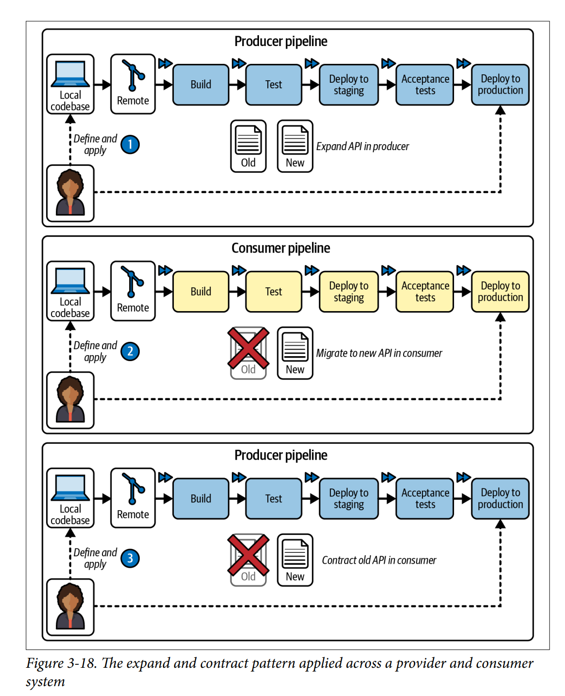


特性标志VS扩展和收缩

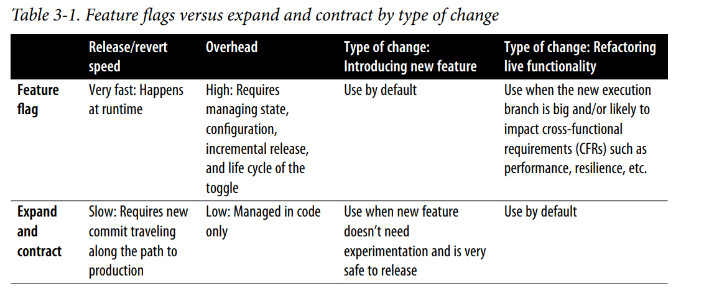

重复的返工和持久部署的关系

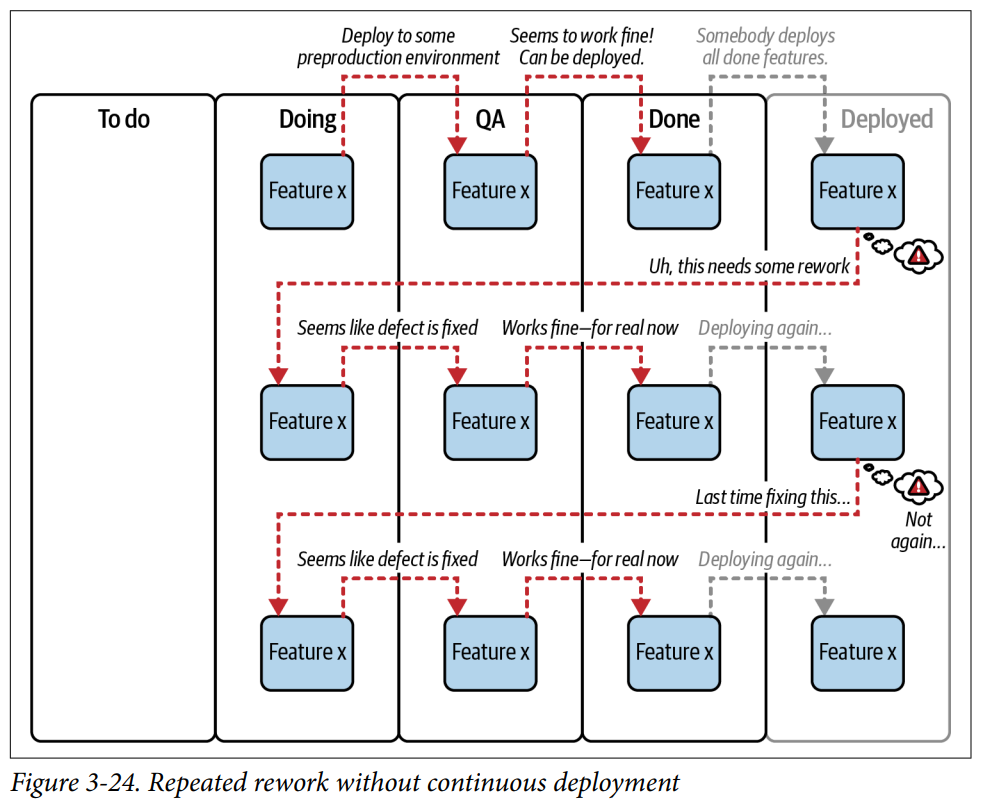

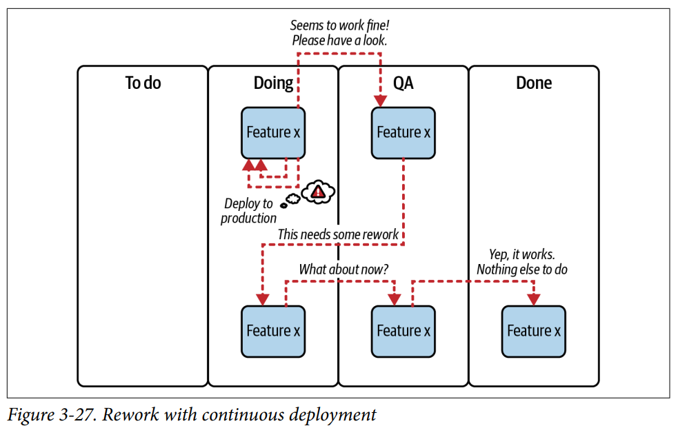

1 停机部署
2 蓝绿部署 A/B 切换
3 滚动部署 k8s pod
2和3都有 N – 1 兼容性问题

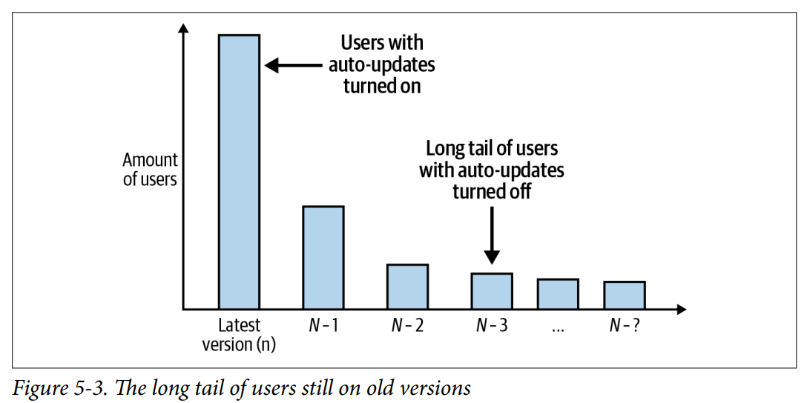

部署过程应完全自动化，用户-facing的A/B测试流程应被功能标志（feature flags）所替代。

会话粘性（或会话持久性）是指应用程序负载均衡器在客户端首次请求时记录分配给该客户端的具体实例的过程。
这种机制有时会在用户会话（假定为短暂存在）的状态被存储在应用程序中时使用，这种情况使得与同一实例交互对用户流程的正确运行至关重要。
就像长时间运行的任务一样，任何依赖内存状态的应用在持续的部署流中都会变得不可靠。
缓解措施：将状态存储在外部。再次强调，解决状态问题和频繁部署的主要缓解措施是将状态存储在外部。

保持应用启动时间短 通过降低应用启动时间，可以减轻部署对自动扩展的影响，从而将创建新实例所花费的时间降至最低（无论是扩容还是实例替换场景）。

一些移动应用开发者试图通过在用户界面中引入障碍来解决这个问题，当检测到版本过旧，或后端返回特定的“强制更新”标志时，就会迫使用户更新。像WhatsApp和Messenger这样的应用甚至采用了滚动窗口的强制升级机制。
缓解措施：将控件移至服务器端 为实现移动应用的持续部署，唯一的解决方案是将部分客户端代码移回服务器端，而服务器端处于开发人员的控制之下。这可以通过多种方式实现。


## 为生产环境所构建

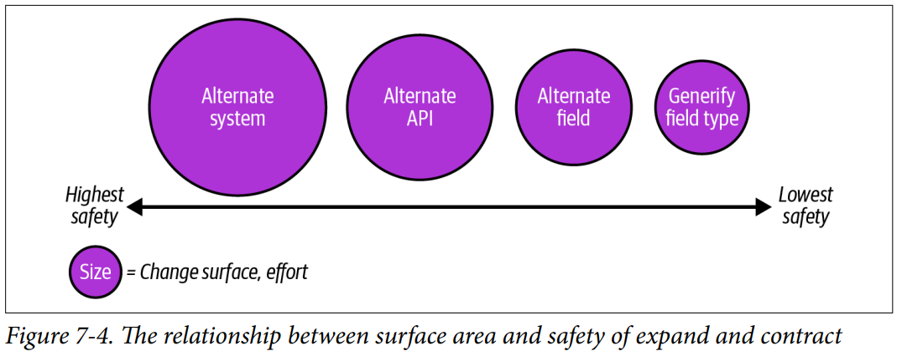

- 替换的系统
- 替代的API
- 替代的字段
- 泛用的字段类型


发布应属于产品范畴，而部署应属于工程范畴。


## 从最内层系统逐步向最外层系统推进

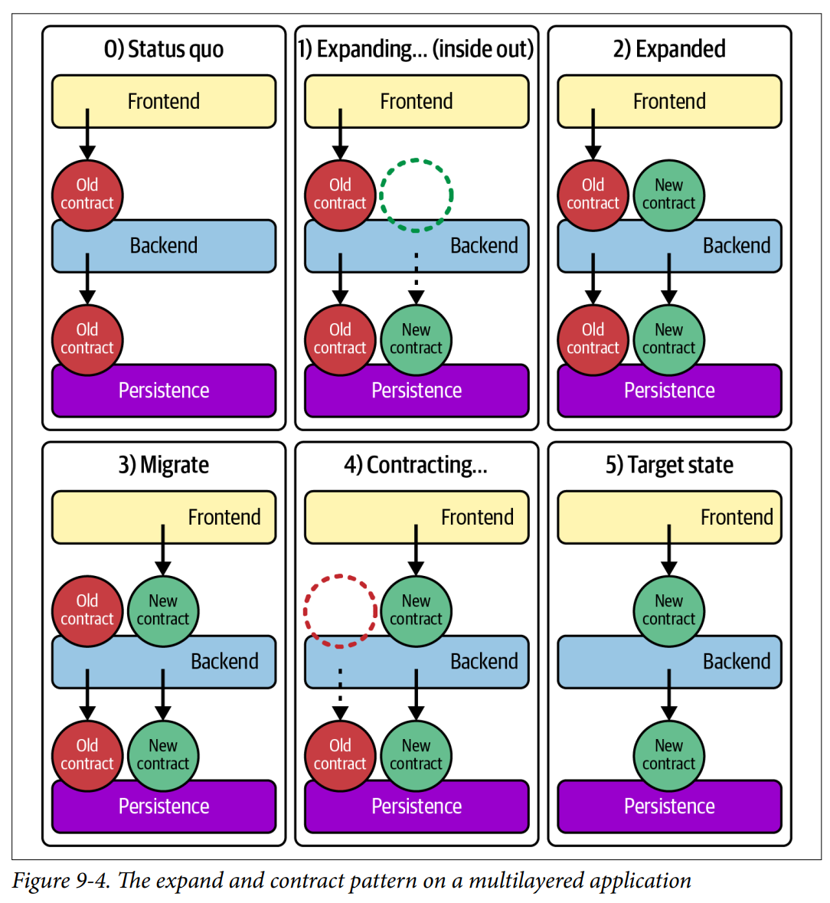

首先，为了扩展，我们需要在数据库层添加新的UUID字段（步骤1）。然后，在后端，原先支持旧ID的操作必须扩展以同时接受新的ID（步骤2）。我们遵循依赖顺序，因此所有这些都可以作为独立的、向后兼容的部署发送到生产环境。

一旦完成这项工作，我们就可以将前端（我们的最外层消费者）迁移到新构建的代码路径中，使旧代码不再使用（步骤3）。最后，我们可以继续在所有层级中移除旧代码（步骤4），从而达到我们期望的目标状态（步骤5）。

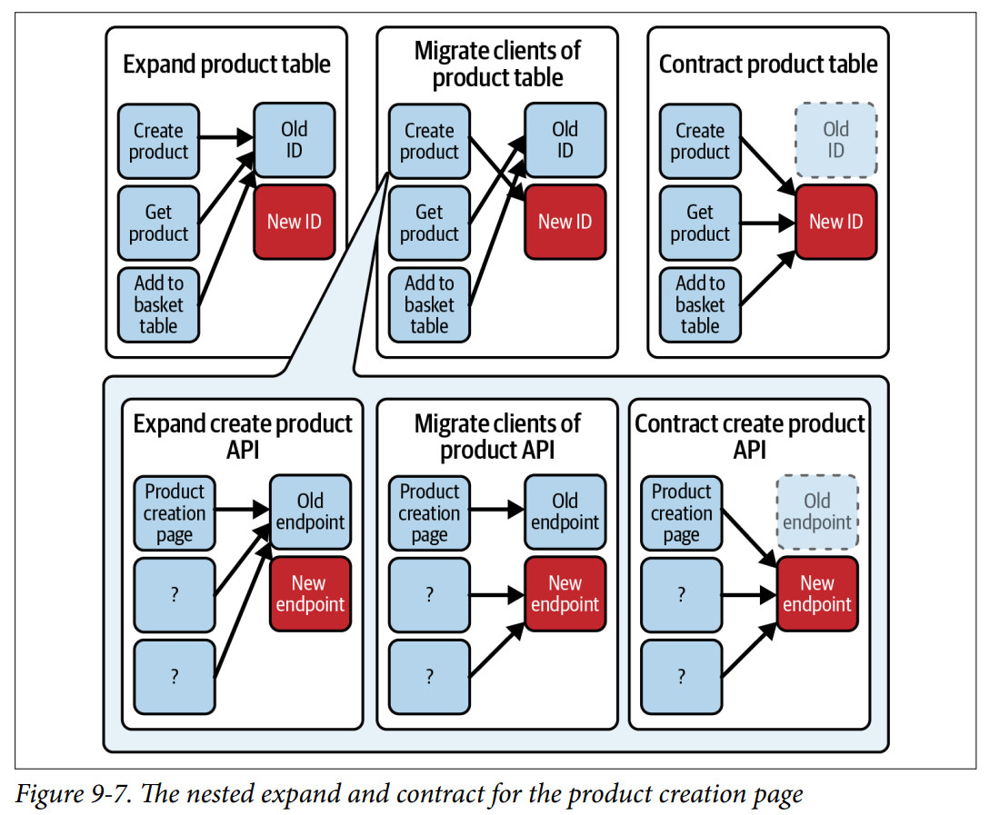

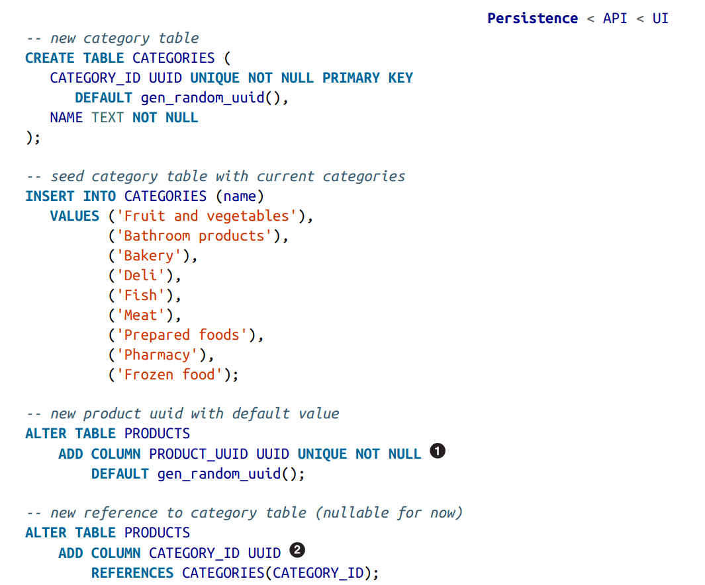

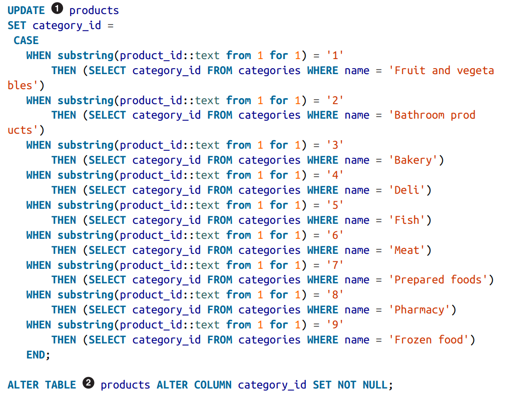

The key to backward-compatible, refactoring-type changes is the expand and con‐ tract pattern, which consists of three phases: duplicating the pathway into the func‐ tionality of the provider, migrating the consumer so that it uses the alternative path, and cleaning up the unused old code.


## 数据表某一列的部署

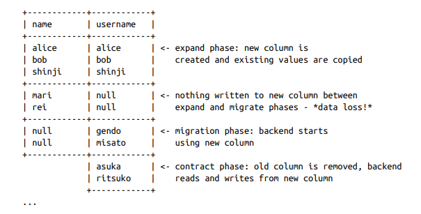


### 解决方案：数据库触发器（不推荐）

我们可以通过将迁移阶段的后端代码与扩展阶段的数据库代码一起部署来避免这个问题，但这只是让我们回到了之前的情况：即“同时”变更，其中我们仍然会引入一个短暂的数据丢失窗口。

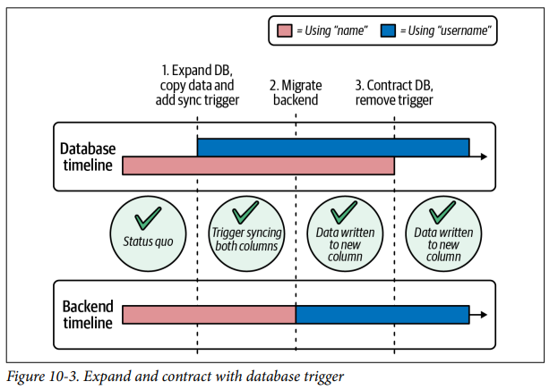

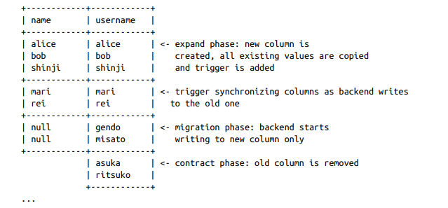

- 第一行：旧列数据复制到新列，可以通过后端脚本来迁移。
- 第二行：旧客户端写旧列时，数据库端复制值到新列。
- 第三行：新客户端只写新列，不再写旧列。
- 第四行：旧列被安全地删除。

### 解决方案：双写

Step 1: Expand the database column We can begin with a first deployment on the database layer, which duplicates the col‐ umn. All values in the new column are NULL at this point, and both writes and reads are still targeting the old column.

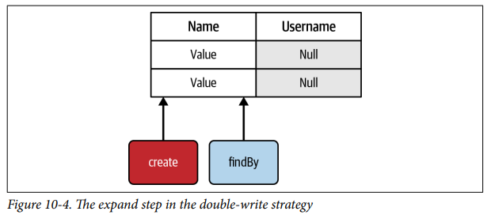

Step 2: Double-write to both columns Next, we can deploy code on the backend that will write to both columns. New values in username will start getting populated, but old values will remain NULL for now. Any update operations should also reflect on both columns but be tolerant of existing NULLs in the new column.

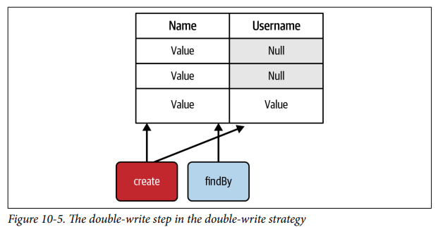

Step 3: Synchronize the data Now that new data is being written, we can also migrate previous entries. By deploy‐ ing a new database evolution, we can synchronize all existing values. This means the new table should not contain any more NULLs (past or future), so we can put stron‐ ger constraints on it in the same database evolution.

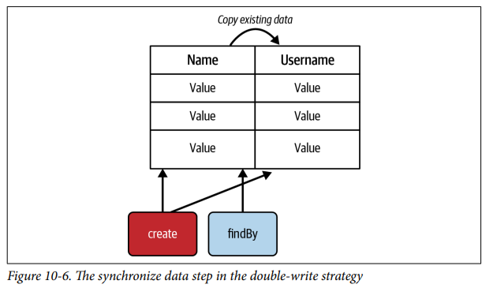

Step 4: Migrate write and read the columns The new column is kept up-to-date (and is a reliable source of truth for past data as well), so we can start relying on it for both reads and writes. We can start reading from it and stop writing to the old column. As a consequence, the old column will start getting filled with NULLs

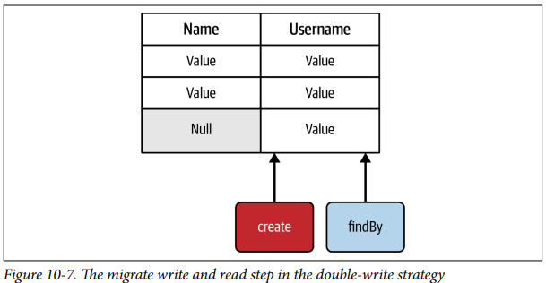

Step 5: Contract the columns Finally, we can remove the old column, which is unused

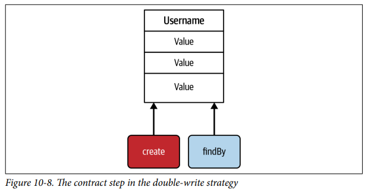

它本质上是将数据库触发器的更新逻辑替换为应用程序代码，这使得代码更易于测试和可观测。

### 解决方案：双读

我们可以在迁移过程中确保后端同时从两个列中读取数据，实际上将旧列作为后备使用。通过这种方式，我们可以在同步所有现有数据之前容忍新列中的空值。

Step 1: Expand the database column Just like before, the expand phase duplicates the column with a database evolution. The new column will be populated with NULLs. We should also prepare the old name column so that we can stop writing to it, removing any NOT NULL or other constraints

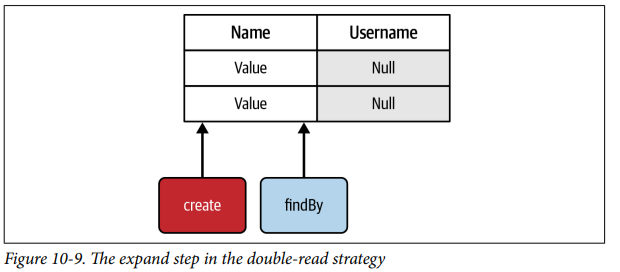

Step 2: Double-read and migrate write to both columns Next, we can implement a double-read mechanism: existing read operations must use either the new column or the old column interchangeably, keeping the value of whichever is not NULL (Figure 10-10). This allows us to also make the backend start writing to the new column, even in the same deployment. After this change, any value will be in either the new column (new data) or the old column (past data).

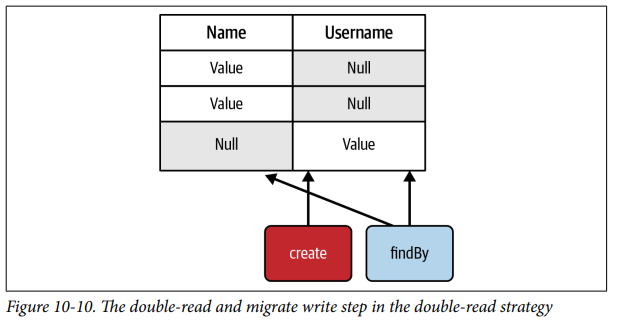

本质是写新值（create）时，写到新列。但是，读值时（findBy)，从新列读，如果新列没有值，就从旧列读。

Step 3: Synchronize the data Now that the new column is the recipient of all new data, we can add a data synchro‐ nization step: a database evolution that will copy all past values to the new column. This evolution should not copy any NULLs from the old to the new, of course. With this change, the new column should not have any more NULLs (past or future), so we can add a NOT NULL constraint to it if necessary 

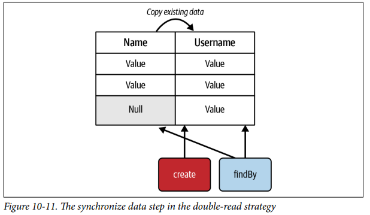

Step 4: Migrate the read With the new column containing all data, the double-read mechanism has become obsolete. We can migrate the read operations to only rely on username

关键时间节点：当新列都含有值，且不为NULL时，说明如今新列已承载了所有旧列的数据。

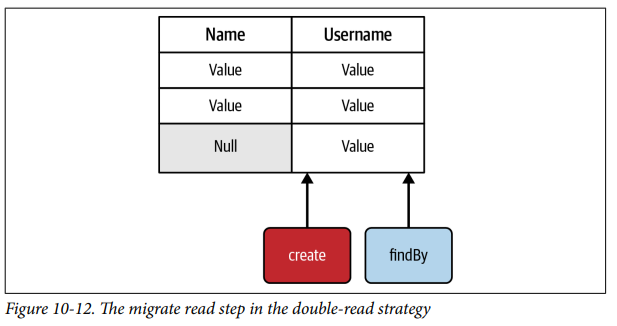

Step 5: Contract the old column Now that the old column is unused, we can once again contract it

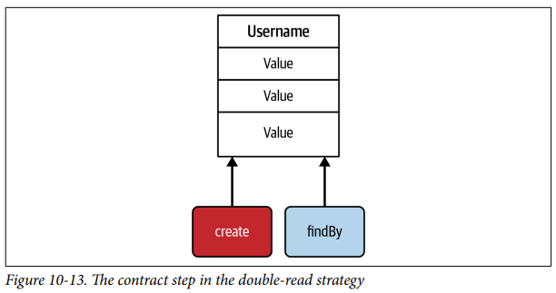

这个过程与上一个过程类似，依赖后端在一段时间内同时支持列的两个版本。主要区别在于，重复的逻辑影响的是读操作，而不是写操作。这两个都是传统“展开和收缩”模式的扩展。

### 实现双写功能

```sql
ALTER TABLE USERS ADD COLUMN USERNAME TEXT;
ALTER TABLE USERS ALTER COLUMN NAME DROP NOT NULL;
```

```java
public User create(CreateUserPayload payload) {
 String insert = "INSERT INTO USERS(NAME, USERNAME) VALUES (?,?) RETURNING *";
 return jdbcTemplate.queryForObject(insert, new UserMapper(), payload.name(),
payload.name());
}

public User findBy(UUID id) {
 String query = "SELECT NAME, USER_ID FROM USERS WHERE USER_ID = ?";
 return jdbcTemplate.queryForObject(query, new UserMapper(), id);
}
```

然而，所有之前的值仍然是 NULL，我们会将在下次部署中修复这个问题。

迁移旧列到新列

```sql
UPDATE USERS SET USERNAME = NAME WHERE USERNAME IS NULL;
ALTER TABLE USERS ALTER COLUMN USERNAME SET NOT NULL;
```

现在两个列都已经写入了最新数据，我们可以安全地将读取和写入都切换到新的列中。

```java
public User create(CreateUserPayload payload) {
 String insert = "INSERT INTO USERS(USERNAME) VALUES (?) RETURNING *";
 return jdbcTemplate.queryForObject(insert, new UserMapper(), payload.name());
}
public User findBy(UUID id) {
 String query = "SELECT USERNAME , USER_ID FROM USERS WHERE USER_ID = ?";
 return jdbcTemplate.queryForObject(query, new UserMapper(), id);
}
```

由于我们仅向新的用户名列写入数据，旧的名称列将开始接收 NULL 值，如下代码所示。这不会抛出异常，因为我们已经在扩展阶段删除了 NOT NULL 约束。

此时，我们可以安全地认为旧的名称列已过时。所有历史数据已迁移到新列，新数据也直接添加到该列中。旧列不再使用，随着时间推移将填充大量空值。这意味着我们可以进入合同阶段。

```sql
ALTER TABLE USERS DROP COLUMN NAME;
```

### 实施双读策略

```sql
ALTER TABLE USERS ADD COLUMN USERNAME TEXT;
ALTER TABLE USERS ALTER COLUMN NAME DROP NOT NULL;
```

接着，我们想要执行写迁移和双读阶段。可以让后端将数据写入 username 列，但在读取时尝试从两个来源读取（优先读取 username）。以下是实现该功能的仓库代码：

````java
public User create(CreateUserPayload payload) {
 String insert = "INSERT INTO USERS(USERNAME) VALUES (?) RETURNING *";
 return jdbcTemplate.queryForObject(insert, new UserMapper(), pay
load.name());
 }

 public User findBy(UUID id) {
 String query = "SELECT COALESCE(USERNAME, NAME) AS NAME , USER_ID FROM
USERS WHERE USER_ID = ?";
 return jdbcTemplate.queryForObject(query, new UserMapper(), id);
 }
````

虽然所有历史数据都存在于旧列中，所有新数据都存在于新用户名列中。其中任一列会为 NULL，但绝不会两者都为 NULL。

可以同步旧数据

```sql
UPDATE USERS SET USERNAME = NAME WHERE USERNAME IS NULL;
ALTER TABLE USERS ALTER COLUMN USERNAME SET NOT NULL;
```

现在新列是自包含的，我们可以完全依赖它进行读取，这意味着我们可以从我们的仓库中移除降级逻辑:

```java
public User create(CreateUserPayload payload) {
 String insert = "INSERT INTO USERS(USERNAME) VALUES (?) RETURNING *";
 return jdbcTemplate.queryForObject(insert, new UserMapper(), pay
load.name());
 }

 public User findBy(UUID id) {
 String query = "SELECT USERNAME, USER_ID FROM USERS WHERE USER_ID = ?";
 return jdbcTemplate.queryForObject(query, new UserMapper(), id);
 }
```

我们可以再次缩小数据库模式，删除未使用的列：

```sql
ALTER TABLE USERS DROP COLUMN NAME;
```

即使你使用的是 MongoDB、Redis、DynamoDB 或仅仅是普通的文件，这里介绍的技术仍然适用。然而，执行这些技术可能会比我们用简单 SQL 举例时稍微复杂一些。这是因为，虽然可以在代码中实现双写或双读，但大多数非关系型数据库并不提供批量更新或模式演进工具。与使用关系型数据库不同，我们无法运行一条 UPDATE TABLE 语句并立即将 MongoDB 集合中的所有文档进行迁移。

当然，这留下了如何同步旧数据的问题，特别是当我们有很多记录很少被客户端更新时。这里我们有两个选择：

- 我们可以简单地保持向后兼容性，直到所有旧数据最终被重写（或消失），
- 或者我们可以实现一个后台任务，为集合中的所有记录执行迁移。

### 小结

首先，我们学习了一些无效的策略：同时更改演化和后端，以及应用传统的“扩展和收缩”模式。然后，我们探讨了哪些策略是有效的：数据库触发器，以及在消费者端和提供者端都支持多版本的模式。特别是后者，可以通过两种技术来增强“扩展和收缩”：对持久化层进行双写或双读。


生产环境的探索性测试至少应作为我们早已习惯的预生产测试的补充——如果这些测试足够好，团队甚至可能会选择仅在生产环境中进行测试。

在理论和实践中，生产环境都是最可靠的方式，可以自信地测试生产条件。在理论上，即使是最精心维护的预发布环境，其配置、数据、流量和软件在复现生产环境方面也存在局限性。


## 生产环境中的测试

### 查询参数

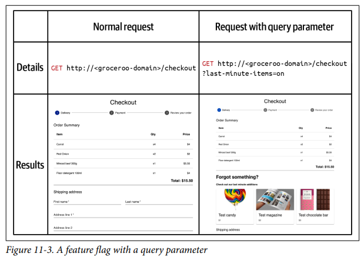

### 请求头自定义

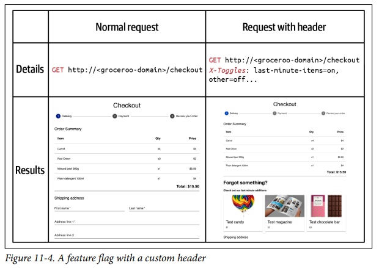

该策略在服务器端渲染的应用程序以及纯HTTP API中效果非常好。然而，它在静态网站和/或仅在客户端渲染的应用程序中难以评估。这些网站的文件通常以静态方式提供服务，因此很难添加能够解释请求头的逻辑。

### 利用cookies

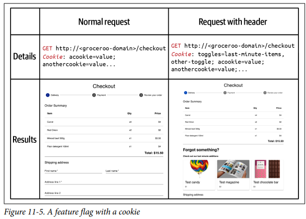

cookie的优势是，它们完全由浏览器管理。因此，我可以在开发工具标签页中轻松设置它们，且它们已经具有域特定性。我们无需额外的浏览器扩展（以及调整域名）来实现请求头策略。

建议避免使用 Cookie 的场景是纯 HTTP API。Cookie 是与浏览器相关的概念，如果我们不预期应用程序会从浏览器调用，那么读取 Cookie 可能会显得不合逻辑。

由于它们有“持续存在”多个请求的倾向，因此，如果必须确保 toggle=on 值仅在单个请求的粒度上发送，我并不推荐使用 cookies。反复设置和清除 cookies 会变得重复且令人厌烦。

### 小结

预生产基础设施可以保持在自动化测试所需的基本最低水平，以便验证基础设施和集成变更。例如，这可以包括启动应用程序及其所需的直接周边基础设施，但不必尝试将预发布环境连接到每个第三方服务，也不必使其规模与生产环境相同，或填充“类似生产”的数据。预发布环境不需要是一个过度工程化的庞然大物，需要与任何事物都进行集成。

不管在预生产环境中投入多少资源，都无法准确复制生产环境的条件。这使得生产环境测试比预生产环境测试更可取。在最终环境中进行手动探索性测试可以增强我们的信心、成本更低，并且能更好地保护用户数据。


## 发布

### 反模式：大规模一次性发布

/

### 反模式：通过部分部署实现部分发布

将带有新功能的应用程序版本 *N* + 1 部署到部分实例上，并将用户行为与未包含该功能的版本 *N* 的实例进行对比。一旦该功能得到验证，版本 *N* + 1 就会推广至生产环境的100%实例。

### 使用特性标志进行发布

/

### 反模式：每个服务独立的标志状态

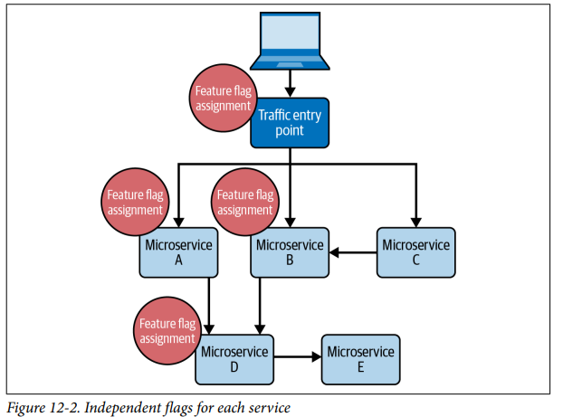

每个应用可以独立持有相同的切换开关，这在技术上是最简单的解决方案，且需要各团队之间的协调最少。

然而，这种高团队独立性带来的债务将在需要发布跨越多个系统的功能时才被偿还。此时，需要进行大规模的协调工作，以确保所有系统中的标志状态（开或关）能够同时变化。

然而，这种高团队独立性带来的债务将在需要发布跨越多个系统的功能时才被偿还。此时，需要进行大规模的协调工作，以确保所有系统中的标志状态（开或关）能够同时变化。

### Propagating Flag State Down the Call Chain

标志状态仅由一个系统持有，通常是最接近用户的系统。一旦用户被分配到测试组或对照组，该信息将通过所有下游系统在后续请求中进行传播。

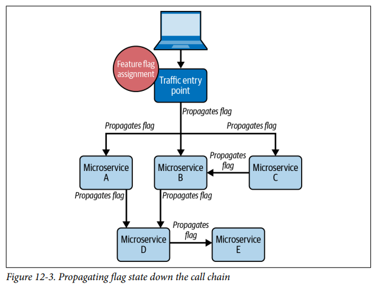

当团队想要更改标志值时，必须在流量入口点系统中进行修改，因此团队需要了解该系统的工作方式。

### 集中式功能标志状态

一个集中式的特性标志服务，可为所有服务持有标志状态，并且任何感兴趣的系统都可以独立查询该标志的状态。

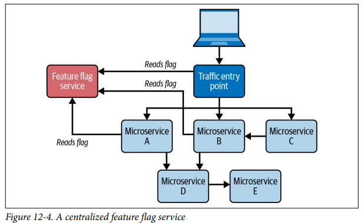


### 金丝雀发布

- 按流量百分比

  例如，如果初始发布百分比设置为5%，则只有5%的用户会体验到新功能，而其余95%的用户将继续使用稳定版本。

- 按设备

  设备级灰度发布涉及逐步将新功能推送到特定设备类型或平台，例如桌面端、移动网页、iOS 或 Android。该策略允许我们在向全体用户发布之前，评估这些变更在不同设备上的影响。

  每台设备独立控制的开关在每个前端应用都有其独立控制的开关的情况下，这种策略非常简单，但意味着会在不同的代码库中重复出现相同的开关代码，因此在发布和清理过程中需要更多的协调工作。

  后端控制的开关另一方面，实现要复杂一些：所有设备在决定是否展示功能之前，都需要向后端发起调用以获取开关的状态（这也会带来性能损耗）。后端则需要为每次调用评估该开关应处于开启（ON）还是关闭（OFF）状态。它可以通过考虑设备类型（例如，通过解析用户代理头，或通过应用程序自身发送的其他自定义标识信息）来完成这一评估。这种策略虽然需要前期更多的工程投入，但后期能实现对发布流程的集中控制，并简化清理阶段。

- 按用户群体人

  可以针对由订阅等级定义的特定用户群体，如免费用户、基础计划用户和高级计划用户。

### A/B测试

它通过随机将用户分配到控制组（A），该组体验现有软件版本，或实验组（B），该组使用新版本。

可观测性工具收集日志、指标和追踪数据，以深入了解系统的内部运作和行为。而分析工具则更侧重于系统对外的行为，即用户实际体验到的内容，这更符合产品实验的主要目的。

拆分或重定向测试是一种特殊的A/B测试，其中用户不会在不同版本之间体验页面部分的变更，而是被引导至完全不同的流程。我们可以通过修改用户流程的入口点（例如按钮中的链接）或添加HTTP重定向来实现这一点。

---

你可能会疑惑A/B测试和金丝雀发布之间有什么区别。毕竟，两者都会将新功能暴露给部分用户，以获取早期反馈。它们的实现方式也非常相似，特别是如果我们比较金丝雀发布和A/B测试的流量百分比策略的话。

它们之间的关键区别在于实践的意图：即降低风险的发布（金丝雀发布）与产品实验（A/B测试）。简而言之，金丝雀发布旨在告诉你发布中是否存在意外问题。而A/B测试则旨在告诉你关于用户行为的假设是否正确。

背后的原理是数据驱动决策。

Unit tests are of the smallest form, testing single functions, classes, or frontend com‐ ponents. Integration tests encompass logic within a single domain, such as creating a user and verifying the data exists using an in-memory representation of our database or writing a comment and testing that the frontend application state has been upda‐ ted. End-to-end tests are service endpoint tests from the perspective of other services communicating with that service. Acceptance tests are browser tests that test the product from a user’s perspective.

12因子App：https://www.12factor.net/zh_cn/