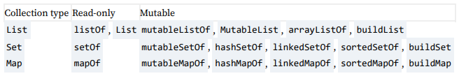
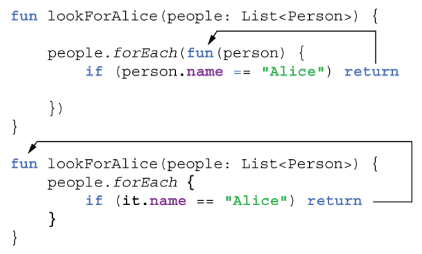
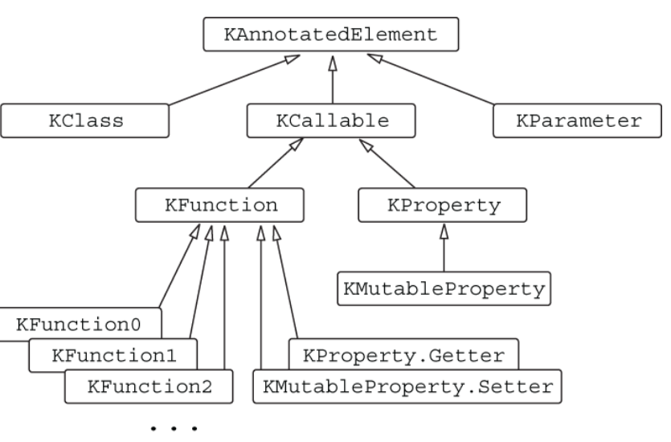
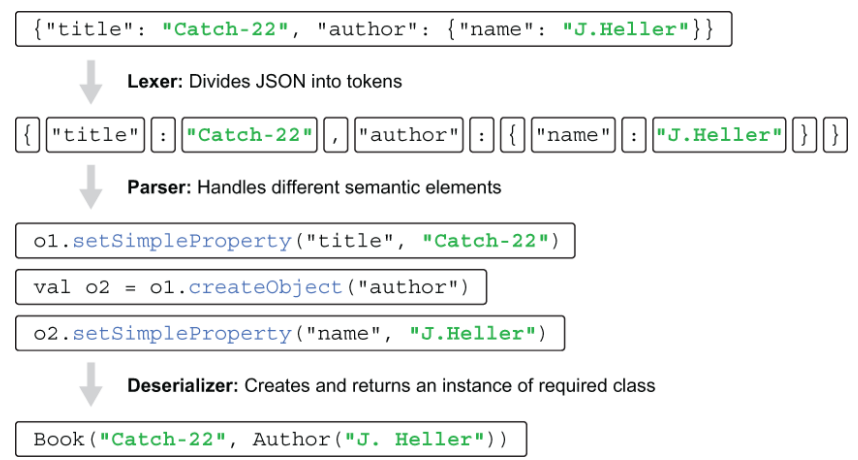
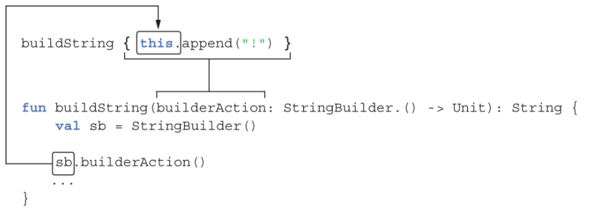
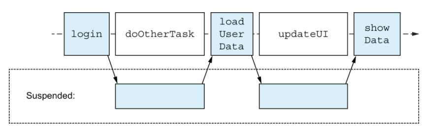
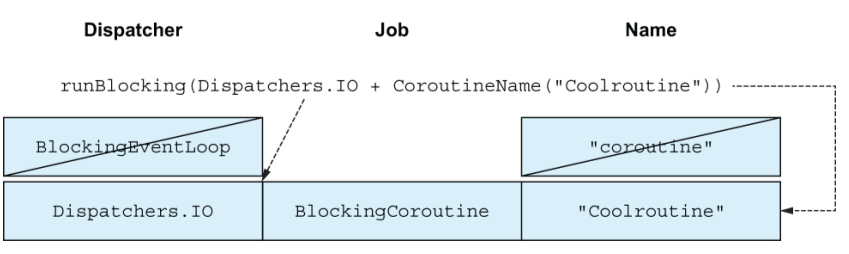
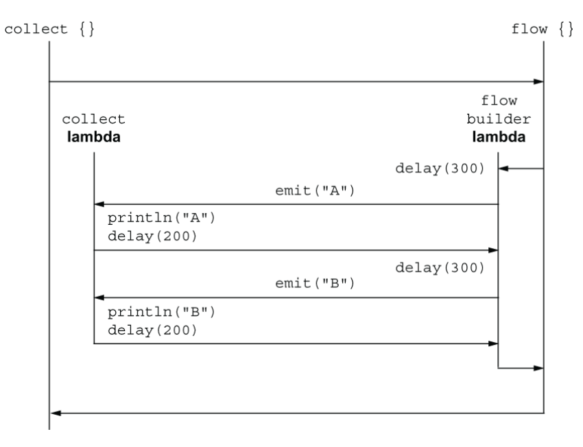
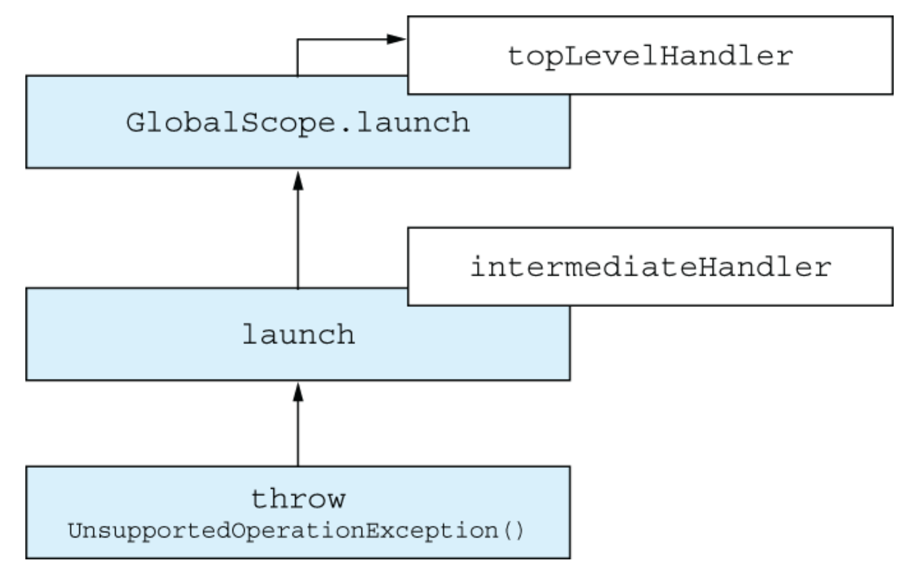
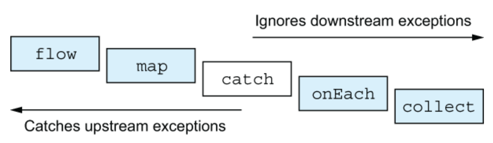

# 笔记

## ch03

```kotlin
package ch03.ex3_4_2_NoOverridingForExtensionFunctions1

open class View {
    open fun click() = println("View clicked")
}

class Button : View() {
    override fun click() = println("Button clicked")
}

fun View.showOff() = println("I'm a view!")
fun Button.showOff() = println("I'm a button!")

fun main() {
    val view: View = Button()
    view.showOff()
}

// I'm a view!
```

扩展函数不是类继承体系的一部分，它们是在类外部声明的。扩展函数在 Java 中会被编译为一个静态函数。

---

使用 path 进行文件路径解析

```kotlin
package ch03.ParsePath

fun parsePath(path: String) {
    val directory = path.substringBeforeLast("/")
    val fullName = path.substringAfterLast("/")

    val fileName = fullName.substringBeforeLast(".")
    val extension = fullName.substringAfterLast(".")

    println("Dir: $directory, name: $fileName, ext: $extension")
    // Dir: /Users/yole/kotlin-book, name: chapter, ext: adoc
}

fun main() {
    parsePath("/Users/yole/kotlin-book/chapter.adoc")
}
```

使用 regex 进行文件路径解析

```kotlin
package ch03.ex5_2_2_RegularExpressionsAndTriplequotedStrings1

fun parsePathRegex(path: String) {
    val regex = """(.+)/(.+)\.(.+)""".toRegex()
    val matchResult = regex.matchEntire(path)
    if (matchResult != null) {
        val (directory, filename, extension) = matchResult.destructured
        println("Dir: $directory, name: $filename, ext: $extension")
    }
}

fun main() {
    parsePathRegex("/Users/yole/kotlin-book/chapter.adoc")
}
```

---

```kotlin
package ch03.ex5_3_2_MultilineTriplequotedStrings1

fun main() {
    val expectedObject = """
        {
            "name": "Sebastian",
            "age": 27,
            "homeTown": "Munich"
        }
    """.trimIndent()
}
```

多行字符串包含三引号之间的所有字符。这包括用于格式化代码的换行符和缩进。通过调用 trimIndent，可以移除所有行的公共最小缩进。

---

```kotlin
package ch03.ex6_4_LocalFunctionsAndExtensions3

class User(val id: Int, val name: String, val address: String)

fun User.validateBeforeSave() {
    fun validate(value: String, fieldName: String) {
        if (value.isEmpty()) {
            throw IllegalArgumentException(
                "Can't save user $id: empty $fieldName"
            )
        }
    }

    validate(name, "Name")
    validate(address, "Address")
}

fun saveUser(user: User) {
    user.validateBeforeSave()

    // Save user to the database
}

fun main() {
    saveUser(User(1, "", ""))
}
```

扩展函数和属性（例子中的 `User.validateBeforeSave()`）允许你扩展任何类的 API，包括外部库中定义的类，无需修改其源代码，且不会产生运行时开销。

### 小结

- 函数和属性可以直接在文件中声明，而不仅仅是类的成员，从而实现更灵活的代码结构。
- 中缀调用 To 提供了调用类似操作符的方法并传入单个参数的简洁语法。
- 局部函数有助于更清晰地组织代码并消除重复代码。

## ch04 类、对象、接口

```kotlin
package ch04.ex1_2_1_OpenFinalAbstractModifiers

interface Clickable {
    fun click()
    fun showOff() = println("I'm clickable!")
}

open class RichButton : Clickable {
    fun disable() {}
    open fun animate() {}
    override fun click() {}
}
```

- click() 是一般的接口方法
- showOff() 是带有默认实现的接口方法
- RichButton 继承 Clickable 接口，那么必须覆盖 click()
- `fun disable(){}` 是 final 的，不能在子类中覆盖
- `fun animate(){}` 和 `override fun click(){}` 是 open 的

| Modifier | Corresponding member                            | Comments                                                                            |
|----------|-------------------------------------------------|-------------------------------------------------------------------------------------|
| final    | Can’t be overridden                             | Used by default for class members                                                   |
| open     | Can be overridden                               | Should be specified explicitly                                                      |
| abstract | Must be overridden                              | Can be used only in abstract classes; abstract members can’t have an implementation |
| override | Overrides a member in a superclass or interface | Overridden member is open by default, if not marked final                           |

---

```kotlin
package ch04.main

interface Clickable {
    fun click()
    fun showOff() = println("I'm clickable!")
}

interface Focusable {
    fun setFocus(b: Boolean) =
        println("I ${if (b) "got" else "lost"} focus.")
    fun showOff() = println("I'm focusable!")

}

class Button : Clickable, Focusable {
    override fun click() = println("I was clicked")

    override fun showOff() {
        super<Clickable>.showOff()
        super<Focusable>.showOff()
    }
}
```

如果需要调用父类的方法，需要按照这种形式：`super<Clickable>.showOff()`

---

Kotlin 没有包私有可见性 (package-private) 的概念，这是 Java 中的默认可见性。Kotlin 将包仅用作在命名空间中组织代码的方式；它不使用包来控制可见性。

| Modifier         | Class member          | Top-level declaration |
|------------------|-----------------------|-----------------------|
| public (default) | Visible everywhere    | Visible everywhere    |
| internal         | Visible in a module   | Visible in a module   |
| protected        | Visible in subclasses | ——                    |
| private          | Visible in a class    | Visible in a file     |

---

子类嵌套

```kotlin
package ch04.ex1_4_2_InnerAndNestedClasses1

class Outer {
    inner class Inner {
        fun getOuterReference(): Outer = this@Outer
    }
}
```

---

** 封装类：定义受限的类层次结构 **

先看下面的示例

```kotlin
package ch04.ex1_5_1_SealedClasses

interface Expr
class Num(val value: Int) : Expr
class Sum(val left: Expr, val right: Expr) : Expr

fun eval(e: Expr): Int =
    when (e) {
        is Num -> e.value
        is Sum -> eval(e.right) + eval(e.left)
        else ->
            throw IllegalArgumentException("Unknown expression")
    }
```

when 语句块内必须有 else 这个兜底判断，因为运行时不知道 e 是什么类型。当使用 sealed 类后，就可以去掉 else 判断。

因为 sealed 会限制创建子类的可能性。所有密封类的 * 直接 * 子类必须在编译时已知，并且在密封类本身的同一包中声明，且 * 所有 *
子类必须位于同一模块中。

```kotlin
package ch04.ex1_5_2_SealedClasses1

sealed class Expr
class Num(val value: Int) : Expr()
class Sum(val left: Expr, val right: Expr) : Expr()

fun eval(e: Expr): Int =
    when (e) {
        is Num -> e.value
        is Sum -> eval(e.right) + eval(e.left)
    }
```

---

类的构造函数

```kotlin
open class User(val nickname: String) {/* ... */}
class SocialUser(nickname: String) : User(nickname) {/* ... */}
```

如果你不为一个类声明任何构造函数，系统将为你生成一个无参数的默认构造函数，该构造函数不执行任何操作。

```kotlin
open class Button  
```

如果你继承自 Button 类且未提供任何构造函数，你必须明确调用父类的构造函数，即使它没有参数。这就是为什么你需要在父类名称后使用空括号：

```kotlin
class RadioButton : Button()
```

---

** 次级构造函数：以不同方式初始化超类 **

```kotlin
open class Downloader {
    constructor(url: String?) {
        ❶
        // some code
    }
    constructor(uri: URI?) {
        // some code
    }
}
```

这个类没有声明主构造函数（正如你在类头中类名后面没有括号可以判断的那样），但它声明了两个次级构造函数。次级构造函数是使用构造函数关键字引入的。你可以根据需要声明任意多个次级构造函数。

如果你想扩展这个类，可以声明相同的构造函数：

```kotlin
class MyDownloader : Downloader {
    constructor(url: String?) : super(url) {
        ❶
        // ...
    }
    constructor(uri: URI?) : super(uri) {
        ❶
        // ...
    }
}
```

---

** 实现接口中声明的属性 **

```kotlin
package ch04.ex2_3_1_ImplementingPropertiesDeclaredInInterfaces

fun getNameFromSocialNetwork(accountId: Int) = "soc:$accountId"

interface User {
    val nickname: String
}
class PrivateUser(override val nickname: String) : User

class SubscribingUser(val email: String) : User {
    override val nickname: String
        get() = email.substringBefore('@')
}

class SocialUser(val accountId: Int) : User {
    override val nickname = getNameFromSocialNetwork(accountId)
}

fun main() {
    println(PrivateUser("test@kotlinlang.org").nickname)
    println(SubscribingUser("test@kotlinlang.org").nickname)
}
```

---

```kotlin
package ch04.ex2_4_1_AccessingABackingFieldFromAGetterOrSetter

class User(val name: String) {
    var address: String = "unspecified"
        set(value: String) {
            println(
                """
                Address was changed for $name:
                "$field" -> "$value".
                """.trimIndent()
            )
            field = value
        }
}

fun main() {
    val user = User("Alice")
    user.address = "Christoph-Rapparini-Bogen 23, 80639 Muenchen"
}
```

Accessing the backing field in a setter

此外，懒加载属性是委托属性功能的一部分，后续会介绍。

---

```kotlin
package ch04.ex3_1_2_1_ObjectEqualityEquals

class Customer(val name: String, val postalCode: Int)

fun main() {
    val customer1 = Customer("Alice", 342562)
    val customer2 = Customer("Alice", 342562)
    println(customer1 == customer2)
}

// false
```

对象相等性的讨论。== 对比的是对象的地址，因此这里结果是不一致。

再看下面的例子

```kotlin
package ch04.ex3_1_2_2_ObjectEqualityEquals1

class Customer(val name: String, val postalCode: Int) {
    override fun equals(other: Any?): Boolean {
        if (other == null || other !is Customer)
            return false
        return name == other.name &&
                postalCode == other.postalCode
    }
    override fun toString() = "Customer(name=$name, postalCode=$postalCode)"
}

fun main() {
    val processed = hashSetOf(Customer("Alice", 342562))
    println(processed.contains(Customer("Alice", 342562)))
}
// false
```

这里只重写了 equals 方法，没有重写 hashCode 方法。HashSet 中的值以优化方式进行比较：首先比较它们的哈希码，只有在哈希码相等时，才会进一步比较实际值。

修复方式：

```kotlin
override fun hashCode(): Int = name.hashCode() * 31 + postalCode
```

---

** 类委托：使用 by 关键字 **

Kotlin 作为语言特性提供了对委托的第一类支持。每当实现一个接口时，你都可以说明你正在将接口的实现委托给另一个对象，使用 by
关键字。

```kotlin
class DelegatingCollection<T>(
    innerList: Collection<T> = mutableListOf<T>()
) : Collection<T> by innerList
```

下面是一个例子

```kotlin
package ch04.ex3_3_ClassDelegationUsingTheByKeyword

class CountingSet<T>(
    private val innerSet: MutableCollection<T> = HashSet<T>()
) : MutableCollection<T> by innerSet {

    var objectsAdded = 0

    override fun add(element: T): Boolean {
        objectsAdded++
        return innerSet.add(element)
    }

    override fun addAll(elements: Collection<T>): Boolean {
        objectsAdded += elements.size
        return innerSet.addAll(elements)
    }
}

fun main() {
    val cset = CountingSet<Int>()
    cset.addAll(listOf(1, 1, 2))
    println("Added ${cset.objectsAdded} objects, ${cset.size} uniques.")
}
```

- 将 MutableCollection 实现委托给 innerSet

---

** 对象声明：单例模式变得简单 **

- 对象声明使用 object 关键字引入。一个对象声明实际上在单个语句中定义了一个类和一个该类的变量，且两者名称相同。

- 像类一样，对象声明可以包含属性、方法、初始化块等的声明。
- 与普通类的实例不同，对象声明在定义的地点立即创建，而不是通过代码其他地方的构造函数调用创建。

```kotlin
package ch04.ex4_1_2_ObjectDeclarations1

data class Person(val name: String) {
    object NameComparator : Comparator<Person> {
        override fun compare(p1: Person, p2: Person): Int =
            p1.name.compareTo(p2.name)
    }
}

fun main() {
    val persons = listOf(Person("Bob"), Person("Alice"))
    println(persons.sortedWith(Person.NameComparator))
}
```

在 Kotlin 中，对象声明会被编译为一个包含其单例实例的类，该实例始终命名为 INSTANCE。从 Java 代码中使用 Kotlin 对象时，你通过访问静态
INSTANCE 字段来实现：

```kotlin
/* Java */
Person.NameComparator.INSTANCE.compare(person1, person2)
```

---

** 伴生对象：用于工厂方法和静态成员的场所 **

一个可以在不创建类实例的情况下调用，同时又能访问类内部细节的函数，可以将其定义为类内部对象声明的一部分。在一个类中，恰好一个对象声明可以使用特殊关键字进行标记：companion。

```kotlin
package ch04.ex4_2_2_CompanionObjects1

fun getNameFromSocialNetwork(accountId: Int) = "soc:$accountId"

class User private constructor(val nickname: String) {
    companion object {
        fun newSubscribingUser(email: String) =
            User(email.substringBefore('@'))

        fun newSocialUser(accountId: Int) =
            User(getNameFromSocialNetwork(accountId))
    }
}

fun main() {
    val subscribingUser = User.newSubscribingUser("bob@gmail.com")
    val socialUser = User.newSocialUser(4)
    println(subscribingUser.nickname)
    println(socialUser.nickname)
}
```

伴生对象可以访问类的所有私有成员，包括私有构造函数。这使得它成为实现工厂模式的理想候选者。

伴生对象对于一个类的编译方式类似于普通对象：类中的静态字段引用其实例。如果伴生对象没有命名，可以通过 Java 代码中的
Companion 引用访问它：

```kotlin
/* Java */
Person.Companion.fromJSON("...");
```

应用场景：

```kotlin
// business logic module
class Person(val firstName: String, val lastName: String) {
    companion object { ❶
    }
}

// client/server communication module
fun Person.Companion.fromJSON(json: String): Person {
    ❷
    /* ... */
}
val p = Person.fromJSON(json)
```

---

内联类的使用

```kotlin
class UsdCent(val amount: Int)

fun addExpense(expense: UsdCent) {
    // save the expense as USD cent
}
fun main() {
    addExpense(UsdCent(147))
}
```

这种方法带来了一些性能考虑：每次调用 addExpense 函数都需要创建一个新的 UsdCent
对象，然后在函数体内进行解包并丢弃。如果该函数被频繁调用，就需要创建大量短暂存在的对象，并随后进行垃圾回收。

解决方式：

```kotlin
@JvmInline
value class UsdCent(val amount: Int)
```

要被认定为“内联类”，该类必须恰好有一个属性，且该属性必须在主构造函数中初始化。内联类不会参与类层次结构：它们不会继承其他类，也不能被其他类继承。然而，它们仍然可以实现接口、定义方法，或提供计算属性。

### 小结

- 接口在 Kotlin 中与 Java 的类似，但可以包含默认实现和属性。
- 所有声明默认都是 final 和 public。
- 要使声明非 final，需标记为 open。
- internal 声明在同一个模块内可见。
- 嵌套类默认不是内联的。使用关键字 inner 来存储对外部类的引用。
- 所有密封类的直接子类以及所有密封接口的实现都需要在编译时已知。
- 初始化块和次级构造函数为类实例的初始化提供了灵活性。
- 你使用 field 标识符从访问器体内引用属性的 backing field。
- 数据类提供了编译器生成的 equals、hashCode、toString、copy 以及其他方法。
- 类委托有助于避免代码中许多类似的委托方法。
- 对象声明是 Kotlin 定义单例类的方式。
- 伴生对象（与包级 package-level 函数和属性一起）替代了 Java 的静态方法和字段定义。
- 伴生对象，如同其他对象，可以实现接口，以及拥有扩展函数和属性。
- 对象表达式是 Kotlin 对 Java 匿名内部类的替代方案，可以实现多个接口，并且能够修改在对象创建作用域内定义的变量。
- 内联类允许你在程序中引入类型安全层，同时避免因创建大量短期对象而可能带来的性能损耗。它在编译期“去对象化”，直接操作底层数据类型。在编译后的字节码中，尽可能地用底层的基础数据类型（如
  `Int`、`String`）直接替换掉了包装对象，从而实现：既有类型安全的编译期检查，又没有对象的运行时负担。

## ch05 Lambda

一个求年龄最大值的例子。

```kotlin
data class Person(val name: String, val age: Int)

fun findTheOldest(people: List<Person>) {
    var maxAge = 0
    var theOldest: Person? = null
    for (person in people) {
        if (person.age > maxAge) {
            maxAge = person.age
            theOldest = person
        }
    }
    println(theOldest)
}

// fun main() {
//    val people = listOf(Person("Alice", 29), Person("Bob", 31))
//    findTheOldest(people)
// }

fun main() {
    val people = listOf(Person("Alice", 29), Person("Bob", 31))
    println(people.maxByOrNull { it.age})
    // Person(name=Bob, age=31)

    // 原生写法
    println(people.maxByOrNull { p: Person -> p.age})
}
```

注意，lambda 中 it 这个指代尽量少用，容易语义不明。

取对象某个属性值来拼接。

```kotlin
data class Person(val name: String, val age: Int)

fun main() {
    val people = listOf(Person("Alice", 29), Person("Bob", 31))
    val names = people.joinToString(
        separator = " ",
        transform = {p: Person -> p.name}
    )
    println(names)

    // val names2 = people.joinToString(" "){p: Person -> p.name}
}
```

作用域分析。

```kotlin
fun printMessagesWithPrefix(messages: Collection<String>, prefix: String) {
    messages.forEach {
        println("$prefix $it")
    }
}

fun main() {
    val errors = listOf("403 Forbidden", "404 Not Found")
    printMessagesWithPrefix(errors, "Error:")
}
```

forEach lambda 可以访问周围作用域中定义的 prefix 变量以及周围作用域中定义的任何其他变量——一直延伸到周围的类和文件作用域。

---

```kotlin
data class Person(val name: String, val age: Int)

fun main() {
    val createPerson = ::Person
    val p = createPerson("Alice", 29)
    println(p)
}
```

成员引用

```kotlin
// 伪代码
val listener = OnClickListener { view ->
    val text = when (view.id) {
        button1.id -> "First button"
        button2.id -> "Second button"
        else -> "Unknown button"
    }
    toast(text)
}

button1.setOnClickListener(listener)
button2.setOnClickListener(listener)
```

- 在 lambda 中没有 this，而在匿名对象中存在；无法在将 lambda 转换为匿名类实例时引用该实例。
  从编译器的角度看，lambda 是一段代码，而不是一个对象，因此无法将其当作对象来引用。lambda 中的 this 引用指向外围类。
- 如果你的事件监听器在处理事件时需要取消订阅，那么就不能使用 lambda。应使用匿名对象来实现监听器。

---

对同一对象执行多个操作：with

```kotlin
fun alphabet(): String {
    val result = StringBuilder()
    for (letter in 'A'..'Z') {
        result.append(letter)
    }
    result.append("\nNow I know the alphabet!")
    return result.toString()
}

fun alphabetV2(): String {
    val stringBuilder = StringBuilder()
    return with(stringBuilder) {
        for (letter in 'A'..'Z') {
            this.append(letter)
        }
        this.append("\nNow I know the alphabet!")
        this.toString()
    }
}


fun main() {
    println(alphabet())
}
```

还可以进一步简化代码

```kotlin
fun alphabetV3()= with(StringBuilder()) {
    for (letter in 'A'..'Z') {
        append(letter)
    }
    append("\nNow I know the alphabet!")
    toString()
}
```

lambda 表达式的返回值是 lambda 代码执行的结果。该结果是 lambda 中的最后一个表达式。但有时，你希望调用返回接收器对象，而不是
lambda 执行的结果。这时，apply 库函数就非常有用。

```kotlin
fun alphabet()= StringBuilder().apply {
    for (letter in 'A'..'Z') {
        append(letter)
    }
    append("\nNow I know the alphabet!")
}.toString()

fun main() {
    println(alphabet())
}
```

可以通过使用 buildString 标准库函数进一步简化 alphabet 函数，该函数会负责创建 StringBuilder 并调用 toString。
buildString 的参数是一个带有接收者的 lambda，其接收者始终是 StringBuilder。

```kotlin
fun alphabet() = buildString {
    for (letter in 'A'..'Z') {
        append(letter)
    }
    append("\nNow I know the alphabet!")
}
```

同样地，这种机制还扩展到了 List、Set、Map 等数据容器。

```kotlin
fun main() {
    val fibonacci = buildList {
        addAll(listOf(1, 1, 2))
        add(3)
        add(index = 0, element = 3)
    }

    val shouldAdd = true

    val fruits = buildSet {
        add("Apple")
        if (shouldAdd) {
            addAll(listOf("Apple", "Banana", "Cherry"))
        }
    }

    val medals = buildMap<String, Int> {
        put("Gold", 1)
        putAll(listOf("Silver" to 2, "Bronze" to 3))
    }
}
```

also 的用法

```kotlin
fun main() {
    val fruits = listOf("Apple", "Banana", "Cherry")
    val uppercaseFruits = mutableListOf<String>()
    val reversedLongFruits = fruits
        .map {it.uppercase() }
        .also {uppercaseFruits.addAll(it) }
        .filter {it.length > 5}
        .also {println(it) }
        .reversed()
    println(uppercaseFruits)
    println(reversedLongFruits)
}

// [BANANA, CHERRY]

// .also {uppercaseFruits.addAll(it) }
// println(uppercaseFruits)
// [APPLE, BANANA, CHERRY]

// [CHERRY, BANANA]
```

### 小结

- lambda 可以捕获外部变量，意味着你可以使用 lambda 访问并修改调用 lambda 的函数中的变量。
- 可以通过在函数名前加上 :: 来创建对方法、构造函数和属性的引用。可以将这样的引用作为简写传递给函数，而不是使用 lambda。
- 为实现具有单个抽象方法（即 SAM 接口），可以直接传递 lambda 表达式，而无需显式创建实现该接口的对象。
- 带有接收者的 Lambda 是允许你直接调用特殊接收对象上方法的 Lambda。这些 Lambda 的主体在与周围代码不同的上下文中执行。
- 使用 with 标准库函数，可以无需重复对象的引用去调用同一个对象的多个方法。apply 函数让你通过构建器风格的 API
  构造并初始化任何对象，同时也可对对象执行额外操作。

## ch06 collections and sequences

- map
- filterIndexed
- mapIndexed
- mapValues
- reduce/fold
- runningReduce
- all/any/find
- filter/filterNot
- groupBy
- associate/associateWith/associateBy
- replaceAll/fill
- ifEmpty/ifBlank
- zip
- .asSequence()

asSequence() 是 lazy 模式

```kotlin
fun main() {
    listOf(1, 2, 3, 4).asSequence()
     .map {
         print("map($it) ")
         it * it
     }
     .filter {
         print("filter($it) ")
         it % 2 == 0
     }
     .toList()
}

// map(1) filter(1) map(2) filter(4) map(3) filter(9) map(4) filter(16) 
```

第一个 item 先走完整个处理流程，然后才到第二个 item 的处理。

generateSequence 的使用

```kotlin
fun main() {
    val naturalNumbers = generateSequence(0) {it + 1}
    val numbersTo100 = naturalNumbers.takeWhile {it <= 100}
    println(numbersTo100.sum())
}
```

```kotlin
fun File.isInsideHiddenDirectory() =
        generateSequence(this) {it.parentFile}.any {it.isHidden}

fun main() {
    val file = File("/Users/svtk/.HiddenDir/a.txt")
    println(file.isInsideHiddenDirectory())
}
```

在 Kotlin 中，reduce 和 fold 都是用于对集合进行聚合操作的函数。以下是它们的主要区别和用法示例：

- 初始值：
    - reduce 不需要显式的初始值。它从集合的第一个元素开始累积结果。
    - fold 需要一个显式的初始值，并从这个初始值开始累积结果。
- 空集合的行为：
    - reduce 在应用于空集合时会抛出 UnsupportedOperationException。
    - fold 可以安全地应用于空集合，因为它有一个初始值作为默认返回值。
- 使用场景：
    - reduce 适用于你确定集合至少有一个元素的情况。
    - fold 更加通用，适用于可能为空的集合。

### 小结

- 与其手动遍历集合中的元素，大多数常见操作可以通过结合标准库中现有的函数和自己的 lambda 表达式来完成。Kotlin 提供了许多这样的函数。
- filter 和 map 函数构成了操作集合的基础，使得提取符合特定条件的元素或转换元素为新形式变得容易。
- reduce 和 fold 操作聚合集合中的信息，帮助你在给定一组项目的情况下计算单个值。
- associate 和 groupBy 家族中的函数可以帮助你将扁平列表转换为映射，使你可以根据自己的标准对数据进行结构化。
- 对于通过索引相关联的集合中的数据，chunked、windowed 和 zip 函数可以使你创建集合元素的子组或将多个集合合并在一起。
- 使用谓词（返回 Boolean 的 lambda 表达式），all、any、none 和其他同类函数允许你检查某些不变量是否适用于你的集合。
- 为了处理嵌套集合，flatten 函数可以帮助你提取嵌套项，而 flatMap 函数甚至可以在同一步骤中执行转换。
- 序列允许你惰性地组合对集合的多种操作，而无需创建用于保存中间结果的集合，从而使代码更加高效。你可以使用与集合相同的功能来操作序列。

## ch07 空值

kotlin 在编译时可以避免 NPE 问题

```kotlin
fun strLen(s: String) = s.length

fun main() {
  strLen(null)
  // ERROR: Null can not be a value of a non-null type String
}
```

考虑兼容 null 的情况

```kotlin
fun strLenSafe(s: String?): Int = if (s != null) s.length else 0 

fun main() {
  val x: String? = null
  println(strLenSafe(x))
  // 0
  println(strLenSafe("abc"))
  // 3
}
```

一种解决这个问题的方法是永远不在代码中使用空值，并使用一种特殊包装类型（例如 Java 8 中引入的 Optional 类型）来表示可能或可能未定义的值。
这种方法有几个缺点：代码变得更为冗长，额外的包装实例会在运行时影响性能，且在整个生态系统中并未得到一致使用。

空值或非空值类型的对象在运行时是相同的；空值类型并不是非空类型的包装器。

---

链接调用

```kotlin
class Address(val streetAddress: String, val zipCode: Int,
              val city: String, val country: String)

class Company(val name: String, val address: Address?)

class Person(val name: String, val company: Company?)

fun Person.countryName(): String {
   val country = this.company?.address?.country
   return if (country != null) country else "Unknown"
}

fun main() {
    val person = Person("Dmitry", null)
    println(person.countryName())
}
```

Elvis 运算符 ?: 在空值情况下提供默认值：
```kotlin
fun strLenSafe(s: String?): Int = s?.length ?: 0

fun main() {
    println(strLenSafe("abc"))
    println(strLenSafe(null))
}
```

如果左侧的值为null，函数将立即返回指定的值或抛出指定的异常。这在函数中检查前置条件时非常有用。
```kotlin
class Address(val streetAddress: String, val zipCode: Int,
              val city: String, val country: String)

class Company(val name: String, val address: Address?)

class Person(val name: String, val company: Company?)

fun printShippingLabel(person: Person) {
    val address = person.company?.address
      ?: throw IllegalArgumentException("No address")
    with (address) {
        println(streetAddress)
        println("$zipCode $city, $country")
    }
}

fun main() {
    val address = Address("Elsestr. 47", 80687, "Munich", "Germany")
    val jetbrains = Company("JetBrains", address)
    val person = Person("Dmitry", jetbrains)
    printShippingLabel(person)
    printShippingLabel(Person("Alexey", null))
}
```

安全地转换值而不会抛出异常：as?
```kotlin
class Person(val firstName: String, val lastName: String) {
    override fun equals(other: Any?): Boolean {
        val otherPerson = other as? Person ?: return false  // <-----

        return otherPerson.firstName == firstName &&
                otherPerson.lastName == lastName
    }

    override fun hashCode(): Int =
        firstName.hashCode() * 37 + lastName.hashCode()
}

fun main() {
    val p1 = Person("Dmitry", "Jemerov")
    val p2 = Person("Dmitry", "Jemerov")
    println(p1 == p2)
    println(p1.equals(42))
}
```

使用非空断言运算符 !! 向编译器做出承诺：
```kotlin
fun ignoreNulls(str: String?) {
    val strNotNull: String = str!!
    println(strNotNull.length)
}
```

如果需要将一个可空值作为参数传递给期望非可空值的函数时，你应该怎么做？答案是使用处理空值的表达式：let 函数。

```kotlin
fun sendEmailTo(email: String) {
    println("Sending email to $email")
}

fun main() {
    var email: String? = "yole@example.com"
    email?.let { sendEmailTo(it) }
    
    email = null
    email?.let { sendEmailTo(it) }
}
```
否则，你将写出这种繁琐的旧代码
```kotlin
val person: Person? = getTheBestPersonInTheWorld()
if (person != null) sendEmailTo(person.email)
```

列表对比：

| Function      | Access to x VIA | Return value     |
| ------------- | --------------- | ---------------- |
| x.let {... }  | it              | Result of lambda |
| x.also {...}  | it              | x                |
| x.apply {...} | this            | x                |
| x.run {...}   | this            | Result of lambda |
| with(x) { - } | this            | Result of lambda |

- Use let together with the safe call operator ?. to execute a block of code only when the object you are working with is not null . Use a standalone let to turn an expression into a variable, limited to the scope of its lambda. 
- Use also to execute additional actions that use your object, while passing the original object to further chained operations. 
- Use apply to configure properties of your object using a builder-style API (e.g., when creating an instance). 
- Use run to configure an object and compute a custom result
- Use with to group function calls on the same object, without having to repeat its name. 

**没有立即初始化的非空类型：延迟初始化的属性**

例如，在 Android 中，活动的初始化发生在 onCreate 方法中。在 JUnit 中，通常将初始化逻辑放在标注为 @BeforeAll 或 @BeforeEach 的方法中。

```kotlin
import org.junit.jupiter.api.BeforeAll
import org.junit.jupiter.api.Test
import org.junit.jupiter.api.Assertions.assertEquals

class MyService {
    fun performAction(): String = "Action Done!"
}

class MyTest {
    //private var myService: MyService? = null
    private lateinit var myService: MyService

    @BeforeAll fun setUp() {
        myService = MyService()
    }

    @Test fun testAction() {
        assertEquals("Action Done!", myService!!.performAction())
    }
}
```

### 小结

- Kotlin 对可空类型的支持，使得在编译期就能检测出潜在的 NullPointerException 错误。
- 默认情况下，常规类型都是非空的，除非显式地将其标记为可空。在类型名称后加上一个问号，即表示该类型是可空的。
- 安全调用（?.）：允许你调用可空对象的方法或访问其属性。
- Elvis 操作符（?:）：当表达式结果可能为空时，可以利用它提供一个默认值、直接返回或抛出异常。
- 非空断言（!!）：你可以使用它向编译器承诺某个值绝对不为空（但如果你违背了承诺，程序就会抛出异常）。
- let 作用域函数：它将调用的对象转换为 Lambda 的参数。配合安全调用操作符，可以有效地将可空类型的对象转换为非空类型。
- as? 操作符：一种便捷的方式来将值转换为特定类型，并优雅地处理类型不匹配的情况。

## 08基本类型、集合、数组

```kotlin
fun main() {
    val x = 1
    println(x.toLong() in listOf(1L, 2L, 3L))
}
```
需要显式转换toLong

```kotlin
Literals of type Long use the L suffix: 123L .
Literals of type Double use the standard representation of floating-point numbers: 0.12 , 2.0 , 1.2e10 , and 1.2e-10 .
Literals of type Float use the f or F suffix: 123.4f , .456F , and 1e3f .
Hexadecimal literals use the 0x or 0X prefix (e.g., 0xCAFEBABE or 0xbcdL ).
Binary literals use the 0b or 0B prefix (e.g., 0b000000101 ).
Unsigned number literals use the U suffix: 123U , 123UL , and 0x10cU
```

你可能会想知道为什么我们为 Unit 选择了不同的名称，而不是称之为 Void。
在函数式语言中，名称 Unit 传统上表示“仅有一个实例”，而这正是 Kotlin 的 Unit 与 Java 的 void 之间的区别所在。
我们本可以使用传统的 Void 名称，但 Kotlin 中存在一种名为 Nothing 的类型，其功能完全不同。
拥有两种名为 Void 和 Nothing 的类型会令人困惑，因为它们的含义非常接近。


标准库中没有提供不可变集合，但[kotlinx.collections.immutable库](https://github.com/Kotlin/kotlinx.collections.immutable) 为Kotlin提供了不可变集合的接口和实现原型。



使用 array.indices 扩展属性来遍历索引范围。

args.forEachIndexed的使用

```kotlin
fun main(args: Array<String>) {
    args.forEachIndexed { index, element ->
        println("Argument $index is: $element")
    }
}
```

### 小结

- Types representing basic numbers (e.g., Int ) look and function like regular classes but are usually compiled to Java primitive types. Kotlin’s unsigned number classes, which don’t have an exact equivalent on the JVM, are transformed via inline classes to behave and perform like primitive types.
- Nullable primitive types (e.g., Int? ) correspond to boxed primitive types in Java (e.g., java.lang.Integer ). 
- The Any type is a supertype of all other types and is analogous to Java’s Object . Unit is an analogue of void .
- The Nothing type is used as a return type of functions that don’t terminate normally.
Types coming from Java are interpreted as platform types in Kotlin, allowing the developer to treat them as either nullable or nonnull. 
- Kotlin uses the standard Java classes for collections and enhances them with a distinction between read-only and mutable collections.
- You must carefully consider nullability and mutability of parameters when you extend Java classes or implement Java interfaces in Kotlin. 
- You can use arrays in Kotlin, but it’s generally recommended to prefer collections by default. 
- Kotlin’s Array class looks like a regular generic class but is compiled to a Java array. 
- Arrays of primitive types are represented by special classes, such as IntArray .


## 09 运算符重载及其他约定

```kotlin
data class Point(val x: Int, val y: Int) {
    operator fun plus(other: Point): Point {
        return Point(x + other.x, y + other.y)
    }
}

fun main() {
    val p1 = Point(10, 20)
    val p2 = Point(30, 40)
    println(p1 + p2)
    // Point(x=40, y=60)
}
```

| 表达式 | 函数名 |
| ------ | ------ |
| a*b    | times  |
| a/b    | div    |
| a%b    | mod    |
| a+b    | plus   |
| a-b    | minus  |

```kotlin
fun main() {
    val list = mutableListOf(1, 2)
    list += 3
    val newList = list + listOf(4, 5)
    println(list)
    // [1, 2, 3]
    println(newList)
    // [1, 2, 3, 4, 5]
}
```

但一般来说，最好保持新类设计的一致性：尽量不要同时添加加法+和加法赋值+=操作。

\+ 和 - 操作符始终返回一个新的集合。+= 和 -= 操作符在可变集合上通过原地修改来工作，在只读集合上则返回一个修改后的副本。

a in c 等价于 c.contains(a)


懒加载属性的实现。
```kotlin
class Email { /*...*/ }

fun loadEmails(person: Person): List<Email> {
    println("Load emails for ${person.name}")
    return listOf(/*...*/)
}

class Person(val name: String) {
    private var _emails: List<Email>? = null

    val emails: List<Email>
        get() {
            if (_emails == null) {
                _emails = loadEmails(this)
            }
            return _emails!!
        }
}

fun main() {
    val p = Person("Alice")
    p.emails
    // Load emails for Alice
    p.emails
}
```
或者使用lazy关键字，表示委托属性。lazy 函数默认是线程安全的。

```kotlin
class Person(val name: String) {
    val emails by lazy { loadEmails(this) }
}
```

可观测对象。
```kotlin
fun interface Observer {
    fun onChange(name: String, oldValue: Any?, newValue: Any?)
}

open class Observable {
    val observers = mutableListOf<Observer>()
    fun notifyObservers(propName: String, oldValue: Any?, newValue: Any?) {
        for (obs in observers) {
            obs.onChange(propName, oldValue, newValue)
        }
    }
}


class Person(val name: String, age: Int, salary: Int) : Observable() {
    var age: Int = age
        set(newValue) {
            val oldValue = field
            field = newValue
            notifyObservers(
                "age", oldValue, newValue
            )
        }

    var salary: Int = salary
        set(newValue) {
            val oldValue = field
            field = newValue
            notifyObservers(
                "salary", oldValue, newValue
            )
        }
}

fun main() {
    val p = Person("Seb", 28, 1000)
    p.observers += Observer { propName, oldValue, newValue ->
        println(
            """
            Property $propName changed from $oldValue to $newValue!
            """.trimIndent()
        )
    }
    p.age = 29
    // Property age changed from 28 to 29!
    p.salary = 1500
    // Property salary changed from 1000 to 1500!
}
```

进一步简化
```kotlin
class ObservableProperty(var propValue: Int, val observable: Observable) {
    operator fun getValue(thisRef: Any?, prop: KProperty<*>): Int = propValue

    operator fun setValue(thisRef: Any?, prop: KProperty<*>, newValue: Int) {
        val oldValue = propValue
        propValue = newValue
        observable.notifyObservers(prop.name, oldValue, newValue)
    }
}

class Person(val name: String, age: Int, salary: Int) : Observable() {
    var age by ObservableProperty(age, this)
    var salary by ObservableProperty(salary, this)
}
```
- 一个用于接收该属性获取或设置的实例（thisRef）。
- 另一个用于表示该属性本身（prop），属性以 KProperty 类型的对象形式表示。

### 小结
- Kotlin 允许你通过定义对应名称的函数来重载一些标准的数学运算。你无法定义自己的运算符，但可以使用内联函数作为更表达性的替代方案。
- 你可以使用比较运算符（==、!=、>、< 等）与任何对象进行操作。它们会被映射到 equals 和 compareTo 方法的调用。
- 通过定义名为 get、set 和 contains 的函数，可以支持 [] 和 in 操作符，使你的类类似于 Kotlin 集合。
- 委托属性允许您重用控制属性值存储、初始化、访问和修改的逻辑。
- 懒加载的标准库函数提供了一种简单的方法来实现懒加载的属性。Delegates.observable 函数允许你添加属性变化的观察者。
- 委托属性可以使用任何 map 作为属性委托，提供一种灵活的方式来处理具有可变属性集合的对象。

## 10 高阶函数：Lambda 作为参数和返回值

```kotlin
fun <T, R> Sequence<T>.map(transform: (T) -> R): Sequence<R> {
 return TransformingSequence(this, transform)
}
```

withLock的使用
```kotlin
val l: Lock = ReentrantLock()
l.withLock {
  // access the resource protected by this lock
}
```

使用 use 函数进行资源管理
```kotlin
import java.io.BufferedReader
import java.io.FileReader
fun readFirstLineFromFile(fileName: String): String {
   BufferedReader(FileReader(fileName)).use { br -> 
   return br.readLine() 
 }
```



### 小结
- 当内联函数被编译时，其字节码以及传递给它的 lambda 的字节码会直接插入到调用函数的代码中。
这确保了调用在与直接编写相似代码相比时没有额外开销。
- 高阶函数促进了单个组件内部的代码复用，并使你能够构建强大且通用的库。
- 内联函数允许你使用非局部返回——将返回表达式放在lambda中，从而从包含的函数中返回。匿名函数提供了与lambda表达式不同的语法，具有不同的返回表达式解析规则。


## 11 泛型

```kotlin
interface Comparable<T> {
  fun compareTo(other: T): Int
}
class String : Comparable<String> {
  override fun compareTo(other: String): Int = TODO()
}
```

使用where指定类型参数约束列表
```kotlin
fun <T> ensureTrailingPeriod(seq: T) where T : CharSequence, T : Appendable {
    if (!seq.endsWith('.')) {
        seq.append('.')
    }
}

fun main() {
    val helloWorld = StringBuilder("Hello World")
    ensureTrailingPeriod(helloWorld)
    println(helloWorld)
    //Hello World.
}
```
- seq.endsWith('.')：调用在 CharSequence 接口上定义的扩展函数
- seq.append('.')：调用来自 Appendable 接口的方法

类型转换 as?

```kotlin
fun printSum(c: Collection<*>) {
    val intList = c as? List<Int>
        ?: throw IllegalArgumentException("List is expected")
    println(intList.sum())
}
```

reified T：将函数声明为内联函数，以便其类型参数不会被擦除（或者在Kotlin术语中，即被重新具象化）。

```kotlin
inline fun <reified T> isA(value: Any) = value is T

fun main() {
    println(isA<String>("abc"))
    // true
    println(isA<String>(123))
    // false
}
```

More specifically, here’s how you can use a reified type parameter: 

- In type checks and casts ( is , !is , as , as? ) 
- To use the Kotlin reflection APIs, as we’ll discuss in chapter 12 ( ::class ) 
- To get the corresponding java.lang.Class ( ::class.java ) 
- As a type argument to call other functions

在 Kotlin 中，要声明类在某个类型参数上是协变的，您需要在类型参数名称前放置 out 关键字：

`interface Producer<out T> {  fun produce(): T }`

[`Comparator<Any>`]() 是 [`Comparator<String>`]() 的一个*子类型*，其中 Any 是 String 的一个*超类型*。两种不同类型的比较器之间的子类型关系与这些类型之间的子类型关系方向相反。

如果B是A的子类型，那么Consumer<A>是Consumer<B>的子类型。类型参数A和B的位置发生了变化，因此我们说子类型关系被反转了。例如，Consumer<Animal>是Consumer<Cat>的子类型。

| Covariant                                                    | Contravariant                                                | Invariant         |
| ------------------------------------------------------------ | ------------------------------------------------------------ | ----------------- |
| `Producer<out T>`                                            | `Consumer<in T>`                                             | `MutableList<T>`  |
| Subtyping for the class is preserved: `Producer<Cat>` is a subtype of `Producer<Animal>` | Subtyping is reversed: `Consumer<Animal>` is a subtype of `Consumer<Cat>` . | /                 |
| T only in out positions                                      | T only in in positions                                       | T in any position |

例如：

```kotlin
interface Function1<in P, out R> {
 operator fun invoke(p: P): R
}
```

```kotlin
fun enumerateCats(f: (Cat) -> Number) { /* ... */ }
fun Animal.getIndex(): Int = /* ... */

fun main() {
 enumerateCats(Animal::getIndex) 
}
```

这段代码在 Kotlin 中是合法的。Animal 是 Cat 的超类型，Int 是 Number 的子类型。

回顾Java的协变和逆变

```java
/* Java */
public interface Stream<T> {
 <R> Stream<R> map(Function<? super T, ? extends R> mapper);
}
```

Kotlin 中的 `MutableList<out T>` 与 Java 中的 `MutableList<? extends T>` 意义相同。项目中投影的 `MutableList<in T>` 对应于 Java 中的 `MutableList<? super T>`。

```kotlin
import kotlin.reflect.KClass

interface FieldValidator<in T> {
    fun validate(input: T): Boolean
}

object DefaultStringValidator : FieldValidator<String> {
    override fun validate(input: String) = input.isNotEmpty()
}

object DefaultIntValidator : FieldValidator<Int> {
    override fun validate(input: Int) = input >= 0
}

object Validators {
    private val validators =
        mutableMapOf<KClass<*>, FieldValidator<*>>()

    fun <T : Any> registerValidator(
        kClass: KClass<T>, fieldValidator: FieldValidator<T>,
    ) {
        validators[kClass] = fieldValidator
    }

    @Suppress("UNCHECKED_CAST")
    operator fun <T : Any> get(kClass: KClass<T>): FieldValidator<T> =
        validators[kClass] as? FieldValidator<T>
            ?: throw IllegalArgumentException(
                "No validator for ${kClass.simpleName}"
            )
}

fun main() {
    val validators = mutableMapOf<KClass<*>, FieldValidator<*>>()
    validators[String::class] = DefaultStringValidator
    validators[Int::class] = DefaultIntValidator

    Validators.registerValidator(String::class, DefaultStringValidator)
    Validators.registerValidator(Int::class, DefaultIntValidator)

    println(Validators[String::class].validate("Kotlin"))
    // true
    println(Validators[Int::class].validate(42))
    // true
}
```

### 小结

- Kotlin的泛型与Java中的泛型非常相似：你以相同的方式声明泛型函数或类。
- 与Java一样，泛型类型的类型参数仅在编译时存在。
- 你不能将带有类型参数的类型与 is 操作符一起使用，因为类型参数在运行时会被擦除。

- 对于内联函数的类型参数可以标记为 reified，这使得你可以在运行时使用它们来执行 is 检查并获取 java.lang.Class 实例。
- Variance is a way to specify whether one of two generic types with the same base class and different type arguments is a subtype or a supertype of the other one when one of the type arguments is the subtype of the other one.
- 如果类型参数仅在“输出位置”（out position）中使用，可以声明类为协变（covariant）。相反，如果类型参数仅在“输入位置”（in position）中使用，可以声明类为逆变（contravariant）。
- 只读接口 List 在 Kotlin 中被声明为协变，这意味着 `List<String>` 是 `List<Any>` 的子类型。函数接口在其第一个类型参数上被声明为逆变，在第二个类型参数上被声明为协变，这使得 `(Animal) -> Int` 是 `(Cat) -> Number` 的子类型。
- 星号*语法可以在类型参数的具体类型未知或不重要时使用。类型别名允许你为类型提供替代或简化的名称。它们在编译时展开为底层类型。


## 12 注解和反射

- @JvmName changes the name of a Java method or field generated from a Kotlin declaration.
- @JvmStatic can be applied to methods of an object declaration or a companion object to expose them as static Java methods.
- @JvmOverloads , mentioned in section 3.2.2, instructs the Kotlin compiler to generate overloads for a function or constructor that
has default parameter values.
- @JvmField can be applied to a property to expose that property as a public Java field with no getters or setters.
- @JvmRecord can be applied to a data class to declare a Java record class, as introduced in section 4.3.2.

```kotlin
annotation class JsonName(val name: String)
```
```java
/* Java */
public @interface JsonName {
 String value();
}
```

反序列化
```kotlin
interface Company {
 val name: String
}

data class CompanyImpl(override val name: String) : Company

data class Person(
  val name: String,
  @DeserializeInterface(CompanyImpl::class) val company: Company
)
```
反序列化时，每当JKid读取Person实例的嵌套公司对象，它就会创建并反序列化一个CompanyImpl实例，并将其存储在company属性中。



```kotlin
var counter = 0

fun main() {
    val kProperty = ::counter
    kProperty.setter.call(21)
    println(kProperty.get())
    // 21
}
```

```kotlin
class Person(val name: String, val age: Int)

fun main() {
    val person = Person("Alice", 29)
    val memberProperty = Person::age
    println(memberProperty.get(person))
    // 29
}
```

反序列化过程分析



在JSON中，你需要构建不同类型的复合结构：对象、集合和映射。ObjectSeed、ObjectListSeed 和 ValueListSeed 类负责适当地构建对象以及复合对象或简单值的列表。

```kotlin
interface Seed : JsonObject {
    fun spawn(): Any?
    fun createCompositeProperty(
        propertyName: String,
        isList: Boolean
    ): JsonObject

    override fun createObject(propertyName: String) =
        createCompositeProperty(propertyName, false)

    override fun createArray(propertyName: String) =
        createCompositeProperty(propertyName, true)
    // ...
}
```

可以将 spawn 看作是 build 的一种类比——一种返回结果值的方法。它返回 ObjectSeed 构造出的对象，以及 ObjectListSeed 或 ValueListSeed 构造出的列表。我们不会详细讨论列表的反序列化过程。

### 小结

- 一个注解参数可以是一个基本值、一个字符串、一个枚举、一个类引用、另一个注解类的实例，或其数组。
- 元注解可用于指定注解的目标、保留模式及其他属性。
- 反射API允许你在运行时动态枚举并访问对象的方法和属性。它提供了表示不同声明类型的接口，例如类（KClass）、函数（KFunction）等。
- 要获取KClass实例，可以使用ClassName::class（用于类）或objName::class（用于对象实例）。KFunction和KProperty接口均扩展了KCallable，提供了通用的call方法。
- KProperty0 和 KProperty1 是具有不同接收器数量的属性，支持 get 方法以获取值。KMutableProperty0 和 KMutableProperty1 扩展了这些接口，以支持通过 set 方法更改属性值。
- 可以通过 typeOf<T>() 函数获得 KType 的运行时表示。

## 13 DSL构造

最常见的领域特定语言（DSL）是SQL和正则表达式。它们非常适合解决操作数据库和文本字符串的特定任务，但你无法用它们来开发一个完整的应用程序。

```kotlin
@DslMarker
annotation class HtmlTagMarker

@HtmlTagMarker
open class Tag(val name: String) {
    private val children = mutableListOf<Tag>()

    protected fun <T : Tag> doInit(child: T, init: T.() -> Unit) {
        child.init()
        children.add(child)
    }

    override fun toString() =
        "<$name>${children.joinToString("")}</$name>"
}

fun table(init: TABLE.() -> Unit) = TABLE().apply(init)

class TABLE : Tag("table") {
    fun tr(init: TR.() -> Unit) = doInit(TR(), init)
}

class TR : Tag("tr") {
    fun td(init: TD.() -> Unit) = doInit(TD(), init)
}

class TD : Tag("td")

fun createTable() =
    table {
        tr {
            td {
            }
        }
    }

fun main() {
    println(createTable())
    // <table><tr><td></td></tr></table>
}
```

注意 tr 和 td 函数的初始化参数类型：它们是扩展函数类型 TR.() -> Unit 和 TD.() -> Unit。
它们决定了参数 lambda 中接收者的类型：分别是 TR 和 TD。

---

当lambda体被调用时，接收者（sb）会变为隐式接收者（this）。



---

```kotlin
val now = Clock.System.now()
val yesterday = now - 1.days
val later = now + 5.hours
```
```kotlin
import kotlin.time.Duration
import kotlin.time.DurationUnit
import kotlin.time.toDuration

val Int.days: Duration
    get() = this.toDuration(DurationUnit.DAYS)

val Int.hours: Duration
    get() = this.toDuration(DurationUnit.HOURS)
```

### 小结
- 内部 DSL 是一种你可以使用的 API 设计模式，用于通过多个方法调用组成的结构构建更具表达力的 API。
- 带有接收者的Lambda采用嵌套结构来重新定义lambda体中方法的解析方式。
- 接受一个带有接收者的Lambda的参数的类型是扩展函数类型，当调用该Lambda时，调用函数会提供一个接收者实例。
- 定义在基本类型上的扩展允许你为各种类型的字面量创建可读的语法，例如持续时间。使用调用约定，你可以将任意对象当作函数来调用。
- Kotlin 的 kotlinx.html 库提供了用于构建 HTML 页面的内部 DSL，可以扩展以适应您的应用程序。
- Kotest 库提供了一个支持单元测试中可读断言的内部 DSL。
- Exposed 库提供了用于数据库操作的内部 DSL。

## 14 协程

线程
```kotlin
import kotlin.concurrent.thread

fun main() {
    println("I'm on ${Thread.currentThread().name}")
    thread { // <1>
        println("And I'm on ${Thread.currentThread().name}")
    }
}

// I'm on main
// And I'm on Thread-0
```

runBlocking形式
```kotlin
import kotlinx.coroutines.delay
import kotlinx.coroutines.runBlocking
import kotlin.time.Duration.Companion.milliseconds

suspend fun doSomethingSlowly() {
    delay(500.milliseconds) // <1>
    println("I'm done")
}

fun main() = runBlocking {
    doSomethingSlowly()
}
```

可暂停的函数：挂起函数



让我们简要看看三种涵盖最常见方法的例子：回调、反应式流（RxJava）和未来（futures）。

回调地域

```kotlin
fun loginAsync(credentials: Credentials, callback: (UserID) -> Unit)
fun loadUserDataAsync(userID: UserID, callback: (UserData) -> Unit)
fun showData(data: UserData)

fun showUserInfo(credentials: Credentials) {
 loginAsync(credentials) { userID ->
     loadUserDataAsync(userID) { userData ->
     	showData(userData)
     }
 }
}
```

futures

```kotlin
fun loginAsync(credentials: Credentials): CompletableFuture<UserID>
fun loadUserDataAsync(userID: UserID): CompletableFuture<UserData>
fun showData(data: UserData)

fun showUserInfo(credentials: Credentials) {
 loginAsync(credentials)
 .thenCompose { loadUserDataAsync(it) }
 .thenAccept { showData(it) }
}

```

流

```kotlin
fun login(credentials: Credentials): Single<UserID>
fun loadUserData(userID: UserID): Single<UserData>
fun showData(data: UserData)

fun showUserInfo(credentials: Credentials) {
 login(credentials)
     .flatMap { loadUserData(it) }
     .doOnSuccess { showData(it) }
     .subscribe()
}

```

---

- runBlocking 是为桥接阻塞代码和挂起函数而设计的。

- launch 用于启动不会返回任何值的新协程。

- async 用于以异步方式计算值。

协程的调度器决定了协程使用哪个线程或哪些线程进行执行。

本质上，协程并不绑定到任何特定的线程；协程可以在一个线程中挂起执行，然后在另一个线程中恢复执行，这由调度器决定。

这些调度器可以帮助您在默认情况下显式运行协程（Dispatchers.Default），在使用UI框架时（Dispatchers.Main）以及与本质上会阻塞线程的API交互时（Dispatchers.IO）。

- 一个多线程的通用目的调度器：Dispatchers.Default。它基于一个线程池，线程数量等于可用的 CPU 核心数。这意味着当你在默认调度器上调度协程时，这些协程会分发到多个线程中运行，因此在多核机器上可以并行执行。
- 在UI线程上运行：Dispatchers.Main。操作示例就是用户界面元素的重绘。为了从协程中安全地执行这些操作，你可以使用Dispatchers.Main来调度协程。
- 阻塞IO任务：Dispatchers.IO。在此调度器中启动的协程将在一个自动扩展的线程池中执行，该线程池专为处理这类非CPU密集型工作而分配，其中你只是在等待阻塞式API返回结果。

 **使用 withContext 来在协程中切换调度器**

```kotlin
launch(Dispatchers.Default) { 
 val result = performBackgroundOperation()
 withContext(Dispatchers.Main) { 
 	updateUI(result)
 }
}
```

调用 withContext 会使原本在默认调度器上启动并运行在其中一个工作线程上的协程，切换到指定的调度器上执行。在这种情况下，就是切换到主线程以更新UI。

```kotlin
fun main3() = runBlocking {
    val mutex = Mutex()
    var x = 0
    repeat(10_000) {
        launch(Dispatchers.Default) {
            mutex.withLock {
                x++
            }
        }
    }
    delay(1.seconds)
    println(x)
}
// 10000
```

```kotlin
fun main() {
    runBlocking(Dispatchers.IO + CoroutineName("Coolroutine")) {
        introspect()
    }
}
```



传递给 runBlocking 的参数会覆盖子协程上下文中的元素：Dispatchers.IO 会替换 runBlocking 中的特殊 BlockingEventLoop 分发器，且协程的名称被设置为 "Coolroutine"。

### 小结

- 协程是一种轻量级抽象，建立在线程之上，用于并发执行。
- Kotlin 中的核心并发原语是挂起函数——一种可以暂停执行的函数。挂起函数可以被另一个挂起函数调用，或者在协程内部被调用。
- 协程构建器（如 runBlocking、launch 和 async）允许你创建新的协程。
- 调度器决定你的协程在哪个线程或线程池中运行。
- 不同的内置调度器服务于不同的目的：Dispatchers.Default 是一个通用调度器，Dispatchers.Main 帮助你在 UI 线程上运行操作，而 Dispatchers.IO 用于调用阻塞的 I/O 任务。大多数调度器，如 Dispatchers.Default 和 Dispatchers.IO，都是多线程调度器。
- 可以指定调度器来创建协程，或者使用 withContext 在不同调度器之间切换。
- 协程上下文包含与协程相关联的附加信息。协程的调度器是协程上下文的一部分。


## 15 结构化并发

考虑以下示例：用户请求了一个网络资源，然后立即导航到另一屏幕。

结构化并发：协程之间存在父-子关系（严格来说，是与您的协程关联的Job对象）。

```kotlin
fun main() {
    runBlocking { // this: CoroutineScope <1>
        launch { // this: CoroutineScope <2>
            delay(1.seconds)
            launch {
                delay(250.milliseconds)
                log("Grandchild done")
            }
            log("Child 1 done!")
        }
        launch {
            delay(500.milliseconds)
            log("Child 2 done!")
        }
        log("Parent done!")
    }
}
```

输出

```
0 [main] Parent done!
534 [main] Child 2 done!
1022 [main] Child 1 done!
1274 [main] Grandchild done
```

默认情况下，仅使用调度器调用 CoroutineScope 会自动创建一个新的 Job。在大多数实际场景中，你更希望使用带有 CoroutineScope 的 SupervisorJob。SupervisorJob 是一种特殊类型的 Job，它能防止未捕获的异常导致与同一作用域关联的其他协程被取消，并阻止该异常进一步传播。

管理内部组件生命周期的框架会使用 CoroutineScope 函数。例子——Android 的 ViewModel 类。

你通常在挂起函数的主体中看到coroutineScope的调用，而通常在将协程作用域作为类属性存储时看到CoroutineScope构造函数的使用。

---

协程构建器的不同返回值可以作为处理程序，用于触发取消；launch 协程构建器返回一个 Job，而 async 协程构建器返回一个 Deferred。两者都允许你调用 cancel 来触发相应协程的取消。

```kotlin
fun main() {
    runBlocking {
        val launchedJob = launch { // <1>
            log("I'm launched!")
            delay(1000.milliseconds)
            log("I'm done!")
        }
        val asyncDeferred = async { // <2>
            log("I'm async")
            delay(1000.milliseconds)
            log("I'm done!")
        }
        delay(200.milliseconds)
        launchedJob.cancel() // <3>
        asyncDeferred.cancel() // <3>
    }
}
```

超时问题的处理。

```kotlin
suspend fun calculateSomething(): Int {
    delay(3.seconds)
    return 2 + 2
}

fun main() = runBlocking {
    val quickResult = withTimeoutOrNull(500.milliseconds) {
        calculateSomething()
    }
    println(quickResult)
    // null
    val slowResult = withTimeoutOrNull(5.seconds) {
        calculateSomething()
    }
    println(slowResult)
    // 4
}
```

withTimeout 函数在超时发生时会抛出异常（确切地说是 TimeoutCancellationException）。为了处理超时，你将 withTimeout 的调用包装在 try 块中，并捕获所抛出的 TimeoutCancellationException。与此相对应，withTimeoutOrNull 的兄弟函数在超时发生时返回 null。

当你取消一个协程时，其所有子协程也会被取消。

观察下面这段有问题的代码。

```kotlin
suspend fun doWork() {
    delay(500.milliseconds) // <1>
    throw UnsupportedOperationException("Didn't work!")
}

fun main() {
    runBlocking {
        withTimeoutOrNull(2.seconds) {
            while (true) {
                try {
                    doWork()
                } catch (e: Exception) { // <2>
                    println("Oops: ${e.message}")
                }
            }
        }
    }
}
```

输出

```
Oops: Didn't work!
Oops: Didn't work!
Oops: Didn't work!
Oops: Timed out waiting for 2000 ms
Oops: Timed out waiting for 2000 ms
Oops: Timed out waiting for 2000 ms
Oops: Timed out waiting for 2000 ms
无限循坏......
```

原因在于2s后，因withTimeoutOrNull(2.seconds)发生超时，于是delay(500.milliseconds)这里抛出CancellationException。由于catch语句捕获了所有类型的异常，代码会无限循环。可以通过以下任一方式修复此问题:

- 要么重新抛出该异常（if(e is CancellationException) throw e），

- 要么不捕获该异常（catch (e: UnsupportedOperationException)）。

协程库提供了一个相关的函数，称为 yield。除了引入一个可以取消函数的点之外，它还提供了一种让其他协程在当前占用的调度器上工作的方法。

```kotlin
suspend fun doCpuHeavyWork(): Int {
    log(coroutineContext)
    var counter = 0
    val startTime = System.currentTimeMillis()
    while (System.currentTimeMillis() < startTime + 500) {
        counter++
        yield()
    }
    return counter
}

fun main() {
    runBlocking {
        launch {
            repeat(3) {
                doCpuHeavyWork()
            }
        }
        launch {
            repeat(3) {
                doCpuHeavyWork()
            }
        }
    }
}
```

输出

```
0 [main] [StandaloneCoroutine{Active}@3ecf72fd, BlockingEventLoop@483bf400]
3 [main] [StandaloneCoroutine{Active}@25618e91, BlockingEventLoop@483bf400]
503 [main] [StandaloneCoroutine{Active}@3ecf72fd, BlockingEventLoop@483bf400]
503 [main] [StandaloneCoroutine{Active}@25618e91, BlockingEventLoop@483bf400]
1003 [main] [StandaloneCoroutine{Active}@25618e91, BlockingEventLoop@483bf400]
1003 [main] [StandaloneCoroutine{Active}@3ecf72fd, BlockingEventLoop@483bf400]
```

可以看到 3ecf72fd和25618e91是交替的。

下面看一段数据库连接资源泄露的代码

```kotlin
class DatabaseConnection : AutoCloseable {
    fun write(s: String) = println("writing $s!")
    override fun close() {
        println("Closing!")
    }
}

fun main() {
    runBlocking {
        val dbTask = launch {
            val db = DatabaseConnection()
            delay(500.milliseconds)
            db.write("I love coroutines!")
            db.close()
        }
        delay(200.milliseconds)
        dbTask.cancel()
    }
    println("I leaked a resource!")
}
```

200ms后，协程取消了，因此没有办法去调用db.close()来关闭资源。

正确的处理方式为

```kotlin
db.use {
    delay(500.milliseconds)
    it.write("I love coroutines!")
}
```

在请求级别协程作用域中启动协程

```kotlin
routing {
     get("/") { // this: PipelineContext
         launch { 
             println("I'm doing some background work!")
             delay(5000.milliseconds)
             println("I'm done")
          }
     }
}
```

### 小结

- 结构化并发让你能够控制工作协程正在执行的内容，并防止异常协程逃脱取消。

- 你可以使用挂起的 coroutineScope 辅助函数和 CoroutineScope 构造函数来创建新的协程作用域。尽管名称相似，它们的作用不同：

  - coroutineScope 实现工作的同时分解：启动多个协程，等待它们完成计算一个结果，然后返回该结果。

  - CoroutineScope 创建了一个用于将协程与类的生命周期关联的协程作用域。它通常与一个SupervisorJob搭配使用。

- 协程上下文管理单个协程的执行方式。它沿协程层次结构被继承。

- 协程与协程作用域之间的父-子层次结构通过协程上下文中关联的Job对象建立。

- 挂起点是协程可以暂停的地方，其他协程可以开始工作的地点。

- 取消是通过在 *挂起点* 抛出一个 CancellationException 来实现的。

- 取消异常应当永远不应被吞没（被捕获但未处理）。相反，它们应当被重新抛出，或根本不应被捕获。

- 取消是正常现象，你的代码应设计为能够处理这种情况。你可以使用如 cancel 或 withTimeoutOrNull 等函数主动触发取消。许多现有框架也可以帮你取消协程。

- Kotlin 协程提供了机制，帮助您构建可取消的挂起函数（例如，ensureActive 或 yield 以及 isActive 属性）。

- 框架使用协程作用域来帮助将协程与应用程序的生命周期关联起来（例如，视图模型在屏幕上显示的时间，或请求处理程序执行时的时机）。


## 16 流

观察下面的代码

```kotlin
suspend fun createValues(): List<Int> {
    return buildList { // <1>
        add(1)
        delay(1.seconds)
        add(2)
        delay(1.seconds)
        add(3)
        delay(1.seconds)
    }
}

fun main() = runBlocking {
    val list = createValues()
    list.forEach {
        log(it) // <2>
    }
}
```

list需要3秒后才计算出最终值，然后瞬间打印出三条记录。然而，可能你希望边计算边打印。

```kotlin
fun createValues(): Flow<Int> {
    return flow {
        emit(1) // <1>
        delay(1000.milliseconds)
        emit(2)
        delay(1000.milliseconds)
        emit(3)
        delay(1000.milliseconds)
    }
}

fun main() = runBlocking {
    val myFlowOfValues = createValues()
    myFlowOfValues.collect { log(it) } // <2>
}
```

在Kotlin中，流（flows）是一种基于协程的抽象，使其能够处理随时间出现的值。

流是一种通用的抽象，可以用于实现渐进式加载、处理事件流或建模订阅式 API。

流的分类

- *冷流* 代表异步数据流，它们仅在被单个收集器消费时才开始发出项目。它默认是惰性的，直到被收集时才会激活。

- *热流*，会独立于项目是否实际被消费而生成项目，以广播方式运行。

冷流collect每一个元素时，都延迟了500ms。因此A和B之间在这里间隔了大约200ms+500ms。

```kotlin
val letters = flow {
    log("Emitting A!")
    emit("A")
    delay(200.milliseconds)
    log("Emitting B!")
    emit("B")
}

fun main() = runBlocking {
    letters.collect {
        log("Collecting $it")
        delay(500.milliseconds)
    }
}
```

冷流背后的原理。

```kotlin
interface Flow<out T> {
  suspend fun collect(collector: FlowCollector<T>)
}

interface FlowCollector<in T> {
  suspend fun emit(value: T)
}
```

考虑下面一段代码

```kotlin
val letters = flow {
    delay(300.milliseconds)
    emit("A")
    delay(300.milliseconds)
    emit("B")
}

letters.collect { letter ->
   println(letter)
   delay(200.milliseconds)
}
```



这个图画的很好，非常清晰。

对 emit 的调用会执行传递给 collect 的 lambda，并将其运行至完成。

---

可以构建一个支持多个协程发出数据的并发流。在 Kotlin 中，这被称为 *通道流*。

```kotlin
suspend fun getRandomNumber(): Int {
    delay(500.milliseconds)
    return Random.nextInt()
}

val randomNumbers = channelFlow { // <1>
    repeat(10) {
        launch {
            send(getRandomNumber()) // <2>
        }
    }
}

fun main() = runBlocking {
    randomNumbers.collect {
        log(it)
    }
}
```

多个协程可以使用 send 来提供值。

通道是用于协程间通信的相对较低层级的抽象。发送函数是通道暴露的更复杂接口的一部分。

---

即使没有订阅者存在，热流仍能持续发出事件，始终处于活跃状态。

- Shared flows, which are used for broadcasting values, 

- and State flows, for the special case of communicating state

```kotlin
class RadioStation {
    private val _messageFlow = MutableSharedFlow<Int>() // <1>
    val messageFlow = _messageFlow.asSharedFlow() // <2>

    fun beginBroadcasting(scope: CoroutineScope) {
        scope.launch {
            while (true) {
                delay(500.milliseconds)
                val number = Random.nextInt(0..10)
                log("Emitting $number!")
                _messageFlow.emit(number) // <3>
            }
        }
    }
}

fun main(): Unit = runBlocking {
    val radioStation = RadioStation()
    radioStation.beginBroadcasting(this)
    delay(600.milliseconds)
    radioStation.messageFlow.collect {
        log("A collecting $it!")
    }
}
```

输出

```
0 [main] Emitting 9!
512 [main] Emitting 8!
514 [main] A collecting 8!
1019 [main] Emitting 9!
1019 [main] A collecting 9!
```

- 注意第一个9并没有被收集到。
- _messageFlow 是可变的，messageFlow 是read-only view。

通过使用 shareIn 函数将给定的冷流转换为热共享流。

```kotlin
fun querySensor(): Int = Random.nextInt(-10..30)

fun getTemperatures(): Flow<Int> {
    return flow {
        while (true) {
            emit(querySensor())
            delay(500.milliseconds)
        }
    }
}

fun celsiusToFahrenheit(celsius: Int) =
    celsius * 9.0 / 5.0 + 32.0

fun main() {
    val temps = getTemperatures()
    runBlocking {
        val sharedTemps = temps.shareIn(this, SharingStarted.Lazily)
        launch {
            sharedTemps.collect {
                log("$it Celsius")
            }
        }
        launch {
            sharedTemps.collect {
                log("${celsiusToFahrenheit(it)} Fahrenheit")
            }
        }
    }
}
```

- Eagerly starts the collection of the flow immediately. 
- Lazily starts the collection only when the first subscriber appears. 
- WhileSubscribed starts the collection only when the first subscriber appears, and then cancels the collection of the flow when the last subscriber disappears.

状态流仅在值实际发生改变时发出：基于相等性的合并。

```kotlin
enum class Direction { LEFT, RIGHT }

class DirectionSelector {
    private val _direction = MutableStateFlow(Direction.LEFT)
    val direction = _direction.asStateFlow()

    fun turn(d: Direction) {
        _direction.update { d }
    }
}

fun main() = runBlocking {
    val switch = DirectionSelector()
    launch {
        switch.direction.collect {
            log("Direction now $it")
        }
    }
    delay(200.milliseconds)
    switch.turn(Direction.RIGHT)
    delay(200.milliseconds)
    switch.turn(Direction.LEFT)
    delay(200.milliseconds)
    switch.turn(Direction.LEFT)
}
```

输出

```kotlin
0 [main] Direction now LEFT
204 [main] Direction now RIGHT
406 [main] Direction now LEFT
```

末尾的两次LEFT转向，实际上只会记录收集一次。当值被赋值为已设置的相同值时，不会发出新的元素。这就是相等性合并。

---

使用 stateIn 将冷流转换为热状态流

```kotlin
fun main() {
    val temps = getTemperatures()
    runBlocking {
        val tempState = temps.stateIn(this)
        println(tempState.value)
        delay(800.milliseconds)
        println(tempState.value)
        // 18
        // -1
    }
}
```

stateIn函数不提供任何初始策略。它将在给定的协程作用域中启动流，并通过value属性持续将最新的值提供给其订阅者，直到协程作用域被取消。

共享流可以广播事件，其中订阅者可以随时加入或离开，订阅者仅在订阅期间接收事件。状态流旨在表示任何类型的状态，并使用基于相等性的合并机制，意味着只有当状态流所表示的值实际发生变化时，才会发出事件。

```kotlin
class Broadcaster {
    private val _messages = MutableStateFlow<List<String>>(emptyList())
    val messages = _messages.asStateFlow()
    fun beginBroadcasting(scope: CoroutineScope) {
        scope.launch {
            _messages.update { it + "Hello!" }
            _messages.update { it + "Hi!" }
            _messages.update { it + "Hola!" }
        }
    }
}

fun main() = runBlocking {
    val broadcaster = Broadcaster()
    broadcaster.beginBroadcasting(this)
    delay(200.milliseconds)
    println(broadcaster.messages.value)
}

//[Hello!, Hi!, Hola!]
```

这里要使用状态流。

冷流和热流已经为处理随时间变化的值提供了一个有用的抽象。然而，它们真正的力量来自于*流操作符*，它能帮助你操纵流，就像你之前看到的集合和序列那样。

### 小结

- 在Kotlin中，流（flows）是一种基于协程的抽象，使其能够处理随时间出现的值。
- 你可以将流分为两种类型：热流（hot flows）和冷流（cold flows）。
- 冷流默认是惰性的，并与单个收集器相关联。冷流通过流构建函数创建。使用发射函数，可以异步提供值。
- 通道流是一种特殊的冷流，它通过send函数允许从多个协程发射值。
- 热流始终处于活跃状态，并与多个称为订阅者的收集器相关联。**共享流和状态流是热流的实例。**
- 共享流可以用于在协程之间广播式地传递值。共享流的订阅者会从订阅开始时接收到发射的值，以及共享流回放的那些值。
- 状态流可用于管理并发系统中的状态。状态流执行基于相等性的合并，这意味着它们仅在值实际改变时才进行发射，而不会在多次赋值相同值时重复发射。**冷流可以通过 shareIn 和 stateIn 函数转换为热流。**


## 17 流操作符

```kotlin
fun getTemperatures(): Flow<Int> {
    return flow {
        while (true) {
            emit(querySensor())
            delay(500.milliseconds)
        }
    }
}


fun main() = runBlocking {
    val temps = getTemperatures()
    temps
        .take(5) // <1>
        .collect {
            log(it)
        }
}
```

上游流在发出5个元素后会被取消发射。

**通过 onStart、onEach、onCompletion 和 onEmpty 进入流程阶段**

```kotlin
fun main() = runBlocking {
    val temps = getTemperatures()
    temps
        .take(5)
        .onCompletion { cause ->
            if (cause != null) {
                println("An error occurred! $cause")
            } else {
                println("Completed!")
            }
        }
        .collect {
            println(it)
        }
}
```

- onCompletion 是一组中间操作符中的成员，允许你在流生命周期的特定阶段执行操作：
- onStart 在流的收集开始时执行，甚至在第一次发射之前。
- onEach 在上游流发射每个元素之前执行操作，然后将该元素发射到下游流。
- 对于一种特殊情形，即流在从未发射任何元素的情况下终止，你可以添加 onEmpty 中间操作符来执行额外逻辑或某些默认元素。

一个注意点。

```kotlin
suspend fun process(flow: Flow<Int>) {
    flow
        .onEmpty {
            println("Nothing - emitting default value!")
            emit(0)
        }
        .onStart {
            println("Starting!")
        }
        .onEach {
            println("On $it!")
        }
        .onCompletion {
            println("Done!")
        }
        .collect()
}
```

如果你将 onEmpty 操作符的调用向后移动（例如，在调用 collect 之前），你就不会看到“On 0!”消息。这是因为 onEach 会相对于 onEmpty 成为上游操作符——它不会接收到下游操作符发出的任何发射事件。

```kotlin
fun getAllUserIds(): Flow<Int> {
    return flow {
        repeat(3) {
            delay(200.milliseconds) // Database latency
            log("Emitting!")
            emit(it)
        }
    }
}

suspend fun getProfileFromNetwork(id: Int): String {
    delay(2.seconds) // Network latency
    return "Profile[$id]"
}

fun main() {
    val ids = getAllUserIds()
    runBlocking {
        ids
//            .buffer(3)
            .map { getProfileFromNetwork(it) }
            .collect { log("Got $it") }
    }
}
```

输出

```
0 [main] Emitting!
2016 [main] Got Profile[0]
2221 [main] Emitting!
4225 [main] Got Profile[1]
4429 [main] Emitting!
6442 [main] Got Profile[2]
```

此时，ID的发出和配置文件的请求是相互交织的。当一个元素被发出时，生产代码不会继续执行，直到下游流程已完成对该元素的处理。在此实现中，这意味着处理单个元素大约需要1.2秒。

如果生产者能够无需等待收集器处理元素即可发出元素，那么就可以加快流的执行速度。

缓冲操作符（buffer operator）可以实现。它引入一个缓冲区，**即使下游流仍在处理之前发出的元素，也可以将元素发射到该缓冲区中**。这使得可以有效地解耦流处理链中的各个部分。通过添加一个容量为三个元素的缓冲区，生产者可以继续生成新的用户标识符，并将它们放入缓冲区，直到收集器准备好进行进一步的网络请求：

```kotlin
fun main() {
    val ids = getAllUserIds()
    runBlocking {
        ids
            .buffer(3)
            .map { getProfileFromNetwork(it) }
            .collect { log("Got $it") }
    }
}
```

输出

```kotlin
0 [main] Emitting!
218 [main] Emitting!
424 [main] Emitting!
2032 [main] Got Profile[0]
4035 [main] Got Profile[1]
6045 [main] Got Profile[2]
```

可以看到，getAllUserIds返回的流可以在收集器工作时持续将项目发射到缓冲区中。累计省下来400ms。

缓冲区操作符也具有高度的可定制性。除了大小参数外，它还提供了 onBufferOverflow 参数，允许你指定当缓冲区容量耗尽时应采取的措施：生产者是否应暂停（SUSPEND），还是在不暂停的情况下丢弃缓冲区中最旧的值（DROP_OLDEST），或者丢弃正在添加的最新值（DROP_LATEST）。

---

另一种确保生产者可以顺畅运行的方法是，当收集器处于忙碌状态时，直接丢弃任何发出的项。在 Kotlin 流中，你可以通过使用 conflate 操作符来实现这一点。

```kotlin
fun main() {
    runBlocking {
        val temps = getTemperatures()
        temps
            .onEach {
                log("Read $it from sensor")
            }
            .conflate()
            .collect {
                log("Collected $it")
                delay(1.seconds)
            }
    }
}
```

输出

```
// 43 [main @coroutine#2] Read 20 from sensor
// 51 [main @coroutine#1] Collected 20
// 558 [main @coroutine#2] Read -10 from sensor <------------------ 被丢弃
// 1078 [main @coroutine#2] Read 3 from sensor
// 1294 [main @coroutine#1] Collected 3
// 1579 [main @coroutine#2] Read 13 from sensor <------------------ 被丢弃
// 2153 [main @coroutine#2] Read 26 from sensor
// 2556 [main @coroutine#1] Collected 26
```

---

在该代码片段中，你通过不断发出越来越长的字符串来模拟用户在输入框中输入搜索查询的过程。由于用户不会瞬间输入，而是需要按下按键花费一定时间，因此你添加了延迟调用，以模拟输入是随着时间逐步发生的：

```kotlin
val searchQuery = flow {
    emit("K")
    delay(100.milliseconds)
    emit("Ko")
    delay(200.milliseconds)
    emit("Kotl")
    delay(500.milliseconds)
    emit("Kotlin")
}

@OptIn(FlowPreview::class)
fun main() = runBlocking {
    searchQuery
        .debounce(250.milliseconds)
        .collect {
            log("Searching for $it")
        }
}
```

```
0 [main] Searching for Kotl
256 [main] Searching for Kotlin
```

通过使用防抖（debounce）操作符，这种行为在 Kotlin 协程中很容易实现；它仅在上游在一定超时时间内未发出任何项目后，才会将项目发送到下游流中。通过以 250 毫秒的超时时间对 searchQuery 流进行防抖，只有在上游出现1/4秒静默后才会将元素发送到下游流并被收集。

- emit("Kotl") 后经历了500ms，大于timeout设置的250ms，因此被收集。
- emit("Kotlin") 是最后一个发射元素，一定会被收集。

---

```kotlin
fun main() {
    runBlocking {
        flowOf(1)
            .onEach { log("A") }
            .flowOn(Dispatchers.Default)
            .onEach { log("B") }
            .flowOn(Dispatchers.IO)
            .onEach { log("C") }
            .collect()
    }
}
```

注意，flowOn 操作符仅影响上游流程的调度器——即在调用 flowOn 之前出现的流程（以及其中的任何中间操作符）。下游流程保持不变，该操作符因此被称为 *上下文保持*。将调度器切换为 Dispatchers.Default 仅影响“A”，切换为 Dispatchers.IO 仅影响“B”，而“C”完全不受之前 flowOn 调用的影响。

```
0 [DefaultDispatcher-worker-3] A
9 [DefaultDispatcher-worker-1] B
23 [main] C
```

---

自定义中间操作符

```kotlin
fun Flow<Double>.averageOfLast(n: Int): Flow<Double> =
    flow {
        val numbers = mutableListOf<Double>()
        collect {
            if (numbers.size >= n) {
                numbers.removeFirst()
            }
            numbers.add(it)
            emit(numbers.average())
        }
    }

fun main() = runBlocking {
    flowOf(1.0, 2.0, 30.0, 121.0)
        .averageOfLast(3)
        .collect {
            print("$it ")
        }
}
```

注意，这里 numbers.size 一开始是0，并逐渐增加。

### 小结

- 中间操作符用于将流转换为其他流；它们对一个*上游*流进行操作，并返回一个*下游*流。中间操作符是“冷”的；它们不会在终端操作符被调用之前执行。

- 序列中可用的大量中间操作符也直接可供您在流程中使用。流程还提供了额外的中间操作符，允许您执行转换（transform），管理流程执行的上下文（flowOn），并在流程执行的特定阶段运行代码（onStart、onCompletion 等）。

- 你可以通过在另一个流程构建器内部收集流程，然后从该流程发出转换后的元素来构建自己的操作符。
- 多个外部框架，如Jetpack Compose和Compose Multiplatform，提供了与Kotlin流程的直接集成。


## 18 错误处理和测试

协程内部抛出的错误不会被常规方式捕获

```kotlin
fun main(): Unit = runBlocking {
    try {
        launch {
            throw UnsupportedOperationException("Ouch!")
        }
    } catch (u: UnsupportedOperationException) {
        println("Handled $u") // <1>
    }
}
```

```bash
Exception in thread "main" java.lang.UnsupportedOperationException: Ouch!
	at ch18._1_NoThrowAcrossBoundariesKt$main$1$1.invokeSuspend(1_NoThrowAcrossBoundaries.kt:9)
	at kotlin.coroutines.jvm.internal.BaseContinuationImpl.resumeWith(ContinuationImpl.kt:33)
	at kotlinx.coroutines.DispatchedTask.run(DispatchedTask.kt:104)
	at kotlinx.coroutines.EventLoopImplBase.processNextEvent(EventLoop.common.kt:277)
	at kotlinx.coroutines.BlockingCoroutine.joinBlocking(Builders.kt:95)
```

当然，你可以选择在launch内部进行捕获。这是可行的。

```kotlin
fun main(): Unit = runBlocking {
    launch {
        try {
            throw UnsupportedOperationException("Ouch!")
        } catch (u: UnsupportedOperationException) {
            println("Handled $u")
        }
    }
}

//Handled java.lang.UnsupportedOperationException: Ouch!
```

再看下面一个async/await例子。

```kotlin
fun main(): Unit = runBlocking {
    val myDeferredInt: Deferred<Int> = async {
        throw UnsupportedOperationException("Ouch!")
    }
    try {
        val i: Int = myDeferredInt.await()
        println(i)
    } catch (u: UnsupportedOperationException) {
        println("Handled: $u")
    }
}
```

async内部抛异常，await调用处也会相应抛出异常。

你可能认为上面这段代码完美无缺。但是结果却有点区别，虽然try/catch捕获了异常，但还是重复打印了错误堆栈。

```bash
Handled: java.lang.UnsupportedOperationException: Ouch!
Exception in thread "main" java.lang.UnsupportedOperationException: Ouch!
	at ch18._3_AsyncThrowsKt$main$1$myDeferredInt$1.invokeSuspend(3_AsyncThrows.kt:9)
	at kotlin.coroutines.jvm.internal.BaseContinuationImpl.resumeWith(ContinuationImpl.kt:33)
	at kotlinx.coroutines.DispatchedTask.run(DispatchedTask.kt:104)
	at kotlinx.coroutines.EventLoopImplBase.processNextEvent(EventLoop.common.kt:277)
	at kotlinx.coroutines.BlockingCoroutine.joinBlocking(Builders.kt:95)
	at kotlinx.coroutines.BuildersKt__BuildersKt.runBlocking(Builders.kt:69)
	at kotlinx.coroutines.BuildersKt.runBlocking(Unknown Source)
	at kotlinx.coroutines.BuildersKt__BuildersKt.runBlocking$default(Builders.kt:48)
	at kotlinx.coroutines.BuildersKt.runBlocking$default(Unknown Source)
	at ch18._3_AsyncThrowsKt.main(3_AsyncThrows.kt:7)
	at ch18._3_AsyncThrowsKt.main(3_AsyncThrows.kt)
```

原因是 await 会*重新抛出* 异常，但你观察到的是原始异常。在这个例子中，异步操作将异常传播到其父级协程，该协程是使用 runBlocking 创建的，它会将异常打印到错误控制台并导致程序崩溃。

一个子协程总是会将未捕获的异常传播给其父协程。这意味着处理这个异常的责任会转移到父协程身上。

我们仔细分析这个问题：关键在于一个子协程的失败是否会导致父协程的失败。

- 如果协程用于〈*工作并发分解*〉，则一个子任务的失败意味着无法获得最终结果。父协程也应以异常形式完成，且仍在运行的其他子任务应被取消，以避免产生不再需要的结果。一个子任务的失败将导致父任务的失败。
- 第二个案例是当一个孩子的失败不会导致整体失败时。我们说当一个家长在*监督*其子女的执行时，一个孩子的失败必须由家长来处理，而不应导致整个系统的崩溃。例如，一个服务器进程可能启动多个子任务，并需要监督它们的执行。或者，一个UI组件即使在获取最新数据时失败也应保持存活。在这种情况下，一个子任务的失败不会导致父任务的失败。

在Kotlin协程中，父协程如何处理其子协程取决于父协程的协程上下文是否包含一个常规的Job（子协程失败会导致整体失败）或SupervisorJob（父协程在监督其子协程）。

当子协程因未捕获的异常而失败时，它们会通知其父协程。父协程随后取消所有兄弟协程，并将异常向上传播至协程层次结构的更高层级。这种行为与其他语言中的类似原语（例如，Go 中的 goroutine 没有这种行为）不同。通常，这种在某个任务失败时自动取消其他“兄弟”任务的便捷机制并不是默认提供的，必须手动实现，但这是 Kotlin 协程的一大优势。

看下面这个例子。

```kotlin
fun main(): Unit = runBlocking {
    launch {
        try {
            while (true) {
                println("Heartbeat!")
                delay(500.milliseconds)
            }
        } catch (e: Exception) {
            println("Heartbeat terminated: $e")
            throw e
        }
    }
    launch {
        delay(1.seconds)
        throw UnsupportedOperationException("Ow!")
    }
}

//Heartbeat!
//Heartbeat!
//Heartbeat terminated: kotlinx.coroutines.JobCancellationException: Parent job is Cancelling; job=BlockingCoroutine{Cancelling}@58ceff1
//Exception in thread "main" java.lang.UnsupportedOperationException: Ow!
//	at ch18._4_HeartbeatKt$main$1$2.invokeSuspend(4_Heartbeat.kt:23)
```

一旦兄弟协程抛出异常，心跳协程也会被取消。

默认情况下，所有协程构建器（包括本例中的 runBlocking）都会创建一个普通的、非监督协程。这就是为什么当一个协程因未捕获的异常而终止时，其他子协程也会被取消。

如果改写成这种形式，那么Heartbeat不会被影响。

```kotlin
fun main(): Unit = runBlocking {
    launch {
        try {
            while (true) {
                println("Heartbeat!")
                delay(500.milliseconds)
            }
        } catch (e: Exception) {
            println("Heartbeat terminated: $e")
            throw e
        }
    }
    launch {
        try {
            delay(1.seconds)
            throw UnsupportedOperationException("Ow!")
        } catch (u: UnsupportedOperationException) {
            println("Caught $u")
        }
    }
}
```

可以 使用监督范围来阻止异常进一步传播。

```kotlin
fun main(): Unit = runBlocking {
    supervisorScope {
        launch {
            try {
                while (true) {
                    println("Heartbeat!")
                    delay(500.milliseconds)
                }
            } catch (e: Exception) {
                println("Heartbeat terminated: $e")
                throw e
            }
        }
        launch {
            delay(1.seconds)
            throw UnsupportedOperationException("Ow!")
        }
    }
}
```

输出

```bash
Heartbeat!
Heartbeat!
Exception in thread "main" java.lang.UnsupportedOperationException: Ow!
	at ch18._6_SupervisorsKt$main$1$1$2.invokeSuspend(6_Supervisors.kt:25)
	......
Heartbeat!
```

---

**协程异常处理器：处理异常的最后手段**

```kotlin
class ComponentWithScope(dispatcher: CoroutineDispatcher = Dispatchers.Default) {
    private val exceptionHandler = CoroutineExceptionHandler { _, e ->
        println("[ERROR] ${e.message}")
    }

    private val scope = CoroutineScope(
        SupervisorJob() + dispatcher + exceptionHandler
    )

    fun action() = scope.launch {
        throw UnsupportedOperationException("Ouch!")
    }
}


fun main() = runBlocking {
    val supervisor = ComponentWithScope()
    supervisor.action()
    delay(1.seconds)
}

//[ERROR] Ouch!
```

一个子协程会将其未被捕获的异常传播给其父协程，直到异常遇到一个监督者，或者异常到达层级结构的顶端——一个没有父协程的根协程。此时，该未被捕获的异常将传递给一个特殊的处理程序，称为协程异常处理器（CoroutineExceptionHandler），该处理器是协程上下文的一部分。如果协程上下文中没有配置协程异常处理器，则该未被捕获的异常将传递到系统级的异常处理器。

下面代码是带有自定义协程异常处理程序的组件。

```kotlin
class ComponentWithScope(dispatcher: CoroutineDispatcher = Dispatchers.Default) {
    private val exceptionHandler = CoroutineExceptionHandler { _, e ->
        println("[ERROR] ${e.message}")
    }

    private val scope = CoroutineScope(
        SupervisorJob() + dispatcher + exceptionHandler
    )

    fun action() = scope.launch {
        throw UnsupportedOperationException("Ouch!")
    }
}


fun main() = runBlocking {
    val supervisor = ComponentWithScope()
    supervisor.action()
    delay(1.seconds)
}

//[ERROR] Ouch!
```

下面的代码通过精细的GlobalScope.launch API创建一个根级协程，并为其上下文提供一个自定义的协程异常处理器，还为launch协程提供了中间异常处理器。运行此代码时，会发现仅调用层级顶端的协程异常处理器——中间的处理器并未被使用。

```kotlin
private val topLevelHandler = CoroutineExceptionHandler { _, e ->
    println("[TOP] ${e.message}")
}

private val intermediateHandler = CoroutineExceptionHandler { _, e ->
    println("[INTERMEDIATE] ${e.message}")
}

@OptIn(DelicateCoroutinesApi::class) // <1>
fun main() {
    GlobalScope.launch(topLevelHandler) {
        launch(intermediateHandler) {
            throw UnsupportedOperationException("Ouch!")
        }
    }
    Thread.sleep(1000)
}

//[TOP] Ouch!
```



---

外层协程使用 async 启动时，不会看到协程异常处理器被调用。

```kotlin
class ComponentWithScope(dispatcher: CoroutineDispatcher = Dispatchers.Default) {
    private val exceptionHandler = CoroutineExceptionHandler { _, e ->
        println("[ERROR] ${e.message}")
    }


    private val scope = CoroutineScope(SupervisorJob() + dispatcher + exceptionHandler)


    fun action() = scope.async { // <1>
        launch {
            throw UnsupportedOperationException("Ouch!")
        }
    }
}


fun main() = runBlocking {
    val supervisor = ComponentWithScope()
    supervisor.action()
    delay(1.seconds)
}
```

---

一般来说，如果在流程的任何部分发生异常——无论是创建、转换还是收集过程中——异常都会从 collect 中抛出。

```kotlin
class UnhappyFlowException : Exception()

val exceptionalFlow = flow {
    repeat(5) { number ->
        emit(number)
    }
    throw UnhappyFlowException()
}

fun main() = runBlocking {
    val transformedFlow = exceptionalFlow.map {
        it * 2
    }
    try {
        transformedFlow.collect {
            print("$it ")
        }
    } catch (u: UnhappyFlowException) {
        println("\nHandled: $u")
    }
    // 0 2 4 6 8
    // Handled: UnhappyFlowException
}
```

---

catch 是一个中间操作符，可以处理流程中发生的异常。在与函数关联的 lambda 中，你可以通过参数访问抛出的异常（该参数通常默认名为 it）。

```kotlin
fun main() = runBlocking {
    exceptionalFlow
        .catch { cause ->
            println("\nHandled: $cause")
            emit(-1)
        }
        .collect {
            print("$it ")
        }
}
//0 1 2 3 4 
//Handled: ch18.UnhappyFlowException
//-1 
```

Catch 操作符仅在其上游操作，专门捕获在流程处理管道中之前发生的异常。发生在 catch 调用之后 onEach lambda 中抛出的异常将不会被捕获。

---

```kotlin
fun main() = runBlocking {
    exceptionalFlow
        .map {
            it + 1
        }
        .catch { cause ->
            println("\nHandled $cause")
        }
        .onEach {
            throw UnhappyFlowException()
        }
        .collect()
}
//Exception in thread "main" ch18.UnhappyFlowException
//  at ch18._13_CatchPlusOnEachKt$main$1$3.invokeSuspend(13_CatchPlusOnEach.kt:18)
```

上面这段代码catch块位于onEach块之前，因此不会触发 `println("\nHandled $cause")`

catch 操作符必须放置在异常可能被抛出的位置下游。由于 catch 操作符只处理上游的异常，因此甚至可以在 catch 中重新抛出异常（或以某种方式转换它），以便由更下游的 catch 操作符处理。



---

下面介绍重试。

在重试期间，上游流程会从头开始再次收集，再次运行所有中间操作。可以在以下示例中看到这一过程，该示例模拟了一个不可靠的流程，尝试发出10个元素。

```kotlin
class CommunicationException : Exception("Communication failed!")

val unreliableFlow = flow {
    println("Starting the flow!")
    repeat(10) { number ->
        if (Random.nextDouble() < 0.1) throw CommunicationException()
        emit(number)
    }
}

fun main() = runBlocking {
    unreliableFlow
        .retry(5) { cause ->
            println("\nHandled: $cause")
            cause is CommunicationException
        }
        .collect { number ->
            print("$number ")
        }
}
```

输出

```
Starting the flow!
0 1 
Handled: ch18.CommunicationException: Communication failed!
Starting the flow!
0 1 2 3 4 5 
Handled: ch18.CommunicationException: Communication failed!
Starting the flow!
0 1 2 3 4 5 6 7 8 9 
```

注意，您应确保这些步骤是 幂等的（即多次执行的效果与仅执行一次相同），或者可以正确处理重复执行的情况。

---

**使用协程制作快速测试：虚拟时间与测试调度器**。

```kotlin
class PlaygroundTest {
     @Test
     fun testDelay() = runTest {
         val startTime = System.currentTimeMillis()
         delay(20.seconds)
         println(System.currentTimeMillis() - startTime)
         // 11
     }
}
```

使用 延迟 转发虚拟时钟

```kotlin
@OptIn(ExperimentalCoroutinesApi::class)
@Test
fun testDelay() = runTest {
    var x = 0
    launch {
        delay(500.milliseconds)
        x++
    }
    launch {
        delay(1.second)
        x++
    }
    println(currentTime) // 0
    
    delay(600.milliseconds)
    assertEquals(1, x)
    println(currentTime) // 600
    
    delay(500.milliseconds)
    assertEquals(2, x)
}
```

---

通过 advanceUntilIdle 运行所有计划的协程

```kotlin
@OptIn(ExperimentalCoroutinesApi::class)
@Test
fun testDelay() = runTest {
    var x = 0
    launch {
        x++
        launch {
            x++
        }
    }
    launch {
        delay(200.milliseconds)
        x++
    }
    runCurrent()
    assertEquals(2, x)
    
    advanceUntilIdle()
    assertEquals(3, x)
}
```

Turbine 是第三方库，但许多 Kotlin 开发者认为它对于编写基于流程的 API 的测试至关重要。要将该库添加到项目中，请参考[其文档](https://github.com/cashapp/turbine)。


### 小结

- 异常被限制在单个协程内时，可以像在常规的、非协程代码中一样处理。当异常跨越协程边界抛出时，需要格外小心。
- 默认情况下，当协程中发生未捕获的异常时，父协程以及所有兄弟协程都会被取消。这强制实施了结构化并发的概念。
- 监督者（Supervisors）通过 supervisorScope 或其他具有 SupervisorJob 的协程作用域使用时，不会在其中一个子协程失败时取消其其他子协程。它们也不会将未捕获的异常向上传播到协程层级结构中。
- await 会从异步协程中重新抛出异常。
- 监督者常用于应用程序的长时间运行部分。它们也常常作为框架的内置组件存在，例如 Ktor 的 Application。
- 一个未捕获的异常会一直传播，直到遇到监督者（supervisor）或到达层级的顶端。此时，该未捕获的异常将被传递到协程上下文中的 CoroutineExceptionHandler。如果上下文中不存在协程异常处理器，则该未捕获的异常将传递到系统级异常处理器。
- JVM 和 Android 上的默认系统级异常处理器不同：在 JVM 上，它会将堆栈跟踪日志输出到错误控制台；而在 Android 上，它会崩溃你的应用程序。
- 协程异常处理器作为处理异常的最后手段，虽然它不能捕获异常，但允许你自定义异常的日志记录方式。协程异常处理器位于你根协程的上下文中，处于你的层级结构最顶层。
- 协程异常处理器仅在最顶层的协程使用 launch 构建器启动时才会被调用。如果使用 async 构建器启动，则不会调用该处理器；相反，由等待 Deferred 的代码负责处理异常。
- 流程中的错误处理可以通过用 try-catch 包裹 collect 来实现，或者使用专用的 catch 操作符。
- catch 操作符仅处理上游抛出的异常，忽略下游的异常。你甚至可以使用它来重新抛出异常，以便下游进一步处理。
- 通过重试，可以在发生异常时从流程的开头重新开始收集，从而给代码提供恢复的机会。
- 通过使用 runTest 提供的虚拟时间，可以加速协程代码的测试。任何延迟都会自动向前推进。-
- TestCoroutineScheduler（作为 runTest 中暴露的 TestScope 的一部分）会跟踪当前的虚拟时间，你可以使用如 runCurrent 和 advanceUntilIdle 等函数，对测试中协程的执行进行精细控制。
- 测试调度器是单线程的，意味必须手动确保新启动的协程有时间运行，才能在调用断言之前完成执行。
- turbine 库允许你基于流程编写方便的测试。其核心 API 是测试扩展函数，该函数从流程中收集项目，并允许你使用如 awaitItem 等函数来检查待测流程的发射内容。

## 附录C Kotlin生态系统

- Testing 
  - JUnit和TestNG框架外，*Kotest*（https://github.com/kotest/kotest）是一个灵活的测试框架，支持多种不同的测试编写布局。
  - MockK 库（https://github.com/mockk/mockk）提供了可以用来描述系统部分简化实现的 DSL，用于测试——这种技术被称为 *mocking*。如果你已经熟悉 Mockito 模拟框架，可以使用 Mockito-Kotlin（https://github.com/mockito/mockito-kotlin）。
- Code coverage 
  - Kover（https://github.com/Kotlin/kotlinx-kover）库允许你在 Kotlin 项目中使用类似于 JaCoCo 的代码覆盖率代理。
- Benchmarking 
  - kotlinx.benchmark（https://github.com/Kotlin/kotlinx-benchmark）提供了运行相同代码多次的便捷方式。
- Documentation 
  - Dokka（https://github.com/Kotlin/dokka）是Kotlin项目事实上的标准文档引擎。
- Dependency injection 
  - Koin（https://insert- koin.io/）和Kodein（https://github.com/kosi-libs/Kodein）是提供Kotlin DSL的依赖注入框架，用于配置依赖。像Spring、Guice和Dagger Hilt这样的依赖注入框架也与Kotlin配合良好。
- Networked applications 
  - *Ktor* 是由 JetBrains 开发的（https://ktor.io/）一个现代且简洁的框架，用于创建异步的客户端和服务器应用程序。
  - 像Ktorfit（https://github.com/Foso/Ktorfit）通过流行范式扩展了 Ktor，例如 Retrofit 风格的 API（http://square.github.io/retrofit），这些在 Android 开发中尤其受欢迎。
  - The http4k toolkit (https://http4k.org/) 提供了用于处理 HTTP 服务的函数式抽象，无论是作为服务器还是客户端。此外，还可以使用诸如 Spring、Quarkus 或 Vert.x 等成熟框架，以及其他许多框架。
- Serialization 
  - Kotlin Serialization（https://github.com/Kotlin/kotlinx.serialization）由JetBrains开发，提供编译插件以生成高性能的序列化和反序列化代码。支持除JSON以外的多种序列化格式，包括Protobuf、CBOR以及社区贡献的其他格式。
  - Moshi（https://github.com/square/moshi/）是社区维护的库，提供了针对JSON的解析和编码功能，并具有简洁的Kotlin API。
- Database access 
  -  Exposed（https://github.com/jetbrains/Exposed）是一个 SQL 生成框架。
  - SQLDelight（https://github.com/cashapp/sqldelight）颠覆了传统的对象关系映射（ORM）方法，从 SQL 查询生成类型安全的 Kotlin API。
  - 也可以使用传统的 Java 工具，例如 Hibernate（https://hibernate.org/）或 jOOQ（https://www.jooq.org/）。
- Concurrent programming
  - kotlinx.coroutines（https://github.com/Kotlin/kotlinx.coroutines）作为Kotlin中并发编程的主要支持库。
  - AtomicFU（kotlinx.atomicfu）提供了 Kotlin 中的原子引用和操作。其 API 设计符合 Kotlin 的编程风格，且该库也适用于 Kotlin 的非 JVM 目标平台，其中 Java 原始类型可能不可用。
  - kotlinx.collections.immutable (https://github.com/Kotlin/kotlinx.collections.immutable) 提供了 Kotlin 的不可变持久集合——Collection 接口的一种不同实现方式。
  - 涡轮机（https://github.com/cashapp/turbine）是一个用于流程测试的测试库。它提供了方便的函数，用于测试基于流程的API的行为，能够自动调用您的验证代码，对单个或多个流程进行测试。

- UI
  - JetBrains 开发了 Compose Multiplatform（https://jb.gg/compose），这是一个基于 Google Jetpack Compose 的现代、声明式 UI 框架。它允许你使用强调可重用 UI 组件的 Kotlin DSL 在 JVM 上开发美观的桌面应用程序。它还允许你构建可在 Android、iOS 和其他平台上的共享移动用户界面。