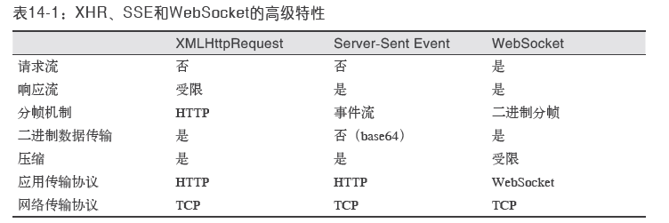
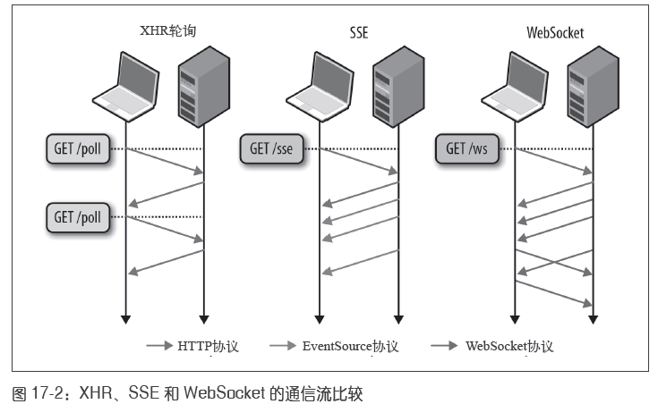
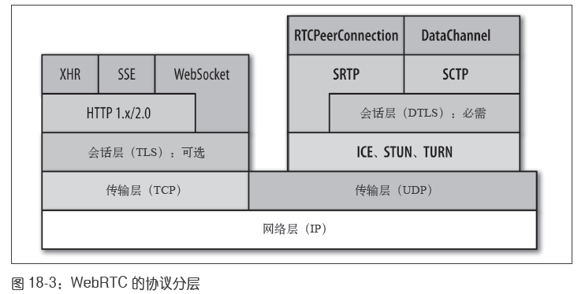

# Web 性能
## 基本概念
### 延迟的构成
- 传播延迟：发送端到接收端的时间，受光速不可超越理论的限制。与距离有关。
- 传输延迟：由传输链路的速率决定，10M文件在100Mbit/s链路上只需0.1s。与距离无关。
- 处理延迟：路由器处理分组首部，检查，确定出站路由的时间。
- 排队延迟：分组到达速度超过路由器的处理能力，那就先进入缓冲区排队等候。

上述时间之和=客户端到服务器的总延迟时间。可以使用traceroute 命令测量延迟。

### 网络核心带宽
- 一条光纤连接的总带宽，等于每个信道的数据传输速率*可复用的信道数。
- 一个信道耦合400+光线，最大容量可达171Gbit/s，一条光纤总带宽可达70Tbit/s。

### 目标：高带宽和低延迟
- 高带宽：可以多铺设光缆。
- 低延迟：time=distance/v
  - 提升v的角度：降低光纤中光信号的折射率，让光信号传输更快。然而，光纤折射率受限于材料，很容易进入瓶颈。
  - 降低距离的角度：把距离缩短。

## TCP构成
TCP的作用：在不可靠的传输信道上，提供可靠的抽象层。隐藏了丢包重发、按序发送、拥塞控制、数据完整性检验等复杂细节。

### 三次握手
- SYN：发送端随机序号x，发送到接收端。
- SYN ACK：接收端将x+1，选择随机序列号y，返回。
- ACK：发送端将y+1与x+1，并发送ACK分组。

> 示意图 https://wiki.wireshark.org/TCP_3_way_handshaking

三次握手的延迟使得创建一个新TCP连接要付出很大代价。决定了提高TCP 应用性能的关键在于重用连接。
> TCP 快速打开。

### 流量控制
为实现流量控制，TCP 连接的每一方都要通告自己的接收窗口（rwnd），其中包含能够保存数据的缓冲区空间大小
信息。

流量控制是一种预防发送端向接收端发送数据的机制。
- 浏览网页：客户端向服务器下载数据，客户端窗口成为瓶颈。
- 上传文件：客户端向服务器传送大量数据，服务器接收窗口成为瓶颈。

其中一端如果跟不上数据传输，可以向另一端通告一个较小的窗口。

Linux设置窗口缩放：
```bash
sysctl net.ipv4.tcp_window_scaling
sysctl -w net.ipv4.tcp_window_scaling=1
```

### 慢启动
发送端和接收端在连接建立之初，不知道可用带宽，需要一个估算机制来根据网络中不断变化的条件而动态改变速度。
- 拥塞窗口大小（cwnd）

根据交换数据来估算客户端与服务器之间的可用带宽是唯一的方法，这是慢启动算法的设计思路。
首先，服务器通过TCP 连接初始化一个新的拥塞窗口（cwnd）变量，
将其值设置为一个系统设定的保守值（在Linux 中就是initcwnd）。

- 慢启动

在分组被确认后增大窗口大小，慢慢地启动。最初，cwnd的值只有1 个TCP 段。
1999 年4 月，RFC 2581 将其增加到了4 个TCP 段。
2013年4 月，RFC 6928 再次将其提高到10 个TCP 段。


4 -> 8 -> 16 -> 32 -> 64 -> 开始丢包 -> 32 -> 缓慢增加cwnd。

从一个相对较小的拥塞窗口开始，每次往返令其翻倍。
而达到某个目标吞吐量所需的时间，就是客户端与服务器之间的往返时间和初始拥塞窗口大小的函数。


假设：
- 客户端和服务端接收窗口为65535字节（64KB）。
- 初始拥塞窗口：4段。
- 往返时间为56ms。


为减少增长到拥塞窗口的时间，可以
- 减少客户端与服务器的往返时间 => 利用CDN加速。
- 将初始拥塞窗口大小cwnd增加到10段。Linux 上，IW10 是2.6.39+的特性。
---
- 禁用慢启动重启（SSR）

慢启动重启的作用：在连接空闲一定时间后重置连接的拥塞窗口。
```bash
sysctl net.ipv4.tcp_slow_start_after_idle
sysctl -w net.ipv4.tcp_slow_start_after_idle=0
```
### 拥塞预防

慢启动以保守的窗口初始化连接，随后每次往返成倍提高传输的数据量，直到超过接收端的流量控制窗口，即系统
配置的拥塞阈值（ssthresh）窗口，或者有分组丢失为止，此时拥塞预防算法介入。

TCP 比例降速

- 最初，TCP 使用AIMD（Multiplicative Decrease and Additive Increase，倍减加增）
算法，发生丢包时，先将拥塞窗口减半，然后每次往返再缓慢地给窗口增加一
个固定的值。不过，很多时候AIMD 算法太过保守。

- PRR（Proportional Rate Reduction，比例降速）是RFC 6937 规定的一个新算法，
目标是改进丢包后的恢复速度。

无需按序交付数据或能够处理分组丢失的应用程序，以及对延迟或抖动要求很高的
应用程序，最好选择UDP 等协议。

### TCP优化建议
TCP 核心原理。
- TCP 三次握手增加了整整一次往返时间；
- TCP 慢启动被应用到每个新连接；
- TCP 流量及拥塞控制会影响所有连接的吞吐量；
- TCP 的吞吐量由当前拥塞窗口大小控制。
- 瓶颈一般是延迟，而不是带宽。

#### 服务器配置调优
- 增大TCP初始拥塞窗口
- 禁用慢启动重启
- 窗口缩放
- TCP快速打开

#### 应用程序行为调优
- 减少传输的数据
- 压缩必须传输的数据
- 利用CDN加速
- 重用TCP连接

## UDP构成
### 无协议服务
- 不保证消息交付
  - 不确认，不重传，无超时。
- 不保证交付顺序
  - 不设置包序号，不重排，不会发生队首阻塞。
- 不跟踪连接状态
  - 不必建立连接或重启状态机。
- 不需要拥塞控制
  - 不内置客户端或网络反馈机制。
### UDP优化建议
- 应用程序必须容忍各种因特网路径条件；
- 应用程序应该控制传输速度；
- 应用程序应该对所有流量进行拥塞控制；
- 应用程序应该使用与TCP 相近的带宽

## TLS


TLS 协议的目标是为在它之上运行的应用提供三个基本服务：加密、身份验证和数
据完整性。

### TLS握手


- 112 ms：假设两端经过协商确定了共同的版本和加密套件，客户端也把自己的证书提供给了服务器。
然后，客户端会生成一个新的对称密钥，用服务器的公钥来加密，加密后发送给服务器，告诉服务器可以开始加密通信了。
到目前为止，除了用服务器公钥加密的新对称密钥之外，所有数据都以明文形式发送。
- 140 ms：服务器解密出客户端发来的对称密钥，通过验证消息的MAC 检
测消息完整性，再返回给客户端一个加密的“Finished”消息。
- 168 ms：客户端用它之前生成的对称密钥解密这条消息，验证MAC，如果一切
顺利，则建立信道并开始发送应用数据。

每一个TLS连接在TCP 握手基础上最多还需要两次额外的往返。

## 浏览器的优化建议

- 基于文档的优化

熟悉网络协议，了解文档、CSS 和JavaScript 解析管道，发现和优先安排关键网
络资源，尽早分派请求并取得页面，使其尽快达到可交互的状态。主要方法是优
先获取资源、提前解析等。
- 推测性优化

浏览器可以学习用户的导航模式，执行推测性优化，尝试预测用户的下一次操作。然后，预先解析DNS、预先连接可能的目标。

---
大多数浏览器都利用了如下四种技术。

- 资源预取和排定优先次序

文档、CSS 和JavaScript 解析器可以与网络协议层沟通，声明每种资源的优先
级：初始渲染必需的阻塞资源具有最高优先级，而低优先级的请求可能会被临时
保存在队列中。
- DNS预解析

对可能的域名进行提前解析，避免将来HTTP 请求时的DNS 延迟。预解析可以
通过学习导航历史、用户的鼠标悬停，或其他页面信号来触发。
- TCP预连接

DNS 解析之后，浏览器可以根据预测的HTTP 请求，推测性地打开TCP 连接。
如果猜对的话，则可以节省一次完整的往返（TCP 握手）时间。
- 页面预渲染

某些浏览器可以让我们提示下一个可能的目标，从而在隐藏的标签页中预先渲染
整个页面。这样，当用户真的触发导航时，就能立即切换。

```
<link rel="dns-prefetch" href="//hostname_to_resolve.com"> ➊
<link rel="subresource" href="/javascript/myapp.js"> ➋
<link rel="prefetch" href="/images/big.jpeg"> ➌
<link rel="prerender" href="//example.org/next_page.html"> ➍
➊ 预解析特定的域名
➋ 预取得页面后面要用到的关键性资源
➌ 预取得将来导航要用的资源
➍ 根据对用户下一个目标的预测，预渲染特定页面
```
## HTTP 发展史
- HTTP 0.9：只有一行的ASCII 请求，用于取得一个超文本文档。
- HTTP 1.0：增加了请求和响应首部，双方能够交换有关请求和响应的元信息。
- HTTP 1.1：服务器和客户端可以扩展首部，始终以纯文本形式发送。

## HTTP 1.x
- 减少DNS查询
- 减少HTTP请求
- 使用CDN
- Gzip资源
- 避免HTTP重定向
- 添加Expires首部并配置ETag 及Last-Modified 首部
- 域名分区，突破每主机并行连接数的限制，代价是额外DNS查询

### 连接与拼合
- 连接：把多个JavaScript 或CSS 文件组合为一个文件。
- 拼合：把多张图片组合为一个更大的复合的图片。

降低网络请求次数，代价是缓存很难利用，资源也不容易更新。

## HTTP 2.0
HTTP 2.0 的目的：
- 请求与响应的多路复用来减少延迟
- 压缩HTTP首部字段将协议开销降低
- 增加对请求优先级和服务器端推送的支持
- 其他协议层面的辅助实现，比如新的流量控制、错误处理和更新机制
- 新的二进制分帧数据层

### 二进制分帧层
HTTP 1.x 以换行符作为纯文本的分隔符，而HTTP 2.0 将所有传输的信息分割为更小的消息和帧，采用二进制编码。
不兼容之前的HTTP 1.x，所以称为2.0。


二进制分帧


- 16 位的长度前缀意味着一帧大约可以携带64 KB 数据，不包括8 字节首部。
- 8 位的类型字段决定如何解释帧其余部分的内容。
- 8 位的标志字段允许不同的帧类型定义特定于帧的消息标志。
- 1 位的保留字段始终置为0。
- 31 位的流标识符唯一标识HTTP 2.0 的流。

### 流、消息和帧


- 所有通信都在一个TCP 连接上完成。
- 流是连接中的一个虚拟信道，可以承载双向的消息；每个流都有一个唯一的整数标识符（1、2…N）。
- 消息是指逻辑上的HTTP 消息，比如请求、响应等，由一或多个帧组成。
- 帧是最小的通信单位，承载着特定类型的数据，如HTTP 首部、负荷，等等。

### 多向请求和响应


图12-3 中包含了同一个连接上多个传输中的数据流：客户端正在向服务器传输一个
DATA 帧（stream 5），与此同时，服务器正向客户端乱序发送stream 1 和stream 3
的一系列帧。一个连接上有3 个请求/ 响应并行交换！

- 可以并行交错地发送请求，请求之间互不影响；
- 可以并行交错地发送响应，响应之间互不干扰；
- 只使用一个连接即可并行发送多个请求和响应；
- 消除不必要的延迟，从而减少页面加载的时间；
- 不必再为绕过HTTP 1.x 限制而多做很多工作；

### 请求优先级
- 0 表示最高优先级；
- 2^31-1 表示最低优先级。

### 首部差异化编码


## 经典性能优化最佳实践
- 减少DNS查找

每一次主机名解析都需要一次网络往返，从而增加请求的延迟时间，同时还会阻
塞后续请求。

- 重用TCP连接

尽可能使用持久连接，以消除TCP 握手和慢启动延迟。

- 减少HTTP重定向

HTTP 重定向极费时间，特别是不同域名之间的重定向，更加费时；这里面既有
额外的DNS 查询、TCP 握手，还有其他延迟。最佳的重定向次数为零。

- 使用CDN（内容分发网络）

把数据放到离用户地理位置更近的地方，可以显著减少每次TCP 连接的网络延
迟，增大吞吐量。这一条既适用于静态内容，也适用于动态内容。

- 去掉不必要的资源

任何请求都不如没有请求快。

- 在客户端缓存资源

应该缓存应用资源，从而避免每次请求都发送相同的内容。

- 传输压缩过的内容

传输前应该压缩应用资源，把要传输的字节减至最少：确保对每种要传输的资源
采用最好的压缩手段。

- 消除不必要的请求开销

减少请求的HTTP 首部数据（比如HTTP cookie），节省的时间相当于几次往返
的延迟时间。

- 并行处理请求和响应

请求和响应的排队都会导致延迟，无论是客户端还是服务器端。

- 针对协议版本采取优化

HTTP 1.x 支持有限的并行机制，要求打包资源、跨域分散资源，等等。
HTTP 2.0 只要建立一个连接就能实现最优性能，同时无需针对HTTP 1.x 的
那些优化方法。

额外补充：
```
启用Chrome开发者工具的 Priority 列。
尽可能减少所需的关键请求的数量。
检查哪些请求必须在用户看到完整渲染的页面之前发出。使用 <link rel="preload" /> 对这些关键请求进行优先处理。
使用 link prefetching[16]，优化可能在下一个导航中使用的资源。
使用 Link Preload HTTP headers[17] 声明要在 HTML 完全交付之前预加载的资源。
图片懒加载。并确保图像尺寸正确的提前写好，避免布局抖动。
使用内联 SVG 展示 Logo 和图标。
使用更好的图像格式，如 AVIF 或 WEBP。
使用 font-display: swap 在初始渲染中展示文本。
使用压缩的字体格式，如 WOFF2 或 variable fonts（可变形字体）。
在 Chrome://net-internals/#events 中查看 Chrome 的网络事件。
```

### 在客户端缓存资源
- Cache-Control 首部用于指定缓存时间；
- Last-Modified 和ETag 首部提供验证机制。
- 应同时指定缓存时间和验证方法

### 消除不必要的请求字节
- 浏览器会在每个请求中自动附加关联的cookie 数据；
- 在HTTP 1.x 中，包括cookie 在内的所有HTTP 首部都会在不压缩的状态下传输；
- 在HTTP 2.0 中，这些元数据经过压缩了，但开销依然不小；
- 最坏的情况下，过大的HTTP cookie 会超过初始的TCP 拥塞窗口，从而导致多
余的网络往返。

### 针对HTTP 1.x的优化建议
- 利用HTTP管道

如果你的应用可以控制客户端和服务器这两端，那么使用管道可以显著减少网络延迟。

- 采用域名分区

如果你的应用性能受限于默认的每来源6 个连接，可以考虑将资源分散到多个来源。

- 打包资源以减少HTTP请求

拼接和精灵图等技巧有助于降低协议开销，又能达成类似管道的性能提升。

- 嵌入小资源

考虑直接在父文档中嵌入小资源，从而减少请求数量。

## 浏览器网络概述
### 高层浏览器网络API、协议和服务


### Socket Pool


### XHR、SSE、Websocket


## XMLHttpRequest

### XHR下载数据
- ArrayBuffer 固定长度的二进制数据缓冲区。
-  Blob 二进制大对象或不可变数据。
-  Document 解析后得到的HTML 或XML 文档。
-  JSON 表示简单数据结构的JavaScript 对象。
-  Text 简单的文本字符

下载blob示例
```js
var xhr = new XMLHttpRequest();
xhr.open('GET', '/images/photo.webp');
xhr.responseType = 'blob'; ➊
xhr.onload = function() {
  if (this.status == 200) {
    var img = document.createElement('img');
    img.src = window.URL.createObjectURL(this.response); ➋
    img.onload = function() {
      window.URL.revokeObjectURL(this.src); // ➌ 图片加载完毕后释放对象
    }
    document.body.appendChild(img);
  }
};
xhr.send();
```

### 监控下载和上传进度
|事件类型|说明|触发次数|
|---|---|---|
|loadstart |传输已开始|一次|
|progress| 正在传输|零或多次|
|error |传输出错|零或多次|
|abort |传输终止|零或多次|
|load |传输成功|零或多次|
|loadend |传输完成|一次|

### XHR轮询
```js
// 每个XHR 请求都是一次独立的HTTP 请求
function checkUpdates(url) {
  var xhr = new XMLHttpRequest();
  xhr.open('GET', url);
  xhr.onload = function() { ... }; 
  xhr.send();
}
setInterval("checkUpdates('/updates'), 60000");
```
### XHR长轮询

```js
function checkUpdates(url) {
  var xhr = new XMLHttpRequest();
  xhr.open('GET', url);
  xhr.onload = function() { ➊
    ...
    checkUpdates('/updates'); ➋
  };
  xhr.send();
}
checkUpdates('/updates'); ➌
//➊ 处理更新并打开新的长轮询XHR
//➋ 发送长轮询请求并等待下次更新（如此不停循环）
//➌ 发送第一次长轮询XHR 请求
```

### XHR的缺点
- XHR 标准从未考虑流式数据处理的场景，对它的支持也有限。
造成了通过XHR 进行流式数据传输既低效，又不方便。
- 定时轮询会导致高开销及更新延迟。
长轮询的延迟低，但每次更新仍然有开销，因为每次更新都需要一次HTTP 请求。

## Server-Sent Events(SSE)
EventSource 接口通过一个简单的浏览器API 隐藏了所有的底层细节，包括建立连接
和解析消息。
```js
var source = new EventSource("/path/to/stream-url"); ➊
source.onopen = function () { ... }; ➋
source.onerror = function () { ... }; ➌
source.addEventListener("foo", function (event) { ➍
  processFoo(event.data);
});
source.onmessage = function (event) { ➎
  log_message(event.id, event.data);
  if (event.id== "CLOSE") {
    source.close(); ➏
  }
}
```
> Event Stream协议

## Websocket
SSE 作为一种服务器向客户端传送文本数据的机制。如果你想传输二进制数据，WebSocket 才是更
合适的选择。




- XHR 是专门为“事务型”请求/响应通信而优化的：客户端向服务器发送完整
的、格式良好的HTTP 请求，服务器返回完整的响应。这里不支持请求流，在
Streams API 可用之前，没有可靠的跨浏览器响应流API。
- SSE 可以实现服务器到客户端的高效、低延迟的文本数据流：客户端发起 SSE 连
接，服务器使用事件源协议将更新流式发送给客户端。客户端在初次握手后，不
能向服务器发送任何数据。
- WebSocket 是唯一一个能通过同一个TCP 连接实现双向通信的机制（图17-2），客户端和服务器随时可以交换数据。
WebSocket 在两个方向上都能保证文本和二进制应用数据的低延迟交付。

## WebRTC
### WebRTC 的音频和视频引擎

### MediaStream


### 音频（Opus）与视频（VP8）比特率
当前的WebRTC 实现使用Opus和VP8 编解码器：
-  Opus 编解码器用于音频，支持固定和可变的比特率编码，适合的带宽范围为
6~510 Kbit/s。这个编解码器可以无缝切换，以适应不同的带宽。
- VP8 编解码器用于视频编码，要求带宽为100~2000+ Kbit/s，比特率取决于
流的品质：
  - 720p，30 FPS：1.0~2.0 Mbit/s
  - 360p，30 FPS：0.5~1.0 Mbit/s
  - 180p，30 FPS：0.1~0.5 Mbit/s

### 实时网络传输
UDP首选。


> - Chrome 为检查WebRTC 连接提供了一个工具。chrome://webrtc-internals
> - 参考simpleWebRTC 的文档(http://simplewebrtc.com/)

### 通过SRTP和SRTCP交付媒体


## 清单

- [x] 缓存
  - [x] 客户端缓存：service worker
  - [x] 服务器缓存：通过 HTTP 报文协议控制
- [x] 资源预加载
  - [x] DNS-prefetch
  - [x] resource prefetch
- [x] 资源懒加载
  - [x] 图片懒加载
- [x] 文件压缩：代码压缩，网页资源压缩
- [x] 保证JS不阻塞页面渲染，合理使用script标签的async（异步下载，下载完就执行）和defer(等待DOM渲染完成）属性
- [x] 适当使用 SVG 或者 icon font
- [x] 使用 srcset 提供浏览器更多的图片源选择，使用src作为fallback
- [x] 背景图片使用 media-query 提供不同尺寸的下载源