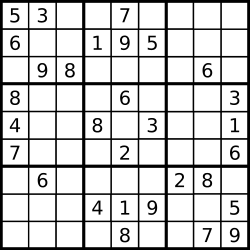
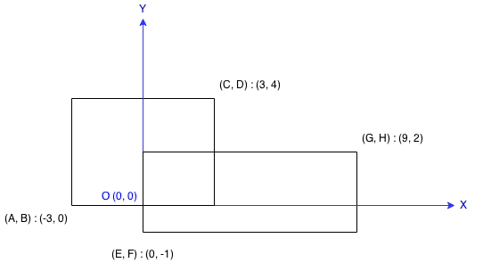

# docs

## 1.Two Sum

Example:
Given nums = [2, 7, 11, 15], target = 9,

Because nums[0] + nums[1] = 2 + 7 = 9,
return [0, 1].

``` js
/**
 * @param {number[]} nums
 * @param {number} target
 * @return {number[]}
 */
var twoSum = function(nums, target) {
    var hash={};
    for(var i=0;i<nums.length;i++){
        // 数组元素的值为 name, 数组坐标为 value
        hash[nums[i]]=i;
    }
    
    for(var j=0;j<nums.length;j++){
        var first=nums[j];
        var second=target-first;
        if(hash.hasOwnProperty(second)&&hash[second]!==j){
            return [j,hash[second]];
        }
    }
};
```

## 7. Reverse Integer

Reverse digits of an integer.

```
Example1: x = 123, return 321
Example2: x = -123, return -321
```

- If the integer's last digit is 0, what should the output be? ie, cases such as 10, 100.

- Assume the input is a 32-bit integer, then the reverse of 1000000003 overflows. Returns 0 when the reversed integer
  overflows.

``` js
/**
 * @param {number} x
 * @return {number}
 */
var reverse = function(x) {
    if(x===0) return x;
    if(x>0){
        var str=x.toString().split('').reverse().join('');
        var res=parseInt(str,10);
        return res>Math.pow(2,31)?0:res;
    }
    
    if(x<0){
        var str2=x.toString();
        // remove "-" sign symbol
        str2=str2.substr(1,str2.length);
        str2=str2.split('').reverse().join('');
        var res2=parseInt(str2,10);
        return res2>Math.pow(2,31)?0:(-1)*res2;
    }
};
```

## 8. atoi

``` js
/**
 * @param {string} str
 * @return {number}
 */
var myAtoi = function(str) {
    // 预处理：去除字符串首尾空格，并按空格分割成数组 a。
    var a=str.trim().split(' ');
  
    var digits='0123456789';
    // 如果分割后第一个字符串 a[0] 长度为 0，返回 0。
    if(a[0].length===0){
        return 0;
    }else if(a[0].length===1){
        // 如果长度为 1 且不是数字，返回 0；是数字则直接返回该数字。
        if(digits.indexOf(a[0][0])===-1){
            return 0;
        }else{
            return +a[0][0];
        }
    }else{
        // 处理符号与数字（长度 ≥2）：
        
        // 检查首字符是否为 + 或 -，如果是则提取为 sign，并移除该字符。
        var sign="";
        if(a[0][0]==="+"||a[0][0]==="-"){
            sign=a[0][0];
            a[0]=a[0].substr(1,a[0].length);
        }
        // 遍历剩余字符串，将连续的数字字符拼接为字符串 ret（遇到非数字停止）。
        var ret="";
        for(var i=0,len=a[0].length;i<len;i++){
            if(digits.indexOf(a[0][i])!==-1){
                ret+=a[0][i];
            }else{
                break;
            }
        }

        // 数值转换：手动计算 ret 的数值（从个位开始累加幂运算）
        var sum=0;
        var len2=ret.length;
        for(var j=len2-1;j>=0;j--){
            sum+=ret[j]*Math.pow(10,len2-j-1);
        }
        // 符号与溢出处理：
        //  - 将 sign 与数值合并。
        //  - 通过 Math.max 和 Math.min 将结果限制在 32 位有符号整数范围 [-2^31, 2^31-1] 内。
        sum=sign?(Number)(sign+sum):sum;
        return Math.max(Math.min(sum,Math.pow(2,31)-1),-1*Math.pow(2,31));
    }
};
```

## 9. Palindrome Number

Determine whether an integer is a palindrome. Do this without extra space.

```js
/**
 * @param {number} x
 * @return {boolean}
 */
var isPalindrome = function (x) {
        // 0 是回文数，直接返回 true
        if (x === 0) {
            return true;
        }
        // 为负数，或者为 10 的倍数，都不是回文数
        if (x < 0 || x % 10 === 0) {
            return false;
        }

        // 示例：x = 121
        // 第 1 轮：ret = 0*10 + 1 = 1，x = 12
        // 第 2 轮：ret = 1*10 + 2 = 12，x = 1
        // 第 3 轮：ret = 12*10 + 1 = 121，x = 0

        var copyX = x;
        var ret = 0;
        while (x) {
            // x % 10 取末位数字。
            // x 的末尾将是 ret 的首位，两者收集的方向是相反 / 对称的。
            ret = ret * 10 + x % 10;
            // parseInt(x / 10) 去掉 x 的末位    
            x = parseInt(x / 10);
        }
        return copyX === ret;
    };
```

## 13. Roman to Integer

Given a roman numeral, convert it to an integer.
Input is guaranteed to be within the range from 1 to 3999.

```java
public class Solution {
    public int romanToInt(String s) {
        // 参考链接:https://discuss.leetcode.com/topic/49331/my-accepted-simple-java-solution-with-switch-case-so-easy
        // pre means previous Roman character, cur means current character
        int pre = 0, cur = 0, result = 0; 
        for(int i=0; i< s.length(); i++){
            // 每个字符串转化为十进制数
            switch(s.charAt(i)){
                case 'M': cur = 1000;
                    break;
                case 'D': cur = 500;
                    break;
                case 'C': cur = 100;
                    break;
                case 'L': cur = 50;
                    break;
                case 'X': cur = 10;
                    break;
                case 'V': cur = 5;
                    break;
                case 'I': cur = 1;
                    break;
            }

            // 罗马数字规则：小数在大数左边表示减法（如 IV = 4），小数在大数右边表示加法（如 VI = 6）。
            // 如果不做特殊处理，遍历过程会变成：
            // 1. 遇到 I：result = 0 + 1 = 1，pre = 1
            // 2. 遇到 V：发现 cur(5) > pre(1)，此时需要把之前加的 1 减掉，再正确计算 5-1
            // result = (result - pre) + (cur - pre) 的计算：
            //   result - pre = 1 - 1 = 0（撤销之前错误加的 1）
            //   cur - pre = 5 - 1 = 4（正确的减法结果）

            // 如果右边 cur 比左边 pre 大，需要加上 (cur-pre)；此外，(result-pre) 表示抵消之前加上左边的结果
            if(cur > pre){
                result = (result-pre) + (cur-pre);
            }else{// 如果右边 cur 比左边 pre 小，直接加
                result += cur ; 
            }
            // 更新 pre
            pre = cur ;
        }
        return result;
    }
}
```

## 14. Longest Common Prefix

Write a function to find the longest common prefix string amongst an array of strings.

```js
/**
 * @param {string[]} strs
 * @return {string}
 */
var longestCommonPrefix = function (strs) {
        // 数组为空，直接返回空字符串。
        if (strs.length === 0) {
            return "";
        }

        // 取第一个字符串作为基准 str1。
        // 如果第一个字符串本身就是空字符串，公共前缀只能是空字符串。
        var str1 = strs[0];
        if (str1.length === 0) {
            return "";
        }

        // 从第二个字符串开始遍历，然后和 str1 对比
        for (var i = 1; i < strs.length; i++) {
            var str2 = strs[i];
            var index = 0;
            while (str1[index] === str2[index] && index < str1.length) {
                index++;
            }
            str1 = str1.substr(0, index);
        }

        return str1;
    };
```

## 19. Remove Nth Node From End of List

Given a linked list, remove the nth node from the end of list and return its head.

For example,

```
   Given linked list: 1->2->3->4->5, and n = 2.
   After removing the second node from the end, the linked list becomes 1->2->3->5.
```

**Note**:
Given n will always be valid. Try to do this in one pass.

```js
/**
 * Definition for singly-linked list.
 * function ListNode(val) {
 *     this.val = val;
 *     this.next = null;
 * }
 */
/**
 * @param {ListNode} head
 * @param {number} n
 * @return {ListNode}
 */
var removeNthFromEnd = function (head, n) {
    // case 1: find 变为 null，说明要删除的是头节点（倒数第 n 个节点就是头节点）。
    // 1->2->null, n=2
    // find=null(find.next=null),use head=head.next to remove 1

    // case 2: find.next 为 null，说明要删除的是正数第 2 个节点。
    // 1->2->3->null, n=2
    // find=3,find.next=null,use head.next=head.next.next to remove 2

    // case 3: 其他情况，递归处理子链表 head.next。
    // 1->2->3->4->null, n=2
    // find=3,find.next=4,use recursion to 2->3->4->null,that mean call ``removeNthFromEnd(head.next, n)``

    if (head === null) {
        return head;
    }

    var find = head;
    // get find and find.next
    for (var i = 0; i < n; i++) {
        find = find.next;
    }

    if (find === null) {//case 1
        head = head.next;
    } else if (find.next === null) {//case 2
        head.next = head.next.next;
    } else {//case 3
        removeNthFromEnd(head.next, n);
    }

    return head;
};
```

## 20. Valid Parentheses

Given a string containing just the characters `'('`, `')'`, `'{'`, `'}'`, `'['` and `']'`, determine if the input string
is valid.

The brackets must close in the correct order, `"()"` and `"()[]{}"` are all valid but `"(]"` and `"([)]"` are not.

```js
/**
 * @param {string} s
 * @return {boolean}
 */
var isValid = function (s) {
        // helper: check match
        function match(open, close) {
            var opens = '([{';
            var closes = ')]}';
            return opens.indexOf(open) === closes.indexOf(close);
        }

        // helper: simulate stack
        function Stack() {
            var items = [];

            this.push = function (x) {
                items.push(x);
            }

            this.pop = function () {
                return items.pop();
            }

            this.isEmpty = function () {
                return items.length === 0;
            }
        }

        var len = s.length;
        var index = 0;
        var valid = true;
        var stack = new Stack();
        var pop,
            char;
        while (index < len && valid) {
            char = s[index];
            // opens char
            if (char === '(' || char === '[' || char === '{') {
                stack.push(char);
            } else {//closes char
                // no char in stack to match this char
                if (stack.isEmpty()) {
                    valid = false;
                } else {
                    pop = stack.pop();
                    if (!match(pop, char)) {
                        valid = false;
                    }
                }
            }
            index++;
        }

        return !!(valid && stack.isEmpty());
    };
```

## 21. Merge Two Sorted Lists

Merge two sorted linked lists and return it as a new list. The new list should be made by splicing together the nodes of
the first two lists.

```js
/**
 * Definition for singly-linked list.
 * function ListNode(val) {
 *     this.val = val;
 *     this.next = null;
 * }
 */
/**
 * @param {ListNode} l1
 * @param {ListNode} l2
 * @return {ListNode}
 */
var mergeTwoLists = function (l1, l2) {
    if (l1 === null) {
        return l2;
    }

    if (l2 === null) {
        return l1;
    }

    if (l1.val < l2.val) {
        l1.next = mergeTwoLists(l1.next, l2);
        return l1;
    } else {
        l2.next = mergeTwoLists(l1, l2.next);
        return l2;
    }
};
```

## 24. Swap Nodes in Pairs

Given a linked list, swap every two adjacent nodes and return its head.

For example,
Given ``1->2->3->4``, you should return the list as ``2->1->4->3``.

Your algorithm should use only **constant space**. You may not modify the values in the list, **only nodes itself can be
changed**.

```js
/**
 * Definition for singly-linked list.
 * function ListNode(val) {
 *     this.val = val;
 *     this.next = null;
 * }
 */
/**
 * @param {ListNode} head
 * @return {ListNode}
 */
var swapPairs = function (head) {
    // https://discuss.leetcode.com/topic/51162/simple-0ms-c-solution-beats-98-08

    // 链表为空或只有一个节点，无需交换，直接返回。
    if (head === null || head.next === null) {
        return head;
    }

    // 创建虚拟头节点 dummy，其 next 指向原链表头 head。
    // prev 指针初始指向 dummy，它始终指向待交换节点对的前一个节点。
    var dummy = new ListNode(0);
    dummy.next = head;
    var prev = dummy;

    // 循环条件：当前节点 head 及其下一个节点 head.next 都存在（即有至少两个节点可交换）
    while (head && head.next) {
        // 保存 head.next.next（即下一对节点的起始节点），防止丢失。
        var tmp = head.next.next;
        // 让前一个节点的 next 指向这对节点中的第二个节点。
        prev.next = head.next;
        // 将 head.next.next 指向 head，即让第二个节点的 next 指向第一个节点（完成交换）。
        head.next.next = head;
        // 将 head.next 指向之前保存的 tmp，即让原 head（即交换后的第二个节点 ）的 next 指向下一对节点
        head.next = tmp;

        // 更新指针：
        // prev 移动到当前这对节点的第二个节点，也是下一对节点的前驱
        // head 移动到下一对节点的起始节点 tmp，继续循环。
        prev = head;
        head = tmp;
    }

    // 返回虚拟头节点的 next，即交换后链表的新头节点
    return dummy.next;
};
```

## 26. Remove Duplicates from Sorted Array

Given a sorted array, remove the duplicates in place such that each element appear only once and return the new length.

Do not allocate extra space for another array, you must do this in place with constant memory.

For example,
Given input array nums = ``[1,1,2]``,

Your function should return length = ``2``, with the first two elements of nums being ``1`` and ``2`` respectively. It
doesn't matter what you leave beyond the new length.

```js
/**
 * @param {number[]} nums
 * @return {number}
 */
var removeDuplicates = function (nums) {
        // 空数组处理
        if (nums.length === 0) return 0;

        // 双指针解法

        // i 指针遍历数组
        // index 指针标记下一个不重复元素应该存放的位置

        // index 从 1 开始，因为第一个元素（下标 0）一定保留，无需处理。
        var index = 1;
        for (var i = 0, len = nums.length; i < len - 1; i++) {
            // 遍历数组，比较相邻元素 nums[i] 和 nums[i+1]。
            // 如果不相等，说明 nums[i+1] 是新的不重复元素，将其复制到 nums[index] 位置，然后 index 加 1。
            if (nums[i] !== nums[i + 1]) {
                nums[index++] = nums[i + 1];
            }
            // 如果相等，跳过（不做任何操作）。
        }

        nums = nums.slice(0, index);
        return index;
    };
```

执行示例：

```
nums = [1, 1, 2]

初始: index = 1

i=0: nums[0]=1, nums[1]=1 → 相等，跳过
i=1: nums[1]=1, nums[2]=2 → 不等，执行 nums[1] = nums[2] → nums = [1,2,2], index=2

循环结束
slice(0,2) → [1,2]
返回 2
```

## 27. Remove Element

Given an array and a value, remove all instances of that value in place and return the new length.

Do not allocate extra space for another array, you must do this in place with constant memory.

The order of elements can be changed. It doesn't matter what you leave beyond the new length.

**Example**:
Given input array nums = ``[3,2,2,3]``, val = ``3``

Your function should return length = 2, with the first two elements of nums being 2.

**Hint**:

- Try two pointers.
- Did you use the property of "the order of elements can be changed"?
- What happens when the elements to remove are rare?

```js
/**
 * @param {number[]} nums
 * @param {number} val
 * @return {number}
 */
var removeElement = function (nums, val) {
        var index = 0;
        for (var i = 0, len = nums.length; i < len; i++) {
            if (nums[i] === val) {
                continue;
            } else {//not equal to val
                nums[index++] = nums[i];
            }

        }
        nums = nums.slice(0, index);
        return index;
    };
```

## 28. Implement strStr()

Implement strStr().
Returns the index of the first occurrence of needle in haystack, or -1 if needle is not part of haystack.

等于实现 str.indexOf()

```js
/**
 * @param {string} haystack
 * @param {string} needle
 * @return {number}
 */
var strStr = function (haystack, needle) {
        var len1 = haystack.length;
        var len2 = needle.length;
        if (len2 > len1) {
            return -1;
        } else if (len2 === 0) {
            return 0;
        } else {
            var threshold = len1 - len2;
            for (var i = 0; i <= threshold; i++) {
                if (haystack.substr(i, len2) === needle) {
                    return i;
                }
            }
            return -1;
        }
    };
```

## 36. Valid Sudoku

Determine if a Sudoku is valid, according to: Sudoku Puzzles - The Rules.

The Sudoku board could be partially filled, where empty cells are filled with the character ``'.'``.



A partially filled sudoku which is valid.

Note:
A valid Sudoku board (partially filled) is not necessarily solvable. Only the filled cells need to be validated.

```js
/**
 * @param {character[][]} board
 * @return {boolean}
 */
var isValidSudoku = function (board) {
        // Sudoku Puzzles - The Rules
        // 1. Each row must have the numbers 1-9 occuring just once.
        // 2. Each column must have the numbers 1-9 occuring just once.
        // 3. And the numbers 1-9 must occur just once in each of the 9 sub-boxes of the grid
        // (row:) 0 1 2 3 4 5 6 7 8      
        // ============================(columon:)
        // =       =        =         =0
        // =   0   =   1    =    2    =1
        // =       =        =         =2
        // ============================3
        // =       =        =         =4
        // =   3   =   4    =    5    =5
        // =       =        =         =6
        // ============================7
        // =       =        =         =8
        // =   6   =   7    =    8    =
        // =       =        =         =
        // ============================


        // use two loop to traverse every cells,escape '.'
        // for every digit cell,check row,column,block constraint
        var setX = [],
            setY = [],
            setB = [];
        for (var i = 0; i < 9; i++) {
            setX[i] = new Set();
            setY[i] = new Set();
            setB[i] = new Set();
        }

        for (var j = 0; j < 9; j++) {
            for (var k = 0; k < 9; k++) {
                if (board[j][k] === '.') {
                    continue;
                }
                // row check
                if (setX[j].has(board[j][k])) {
                    return false;
                } else {
                    setX[j].add(board[j][k]);
                }

                // column check
                if (setY[k].has(board[j][k])) {
                    return false;
                } else {
                    setY[k].add(board[j][k]);
                }

                // sub-box check
                // 判断关键： board[j][k] 究竟属于哪一个 box 区域。
                // j 表示行 index，j/3 表示之前经过的行数，由于一行有 3 个 box，因此 *3
                if (setB[parseInt(k / 3) + parseInt(j / 3) * 3].has(board[j][k])) {
                    return false;
                } else {
                    setB[parseInt(k / 3) + parseInt(j / 3) * 3].add(board[j][k]);
                }
            }
        }

        return true;
    };
```

## 66. Plus One

Given a non-negative number represented as an array of digits, plus one to the number.

The digits are stored such that the most significant digit is at the head of the list.

```java
public class Solution {
    public int[] plusOne(int[] digits) {
        // 这段代码实现数组形式的整数加一。
        // 从数组末尾（最低位）开始向前遍历：
        // a) 如果当前位小于 9，直接加一后返回数组
        // b) 如果当前位等于 9，将其置为 0，继续处理前一位（进位）
       int len=digits.length;
       for(int i=len-1;i>=0;i--){
           // 当前位置小于 9，加 1，返回
           if(digits[i]<9){
               digits[i]++;
               return digits;
           }
           // 当前位置为 9，置为 0
           digits[i]=0;
       }
       
       // 代码运行到这里，代表是该数组数字全为 9，需要进位，添加前置 1
       int[] newDigits=new int[len+1];
       newDigits[0]=1;
       return newDigits;
    }
}
```

## 67. Add Binary

Given two binary strings, return their sum (also a binary string).

For example,

```
a = "11"
b = "1"
Return "100".
```

```js
/**
 * 实现两个二进制字符串的加法。
 * 从最低位（字符串末尾）开始逐位相加，处理进位，结果逐位拼接到字符串前端。
 *
 * @param {string} a
 * @param {string} b
 * @return {string}
 */
var addBinary = function (a, b) {
        var lena = a.length;
        var lenb = b.length;

        var i = 0;
        var carry = 0;
        var res = "";
        while (i < lena || i < lenb || carry !== 0) {
            var ai = (i < lena) ? +a[lena - 1 - i] : 0;
            var bi = (i < lenb) ? +b[lenb - 1 - i] : 0;
            // (ai+bi+carry)%2 is the sum of current position
            // +res 表示在末尾附加之前的计算结果
            res = (ai + bi + carry) % 2 + res;
            // get carry for next higher position
            carry = parseInt((ai + bi + carry) / 2);
            i++;
        }
        return res;
    };
```

## 83. Remove Duplicates from Sorted List

Given a sorted linked list, delete all duplicates such that each element appear only once.

For example,
Given ``1->1->2``, return ``1->2``.

Given ``1->1->2->3->3``, return ``1->2->3``.

```js
/**
 * Definition for singly-linked list.
 * function ListNode(val) {
 *     this.val = val;
 *     this.next = null;
 * }
 */
/**
 * @param {ListNode} head
 * @return {ListNode}
 */
var deleteDuplicates = function (head) {

    // head 为空，或者只有 head 一个节点，直接返回 head
    if (head === null || head.next === null) {
        return head;
    }

    var tmp = head;
    while (tmp !== null && tmp.next !== null) {
        if ((tmp.val) === (tmp.next.val)) {
            // 删除 tmp.next 节点
            tmp.next = tmp.next.next;
        } else if (tmp.val !== tmp.next.val) {
            // 指针右移
            tmp = tmp.next;
        }
    }

    return head;
};
```

## 88. Merge Sorted Array

Given two sorted integer arrays nums1 and nums2, merge nums2 into nums1 as one sorted array.

**Note**:

You may assume that nums1 has enough space (size that is greater or equal to m + n) to hold additional elements from
nums2. The number of elements initialized in nums1 and nums2 are m and n respectively.

```js
/**
 * @param {number[]} nums1
 * @param {number} m
 * @param {number[]} nums2
 * @param {number} n
 * @return {void} Do not return anything, modify nums1 in-place instead.
 */
var merge = function (nums1, m, nums2, n) {
        // 将两个有序数组合并到第一个数组，且从后往前填充，避免覆盖未处理的元素。

        // 核心思路
        // - 从 nums1 的末尾开始向前填充（索引 len-1 到 0）
        // - 每次比较两个数组当前元素（从各自末尾开始），将较大的放入 nums1 的末尾
        // - 使用 m-- 和 n-- 向前移动指针

        var len = m + n;
        // 两个数组都定位到最后一个元素位置
        m--;
        n--;
        // len times loop
        while (len--) {
            // n < 0：如果 nums2 已取完，直接将 nums1 剩余元素复制过去
            if (n < 0 || nums1[m] > nums2[n]) {
                nums1[len] = nums1[m--];
            } else {
                nums1[len] = nums2[n--];
            }
        }

        // 结果是升序排列的数组
    };
```

## 100. Same Tree

Given two binary trees, write a function to check if they are equal or not.

Two binary trees are considered equal if they are structurally identical and the nodes have the same value.

```js
/**
 * Definition for a binary tree node.
 * function TreeNode(val) {
 *     this.val = val;
 *     this.left = this.right = null;
 * }
 */
/**
 * @param {TreeNode} p
 * @param {TreeNode} q
 * @return {boolean}
 */
var isSameTree = function (p, q) {
    // 相应位置两个节点一个为 null，一个不为 null，代表不等
    if (p === null && q !== null) {
        return false;
    }
    // 相应位置两个节点一个为 null，一个不为 null，代表不等
    if (p !== null && q === null) {
        return false;
    }

    // 相应位置两个节点都为 null，代表相等
    if (p === null && q === null) {
        return true;
    }

    // 相应位置两个节点都不为 null，那么比较它们的值
    if (p !== null && q !== null) {
        // 值不等，代表不等
        if (p.val !== q.val) {
            return false;
        }
        // 值相等，递归左右子树
        else {
            return isSameTree(p.left, q.left) && isSameTree(p.right, q.right);
        }
    }

};
```

## 101. Symmetric Tree

Given a binary tree, check whether it is a mirror of itself (ie, symmetric around its center).

For example, this binary tree ``[1,2,2,3,4,4,3]`` is symmetric:

```
    1
   / \
  2   2
 / \ / \
3  4 4  3
```

But the following ``[1,2,2,null,3,null,3]`` is not:

```
    1
   / \
  2   2
   \   \
   3    3
```

**Note**:
Bonus points if you could solve it both recursively and iteratively.

- recursively

```js
/**
 * Definition for a binary tree node.
 * function TreeNode(val) {
 *     this.val = val;
 *     this.left = this.right = null;
 * }
 */
/**
 * @param {TreeNode} root
 * @return {boolean}
 */
var isSymmetric = function (root) {
    if (!root) {
        return true;
    }

    function recursiveCheck(left, right) {
        if (left === null && right === null) {
            return true;
        }
        if (left === null ^ right === null) {
            return false;
        }
        // left and right both are not null
        if (left.val === right.val) {
            return recursiveCheck(left.left, right.right) && recursiveCheck(left.right, right.left);
        } else {
            return false;
        }
    }

    return recursiveCheck(root.left, root.right);
};
```

## 102. Binary Tree Level Order Traversal

Given a binary tree, return the level order traversal of its nodes' values. (ie, from left to right, level by level).

For example:
Given binary tree ``[3,9,20,null,null,15,7]``,

```
    3
   / \
  9  20
    /  \
   15   7
```

return its level order traversal as:

```
[
  [3],
  [9,20],
  [15,7]
]
```

```js
/**
 * Definition for a binary tree node.
 * function TreeNode(val) {
 *     this.val = val;
 *     this.left = this.right = null;
 * }
 */
/**
 * @param {TreeNode} root
 * @return {number[][]}
 */
var levelOrder = function (root) {
    // much similar to a previous problem, but the output order is reversal
    var ret = [];
    dfs(root, ret, 0);
    return ret;

    function dfs(root, ret, level) {
        if (root === null) {
            return;
        }
        // if (!ret[level]) ret[level] = []; 也可以替换下面逻辑
        if (ret.length === level) {
            ret.push([]);
        }
        ret[level].push(root.val);
        // recursive
        dfs(root.left, ret, level + 1);
        dfs(root.right, ret, level + 1);
    }
};
```

## 104. Maximum Depth of Binary Tree

Given a binary tree, find its maximum depth.

The maximum depth is the number of nodes along the longest path from the root node down to the farthest leaf node.

```js
/**
 * Definition for a binary tree node.
 * function TreeNode(val) {
 *     this.val = val;
 *     this.left = this.right = null;
 * }
 */
/**
 * @param {TreeNode} root
 * @return {number}
 */
var maxDepth = function (root) {
    if (root === null) {
        return 0;
    }
    // 递归算法，分别求出根节点左子树、右子树的深度
    // 二叉树最长深度 = 最大值 +1
    return 1 + Math.max(maxDepth(root.left), maxDepth(root.right));
};
```

## 107. Binary Tree Level Order Traversal II

Given a binary tree, return the bottom-up level order traversal of its nodes' values. (ie, from left to right, level by
level from leaf to root).

For example:
Given binary tree ``[3,9,20,null,null,15,7]``,

```
    3
   / \
  9  20
    /  \
   15   7
```

return its bottom-up level order traversal as:

```
[
  [15,7],
  [9,20],
  [3]
]
```

```js
/**
 * Definition for a binary tree node.
 * function TreeNode(val) {
 *     this.val = val;
 *     this.left = this.right = null;
 * }
 */
/**
 * @param {TreeNode} root
 * @return {number[][]}
 */
var levelOrderBottom = function (root) {
    var ret = [];
    dfs(root, ret, 0);
    return ret;

    function dfs(root, res, level) {
        if (root === null) {
            return;
        }
        if (res.length === level) {
            res.unshift([]);
        }
        res[res.length - level - 1].push(root.val);

        dfs(root.left, res, level + 1);
        dfs(root.right, res, level + 1);
    }

    return ret;
};
```

## 110. Balanced Binary Tree

Given a binary tree, determine if it is height-balanced.

For this problem, a height-balanced binary tree is defined as a binary tree in which the depth of the two subtrees of
every node never differ by more than 1.

```js
/**
 * Definition for a binary tree node.
 * function TreeNode(val) {
 *     this.val = val;
 *     this.left = this.right = null;
 * }
 */
/**
 * 平衡二叉树的定义:
 * 它是一棵空树或它的左右两个子树的高度差的绝对值不超过 1，并且左右两个子树都是一棵平衡二叉树
 * @param {TreeNode} root
 * @return {boolean}
 */
var isBalanced = function (root) {
    // 根节点为空, 平衡
    if (root === null) {
        return true;
    }
    // 根节点的左右子树都为空，平衡
    if (root.left === null && root.right === null) {
        return true;
    }
    // 根节点左右子树高度差大于 1，不平衡
    if (Math.abs(depth(root.left) - depth(root.right)) > 1) {
        return false;
    }

    // 根节点左右子树高度差小于等于 1，那么递归左右子树来计算是否平衡
    return isBalanced(root.left) && isBalanced(root.right);

    // 计算以某节点为根的树的最大高度
    function depth(root) {
        if (root === null) {
            return 0;
        }
        // 递归以某节点为根的树的左右子树
        return 1 + Math.max(depth(root.left), depth(root.right));
    }
};
```

## 111. Minimum Depth of Binary Tree

Given a binary tree, find its minimum depth.

The minimum depth is the number of nodes along the shortest path from the root node down to the nearest leaf node.

```js
/**
 * Definition for a binary tree node.
 *
 * function TreeNode(val) {
 *     this.val = val;
 *     this.left = this.right = null;
 * }
 *
 * @param {TreeNode} root
 * @return {number}
 */
var minDepth = function (root) {
        if (root === null) {
            return 0;
        }

        // 对于此时的 root 而言，如果左右子节点都为空，那么 root 深度为 1
        if (root.left === null && root.right === null) {
            return 1;
        }

        if (root.left === null) {
            return 1 + minDepth(root.right);
        }

        if (root.right === null) {
            return 1 + minDepth(root.left);
        }

        // root.left and root.right botn are not null
        return 1 + Math.min(minDepth(root.left), minDepth(root.right));
    };
```

## 112. Path Sum

Given a binary tree and a sum, determine if the tree has a root-to-leaf path such that adding up all the values along
the path equals the given sum.

For example:
Given the below binary tree and ``sum = 22``,

```
              5
             / \
            4   8
           /   / \
          11  13  4
         /  \      \
        7    2      1
```

return true, as there exist a root-to-leaf path ``5->4->11->2`` which sum is 22.

```js
/**
 * Definition for a binary tree node.
 * function TreeNode(val) {
 *     this.val = val;
 *     this.left = this.right = null;
 * }
 */
/**
 * @param {TreeNode} root
 * @param {number} sum
 * @return {boolean}
 */
var hasPathSum = function (root, sum) {
    if (!root) {
        return false;
    }

    // 遇到叶子结点，而且叶子的值等于目标 => 成功
    if (root.left === null && root.right === null && root.val === sum) {
        return true;
    }

    // 遇到叶子结点，而且叶子的值不等于目标 => 失败
    if (root.left === null && root.right === null && root.val !== sum) {
        return false;
    }

    // 遇到中间节点，那就缩减目标值，继续往下探索。两条路，左边和右边。
    var newSum = sum - root.val;
    return hasPathSum(root.left, newSum) || hasPathSum(root.right, newSum);
};
```

## 118. Pascal's Triangle

Given numRows, generate the first numRows of Pascal's triangle.

For example, given numRows = 5,
Return

```
[
     [1],
    [1,1],
   [1,2,1],
  [1,3,3,1],
 [1,4,6,4,1]
]
```

分析

```
[
     [1],
    [1,1],   第 2 层，
   [1,2,1],  第 3 层，忽略两边的 1，加法 1 次 =2-1 [1,1] 相邻求和
  [1,3,3,1], 第 4 层，忽略两边的 1，加法 2 次 =3-1 [1,2,1] 相邻求和
 [1,4,6,4,1] 第 5 层，忽略两边的 1，加法 3 次 =4-1 [1,3,3,1] 相邻求和
]
```

也就是层数 i>=3 开始，每一层需要的加法次数等于上一层的元素个数 -1

```js
/**
 * @param {number} numRows
 * @return {number[][]}
 */
var generate = function (numRows) {
        if (numRows === 0) {
            return [];
        }

        if (numRows == 1) {
            return [[1]];
        }

        if (numRows == 2) {
            return [[1], [1, 1]];
        }

        var ret = [];
        ret[1] = [1];
        ret[2] = [1, 1]
        for (var i = 3; i <= numRows; i++) {
            ret[i] = [];
            ret[i].push(1);
            for (var j = 0, len = ret[i - 1].length - 1; j < len; j++) {
                var sum = ret[i - 1][j] + ret[i - 1][j + 1];
                ret[i].push(sum);
            }
            ret[i].push(1);
        }

        return ret.slice(1);
    };
```

## 119. Pascal's Triangle II

Given an index k, return the kth row of the Pascal's triangle.

For example, given k = 3,
Return ``[1,3,3,1]``.

**Note**:
Could you optimize your algorithm to use only O(k) extra space?

```js
/**
 * @param {number} rowIndex
 * @return {number[]}
 */
var getRow = function (rowIndex) {
        if (rowIndex === 0) {
            return [1];
        }

        if (rowIndex === 1) {
            return [1, 1];
        }

        var ret = [];
        ret[0] = [1];
        ret[1] = [1, 1];
        for (var i = 2; i <= rowIndex; i++) {
            ret[i] = [];
            ret[i].push(1);
            for (var j = 0; j < ret[i - 1].length - 1; j++) {
                var sum = ret[i - 1][j] + ret[i - 1][j + 1];
                ret[i].push(sum);
            }
            ret[i].push(1);
        }

        return ret[rowIndex];

    };
```

## 121. Best Time to Buy and Sell Stock

Say you have an array for which the ith element is the price of a given stock on day i.

If you were only permitted to complete at most one transaction (ie, buy one and sell one share of the stock), design an
algorithm to find the maximum profit.

Example 1:

```
Input: [7, 1, 5, 3, 6, 4]
Output: 5

max. difference = 6-1 = 5 (not 7-1 = 6, as selling price needs to be larger than buying price)
```

即在价格为 1 时买入，在价格为 6 时卖出，赚得最大值 5。

Example 2:

```
Input: [7, 6, 4, 3, 1]
Output: 0

In this case, no transaction is done, i.e. max profit = 0.
```

一路下跌的股票，谁买谁 sb。不可能有正收益的。

```js
/**
 * @param {number[]} prices
 * @return {number}
 */
var maxProfit = function (prices) {
        var maxDiff = 0;
        var minPrice = Number.MAX_VALUE;
        for (var i = 0, len = prices.length; i < len; i++) {
            // 求得当前最小价格
            minPrice = Math.min(minPrice, prices[i]);
            // 将 (当前价格 - 当前最小价格)，与当前最大差值比较
            maxDiff = Math.max(maxDiff, prices[i] - minPrice);
        }

        return maxDiff;
    };
```

## 125. Valid Palindrome

Given a string, determine if it is a palindrome, considering only alphanumeric characters and ignoring cases.

For example,

``"A man, a plan, a canal: Panama"`` is a palindrome.

``"race a car"`` is not a palindrome.

**Note**:
Have you consider that the string might be empty? This is a good question to ask during an interview.

For the purpose of this problem, we define empty string as valid palindrome.

```js
/**
 * @param {string} s
 * @return {boolean}
 */
var isPalindrome = function (s) {
        // 去掉非字母和数字的其他字符
        s = s.replace(/[^a-zA-Z0-9]/gi, '');
        // 统一小写
        s = s.toLowerCase();

        for (var i = 0, len = s.length; i < parseInt(len / 2); i++) {
            // 不变量：对比的两个元素的 index 之和为 len-1
            if (s[i] !== s[(len - 1) - i]) {
                return false;
            }
        }

        return true;
    };
```

## 141. Linked List Cycle

Given a linked list, determine if it has a cycle in it.

```js
/**
 * Definition for singly-linked list.
 * function ListNode(val) {
 *     this.val = val;
 *     this.next = null;
 * }
 */

/**
 * @param {ListNode} head
 * @return {boolean}
 */
var hasCycle = function (head) {
    // two pointers problem.
    // set pointer1 ``p1`` run faster than pointer2 ``p2``.
    // if there is a loop,the ``p1`` must meet with ``p2`` at one moment in the future.
    if (head === null) {
        return false;
    }

    var fast = head; // stepLen =2
    var slow = head; // stepLen =1

    // 有环：fast 指针永远遇不到 null（因为环内没有终点），会在环内一直绕圈，由于速度差，最终一定会追上 slow 指针，返回 true
    // 无环：fast 会到达末尾，此时 fast.next 或 fast.next.next 为 null，循环正常结束
    while (fast.next !== null && fast.next.next !== null) {
        fast = fast.next.next;
        slow = slow.next;
        if (fast === slow) {
            return true;
        }
    }

    return false;
};
```

## 155. Min Stack

Design a stack that supports push, pop, top, and retrieving the minimum element in constant time.

- push(x) -- Push element x onto stack.
- pop() -- Removes the element on top of the stack.
- top() -- Get the top element.
- getMin() -- Retrieve the minimum element in the stack.

Example:

```
MinStack minStack = new MinStack();
minStack.push(-2);
minStack.push(0);
minStack.push(-3);
minStack.getMin();   --> Returns -3.
minStack.pop();
minStack.top();      --> Returns 0.
minStack.getMin();   --> Returns -2.
```

```java
public class MinStack {
    Stack<Integer> s=new Stack<>();
    Stack<Integer> minS=new Stack<>(); 
    /** initialize your data structure here. */
    public MinStack() {
        
    }
    
    public void push(int x) {
        s.push(x);
        if(!minS.isEmpty() && x>minS.peek()){
            // doesn't need to update minS
            return;
        }
        minS.push(x);
    }
    
    public void pop() {
        int tmp=s.pop();
        if(tmp==minS.peek()){
            minS.pop();
        }
    }
    
    public int top() {
        return s.peek();
    }
    
    public int getMin() {
        return minS.peek();
    }
}

/**
 * Your MinStack object will be instantiated and called as such:
 * MinStack obj = new MinStack();
 * obj.push(x);
 * obj.pop();
 * int param_3 = obj.top();
 * int param_4 = obj.getMin();
 */
 ```

## 160. Intersection of Two Linked Lists

Write a program to find the node at which the intersection of two singly linked lists begins.

For example, the following two linked lists:

```
A:          a1 → a2
                   ↘
                     c1 → c2 → c3
                   ↗            
B:     b1 → b2 → b3
```

begin to intersect at node c1.

**Notes**:

- If the two linked lists have no intersection at all, return ``null``.
- The linked lists must retain their original structure after the function returns.
- You may assume there are no cycles anywhere in the entire linked structure.
- Your code should preferably run in O(n) time and use only O(1) memory.

```js
/**
 * Definition for singly-linked list.
 * function ListNode(val) {
 *     this.val = val;
 *     this.next = null;
 * }
 */

/**
 * @param {ListNode} headA
 * @param {ListNode} headB
 * @return {ListNode}
 */
var getIntersectionNode = function (headA, headB) {
    // step 1: caculate the length of the two linked lists respectively.
    // step 2: in order to use next method to traverse,we should let their begin point equal
    // for example:if len2 > len1,then we should right shift (len2-len1) nodes in linked list2

    var len1 = 0;
    var len2 = 0;
    var p1 = headA;
    var p2 = headB;

    // step 1
    while (p1 !== null) {
        p1 = p1.next;
        len1++;
    }
    while (p2 !== null) {
        p2 = p2.next;
        len2++;
    }

    // reset p1 and p2 to their head
    p1 = headA;
    p2 = headB;

    // step 2
    if (len1 < len2) {
        for (var i = 0; i < len2 - len1; i++) {
            p2 = p2.next;
        }
    } else {
        for (var j = 0; j < len1 - len2; j++) {
            p1 = p1.next;
        }
    }

    // 对齐起点后，两者都是每次走一步，直到相遇
    while (p1 !== p2) {
        p1 = p1.next;
        p2 = p2.next;
    }

    return p1;
};
```

## 165. Compare Version Numbers

Compare two version numbers version1 and version2.

If version1 > version2 return 1, if version1 < version2 return -1, otherwise return 0.

You may assume that the version strings are non-empty and contain only digits and the . character.

The . character does not represent a decimal point and is used to separate number sequences.

For instance, ``2.5`` is not "two and a half" or "half way to version three", it is the fifth second-level revision of
the second first-level revision.

Here is an example of version numbers ordering:

```
0.1 < 1.1 < 1.2 < 13.37
```

```js
/**
 * @param {string} version1
 * @param {string} version2
 * @return {number}
 */
var compareVersion = function (version1, version2) {
        var a = version1.split('.');
        var b = version2.split('.');

        var idx = 0;
        var lena = a.length;
        var lenb = b.length;
        while (idx < lena && idx < lenb) {
            var v1 = parseInt(a[idx], 10);
            var v2 = parseInt(b[idx], 10);
            if (v1 === v2) {
                idx++;
            } else if (v1 < v2) {
                return -1;
            } else {
                return 1;
            }
        }

        if (lena == lenb) {// version1 = "1.0.0", version2 = "1.0.0"
            return 0;
        } else if (lena < lenb) {// "1" "1.X.X"
            // 这步目的是希望跳到首个不是 0 的版本数字
            while (parseInt(b[idx], 10)=== 0) {
                idx++;
            }
            if (idx >= lenb) {//"1" "1.0.0" idx=3
                return 0;
            }
            // "1" "1.2.x" idx=1
            // "1" "1.0.3" idx=2
            return b[idx] > 0 ? -1 : 0;
        } else {//"1.X.X" "1"
            while (parseInt(a[idx], 10)=== 0) {
                idx++;
            }
            if (idx >= lena) { //"1.0.0" "1"
                return 0;
            }
            return a[idx] > 0 ? 1 : 0;
        }
    };
```

## 172. Factorial Trailing Zeroes
Given an integer n, return the number of trailing zeroes in n!.

**Note**: Your solution should be in logarithmic time complexity.

```js
/**
 * @param {number} n
 * @return {number}
 */
var trailingZeroes = function(n) {
    
     // 末尾的零来自因子 10 = 2 × 5。在阶乘中，因子 2 的数量总是多于因子 5 的数量，因此末尾零的个数 = 因子 5 的总个数。
    
     // let n! = k*10^M = k*(2*5)^M
     // we should caculate M
     // because n!=n*(n-1)*(n-2)*...*3*2*1, then we should caculate which contains 5 as factorial,finally add them as result
     // for example:25!=...*5*...*10*...*15*...*20*...*25,
     // 5 10 15 20 contribute 1 time; but 25 contributes 2 time,because 25=5*5.
     var count=0;
     while(n){
         count+=parseInt(n/5);
        // 每次循环 n 除以 5，循环次数为 log₅(n)，符合对数时间复杂度要求
         n=parseInt(n/5);
     }
     return count;
     
};
```

## 179. Largest Number

Given a list of non-negative integers, arrange them such that they form the largest number.

For example, given [3, 30, 34, 5, 9], the largest formed number is 9534330.

Note: The result may be very large, so you need to return a string instead of an integer.

```js
/**
 * @param {number[]} nums
 * @return {string}
 */
var largestNumber = function (nums) {

        // 为什么不使用 return b-a
        // 因为在该题目中，3 是比 30 大的
        // 假如 a=3,b=30, 那么 ab=330，ba=303，ba-ab 为负数
        var sorted = nums.sort(function (a, b) {
            var ab = a.toString()+ b.toString();
            var ba = b.toString()+ a.toString();
            // 降序排序
            return ba - ab;
        });

        // [0,0]->0
        if (parseInt(sorted) === 0) {
            return '0';
        } else {
            return sorted.join('');
        }
    };
```

## 202. Happy Number

Write an algorithm to determine if a number is "happy".

A happy number is a number defined by the following process: Starting with any positive integer, replace the number by
the sum of the squares of its digits, and repeat the process until the number equals 1 (where it will stay), or it loops
endlessly in a cycle which does not include 1. Those numbers for which this process ends in 1 are happy numbers.

Example: 19 is a happy number

```
1^2 + 9^2 = 82
8^2 + 2^2 = 68
6^2 + 8^2 = 100
1^2 + 0^2 + 0^2 = 1
```

```java
public class Solution {
    public boolean isHappy(int n) {
        Set<Integer> set=new HashSet<Integer>();
        set.add(n);
        
        while(n!=1){
           n=getSquareSum(n);
           if(set.contains(n)){
               break;
           }
           set.add(n);
        }
        
        return n==1?true:false;
    }
    
    public int getSquareSum(int n){
        int sum=0;
        while(n!=0){
            sum+=Math.pow(n%10,2);
            n=n/10;
        }
        return sum;
    }
}
```

## 206. Reverse Linked List
Reverse a singly linked list.

```js
/**
 * Definition for singly-linked list.
 * function ListNode(val) {
 *     this.val = val;
 *     this.next = null;
 * }
 */
/**
 * @param {ListNode} head
 * @return {ListNode}
 */
var reverseList = function(head) {
    // 代码来源：https://discuss.leetcode.com/topic/47023/4-lines-javascript-iteratively
    let prev = null;
    while (head) {
        let nextTemp = head.next; // 1. 暂存下一个节点
        head.next = prev;         // 2. 反转当前节点的指向
        prev = head;              // 3. 移动 prev 指针到当前节点
        head = nextTemp;          // 4. 移动 head 指针到下一个节点
    }
    return prev;
};
```

## 217. Contains Duplicate

Given an array of integers, find if the array contains any duplicates.
Your function should return true if any value appears at least twice in the array, and it should return false if every
element is distinct.

```js
/**
 * @param {number[]} nums
 * @return {boolean}
 */
var containsDuplicate = function (nums) {
        return new Set(nums).size !== nums.length;
    };
```

## 223. Rectangle Area

Find the total area covered by two rectilinear rectangles in a 2D plane.

Each rectangle is defined by its bottom left corner and top right corner as shown in the figure.


Assume that the total area is never beyond the maximum possible value of int.

```js
/**
 * @param {number} A
 * @param {number} B
 * @param {number} C
 * @param {number} D
 * @param {number} E
 * @param {number} F
 * @param {number} G
 * @param {number} H
 * @return {number}
 */
var computeArea = function (A, B, C, D, E, F, G, H) {
        // 问题：求两个矩形覆盖的总面积。
        
        // 问题的关键：怎么求相交区域的面积？
        // 正确的思路：归纳出求交集的一般方法 (公式)，简化代码
        // 第一个矩形面积
        var area1 = (C - A) * (D - B);
        // 第二个矩形面积
        var area2 = (G - E) * (H - F);

        if (area1 === 0) {
            return area2;
        }

        if (area2 === 0) {
            return area1;
        }

        // Math.max(A,E)：求左边 x 轴最大值
        // Math.min(C,G)：求右边 x 轴最小值
        // Math.max(Math.min(C,G),left)：求前二者中最大值。注意：当两个矩形不相交时，left==right，right-left 为 0
        var left = Math.max(A, E);
        var right = Math.max(Math.min(C, G), left);
        var bottom = Math.max(B, F);
        var top = Math.max(Math.min(D, H), bottom);

        // 若相交，那么需要减去一个相交的矩形区域面积
        return area1 + area2 - (right - left) * (top - bottom);
    };
```

## 226. Invert Binary Tree
Invert a binary tree.
```
     4
   /   \
  2     7
 / \   / \
1   3 6   9
```
to
```
     4
   /   \
  7     2
 / \   / \
9   6 3   1
```

```js
/**
 * Definition for a binary tree node.
 * function TreeNode(val) {
 *     this.val = val;
 *     this.left = this.right = null;
 * }
 */
/**
 * @param {TreeNode} root
 * @return {TreeNode}
 */
var invertTree = function (root) {
    // 当 root 不为空时需要反转
    if (root !== null) {
        const oLeft = root.left;
        const oRight = root.right;
        // 反转右边为左边
        root.left = invertTree(oRight);
        // 反转左边为右边
        root.right = invertTree(oLeft);
    }

    return root;
};
```

## 231. Power of Two

Given an integer, write a function to determine if it is a power of two.

```java
public class Solution {
    public boolean isPowerOfTwo(int n) {
        // 小于等于 0, 不是 2 的次方，直接返回 false
        if(n<=0){
            return false;
        }
        
        // 为奇数且不为 1，不是 2 的次方，直接返回 false
        if(n%2!=0 && n!=1){
            return false;
        }
        
        // 为偶数, 不断除以 2
        while(n%2==0){
            n=n/2;
        }
        
        // 为 1，代表是 2 的次方
        if(n==1){
          return true;  
        }else{// 不为 1， 代表不是 2 的次方
          return false;
        }
    }
}
```

## 237. Delete Node in a Linked List
Write a function to delete a node (except the tail) in a singly linked list, given only access to that node.

Supposed the linked list is 1 -> 2 -> 3 -> 4 and you are given the third node with value 3, the linked list should become 1 -> 2 -> 4 after calling your function.
```js
/**
 * Definition for singly-linked list.
 * function ListNode(val) {
 *     this.val = val;
 *     this.next = null;
 * }
 */
/**
 * @param {ListNode} node
 * @return {void} Do not return anything, modify node in-place instead.
 */
var deleteNode = function (node) {
    // 题目限制了对节点的访问：只能访问当前节点，那么就不能通过它的前继节点来删除它了。只能访问它的后继结点
    // 思路：将 node 的后继节点的值赋值给 node，将 node 的后继指针修改为 node 的后继结点的后继结点 (等于删除 node 的后继节点)。
    if (node.next !== null) {
        node.val = node.next.val;
        node.next = node.next.next;
    }
}
```

## 242. Valid Anagram

Given two strings s and t, write a function to determine if t is an anagram of s.

For example,
s = "anagram", t = "nagaram", return true.
s = "rat", t = "car", return false.

Note:
You may assume the string contains only lowercase alphabets.

```java
public class Solution {
    public boolean isAnagram(String s, String t) {
        //参考来源:https://discuss.leetcode.com/topic/47436/my-java-solution-about-valid-anagram-very-easy-8ms
        //长度都为0
        if(s.length()==0 && t.length()==0){
            return true;
        }
        
        //长度不等
        if(s.length()!=t.length()){
            return false;
        }
        
        char[] chs=s.toCharArray();
        char[] cht=t.toCharArray();
        
        Arrays.sort(chs);
        Arrays.sort(cht);
        
        //长度相等,遍历比较相同位置的元素
        for(int i=0;i<chs.length;i++){
            if(chs[i]!=cht[i]){
                return false;
            }
        }
        
        return true;
    }
}
```

## 258. Add Digits

Given a non-negative integer num, repeatedly add all its digits until the result has only one digit.

For example:

Given num = 38, the process is like: 3 + 8 = 11, 1 + 1 = 2. Since 2 has only one digit, return it.

Follow up:
Could you do it without any loop/recursion in O(1) runtime?

```java
public class Solution {
    public int addDigits(int num) {
      // 模 9 性质：
      // 假设 num = 10a + b，其中
      //    a = Math.floor(num / 10)（去掉末位）
      //    b = num % 10（末位数字）
      // 因为 num - (a + b) = (10a + b) - (a + b) = 9a，为 9 的倍数
      // 因此 num ≡ (a + b) (mod 9)
      
      // 关键点 num - (a + b) 的解释：
      // 步骤	num	a	b	a+b	差值 (num - (a+b))
      // 第 1 次	38	3	8	11	38 - 11 = 27 = 9×3
      // 第 2 次	11	1	1	2	11 - 2 = 9 = 9×1
      // 差值 27 和 9 都是 9 的倍数，代码从未显式计算这个差值，它只是在循环中自然产生。
      while(num>=10){
       // 分离每个位上的数字，将其相加
       // 例 38，3+8=11，1+1=2；
       // 例 112，11+2=13，1+3=4；
       num=(num/10)+(num%10);
      }
      return num;
      
      // 这道题本质上解释了数字根的概念，与模 9 紧密相关
      // 解法 2：
      // https://en.wikipedia.org/wiki/Digital_root  #Significance and formula of the digital root
      // https://en.wikipedia.org/wiki/Floor_and_ceiling_functions
      // return num-9*((num-1)/9);
    }
}
```

## 274. H-Index

Given an array of citations (each citation is a non-negative integer) of a researcher, write a function to compute the
researcher's h-index.

According to the definition of h-index on Wikipedia: "A scientist has index h if h of his/her N papers have at least h
citations each, and the other N − h papers have no more than h citations each."

For example, given citations = [3, 0, 6, 1, 5], which means the researcher has 5 papers in total and each of them had
received 3, 0, 6, 1, 5 citations respectively. Since the researcher has 3 papers with at least 3 citations each and the
remaining two with no more than 3 citations each, his h-index is 3.

Note: If there are several possible values for h, the maximum one is taken as the h-index.

Hint:

- An easy approach is to sort the array first.
- What are the possible values of h-index?
- A faster approach is to use extra space.

```js
/**
 * @param {number[]} citations
 * @return {number}
 */
var hIndex = function (citations) {
        // 在数组中找到一个数字 H，使得数组中至少有 H 个数字大于等于 H，其余的数字小于等于 H

        // 升序排序
        citations.sort(function (a, b) {
            return a - b;
        });

        for (var i = 0; i < citations.length; i++) {
            // citations.length - i 含义：从当前位置 i 开始（包括 i）到数组末尾一共有多少篇论文。
            // citations.length - i <= citations[i] 这个条件检查：从当前论文开始到末尾的论文数量是否 ≤ 当前论文的引用数
            // 如果成立，说明至少有 citations.length - i 篇论文的引用数 ≥ citations.length - i，这正是 h 指数的定义。
            if (citations.length - i <= citations[i]) {
                return citations.length - i;
            }
        }
        return 0;
    };
```

## 283. Move Zeroes

Given an array nums, write a function to move all 0's to the end of it while maintaining the relative order of the
non-zero elements.

For example, given nums = [0, 1, 0, 3, 12], after calling your function, nums should be [1, 3, 12, 0, 0].

Note:

- You must do this in-place without making a copy of the array.
- Minimize the total number of operations.

```js
/**
 * @param {number[]} nums
 * @return {void} Do not return anything, modify nums in-place instead.
 */
var moveZeroes = function (nums) {
        // 通过双指针将数组中所有 0 移动到末尾，同时保持非零元素的相对顺序

        // 第一个指针 index, 代表非 0 数字应该写入的数组索引
        var index = 0;
        if (nums.length > 1) {
            // 第二个指针 i，代表当前遍历的元素的位置索引
            for (var i = 0; i < nums.length; i++) {
                // 如果当前位置的元素不为 0
                if (nums[i] !== 0) {
                    // 把该值赋值到前面为 0 的位置
                    nums[index] = nums[i];
                    // 如果 index 和 i 不同（说明之间有 0 被跳过），将当前位置 i 置为 0，本质是交换
                    if (index != i) {
                        nums[i] = 0;
                    }
                    // 指针向右移动
                    index++;
                }
                // 当前位置为 0, i++
            }
        }

    };
```

## 349. Intersection of Two Arrays

Given two arrays, write a function to compute their intersection.

Example:
Given nums1 = [1, 2, 2, 1], nums2 = [2, 2], return [2].

Note:

- Each element in the result must be unique.
- The result can be in any order.

```js
/**
 * @param {number[]} nums1
 * @param {number[]} nums2
 * @return {number[]}
 */
var intersection = function (nums1, nums2) {
        return [...new Set(nums1.filter(num => new Set(nums2).has(num)))];
    };
```

## 350. Intersection of Two Arrays II

Given two arrays, write a function to compute their intersection.

Example:
Given nums1 = [1, 2, 2, 1], nums2 = [2, 2], return [2, 2].

Note:

- Each element in the result should appear as many times as it shows in both arrays.
- The result can be in any order.

```java
public class Solution {
    public int[] intersect(int[] nums1, int[] nums2) {
        Arrays.sort(nums1);
        Arrays.sort(nums2);
        
        List<Integer> list = new ArrayList<>();
        int i = 0, j = 0;
        
        // 双指针扫描对比
        while (i < nums1.length && j < nums2.length) {
            if (nums1[i] < nums2[j]) {
                i++;
            } else if (nums1[i] > nums2[j]) {
                j++;
            } else {
                list.add(nums1[i]);
                i++;
                j++;
            }
        }
        
        return list.stream().mapToInt(Integer::intValue).toArray();
    }
}
```

## 371. Sum of Two Integers

Calculate the sum of two integers a and b, but you are not allowed to use the operator + and -.

Example:
Given a = 1 and b = 2, return 3.

```js
/**
 * @param {number} a
 * @param {number} b
 * @return {number}
 */
var getSum = function (a, b) {
        if (a === 0) {
            return b;
        }

        if (b === 0) {
            return a;
        }

        // 通过位运算模拟加法，核心思想
        // - 用 ^（异或） 计算不进位的和，用 &（与） 计算进位。
        // - 递归求和。将不进位的结果 a^b 和进位的结果 (a&b)<<1 继续相加，直到进位为 0。

        // 进位计算：(a & b) << 1
        // a & b：找出哪些位需要进位（两位都是 1 的位置）
        // << 1：进位是往高位进一位，所以左移
        return getSum(a ^ b, (a & b) << 1);
    };
```

具体例子分析

```
二进制：
a = 011 (3)
b = 101 (5)

第 1 次：
a^b = 011 ^ 101 = 110 (6)
(a&b)<<1 = (001) << 1 = 010 (2)

第 2 次：getSum(6, 2)
a^b = 110 ^ 010 = 100 (4)
(a&b)<<1 = (010) << 1 = 100 (4)   6+2 变成了 4+4

第 3 次：getSum(4, 4)
a^b = 100 ^ 100 = 000 (0)
(a&b)<<1 = (100) << 1 = 1000 (8)  4+4 变成了 0+8

第 4 次：getSum(0, 8)
a=0，返回 8 
```

## 补充

### arrayToTree

数组形式的 Tree 转化为为节点结构的树。

```js
class TreeNode {
    constructor(value) {
        this.value = value
        this.left = this.right = null
    }
}

function arrayToTree(arr) {
    if (!arr.length || arr[0] === null) return null;

    let root = new TreeNode(arr[0]);
    let queue = [root];
    let i = 1;

    while (queue.length && i < arr.length) {
        let node = queue.shift();

        // 处理左子节点
        if (arr[i] !== null) {
            node.left = new TreeNode(arr[i]);
            queue.push(node.left);
        }
        i++;

        // 处理右子节点
        if (i < arr.length && arr[i] !== null) {
            node.right = new TreeNode(arr[i]);
            queue.push(node.right);
        }
        i++;
    }

    return root;
}

arr = [3, 9, 20, null, null, 15, 7]
console.log(arrayToTree(arr))
// TreeNode {
//   value: 3,
//   right: TreeNode {
//     value: 20,
//     right: TreeNode {value: 7, right: null, left: null},
//     left: TreeNode {value: 15, right: null, left: null}
//   },
//   left: TreeNode {value: 9, right: null, left: null}
// }

// 输入: [3,9,20,null,null,15,7]
//
// 步骤:
// - root = 3, queue = [3], i=1
// - 取出 3:
//   左子节点 arr[1]=9 → 创建 9, queue=[9], i=2
//   右子节点 arr[2]=20 → 创建 20, queue=[9,20], i=3
// - 取出 9:
//   左子节点 arr[3]=null → 跳过, i=4
//   右子节点 arr[4]=null → 跳过, i=5
// - 取出 20:
//   左子节点 arr[5]=15 → 创建 15, queue=[15], i=6
//   右子节点 arr[6]=7 → 创建 7, queue=[15,7], i=7
//
// 结果树结构:
//     3
//    / \
//   9  20
//     /  \
//    15   7
```