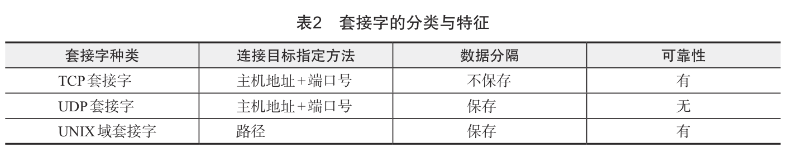
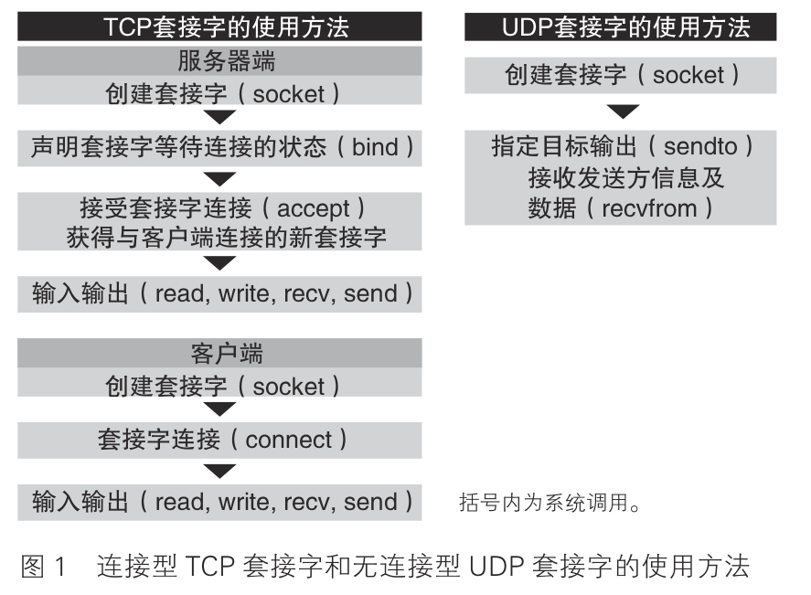
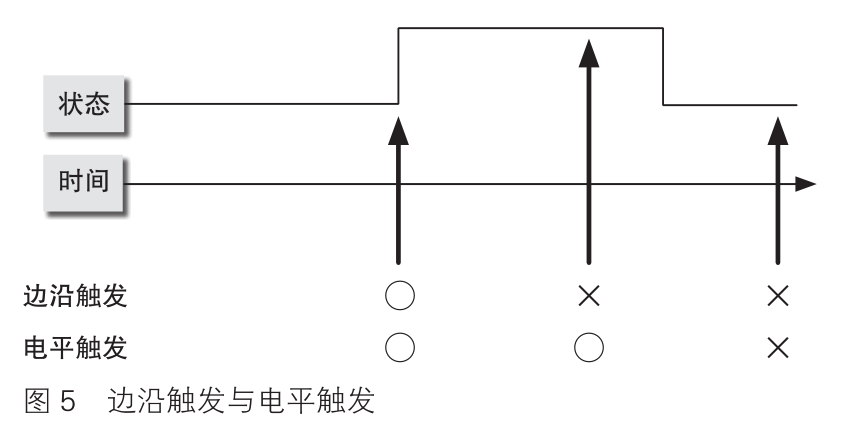

# 《代码的未来》读书笔记

## GC

### 基本方式

- 标记清除
  - 从根开始将可能被引用的对象用递归的方式进行标记，然后将没有标记到的对象作为垃圾进
    行回收。
  - 标记清除算法的处理时间，和存活对象数与对象总数的总和相关。
  - 缺点：在分配了大量对象，并且只有小部分存活的情况下，回收所消耗的时间大大增加，这是因为在清除阶段需要对大量死亡对象进行扫描。
- 复制和收集
  - 将从根开始被引用的对象复制到另外的空间中，然后，再将复制的对象所能够引用的对象用递归的方式不断复制下去。例如旧空间为A，新空间为B，将需要保留的对象复制到B，然后格式化A，A随后就是新空间。
  - 注意：和标记相比，将对象复制一份所需要的开销则比较大，因此在“存活”对象比例较高的情况下，反而比较不利。
- 引用计数
  - 在每个对象中保存该对象的引用计数，当引用发生增减时对计数进行更新。
  - 引用计数的增减，一般发生在变量赋值、对象内容更新、函数结束（局部变量不再被引用）等时间点。
  - 优点：1.实现简单。2.当对象不再被引用的瞬间就会被释放。3.由于释放操作是针对每个对象个别执行的，因此由 GC 而产生的中断时间比较短。
  - 缺点：1.无法释放循环引用的对象。2.引用数忘了增加的话，会对不恰当的对象进行释放；而引用数忘
    了减少的话，对象会一直残留在内存中，导致内存泄漏。3.引用计数管理不适合并行处理。如果多个线程同时对引用计数进行增减，引用计数的值就可能会产生不一致的问题。

### 进一步改良的应用方式

- 分代回收

  -  进步点在于考虑了对象的寿命。经验假设：大部分对象都会在短时间内成为垃圾，而经过一定时间依然存活的对象往往拥有较长的寿命。
  - 思路：如果对分配不久，诞生时间较短的“年轻”对象进行重点扫描，应该就可以更有效地回收大部分垃圾。
  - 因此，对象按照生成时间可以分割为新生代和老生代。只扫描新生代对象的回收操作，被称为小回收（Minor GC）。
  - 过程：首先从根开始一次常规扫描，找到“存活”对象。在扫描的过程中，如果遇到属于老生代的对象，则不对该对象继续进行递归扫描。然后，将第一次扫描后残留下来的对象划分到老生代。
  - 写屏障机制：负责记录引用的子程序。设有两个对象：A 和 B，当对 A 的内容进行改写，并加入对 B 的引用时，如果① A 属于老生代对象，② B 属于新生代对象，则将该引用添加到记录集中。这种检查程序需要对所有涉及修改对象内容的地方进行保护，因此被称为写屏障（Write barrier）。写屏障不仅用于分代回收，同时也用在很多其他的 GC 算法中。
  - 以全部区域为对象的 GC 操作被称为完全回收（Full GC）或者大回收（Major GC）。
  - 分代回收通过减少 GC 中扫描的对象数量，达到缩短 GC 带来的平均中断时间的效果。

- 增量回收

  - 在对实时性要求很高的程序中，比起缩短 GC 的平均中断时间，往往更重视缩短 GC 的最大中断时间。
  - 维持程序的实时性，不等到 GC 全部完成，而是将 GC 操作细分成多个部分逐一执行。
  - 缺点：由于中断操作需要消耗一定的时间，GC 所消耗的总时间就会相应增加。

- 并行回收

  - 基本原理：在原有的程序运行的同时进行 GC 操作，这一点和增量回收相似。

  

## 进程间通信
- pipe 管道：局限于同一台电脑上的父子、兄弟关系的进程。
  - 一种流机制，无法保存每次写入数据的长度等信息
- SysV IPC：不好用，容易资源泄露。是System V 所提供的进程间通信手段。
  - 消息：可以保存写入消息的长度
  - 信号量：一种带有互斥计数器的标志（flag）
  - 共享内存：没有进行排他控制，无法避免一些偶发性问题，必须使用信号量等手段进行保护
- socket 套接字：BSD 提供。
  - 也是一种文件描述符，可进行一般的输入输出。可以使用 select 系统调用，在 I/O 的同时进行“等待“。
  - 现代网络几乎完全依赖于套接字。TCP 套 接 字 和 UDP 套接字都建立在 IP 协议之上。通信对象不仅限于同一台计算机。
  - UNIX 套接字：局限于同一台电脑上，在不具有父子关系的进程之间传递文件描述符。

管道是通过 pipe 系统调用创建一对文件描述符来进行通信的方式。所谓文件描述符，就是表示输入输出对象的一种识别符，在 Ruby 中对应了 IO 对象。当数据从某个 pipe 写入时，可以从另一端的 pipe 读出。事先将管道准备好，然后用“fork”系统调用创建子进程，这样就可以实现进程间通信了。

消息、信号量和共享内存都是 UNIX 的 System V(5) 版本中加入的进程间通信 API。其中消息用于数据通信，信号量用于互斥锁，共享内存用于在进程间共享内存状态。它们结合起来被称为 sysvipc。

上述这些手段都不是很流行。例如管道的优点在于非父子关系的进程之间也可以实现通信，但是当不再使用时必须显式销毁，否则就会一直占用操作系统资源。这并不是一个易用的 API，而关于它的使用信息又很少，于是就让人更加不想去用了。

套接字根据通信对象的指定方法以及通信的性质可以分为不同的种类，其中主要使用的包括 TCP 套接字、UDP 套接字和 UNIX 域套接字三种。

UNIX 域套接字是使用和文件一样的路径来指定连接目标。在服务器一端创建监听用的 UNIX 域套接字时，需要指定一个路径，而结果就是将 UNIX 域套接字创建在这个指定的路径中。

以路径作为连接目标，就意味着 UNIX 域套接字只能用于同一台计算机上的进程间通信。不过，UNIX 域套接字还具备一些特殊的功能，它不仅可以传输一般的字节流，还可以传输文件描述符。

TCP 套接字被称为流套接字（stream socket），写入的数据只能作为单纯的字节流来对待，因此无法保存每次写入的数据长度信息。相对地，UDP 套接字和 UNIX 流套接字中，写入的数据是作为一个包（数据传输的单位）来发送的，因此可以获取每次写入的数据长度。

## 边沿触发（edge trigger）和电平触发（level trigger）

在 事 件 监 视 中， 对 事 件 的 检测方法有两种，即边沿触发（edge trigger）和电平触发（level trigger）。
这两个词原本是用在机械控制领域中的，边沿触发是指只在状态变化的瞬间发出通知，而电平触发是指
在状态发生变化的整个过程中都持续发出通知（图 5）。

select 系统调用属于电平触发，epoll 默认也是电平触发，但 epoll 也可以通过显式设置来实现边沿触发。是在 epoll_event 结构体的 events 字段通过 EPOLLET 标志来进行设置的。

要让程序在不阻塞的状态下工作，事件监视就必须采用电平触发的方式。也就是说，在调用回调函数执行输入操作之后，如果读取缓冲区中还有残留的数据，在电平触发的方式下，就会再次调用回调函数来进行读取操作。

那么，边沿触发的存在还有什么意义呢？由于边沿触发只在数据到达的瞬间产生事件，因此总体来看事件发生的次数会比较少，这也就意味着回调函数的启动次数也会比较少，可以提高效率。