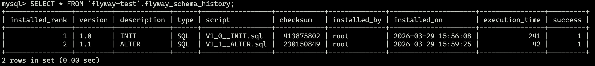

## demo-admin
[spring-boot-admin](https://github.com/codecentric/spring-boot-admin)- 监控 spring-boot 程序的运行状态，可以与 actuator
互相搭配使用。

## demo-logback
`logback-spring.xml`
```xml
<?xml version="1.0" encoding="UTF-8"?>
<configuration>
  <property name="FILE_ERROR_PATTERN"
            value="${FILE_LOG_PATTERN:-%d{${LOG_DATEFORMAT_PATTERN:-yyyy-MM-dd HH:mm:ss.SSS}} ${LOG_LEVEL_PATTERN:-%5p} ${PID:- } --- [%t] %-40.40logger{39} %file:%line: %m%n${LOG_EXCEPTION_CONVERSION_WORD:-%wEx}}"/>
  <include resource="org/springframework/boot/logging/logback/defaults.xml"/>

  <appender name="CONSOLE" class="ch.qos.logback.core.ConsoleAppender">
    <filter class="ch.qos.logback.classic.filter.LevelFilter">
      <level>INFO</level>
    </filter>
    <encoder>
      <pattern>${CONSOLE_LOG_PATTERN}</pattern>
      <charset>UTF-8</charset>
    </encoder>
  </appender>

  <appender name="FILE_INFO" class="ch.qos.logback.core.rolling.RollingFileAppender">
    <!-- 如果只是想要 Info 级别的日志，只是过滤 info 还是会输出 Error 日志，因为 Error 的级别高， 所以我们使用下面的策略，可以避免输出 Error 的日志 -->
    <filter class="ch.qos.logback.classic.filter.LevelFilter">
      <!-- 过滤 Error-->
      <level>ERROR</level>
      <!-- 匹配到就禁止 -->
      <onMatch>DENY</onMatch>
      <!-- 没有匹配到就允许 -->
      <onMismatch>ACCEPT</onMismatch>
    </filter>
    <!-- 日志名称，如果没有 File 属性，那么只会使用 FileNamePattern 的文件路径规则如果同时有 <File> 和 <FileNamePattern>，那么当天日志是 <File>，明天会自动把今天的日志改名为今天的日期。即，<File> 的日志都是当天的。-->
    <!--<File>logs/info.demo-logback.log</File>-->
    <!-- 滚动策略，按照时间滚动 TimeBasedRollingPolicy-->
    <rollingPolicy class="ch.qos.logback.core.rolling.TimeBasedRollingPolicy">
      <!-- 文件路径, 定义了日志的切分方式——把每一天的日志归档到一个文件中, 以防止日志填满整个磁盘空间 -->
      <FileNamePattern>logs/demo-logback/info.created_on_%d{yyyy-MM-dd}.part_%i.log</FileNamePattern>
      <!-- 只保留最近 90 天的日志 -->
      <maxHistory>90</maxHistory>
      <!-- 用来指定日志文件的上限大小，那么到了这个值，就会删除旧的日志 -->
      <!--<totalSizeCap>1GB</totalSizeCap>-->
      <timeBasedFileNamingAndTriggeringPolicy class="ch.qos.logback.core.rolling.SizeAndTimeBasedFNATP">
        <!-- maxFileSize: 这是活动文件的大小，默认值是 10MB, 本篇设置为 1KB，只是为了演示 -->
        <maxFileSize>2MB</maxFileSize>
      </timeBasedFileNamingAndTriggeringPolicy>
    </rollingPolicy>
    <!--<triggeringPolicy class="ch.qos.logback.core.rolling.SizeBasedTriggeringPolicy">-->
    <!--<maxFileSize>1KB</maxFileSize>-->
    <!--</triggeringPolicy>-->
    <encoder>
      <pattern>${FILE_LOG_PATTERN}</pattern>
      <charset>UTF-8</charset> <!-- 此处设置字符集 -->
    </encoder>
  </appender>

  <appender name="FILE_ERROR" class="ch.qos.logback.core.rolling.RollingFileAppender">
    <!-- 如果只是想要 Error 级别的日志，那么需要过滤一下，默认是 info 级别的，ThresholdFilter-->
    <filter class="ch.qos.logback.classic.filter.ThresholdFilter">
      <level>Error</level>
    </filter>
    <!-- 日志名称，如果没有 File 属性，那么只会使用 FileNamePattern 的文件路径规则如果同时有 <File> 和 <FileNamePattern>，那么当天日志是 <File>，明天会自动把今天的日志改名为今天的日期。即，<File> 的日志都是当天的。-->
    <!--<File>logs/error.demo-logback.log</File>-->
    <!-- 滚动策略，按照时间滚动 TimeBasedRollingPolicy-->
    <rollingPolicy class="ch.qos.logback.core.rolling.TimeBasedRollingPolicy">
      <!-- 文件路径, 定义了日志的切分方式——把每一天的日志归档到一个文件中, 以防止日志填满整个磁盘空间 -->
      <FileNamePattern>logs/demo-logback/error.created_on_%d{yyyy-MM-dd}.part_%i.log</FileNamePattern>
      <!-- 只保留最近 90 天的日志 -->
      <maxHistory>90</maxHistory>
      <timeBasedFileNamingAndTriggeringPolicy class="ch.qos.logback.core.rolling.SizeAndTimeBasedFNATP">
        <!-- maxFileSize: 这是活动文件的大小，默认值是 10MB, 本篇设置为 1KB，只是为了演示 -->
        <maxFileSize>2MB</maxFileSize>
      </timeBasedFileNamingAndTriggeringPolicy>
    </rollingPolicy>
    <encoder>
      <pattern>${FILE_ERROR_PATTERN}</pattern>
      <charset>UTF-8</charset> <!-- 此处设置字符集 -->
    </encoder>
  </appender>

  <root level="info">
    <appender-ref ref="CONSOLE"/>
    <appender-ref ref="FILE_INFO"/>
    <appender-ref ref="FILE_ERROR"/>
  </root>
</configuration>
```
上面是logback的配置，这里我们来观察一下ERROR级别的日志格式，位置 `logs/demo-logback/error.created_on_2024-12-18.part_0.log`:
```bash
2024-12-18 18:18:27.990 ERROR 13840 --- [main] c.x.l.SpringBootDemoLogbackApplication   SpringBootDemoLogbackApplication.java:27: Spring boot启动初始化了 124 个 Bean
2024-12-18 18:18:27.995 ERROR 13840 --- [main] c.x.l.SpringBootDemoLogbackApplication   SpringBootDemoLogbackApplication.java:32: 【SpringBootDemoLogbackApplication】启动异常：

java.lang.ArithmeticException: / by zero
	at com.xkcoding.logback.SpringBootDemoLogbackApplication.main(SpringBootDemoLogbackApplication.java:30)
```
注意到FILE_ERROR_PATTERN的值为如下配置;
```xml
<property name="FILE_ERROR_PATTERN"
          value="${FILE_LOG_PATTERN:-%d{${LOG_DATEFORMAT_PATTERN:-yyyy-MM-dd HH:mm:ss.SSS}} ${LOG_LEVEL_PATTERN:-%5p} ${PID:- } --- [%t] %-40.40logger{39} %file:%line: %m%n${LOG_EXCEPTION_CONVERSION_WORD:-%wEx}}"/>
```

**对应关系分析**

| **日志内容部分**                           | **配置项解释**                                   |
| ------------------------------------------ | ------------------------------------------------ |
| `2024-12-18 18:18:27.990`                  | `%d{yyyy-MM-dd HH:mm:ss.SSS}`                    |
| `ERROR`                                    | `%5p`                                            |
| `13840`                                    | `${PID:- }`                                      |
| `[main]`                                   | `[%t]`                                           |
| `c.x.l.SpringBootDemoLogbackApplication`   | `%-40.40logger{39}`                              |
| `SpringBootDemoLogbackApplication.java:27` | `%file:%line`                                    |
| `Spring boot启动初始化了 124 个 Bean`      | `%m`                                             |
| 换行和异常堆栈                             | `%n` 和 `${LOG_EXCEPTION_CONVERSION_WORD:-%wEx}` |

- `${VAR:-DEFAULT}` 是logback配置默认值的语法，注意有个 `-`。
- `%-40.40logger{39}` 的功能可以总结为：
  1. **``%-`左对齐** 输出 Logger 名称。
  2. 如果 Logger 名称长度超过 39 个字符，只保留最后 39 个字符。
  3. 长度不足40时用空格填充，直到占据40个字符宽度（由第一个40决定）；输出宽度如果超过40个字符，那么截断为固定 40 个字符（由.40决定）。


## demo-log-aop

```java
@Aspect
@Component
@Slf4j
public class AopLog {
    /**
     * 切入点
     */
    @Pointcut("execution(public * com.xkcoding.log.aop.controller.*Controller.*(..))")
    public void log() {

    }

    /**
     * 环绕操作
     *
     * @param point 切入点
     * @return 原方法返回值
     * @throws Throwable 异常信息
     */
    @Around("log()")
    public Object aroundLog(ProceedingJoinPoint point) throws Throwable {

        // 开始打印请求日志
        ServletRequestAttributes attributes = (ServletRequestAttributes) RequestContextHolder.getRequestAttributes();
        HttpServletRequest request = Objects.requireNonNull(attributes).getRequest();

        // 打印请求相关参数
        long startTime = System.currentTimeMillis();
        Object result = point.proceed();
        String header = request.getHeader("User-Agent");
        UserAgent userAgent = UserAgent.parseUserAgentString(header);

        final Log l = Log.builder()
            .threadId(Long.toString(Thread.currentThread().getId()))
            .threadName(Thread.currentThread().getName())
            .ip(getIp(request))
            .url(request.getRequestURL().toString())
            .classMethod(String.format("%s.%s", point.getSignature().getDeclaringTypeName(),
                point.getSignature().getName()))
            .httpMethod(request.getMethod())
            .requestParams(getNameAndValue(point))
            .result(result)
            .timeCost(System.currentTimeMillis() - startTime)
            .userAgent(header)
            .browser(userAgent.getBrowser().toString())
            .os(userAgent.getOperatingSystem().toString()).build();

        log.info("Request Log Info : {}", JSONUtil.toJsonStr(l));

        return result;
    }
}
```

先定义一个切点，然后以环绕的模式进行拦截，最后返回原先的结果。这里拦截的目的，只是记录日志。

log 示例如下：

```json
{
  "classMethod": "com.xkcoding.log.aop.controller.TestController.test",
  "os": "WINDOWS_10",
  "ip": "0:0:0:0:0:0:0:1",
  "requestParams": {},
  "userAgent": "Mozilla/5.0 (Windows NT 10.0; Win64; x64) AppleWebKit/537.36 (KHTML, like Gecko) Chrome/131.0.0.0 Safari/537.36 Edg/131.0.0.0",
  "httpMethod": "GET",
  "threadName": "http-nio-8080-exec-5",
  "url": "http://localhost:8080/demo/test",
  "threadId": "22",
  "result": {
    "who": "me"
  },
  "browser": "CHROME13",
  "timeCost": 101
}
```

## demo-exception-handler
包括了两种方式的处理：
- 第一种对常见API形式的接口进行异常处理，统一封装返回格式；
- 第二种是对模板页面请求的异常处理，统一处理错误页面。

```java
/**
 * <p>
 * 统一异常处理
 * </p>
 *
 * @author yangkai.shen
 * @date Created in 2018-10-02 21:26
 */
@ControllerAdvice
@Slf4j
public class DemoExceptionHandler {
	private static final String DEFAULT_ERROR_VIEW = "error";

	/**
	 * 统一 json 异常处理
	 *
	 * @param exception JsonException
	 * @return 统一返回 json 格式
	 */
	@ExceptionHandler(value = JsonException.class)
	@ResponseBody
	public ApiResponse jsonErrorHandler(JsonException exception) {
		log.error("【JsonException】:{}", exception.getMessage());
		return ApiResponse.ofException(exception);
	}

	/**
	 * 统一 页面 异常处理
	 *
	 * @param exception PageException
	 * @return 统一跳转到异常页面
	 */
	@ExceptionHandler(value = PageException.class)
	public ModelAndView pageErrorHandler(PageException exception) {
		log.error("【DemoPageException】:{}", exception.getMessage());
		ModelAndView view = new ModelAndView();
		view.addObject("message", exception.getMessage());
		view.setViewName(DEFAULT_ERROR_VIEW);
		return view;
	}
}
```
`src/main/resources/templates/error.html`：
```html
<!DOCTYPE html>
<html xmlns:th="http://www.thymeleaf.org">
<head lang="en">
	<meta charset="UTF-8"/>
	<title>统一页面异常处理</title>
</head>
<body>
<h1>统一页面异常处理</h1>
<div th:text="${message}"></div>
</body>
</html>
```
控制器：
```java
@Controller
public class TestController {

    @GetMapping("/json")
    @ResponseBody
    public ApiResponse jsonException() {
        throw new JsonException(Status.UNKNOWN_ERROR);
    }

    @GetMapping("/page")
    public ModelAndView pageException() {
        throw new PageException(Status.UNKNOWN_ERROR);
    }
}
```

## demo-template-freemarker

IndexController.java
```java
@Controller
@Slf4j
public class IndexController {

    @GetMapping(value = {"", "/"})
    public ModelAndView index(HttpServletRequest request) {
        ModelAndView mv = new ModelAndView();

        User user = (User) request.getSession().getAttribute("user");
        if (ObjectUtil.isNull(user)) {
            mv.setViewName("redirect:/user/login");
        } else {
            mv.setViewName("page/index");
            mv.addObject(user);
        }

        return mv;
    }
}
```
UserController.java
```java
@Controller
@RequestMapping("/user")
@Slf4j
public class UserController {
    @PostMapping("/login")
    public ModelAndView login(User user, HttpServletRequest request) {
        ModelAndView mv = new ModelAndView();

        mv.addObject(user);
        mv.setViewName("redirect:/");

        request.getSession().setAttribute("user", user);
        return mv;
    }

    @GetMapping("/login")
    public ModelAndView login() {
        return new ModelAndView("page/login");
    }
}

```
---
`src/main/resources`
```
│   application.yml
│
└───templates
    ├───common
    │       head.ftl
    │
    └───page
            index.ftl
            login.ftl
```

## demo-template-thymeleaf
和 freemarker 模版非常类似，不再赘述。

## demo-template-beetl

国人开发的模版引擎。

## demo-template-enjoy

另一个模版引擎。

## demo-orm-jdbctemplate

前提：
1. 按照[此教程](https://learn.microsoft.com/zh-cn/windows/wsl/tutorials/wsl-database#install-mysql) 在WSL安装MySQL。
2. 处理root密码配置，以及授予权限。
3. 新建对应的数据库，这里是spring-boot-demo。

用户密码的保存和验证。
```java
/**
 * 保存用户
 *
 * @param user 用户实体
 * @return 保存成功 {@code true} 保存失败 {@code false}
 */
@Override
public Boolean save(User user) {
    String rawPass = user.getPassword();
    String salt = IdUtil.simpleUUID();
    String pass = SecureUtil.md5(rawPass + Const.SALT_PREFIX + salt);
    user.setPassword(pass);
    user.setSalt(salt);
    return userDao.insert(user) > 0;
}
```
- 首先，禁止明文保存用户密码。否则一旦服务器被攻陷，用户信息直接泄露，后果太严重。
- 一般是 rawPass + salt 的拼接模式，然后由加密算法来编码，例如md5，Bcrypt。md5已被证实不安全，因为彩虹表攻击。
推荐使用足够安全的加密算法（如 bcrypt、PBKDF2）。
- salt的单独保存是为了后续的用户登录流程，比对验证密码是否一致。

---

```java
/**
 * 更新用户
 *
 * @param user 用户实体
 * @param id   主键id
 * @return 更新成功 {@code true} 更新失败 {@code false}
 */
@Override
public Boolean update(User user, Long id) {
    User exist = getUser(id);
    if (StrUtil.isNotBlank(user.getPassword())) {
        String rawPass = user.getPassword();
        String salt = IdUtil.simpleUUID();
        String pass = SecureUtil.md5(rawPass + Const.SALT_PREFIX + salt);
        user.setPassword(pass);
        user.setSalt(salt);
    }
    BeanUtil.copyProperties(user, exist, CopyOptions.create().setIgnoreNullValue(true));
    exist.setLastUpdateTime(new DateTime());
    return userDao.update(exist, id) > 0;
}
```
更新用户的逻辑中，将密码再次更新，这是为了加强安全。

---

jdbcTemplate 是最接近手写SQL拼接的方式，很原始，效率不高。
```java
@Slf4j
public class BaseDao<T, P> {
  private JdbcTemplate jdbcTemplate;
  private Class<T>     clazz;

  @SuppressWarnings(value = "unchecked")
  public BaseDao(JdbcTemplate jdbcTemplate) {
    this.jdbcTemplate = jdbcTemplate;
    clazz = (Class<T>) ((ParameterizedType) getClass().getGenericSuperclass()).getActualTypeArguments()[0];
  }

  /**
   * 通用插入，自增列需要添加 {@link Pk} 注解
   *
   * @param t          对象
   * @param ignoreNull 是否忽略 null 值
   * @return 操作的行数
   */
  protected Integer insert(T t, Boolean ignoreNull) {
    String table = getTableName(t);

    // 获取字段列表，例如 {A,B}
    List<Field> filterField = getField(t, ignoreNull);

    // 获取每个字段对应的列名，返回列表，例如 {a,b}
    List<String> columnList = getColumns(filterField);

    // 例如 a,b
    String columns = StrUtil.join(Const.SEPARATOR_COMMA, columnList);

    // 构造占位符 ?,?
    String params = StrUtil.repeatAndJoin("?", columnList.size(), Const.SEPARATOR_COMMA);

    // 构造值
    Object[] values = filterField.stream().map(field -> ReflectUtil.getFieldValue(t, field)).toArray();

    String sql = StrUtil.format("INSERT INTO {table} ({columns}) VALUES ({params})",
      Dict.create().set("table", table).set("columns", columns).set("params", params));
    log.debug("【执行SQL】SQL：{}", sql);
    log.debug("【执行SQL】参数：{}", JSONUtil.toJsonStr(values));
    return jdbcTemplate.update(sql, values);
  }
}
```

## demo-orm-jpa

test 的位置： `src/test/java/com/xkcoding/orm/jpa/repository`。测试写得很随意，不太完整。

## demo-orm-mybatis

在mapper接口中定义方法，并给出部分实现。

```java
@Mapper
@Component
public interface UserMapper {
    @Select("SELECT * FROM orm_user")
    List<User> selectAllUser();

    @Select("SELECT * FROM orm_user WHERE id = #{id}")
    User selectUserById(@Param("id") Long id);

    int saveUser(@Param("user") User user);

    int deleteById(@Param("id") Long id);
}
```

在对应xml中给出其余的实现。

```xml
<?xml version="1.0" encoding="UTF-8"?>
<!DOCTYPE mapper PUBLIC "-//mybatis.org//DTD Mapper 3.0//EN" "http://mybatis.org/dtd/mybatis-3-mapper.dtd">
<mapper namespace="com.xkcoding.orm.mybatis.mapper.UserMapper">

    <insert id="saveUser">
        INSERT INTO `orm_user` (`name`,
                                `password`,
                                `salt`,
                                `email`,
                                `phone_number`,
                                `status`,
                                `create_time`,
                                `last_login_time`,
                                `last_update_time`)
        VALUES (#{user.name},
                #{user.password},
                #{user.salt},
                #{user.email},
                #{user.phoneNumber},
                #{user.status},
                #{user.createTime},
                #{user.lastLoginTime},
                #{user.lastUpdateTime})
    </insert>

    <delete id="deleteById">
        DELETE
        FROM `orm_user`
        WHERE `id` = #{id}
    </delete>
</mapper>
```

## demo-swagger

UserController.java 主要演示API层的注解。

```java
/**
 * <p>
 * User Controller
 * </p>
 *
 * @author yangkai.shen
 * @date Created in 2018-11-29 11:30
 */
@RestController
@RequestMapping("/user")
@Api(tags = "1.0.0-SNAPSHOT", description = "用户管理", value = "用户管理")
@Slf4j
public class UserController {
    @GetMapping
    @ApiOperation(value = "条件查询（DONE）", notes = "备注")
    @ApiImplicitParams({@ApiImplicitParam(name = "username", value = "用户名", dataType = DataType.STRING, paramType = ParamType.QUERY, defaultValue = "xxx")})
    public ApiResponse<User> getByUserName(String username) {
        log.info("多个参数用  @ApiImplicitParams");
        return ApiResponse.<User>builder().code(200)
                .message("操作成功")
                .data(new User(1, username, "JAVA"))
                .build();
    }

    @GetMapping("/{id}")
    @ApiOperation(value = "主键查询（DONE）", notes = "备注")
    @ApiImplicitParams({@ApiImplicitParam(name = "id", value = "用户编号", dataType = DataType.INT, paramType = ParamType.PATH)})
    public ApiResponse<User> get(@PathVariable Integer id) {
        log.info("单个参数用  @ApiImplicitParam");
        return ApiResponse.<User>builder().code(200)
                .message("操作成功")
                .data(new User(id, "u1", "p1"))
                .build();
    }

    @DeleteMapping("/{id}")
    @ApiOperation(value = "删除用户（DONE）", notes = "备注")
    @ApiImplicitParam(name = "id", value = "用户编号", dataType = DataType.INT, paramType = ParamType.PATH)
    public void delete(@PathVariable Integer id) {
        log.info("单个参数用 ApiImplicitParam");
    }

    @PostMapping
    @ApiOperation(value = "添加用户（DONE）")
    public User post(@RequestBody User user) {
        log.info("如果是 POST PUT 这种带 @RequestBody 的可以不用写 @ApiImplicitParam");
        return user;
    }

    @PostMapping("/multipar")
    @ApiOperation(value = "添加用户（DONE）")
    public List<User> multipar(@RequestBody List<User> user) {
        log.info("如果是 POST PUT 这种带 @RequestBody 的可以不用写 @ApiImplicitParam");

        return user;
    }

    @PostMapping("/array")
    @ApiOperation(value = "添加用户（DONE）")
    public User[] array(@RequestBody User[] user) {
        log.info("如果是 POST PUT 这种带 @RequestBody 的可以不用写 @ApiImplicitParam");
        return user;
    }

    @PutMapping("/{id}")
    @ApiOperation(value = "修改用户（DONE）")
    public void put(@PathVariable Long id, @RequestBody User user) {
        log.info("如果你不想写 @ApiImplicitParam 那么 swagger 也会使用默认的参数名作为描述信息 ");
    }

    @PostMapping("/{id}/file")
    @ApiOperation(value = "文件上传（DONE）")
    public String file(@PathVariable Long id, @RequestParam("file") MultipartFile file) {
        log.info(file.getContentType());
        log.info(file.getName());
        log.info(file.getOriginalFilename());
        return file.getOriginalFilename();
    }
}
```

## demo-rbac-security

RBAC 数据表

```sql
SET NAMES utf8mb4;
SET FOREIGN_KEY_CHECKS = 0;

-- ----------------------------
-- Table structure for sec_permission
-- ----------------------------
DROP TABLE IF EXISTS `sec_permission`;
CREATE TABLE `sec_permission`
(
  `id`         bigint(64)  NOT NULL COMMENT '主键',
  `name`       varchar(50) NOT NULL COMMENT '权限名',
  `url`        varchar(1000) DEFAULT NULL COMMENT '类型为页面时，代表前端路由地址，类型为按钮时，代表后端接口地址',
  `type`       int(2)      NOT NULL COMMENT '权限类型，页面-1，按钮-2',
  `permission` varchar(50)   DEFAULT NULL COMMENT '权限表达式',
  `method`     varchar(50)   DEFAULT NULL COMMENT '后端接口访问方式',
  `sort`       int(11)     NOT NULL COMMENT '排序',
  `parent_id`  bigint(64)  NOT NULL COMMENT '父级id',
  PRIMARY KEY (`id`)
) ENGINE = InnoDB
  DEFAULT CHARSET = utf8 COMMENT ='权限表';

-- ----------------------------
-- Records of sec_permission
-- ----------------------------
BEGIN;
INSERT INTO `sec_permission`
VALUES (1072806379288399872, '测试页面', '/test', 1, 'page:test', NULL, 1, 0);
INSERT INTO `sec_permission`
VALUES (1072806379313565696, '测试页面-查询', '/**/test', 2, 'btn:test:query', 'GET', 1, 1072806379288399872);
INSERT INTO `sec_permission`
VALUES (1072806379330342912, '测试页面-添加', '/**/test', 2, 'btn:test:insert', 'POST', 2, 1072806379288399872);
INSERT INTO `sec_permission`
VALUES (1072806379342925824, '监控在线用户页面', '/monitor', 1, 'page:monitor:online', NULL, 2, 0);
INSERT INTO `sec_permission`
VALUES (1072806379363897344, '在线用户页面-查询', '/**/api/monitor/online/user', 2, 'btn:monitor:online:query', 'GET', 1,
        1072806379342925824);
INSERT INTO `sec_permission`
VALUES (1072806379384868864, '在线用户页面-踢出', '/**/api/monitor/online/user/kickout', 2, 'btn:monitor:online:kickout',
        'DELETE', 2, 1072806379342925824);
COMMIT;

-- ----------------------------
-- Table structure for sec_role
-- ----------------------------
DROP TABLE IF EXISTS `sec_role`;
CREATE TABLE `sec_role`
(
  `id`          bigint(64)  NOT NULL COMMENT '主键',
  `name`        varchar(50) NOT NULL COMMENT '角色名',
  `description` varchar(100) DEFAULT NULL COMMENT '描述',
  `create_time` bigint(13)  NOT NULL COMMENT '创建时间',
  `update_time` bigint(13)  NOT NULL COMMENT '更新时间',
  PRIMARY KEY (`id`),
  UNIQUE KEY `name` (`name`)
) ENGINE = InnoDB
  DEFAULT CHARSET = utf8 COMMENT ='角色表';

-- ----------------------------
-- Records of sec_role
-- ----------------------------
BEGIN;
INSERT INTO `sec_role`
VALUES (1072806379208708096, '管理员', '超级管理员', 1544611947239, 1544611947239);
INSERT INTO `sec_role`
VALUES (1072806379238068224, '普通用户', '普通用户', 1544611947246, 1544611947246);
COMMIT;

-- ----------------------------
-- Table structure for sec_role_permission
-- ----------------------------
DROP TABLE IF EXISTS `sec_role_permission`;
CREATE TABLE `sec_role_permission`
(
  `role_id`       bigint(64) NOT NULL COMMENT '角色主键',
  `permission_id` bigint(64) NOT NULL COMMENT '权限主键',
  PRIMARY KEY (`role_id`, `permission_id`)
) ENGINE = InnoDB
  DEFAULT CHARSET = utf8 COMMENT ='角色权限关系表';

-- ----------------------------
-- Records of sec_role_permission
-- ----------------------------
BEGIN;
INSERT INTO `sec_role_permission`
VALUES (1072806379208708096, 1072806379288399872);
INSERT INTO `sec_role_permission`
VALUES (1072806379208708096, 1072806379313565696);
INSERT INTO `sec_role_permission`
VALUES (1072806379208708096, 1072806379330342912);
INSERT INTO `sec_role_permission`
VALUES (1072806379208708096, 1072806379342925824);
INSERT INTO `sec_role_permission`
VALUES (1072806379208708096, 1072806379363897344);
INSERT INTO `sec_role_permission`
VALUES (1072806379208708096, 1072806379384868864);
INSERT INTO `sec_role_permission`
VALUES (1072806379238068224, 1072806379288399872);
INSERT INTO `sec_role_permission`
VALUES (1072806379238068224, 1072806379313565696);
COMMIT;

-- ----------------------------
-- Table structure for sec_user
-- ----------------------------
DROP TABLE IF EXISTS `sec_user`;
CREATE TABLE `sec_user`
(
  `id`          bigint(64)  NOT NULL COMMENT '主键',
  `username`    varchar(50) NOT NULL COMMENT '用户名',
  `password`    varchar(60) NOT NULL COMMENT '密码',
  `nickname`    varchar(255)         DEFAULT NULL COMMENT '昵称',
  `phone`       varchar(11)          DEFAULT NULL COMMENT '手机',
  `email`       varchar(50)          DEFAULT NULL COMMENT '邮箱',
  `birthday`    bigint(13)           DEFAULT NULL COMMENT '生日',
  `sex`         int(2)               DEFAULT NULL COMMENT '性别，男-1，女-2',
  `status`      int(2)      NOT NULL DEFAULT '1' COMMENT '状态，启用-1，禁用-0',
  `create_time` bigint(13)  NOT NULL COMMENT '创建时间',
  `update_time` bigint(13)  NOT NULL COMMENT '更新时间',
  PRIMARY KEY (`id`),
  UNIQUE KEY `username` (`username`),
  UNIQUE KEY `phone` (`phone`),
  UNIQUE KEY `email` (`email`)
) ENGINE = InnoDB
  DEFAULT CHARSET = utf8 COMMENT ='用户表';

-- ----------------------------
-- Records of sec_user
-- ----------------------------
BEGIN;
INSERT INTO `sec_user`
VALUES (1072806377661009920, 'admin', '$2a$10$64iuSLkKNhpTN19jGHs7xePvFsub7ZCcCmBqEYw8fbACGTE3XetYq', '管理员',
        '17300000000', 'admin@xkcoding.com', 785433600000, 1, 1, 1544611947032, 1544611947032);
INSERT INTO `sec_user`
VALUES (1072806378780889088, 'user', '$2a$10$OUDl4thpcHfs7WZ1kMUOb.ZO5eD4QANW5E.cexBLiKDIzDNt87QbO', '普通用户',
        '17300001111', 'user@xkcoding.com', 785433600000, 1, 1, 1544611947234, 1544611947234);
COMMIT;

-- ----------------------------
-- Table structure for sec_user_role
-- ----------------------------
DROP TABLE IF EXISTS `sec_user_role`;
CREATE TABLE `sec_user_role`
(
  `user_id` bigint(64) NOT NULL COMMENT '用户主键',
  `role_id` bigint(64) NOT NULL COMMENT '角色主键',
  PRIMARY KEY (`user_id`, `role_id`)
) ENGINE = InnoDB
  DEFAULT CHARSET = utf8 COMMENT ='用户角色关系表';

-- ----------------------------
-- Records of sec_user_role
-- ----------------------------
BEGIN;
INSERT INTO `sec_user_role`
VALUES (1072806377661009920, 1072806379208708096);
INSERT INTO `sec_user_role`
VALUES (1072806378780889088, 1072806379238068224);
COMMIT;

SET FOREIGN_KEY_CHECKS = 1;
```

分别有权限表、角色表、用户表，其中权限表和角色表通过权限-角色关联表进行连接，角色表和用户表通过角色-用户表进行连接。因此一个角色，必然能够通过关联表关联到对应的角色和权限。


## demo-session

WebMvc 配置类

```java
@Configuration
public class WebMvcConfig implements WebMvcConfigurer {
    @Autowired
    private SessionInterceptor sessionInterceptor;

    @Override
    public void addInterceptors(InterceptorRegistry registry) {
        InterceptorRegistration sessionInterceptorRegistry = registry.addInterceptor(sessionInterceptor);
        // 排除不需要拦截的路径
        sessionInterceptorRegistry.excludePathPatterns("/page/login");
        sessionInterceptorRegistry.excludePathPatterns("/page/doLogin");
        sessionInterceptorRegistry.excludePathPatterns("/error");

        // 需要拦截的路径
        sessionInterceptorRegistry.addPathPatterns("/**");
    }
}
```

校验Session的拦截器

```java
@Component
public class SessionInterceptor extends HandlerInterceptorAdapter {
    @Override
    public boolean preHandle(HttpServletRequest request, HttpServletResponse response, Object handler) throws Exception {
        HttpSession session = request.getSession();
        if (session.getAttribute(Consts.SESSION_KEY) != null) {
            return true;
        }
        // 跳转到登录页
        String url = "/page/login?redirect=true";
        response.sendRedirect(request.getContextPath() + url);
        return false;
    }
}
```

页面跳转 Controller

```java
@Controller
@RequestMapping("/page")
public class PageController {
    /**
     * 跳转到 首页
     *
     * @param request 请求
     */
    @GetMapping("/index")
    public ModelAndView index(HttpServletRequest request) {
        ModelAndView mv = new ModelAndView();

        String token = (String) request.getSession().getAttribute(Consts.SESSION_KEY);
        mv.setViewName("index");
        mv.addObject("token", token);
        return mv;
    }

    /**
     * 跳转到 登录页
     *
     * @param redirect 是否是跳转回来的
     */
    @GetMapping("/login")
    public ModelAndView login(Boolean redirect) {
        ModelAndView mv = new ModelAndView();

        if (ObjectUtil.isNotNull(redirect) && ObjectUtil.equal(true, redirect)) {
            mv.addObject("message", "请先登录！");
        }
        mv.setViewName("login");
        return mv;
    }

    @GetMapping("/doLogin")
    public String doLogin(HttpSession session) {
        session.setAttribute(Consts.SESSION_KEY, IdUtil.fastUUID());

        return "redirect:/page/index";
    }
}
```


## demo-websocket

引入依赖

```xml
<dependency>
    <groupId>org.springframework.boot</groupId>
    <artifactId>spring-boot-starter-websocket</artifactId>
</dependency>

<dependency>
    <groupId>com.github.oshi</groupId>
    <artifactId>oshi-core</artifactId>
    <version>${oshi.version}</version>
</dependency>
```

oshi-core 用于跨平台获取系统运行时的硬件信息。

常规REST接口实现

```java
@RestController
@RequestMapping("/server")
public class ServerController {
    @GetMapping
    public Dict serverInfo() throws Exception {
        Server server = new Server();
        server.copyTo();
        ServerVO serverVO = ServerUtil.wrapServerVO(server);
        return ServerUtil.wrapServerDict(serverVO);
    }
}
```

服务器定时推送websocket的实现

```java
@Slf4j
@Component
public class ServerTask {
    @Autowired
    private SimpMessagingTemplate wsTemplate;

    /**
     * 每隔 3s 执行一次
     */
    @Scheduled(cron = "0/3 * * * * ?")
    public void websocket() throws Exception {
        Server server = new Server();
        server.copyTo();
        ServerVO serverVO = ServerUtil.wrapServerVO(server);
        Dict dict = ServerUtil.wrapServerDict(serverVO);
        wsTemplate.convertAndSend(WebSocketConsts.PUSH_SERVER, JSONUtil.toJsonStr(dict));
    }
}
```

WebSocket配置

```java
@Configuration
@EnableWebSocket
@EnableWebSocketMessageBroker
public class WebSocketConfig implements WebSocketMessageBrokerConfigurer {

    @Override
    public void registerStompEndpoints(StompEndpointRegistry registry) {
        // 注册一个 /notification 端点，前端通过这个端点进行连接
        registry.addEndpoint("/notification")
            //解决跨域问题
            .setAllowedOrigins("*").withSockJS();
    }

    @Override
    public void configureMessageBroker(MessageBrokerRegistry registry) {
        //定义了一个客户端订阅地址的前缀信息，也就是客户端接收服务端发送消息的前缀路由
        registry.enableSimpleBroker("/topic");
    }

}
```

在实现中，Server 和 ServerVO分别代表model层和表现层。数据结构比较复杂，有很多字段，这里不赘述。

下面看一下前端HTML页面的具体实现细节

```html
<!DOCTYPE html>
<html lang="en">
<head>
    <meta charset="UTF-8">
    <title>服务器信息</title>
    <link href="https://cdnjs.cloudflare.com/ajax/libs/element-ui/2.4.11/theme-chalk/index.css" rel="stylesheet">
    <style>
    </style>
</head>
<body>
<div id="app">
</body>
<script src="js/sockjs.min.js"></script>
<script src="js/stomp.js"></script>
<script src="https://cdn.jsdelivr.net/npm/vue@2.5.21/dist/vue.min.js"></script>
<script src="//cdnjs.cloudflare.com/ajax/libs/element-ui/2.4.11/index.js"></script>
<script src="https://cdn.jsdelivr.net/npm/axios@0.19.0-beta.1/dist/axios.min.js"></script>
<script>
    const wsHost = "http://localhost:8080/demo/notification";
    const wsTopic = "/topic/server";

    const app = new Vue({
        el: '#app',
        data: function () {
            return {
                isConnected: false,
                stompClient: {},
                socket: {},
                server: {
                    cpu: [],
                    mem: [],
                    jvm: [],
                    sys: [],
                    sysFile: []
                }
            }
        },
        methods: {
            _getServerInfo() {
                axios.get('/demo/server')
                    .then((response) => {
                        this.server = response.data
                    });
            },
            _initSockJs() {
                this._getServerInfo();
                this.socket = new SockJS(wsHost);
                this.stompClient = Stomp.over(this.socket);

                this.stompClient.connect({}, (frame) => {
                    console.log('websocket连接成功:' + frame);
                    this.isConnected = true;
                    this.$message('websocket服务器连接成功');

                    // 另外再注册一下消息推送
                    this.stompClient.subscribe(wsTopic, (response) => {
                        this.server = JSON.parse(response.body);
                    });
                });
            },
            _destroySockJs() {
                if (this.stompClient != null) {
                    this.stompClient.disconnect();
                    this.socket.onclose;
                    this.socket.close();
                    this.stompClient = {};
                    this.socket = {};
                    this.isConnected = false;
                    this.server.cpu = [];
                    this.server.mem = [];
                    this.server.jvm = [];
                    this.server.sys = [];
                    this.server.sysFile = [];
                }
                console.log('websocket断开成功！');
                this.$message.error('websocket断开成功！');
            }
        },
        mounted() {
            this._initSockJs();
        },
        beforeDestroy() {
            this._destroySockJs();
        }
    })
</script>
</html>
```

### STOMP 的核心概念与工作流程

STOMP 的全称是 **Simple (or Streaming) Text Oriented Messaging Protocol**，即**简单（流）文本定向消息协议**。

可以把它理解为**跑在 WebSocket 上的一套“消息语法”**，或者说 WebSocket 的 **HTTP**。

STOMP 的核心是建立了一个类似于**消息队列**的发布-订阅模型。

1. **连接 (CONNECT)**：客户端通过 WebSocket 与服务器建立连接后，会发送一个 STOMP 的 `CONNECT` 帧进行“登录”。
2. **订阅 (SUBSCRIBE)**：客户端发送 `SUBSCRIBE` 帧来“订阅”一个**目的地**。订阅后，该目的地有消息，服务器就会主动推送给客户端。
3. **发送 (SEND)**：任何客户端（或服务端程序）都可以向某个目的地 `SEND` 消息。
4. **消息分发 (MESSAGE)**：服务器收到消息后，会将其广播给所有订阅了该目的地的客户端。


## demo-async

```yaml
spring:
  task:
    execution:
      pool:
        # 最大线程数
        max-size: 16
        # 核心线程数
        core-size: 16
        # 存活时间
        keep-alive: 10s
        # 队列大小
        queue-capacity: 100
        # 是否允许核心线程超时
        allow-core-thread-timeout: true
      # 线程名称前缀
      thread-name-prefix: async-task-
```

```java
@EnableAsync
@SpringBootApplication
public class SpringBootDemoAsyncApplication {

    public static void main(String[] args) {
        SpringApplication.run(SpringBootDemoAsyncApplication.class, args);
    }

}
```

@EnableAsync 启用注解。

```java
@Component
@Slf4j
public class TaskFactory {

    /**
     * 模拟5秒的异步任务
     */
    @Async
    public Future<Boolean> asyncTask1() throws InterruptedException {
        doTask("asyncTask1", 5);
        return new AsyncResult<>(Boolean.TRUE);
    }
}
```

@Async 注解标记函数。


## demo-neo4j

这个例子使用学生课程来对社交关系建模。路径：spring-boot-demo\demo-neo4j


## demo-sharding-jdbc

依赖

```xml
<dependency>
    <groupId>io.shardingsphere</groupId>
    <artifactId>sharding-jdbc-core</artifactId>
    <version>3.1.0</version>
</dependency>
```

数据库准备sql/schema.sql

```sql
USE `spring-boot-demo`;
DROP TABLE IF EXISTS `t_order_0`;
CREATE TABLE `t_order_0`
(
  `id`       BIGINT NOT NULL COMMENT '主键',
  `user_id`  BIGINT NOT NULL COMMENT '用户id',
  `order_id` BIGINT NOT NULL COMMENT '订单id',
  `remark`     VARCHAR(200) DEFAULT '' COMMENT '备注',
  primary key (`id`)
) ENGINE = InnoDB
  DEFAULT CHARSET = utf8 COMMENT ='Spring Boot Demo 分库分表 系列示例表0';

DROP TABLE IF EXISTS `t_order_1`;
CREATE TABLE `t_order_1`
(
  `id`       BIGINT NOT NULL COMMENT '主键',
  `user_id`  BIGINT NOT NULL COMMENT '用户id',
  `order_id` BIGINT NOT NULL COMMENT '订单id',
  `remark`     VARCHAR(200) DEFAULT '' COMMENT '备注',
  primary key (`id`)
) ENGINE = InnoDB
  DEFAULT CHARSET = utf8 COMMENT ='Spring Boot Demo 分库分表 系列示例表1';

DROP TABLE IF EXISTS `t_order_2`;
CREATE TABLE `t_order_2`
(
  `id`       BIGINT NOT NULL COMMENT '主键',
  `user_id`  BIGINT NOT NULL COMMENT '用户id',
  `order_id` BIGINT NOT NULL COMMENT '订单id',
  `remark`     VARCHAR(200) DEFAULT '' COMMENT '备注',
  primary key (`id`)
) ENGINE = InnoDB
  DEFAULT CHARSET = utf8 COMMENT ='Spring Boot Demo 分库分表 系列示例表2';

USE `spring-boot-demo-2`;

DROP TABLE IF EXISTS `t_order_0`;
CREATE TABLE `t_order_0`
(
  `id`       BIGINT NOT NULL COMMENT '主键',
  `user_id`  BIGINT NOT NULL COMMENT '用户id',
  `order_id` BIGINT NOT NULL COMMENT '订单id',
  `remark`     VARCHAR(200) DEFAULT '' COMMENT '备注',
  primary key (`id`)
) ENGINE = InnoDB
  DEFAULT CHARSET = utf8 COMMENT ='Spring Boot Demo 分库分表 系列示例表0';

DROP TABLE IF EXISTS `t_order_1`;
CREATE TABLE `t_order_1`
(
  `id`       BIGINT NOT NULL COMMENT '主键',
  `user_id`  BIGINT NOT NULL COMMENT '用户id',
  `order_id` BIGINT NOT NULL COMMENT '订单id',
  `remark`     VARCHAR(200) DEFAULT '' COMMENT '备注',
  primary key (`id`)
) ENGINE = InnoDB
  DEFAULT CHARSET = utf8 COMMENT ='Spring Boot Demo 分库分表 系列示例表1';

DROP TABLE IF EXISTS `t_order_2`;
CREATE TABLE `t_order_2`
(
  `id`       BIGINT NOT NULL COMMENT '主键',
  `user_id`  BIGINT NOT NULL COMMENT '用户id',
  `order_id` BIGINT NOT NULL COMMENT '订单id',
  `remark`     VARCHAR(200) DEFAULT '' COMMENT '备注',
  primary key (`id`)
) ENGINE = InnoDB
  DEFAULT CHARSET = utf8 COMMENT ='Spring Boot Demo 分库分表 系列示例表2';
```

也就是有两个数据库spring-boot-demo和spring-boot-demo-2，每个数据库都有三个表：t_order_0，t_order_1，t_order_2。这样就有了6个物理表。

---

订单表

```java
@Data
@NoArgsConstructor
@AllArgsConstructor
@Builder
@TableName(value = "t_order")
public class Order {
    /**
     * 主键，数据库内部统计使用
     */
    private Long id;
    /**
     * 用户id
     */
    private Long userId;

    /**
     * 业务订单id，可以是UUID形式，或者雪花ID，或者自定义的长ID
     */
    private Long orderId;
    /**
     * 备注
     */
    private String remark;
}
```

```java
@Configuration
public class DataSourceShardingConfig {
    private static final Snowflake snowflake = IdUtil.createSnowflake(1, 1);

    /**
     * 需要手动配置事务管理器
     */
    @Bean
    public DataSourceTransactionManager transactionManager(@Qualifier("dataSource") DataSource dataSource) {
        return new DataSourceTransactionManager(dataSource);
    }

    @Bean(name = "dataSource")
    @Primary
    public DataSource dataSource() throws SQLException {
        ShardingRuleConfiguration shardingRuleConfig = new ShardingRuleConfiguration();
        // 设置分库策略
        shardingRuleConfig.setDefaultDatabaseShardingStrategyConfig(
          new InlineShardingStrategyConfiguration("user_id", "ds${user_id % 2}"));
        // 设置规则适配的表
        shardingRuleConfig.getBindingTableGroups().add("t_order");
        // 设置分表策略
        shardingRuleConfig.getTableRuleConfigs().add(orderTableRule());
        shardingRuleConfig.setDefaultDataSourceName("ds0");
        shardingRuleConfig.setDefaultTableShardingStrategyConfig(new NoneShardingStrategyConfiguration());

        Properties properties = new Properties();
        properties.setProperty("sql.show", "true");

        return ShardingDataSourceFactory.createDataSource(
          dataSourceMap(), shardingRuleConfig, new ConcurrentHashMap<>(16), properties);
    }

    private TableRuleConfiguration orderTableRule() {
        TableRuleConfiguration tableRule = new TableRuleConfiguration();
        // 设置逻辑表名
        tableRule.setLogicTable("t_order");
        tableRule.setActualDataNodes("ds${0..1}.t_order_${0..2}");
        tableRule.setTableShardingStrategyConfig(
          new InlineShardingStrategyConfiguration("order_id", "t_order_$->{order_id % 3}"));
        tableRule.setKeyGenerator(customKeyGenerator());
        tableRule.setKeyGeneratorColumnName("order_id");
        return tableRule;
    }

    private Map<String, DataSource> dataSourceMap() {
        Map<String, DataSource> dataSourceMap = new HashMap<>(16);

        // 配置第一个数据源
        HikariDataSource ds0 = new HikariDataSource();
        ds0.setDriverClassName("com.mysql.cj.jdbc.Driver");
        ds0.setJdbcUrl("jdbc:mysql://127.0.0.1:3306/spring-boot-demo?useUnicode=true&characterEncoding=UTF-8&useSSL=false&autoReconnect=true&failOverReadOnly=false&serverTimezone=GMT%2B8");
        ds0.setUsername("root");
        ds0.setPassword("root");

        // 配置第二个数据源
        HikariDataSource ds1 = new HikariDataSource();
        ds1.setDriverClassName("com.mysql.cj.jdbc.Driver");
        ds1.setJdbcUrl("jdbc:mysql://127.0.0.1:3306/spring-boot-demo-2?useUnicode=true&characterEncoding=UTF-8&useSSL=false&autoReconnect=true&failOverReadOnly=false&serverTimezone=GMT%2B8");
        ds1.setUsername("root");
        ds1.setPassword("root");

        dataSourceMap.put("ds0", ds0);
        dataSourceMap.put("ds1", ds1);
        return dataSourceMap;
    }

    /**
     * 自定义主键生成器
     */
    private KeyGenerator customKeyGenerator() {
        return new CustomSnowflakeKeyGenerator(snowflake);
    }

}
```

- **分库策略**（决定数据去哪个库）
  - 根据userid取模来决定：`new InlineShardingStrategyConfiguration("user_id", "ds${user_id % 2}"));`
  - dataSourceMap 中配置ds0和ds1，并设置到map。
  - 结果：同一个用户的所有订单进入同一个库。
- **分表策略**（决定数据去库里的哪个表）：
  - `tableRule.setActualDataNodes("ds${0..1}.t_order_${0..2}");`也就是ds0对应t_order_0，以此类推。
  - 对应特定用户，根据 order_id 来分表：`new InlineShardingStrategyConfiguration("order_id", "t_order_$->{order_id % 3}")`。

总结。注意，不同库的表编号是独立的。

| 维度     | 策略           | 目的                                                         |
| :------- | :------------- | :----------------------------------------------------------- |
| **分库** | `user_id % 2`  | 按用户分库，保证同一用户数据在同一个库（便于事务、关联查询） |
| **分表** | `order_id % 3` | 按订单分表，避免单个表过大，分散写入压力                     |

最后，App要启用事务管理的CGLIB代理。

```java
@SpringBootApplication
@EnableTransactionManagement(proxyTargetClass = true)
@MapperScan("com.xkcoding.sharding.jdbc.mapper")
public class SpringBootDemoShardingJdbcApplication {

    public static void main(String[] args) {
        SpringApplication.run(SpringBootDemoShardingJdbcApplication.class, args);
    }

}
```


## demo-ldap

LDAP 中的 dc、ou、cn 含义

| 属性   | 英文全称            | 中文含义 | 用途                                       |
| :----- | :------------------ | :------- | :----------------------------------------- |
| **dc** | Domain Component    | 域组件   | 表示域名的一部分，用于构建目录树的根       |
| **ou** | Organizational Unit | 组织单元 | 表示部门、分组等逻辑容器                   |
| **cn** | Common Name         | 通用名称 | 表示条目本身的名称（人名、设备名、组名等） |

例如 dn: cn=张三,ou=users,dc=example,dc=com，从最具体到最抽象开始解读：

| 层级   | 部分                | 含义                         |
| :----- | :------------------ | :--------------------------- |
| 最底层 | `cn=张三`           | 条目本身：一个叫“张三”的用户 |
| 上一层 | `ou=users`          | 组织单元：用户组             |
| 根层级 | `dc=example,dc=com` | 域组件：域名 `example.com`   |


依赖

```xml
<dependency>
  <groupId>org.springframework.boot</groupId>
  <artifactId>spring-boot-starter-data-ldap</artifactId>
</dependency>
```

看一下model层用户的实现

```java
@Data
@Entry(base = "ou=people", objectClasses = {"posixAccount", "inetOrgPerson", "top"})
public class Person implements Serializable {

    private static final long serialVersionUID = -7946768337975852352L;

    @Id
    private Name id;

    /**
     * 用户id
     */
    private String uidNumber;

    /**
     * 用户名
     */
    @DnAttribute(value = "uid", index = 1)
    private String uid;

    /**
     * 姓名
     */
    @Attribute(name = "cn")
    private String personName;

    /**
     * 密码
     */
    private String userPassword;

    /**
     * 名字
     */
    private String givenName;

    /**
     * 姓氏
     */
    @Attribute(name = "sn")
    private String surname;

    /**
     * 邮箱
     */
    private String mail;

    /**
     * 职位
     */
    private String title;

    /**
     * 部门
     */
    private String departmentNumber;

    /**
     * 部门id
     */
    private String gidNumber;

    /**
     * 根目录
     */
    private String homeDirectory;

    /**
     * loginShell
     */
    private String loginShell;
    
}
```

`@Entry(base = "ou=people", objectClasses = {"posixAccount", "inetOrgPerson", "top"})`解读

- `base = "ou=people"`：实体类的**基础路径**（相对配置的全局 base）
- objectClasses 这部分说明了该条目包含的对象类，下面详细讲解。

LDAP 使用**多重继承**机制，一个条目可以包含多个对象类，从而**组合**属性集合：

| objectClass     | 提供的属性                                              | 说明               |
| :-------------- | :------------------------------------------------------ | :----------------- |
| `top`           | （无实际属性）                                          | 所有条目的顶层父类 |
| `inetOrgPerson` | `cn`, `sn`, `mail`, `telephoneNumber`, `uid` 等         | 互联网组织人员     |
| `posixAccount`  | `uidNumber`, `gidNumber`, `homeDirectory`, `loginShell` | POSIX 系统账户     |

另外，`index` 指定该属性在 DN 中的**顺序位置**：

```Java
@DnAttribute(value = "uid", index = 1)
private String uid;

// DN: uid=zhangsan,ou=people,dc=example,dc=org
//     ↑ index=1
```

下面关注login的实现

```java
@Slf4j
@Service
@RequiredArgsConstructor(onConstructor_ = @Autowired)
public class PersonServiceImpl implements PersonService {
    private final PersonRepository personRepository;

    @Override
    public Result login(LoginRequest request) {
        log.info("IN LDAP auth");
        Person user = personRepository.findByUid(request.getUsername());

        try {
            if (ObjectUtils.isEmpty(user)) {
                throw new ServiceException("用户名或密码错误，请重新尝试");
            } else {
                user.setUserPassword(LdapUtils.asciiToString(user.getUserPassword()));
                if (!LdapUtils.verify(user.getUserPassword(), request.getPassword())) {
                    throw new ServiceException("用户名或密码错误，请重新尝试");
                }
            }
        } catch (NoSuchAlgorithmException e) {
            e.printStackTrace();
        }

        log.info("user info:{}", user);
        return Result.success(user);
    }
}
```

verify的实现

```java
public class LdapUtils {

    /**
     * 校验密码
     *
     * @param ldapPassword  ldap 加密密码
     * @param inputPassword 用户输入
     * @return boolean
     * @throws NoSuchAlgorithmException 加解密异常
     */
    public static boolean verify(String ldapPassword, String inputPassword) throws NoSuchAlgorithmException {

        // MessageDigest 提供了消息摘要算法，如 MD5 或 SHA，的功能，这里LDAP使用的是SHA-1
        MessageDigest md = MessageDigest.getInstance("SHA-1");

        // 取出加密字符
        if (ldapPassword.startsWith("{SSHA}")) {
            ldapPassword = ldapPassword.substring(6);
        } else if (ldapPassword.startsWith("{SHA}")) {
            ldapPassword = ldapPassword.substring(5);
        }
        // 解码BASE64
        byte[] ldapPasswordByte = Base64.decode(ldapPassword);
        byte[] shaCode;
        byte[] salt;

        // 前20位是SHA-1加密段，20位后是最初加密时的随机明文
        if (ldapPasswordByte.length <= 20) {
            shaCode = ldapPasswordByte;
            salt = new byte[0];
        } else {
            shaCode = new byte[20];
            salt = new byte[ldapPasswordByte.length - 20];
            System.arraycopy(ldapPasswordByte, 0, shaCode, 0, 20);
            System.arraycopy(ldapPasswordByte, 20, salt, 0, salt.length);
        }
        // 把用户输入的密码添加到摘要计算信息
        md.update(inputPassword.getBytes());
        // 把随机明文添加到摘要计算信息
        md.update(salt);

        // 按SSHA把当前用户密码进行计算
        byte[] inputPasswordByte = md.digest();

        // 返回校验结果
        return MessageDigest.isEqual(shaCode, inputPasswordByte);
    }
}
```


## demo-ratelimit-redis

依赖

```xml
<dependency>
    <groupId>org.springframework.boot</groupId>
    <artifactId>spring-boot-starter-aop</artifactId>
</dependency>

<dependency>
    <groupId>org.springframework.boot</groupId>
    <artifactId>spring-boot-starter-data-redis</artifactId>
</dependency>

<!-- 对象池，使用redis时必须引入 -->
<dependency>
    <groupId>org.apache.commons</groupId>
    <artifactId>commons-pool2</artifactId>
</dependency>
```

配置

```yaml
server:
  port: 8080
  servlet:
    context-path: /demo
spring:
  redis:
    host: localhost
    # 连接超时时间（记得添加单位，Duration）
    timeout: 10000ms
    # Redis默认情况下有16个分片，这里配置具体使用的分片
    # database: 0
    lettuce:
      pool:
        # 连接池最大连接数（使用负值表示没有限制） 默认 8
        max-active: 8
        # 连接池最大阻塞等待时间（使用负值表示没有限制） 默认 -1
        max-wait: -1ms
        # 连接池中的最大空闲连接 默认 8
        max-idle: 8
        # 连接池中的最小空闲连接 默认 0
        min-idle: 0
```

限流标记的定义

```java
/**
 * 
 * 限流注解，添加了 {@link AliasFor} 必须通过 {@link AnnotationUtils} 获取，才会生效
 * 
 */
@Target(ElementType.METHOD)
@Retention(RetentionPolicy.RUNTIME)
@Documented
public @interface RateLimiter {
    long DEFAULT_REQUEST = 10;

    /**
     * max 最大请求数
     */
    @AliasFor("max") long value() default DEFAULT_REQUEST;

    /**
     * max 最大请求数
     */
    @AliasFor("value") long max() default DEFAULT_REQUEST;

    /**
     * 限流key
     */
    String key() default "";

    /**
     * 超时时长，默认1分钟
     */
    long timeout() default 1;

    /**
     * 超时时间单位，默认 分钟
     */
    TimeUnit timeUnit() default TimeUnit.MINUTES;
}
```

- @AliasFor("max") 和 @AliasFor("value") 相互为别名，说明设置其中之一就可以同时设置两者。注意，不能同时设置两者。

```java
/**
 * 
 * 限流切面
 */
@Slf4j
@Aspect
@Component
@RequiredArgsConstructor(onConstructor_ = @Autowired)
public class RateLimiterAspect {
    private final static String SEPARATOR = ":";
    private final static String REDIS_LIMIT_KEY_PREFIX = "limit:";
    private final StringRedisTemplate stringRedisTemplate;
    private final RedisScript<Long> limitRedisScript;

    @Pointcut("@annotation(com.xkcoding.ratelimit.redis.annotation.RateLimiter)")
    public void rateLimit() {

    }

    @Around("rateLimit()")
    public Object pointcut(ProceedingJoinPoint point) throws Throwable {
        MethodSignature signature = (MethodSignature) point.getSignature();
        Method method = signature.getMethod();
        // 通过 AnnotationUtils.findAnnotation 获取 RateLimiter 注解
        RateLimiter rateLimiter = AnnotationUtils.findAnnotation(method, RateLimiter.class);
        if (rateLimiter != null) {
            String key = rateLimiter.key();
            // 默认用类名+方法名做限流的 key 前缀
            if (StrUtil.isBlank(key)) {
                key = method.getDeclaringClass().getName() + StrUtil.DOT + method.getName();
            }
            // 最终限流的 key 为 前缀 + IP地址
            // TODO: 此时需要考虑局域网多用户访问的情况，因此 key 后续需要加上方法参数更加合理
            key = key + SEPARATOR + IpUtil.getIpAddr();

            long max = rateLimiter.max();
            long timeout = rateLimiter.timeout();
            TimeUnit timeUnit = rateLimiter.timeUnit();
            boolean limited = shouldLimited(key, max, timeout, timeUnit);
            if (limited) {
                throw new RuntimeException("手速太快了，慢点儿吧~");
            }
        }
        return point.proceed();
    }

    private boolean shouldLimited(String key, long max, long timeout, TimeUnit timeUnit) {
        // 最终的 key 格式为下面两种可能：
        // limit:自定义:IP
        // limit:类名.方法名:IP
        key = REDIS_LIMIT_KEY_PREFIX + key;
        // 统一使用单位毫秒
        long ttl = timeUnit.toMillis(timeout);
        // 当前时间毫秒数
        long now = Instant.now().toEpochMilli();
        // ZSet 滑动窗口
        long expired = now - ttl;
        // 注意这里必须转为 String,否则会报错 java.lang.Long cannot be cast to java.lang.String
        Long executeTimes = stringRedisTemplate.execute(limitRedisScript, Collections.singletonList(key), now + "", ttl + "", expired + "", max + "");
        if (executeTimes != null) {
            if (executeTimes == 0) {
                log.error("【{}】在单位时间 {} 毫秒内已达到访问上限，当前接口上限 {}", key, ttl, max);
                return true;
            } else {
                log.info("【{}】在单位时间 {} 毫秒内访问 {} 次", key, ttl, executeTimes);
                return false;
            }
        }
        return false;
    }
}
```

这里的关键是使用滑动窗口进行限流。涉及到对外部lua脚本的调用。因此我们还需要配置

```java
@Configuration
public class RedisConfig {
    @Bean
    @SuppressWarnings("unchecked")
    public RedisScript<Long> limitRedisScript() {
        DefaultRedisScript redisScript = new DefaultRedisScript<>();
        redisScript.setScriptSource(new ResourceScriptSource(new ClassPathResource("scripts/redis/limit.lua")));
        redisScript.setResultType(Long.class);
        return redisScript;
    }
}
```

`scripts/redis/limit.lua`内容如下：

```lua
-- 下标从 1 开始
local key = KEYS[1]
local now = tonumber(ARGV[1])
local ttl = tonumber(ARGV[2])
local expired = tonumber(ARGV[3])
-- 最大访问量
local max = tonumber(ARGV[4])

-- 清除过期的数据
-- 移除指定分数区间内的所有元素，expired 即已经过期的 score
-- 根据当前时间毫秒数 - 超时毫秒数，得到过期时间 expired
redis.call('zremrangebyscore', key, 0, expired)

-- 获取 zset 中的当前元素个数
local current = tonumber(redis.call('zcard', key))
local next = current + 1

if next > max then
  -- 达到限流大小 返回 0
  return 0;
else
  -- 往 zset 中添加一个值、得分均为当前时间戳的元素
  -- ZADD key [NX|XX] [GT|LT] [CH] [INCR] score member [score member ...] 
  redis.call("zadd", key, now, now)
  -- 每次访问均重新设置 zset 的过期时间，单位毫秒
  redis.call("pexpire", key, ttl)
  return next
end
```

问题一：高并发场景下value冲突覆盖导致计数器不准。

这里`redis.call("zadd", key, now, now)`在低并发场景下可能没问题，但在高并发情况下会出现多个now相同导致计数器严重不准的情况。

```bash
-- 假设 now = 1700000000000（毫秒时间戳）
请求1: zadd key 1700000000000 1700000000000  -- 添加成功
请求2: zadd key 1700000000000 1700000000000  -- 覆盖请求1！
请求3: zadd key 1700000000000 1700000000000  -- 覆盖请求2！
```

为了使得计数准确，那么 value 参数需要具备绝对唯一性。Redis自增ID或Java程序生成UUID都可以。而随机ID不可行，因为仍有低概率碰撞。

```lua
-- 使用 Redis 自增序列保证唯一性
local seq = redis.call("incr", key .. ":seq")
local member = now .. "_" .. seq
redis.call("zadd", key, now, member)
```

回顾一下，redis.call("incr",KEY)是为某个KEY设置**唯一且递增的序列号**。

----

问题二：每次访问均重新设置 zset 的过期时间（pexpire）是否必要？

一般不必要。在滑动窗口限流场景中，**`ttl` 代表的是时间窗口的大小，是一个固定值**，不需要在 Java 程序端每次传递“最新的”值。

如果确实需要**动态改变窗口大小**（例如不同用户不同配置），则 `ttl` 需要在 Java 端**按规则计算后传入**。


## demo-https

核心就一件事情，访问http 80端口时重定向到https 443端口。

```bash
C:\Users\xxx>keytool -genkey -alias tomcat -keyalg RSA -keystore ./server.keystore
输入密钥库口令:

再次输入新口令:

输入唯一判别名。提供单个点 (.) 以将子组件留空，或按 ENTER 以使用大括号中的默认值。
您的名字与姓氏是什么?
  [Unknown]:  admin
您的组织单位名称是什么?
  [Unknown]:  springdemo
您的组织名称是什么?
  [Unknown]:  springdemo
您所在的城市或区域名称是什么?
  [Unknown]:  guangzhou
您所在的省/市/自治区名称是什么?
  [Unknown]:  guangdong
该单位的双字母国家/地区代码是什么?
  [Unknown]:  china
CN=admin, OU=springdemo, O=springdemo, L=guangzhou, ST=guangdong, C=china是否正确?
  [否]:  y

正在为以下对象生成 3,072 位RSA密钥对和自签名证书 (SHA384withRSA) (有效期为 90 天):
         CN=admin, OU=springdemo, O=springdemo, L=guangzhou, ST=guangdong, C=china
```

将证书server.keystore 放于 src/main/resources/ 目录下。

同时配置yaml

```yaml
server:
  ssl:
    key-store: classpath:server.keystore
    key-alias: tomcat
    enabled: true
    key-store-type: JKS
    key-store-password: 123456
  port: 443
```

此外，需要配置tomcat的TomcatServletWebServerFactory。

```java
@Configuration
public class HttpsConfig {
    /**
     * 配置 http(80) -> 强制跳转到 https(443)
     */
    @Bean
    public Connector connector() {
        Connector connector = new Connector("org.apache.coyote.http11.Http11NioProtocol");
        connector.setScheme("http");
        connector.setPort(80);
        connector.setSecure(false);
        connector.setRedirectPort(443);
        return connector;
    }

    @Bean
    public TomcatServletWebServerFactory tomcatServletWebServerFactory(Connector connector) {
        TomcatServletWebServerFactory tomcat = new TomcatServletWebServerFactory() {
            @Override
            protected void postProcessContext(Context context) {
                SecurityConstraint securityConstraint = new SecurityConstraint();
                securityConstraint.setUserConstraint("CONFIDENTIAL");
                SecurityCollection collection = new SecurityCollection();
                collection.addPattern("/*");
                securityConstraint.addCollection(collection);
                context.addConstraint(securityConstraint);
            }
        };
        tomcat.addAdditionalTomcatConnectors(connector);
        return tomcat;
    }
}
```

启动应用，此时浏览器访问 [http://localhost](http://localhost/) 将自动跳转到 [https://localhost](https://localhost/) 。


## elasticsearch-rest-client 与 high-level-client 区别

核心区别对比

| 维度         | **rest-client (低级)**                  | **rest-high-level-client (高级)** |
| :----------- | :-------------------------------------- | :-------------------------------- |
| **定位**     | 底层 HTTP 通信                          | 封装好的 API 接口                 |
| **API 风格** | 原生 HTTP 调用，需手动构建请求/解析响应 | 面向对象的 Java API               |
| **代码量**   | 多，需处理细节                          | 少，简洁直观                      |
| **学习曲线** | 陡峭，需了解 ES REST API                | 平缓，类似 Spring Data            |
| **依赖关系** | 独立                                    | **依赖** rest-client              |
| **适用场景** | 高级定制、扩展功能                      | 日常开发、CRUD 操作               |


使用低级客户端的场景

```java
// 1. 执行未封装的高级 API
client.performRequest("POST", "/_reindex", params, entity);

// 2. 直接调用 ES 原生 API（高级客户端未提供）
client.performRequest("GET", "/_cat/indices?v");

// 3. 性能极致优化场景
// 4. 需要完全控制 HTTP 请求细节
```

使用高级客户端的场景（日常开发）

```java
// 1. 索引操作
client.indices().create(request);
client.indices().delete(request);

// 2. 文档 CRUD
client.index(request);
client.get(request);
client.update(request);
client.delete(request);

// 3. 搜索
client.search(request);

// 4. 批量操作
client.bulk(request);
```

能否同时用？可以，高级客户端内部可获取底层 `RestClient`。

```java
// 高级客户端中获取低级客户端
RestHighLevelClient highLevelClient = new RestHighLevelClient(restClientBuilder);
RestClient lowLevelClient = highLevelClient.getLowLevelClient();

// 必要时使用低级客户端执行特殊操作
Response response = lowLevelClient.performRequest("GET", "/_cat/indices");
```


## demo-flyway

依赖

```xml
<!-- 添加 flyway 的依赖 -->
<dependency>
  <groupId>org.flywaydb</groupId>
  <artifactId>flyway-core</artifactId>
</dependency>

<dependency>
  <groupId>org.springframework.boot</groupId>
  <artifactId>spring-boot-starter-data-jdbc</artifactId>
</dependency>

<dependency>
  <groupId>mysql</groupId>
  <artifactId>mysql-connector-java</artifactId>
  <scope>runtime</scope>
</dependency>
```

配置

```yaml
spring:
  flyway:
    enabled: true
    # 迁移前校验 SQL 文件是否存在问题
    validate-on-migrate: true
    # 生产环境一定要关闭clean
    # Flyway 默认情况下会去清空原始库，再重新执行 SQL 脚本，这在生产环境下不可取，因此需要将这个配置关闭
    clean-disabled: true
    # 校验路径下是否存在 SQL 文件
    check-location: false
    # 最开始已经存在表结构，且不存在 flyway_schema_history 表时，需要设置为 true
    baseline-on-migrate: true
    # 基础版本 0
    baseline-version: 0
  datasource:
    url: jdbc:mysql://127.0.0.1:3306/flyway-test?useSSL=false
    username: root
    password: root
    type: com.zaxxer.hikari.HikariDataSource
```

src/main/resources/db/migration/V1_0__INIT.sql

```sql
DROP TABLE IF EXISTS `t_user`;
CREATE TABLE `t_user` (
  `id` int(11) NOT NULL AUTO_INCREMENT COMMENT '主键',
  `username` varchar(32) NOT NULL COMMENT '用户名',
  `password` varchar(32) NOT NULL COMMENT '加密后的密码',
  `salt` varchar(32) NOT NULL COMMENT '加密使用的盐',
  `email` varchar(32) NOT NULL COMMENT '邮箱',
  `phone_number` varchar(15) NOT NULL COMMENT '手机号码',
  `status` int(2) NOT NULL DEFAULT '1' COMMENT '状态，-1：逻辑删除，0：禁用，1：启用',
  `create_time` datetime NOT NULL DEFAULT CURRENT_TIMESTAMP COMMENT '创建时间',
  `last_login_time` datetime DEFAULT NULL COMMENT '上次登录时间',
  `last_update_time` datetime NOT NULL DEFAULT CURRENT_TIMESTAMP COMMENT '上次更新时间',
  PRIMARY KEY (`id`),
  UNIQUE KEY `username` (`username`),
  UNIQUE KEY `email` (`email`),
  UNIQUE KEY `phone_number` (`phone_number`)
) ENGINE=InnoDB AUTO_INCREMENT=3 DEFAULT CHARSET=utf8 COMMENT='1.0-用户表';
```

src/main/resources/db/migration/V1_1__ALTER.sql

```sql
ALTER TABLE t_user COMMENT = '用户 v1.1';
```

App启动后，可以观察中flyway_schema_history的表数据。

