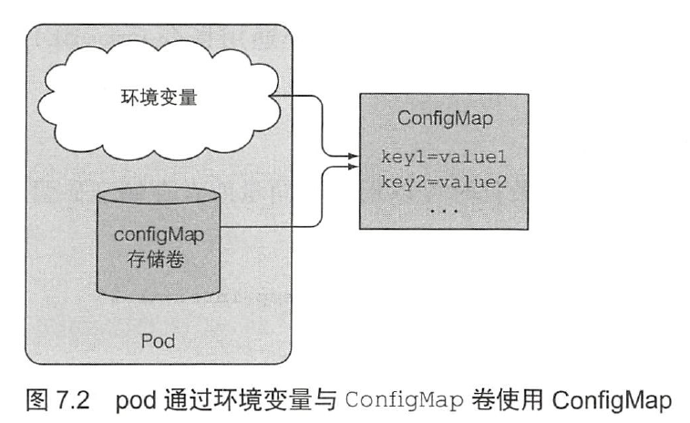
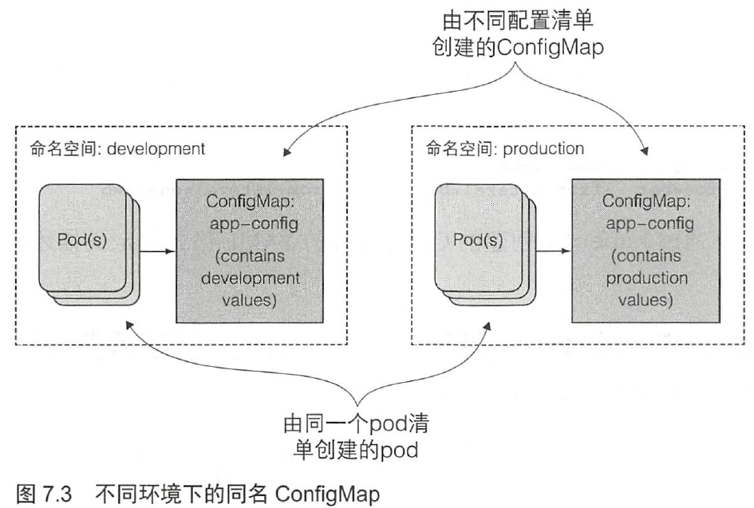
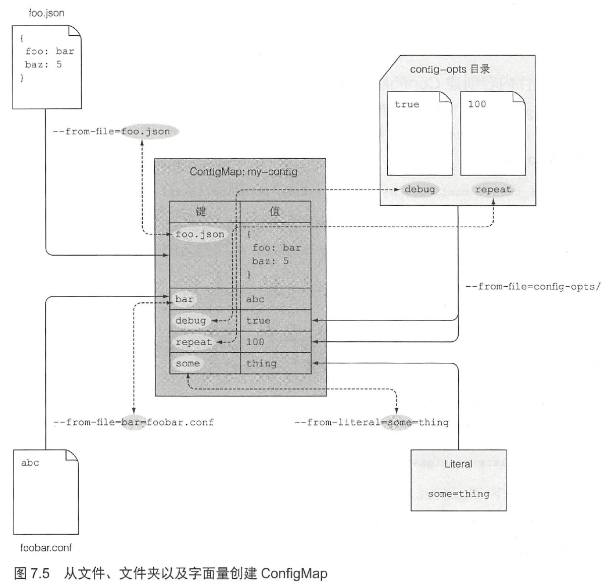

# ConfigMap

配置应用程序的方法：

- 向容器传递命令行参数
- 为每个容器设置自定义环境变量
- 通过特殊类型的卷将配置文件挂载到容器中

在Docker与Kubernetes中指定可执行程序及其参数。

| Docker     | K8s     | 描述                   |
| ---------- | ------- | ---------------------- |
| ENTRYPOINT | command | 容器中运行的可执行文件 |
| CMD        | args    | 传给可执行文件的参数   |

## 命令行参数

``Dockerfile``

```
FROM ubuntu:latest

RUN apt-get update ; apt-get -y install fortune
ADD fortuneloop.sh /bin/fortuneloop.sh

ENTRYPOINT ["/bin/fortuneloop.sh"]
CMD ["10"]
```

CMD默认参数为10。

``fortuneloop.sh``

```bash
#!/bin/bash
trap "exit" SIGINT

INTERVAL=$1
echo Configured to generate new fortune every $INTERVAL seconds

mkdir -p /var/htdocs

while :
do
  echo $(date) Writing fortune to /var/htdocs/index.html
  /usr/games/fortune > /var/htdocs/index.html
  sleep $INTERVAL
done
```

$1表示接受命令行实际传入的参数值。

``fortune-pod-args.yaml``

```yml
apiVersion: v1
kind: Pod
metadata:
  name: fortune2s
spec:
  containers:
  - image: luksa/fortune:args
    args: ["2"]
    name: html-generator
    volumeMounts:
    - name: html
      mountPath: /var/htdocs
  - image: nginx:alpine
    name: web-server
    volumeMounts:
    - name: html
      mountPath: /usr/share/nginx/html
      readOnly: true
    ports:
    - containerPort: 80
      protocol: TCP
  volumes:
  - name: html
    emptyDir: {}
```

luksa/fortune:args 是dockerhub上的一个image，args: ["2"]表示传递给容器的命名行参数。

## 为容器设置环境变量

Dockerfile

```bash
FROM ubuntu:latest

RUN apt-get update ; apt-get -y install fortune
ADD fortuneloop.sh /bin/fortuneloop.sh

ENTRYPOINT ["/bin/fortuneloop.sh"]
```

``fortuneloop.sh``

```bash
#!/bin/bash
trap "exit" SIGINT
echo Configured to generate new fortune every $INTERVAL seconds
mkdir -p /var/htdocs

while :
do
  echo $(date) Writing fortune to /var/htdocs/index.html
  /usr/games/fortune > /var/htdocs/index.html
  sleep $INTERVAL
done
```

> 如果应用由Java编写，需要使用System.getenv("INTERVAL")。

``fortune-pod-env.yaml``

```yaml
apiVersion: v1
kind: Pod
metadata:
  name: fortune-env
spec:
  containers:
  - image: luksa/fortune:env
    env:
    - name: INTERVAL
      value: "30"
    name: html-generator
    volumeMounts:
    - name: html
      mountPath: /var/htdocs
  - image: nginx:alpine
    name: web-server
    volumeMounts:
    - name: html
      mountPath: /usr/share/nginx/html
      readOnly: true
    ports:
    - containerPort: 80
      protocol: TCP
  volumes:
  - name: html
    emptyDir: {}
```

注意这个部分：

```yml
    env:
    - name: INTERVAL
      value: "30"
```

环境变量被设置在pod的容器定义中，并非是pod级别。

## 创建ConfigMap

k8s允许将配置选项分离到单独的资源对象ConfigMap 中，本质上是一个键/值对映射，值可以是短字面量，也可以是完整的配置文件。



pod 通过名称引用ConfigMap，因此可以在多环境下使用相同的pod 定义描述。



- kubectl直接创建ConfigMap

```bash
kubectl create configmap fortune-config --from-literal=sleep-interval=25
```

```bash
[root@vmware0 chapter7]# kubectl create configmap fortune-config --from-literal=sleep-interval=25
configmap/fortune-config created
[root@vmware0 chapter7]# k get cm
NAME             DATA   AGE
fortune-config   1      9s
[root@vmware0 chapter7]# k get cm fortune-config -o yaml
apiVersion: v1
data:
  sleep-interval: "25"
kind: ConfigMap
metadata:
  creationTimestamp: "2019-12-10T16:39:28Z"
  name: fortune-config
  namespace: default
  resourceVersion: "807185"
  selfLink: /api/v1/namespaces/default/configmaps/fortune-config
  uid: b3d4dca1-1f96-481f-89cd-1ef63fef619a
```

- YAML文件创建ConfigMap

``fortune-config.yaml``

```yml
apiVersion: v1
kind: ConfigMap
metadata:
  name: fortune-config
data:
  sleep-interval: "25"
```

```bash
[root@vmware0 chapter7]# k create -f fortune-config.yaml
```

- 合并不同类型的配置源



```bash
kubectl create configmap my-config
  --from-file=foo.json
  --from-file=bar=foobar.conf
  --from-file=configopts/
  --from-literal=some=thing
```

## 读取ConfigMap

- 传递ConfigMap条目作为环境变量

``fortune-pod-env-configmap.yaml``

```yml
apiVersion: v1
kind: Pod
metadata:
  name: fortune-env-from-configmap
spec:
  containers:
  - image: luksa/fortune:env
    env:
    - name: INTERVAL
      valueFrom: 
        configMapKeyRef:
          name: fortune-config
          key: sleep-interval
    name: html-generator
    volumeMounts:
    - name: html
      mountPath: /var/htdocs
  - image: nginx:alpine
    name: web-server
    volumeMounts:
    - name: html
      mountPath: /usr/share/nginx/html
      readOnly: true
    ports:
    - containerPort: 80
      protocol: TCP
  volumes:
  - name: html
    emptyDir: {}
```

注意这部分：

```yml
    env:
    - name: INTERVAL
      valueFrom: 
        configMapKeyRef:
          name: fortune-config
          key: sleep-interval
```

- 传递ConfigMap所有条目作为环境变量

```yml
spec:
  containers:
  - image: some-image
    envFrom:
    - prefix: CONFIG_
      configMapRef:
        name: my-config-map
```

注意是envFrom关键字，prefix是可选的。

## 使用ConfigMap

### 传递ConfigMap条目作为命令行参数

``fortune-pod-args-configmap.yaml``

```yml
apiVersion: v1
kind: Pod
metadata:
  name: fortune-args-from-configmap
spec:
  containers:
  - image: luksa/fortune:args
    env:
    - name: INTERVAL
      valueFrom: 
        configMapKeyRef:
          name: fortune-config
          key: sleep-interval
    args: ["$(INTERVAL)"]
    name: html-generator
    volumeMounts:
    - name: html
      mountPath: /var/htdocs
  - image: nginx:alpine
    name: web-server
    volumeMounts:
    - name: html
      mountPath: /usr/share/nginx/html
      readOnly: true
    ports:
    - containerPort: 80
      protocol: TCP
  volumes:
  - name: html
    emptyDir: {}
```

注意此处引用： ``args: ["$(INTERVAL)"]``

### 使用ConfigMap卷将条目暴露为文件

创建configmap-files文件夹，并在其中新建``my-nginx-config.conf``和``sleep-interval``

```conf
server {
    listen              80;
    server_name         www.kubia-example.com;

    gzip on;
    gzip_types text/plain application/xml;

    location / {
        root   /usr/share/nginx/html;
        index  index.html index.htm;
    }
}
```

``sleep-interval``

```
25
```

查看configmap：

```bash
kubectl create configmap fortune-config --from-file=configmap-files
```

```bash
[root@vmware0 chapter7]# k get configmap fortune-config -o yaml
apiVersion: v1
data:
  my-nginx-config.conf: |
    server {
        listen              80;
        server_name         www.kubia-example.com;

        gzip on;
        gzip_types text/plain application/xml;

        location / {
            root   /usr/share/nginx/html;
            index  index.html index.htm;
        }

    }
  sleep-interval: |
    25
...
```

接下来，创建测试的pod

``fortune-pod-configmap-volume.yaml``

```yml
apiVersion: v1
kind: Pod
metadata:
  name: fortune-configmap-volume
spec:
  containers:
  - image: luksa/fortune:env
    env:
    - name: INTERVAL
      valueFrom:
        configMapKeyRef:
          name: fortune-config
          key: sleep-interval
    name: html-generator
    volumeMounts:
    - name: html
      mountPath: /var/htdocs
  - image: nginx:alpine
    name: web-server
    volumeMounts:
    - name: html
      mountPath: /usr/share/nginx/html
      readOnly: true
    - name: config
      mountPath: /etc/nginx/conf.d
      readOnly: true
    - name: config
      mountPath: /tmp/whole-fortune-config-volume
      readOnly: true
    ports:
      - containerPort: 80
        name: http
        protocol: TCP
  volumes:
  - name: html
    emptyDir: {}
  - name: config
    configMap:
      name: fortune-config
```

```bash
[root@vmware0 chapter7]# k create -f fortune-pod-configmap-volume.yaml
pod/fortune-configmap-volume created

[root@vmware0 ~]#  k  port-forward fortune-configmap-volume 8080:80 &
[1] 34171
[root@vmware0 ~]# Forwarding from 127.0.0.1:8080 -> 80
Forwarding from [::1]:8080 -> 80
Handling connection for 8080

[root@vmware0 ~]# curl -H "Accept-Encoding: gzip" -I localhost:8080
HTTP/1.1 200 OK
Server: nginx/1.17.6
Date: Wed, 11 Dec 2019 08:10:52 GMT
Content-Type: text/html
Last-Modified: Wed, 11 Dec 2019 08:10:37 GMT
Connection: keep-alive
ETag: W/"5df0a47d-8a"
Content-Encoding: gzip
```

注意到 ``Content-Encoding: gzip``代表gzip启用成功。

查看web-server的nginx配置目录：

```bash
[root@vmware0 chapter7]# k exec fortune-configmap-volume -c web-server ls /etc/nginx/conf.d
my-nginx-config.conf
sleep-interval
```

### 按需导入

> 问题：``/etc/nginx/conf.d``文件夹不干净，因为包含了一个sleep-interval文件。这个文件跟 nginx 配置没有任何关系，得想个办法去掉它。

``fortune-pod-configmap-volume-with-items.yaml``

```yml
apiVersion: v1
kind: Pod
metadata:
  name: fortune-configmap-volume-with-items
spec:
  containers:
  - image: luksa/fortune:env
    name: html-generator
    volumeMounts:
    - name: html
      mountPath: /var/htdocs
  - image: nginx:alpine
    name: web-server
    volumeMounts:
    - name: html
      mountPath: /usr/share/nginx/html
      readOnly: true
    - name: config
      mountPath: /etc/nginx/conf.d/
      readOnly: true
    ports:
    - containerPort: 80
      protocol: TCP
  volumes:
  - name: html
    emptyDir: {}
  - name: config
    configMap:
      name: fortune-config
      items:
      - key: my-nginx-config.conf
        path: gzip.conf
```

注意这部分：

```yml
configMap:
      name: fortune-config
      items:
      - key: my-nginx-config.conf
        path: gzip.conf
```

``gzip.conf``表示重命名``my-nginx-config.conf``。

### ConfigMap独立条目作为文件被挂载

```yml
spec:
  containers:
  - image: some/image
    volumeMounts:
    - name: myvolume
      mountPath: /etc/someconfig.conf
      subPath: myconfig.conf
```

将一个``myconfig.conf`` 条目挂载到容器内的 ``/etc/someconfig.conf``。

如果不指定`subPath`，那么原来容器内`/etc`下其他文件会被隐藏，Linux 系统挂载文件系统至非空文件夹时通常表现如此。

### 为configMap卷中的文件设置权限

`fortune-pod-configmap-volume-defaultMode.yaml`

```yml
...  
  volumes:
  - name: html
    emptyDir: {}
  - name: config
    configMap:
      name: fortune-config
      defaultMode: 0660
```

0660 表示 ``-rw-rw----``

### 应用配置热更新

使用环境变量或命令行参数作为配置源的弊端在于无法在进程运行时更新配置。

将ConfigMap暴露为卷可以达到配置热更新的效果， 无须重启容器。

```bash
[root@vmware0 chapter7]# k edit configmap fortune-config
configmap/fortune-config edited
```

将gzip改为off，保存退出vim。

```bash
[root@vmware0 chapter7]# k exec fortune-configmap-volume -c web-server cat /etc/nginx/conf.d/my-nginx-config.conf
server {
    listen              80;
    server_name         www.kubia-example.com;

    gzip off;
    gzip_types text/plain application/xml;

    location / {
        root   /usr/share/nginx/html;
        index  index.html index.htm;
    }
}
```

此时，nginx还没重载配置，需要执行：

```bash
[root@vmware0 chapter7]# kubectl exec fortune-configmap-volume -c web-server -- nginx -s reload
2019/12/11 08:51:53 [notice] 34#34: signal process started
```

验证gzip是否关闭：

```bash
[root@vmware0 ~]# curl -H "Accept-Encoding: gzip" -I localhost:8080
HTTP/1.1 200 OK
Server: nginx/1.17.6
Date: Wed, 11 Dec 2019 08:52:49 GMT
Content-Type: text/html
Content-Length: 64
Last-Modified: Wed, 11 Dec 2019 08:52:45 GMT
Connection: keep-alive
ETag: "5df0ae5d-40"
Accept-Ranges: bytes
```

关于文件的自动更新，k8s是通过创建symbolic link实现的。