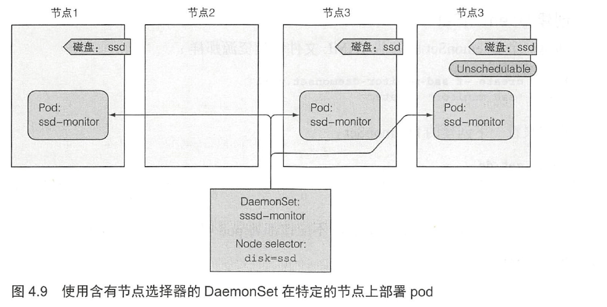

# DaemonSet

DS在每个节点上运行一个pod副本，适用于执行系统级别的与基础结构相关的操作，例如日志收集和监控。

而RS控制的副本数量，副本分布在哪些节点是随意的。



``ssd-monitor-daemonset.yaml``

```yaml
apiVersion: apps/v1beta2
kind: DaemonSet
metadata:
  name: ssd-monitor
spec:
  selector:
    matchLabels:
      app: ssd-monitor
  template:
    metadata:
      labels:
        app: ssd-monitor
    spec:
      nodeSelector:
        disk: ssd
      containers:
      - name: main
        image: luksa/ssd-monitor
```

```bash
[root@vmware0 Chapter04]# kubectl label node minikube disk=ssd
node/minikube labeled
[root@vmware0 Chapter04]# kubectl get ds
NAME          DESIRED   CURRENT   READY   UP-TO-DATE   AVAILABLE   NODE SELECTOR   AGE
ssd-monitor   1         1         0       1            0           disk=ssd        66s
[root@vmware0 Chapter04]# kubectl get po
NAME                READY   STATUS              RESTARTS   AGE
ssd-monitor-rkqqk   0/1     ContainerCreating   0          12s
```

稍等片刻：

```bash
[root@vmware0 Chapter04]# kubectl get ds
NAME          DESIRED   CURRENT   READY   UP-TO-DATE   AVAILABLE   NODE SELECTOR   AGE
ssd-monitor   1         1         1       1            1           disk=ssd        117s
[root@vmware0 Chapter04]# kubectl get po
NAME                READY   STATUS    RESTARTS   AGE
ssd-monitor-rkqqk   1/1     Running   0          58s
```

当在minikube节点撤销disk=ssd后，DS会删除ssd-monitor-rkqqk：

```bash
[root@vmware0 Chapter04]# kubectl label node minikube disk=hdd --overwrite
node/minikube labeled
[root@vmware0 Chapter04]# kubectl get po
NAME                READY   STATUS        RESTARTS   AGE
ssd-monitor-rkqqk   1/1     Terminating   0          3m18s
[root@vmware0 Chapter04]# kubectl get ds
NAME          DESIRED   CURRENT   READY   UP-TO-DATE   AVAILABLE   NODE SELECTOR   AGE
ssd-monitor   0         0         0       0            0           disk=ssd        4m59s
```
