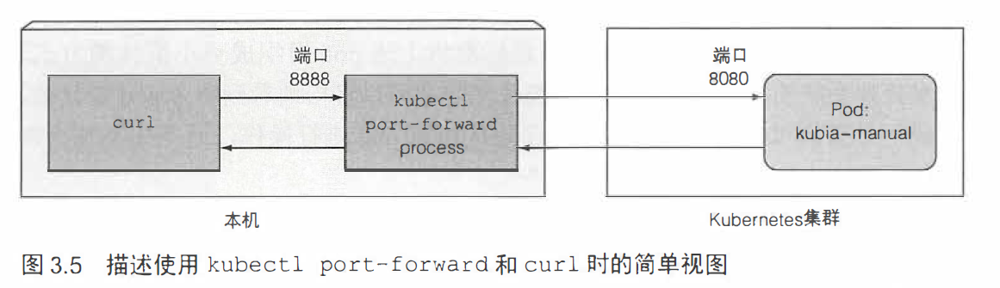

# pod

—个pod的所有容器都运行在同—个节点上，一个pod绝不跨越两个节点。

> 为何多个容器比单个容器中包含多个进程要好?

容器被设计为每个容器只运行一个进程（除非进程本身产生子进程）。如果在单个容器中运行多个不相关的进程， 那么保持所有进程运行、管理将会变得非常困难。

由于一个pod 中的容器运行于相同的Network 命名空间中， 共享相同的 IP 地址和端口空间。所以在同一pod 中的容器运行的多个进程不能绑定到相同的端口号， 否则会端口冲突。

> 在pod中应该使用多个容器还是一个容器？

如果应用由一个主进程和一个或多个辅助进程组成，使用多容器组成一个pod。否则单容器单pod也不错，方便伸缩。

## 基于配置文件创建pod

```yaml
# kubia-manual.yaml
apiVersion: v1
kind: Pod
metadata:
  name: kubia-manual
spec:
  containers:
  - image: luksa/kubia
    name: kubia
    ports:
    - containerPort: 8080
      protocol: TCP
```

```bash
kubectl create -f kubia-manual.yaml

# 查看pod的状态
# kubectl get po kubia-manual -o json
kubectl get po kubia-manual -o yaml
```

查看应用程序的日志：

```bash
[root@vmware0 ~]# docker logs 7b7 -f
Kubia server starting...

[root@vmware0 ~]# kubectl logs kubia-manual -f
Kubia server starting...

# -c 指定pod中的某个容器
[root@vmware0 ~]# kubectl logs kubia-manual -c kubia
Kubia server starting...
```

## 端口转发

将本地网络端口转发到pod中的端口：

```bash
yum install socat
kubectl port-forward kubia-manual 8888:8080
curl localhost:8888
```



## 标签

标签可以使用两个维度：app 和 rel。

- app 表示业务划分，例如UI，OS；
- rel 表示版本阶段，例如stable，beta。

`kubia-manual-with-labels.yaml`

```yaml
apiVersion: v1
kind: Pod
metadata:
  name: kubia-manual-v2
  labels:
    creation_method: manual
    env: prod
spec:
  containers:
  - image: luksa/kubia
    name: kubia
    ports:
    - containerPort: 8080
      protocol: TCP
```

```bash
[root@vmware0 ~]# kubectl get pods --show-labels
NAME              READY   STATUS    RESTARTS   AGE     LABELS
kubia-g6ml6       1/1     Running   0          11h     run=kubia
kubia-h9wfw       1/1     Running   0          11h     run=kubia
kubia-manual      1/1     Running   0          7h27m   <none>
kubia-manual-v2   1/1     Running   0          21s     creation_method=manual,env=prod
kubia-vnjmm       1/1     Running   0          12h     run=kubia
```

添加标签：

```bash
kubectl label po kubia-manual creation_method=manual
```

修改标签：

```bash
kubectl label po kubia-manual-v2 env=debug --overwrite
```

可以使用标签选择器列出pod：

```bash
kubectl get po -l creation_method=manual
```

使用标签分类工作节点：

```bash
kubectl label node XXXX gpu=true
kubectl get nodes -l gpu=true
```

将pod调度到特定节点上：

``kubia-gpu.yaml``

```yaml
apiVersion: v1
kind: Pod
metadata:
  name: kubia-gpu
spec:
  nodeSelector:
    gpu: "true"
  containers:
  - image: luksa/kubia
    name: kubia
```

## 注解

添加/修改注解：

```bash
[root@vmware0 ~]# kubectl annotate po kubia-manual mycompany.com/someannotation="foo bar"
pod/kubia-manual annotated
[root@vmware0 ~]# kubectl describe po kubia-manual
Name:         kubia-manual
Namespace:    default
Priority:     0
Node:         minikube/192.168.31.12
Start Time:   Wed, 27 Nov 2019 00:52:57 +0800
Labels:       creation_method=manual
Annotations:  mycompany.com/someannotation: foo bar
Status:       Running
IP:           172.17.0.4
IPs:          <none>
Containers:
  kubia:
    Container ID:   docker://7b7aa84ace10add42f48f0e1fe8eb80232a663b403ed23002c85967e545819a6
    Image:          luksa/kubia
    Image ID:       docker-pullable://luksa/kubia@sha256:3f28e304dc0f63dc30f273a4202096f0fa0d08510bd2ee7e1032ce600616de24
    Port:           8080/TCP
    Host Port:      0/TCP
    State:          Running
      Started:      Wed, 27 Nov 2019 00:53:02 +0800
    Ready:          True
    Restart Count:  0
    Environment:    <none>
    Mounts:
      /var/run/secrets/kubernetes.io/serviceaccount from default-token-27dmz (ro)
Conditions:
  Type              Status
  Initialized       True 
  Ready             True 
  ContainersReady   True 
  PodScheduled      True 
Volumes:
  default-token-27dmz:
    Type:        Secret (a volume populated by a Secret)
    SecretName:  default-token-27dmz
    Optional:    false
QoS Class:       BestEffort
Node-Selectors:  <none>
Tolerations:     node.kubernetes.io/not-ready:NoExecute for 300s
                 node.kubernetes.io/unreachable:NoExecute for 300s
Events:          <none>
```

## 命名空间

是一个作用域，用于隔离资源。

```bash
[root@vmware0 ~]# kubectl get ns
NAME              STATUS   AGE
default           Active   32h
kube-node-lease   Active   32h
kube-public       Active   32h
kube-system       Active   32h
[root@vmware0 ~]# kubectl get po -n kube-system
NAME                                  READY   STATUS    RESTARTS   AGE
coredns-6967fb4995-7cwkc              1/1     Running   0          33h
coredns-6967fb4995-vwnbb              1/1     Running   0          33h
etcd-minikube                         1/1     Running   0          33h
kube-addon-manager-minikube           1/1     Running   0          33h
kube-apiserver-minikube               1/1     Running   0          33h
kube-controller-manager-minikube      1/1     Running   0          33h
kube-proxy-hdf2n                      1/1     Running   0          33h
kube-scheduler-minikube               1/1     Running   0          33h
kubernetes-dashboard-95564f4f-tsrxl   1/1     Running   0          20h
storage-provisioner                   1/1     Running   0          33h
```

创建namespace：

``custom-namespace.yaml``

```yaml
apiVersion: v1
kind: Namespace
metadata:
  name: custom-namespace
```

或者直接：``kubectl create ns custom-namespace``

命名空间之间是否提供网络隔离取决于Kubemetes 所使用的网络解决方案。

## pod的删除

按名称删除：``kubectl delete po kubia-manual-v2``

使用标签删除pod：``kubectl delete po -l creation_method=manual``

删除整个namespace：``kubectl delete ns custom-namespace``

删除namespace几乎所有资源：``kubectl delete all --all``