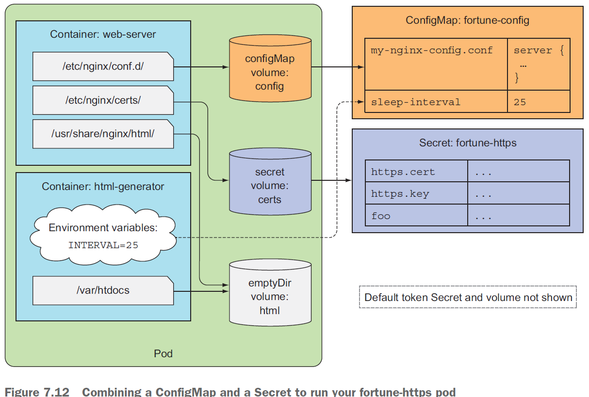

# Secret

Secret 结构与ConfigMap类似，均是键/值对的映射。用法：

- 将Secret 条目作为环境变量传递给容器
  
- 将Secret 条目暴露为卷中的文件

采用ConfigMap 存储非敏感的文本配置数据，采用Secret 存储敏感的数据， 通过键来引用。

## 默认令牌Secret

```bash
[root@vmware0 configmap-files]# k get secrets
NAME                  TYPE                                  DATA   AGE
default-token-27dmz   kubernetes.io/service-account-token   3      15d
[root@vmware0 configmap-files]# k describe secrets
Name:         default-token-27dmz
Namespace:    default
Labels:       <none>
Annotations:  kubernetes.io/service-account.name: default
              kubernetes.io/service-account.uid: ae9f224d-a9c7-40ee-8e64-b6c62a69ebd4

Type:  kubernetes.io/service-account-token

Data
====
ca.crt:     1066 bytes
namespace:  7 bytes
token:      eyJhbGciOiJSUzI1NiIsImtpZCI6I...
```

```bash
[root@vmware0 configmap-files]# k describe po fortune-configmap-volume 
...
Mounts:
  /var/run/secrets/kubernetes.io/serviceaccount from default-token-27dmz (ro)
```

## 创建Secret

```bash
openssl genrsa -out https.key 2018
openssl req -new -x509 -key https.key -out https.cert -days 3650 -subj /CN=www.kubia-example.com
echo bar > foo

k create secret generic fortune-https --from-file=https.key --from-file=https.cert --from-file=foo
```

```bash
[root@vmware0 chapter7]# k get secrets
NAME                  TYPE                                  DATA   AGE
default-token-27dmz   kubernetes.io/service-account-token   3      15d
fortune-https         Opaque                                3      23s
```

```bash
[root@vmware0 chapter7]# k get secret fortune-https -o yaml
apiVersion: v1
data:
  foo: YmFyCg==
  https.cert: LS0tLS1CRUdJTiBDRVJUS...
  https.key: LS0tLS1CRUdJTiBSU0EgUFJ...
kind: Secret
metadata:
  creationTimestamp: "2019-12-11T09:40:45Z"
  name: fortune-https
  namespace: default
  resourceVersion: "825695"
  selfLink: /api/v1/namespaces/default/secrets/fortune-https
  uid: 851a1789-8c7e-4876-a28d-4e724819a103
type: Opaque
```

Secret数据的值会被base64编码，而ConfigMap则是明文存储。但K8s也允许通过Secret的
stringData字段设置条目的纯文本值。

### 修改ConfigMap开启HTTPS

```bash
k edit configmap fortune-config
```

```conf
server {
    listen              80;
    listen              443 ssl;
    server_name         www.kubia-example.com;
    ssl_certificate     certs/https.cert;
    ssl_certificate_key certs/https.key;
    ssl_protocols       TLSv1 TLSv1.1 TLSv1.2;
    ssl_ciphers         HIGH:!aNULL:!MD5;

    location / {
        root   /usr/share/nginx/html;
        index  index.html index.htm;
    }
}
```

以上配置表示从容器的`/etc/nginx/serts`文件夹获取证书与秘钥文件。

### 挂载fortune-secret至pod

接下来需要将fortune-https 这个secret挂载至pod中

``fortune-pod-https.yaml``

```yml
apiVersion: v1
kind: Pod
metadata:
  name: fortune-https
spec:
  containers:
  - image: luksa/fortune:env
    name: html-generator
    env:
    - name: INTERVAL
      valueFrom: 
        configMapKeyRef:
          name: fortune-config
          key: sleep-interval
    volumeMounts:
    - name: html
      mountPath: /var/htdocs
  - image: nginx:alpine
    name: web-server
    volumeMounts:
    - name: html
      mountPath: /usr/share/nginx/html
      readOnly: true
    - name: config
      mountPath: /etc/nginx/conf.d
      readOnly: true
    - name: certs
      mountPath: /etc/nginx/certs/
      readOnly: true
    ports:
    - containerPort: 80
    - containerPort: 443
  volumes:
  - name: html
    emptyDir: {}
  - name: config
    configMap:
      name: fortune-config
      items:
      - key: my-nginx-config.conf
        path: https.conf
  - name: certs
    secret:
      secretName: fortune-https
```

测试nginx是否已经启用https

```bash
[root@vmware0 chapter7]# k port-forward fortune-https 6443:443
Forwarding from 127.0.0.1:6443 -> 443
Forwarding from [::1]:6443 -> 443

[root@vmware0 chapter7]# curl -k https://localhost:6443
Your aim is high and to the right.
```

>  curl 使用-*k*参数忽略证书不受信问题。 



再次确认Secret卷存于内存，不会写入磁盘。

```bash
[root@vmware0 chapter7]# k exec fortune-https -c web-server -- mount | grep crets
tmpfs on /run/secrets/kubernetes.io/serviceaccount type tmpfs (ro,relatime)
```

### 通过环境变量暴露Secret条目

```yml
env:
- name: FOO_SECRET
  valueFrom:
    secretKeyRefL:
      name: fortune-https
      key: foo
```

这种做法虽然可行，但不推荐。还是建议使用secret卷。

### 创建用于Docker镜像仓库鉴权的Secret

```
kubectl create secret docker-registry mydockerhubsecret \
--docker-username=myusername --docker-password=mypassword \
--docker-email=my.email@provider.com
```

这里创建了一个docker-registry类型的secret，名字为mydockerhubsecret。

使用方式：

```yml
apiVersion: v1
kind: Pod
metadata:
  name: private-pod
spec:
  imagePullSecrets:
  - name: mydockerhubsecret
  containers:
  - image: username/private:tag
    name: main
```

