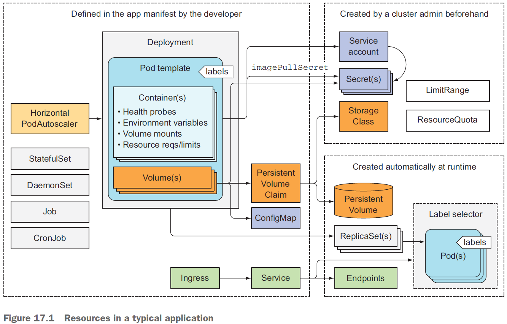
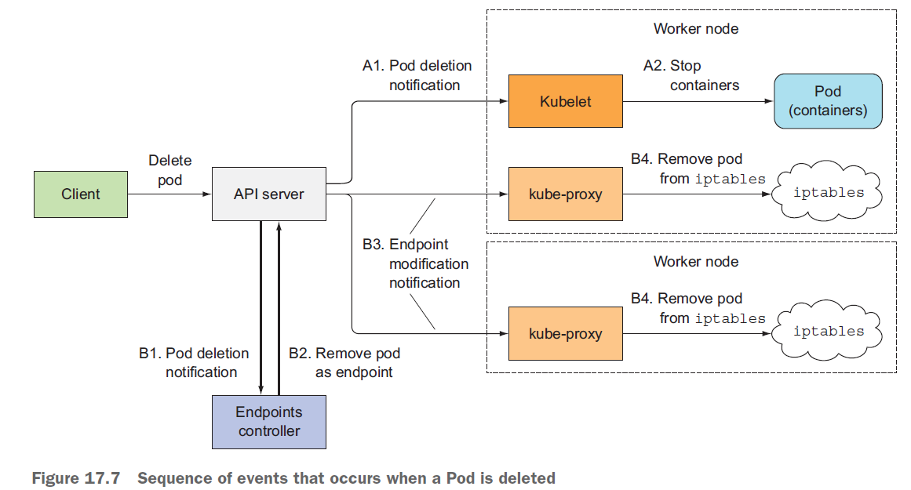
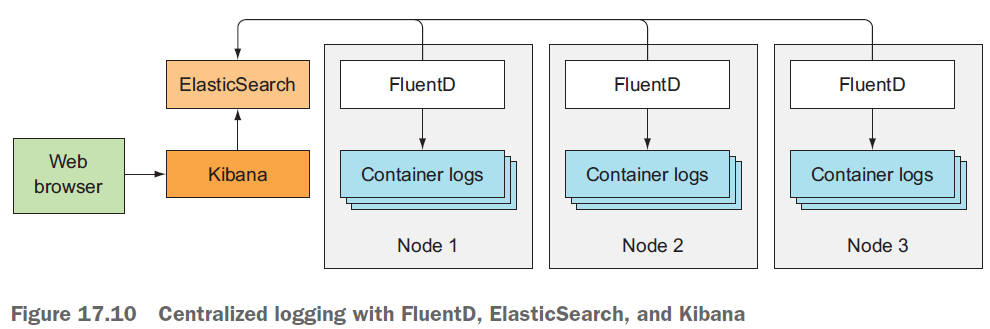

# K8s最佳实践



---

当需要从集群外访问这些服务，可以:

- 将这些服务配置为LoadBalancer 或者NodePort 类型的服务，
- 通过Ingress 资源来开放服务。

---

pod 模板通常会引用两种类型的私密凭据（ Secret ） 。

- 一种是从私有镜像仓库拉取镜像时使用的；
- 另一种是pod 中运行的进程直接使用的。

私密凭据通常会被分配给ServiceAccount ，然后
ServiceAccount 会被分配给每个单独的pod。

---

LimitRange 和ResourceQuota 对象，可以控制每个pod 和所有的pod（一个整体）的计算资源使用情况。

---

资源通常通过一个或者多个标签来组织。这不仅适用于pod ，也适用于其他的资源。

标签可以包含如下内容：

- 资源所属的应用（或者微服务） 的名称
  
- 应用层级（前端、后端，等等）
- 运行环境（开发、测试、预发布、生产，等等）
- 版本号
- 发布类型（稳定版、金丝雀、蓝绿开发中的绿色或者蓝色，等等）

---

资源至少应该包括一个描述资源的注解和一个描述资源负责人的注解。

---

集群应用中不应该依赖成员的IP地址来构建彼此的关系，另外如果使用主机名来构建关系，必须使用StatefulSet。

---

使用存储卷（Volume）来跨容器持久化数据。

---

K8s API服务器确实按照YAML/JSON文件中定义的对象的顺序来进行处理，这仅仅意味着它们在被写入到etcd的时候是有顺序的。无法确保pod会按照那个顺序启动。

你可以阻止一个主容器的启动，直到它的预置条件被满足。这通过在
pod中包含一个叫作init的容器来实现。

`fortune-client.yaml`

```yml
apiVersion: v1
kind: Pod
metadata:
  name: fortune-client
spec:
  initContainers:
  - name: init
    image: busybox
    command:
    - sh
    - -c
    - 'while true; do echo "Waiting for fortune service to come up..."; wget http://fortune -q -T 1 -O /dev/null >/dev/null 2>/dev/null && break; sleep 1; done; echo "Service is up! Starting main container."'
  containers:
  - image: busybox
    name: main
    command:
    - sh
    - -c
    - 'echo "Main container started. Reading fortune very 10 seconds."; while true; do echo "-------------"; wget -q -O - http://fortune; sleep 10; done'
```

---

处理 pod 内部依赖的最佳实践：构建不需要它所依赖的服务都准备好后才能启动的应用。

---



pod的关闭流程A：

1. 执行停止前钩子（如果配置了）， 然后等待它执行完毕

2. 向容器的主进程发送SIGTERM信号

3. 等待容器优雅地关闭或者等待终止宽限期超时

4. 如果容器主进程没有优雅地关闭， 使用SIGKILL信号强制终止进程

pod的后续清理流程B：

1. 端点控制器接收到 pod 要被删除的通知，

2. 端点控制器从所有 pod 所在的服务中移除了这个pod 的服务端点，
3. 端点控制器向API 服务器发送 REST 请求来修改Endpoint API 对象。API 服务器会通知所有的工作节点上的 kube-proxy 关注这个Endpoint 对象。
4. 每个 kube-proxy 服务在自己的节点上更新 iptables 规则。

流程A和B并行发生。


---

妥善关闭一个应用的步骤：

1. 等待几秒钟，然后停止接收新的连接。
   
2. 关闭所有没有请求过来的长连接。
3. 等待所有的请求都完成。
   
4. 然后完全关闭应用。

至少你可以**添加一个停止前钩子来等待几秒钟再退出**。

```yml
lifecycle:
  preStop:
    exec:
      command:
      - sh
      - -c
      - "sleep 5"
```

---

合理地给镜像打标签，正确地使用lmagePullPolicy。

---

给进程终止提供更多的信息。这个进程需要写入终止消息的文件默认路径是`dev/termination-log`。

运行一个容器会立即死亡的pod来感受一下。

`termination-message.yaml`

```yml
apiVersion: v1
kind: Pod
metadata:
  name: pod-with-termination-message
spec:
  containers:
  - image: busybox
    name: main
    command:
    - sh
    - -c
    - 'echo "I''ve had enough" > /var/termination-reason ; exit 1'
    terminationMessagePath: /var/termination-reason
```

```bash
[root@vmware0 chapter17]# k create -f termination-message.yaml 
pod/pod-with-termination-message created
[root@vmware0 chapter17]# k get po
NAME                           READY   STATUS              RESTARTS   AGE
pod-with-termination-message   0/1     ContainerCreating   0          4s
[root@vmware0 chapter17]# k describe po pod-with-termination-message
...
    State:      Terminated
      Reason:   Error
      Message:  I've had enough

      Exit Code:    1
      Started:      Fri, 13 Dec 2019 05:58:13 +0800
      Finished:     Fri, 13 Dec 2019 05:58:13 +0800
```

---

处理应用日志。

- 将日志写到标准输出终端（默认）。使用`kubectl logs`查看。

- 将日志写到容器内文件。使用`kubectl exec <pod> -c <container> cat <logfile>`查看。或者`kubectl cp foo-pod:/var/log/foo.log foo.log`将其复制到外部保存。

- 使用集中式日志记录（生产环境推荐这种）。由ElasticSearch、Logstash和Kibana组成的ELK栈。EFK栈， 其中 Logstash 被FluentD替换。每个K8s集群节点都会运行一个FluentD 的代理（ 通过使用DaemonSet作为pod来部署）。

  

> 可以使用Kubemetes社区创造的图表来部署EFK栈， 不用再自己创建YAML manifest文件。

处理多行日志输出。

问题：FluentD代理将日志文件的每一行当作一个条目存储在ElasticSearch数据存储中。

解决方案：或许是输出到标准输出终端的日志仍然是用户可读的日志， 但是写入日志文件供FluentD处理的日志是JSON格式。可以在节点级别合理地配置
FluentD代理，使得或者给每一个pod增加一个轻量级的日志记录容器。

---

开发和测试的最佳实践。

- 考虑将本地文件系统通过Docker的Volume挂载到容器中。
- 在开发过程中使用Minikube。
- 考虑将本地文件挂载到Minikube VM然后再挂载到容器中。使用minikube mount命令将本地的文件系统挂载到Minikube
  VM中， 然后通过一个hostPath卷挂载到容器中。
- 在Minikube VM中使用Docker Daemon来构建镜像。
- 在本地构建镜像然后直接复制到Minikube VM中。（imagePullPolicy不要设置为Always）
- 将Minikube 和Kubernetes 集群结合起来。
- 使用Ksonnet简化k8s配置文件yml的创建。
- 利用CI/CD解决自动部署问题。推荐 http://fabric8.io。

