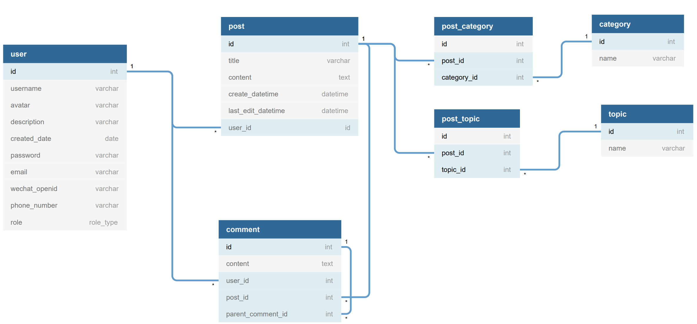

# 帖子社区数据库设计

RDBMS schema 在线建模 https://dbdiagram.io/。API文档： https://www.dbml.org/docs/

## 表
- 用户
- 帖子
- 评论
- 话题
- 分类
- 帖子-话题 中间表
- 帖子-分类 中间表

## 表之间的现实关系
- 一个用户可以发表多个帖子
- 一个用户可以在某个帖子下，发布多个评论
- 评论可以对帖子，也可以对评论
- 一个帖子可以属于多个分类
- 一个帖子可以属于多个话题

表之间的关系一般通过外键ID(one-to-many)或者中间表(many-to-many)实现。

## 表字段




考虑索引：
- 主键索引（主键一定是唯一索引）
- 非主键的单字段索引（优化where单字段条件查询）
- 组合字段索引（联合多个字段，从左到右建立，优化复杂where条件查询）

索引常见的实现是BTree或者HASH。

考虑外键约束：

1.第一种做法：数据库表定义外键约束
```
delete / update: cascade | restrict | set null | set default | no action
```
常见组合是 delete cascade update no action

2.第二种做法：不在数据库设置任何外键约束。转移到应用程序处理。