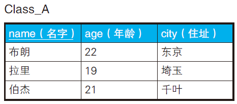
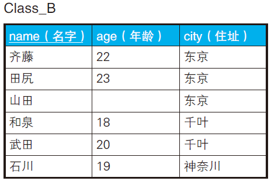

# 三值逻辑

二值逻辑很容易理解，非真即假。

三值逻辑中却还有一个值unknown（或者NULL）。

## 理论

两种NULL分别指的是“未知”（unknown） 和“不适用”（N/A）。

- 一个人带着墨镜，我知道他有眼睛，但是我不知道他眼睛的颜色。-> unknown
- 冰箱的眼睛的颜色？->不适用（N/A)，这玩意没有眼睛。

**现在所有的DBMS 都将两种类型的**
**NULL 归为了一类并采用了三值逻辑**。

```sql
-- 以下的式子都会被判为 unknown
1 = NULL
2 > NULL
3 < NULL
4 <> NULL
NULL = NULL
```

NULL 不是值也不是变量。NULL 只是一个表示“没有值”的标记，而比较谓词只适用于值。

因此，**对并非值的NULL 使用比较谓词本来就是没有意义的**。

**我们应该把`IS
NULL`看作是一个谓词，看成是一个整体**。

而unknown是一个真值，表示未知。`(unknown = unknown) → true`

真值之间有下面这样的优先级顺序。

- AND 的情况： false ＞ unknown ＞ true
- OR 的情况： true ＞ unknown ＞ false
- NOT：(NOT unknown) = unknown

优先级高的真值会决定计算结果。例如:

- true AND unknown，因为
  unknown 的优先级更高，所以结果是unknown。
- true OR unknown 的话，
  因为true 优先级更高，所以结果是true。

### 排中律不适用于SQL

| name | age  |
| ---- | ---- |
| 布朗 | 22   |
| 拉里 | 19   |
| 约翰 |      |
| 伯杰 | 21   |

```sql
SELECT *
FROM Students
WHERE age = 20
OR age <> 20;
```

此时，是查询不出约翰的，因为约翰年龄IS NULL。

### NOT IN 和NOT EXISTS 不等价

如果NOT IN 子查询中用到的表里面被选择的列中存在NULL，则SQL语句整体的查询结果永远是空。

假设A班级和B班级如下：





如何查询“与B 班住在东京的学生年龄不同的A班学生”?

```sql
SELECT *
  FROM Class_A A
  WHERE NOT EXISTS ( SELECT *
                    FROM Class_B B
                    WHERE A.age = B.age
                    AND B.city = '东京' );
```

当B.age为NULL时，处理过程如下：

```sql
SELECT *
  FROM Class_A A
  WHERE NOT EXISTS ( SELECT *
                    FROM Class_B B
                    WHERE A.age = NULL
                    AND B.city = '东京' );
                    
SELECT *
  FROM Class_A A
  WHERE NOT EXISTS ( SELECT *
                    FROM Class_B B
                    WHERE unknown
                    AND B.city = '东京' );  

-- 如果 AND 运算里包含unknown，结果不会是true
SELECT *
  FROM Class_A A
  WHERE NOT EXISTS ( SELECT *
                    FROM Class_B B
                    WHERE false 或 unknown );      
  
-- 子查询没有返回结果，因此 NOT EXISTS 为true  
SELECT *
  FROM Class_A A
  WHERE true;                        
```

山田被作为“与任何人的年龄都不同的人”来处理了。

**EXISTS 谓词永远不会返回unknown。EXISTS 只会返回true 或者false**。因此
IN 和EXISTS 可以互相替换使用，而NOT IN 和NOT EXISTS 却不可以互相替换。

### ALL关键字

**ALL 谓词是多个以AND 连接的逻辑表达式的省略写法**。

```sql
SELECT *
FROM Class_A
WHERE age < ALL ( 22, 23, NULL );

--2. 将ALL 谓词等价改写为AND
SELECT *
FROM Class_A
WHERE (age < 22) AND (age < 23) AND (age < NULL);

--3. 对NULL 使用“<”后，结果变为 unknown
SELECT *
FROM Class_A
WHERE (age < 22) AND (age < 23) AND unknown;

--4. 如果AND 运算里包含unknown，则结果不为true
SELECT *
FROM Class_A
WHERE false 或 unknown;
```

### 极值函数

min或max都是极值函数。

极值函数在统计时会把为NULL 的数据排除掉。

极值函数在输入为空表（空集）时会返回NULL。

## 小结

1. NULL 不是值，不能对其使用谓词。
3. **对NULL 使用谓词后的结果是unknown**。
4. unknown 参与到逻辑运算时，SQL 的运行会变得诡异。
4. 按步骤追踪SQL 的执行过程能有效排查诡异情况。
5. 要想解决NULL 带来的各种问题，应该往表里添加NOT NULL 约束来尽力排除NULL。这样就尽可能回到二值逻辑世界。