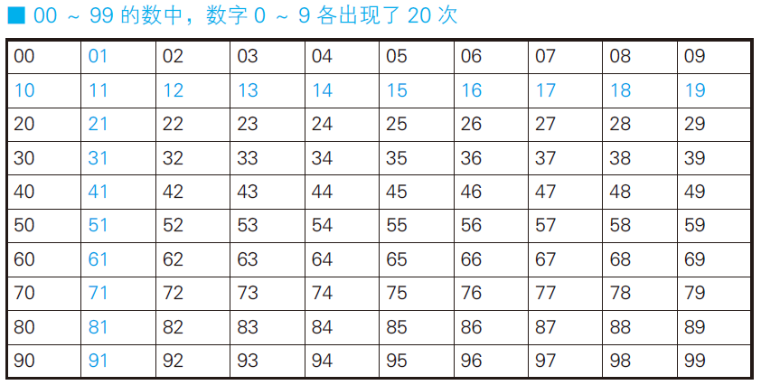
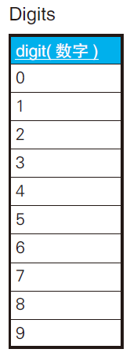
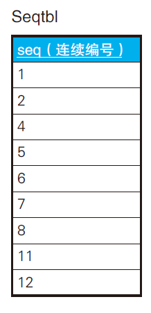

# SQL处理数组

## 生成连续编号



新建一个数字表digits



```sql
SELECT D1.digit + (D2.digit * 10) AS seq
FROM Digits D1 CROSS JOIN Digits D2
ORDER BY seq;
```

```
seq
---
0
1
2
：
98
99
```

## 求全部的缺失编号

思路：任意地生成0 ～ n 的自然数集合，然后和比较的对象表进行差集运算。

通过SQL 求差集的方法有很多种。

- 如果数据库支持EXCEPT，可以直接使用它。
- 还可以使用
  NOT EXISTS 或NOT IN，
- 外连接



可以先求出1~12的自然数集合，减去上表即可。

```sql
SELECT seq
FROM Sequence
WHERE seq BETWEEN 1 AND 12
EXCEPT
SELECT seq FROM SeqTbl;
```

或者

第一步生成辅助VIEW(0~999)

```sql
CREATE VIEW Sequence (seq)
AS SELECT D1.digit + (D2.digit * 10) + (D3.digit * 100)
FROM Digits D1 CROSS JOIN Digits D2
CROSS JOIN Digits D3;
```

第二步

```sql
SELECT seq
FROM Sequence
WHERE seq BETWEEN 1 AND 12
AND seq NOT IN (SELECT seq FROM SeqTbl);
```

```
seq
---
3
9
10
```

上面的`BETWEEN 1 AND 12` 可以替换为泛用版本

```sql
BETWEEN (SELECT MIN(seq) FROM SeqTbl)
AND (SELECT MAX(seq) FROM SeqTbl)
```

> 在“seq”列上建立索引，极值函数的运行可以变得更快速。

## 小结

1. SQL 处理数据的方法有两种。

2. 第一种是把数据看成无序的集合。

3. **第二种是把数据看成有序的集合，此时的基本方法如下。**

**a. 首先用自连接生成起点和终点的组合**
　
　**b. 其次在子查询中描述内部的各个元素之间必须满足的关系**
　
4. 要在SQL 中表达全称量化时，需要将全称量化命题转换成存在量化命题的否定形式，并使用NOT EXISTS 谓词。因为SQL 只实现了谓词逻辑中的存在量词。

## 练习

### 问题1

使用NOT EXISTS 和外连接实现差集。

```sql
SELECT seq
  FROM Sequence N
 WHERE seq BETWEEN 1 AND 12
   AND NOT EXISTS
        (SELECT *
           FROM SeqTbl S
          WHERE N.seq = S.seq );
```

```sql
SELECT N.seq
  FROM Sequence N LEFT OUTER JOIN SeqTbl S
    ON N.seq = S.seq
 WHERE N.seq BETWEEN 1 AND 12
   AND S.seq IS NULL;
```