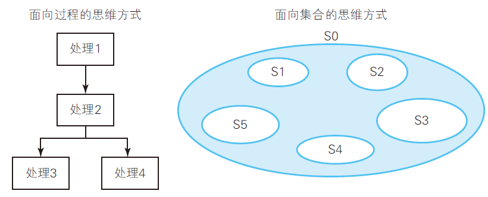

# SQL 总结

> 在这个世界上，无论看起来多么普通的事物，背后总是隐藏着深刻的原理。
>
> 这个世界没有一天是无聊的，只不过是你懒惰已久的感官无法发现眼前事物的乐趣而已。

---
行->列转换方法
1. select 中使用 case 子句
2. select 中使用自连接

列->行转换方法
1. 创建辅助view，使用左外连接
---

SQL 中各部分的执行顺序：

**FROM → WHERE → GROUP BY → HAVING →**
**SELECT( → ORDER BY)**

1. FROM：指定要查找的表
2. WHERE：指定筛选行的条件。
3. GROUP BY：结果分区。
4. HAVING：对分区结果进行筛选。
5. SELECT：列的格式转换和计算。

严格地说，ORDER BY 并不是SQL 语句的一部分，
可以排除在外。这样一来，SELECT 就是最后才被执行的部分。

> 这也是在SELECT 子句中为列起的别名无法在GROUP BY 子句中使用的原因。

如果把从SELECT 子句开始写的方法称为自顶向下法，那么从FROM
子句开始写的方法就可以称为自底向上法。

---

1969年，一切的开始。

1970年，Codd 明确主张关系模型应该在表现层放弃指针，提出范式的概念。

---

关系和表的区别。

- 关系中不允许存在重复的元组（tuple），而表中可以存在。
- 关系中的元组没有从上往下的顺序，而表中的行有从上往下的顺序
  
- 关系中的属性没有从左往右的顺序，而表中的列有从左往右的顺序
- 关系中所有的属性的值都是不可分割的，而表中列的值是可以分割的。换句话说，关系中的属性满足第一范式，而表中的列不满足第一范式

---

关系的正确定义。
$$
R ⊆ （D1×D2×D3 · · · ×Dn）
$$
（关系用符号R 表示，属性用符号Ai 表示，属性的定义域用符号Di 表示）

**关系R 是定义域D1, D2, …, Dn 的笛卡儿积的子集**。

假设有3 个属性a1、a2、a3，属性对应的定义域分别叫作d1、d2、d3。

```
d1 = { 1 }
d2 = { 男 , 女 }
d3 = { 红 , 绿 , 黄 }
```

使用这3 个定义域生成关系时，最大的元组数是1×2×3 ＝ 6。

---

文件系统与数据库的目的都是提高数据的存储效率，两者都采用树形结构。

如今关系数据库只定义了一阶关系，相当于“只能定义一层目录的文件系统。

---

在UNIX 中，文件对于Shell 命令是封闭的；在关系模型中，关系对关系运算符也是封闭的。

SQL 中
SELECT 子句的输入输出都是表。

---

数学中的群环域

- 群（group）：对加法和减法（或者乘法和除法）封闭
- 环（ring）：对加法、减法、乘法封闭
- 域（field）：对加法、减法、乘法、除法封闭，即可以自由进行四则运算

群的理解：**整数集为群，因为任意两个整数的加减结果必然是整数**。

环的理解：**整数集为环，因为任意两个整数的乘法结果必然是整数**。而且整数集已证明为群。

域的理解：**实数集为域，因为除法也封闭**。

对于关系模型，集合运算支持加法（UNION），减法（EXCEPT），乘法（CROSS JOIN），但是不原生支持除法。但是，存在除法的定义。因此，关系也满足域的条件。

---

追求理论的严谨，并不会降低实用性。相反，越严谨越优雅的理论越实用。

---

关系模型之前的数据库模型，例如分层模型和网状模型，都严重依赖地址。但是，我们想要的是“数据”，而不是“用于表明数据位置的地址“。所以，地址作为底层实现细节应该被隐藏起来对外不可见。

在关系模型中，通过完全关联的编址来代替位置地址。在关系数据库中，每个数据可以借助于关系名、主键的值以及属性名唯一地编址。即，**从某个表中按条件挑出某些行，筛选某些列**。

> 冯·诺依曼型计算机，不仅使用地址管理数据，而且要求运行于其上的程序也要这样。

---

面向集合思维的7 个关键点

1. 用CASE 表达式代替IF 语句和CASE 语句。SQL
   更像一种函数式语言。
2. 用GROUP BY 和关联子查询代替循环
3. 表中的行没有顺序
4. 将表看成集合
5. 理解EXISTS 谓词和“量化”的概念
6. 学习HAVING 子句的真正价值：设置针对集合的条件
7. 不要画长方形，去画圆



---

为了兼容NULL，关系数据库选择了允许空值（unknown）的三值逻辑来代替标准的二值逻辑。

**明年今天，我将会在A地。**

在今天看来，无法肯定，也无法否定，只能说是未知。

**古典逻辑学**最受批判的理论是排中律（A ∨ ¬ A），以及支撑它的二值原理。

---

对NULL的处理：

- **如果能设置默认值，那就设置默认值，而不是NULL**。
- 如果无论如何都无法设置默认值，允许使用NULL。

---

在对表进行聚合查询（GROUP BY）时，只能在SELECT 子句中写下面3 种内容。
1. 通过GROUP BY 子句指定的聚合键
2. 聚合函数（SUM、AVG 等）
3. 常量。

GROUP BY 的作用是将一个个元素划分成若干个子集。

Q：为什么聚合查询的SELECT 子句中不能直接引用原表中的列？

A：**使用GROUP BY 聚合后，SQL 的操作对象由0 阶的“行”变为了1 阶的“行的集合”**。此时，行的属性不能使用。SQL层级非常分明。

---

