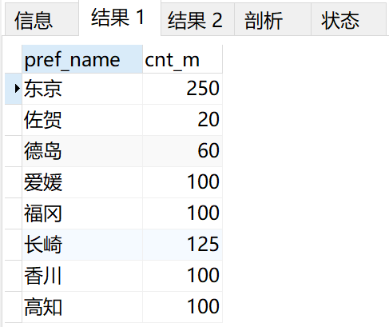
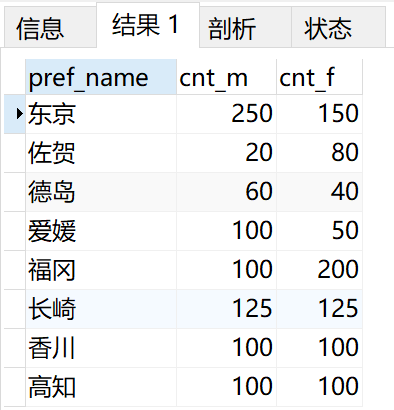
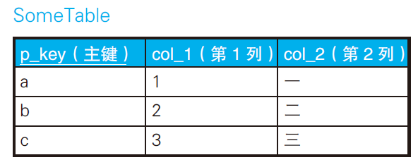
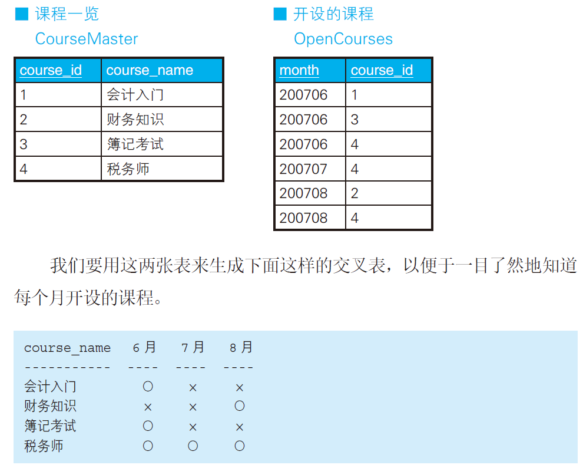
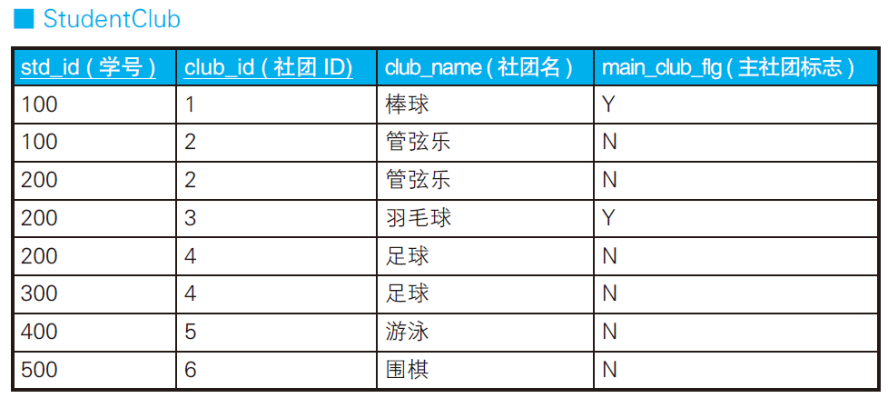

# case表达式

## SELECT子句进行条件分支

> Server version: 5.7.28 MySQL Community Server (GPL)


~~解法一：~~

```sql
-- 男性人口
SELECT
	pref_name,
	SUM( population ) AS cnt_m 
FROM
	PopTbl2 
WHERE
	sex = '1' 
GROUP BY
	pref_name;

-- 女性人口
SELECT
	pref_name,
	SUM( population ) AS cnt_f 
FROM
	PopTbl2 
WHERE
	sex = '2' 
GROUP BY
	pref_name;
```



简单地用GROUP BY 进行聚合，查询后必须通过宿主语言或者Excel等应用程序将结果的格式转换一下，才能使之成为交叉表。

解法二：

```sql
SELECT
	pref_name,
	SUM( CASE WHEN sex = '1' THEN population ELSE 0 END ) AS cnt_m,
	SUM( CASE WHEN sex = '2' THEN population ELSE 0 END ) AS cnt_f 
FROM
	PopTbl2 
GROUP BY
	pref_name;
```



新手用 WHERE 子句进行条件分支，高手**用 SELECT 子句进行条件分支**。

## Case子句处理约束

假设规定“女性员工的工资必须在 20 万日元以下。

```sql
-- 用CHECK约束定义多个列的条件关系
CREATE TABLE TestSal
(sex CHAR(1) ,
 salary INTEGER,
    CONSTRAINT check_salary CHECK
             ( CASE WHEN sex = '2'
                    THEN CASE WHEN salary <= 200000 THEN 1 
                              ELSE 0 END
                    ELSE 1 END = 1 ));

INSERT INTO TestSal VALUES(2, 300000); -- error
```

Case子句中先判断sex=2，然后判断salary <= 200000，如果为真就赋值1，否则赋值0；

Case子句默认分支对应男性，默认赋值为1。即男性工资不受约束。

将整个Case子句的执行结果和1进行比较，得出该约束的判断结果。

> 在MySQL 5.7版本，约束没有实现：
>
> https://dev.mysql.com/doc/refman/5.7/en/create-table.html#create-table-indexes-keys 
>
> The `CHECK` clause is parsed but ignored by all storage engines.

## UPDATE语句进行条件分支

工资调整问题。

| name | salary |
| ---- | ------ |
| A    | 30000  |
| B    | 27000  |
| C    | 22000  |
| D    | 29000  |

假设现在需要根据以下条件对该表的数据进行更新。
1. 对当前工资为30 万日元以上的员工，降薪10%。
2. 对当前工资为25 万日元以上且不满28 万日元的员工，加薪20%。

则目标应该为：

| name | salary    |
| ---- | --------- |
| A    | **27000** |
| B    | **32400** |
| C    | 22000     |
| D    | 29000     |

错误的SQL:

```sql
-- 条件1
UPDATE Salaries
SET salary = salary * 0.9
WHERE salary >= 300000;

-- 条件2
UPDATE Salaries
SET salary = salary * 1.2
WHERE salary >= 250000 AND salary < 280000;
```

**因为条件1执行后的结果，会对条件2的执行造成干扰。**

正确的SQL:

```sql
-- 用CASE 表达式写正确的更新操作
UPDATE Salaries
SET salary = CASE WHEN salary >= 300000
			THEN salary * 0.9
			WHEN salary >= 250000 AND salary < 280000
			THEN salary * 1.2
			ELSE salary END;
```

使用case子句将不同情况下salary的计算公式计算出来，然后再执行。

## 主键值调换



常规思路，三次update

```
temp=a
a=b
b=temp
```

高效思路

```sql
-- 用CASE 表达式调换主键值
UPDATE SomeTable
SET p_key = CASE WHEN p_key = 'a'
            THEN 'b'
            WHEN p_key = 'b'
            THEN 'a'
            ELSE p_key END
WHERE p_key IN ('a', 'b');
```

> MySQL 5.7执行失败，主键重复。因为它不支持瞬间的主键重复状态。

## 生成交叉表



```sql
-- 表的匹配：使用IN 谓词
SELECT course_name,
CASE WHEN course_id IN
    (SELECT course_id FROM OpenCourses
    WHERE month = 200706) THEN '○'
ELSE '×' END AS "6 月",
CASE WHEN course_id IN
    (SELECT course_id FROM OpenCourses
    WHERE month = 200707) THEN '○'
ELSE '×' END AS "7 月",
CASE WHEN course_id IN
    (SELECT course_id FROM OpenCourses
    WHERE month = 200708) THEN '○'
ELSE '×' END AS "8 月"
FROM CourseMaster;
```

也可以使用EXISTS关键字。

## CASE表达式中使用聚合函数



我们按照下面的条件查询这张表里的数据。
1. 获取只加入了一个社团的学生的社团ID。
2. 获取加入了多个社团的学生的主社团ID

解法一：

```sql
(SELECT
	std_id,
	MAX( club_id ) AS main_club 
FROM
	StudentClub 
GROUP BY
	std_id 
HAVING
	COUNT(*) = 1
)
UNION ALL
(SELECT
	std_id,
	club_id AS main_club 
FROM
	StudentClub 
WHERE
	main_club_flg = 'Y');
```

```
std_id main_club
------ ----------
300 4
400 5
500 6
100 1
200 3
```

解法二：

```sql
SELECT std_id,
CASE WHEN COUNT(*) = 1
	 THEN MAX(club_id)
     ELSE MAX(CASE WHEN main_club_flg = 'Y'
                   THEN club_id
                   ELSE NULL END)
END AS main_club
FROM StudentClub
GROUP BY std_id;
```

新手用HAVING子句进行条件分支，高手**用SELECT子句进行条件分支**。

## 总结

1. 在聚合函数中使用CASE 表达式，可以轻松地将行结构转换成列结构。
2. 聚合函数也可以嵌套进CASE 表达式里使用。

## 练习

### 问题1


从表里选出x 和y 二者中较大的值的情况。求得的结果应该如下所示。

> MySQL 5.7中key为保留字，改为pkey代替。

```
pkey greatest
----- ---------
A 2
B 5
C 7
D 3
```

解法一：

```sql
SELECT
	pkey,
	case when x > y
	     then x
		 else y END
	as greatest
FROM
	Greatests
```

解法二：直接使用内建函数

```sql
SELECT 
  pkey,
	GREATEST( GREATEST( x, y ), z ) AS greatest 
FROM
	Greatests;
```

解法三：将列转化为行，再分组，然后计算每组的列最大值。

```sql
SELECT pkey, MAX(col) AS greatest
  FROM (SELECT pkey, x AS col FROM Greatests
        UNION ALL
        SELECT pkey, y AS col FROM Greatests
        UNION ALL
        SELECT pkey, z AS col FROM Greatests) TMP
 GROUP BY pkey;
```

> 扩展：从表里选出x，y ，z三者中较大的值的情况。

解法:

```sql
SELECT
	pkey,
	case when x > y AND x > z
	     then x
			 else (case when y > z
			            then y
			            else z END)
	END as greatest
FROM
	Greatests
```

```
pkey greatest
----- ---------
A	3
B	5
C	7
D	8
```

### 问题2

以PopTbl2为样本，进行行列转换，转换结果应为:

```
性别  全国     德岛 香川    爱媛    高知 四国（再揭）
---- ------ ----- ------ ------ ------- ----------
男   855     60    100     100    100 　 360
女   845     40    100     50     100 　 290
```

解法：

```sql
SELECT
	sex AS '性别',
	sum(population) AS '全国',
	max(case when pref_name='德岛' then population else 0 END) AS '德岛',
	max(case when pref_name='香川' then population else 0 END) AS '香川',
	max(case when pref_name='爱媛' then population else 0 END) AS '爱媛',
	max(case when pref_name='高知' then population else 0 END) AS '高知',
	sum(case when pref_name IN('德岛','香川','爱媛','高知') then population else 0 END) AS '四国（再揭）' 
FROM
	PopTbl2 
GROUP BY
	sex
```

### 问题3

对表Greatests进行排序显示。思考一个查询语句，使得结果按照B-A-D-C 这样的指定顺序进行排列。

解法：

```sql
SELECT pkey
  FROM Greatests
 ORDER BY CASE pkey
            WHEN 'B' THEN 1
            WHEN 'A' THEN 2
            WHEN 'D' THEN 3
            WHEN 'C' THEN 4
            ELSE NULL END;
```

在order by后面使用case子句自定义某个key的排序规则。