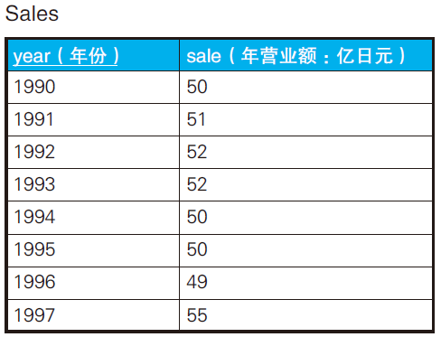
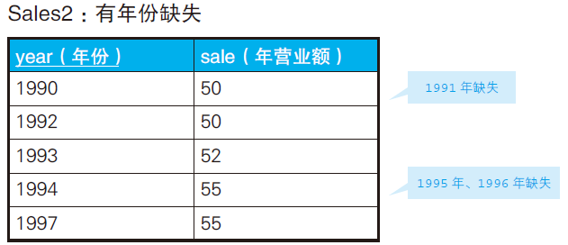
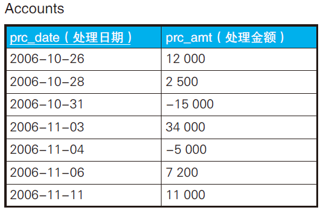
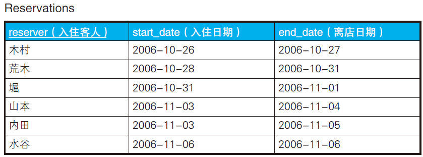
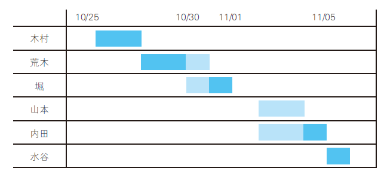
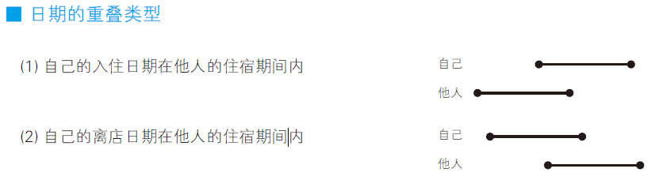

# 关联子查询



使用SQL 输出与上一年相比营业额不变的情况。（1993 年和1995年）

解法一：关联子查询

```sql
SELECT year,sale
FROM Sales S1
WHERE sale = (SELECT sale
            FROM Sales S2
            WHERE S2.year = S1.year - 1)
            ORDER BY year;
```

S2表示去年，S1表示今年，思路非常直接。

```
year sale
----- ----
1993 52
1995 50
```

解法二：自连接

```sql
SELECT S1.year, S1.sale
FROM Sales S1, Sales S2
WHERE S2.sale = S1.sale AND S2.year = S1.year - 1
ORDER BY year;
```

## 列表展示与上一年的比较结果

解法一：case子句

```sql
SELECT
	S1.YEAR,
	S1.sale,
CASE
		WHEN sale = ( SELECT sale FROM Sales S2 WHERE S2.YEAR = S1.YEAR - 1 ) THEN
		'→' 
		WHEN sale > ( SELECT sale FROM Sales S2 WHERE S2.YEAR = S1.YEAR - 1 ) THEN
		'↑' 
		WHEN sale < ( SELECT sale FROM Sales S2 WHERE S2.YEAR = S1.YEAR - 1 ) THEN
		'↓' 
		ELSE '—' 
	END AS var 
FROM
	Sales S1 
ORDER BY YEAR;
```

```
year sale var
------ ---- ---
1990 50 —
1991 51 ↑
1992 52 ↑
1993 52 →
1994 50 ↓
1995 50 →
1996 49 ↓
1997 55 ↑
```

解法二：自连接

```sql
SELECT S1.year, S1.sale,
        CASE WHEN S1.sale = S2.sale THEN '→'
        	WHEN S1.sale > S2.sale THEN '↑'
        	WHEN S1.sale < S2.sale THEN '↓'
		ELSE ' — ' END AS var
FROM Sales S1, Sales S2
WHERE S2.year = S1.year - 1
ORDER BY year;
```

但是，第一行1990年这行会缺失。

```
year sale var
------ ---- ---
1991	51	↑
1992	52	↑
1993	52	→
1994	50	↓
1995	50	→
1996	49	↓
1997	55	↑
```

## 时间轴有间断时：和过去最临近的时间进行比较



```sql
SELECT S1.year AS year,
       S1.sale AS sale
FROM Sales2 S1, Sales2 S2
WHERE S1.sale = S2.sale
  AND S2.year = (SELECT MAX(year)
                    FROM Sales2 S3
                   WHERE S1.year > S3.year)
  ORDER BY year;
```

`S1.year > S3.year` 表示过去的年份比较，S1大于S3，所以S3是过去年份。

`SELECT MAX(year)`中的year是从 S3中选出来的。也就是过去年份中年份最大的值。

将上一步得到的年份赋值给S2，自连接查询。

```
year sale
----- ----
1992 50
1997 55
```

## 移动累计值和移动平均值



```sql
SELECT
	prc_date,
	A1.prc_amt,
	( SELECT SUM( prc_amt ) FROM Accounts A2 WHERE A1.prc_date >= A2.prc_date ) AS onhand_amt 
FROM
	Accounts A1 
ORDER BY
	prc_date;
```

关键在于这句：

`SELECT SUM( prc_amt ) FROM Accounts A2 WHERE A1.prc_date >= A2.prc_date`

使用了冯· 诺依曼型递归集合，设想一开始，A1遍历时，

- 2006-10-26符合要求
- 接着，2006-10-26和 2006-10-28 符合要求
- ...

```
prc_date prc_amt onhand_amt
---------- ------- ----------
2006-10-26 12000 12000 -- 12000
2006-10-28 2500  14500  -- 12000 + 2500
2006-10-31 -15000 -500 -- 12000 + 2500 + (-15000)
2006-11-03 34000 33500 -- 12000 + 2500 + (-15000) + 34000
2006-11-04 -5000 28500 -- ...
2006-11-06 7200  35700  -- 
2006-11-11 11000 46700 -- 
```

## 查询重叠的时间区间





要求找出重叠的时间区间。

日期重叠的类型分析：



```sql
SELECT reserver, start_date, end_date
  FROM Reservations R1
 WHERE EXISTS
       (SELECT *
          FROM Reservations R2
         WHERE R1.reserver <> R2.reserver  /* 与自己以外的客人进行比较 */
           AND ( R1.start_date BETWEEN R2.start_date AND R2.end_date    /* 条件（1）：自己的入住日期在他人的住宿期间内 */
              OR R1.end_date  BETWEEN R2.start_date AND R2.end_date));  /* 条件（2）：自己的离店日期在他人的住宿期间内 */
```

```
reserver start_date end_date
-------- ---------- ----------
荒木 2006-10-28 2006-10-31
堀　 2006-10-31 2006-11-01
山本 2006-11-03 2006-11-04
内田 2006-11-03 2006-11-05
```

这个SQL其实有个疏漏，假设山本 start_date为 2006-11-04，被内田完全包含。

所以，需要在前面SQL中补充对该情况的判断。

```sql
SELECT reserver, start_date, end_date
 FROM Reservations R1
WHERE EXISTS
       (SELECT *
          FROM Reservations R2
         WHERE R1.reserver <> R2.reserver
           AND (  (     R1.start_date BETWEEN R2.start_date AND R2.end_date
                     OR R1.end_date   BETWEEN R2.start_date AND R2.end_date)
                OR (    R2.start_date BETWEEN R1.start_date AND R1.end_date
                    AND R2.end_date   BETWEEN R1.start_date AND R1.end_date)));
```

## 小结

1. SQL 在比较多行数据时，不进行排序和循环。
2. SQL 的做法是添加比较对象数据的集合，通过关联子查询（或者自连接）一行一行地偏移处理。如果数据库支持窗口函数，也可以使用窗口函数。
3. **求累计值和移动平均值的基本思路是使用冯·诺依曼型递归集合**。
4. **关联子查询的缺点是性能及代码可读性差**。

## 练习

### 问题1

优化when子句。

```sql
SELECT S1.year, S1.sale,
       CASE SIGN(sale -
              (SELECT sale
                 FROM Sales S2
                WHERE S2.year = S1.year - 1) )
            WHEN 0  THEN '→'  /* 持平 */
            WHEN 1  THEN '↑'  /* 增长   */
            WHEN -1 THEN '↓'  /* 减少   */
            ELSE '—' END AS var
  FROM Sales S1
 ORDER BY year;
```

SIGN()函数可以获取正负号，即判断是正，负，还是0。