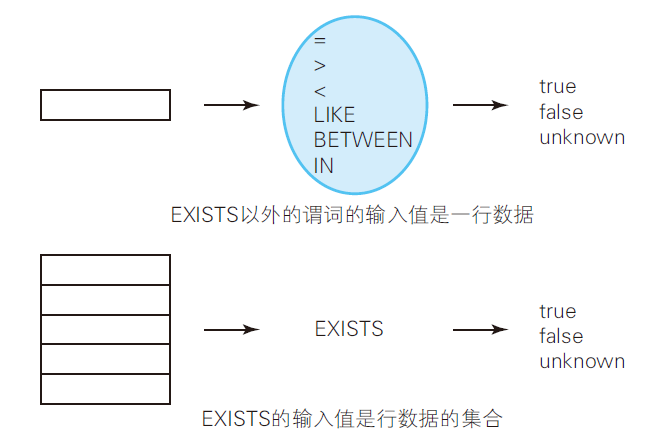
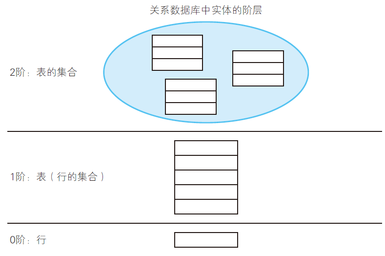
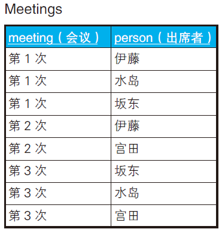
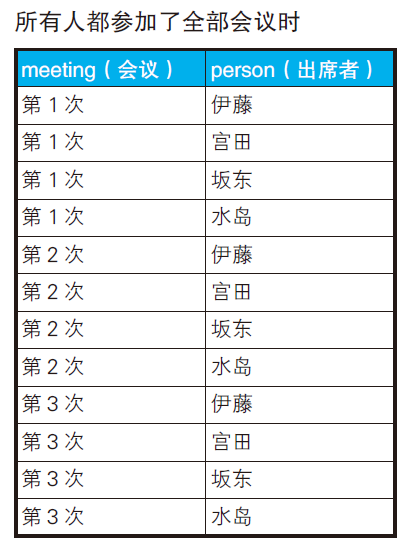
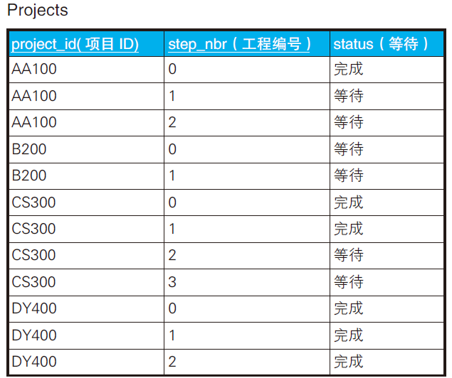
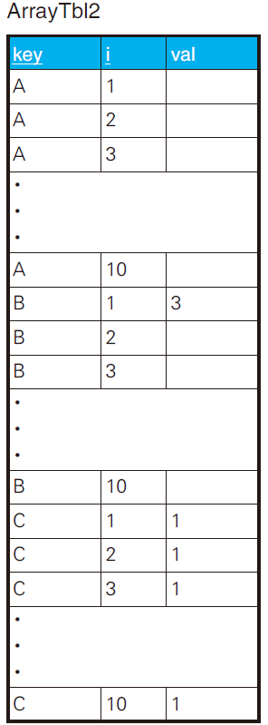
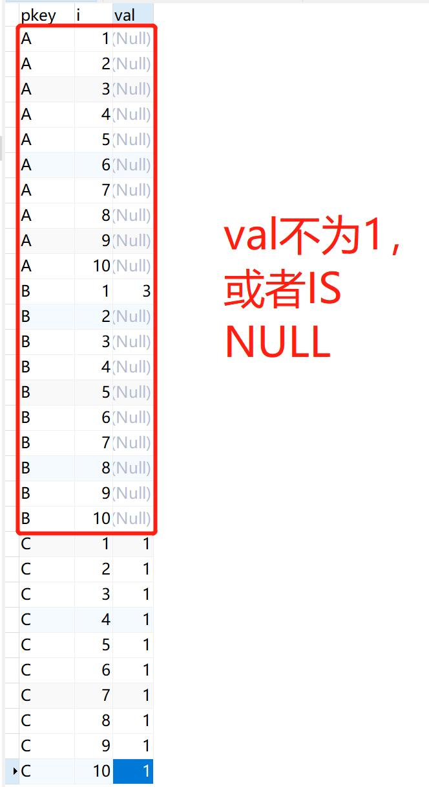

# EXISTS谓词

EXISTS 为了实现谓词逻辑中“量化”（quantification）
这一功能而被引入SQL。

谓词是一种特殊的函数，返回值是真值。每个谓词，返回值都是true、false 或者unknown。

## 理论篇

**EXISTS的输入**

在EXISTS 的子查询里，
SELECT 子句的列表可以有下面这三种写法。

1. 通配符：SELECT *
2. 常量：SELECT ‘这里的内容任意’
3. 列名：SELECT col



**EXISTS的阶**

= 或者BETWEEEN 等输入值为一行的谓词叫作“一阶谓词”。

EXISTS 这样输入值为行的集合的谓词叫作“二阶谓词”。



SQL 中的EXISTS 谓词实现了谓词逻辑中的存在量词。

在SQL 中，为了表达全称量化，需要将“所有的行都满足条件P”
这样的命题转换成“不存在不满足条件P 的行”。

## 实践篇

### 查询表中“不”存在的数据




目标：查询没有参加某次会议的人。

```
meeting 　　 person
---------- --------
第1 次 　　　 宫田
第2 次 　　　 坂东
第2 次 　　　 水岛
第3 次 　　　 伊藤
```

思路：先假设所有人都参加了全部会议，并以此生成一个集合，然后从中减去实际参加会议的人。就能得到缺席会议的人。



将这个表减去上表，就能得到结果。

解法一

```sql
-- 求出缺席者的SQL 语句(1)：存在量化的应用
SELECT DISTINCT M1.meeting, M2.person
FROM Meetings M1 CROSS JOIN Meetings M2
WHERE NOT EXISTS
        (SELECT *
        FROM Meetings M3
        WHERE M1.meeting = M3.meeting
        AND M2.person = M3.person);
```

**A NOT EXISTS B的含义是减法：A-B**。

解法二

```sql
---- 求出缺席者的SQL 语句(2)：使用差集运算
SELECT M1.meeting, M2.person
FROM Meetings M1, Meetings M2
EXCEPT
SELECT meeting, person
FROM Meetings;
```

> MSYQL 5.7 不支持 EXCEPT。

### 全称量化(1) ：“肯定⇔ 双重否定”之间的转换


目标1：查询出“所有科目分数都在50 分以上的学生”。答案是学号分别为100、200、400。

```sql
SELECT DISTINCT student_id
FROM TestScores TS1
WHERE NOT EXISTS
        (SELECT *
        FROM TestScores TS2
        WHERE TS2.student_id = TS1.student_id
        AND TS2.score < 50); -- 分数不满50 分的科目
```

全集（100,200,300,400）-（300）=（100,200,400）。

---

目标2：如何查询出满足下列条件的学生。
1. 数学的分数在80 分以上。
2. 语文的分数在50 分以上。

```sql
SELECT student_id
FROM TestScores TS1
WHERE subject IN ('数学', '语文')
AND NOT EXISTS
              (SELECT *
              FROM TestScores TS2
              WHERE TS2.student_id = TS1.student_id
              AND 1 = CASE WHEN subject = '数学' AND score < 80 THEN 1
                            WHEN subject = '语文' AND score < 50 THEN 1
                            ELSE 0 END)
GROUP BY student_id
HAVING COUNT(*) = 2; -- 必须两门科目都有分数
```

```
student_id
----------
100
200
```

### 全称量化(2)：集合 VS 谓词



目标：从这张表查询出哪些项目已经完成到了工程1。（即工程0和1已完成，工程2开始等待）

解法一

```sql
SELECT project_id
FROM Projects
GROUP BY project_id
HAVING COUNT(*) = SUM(CASE WHEN step_nbr <= 1 AND status = '完成' THEN 1
                            WHEN step_nbr > 1 AND status = '等待' THEN 1
                            ELSE 0 END);
```

```
project_id
-----------
CS300
```

解法二

```sql
SELECT *
FROM Projects P1
WHERE NOT EXISTS
			(SELECT status
			FROM Projects P2
			WHERE P1.project_id = P2. project_id -- 以项目为单位进行条件判断
			AND status <> CASE WHEN step_nbr <= 1 -- 使用双重否定来表达全称量化命题
												 THEN '完成'
												 ELSE '等待' END);
```

`NOT EXISTS` 和 `<>` 形成双重否定。

```
project_id step_nbr status
----------- -------- ------
CS300	0	完成
CS300	1	完成
CS300	2	等待
CS300	3	等待
```

### 对列进行量化

查询“至少有一个9”的行。

```sql
SELECT *
FROM ArrayTbl
WHERE 9 = ANY (col1, col2, col3, col4, col5, col6, col7, col8, col9, col10);
```

查询全是NULL 的行。

```sql
SELECT *
FROM ArrayTbl
WHERE COALESCE(col1, col2, col3, col4, col5, col6, col7, col8, col9, col10) IS NULL;
```

## 小结

1. SQL 中的谓词指的是返回真值的函数。
2. **EXISTS 与其他谓词不同，接受的参数是集合**。
3. EXISTS 可以看成是一种高阶函数。
4. **SQL 中没有与全称量词相当的谓词，可以使用NOT EXISTS 代替**。ALL 是全称谓词。

## 练习

### 问题1



key 为A 的行val 全都是NULL，key 为
B 的行中只有i=1 的行val 是3，其他的都是NULL，key 为C 的行val 全部都是1。

目标：从这张表中选出val 全是1 的key。即C

解法一

```sql
SELECT pkey
FROM ArrayTbl2 A1
where A1.val=1
GROUP BY pkey
HAVING COUNT(val)=(SELECT count(A2.val) 
                   FROM ArrayTbl2 A2 
                   where A2.val=1 and A1.pkey=A2.pkey);
```

从A2临时表中选出val全为1的行，计算行数，令它和A1表中的行数相等，同时显示A1表的val为1。

解法二: NOT EXISTS关键字



```sql
SELECT DISTINCT key
  FROM ArrayTbl2 A1
 WHERE NOT EXISTS
        (SELECT *
           FROM ArrayTbl2 A2
          WHERE A1.key = A2.key
            AND (A2.val <> 1 OR A2.val IS NULL));
```

`A2.val <> 1 OR A2.val IS NULL` 的否定，就可以得到val全为1的行。

解法三: ALL关键字

```sql
SELECT DISTINCT
	pkey 
FROM
	ArrayTbl2 A1 
WHERE
	1 = ALL ( SELECT val FROM ArrayTbl2 A2 WHERE A1.pkey = A2.pkey );
```

1= ALL （..) 限制了全部行val为1。

解法四

```sql
SELECT pkey
  FROM ArrayTbl2
 GROUP BY pkey
HAVING SUM(CASE WHEN val = 1 THEN 1 ELSE 0 END) = COUNT(*);
```

SUM(CASE WHEN val = 1 THEN 1 ELSE 0 END) = COUNT(*) 限制了全部行的val都为1。

解法五

```sql
SELECT pkey
  FROM ArrayTbl2
 GROUP BY pkey
HAVING MAX(val) = 1
   AND MIN(val) = 1;
```

MAX(val) = 1 和 MIN(val) = 1 限制了 val 全部为1。

### 问题2

使用ALL 谓词表达全称量化。

```sql
SELECT *
  FROM Projects P1
 WHERE '○' = ALL
             (SELECT CASE WHEN step_nbr <= 1 AND status = '完成' THEN '○'
                          WHEN step_nbr > 1  AND status = '等待' THEN '○'
                          ELSE '×' END
                FROM Projects P2
               WHERE P1.project_id = P2. project_id);
```

### 问题3

SQL求1~100以内的质数。

```sql
SELECT num AS prime
  FROM Numbers Dividend
 WHERE num > 1
   AND NOT EXISTS
        (SELECT *
           FROM Numbers Divisor
          WHERE Divisor.num <= Dividend.num / 2 /* 除了自身之外的约数必定小于等于自身值的一半 */
            AND Divisor.num <> 1 /* 约数中不包含1 */
            AND MOD(Dividend.num, Divisor.num) = 0)  /*“除不尽”的否定条件是“除尽” */
ORDER BY prime;
```

思路是**全集-合数=质数**。