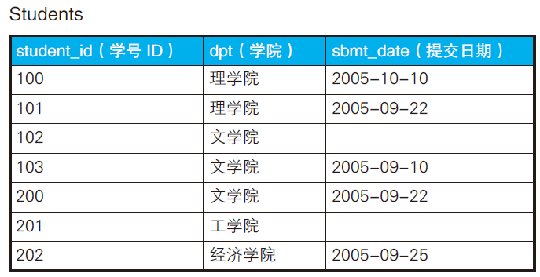
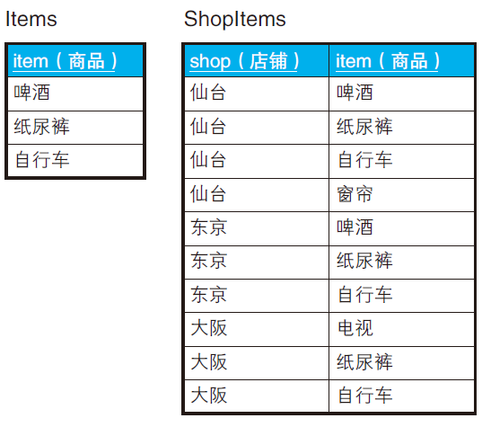
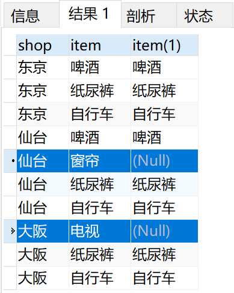
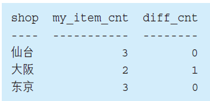
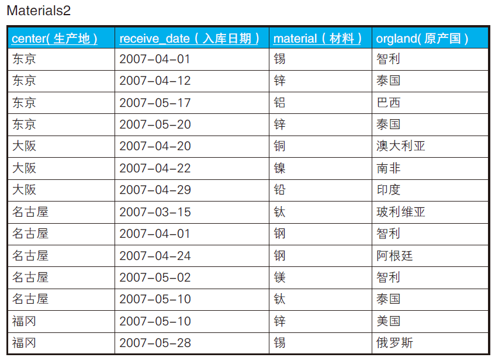
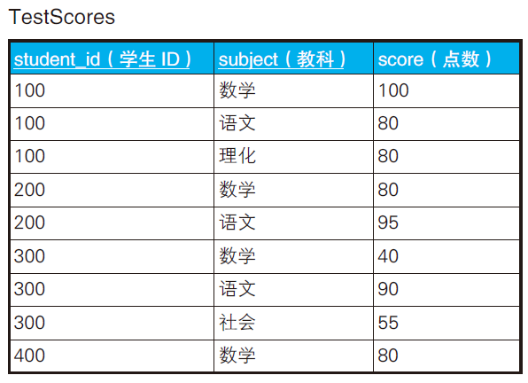

# having 子句

## HAVING子句求众数


```sql
SELECT
	income,
	COUNT(*) AS cnt 
FROM
	Graduates 
GROUP BY
	income 
HAVING
	COUNT(*) >= ALL ( SELECT COUNT(*) FROM Graduates 　　 GROUP BY income );
```

```
income cnt
------ ---
10000 3
20000 3
```

## HAVING子句求中位数

> CASE 表达式、自连接以及HAVING 子句

```sql
SELECT
	AVG( DISTINCT income ) 
FROM
	(SELECT
		T1.income 
	FROM
		Graduates T1,
		Graduates T2 
	GROUP BY
		T1.income 
	HAVING
		SUM( CASE WHEN T2.income >= T1.income THEN 1 ELSE 0 END ) >= COUNT(*) / 2 
	AND SUM( CASE WHEN T2.income <= T1.income THEN 1 ELSE 0 END ) >= COUNT(*) / 2 
	) TMP;
```

```sql
SUM( CASE WHEN T2.income >= T1.income THEN 1 ELSE 0 END ) >= COUNT(*) / 2 
SUM( CASE WHEN T2.income <= T1.income THEN 1 ELSE 0 END ) >= COUNT(*) / 2
```

这两行求出中位数，可能是一个数，也可能是两个数。所以最后取了平均AVG。

## 查询不包含NULL的集合



找出哪些学院的学生全部都提交了报告（即理学院、经济学院）。

```sql
SELECT dpt
FROM Students
GROUP BY dpt
HAVING COUNT(*) = COUNT(sbmt_date);
```

如果sbmt_date包含NULL，那么COUNT(*) = COUNT(sbmt_date)必然不会相等。

这个条件也可以被重写为：

```sql
HAVING COUNT(*) = SUM(CASE WHEN sbmt_date IS NOT NULL
                           THEN 1
                           ELSE 0 END);
```

## 关系除法运算进行购物篮分析



要查询囊括了表Items 中所有商品的店铺。(仙台店和东京店)

```sql
SELECT SI.shop
FROM ShopItems SI, Items I
WHERE SI.item = I.item
GROUP BY SI.shop
HAVING COUNT(SI.item) = (SELECT COUNT(item) FROM Items);
```

`(SELECT COUNT(item) FROM Items)`结果为3，即COUNT(SI.item)=3的店铺会被选中。由于之前已经使用`WHERE SI.item = I.item`过滤掉无关商品项（窗帘，电视），于是可以正确得到结果。

```
shop
----
仙台
东京
```

> 假如想要排除仙台店（因为它包含了窗帘），如何做呢？

可以向使用左外连接观察一下。

```sql
SELECT
	SI.shop,
	SI.item,
	I.item 
FROM
	ShopItems SI
	LEFT OUTER JOIN Items I ON SI.item = I.item 
GROUP BY
	SI.shop,SI.item
```



可以看到两个NULL，利用这个特点，可以写出过滤条件。

```sql
SELECT
	SI.shop 
FROM
	ShopItems AS SI
	LEFT OUTER JOIN Items AS I ON SI.item = I.item 
GROUP BY
	SI.shop 
HAVING
	COUNT( SI.item ) = ( SELECT COUNT( item ) FROM Items )
	AND COUNT( I.item ) = ( SELECT COUNT( item ) FROM Items );
```

对于仙台，COUNT( SI.item )=4 不等于3；对于大阪，COUNT( I.item )=2 不等于3。

即，**对于Items表列出的所有商品项，店铺不能有多余的商品，也不能缺少Items里面任何一个商品。**

## 小结

1. SQL 通过不断生成子集来求得目标集合。SQL 通过画集合的关系图来思考。
2. GROUP BY 子句可以用来生成子集。
3. WHERE 子句用来调查集合元素的性质，而HAVING 子句用来调查集合本身的性质。
4. 如果一个实体对应着一行数据 → 那么就是元素，使用WHERE
   子句。
5. 如果一个实体对应着多行数据 → 那么就是集合，使用HAVING
   子句。
6. HAVING 子句可以通过聚合函数（特别是极值函数）针对集合指定各种条件。
7. 如果通过CASE 表达式生成特征函数，那么无论多么复杂的条件都可以描述。

## 练习

### 问题1

查询“全体学生都在9 月份提交了报告的学院”的SQL 语句。

```sql
SELECT
	dpt 
FROM
	Students 
GROUP BY
	dpt 
HAVING
	COUNT(*) = SUM( CASE WHEN sbmt_date BETWEEN '2005-09-01' AND '2005-09-30' THEN 1 ELSE 0 END );
```

### 问题2

对于没有备齐全部商品类型的店铺，希望返回一览表能展示这些店铺缺少多少种商品。



```sql
SELECT SI.shop,
       COUNT(SI.item) AS my_item_cnt,
       (SELECT COUNT(item) FROM Items) - COUNT(SI.item) AS diff_cnt
FROM ShopItems SI, Items I
WHERE SI.item = I.item
GROUP BY SI.shop;
```

### 问题3

单重集合与多重集合的一般化。



查出材料和原产国两个字段都重复的生产地。

```sql
SELECT center
  FROM Materials2
 GROUP BY center
HAVING COUNT(concat(material,orgland)) <> COUNT(DISTINCT concat(material,orgland));
```

> MYSQL 5.7 使用 concat（）拼接字符串。

### 问题4



查询满足下面条件的学生的SQL 语句。
1. 数学的分数在80 分以上。
2. 语文的分数在50 分以上。

```sql
SELECT student_id
  FROM TestScores
 WHERE subject IN ('数学', '语文')
 GROUP BY student_id
HAVING SUM(CASE WHEN subject = '数学' AND score >= 80 THEN 1
                WHEN subject = '语文' AND score >= 50 THEN 1
                ELSE 0 END) = 2;
```