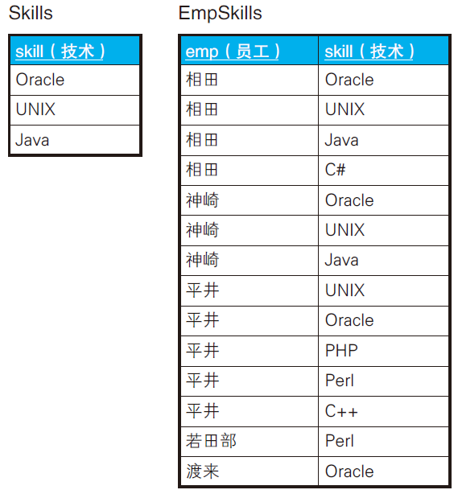
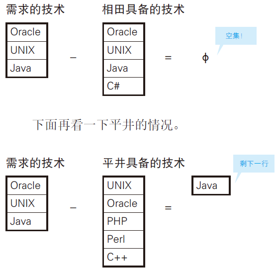
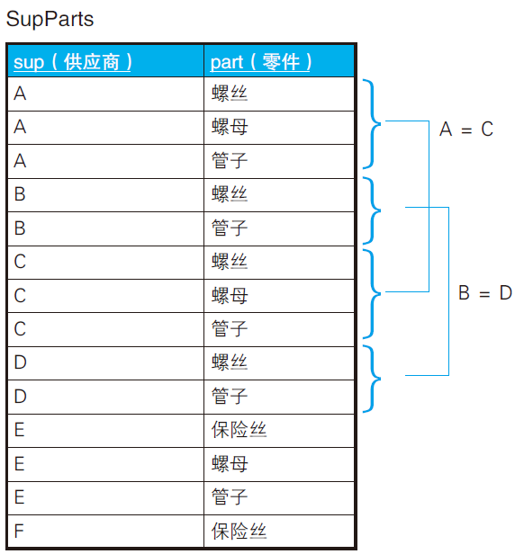
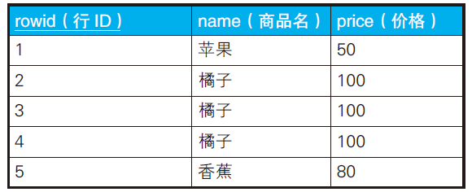

# SQL集合运算

四则运算里的**和（UNION）、差（EXCEPT）、积（CROSS JOIN）**都被引入了标准SQL。但是商（DIVIDE BY）迟迟没能标准化。

## 检查集合相等性

集合论里，判定两个集合是否相等，一般使用下面两种方法。
1. (A
∩
B ) 且 (A
∩
B) `<=>` (A = B)
2. (A ∪ B ) = (A ∩ B) `<=>` (A = B)

第二种方法比较容易实现。

如果集合A和集合B相等，那么A UNION B = A = B 以及A INTERSECT
B = A = B 都成立。

> 除了UNION 之外，另一个具有幂等性的运算符就是INTERSECT。

```
( A INTERSECT B ) ⊆ ( A UNION B )
```

只需判定(A UNION B) EXCEPT (A INTERSECT B) 的结果集是不是空集。

- 如果 A = B，则这个结果集是空集，
- 如果 A ≠ B，则这个结果集不是空集。

```sql
SELECT CASE WHEN COUNT(*) = 0
            THEN '相等'
            ELSE '不相等' END AS result
FROM ((SELECT * FROM tbl_A
        UNION
        SELECT * FROM tbl_B)
        EXCEPT
        (SELECT * FROM tbl_A
        INTERSECT
        SELECT * FROM tbl_B)) TMP;
```

> MYSQL 5.7 不支持 INTERSECT。

## 差集实现关系除法运算

除法运算具有代表性的三个实现。
1. 嵌套使用NOT EXISTS。
2. 使用HAVING 子句转换成一对一关系。
3. **把除法变成减法**。



目标：从表EmpSkills 中找出精通表Skills 中所有技术的员工。
答案是相田和神崎。

```sql
SELECT DISTINCT emp
FROM EmpSkills ES1
WHERE NOT EXISTS
(SELECT skill
FROM Skills
EXCEPT
SELECT skill
FROM EmpSkills ES2
WHERE ES1.emp = ES2.emp);
```

关联子查询建立在表EmpSkills 上，我们要针对每个员工进行集合运算。

**从需求的技术的集合中减去每个员工自己的技术的集合，如果结果是空集，则说明该员工具备所有的需求的技术，否则说明该员工不具备某些需求的技能**。



- `WHERE NOT EXISTS ∅ `可以得出 true。
- `WHERE NOT EXISTS 非空集 `可以得出 false。

## 寻找相等的子集



求经营的零件在种类数和种类上都完全相同的供应商组合。答案是A-C 和B-D 这两组。

```sql
-- 生成供应商的全部组合
SELECT SP1.sup AS s1, SP2.sup AS s2
FROM SupParts SP1, SupParts SP2
WHERE SP1.sup < SP2.sup
GROUP BY SP1.sup, SP2.sup;
```

```
s1 s2
---- ----
A B
A C
A D
　：
D E
E F
```

这些供应组合是否满足以下公式：（A  ⊆  B）
且（A  ⊇ B）=>（A = B）。等价于下面两个条件。

- 条件1：两个供应商都经营同种类型的零件
  
- 条件2：两个供应商经营的零件种类数相同（即存在一一映射）

条件1 只需要简单地按照“零件”列进行连接，而条件2 需要用
COUNT 函数来描述。

```sql
SELECT SP1.sup AS s1, SP2.sup AS s2
FROM SupParts SP1, SupParts SP2
WHERE SP1.sup < SP2.sup -- 生成供应商的全部组合
AND SP1.part = SP2.part -- 条件1 ：经营同种类型的零件
GROUP BY SP1.sup, SP2.sup
HAVING COUNT(*) = (SELECT COUNT(*) -- 条件2 ：经营的零件种类数相同
                    FROM SupParts SP3
                    WHERE SP3.sup = SP1.sup)
AND COUNT(*) = (SELECT COUNT(*)
                FROM SupParts SP4
                WHERE SP4.sup = SP2.sup);
```

```
s1 s2
---- ----
A C
B D
```

HAVING 子句里的两个条件保证集合A 和集合B 的元素个数一致（即存在一一映射)。

## 删除重复行的高效SQL



```sql
-- 删除重复行的高效SQL 语句(2)：通过NOT IN 求补集
DELETE FROM Products
WHERE rowid NOT IN ( SELECT MAX(rowid)
                    FROM Products
                    GROUP BY name, price);
```

> MYSQL 5.7 1093 - You can't specify target table 'Products' for update in FROM clause

估计要找个办法建立临时表。

```sql
DELETE 
FROM
	Products 
WHERE
	rowid NOT IN (
	SELECT
		rowid_tmp 
	FROM
		( SELECT MAX( P2.rowid ) AS rowid_tmp FROM Products P2 GROUP BY P2.NAME, P2.price ) TMP 
	);
```

## 小结

1. 如果集合运算符不指定ALL 可选项，重复行会被排除掉，而且，这种情况下还会发生排序，所以性能方面不够好。
2. UNION 和INTERSECT 都具有幂等性这一重要性质，而EXCEPT 不具有幂等性。
3. 标准SQL 没有关系除法的运算符，需要自己实现。
4. **判断两个集合是否相等时，可以通过幂等性或一一映射两种方法**。
5. 使用EXCEPT 可以很简单地求得补集。

## 练习

### 问题1

选择刚好拥有全部技术的员工，结果只有神崎一人。

```sql
SELECT DISTINCT emp
  FROM EmpSkills ES1
 WHERE NOT EXISTS
        (SELECT skill
           FROM Skills
         EXCEPT
         SELECT skill
           FROM EmpSkills ES2
          WHERE ES1.emp = ES2.emp)
  AND NOT EXISTS
        (SELECT skill
           FROM EmpSkills ES3
          WHERE ES1.emp = ES3.emp
         EXCEPT
         SELECT skill
           FROM Skills );
```

或者

```sql
SELECT emp
  FROM EmpSkills ES1
 WHERE NOT EXISTS
        (SELECT skill
           FROM Skills
         EXCEPT
         SELECT skill
           FROM EmpSkills ES2
          WHERE ES1.emp = ES2.emp)
 GROUP BY emp
HAVING COUNT(*) = (SELECT COUNT(*) FROM Skills);
```

