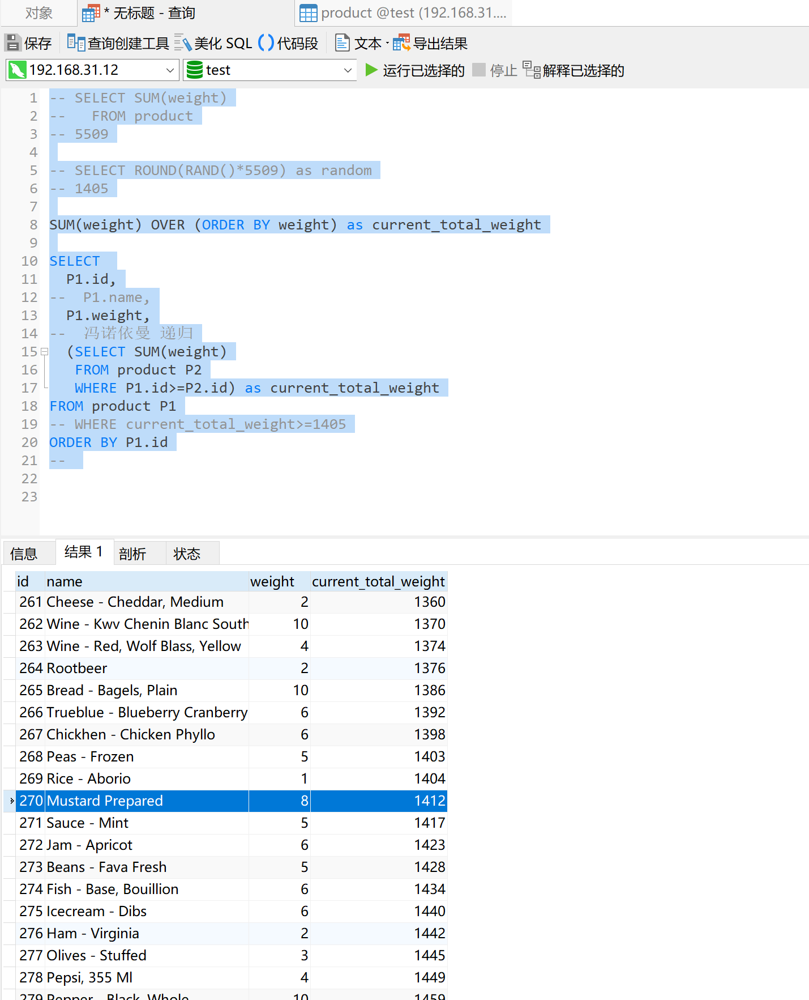

# 冯诺依曼 递归模型

```sql
-- SELECT SUM(weight) FROM product
-- 5509

-- SELECT ROUND(RAND()*5509) as random
-- 1405

-- SUM(weight) OVER (ORDER BY weight) as current_total_weight

SELECT 
	P1.id,
-- 	P1.name,
	P1.weight,
-- 	冯诺依曼 递归
	(SELECT SUM(weight)
	 FROM product P2
	 WHERE P1.id>=P2.id) as current_total_weight
FROM product P1
ORDER BY P1.id

-- 应用程序二分法查找位于1404~1412之间的1405，获取id
```

