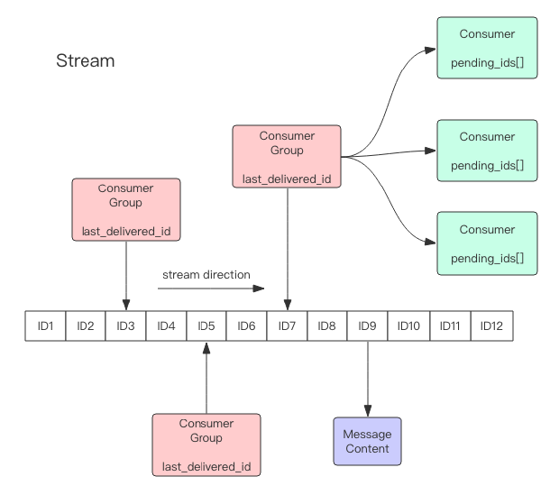
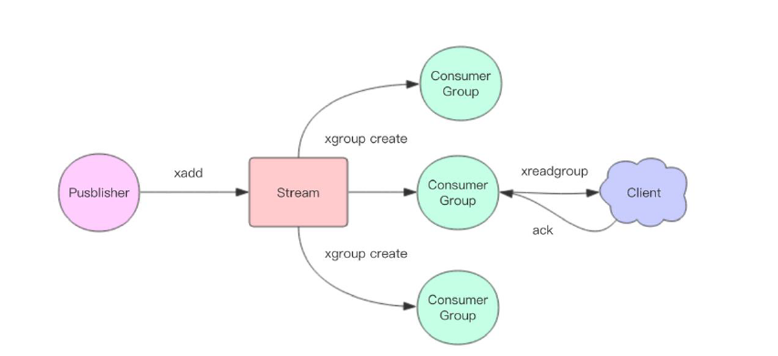

# redis stream
Redis5.0 新增了 Stream 数据结构，是一个新的强大的支持多播的可持久化的消息队列。



解析：
- 首先stream是一个链表，表示一系列消息。每个消息有一个唯一ID。
  - stream 通过首次使用 xadd 指令追加消息时自动创建
- 每个 Stream 都可以挂多个消费组，每个消费组有个游标last_delivered_id在 Stream 数组之上往前移动，表示当前消费组的消费位置。
  - 消费组 通过 xgroup create 指令创建，需要指定从 Stream 的某个消息 ID 开始消费，这个 ID 用来初始化last_delivered_id变量。
- 每个消费组 (Consumer Group) 独立，相互不受影响。
- 同一个消费组 (Consumer Group) 可以挂接多个消费者 (Consumer)，这些消费者之间是竞争关系，
任意消费者读取了消息都会使游标last_delivered_id往前移动。每个消费者有一个组内唯一名称。
- 消费者 (Consumer) 内部有个状态变量pending_ids，记录了当前已经被客户端读取的消息，但是还没有 ack。
如果客户端没有 ack，这个变量里面的消息 ID 会越来越多，一旦某个消息被 ack，它就开始减少。
- 消息 ID 形式是timestampInMillis-sequence，例1527846880572-5，表示在毫米时间戳1527846880572产生，并且是该毫秒内产生的第 5 条消息。
- 消息内容键值对。

## 增删改查
```
xadd 追加消息
xdel 删除消息，这里的删除仅仅是设置了标志位，不影响消息总长度
xrange 获取消息列表，会自动过滤已经删除的消息
xlen 消息长度
del 删除 Stream
```
示例
```
# * 号表示服务器自动生成 ID，后面跟key/value对
xadd s1 * name alice age 12

xlen s1

# -表示最小值 , + 表示最大值
xrange s1 - +

xdel s1 1527849609889-0

# 删除整个 Stream
del s1
```

## 独立消费
Redis 设计了单独的消费指令xread，将 Stream 当成普通的消息队列 (list) 来使用。
```
# 从 Stream 头部读取两条消息
xread count 2 streams s1 0-0

# 尾部阻塞1s读取两条消息
xread block 1000 count 2 streams s1 $
```

## 消费组


```
# 表示从头开始消费
> xgroup create s1 cg1 0-0
OK
# $ 表示从尾部开始消费，只接受新消息，当前 Stream 消息会全部忽略
> xgroup create s1 cg2 $
OK
# 获取 stream 消息
> xinfo stream s1
# 获取 Stream 的消费组信息
> xinfo groups s1
```

## 消费
Stream 提供了 xreadgroup 指令进行消费组的组内消费，需要提供消费组名称、消费者名称和起始消息 ID。
- 读到新消息后，对应的消息 ID 进入消费者的 PEL(正在处理的消息) 结构，
- 客户端处理完毕后使用 xack 指令通知服务器，本条消息已经处理完毕，该消息 ID 就会从 PEL 中移除。
### 消费消息
```
xreadgroup GROUP cg1 c1 count 1 streams s1 >
```
- cg1 是消费组
- c1 是消费者
- `>` 号表示从当前消费组的 last_delivered_id 后面开始读

### 观察消费组/消费者
```
# 观察消费组信息
> xinfo groups s1
# 如果同一个消费组有多个消费者，可通过 xinfo consumers 指令观察每个消费者的状态
> xinfo consumers s1 cg1
```
### ACK消息
```
xack s1 cg1 1527851486781-0
```

## 避免Stream消息太多
在 xadd 的指令提供一个定长长度 maxlen，将老的消息驱逐，确保最多不超过指定长度。
```
xadd s1 maxlen 3 * name alice age 12
```

## 小结
- Stream 的消费模型借鉴了 Kafka 的消费分组的概念，弥补了 Redis Pub/Sub 不能持久化消息的缺陷。
- 它又不同于 kafka，Kafka 的消息可以分 partition，而 Stream 不行。
- 如果非要分 parition 的话，需要在客户端做，提供不同的 Stream 名称，对消息进行 hash 取模来选择往哪个 Stream 里塞。