# Introduction to deep learning

## 第一章 Python入门

- 基本语法

```python
x=1
a=[1,2,3,4,5] # list
me={'height':180} # dict
```

```python
class Man:
	def __init__(self, name):
		self.name = name
		print("Initialized!")
	def hello(self):
		print("Hello " + self.name + "!")
	def goodbye(self):
		print("Good-bye " + self.name + "!")
```

- NumPy 是用于数值计算的库，提供了很多高级的数学算法和便利的数组（矩阵）操作方法。

  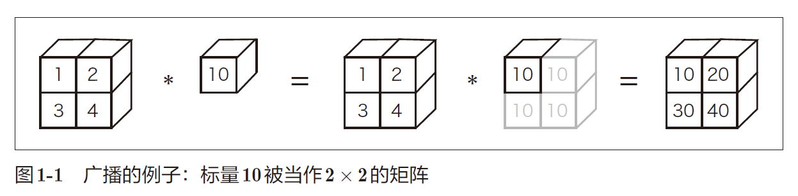

  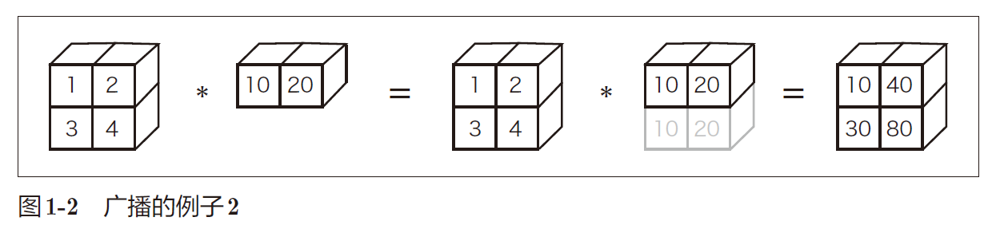

- Matplotlib 是用来画图的库。使用Matplotlib 能将实验结果可视化，并在视觉上确认深度学习运行期间的数据。

  ```python
  import numpy as np
  import matplotlib.pyplot as plt
  # 生成数据
  x = np.arange(0, 6, 0.1) # 以0.1为单位，生成0到6的数据
  y1 = np.sin(x)
  y2 = np.cos(x)
  # 绘制图形
  plt.plot(x, y1, label="sin")
  plt.plot(x, y2, linestyle = "--", label="cos") # 用虚线绘制
  plt.xlabel("x") # x轴标签
  plt.ylabel("y") # y轴标签
  plt.title('sin & cos') # 标题
  plt.legend()
  plt.show()
  ```

  

## 第二章 感知机

感知机是神经网络（深度学习）的起源的算法。

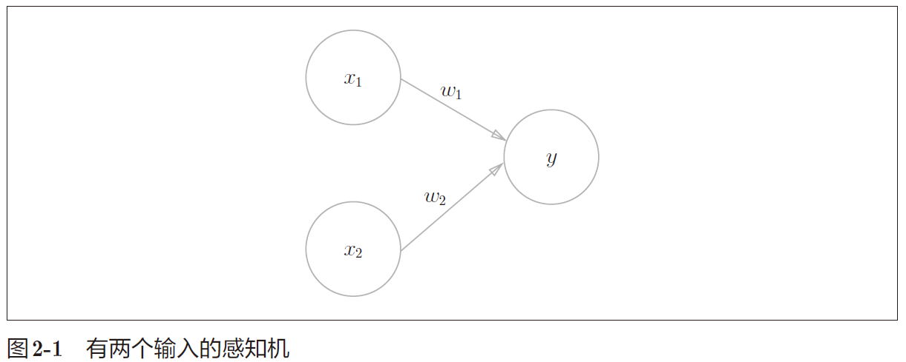
$$
y = \begin{cases} 0, & \text{$w_1x_1$+$w_2x_2$ $\leq$ θ} \\[2ex] 1, & \text{$w_1x_1$+$w_2x_2$ $\gt$ θ} \end{cases}
$$
x1、x2 是输入信号，y 是输出信号，w1、w2 是权重。输入信号被送往神经元时，被分别乘以固定的权（w1x1、w2x2）。神经元会计算传送过来的信号的总和，当总和超过某个界限值时，才会输出1。

根据上图的感知机来考虑简单的逻辑电路。

### 与门（AND gate）

| $$x_1$$ | $$x_2$$ | $$y$$ |
| ------- | ------- | ----- |
| 0       | 0       | 0     |
| 1       | 0       | 0     |
| 0       | 1       | 0     |
| 1       | 1       | 1     |

(w1, w2, θ) = (0.5, 0.5, 0.7) 时，可以满足条件。

### 与非门（NAND gate）

NAND是Not AND的含义，与非门就是颠倒了与门的输出。

| $$x_1$$ | $$x_2$$ | $$y$$ |
| ------- | ------- | ----- |
| 0       | 0       | 1     |
| 1       | 0       | 1     |
| 0       | 1       | 1     |
| 1       | 1       | 0     |

(w1, w2, θ) = (−0.5, −0.5, −0.7) 这样的组合（其他的组合无限存在）。只要把实现与门的参数值的符号取反，就可以实现与非门。

### 或门

| $$x_1$$ | $$x_2$$ | $$y$$ |
| ------- | ------- | ----- |
| 0       | 0       | 0     |
| 1       | 0       | 1     |
| 0       | 1       | 1     |
| 1       | 1       | 1     |

(w1, w2, θ) = (0.5, 0.5, 0.2)满足条件。

这里决定感知机参数的并不是计算机，而是我们人。我们看着真值表这种“训练数据”，人工考虑（想到）了参数的值。而机器学习的课题就是将这个决定参数值的工作交由计算机自动进行。学习是确定合适的参数的过程，而人要做的是思考感知机的构造（模型），并把训练数据交给计算机。

将上式的$$θ$$换成$$-b$$，变成更一般的形式：
$$
y = \begin{cases} 0, & \text{($b$ + $w_1x_1$+$w_2x_2$ $\leq$ 0)} \\[2ex] 1, & \text{($b$ + $w_1x_1$+$w_2x_2$ $\gt$ 0)} \end{cases}
$$
此处，b 称为偏置，w1 和w2 称为权重。

w1 和w2 是控制输入信号的重要性的参数，而偏置是调整神经元被激活的容易程度的参数。

与门、与非门、或门是具有相同构造的感知机，区别只在于权重参数的值。

### 单层感知机的局限

异或门也被称为逻辑异或电路。仅当x1 或x2 中的一方为1 时，才会输出1。

| $$x_1$$ | $$x_2$$ | $$y$$ |
| ------- | ------- | ----- |
| 0       | 0       | 0     |
| 1       | 0       | 1     |
| 0       | 1       | 1     |
| 1       | 1       | 0     |

前面介绍的感知机无法实现这个异或门。

或门的情况下，当权重参数(b, w1, w2) = (−0.5, 1.0, 1.0) 时，可满足真值表条件。
$$
y = \begin{cases} 0, & \text{($-0.5$ + $x_1$+$x_2$ $\leq$ 0)} \\[2ex] 1, & \text{($-0.5$ + $x_1$+$x_2$ $\gt$ 0)} \end{cases}
$$
生成由直线−0.5 + x1 + x2 = 0 分割开的两个空间。其中一个空间输出1，另一个空间输出0。

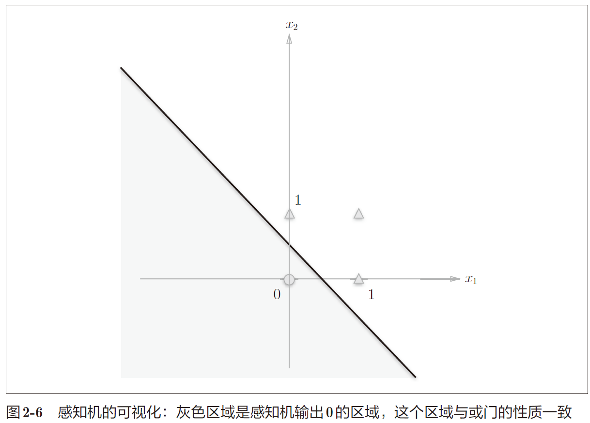

○表示0，△表示1。如果想制作或门，需要用直线将图中的○和△分开。实际上，刚才的那条直线就将这4 个点正确地分开了。
那么，异或门呢？能否像或门那样，用一条直线作出分割图2-7 中的○和△的空间呢？答案是否定的。
只能选取曲线将其分开。

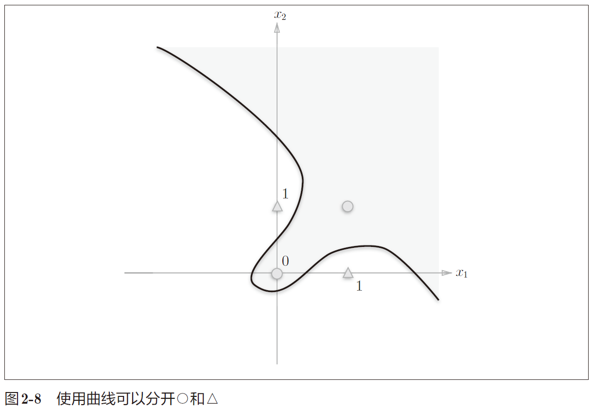

单层感知机的局限性就在于它只能表示由一条直线分割的空间。曲线分割而成的空间称为**非线性空间**，由直线分割而成的空间称为**线性空间**。

### 多层感知机

通过组合感知机（叠加层）可以实现异或门（XOR）。

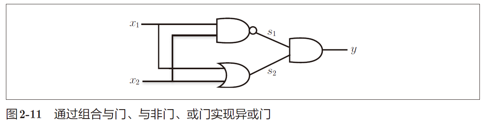

s1 为与非门（NAND），s2为或门（OR），然后使用与门（AND）将其组合起来。

| $$x_1$$ | $$x_2$$ | $$s_1$$(NAND) | $$s_2$$(OR) | $$y$$ |
| ------- | ------- | ------------- | ----------- | ----- |
| 0       | 0       | 1             | 0           | 0     |
| 1       | 0       | 1             | 1           | 1     |
| 0       | 1       | 1             | 1           | 1     |
| 1       | 1       | 0             | 1           | 0     |

```python
def XOR(x1, x2):
    s1 = NAND(x1, x2)
    s2 = OR(x1, x2)
    y = AND(s1, s2)
    return y
```

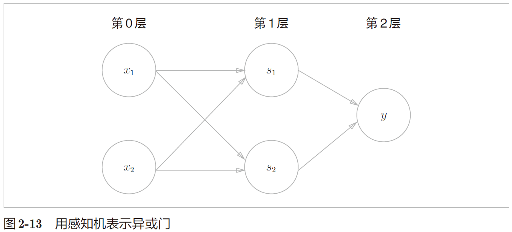

异或门是一种多层结构的神经网络。将最左边的一列称为第 0 层，中间的一列称为第 1 层，最右边的一列称为第 2 层。

通过叠加层（加深层），感知机能够进行非线性的表示。多层感知机（在理论上）可以表示计算机。


## 第三章 神经网络

神经网络的一个重要性质是可以自动地从数据中学习到合适的权重参数。

### 激活函数

将之前的函数写成更简洁的形式：
$$
y=h(b+w_1x_1+w_2x_2)
$$

$$
h(x)=\begin{cases} 0, & \text{($x$ $\leq$ 0)} \\[2ex] 1, & \text{($x$ $\gt$ 0)} \end{cases}
$$

h（x）函数会将输入信号的总和转换为输出信号，这种函数称为激活函数（activation function）。

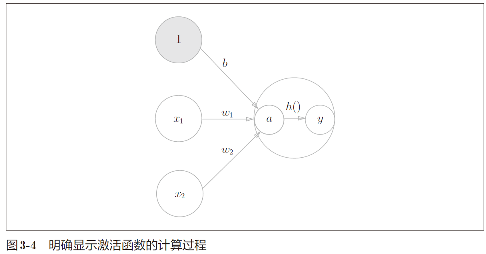

#### 阶跃函数

阶跃函数的numpy实现：

```python
def step_function(x):
    y = x > 0 # array([False, True, True], dtype=bool)
    return y.astype(np.int) # True -> 1, False ->0
```

阶跃函数的图形：

```python
import numpy as np
import matplotlib.pylab as plt

def step_function(x):
	return np.array(x > 0, dtype=np.int)
x = np.arange(-5.0, 5.0, 0.1)
y = step_function(x)
plt.plot(x, y)
plt.ylim(-0.1, 1.1) # 指定y轴的范围
plt.show()
```

#### sigmoid

神经网络中经常使用的一个激活函数是 sigmoid 函数（sigmoid function）。
$$
h(x)=\frac{1}{1+exp(-x)}
$$
exp(−x)表示e<sup>-x</sup>。

sigmoid函数的实现：

```python
def sigmoid(x):
    return 1 / (1 + np.exp(-x))
```

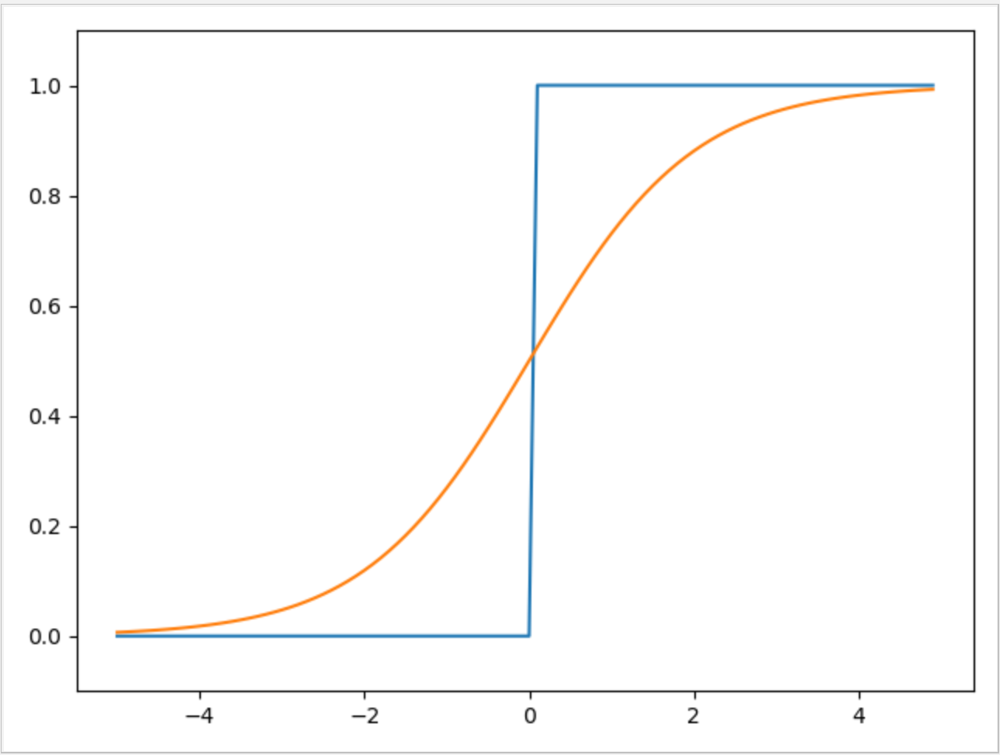

感知机中神经元之间流动的是 0 或 1 的二元信号，而神经网络中流动的是连续的实数值信号。

共同点：

- 输入小时，输出接近0（为0）；随着输入增大，输出向1 靠近（变成1）”。
- 值域在[0,1]。
- 都是非线性函数（线性函数为h(x) = cx。c 为常数）。

**神经网络的激活函数必须使用非线性函数**。

线性函数的问题在于，不管如何加深层数，总是存在与之等效的“无隐藏层的神经网络”。

考虑把线性函数h(x) = cx 作为激活函数，把y(x) = h(h(h(x))) 的运算对应 3 层神经网络A。这个运算会进行y(x) = c × c × c × x 的乘法运算，但是同样的处理可以由y(x) = ax（注意，$$a = c^3$$）这一次乘法运算（即没有隐藏层的神经网络）来表示。

#### ReLU函数

ReLU（Rectified Linear Unit）函数：
$$
h(x)=\begin{cases}x,&\text{$x$ $\gt$ 0}  \\[2ex]0,& \text{$x$ $\leq$ 0}\end{cases}
$$
ReLU函数在输入大于0 时，直接输出该值；在输入小于等于0 时，输出0。

```python
def relu(x):
 	return np.maximum(0, x)
```

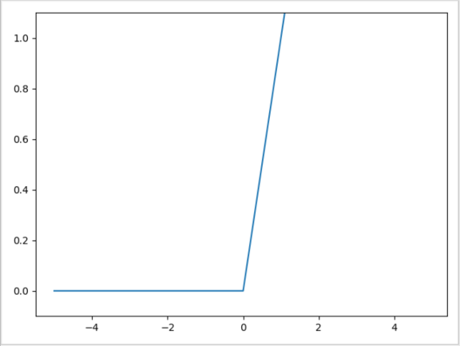

### 多维数组的运算

```python
np.ndim() # 获取维度
A.shape  # 获取数组形状
```

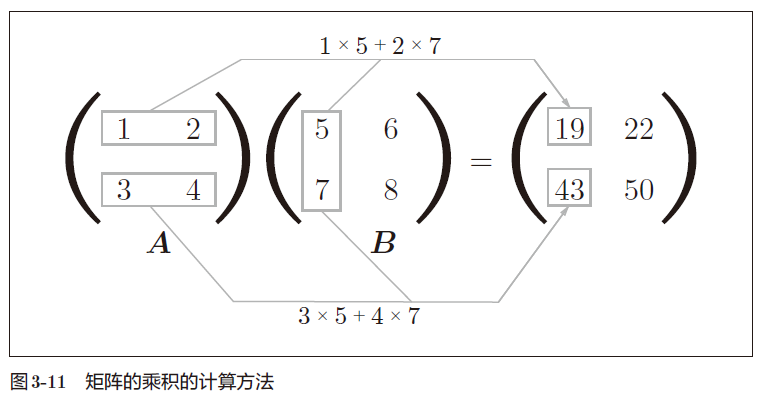

矩阵的乘积运算中，操作数（A、B）的顺序不同，结果也会不同。

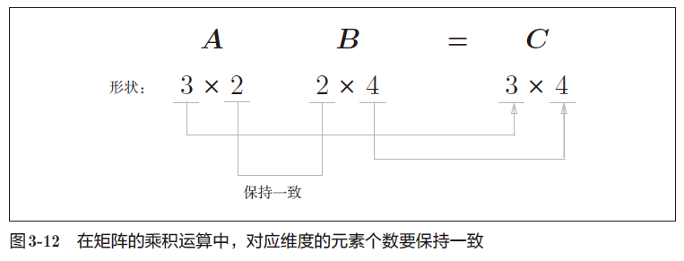

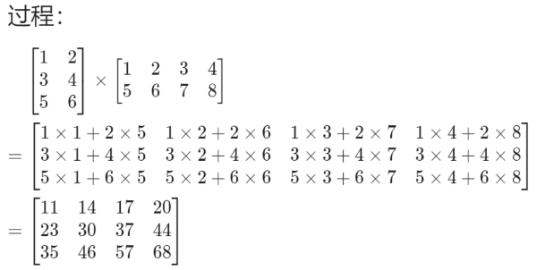

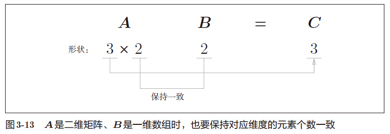

np.dot(X, W) 可以计算矩阵的点积。

### 3层神经网络的实现

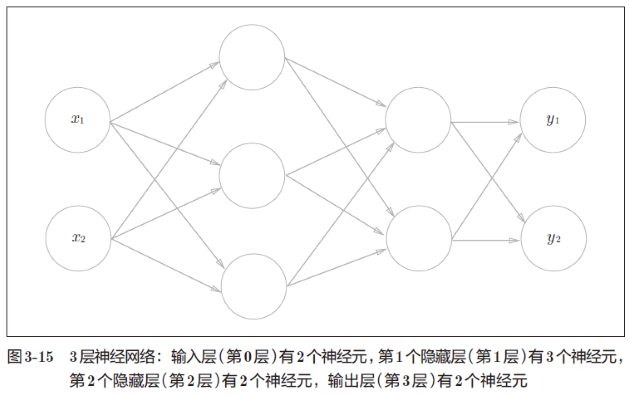

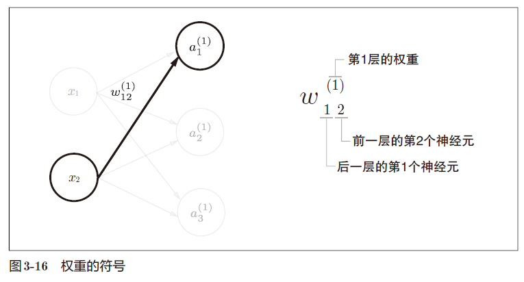

神经元$$a_1$$<sup>(1)</sup>的右上角有一个“(1)”，表示神经元的层号为第 1 层。

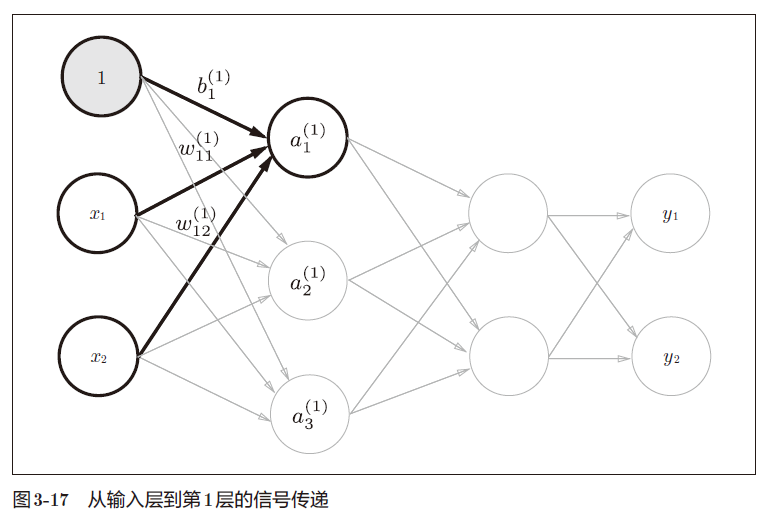
$$
a^{(1)}_{1}=w^{(1)}_{11}x_{1}+w^{(1)}_{12}x_{2}+b^{1}_{1}
$$
第一层的加权和可以表示成：
$$
A^{(1)}=XW^{(1)}+B^{(1)}
$$
其中：
$$
A^{(1)}=(a^{(1)}_{1}\ a^{(1)}_{2}\ a^{(1)}_{2}),
\\
X=(x_{1}\ x_{2}),
\\
B^{(1)}=(b^{(1)}_{1}\ b^{(1)}_{2} \ b^{(1)}_{3}),
\\
W^{(1)}=(\begin{matrix}
     w^{(1)}_{11} & w^{(1)}_{21} & w^{(1)}_{31} \\
     w^{(1)}_{12} & w^{(1)}_{22} & w^{(1)}_{32}
\end{matrix})
$$
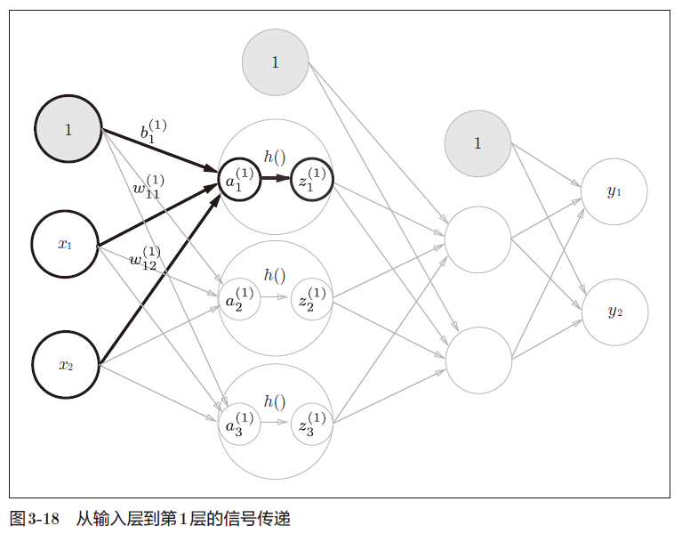

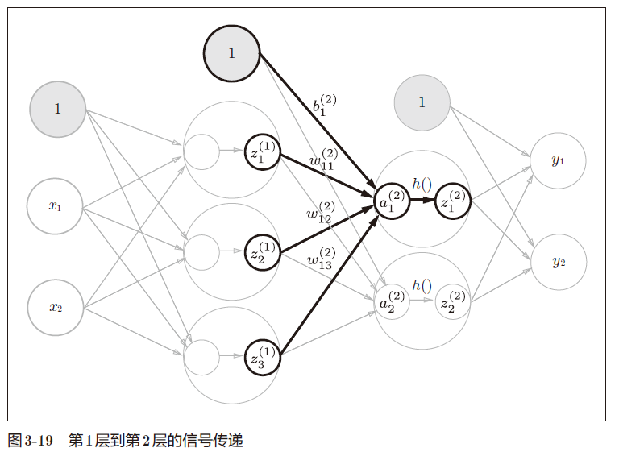

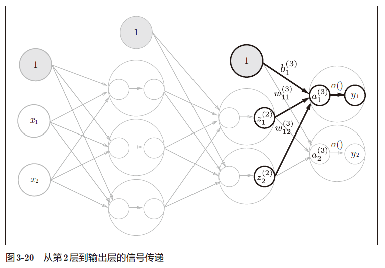

神经网络可以用在分类问题和回归问题上，不过需要根据情况改变输出层的激活函数。一般而言，回归问题用恒等函数，分类问题用softmax 函数。

softmax 函数：
$$
y_{k}=\frac{exp(a_{k})}
{
\begin{equation*}
\sum_{i=1}^nexp(a_{i})
\end{equation*}
}
$$
exp(x) 是表示$$e^{x}$$的指数函数。

softmax函数的实现：

```python
def softmax(a):
    exp_a = np.exp(a)
    sum_exp_a = np.sum(exp_a)
    y = exp_a / sum_exp_a
    return y
```

由于exp(a)当a很大时会溢出，所以可以进行改进：
$$
y_{k}=\frac{exp(a_{k})}{\begin{equation*}\sum_{i=1}^nexp(a_{i})\end{equation*}}=
\frac{Cexp(a_{k})}{\begin{equation*}C\sum_{i=1}^nexp(a_{i})\end{equation*}}=
\frac{exp(a_{k}+logC)}{\begin{equation*}\sum_{i=1}^nexp(a_{i}+logC)\end{equation*}}=
\frac{exp(a_{k}+C^{'})}{\begin{equation*}\sum_{i=1}^nexp(a_{i}+C^{'})\end{equation*}}
$$
思路是让$$a_{i}+C^{'}$$尽可能小，所以替换为$$a_{i}-\max(a_{i})$$

```python
def softmax(a):
    c = np.max(a)
    exp_a = np.exp(a - c)
    sum_exp_a = np.sum(exp_a)
    y = exp_a / sum_exp_a
    return y
```

softmax函数的输出是0.0 到1.0之间的实数。并且，softmax函数的输出值的总和是1。正因为这个性质，可以把softmax 函数的输出解释为“概率“。

“学习”是指使用训练数据、自动调整参数的过程。

使用神经网络解决问题时，先使用训练数据（学习数据）进行权重参数的学习；进行推理时，使用学习到的参数，对输入数据进行分类。

### 手写数字识别

MNIST数据集是由 0 到9 的数字图像构成。MNIST的图像数据是 28 像素 × 28 像素的灰度图像（1 通道），各个像素的取值在 0 到 255 之间。每个图像数据都相应地标有“7”“2”“1”等标签。

下载地址：http://yann.lecun.com/exdb/mnist/ 

网络不好时建议使用迅雷下载到本地，并手动注释掉minist.py中download_mnist() 该行防止继续下载。

Python 中 pickle 可以将程序运行中的对象保存为文件。如果加载保存过的pickle 文件，可以立刻复原之前程序运行中的对象。

- 把数据限定到某个范围内的处理称为正规化（normalization）。
- 对神经网络的输入数据
  进行某种既定的转换称为预处理（pre-processing）。
- 将数据整体的分布形状均匀化的方法，即数据白化（whitening）。

```python
def get_data():
    (x_train, t_train), (x_test, t_test) = load_mnist(normalize=True, flatten=True, one_hot_label=False)
    return x_test, t_test

def init_network():
    with open("sample_weight.pkl", 'rb') as f:
        network = pickle.load(f)
    return network

def predict(network, x):
    W1, W2, W3 = network['W1'], network['W2'], network['W3']
    b1, b2, b3 = network['b1'], network['b2'], network['b3']

    a1 = np.dot(x, W1) + b1
    z1 = sigmoid(a1)
    a2 = np.dot(z1, W2) + b2
    z2 = sigmoid(a2)
    a3 = np.dot(z2, W3) + b3
    y = softmax(a3)

    return y

x, t = get_data()
network = init_network()
accuracy_cnt = 0
for i in range(len(x)):
    y = predict(network, x[i]) #输出[0.1,0.3,0.2,...,0.04]，表示“0”的概率为0.1等
    p= np.argmax(y) # 获取概率最高的元素的索引
    if p == t[i]:
        accuracy_cnt += 1

print("Accuracy:" + str(float(accuracy_cnt) / len(x)))
```

单数据处理：

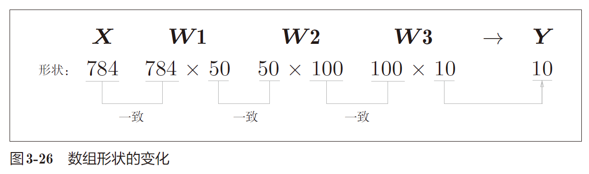

输入：一个由784 个元素（28 × 28 的二维数组）构成的一维数组；输出：一个有10 个元素的一维数组。

假设将x的形状改为100 × 784，将
100 张图像打包作为输入数据，那么一次就可以处理100个数据。

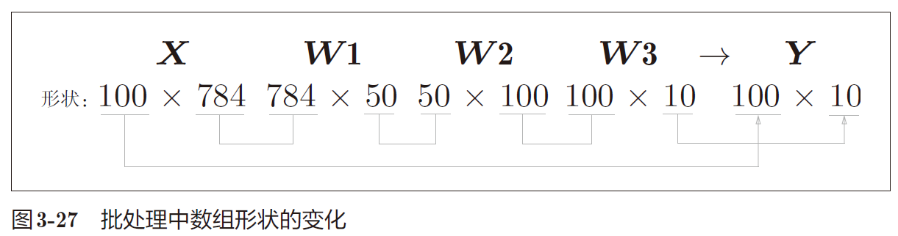

x[0] 和
y[0]中保存了第 0 张图像及其推理结果，x[1]和y[1]中保存了第 1 张图像及
其推理结果。

小结：

关于输出层的激活函数，回归问题中一般用恒等函数，分类问题一般用 softmax 函数。

分类问题中，输出层的神经元的数量设置为要分类的类别数。

## 第四章 神经网络的学习

“学习”是指从训练数据中自动获取最优权重参数的过程。以损失函数为基准，利用函数斜率的梯度法。

### 损失函数

针对单个数据的损失函数：

均方误差
$$
E=\frac{1}{2}{\begin{equation*}\sum_{k}(y_k-t_k)^2\end{equation*}}
$$
交叉熵误差
$$
E=-{\begin{equation*}\sum_{k}t_klog{y_k}\end{equation*}}
$$
针对所有训练数据的平均损失函数：
$$
E=-\frac{1}{N}{\begin{equation*}\sum_{n}\sum_{k}t_klog{y_k}\end{equation*}}
$$
MNIST 数据：训练数据有60000 个，输入数据是784 维
（28 × 28）的图像数据，监督数据是10 维的数据。因此，x_train、t_
train的形状分别是(60000, 784)和(60000, 10)。

np.random.choice(60000, 10) 会从0 到59999 之间随机选择10 个数字。根据这个，从训练数据中随机抽取10 笔数据。

思路：用随机选择的小批量数据（mini-batch）作为全体训练数据的近似值。

y[np.arange(batch_size),
t]能抽出各个数据的正确解标签对应的神经网络的输出。

例如当batch_size为 5
时，np.arange(batch_size) 会生成一个 NumPy 数组[0, 1, 2, 3, 4]。因为
t 中标签是以[2, 7, 0, 9, 4]的形式存储的，会生成NumPy 数组[y[0,2], y[1,7], y[2,0],
y[3,9], y[4,4]]。

阶跃函数的斜率在绝大多数地方都为0，而sigmoid函
数的斜率（切线）不会为0。

### 导数

解析性求导得到的导数是不含误差的“真的导数“。

而利用微小的差分求导数的过程称为数值微分：

- 中心差分：函数 f 在(x + h) 和(x − h) 之间的差分。

  ```python
  def numerical_diff(f, x):
  	h = 1e-4 # 0.0001
  	return (f(x+h) - f(x-h)) / (2*h)
  ```

  使用该方法计算得到的结果和解析性求导的结果很接近。

- 前向差分：函数 f 在(x + h) 和x之间的差分。

### 偏导数 

将多个变量中的某一个变量定为目标变量，并将其他变量固定为某个值。符号为∂f。

### 梯度

全部由偏导数汇总而成的向量称为梯度（gradient）。

```python
def _numerical_gradient_no_batch(f, x):
    h = 1e-4 # 0.0001
    grad = np.zeros_like(x)
    
    for idx in range(x.size):
        tmp_val = x[idx]
        x[idx] = float(tmp_val) + h
        fxh1 = f(x) # f(x+h)
        
        x[idx] = tmp_val - h 
        fxh2 = f(x) # f(x-h)
        grad[idx] = (fxh1 - fxh2) / (2*h)
        
        x[idx] = tmp_val # 还原值
        
    return grad
```

梯度指示的方向是各点处的函数值减小最多的方向。

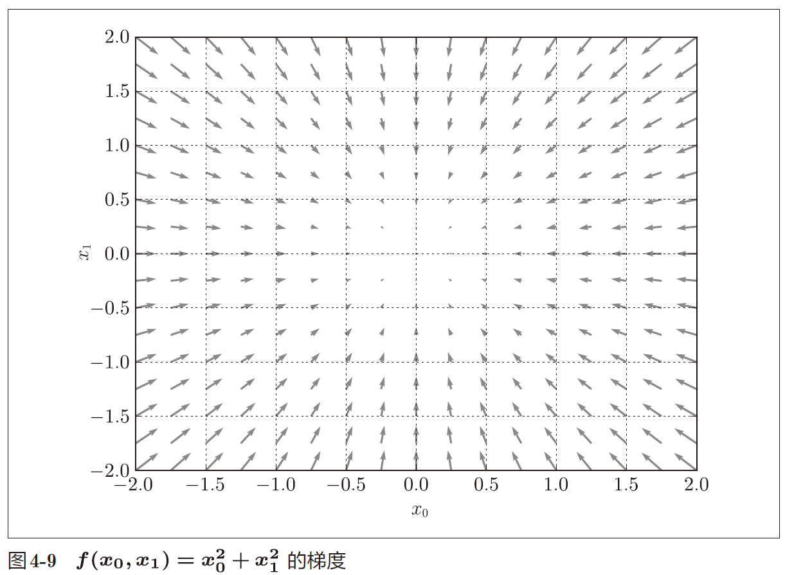

神经网络（深度学习）中，梯度法主要是指梯度下降法。

梯度法的数学公式：
$$
x_0=x_0-η\frac{∂f}{∂x_0}
\\
x_1=x_1-η\frac{∂f}{∂x_1}
$$
η 表示更新量，在神经网络的学习中，称为学习率（learning
rate）。整个式子表示的是逐步减少函数的值。

梯度下降法的代码实现：

```python
def gradient_descent(f, init_x, lr=0.01, step_num=100):
	x = init_x
	for i in range(step_num):
		grad = numerical_gradient(f, x) 
		x -= lr * grad # 每次下降的梯度值：lr * 梯度
	return x
```

参数f 是要进行最优化的函数，init_x 是初始值，lr 是学习率，step_num 是梯度法的重复次数。numerical_gradient(f,x) 会求函数的梯度，用该梯度乘以学习率得到的值进行更新操作，由step_num 指定重复的
次数。

学习率一般是人工设置和调整的，这点和权重和偏置不一样。

神经网络的梯度跟W很相似：
$$
W=(\begin{matrix}
     w_{11} & w_{21} & w_{31} \\
     w_{12} & w_{22} & w_{32}
\end{matrix})

\\
\frac{∂L}{∂W}=(\begin{matrix}
     \frac{∂L}{w_{11}} & \frac{∂L}{w_{12}} & \frac{∂L}{w_{13}} \\
     \frac{∂L}{w_{21}} & \frac{∂L}{w_{22}} & \frac{∂L}{w_{23}}
\end{matrix})
$$

$\frac{∂L}{w_{11}}$的值大约是0.2，表示如果将$w_{11}$ 增加h，那么损失函数的值会增加0.2h。

再如， $\frac{∂L}{w_{23}}$对应的值大约是−0.5，表示如果将 $w_{23}$ 增加h，损失函数的值将减小0.5h。

因此，从减小损失函数值的观点来看，$w_{23}$ 应向正方向更新，$w_{11}$应向负方向更新。至于更新的程度，$w_{23}$ 比$w_{11}$的贡献要大，因为绝对值较大。

### 随机梯度下降法（SGD)

- 步骤一：从训练数据中随机挑选一部分作为mini-batch。
- 步骤二：求出各个权重参数的梯度。
- 步骤三：将权重参数沿梯度方向进行微小更新。
- 步骤四：重复步骤1~3

### mini-batch的实现

epoch是一个单位。一个epoch表示学习中所有训练数据均被使用过
一次时的更新次数。比如，对于10000 笔训练数据，用大小为100
笔数据的mini-batch 进行学习时，重复随机梯度下降法100 次，所有的训练数据就都被“看过”了。此时，epoch为100。

## 第5章 误差反向传播法

146/314