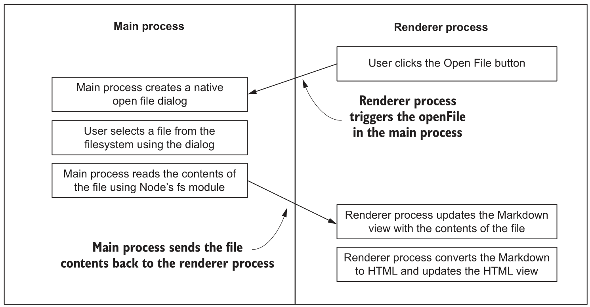
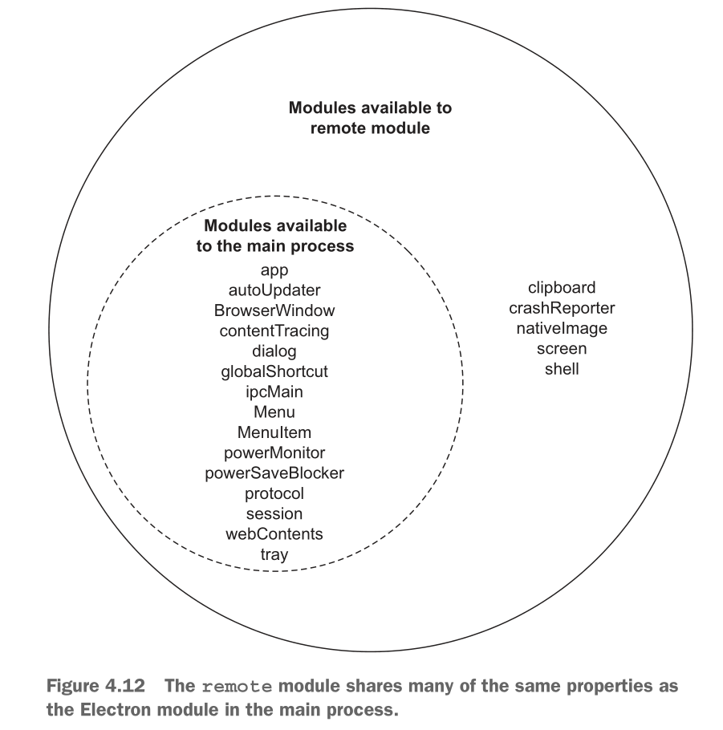
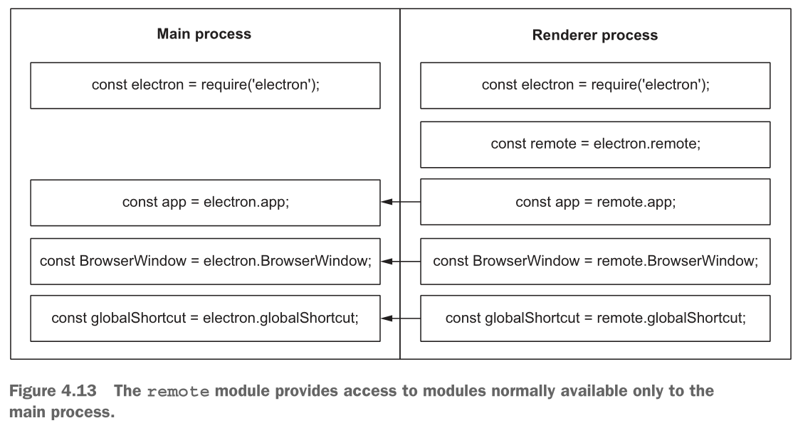
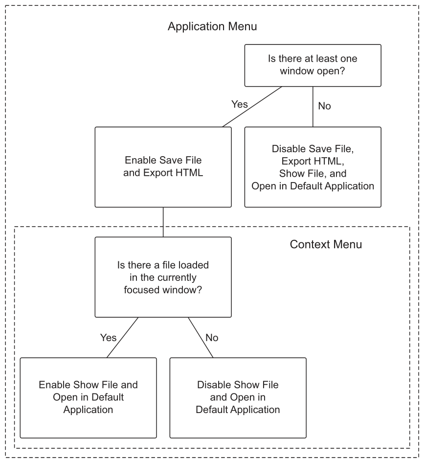

## Get Start
### What is Electron?
Chromium Content Module + NodeJS

### Why should I use Electron?
- building on your existing skill set
- access to native operating system APIs
- permit enhanced privileges and have fewer restrictions
  - can use their Node.js runtimes to make requests to third-party APIs.

### How does Electron work?
- consist of two types of processes: 1 main process and 1+ renderer processes.
  - The main process handles OS integration, manages the lifecycle of the application, and creates renderer processes
  - Renderer processes display the UI and respond to user events
- Renderer processes can communicate with the main process if they need to access an OS-level API
- Electron uses the officially supported content module from Chromium as opposed to NW.js, which uses a custom fork of Chromium

## First App
- main process can create BrowserWindow(render process) by
  ```js
  const mainWindow = new BrowserWindow({...})
  mainWindow.loadFile('index.html')
  ```
- BrowserWindow can preload js by `webPreferences.preload` option
  ```
    webPreferences: {
        preload: path.join(__dirname, 'preload.js')
    }
  ```
- BrowserWindow use NodeJS APIs once `webPreferences.nodeIntegration` is turned off
  ```
    webPreferences: {
        nodeIntegration: true
    }
  ```
  
## IPC Module
The communication between processes is possible via Inter-Process Communication (IPC) modules: `ipcMain` and `ipcRenderer`.

To call the Main process from the Renderer, use the IPC module:
```js
const {ipcMain} = require('electron')

// Refer link: https://www.electronjs.org/docs/tutorial/quick-start#apis
ipcMain.handle('perform-action', (event, ...args) => {
    // ... do actions on behalf of the Renderer
    console.log(`In main.js, get from render process`,...args)
})
```
```js
// In the Renderer process
const {ipcRenderer} = require('electron')

let args = {name: "foo", age: 23}
ipcRenderer.invoke('perform-action', args)
```

In summary:
```
------------Render -> Main-------------
Render Process:   ipcRenderer.invoke()
Main Process:     ipcMain.handle()
---------------------------------------

-----------Main -> Render--------------
// 'textContent' is message channel
Main Process:     mainWindow.webContents.send('textContent', fileContent)
Render Process:   ipcRenderer.addListener('textContent', (event, content) => {...})
--------------------------------------
```
## Package First App
Refer document
- https://www.electronjs.org/docs/tutorial/quick-start#package-and-distribute-the-application
- https://www.electronforge.io/import-existing-project

In Windows 10
```
npm install -g windows-build-tools 
npm install -g electron-forge --unsafe-perm --force
```
```
D:\Code\WebStormProjects\electron-quick-start>electron-forge import
√ Checking your system
? WARNING: We will now attempt to import: "D:\Code\WebStormProjects\electron-quick-start".  This will involve modifying some files, are you sure you want to continue? Yes
√ Initializing Git Repository
? Do you want us to change the "main" attribute of your package.json?  If you are currently using babel and pointing to a "build" directory say yes. No
? Do you want us to update the "start" script to instead call the electron-forge task "electron-forge start" No
√ Writing modified package.json file
√ Installing dependencies
√ Writing modified package.json file
√ Fixing .gitignore


We have ATTEMPTED to convert your app to be in a format that electron-forge understands.
Nothing much will have changed but we added the "electron-prebuilt-compile" dependency.  This is the dependency you must version bump to get newer versions of Electron.


We also tried to import any build tooling you already had but we can't get everything.  You might need to convert any CLI/gulp/grunt tasks yourself.

Also please note if you are using `preload` scripts you need to follow the steps outlined at https://github.com/electron-userland/electron-forge/wiki/Using-%27preload%27-scripts

Thanks for using "electron-forge"!!!
```
```
> electron-quick-start@1.0.0 make
> electron-forge make

√ Checking your system
√ Resolving Forge Config
Downloading tmp-6824-1-SHASUMS256.txt-8.2.0
[============================================>] 100.0% of 5.65 kB (5.65 kB/s)
√ Preparing to Package Application for arch: x64
√ Compiling Application
√ Preparing native dependencies

√ Making for target: squirrel - On platform: win32 - For arch: x64
```

## Implementing the Open File Button


## Remote Module
> The remote module provides a proxy to the main process modules 
>and functions and makes that functionality available in our renderer processes.





1. Require Electron in renderer process.
2. Store a reference to the remote module.
3. Use remote.require to require the main process.
4. Store a reference to the doSomeThing() function exported from the main process

```
const { remote } = require('electron');
const mainProcess = remote.require('./main.js');
button.addEventListener('click', () => { mainProcess.doSomeThing(); });
```

The following is an incomplete list of some events that you can listen for on the webContents object: 
- did-start-loading 
- did-stop-loading 
- dom-ready 
- blur 
- focus 
- resize 
- enter-full-screen 
- leave-full-screen

## When to use remote vs ipcRenderer, ipcMain
- https://stackoverflow.com/questions/36548228/when-to-use-remote-vs-ipcrenderer-ipcmain

## Manage Multiple Windows
Use Set to manage windows.

## Recently opened files
```
app.addRecentDocument(file);
```
```
app.on('will-finish-launching', () => {
    app.on('open-file', (event, file) => {
        const win = createWindow();
        win.once('ready-to-show', () => {
            openFile(win, file);
        });
    });
});
```

## Save files
```
fs.writeFileSync(file, content);
```

## Drag and drop to open file
disable the default behavior
```js
document.addEventListener('dragstart', event => event.preventDefault());
document.addEventListener('dragover', event => event.preventDefault());
document.addEventListener('dragleave', event => event.preventDefault());
document.addEventListener('drop', event => event.preventDefault());
```
```js
const getDraggedFile = (event) => event.dataTransfer.items[0];
const getDroppedFile = (event) => event.dataTransfer.files[0];//file
const fileTypeIsSupported = (file) => {
    return ['text/plain', 'text/markdown'].includes(file.type);
};
```

## Watch file for changes
Steps：
1. Sets up a data structure for tracking our file watchers and the window that
they’re associated with.
2. Begins watching for file changes upon opening a file.
3. When opening subsequent files, closes the existing watcher before creating a
new one.
4. Closes the watcher when the window is closed.
```js
const openFiles = new Map();
```
```js
const startWatchingFile = (targetWindow, file) => {
    stopWatchingFile(targetWindow);
    const watcher = fs.watchFile(file, (event) => {
        if (event === 'change') {
            const content = fs.readFileSync(file);
            targetWindow.webContents.send('file-opened', file, content);
        }
    });
    openFiles.set(targetWindow, watcher);
};
const stopWatchingFile = (targetWindow) => {
    if (openFiles.has(targetWindow)) {
        openFiles.get(targetWindow)
                 .stop();
        openFiles.delete(targetWindow);
    }
};
```

## Prompting the user before discarding changes
Prompting the user if they try to close a window with unsaved changes
```js
newWindow.on('close', (event) => {
    if (newWindow.isDocumentEdited()) {
        event.preventDefault();
        const result = dialog.showMessageBox(newWindow, {
            type: 'warning',
            title: 'Quit with Unsaved Changes?',
            message: 'Your changes will be lost if you do not save.',
            buttons: [
                'Quit Anyway',
                'Cancel',
            ],
            defaultId: 0,
            cancelId: 1
        });
        if (result === 0) newWindow.destroy();
    }
})
```

Prompting the user when opening a new file if there are unsaved changes
```js
ipcRenderer.on('file-opened', (event, file, content) => {
    if (currentWindow.isDocumentEdited()) {
        const result = remote.dialog.showMessageBox(currentWindow, {
            type: 'warning',
            title: 'Overwrite Current Unsaved Changes?',
            message: 'Opening a new file in this window will overwrite your unsaved changes. Open this file anyway?',
            buttons: ['Yes', 'Cancel'],
            defaultId: 0,
            cancelId: 1
        });

        // If the user cancels, returns from the function early
        if (result === 1) {
            return;
        }
    }
    renderFile(file, content);
});
```

Prompting the user when a file changes
```js
ipcRenderer.on('file-changed', (event, file, content) => {
    const result = remote.dialog.showMessageBox(currentWindow, {
        type: 'warning',
        title: 'Overwrite Current Unsaved Changes?',
        message: 'Another application has changed this file. Load changes?',
        buttons: ['Yes', 'Cancel',],
        defaultId: 0,
        cancelId: 1
    });

    // In this situation, we don’t care if the document has been edited. We want to prompt the user regardless
    renderFile(file, content);
});
```

Sending a message over the file-changed channel
> modify the startWatchingFile() function to send a message over the `file-changed` channel, instead of the `file-opened` channel,

## Menu Module
`application-menu.js`
```
const {Menu} = require('electron');
const template = [{
    label: 'Edit',
    submenu: [
        {
            label: 'Copy',
            accelerator: 'CommandOrControl+C',
            role: 'copy',
        },
        {
            label: 'Paste',
            accelerator: 'CommandOrControl+V',
            role: 'paste',
        },
    ]
}];
module.exports = Menu.buildFromTemplate(template);
```
```
const applicationMenu = require('./application-menu');
Menu.setApplicationMenu(applicationMenu);
```
## Custom menu functionality
```
 {
    label: 'Save File',
    accelerator: 'CommandOrControl+S',
    click(item, focusedWindow) {
        focusedWindow.webContents.send('save-markdown');
    },
},
{
    label: 'Export HTML',
    accelerator: 'Shift+CommandOrControl+S',
    click(item, focusedWindow) {
        focusedWindow.webContents.send('save-html');
    },
},
```
## Add IPC listeners to the renderer process
```js
ipcRenderer.on('save-markdown', () => {
    mainProcess.saveMarkdown(currentWindow, filePath, markdownView.value);
});
ipcRenderer.on('save-html', () => {
    mainProcess.saveHtml(currentWindow, filePath, markdownView.value);
});
```

## Displaying an error when trying to save or export a file that doesn't exist
```
{
    label: 'Save File',
    accelerator: 'CommandOrControl+S',
    click(item, focusedWindow) {
        if (!focusedWindow) {
            return dialog.showErrorBox(
                'Cannot Save or Export',
                'There is currently no active document to save or export.'
            );
        }
        focusedWindow.webContents.send('save-markdown');
    },
}
```
```
{
    label: 'Export HTML',
    accelerator: 'Shift+CommandOrControl+S',
    click(item, focusedWindow) {
        if (!focusedWindow) {
            return dialog.showErrorBox(
                'Cannot Save or Export',
                'There is currently no active document to save or export.'
            );
        }
        focusedWindow.webContents.send('save-html');
    },
},
```

## Building context menus
```
const {Menu} = remote;
const markdownContextMenu = Menu.buildFromTemplate([...]);

contentView.addEventListener('contextmenu', (event) => {
    event.preventDefault();
    markdownContextMenu.popup();
});
```

## Shell module
```
const {shell} = require('electron')
shell.showItemInFolder(filePath);
```

## Dynamically enabling and disabling menu items in the context menu



## Dynamically enabling and disabling menu items in the application menu
- If there are no windows open, Save File, Export HTML, Show File, and Open
  in Default Application should be disabled.
- If there is a focused window, but the user is working on a file that has not
  yet been saved to the filesystem, then the Save File and Export HTML items should be
  enabled. The Show File and Open in Default Application menu items should not be,
  however, because there is no file location to show or open.
- If the window is representing a file on the filesystem, all the menu items
  should be enabled.
  
## Tray module
> ...

## Clipboard module
The clipboard module provides several ways to read and write content to and from the clipboard

## GlobalShortcut module
The globalShortcut module allows Electron applications to register listeners for keyboard shortcuts

## Menubar library
By default, menubar creates a browser window but does not load an HTML document into it.

menubar is a third-party library that is a high-level abstraction around core Electron modules
and another third-party library called electron-positioner.

## Enabling live reload
```
import {app, BrowserWindow} from 'electron';
import {enableLiveReload} from 'electron-compile';

enableLiveReload();

app.on('ready', () => {
        // Omitted for brevity…
    }
);
```
When we call the enableLiveReload() function before the application has started, 
electron-compile sets up an IPC connection that listens for filesystem changes and sends a message to the renderer process,
requesting that it reload whenever it detects a change.

> enable hot module reload

## compile
- electron-compile allows developers to use an assortment of languages that
compile to HTML, JavaScript, and CSS such as Jade, TypeScript, CoffeeScript,
Sass, and Less.
- electron-prebuilt-compile is a version of the Electron binary with electron-
compile installed.

## Persisting user data
- Using SQLite and IndexedDB databases to persist data 
  - SQLite: store in one file
  - IndexedDB: browser-based storage
- Storing user-specific application data in the operating system’s designated location
- When you install dependencies using npm install or yarn install,
  the dependencies are built against the system version of Node—not that of Electron.
- electron-rebuild goes through your installed dependencies and rebuilds
  them for the version of Node packaged with Electron.

> Refer demo: 
> - https://github.com/electron-in-action/jetsetter/tree/sqlite
> - https://github.com/electron-in-action/jetsetter/tree/indexeddb
  
## Building for multiple operating systems
- Using electron packager
> Refer demo: https://github.com/electron-in-action/firesale/tree/chapter-14-beginning

- Using electron forge (recommended)
> Refer demo: https://github.com/electron-in-action/jetsetter/tree/chapter-14-ending
```
"package": "electron-forge package",
"make": "electron-forge make --verbose --skip-package"
```

## Testing
- Spectron is an officially supported library for testing Electron applications.
- Spectron wraps WebdriverIO, which provides Selenium with Node.js bindings.
- Spectron does not provide its own test running or assertion library. Instead, it
allows you to choose which one you want to use.
- Electron supports async/await syntax, which greatly simplifies writing asynchronous code.

> Refer demo: https://github.com/electron-in-action/clipmaster-9000-spectron/tree/completed-example

## crashReporter module 
to collect exception

## Windows installer configuration
- electron-winstaller
- electron-squirrel-startup

> Refer demo: https://github.com/electron-in-action/firesale/tree/chapter-15-ending
```js
const result = createWindowsInstaller({
  title: 'Fire Sale',
  authors: 'Steve Kinney',
  appDirectory: path.resolve(__dirname, '../build/Fire Sale-win32-x64'),
  outputDirectory: path.resolve(
    __dirname,
    '../build/Fire Sale-win32-x64-installer'
  ),
  icon: iconPath,
  setupIcon: iconPath,
  setupExe: 'FireSaleSetup.exe',
  setupMsi: 'FireSaleSetup.msi',
});
```

## Automatically updating applications
- Setting up automatic updates in Electron
  - https://github.com/electron-in-action/firesale `chapter-15-ending` branch
- Setting up a server for automatic updates
---
- Electron’s autoUpdater module checks for updates on start up.
- autoUpdater uses the open source Squirrel framework under the hood to man-
age installation and updates