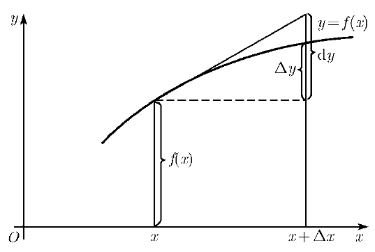
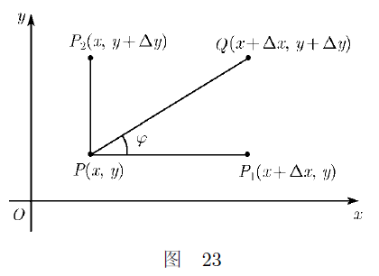
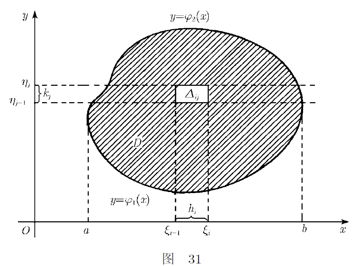

# 数学分析八讲

> 本文为《数学分析八讲》阅读笔记。

- 在深入研究某个知识时，能够独立找到所需材料，分清主要和次要，本质和非本质。
- 抛开树木，观察森林。

## 第一讲 连续统

1. e 和 π 的超越性。
2. 如果使变量在变化时只取有理值, 则其从一个值变为另一个值时就不得不跨过其间的间隙。
3. 引理1 任何单调有界序列都有极限。

## 第二讲 极限

1. "+∞的邻域"表示的是大于某个(任意的) 实数a 的全体实数集合。
2. 柯西准则：函数y = f(x) 当x→a 时有极限, 当且仅当：(A) 无论对于怎样小的正数", 都存在数(或符号)a 的一个邻域U, 使得对邻域
   U 中的任何两个数x1 和x2, 都有：$|f(x_1)-f(x_2)|< ε $。
3. 和的极限的定理：如果已知的有限多个量中
   的每一个当x→ a时都有极限, 则它们的和也有极限, 并且和的极限等于各项的极限之和。
4. 任何变量在其变化过程中都有最大和最小的部分极限. 它们分别称作量y = f(x) 当x → a 时的上极限和下极限。
5. 当x→ a 时其上极限和下极限都是数, 则量y 称为有界的; 如果两者中有一个取符号+∞或-∞, 则称其为无界的。
6. 因为上、下极限重合等价于部分极限的唯一性。
7. 多元函数的极限。

## 第三讲 函数

1. 如果M 是一个实数集, 而对于每一个x ∈ M 都对应一个确定的
   值y, 则称变量y = f(x) 为定义在实数集M 上的变量x 的函数。
2. 连续性。$\lim\limits_{x\to a}f(x) = f(a)$,称函数y = f(x) 当x = a 时(或者说在点a)连续。
3. 如果函数在给定区间[a, b] 的每一点上都依前述意义连续, 称该函数在区间[a, b] 上连续。这里在点a 处只要求其从右边的连续性，而在点b 处则只要求其从左边的连续性。
4. 连续函数在其任何两个值之间应当必须经过所有的中间值。
5. 一致连续。
6. 初等函数基本上都是连续的, 只是其中有几个在某些点处出现间断：
   $\frac{1}{x}$当x =0 时, tan x 当x = π/2时。
7. 等式f(a+0) = f(a) = f(a-0) 可以作为函数f(x) 在点a 处连续性的判据。
8. $y = sin\frac{1}{x}$ 在x = 0 处震荡。
## 第四讲 级数

1. 级数的收敛性与级数和。

2. 描述无穷级数的步骤：1) 给出部分和Sn 并研究其与n 的关系; 2) 令n→∞而取极限。

3. 若级数收敛, 则当n →∞时 $U_n$→ 0。实际上, 当n > 1 时$U_n=S_n-S_{n-1}$ ,又因为当n →∞ 时$S_n$ 和 $S_{n-1}$  有同一个极限S, 故有$U_n$→0。这只是发散的必要性，而不是充分性。例如“调和”级数：
    $1+\frac{1}{2}+\frac{1}{3}+...+\frac{1}{n}$ 就是发散的，尽管其第n 项当n →∞ 时是无穷小。

4. 柯西准则。级数收敛的充分必要条件是, 不等式
$$
  |u_{n+1} + u_{n+2} + ... + u_{u+k}| < ε
$$
  对任何 ε > 0, 都有充分大的n 存在, 使其对任意的自然数k 成立。

  柯西准则的条件在于：级数充分远的、无论怎样长的“一段" 之和,
  就绝对值而言可以变得任意的小。

5. 柯西准则只解决级数和的存在性问题。

6. 正项级数的收敛性准则。如果两个级数

   $$u_1 + u_2 + ... + u_n + ... (A)$$

   和

   $$v_1 + v_2 + ... + v_n + ... (B)$$

   的所有项均非负, 并且当$n > n_0$时有
   $$u_n ≤ v_n$$; 则从级数(B)的收敛性可以推得级数(A)的收敛性(同时也表明, 从级数(A) 的发散性可以推得级数(B) 的发散性)。

7. 绝对收敛和条件收敛。

   级数(5)为
   $$
   |u_1| + |u_2| + ... + |u_n| + ...                           \tag{5}
   $$
   级数(1)为
   $$
   u_1 + u_2 + ... + u_n + ...\tag{1}
   $$

   - 如果级数（5）收敛，则称级数（1）绝对收敛；
   - 如果级数（5）发散，则称级数（1）条件收敛。

   从级数(5) 的收敛性可以推得级数(1) 的收敛性.
   其证明基于柯西准则, 因为对任何n > 0; k > 0,
   $$
   {\sum_{i=1}^k u_{n+i}} ≤ {\sum_{i=1}^k |u_{n+i}|}
   $$
   当级数(5) 收敛时右边部分对于充分大的n 和任何k 都可以变得任意小, 所以左边也应当如此。

8. 无穷乘积。类似于收敛级数的一个性质, 即当n → 1 时级数的第n 项趋近于
   零, 无穷乘积中的第n 个因子$z_n$ 应当趋近于1。

9. 无穷乘积的柯西准则：要使得乘积(8) 
   $$
   (1 + u_1)(1 + u_2) ... (1 + u_n) ... =\prod_{n=1}^{n} (1+u_n) \tag{8}
   $$

   收敛, 当且仅当对于无论怎样小的ε > 0, 都存在充分大的n
   使得对任意的自然数k, 都有
   $$
   1 - ε <\prod_{i=n+1}^{n+k} (1+u_i) < 1 + ε \tag{11}
   $$
   简化形式为
   $$
   |\prod_{i=n+1}^{n+k} u_i|< ε
   $$

10. 如果所有的$u_n$都有同样的符号, 则要乘积(8) 收敛的充分必要条件是：级数
    $$
    u_1 + u_2 + ... + u_n + ... \tag{9}
    $$
    收敛。

11. 函数级数：项是某个自变量的函数的级数。

12. 一致收敛。如果对于任意小的ε > 0都存在着一个$n_0$ (仅与ε有关而与x无关), 使得对任何$n > n_0$以及任何x∈M, 都有
    $$
    |r_n(x)| < ε
    $$
    那么函数级数
    $$
    u_1(x) + u_2(x) + ... + u_n(x) + ... \tag{12}
    $$
    在某个集合M上是一致收敛的。

13. 在区间[a,b]上连续代表在区间[a,b]上可积。

14. 余项。
    $$
    r_n(x) = S(x) - S_n(x)
    $$

15. 幂级数。
    $$
    a_0 + a_1x + a_2x^2 + ... + a_nx^n + ... \tag{14}
    $$
    如果级数(14)当x =α 时收敛, 则它对任何|x|< α的x值都绝对收敛。

16. 阿贝尔定理：若级数(14) 当x = r > 0 时收敛, 则它在区间0 ≤ x ≤ r 上一致收敛。

## 第五讲 导数

1. 设y = f(x)为
   $$
   \frac{f(α + h) - f(α)}{h} \tag{1}
   $$
   要研究函数f(x) 在邻近α 点的性质, 显然当选取的|h|越小, 量(1) 作为函数y “可变性" 的尺度, 将在越大程度上满足我们的要求。当 h → 0 时，
   $$
   f'(α) = \lim_{h\to 0} \frac{f(α + h) - f(α)}{h} 
   =\lim_{∆x\to0}\frac{∆y}{∆x}
   $$
   这个极限称为函数f(x) 在点α处的导数。

   |f'(α)| 越大, 量y 对于量x 在其初始位置α 的很小偏离越敏感。

2. 函数在x=α处可导，当且仅当在该点处的左导数和右导数都存在和相等。

3. 证明：可导必然连续。

4. 证明：连续不一定可导。

   > 举个反例：f(x)在某点处的左导数和右导数都存在，但是不相等。
   > 

5. y=x*sin(1/x)的图像。

.png)

6. 微分（differential）形式的定义：
   $$
   dy = f'(x)∆x \tag{3}
   $$
   dy为函数f(x) 的微分, 其中∆x 为自变量的增量。

7. 

   在应用科学中, 当∆x 很小时，常常不区别函数y = f(x) 的增量
   ∆y 与微分dy。这有时甚至会导出"微分就是无穷小增量" 这种不正确的说法。

   > 从图中可以看出，增量
   > ∆y 与微分dy实际上是不等的。

   那么问题来了：

   1) 这种代换在什么范围内是允许的? 

   2) 这种代换会带来什么好处?

   对于第一个问题：首先，
   $$
   f'(x) = \lim_{∆x\to 0}\frac{∆y}{∆x}
   $$
   以α表示由此关系式而得的无穷小量，即
   $$
   α=\frac{∆y}{∆x}-f'(x)
   $$
   
   于是，
   $$
   ∆y = f'(x)∆x + α∆x = dy + α∆x \tag{3'}
   $$
   从这里可以看出，增量
   ∆y 与微分dy之间的差值为α∆x。
   
   接下来，具体研究一下α∆x。
   
   当∆x → 0 时α→ 0, 所以乘积α∆x 是比∆x 更为高阶的无穷小量。
   
   即：如果
   f‘(x) ≠ 0, 函数当∆x→0 时的增量与微分之间的差, 是关于其中每一个(即函数的微分或增量) 的值的较高阶的无穷小。
   
   换言之, **以微分代替增量时(或者相反),**
   **允许只能有无穷小的相对误差**。
   
   第二个问题：作出微分, 理论上和实际上, 一般都比作出增量更方便。

8. 微分dy 具有下述两条重要的性质.

   1) 它是∆x 的线性函数;

   2) 与∆y 相比, 相差一个较∆x 为高阶的无穷小。

9. 拉格朗日定理。如果函数f(x) 在闭区间[a, b] 上连续且在开区间(a,b) 内可微, 则存在该区间内的一个内点c, 使得
   $$
   f'(c) = \frac{f(b) - f(a)}{b-a} \tag{A}
   $$

10. 高阶微分。n 阶导数是通过对
    n - 1 阶导数求导而得到的, 对微分也是如此。

11. 无穷小量之比的极限。洛必达法则。如果$f_1(a) = f_2(a) = 0 $且比
    $$\frac{f'_1(x)}{f'_2(x)}$$
    当x →a
    时趋近于某个极限, 则$\frac{f_1(x)}{f_2(x)}$也趋近于同一极限。
    
12. 无穷大量之比的极限。洛必达法则。

13. 泰勒公式。首先，我们有
    $$
    \lim_{h\to0}\frac{f(a + h) - f(a)}{h}= f'(a)
    $$
    等价形式
    $$
    f(a + h) = f(a) + hf'(a) + αh; \tag{11}
    $$
    其中当h → 0 时α →0。 因此αh 是关于h 的高阶无穷小, 即其与h 的比值当h → 0 时趋近于零。

    约定, 以o(x) 来表示任何与x 的比在已知的变化过程中趋近于零的量。于是有
    $$
    \frac{o(h)}{h}= α → 0 (h→ 0)
    $$
    相反，任何o(h) 都可以表示为αh 的形式(其中当h → 0 时, α →0)。
    $$
    f(a + h) = f(a) + hf'(a) + o(h)
    $$
    近似地
    $$
    f(a + h) ≈ f(a) + hf'(a)
    $$
    用右边的关于h 的线性函数来代替复杂的函数f(a + h) 。显然, 这将带来本质性的好处。

    接着，考虑关于h的二阶无穷小
    $$
    f(a + h) = a_0 + a_1h + a_2h^2 + o(h^2)
    $$
    一般地，关于h的n阶无穷小
    $$
    a_0 + a_1h + ... + a_nh^n = P_n(h)
    \\
    f(a + h) = P_n(h) + o(h^n)
    $$
    也就是说，**可以使用简单的n 次多项式来代替很复杂的函数f(a + h)**。

14. 泰勒公式中多项式系数的求解证明。

    **设函数f(x) 在x = a 时有n阶导数，以及n阶的任何低阶导数**。

    那么，多项式$P_n(h)$ 唯
    一地由以下公式来定义：
    $$
    P_n(h) = f(a) + hf'(a) + \frac{h^2}{2!}f''(a)+...+\frac{h^n}{n!}f^{(n)}(a)
    $$
    证明过程：

    假设上述定义成立，那么有
    $$
    f(a+h) = f(a) + hf'(a) + \frac{h^2}{2!}f''(a)+...+\frac{h^n}{n!}f^{(n)}(a)+o(h^n)
    $$
    令
    $$
    f(a+h)-P_n(h)=φ(h)
    $$
    那么只需证明

    > 一方面应证明当$P_n(h)$ 取以上形式的多项式时, $f(a+h)-P_n(h) = o(h^n)$, 
    > 另一方面还要证明, 如果换成另外的$Q_n(h)$, 则$f(a+h)-Q_n(h)$ 不会是$o(h^n)$。
    > 下面只证了前一部分， 后一部分这里省略。

    $$
    \frac{φ(h)}{h^n}→ 0， 当h → 0 时
    $$

    注意到
    $$
φ(h) = f(a + h) - f(a) - hf'(a) - ... -\frac{h^n}{n!} f^{(n)}(a);
    \\
    φ'(h) = f'(a + h) - f'(a) - hf''(a) - ... -\frac{h^{n-1}}{(n-1)!} f^{(n)}(a);
    \\
    ...
    \\
    φ^{(n-2)}(h) = f^{(n-2)}(a + h) - f^{(n-2)}(a) - hf^{(n-1)}(a) -\frac{h^{2}}{2!} f^{(n)}(a);
    \\
    φ^{(n-1)}(h) = f^{(n-1)}(a + h) - f^{(n-1)}(a) - hf^{(n)}(a)；
    $$

    明显$φ(0) =φ’(0) = ... = φ^{n-2}(0) = 0$，而且对于$h^n$
    
    $$
    nh^{n-1} ：一阶导数
    \\
    n(n-1)h^{n-2}： 二阶导数
    \\
    ...
    \\
    n(n-1)(n-2)...2*h^{1}=n!h：(n-1)阶导数
    $$
    
    根据洛必达法则：
    $$
    \lim_{h\to 0}\frac{φ(h)}{h^n}=\lim_{h\to0}\frac{φ^{(n-1)}(h)}{n!h}
    =\frac{1}{n!}\lim_{h\to0}[\frac{f^{(n-1)}(a+h)-f^{(n-1)}(a)}{h}-f^{(n)}(a)]
    =0
    $$
    由导数的定义可知的确为0。于是命题得证。

15. 当a = 0 时，泰勒公式的特别情形被称为麦克劳林公式。
    $$
    f(h) = f(0) + hf'(0) + \frac{h^2}{2!}f''(0)+...+\frac{h^n}{n!}f^{(n)}(0)+o(h^n)
    $$
    
16. 泰勒公式中的余项。拉格朗日余项和柯西余项。

17. 极值问题。寻找函数在已知区间上的绝对极大值, 可归结为寻找其在该闭区间内的所有相对极大值, 然后再与函数在端点处的值比较。相对极大值的求解：f'(x) = 0。

18. 偏微分。

    

    几何上, 让点P(x,y) 平行于Ox 轴移动到点P1(x+∆x, y) , 偏导数
    ∂z/∂x定义为比值$\frac{f(P_1)-f(P)}{|PP_1|}$当$P_1→P$的极限。
    
    函数z 在点P 的
    ∂z/∂x
    是它沿Ox 方向的导数, 而
    ∂z/∂y
    则是它沿Oy 方向"
    的导数。
    
    类似的方法来定义函数z = f(x，y) 沿着与Ox 轴构成任意倾角φ的其他方向的偏导数。
    $$
    \lim_{Q\to P}\frac{f(Q) - f(P)}{PQ}
    $$
    
19. 隐函数。对于F(x，y) = 0 ，存在y=f(x)使得F(x, f(x)) = 0。

## 第六讲 积分

1. 积分与微分之间的关系如同加法与减法。

2. 任何在闭区间[a， b] 上连续的函数在此区间上必可积。

3. 在区间[a，b] 上只有一个间断点c 的有界函数f(x) 在此区间上可积。

4. 任何单调函数的可积性。

5. 积分同微分之间的联系：积分
   $F(x) =
   \int_a^bf(u)du$
   在每一点上以其"被积函数"f(x) 为导数, 只要该函数f(x) 在这一点连续(特别地,
   对连续的被积函数f(x), F(x) 处处以f(x) 为导数)。
   
6. 中值定理。如果函数f(x) 在区间[a,b]
   上连续并且在其内可微, 则存在该区间的一个内点c, 使得
   $$
   f(b) - f(a) = f'(c)(b - a)
   $$

7. "第一" 中值定理。其中c 是区间[a, b] 中的某个点。
   $$
   \int_a^bf(x)dx = f(c)(b-a) \tag{3}
   $$

8. 广义积分。

9. 二重积分的图像。

   

10. 二重积分的计算。二重积分的最一般和最有效的计算方法是将此问题化为两个逐次进行的一维积分。
    $$
    \int\int f(x,y)dxdy =\int_a^bd(x)\int_{φ_1(x)}^{φ_2(x)}f(x,y)dy
    $$
    交换一下积分次序，我们可能得到相当容易积分的函数。

## 第七讲 函数的级数展开

1. 我们想要研究的函数可以表示为其他更为简单的、容易研究的函数的序列(即将此函数表示为级数的部分和序列) 的极限。

   接着，选什么函数作为表示所研究函数级数的项, 最便于帮助我们研究函数?

   - 幂级数(展开式的元素是自变量的整数次幂
     x^n 或(x -a)^n, 首先是非负整数次幂) 
   - 三角级数(元素形式为sin kx,cos kx, 其中k =0,1,2,3,... )。

2. 幂级数展开。

   > progress: 143/192

