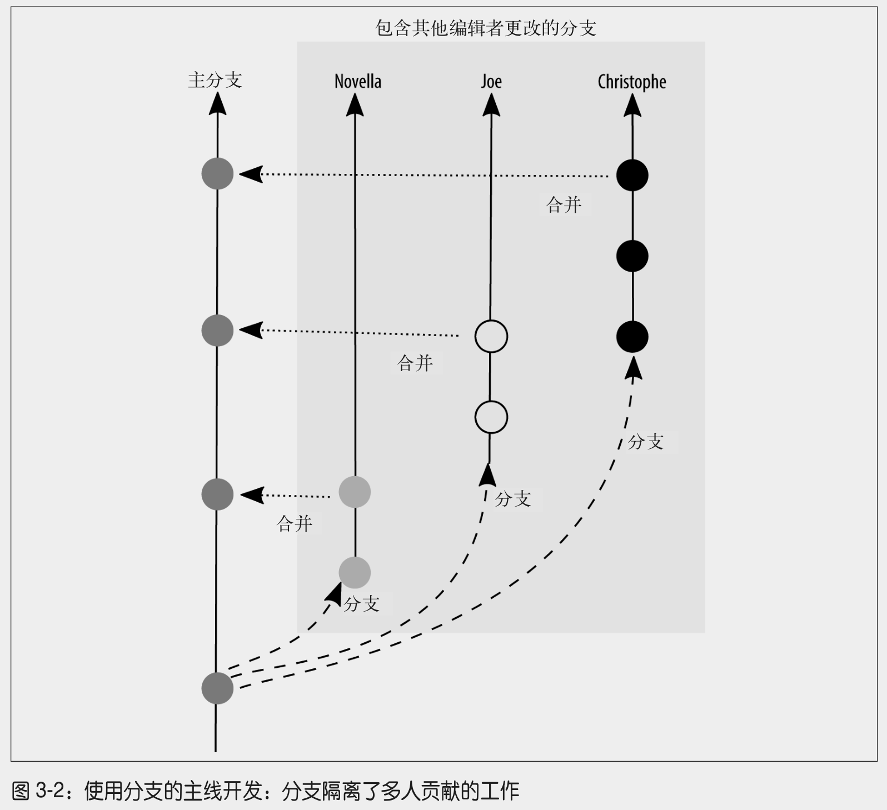
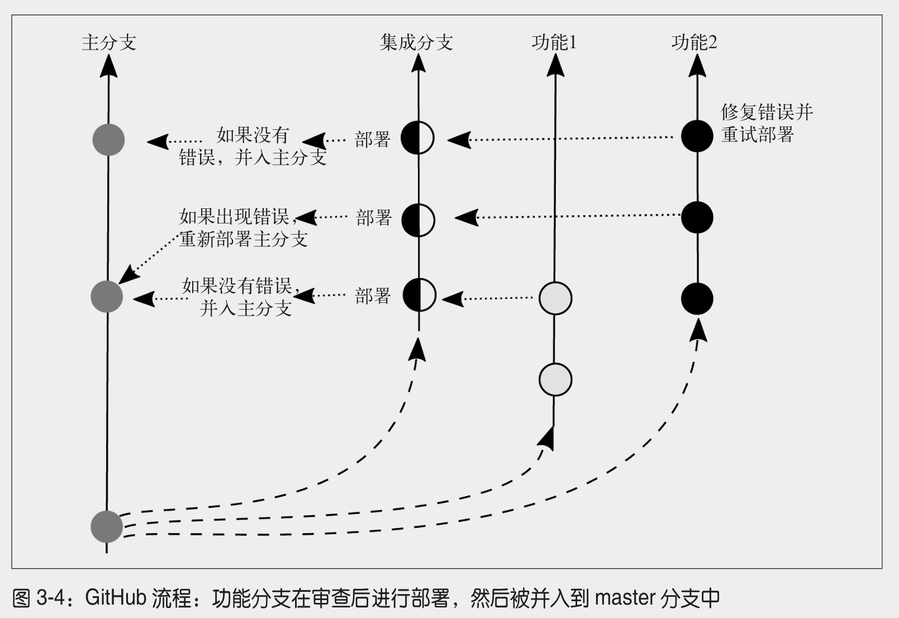
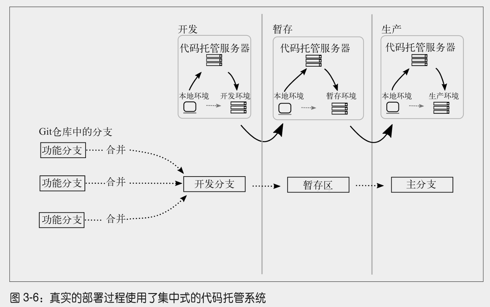
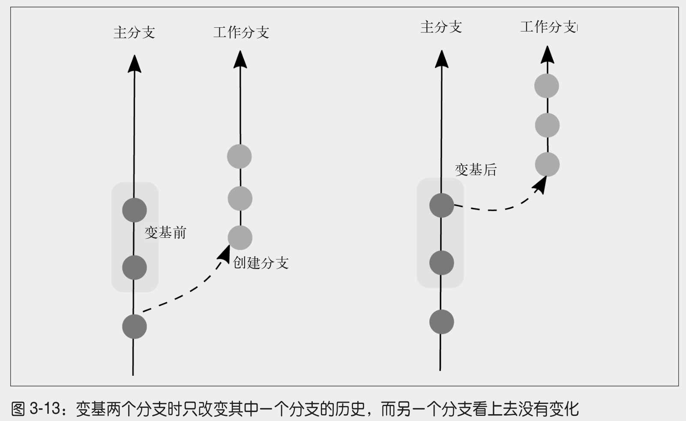
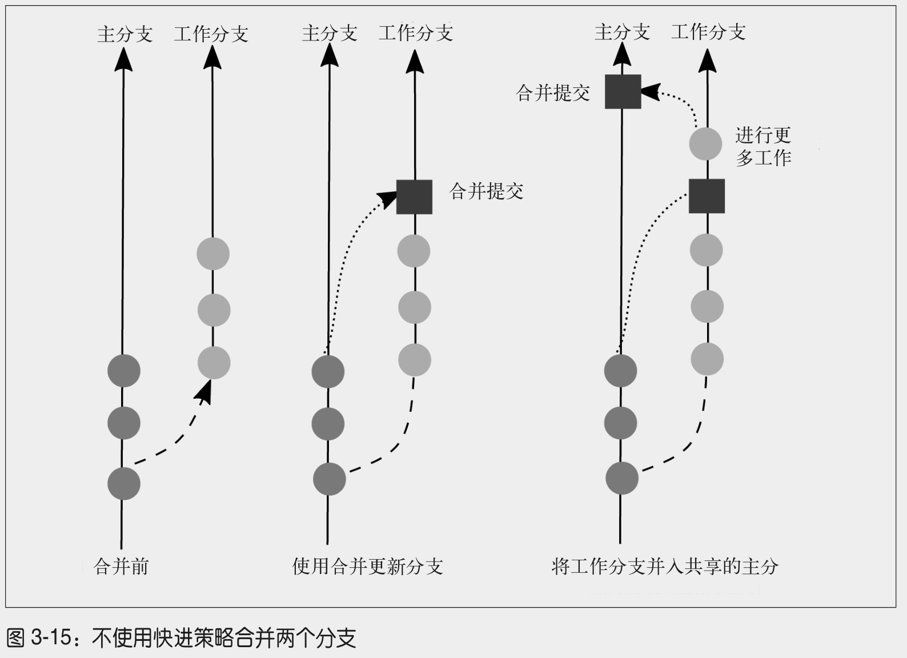

# git basic

## 修改已提交的记录信息
```bash
git commit --amend -m "新的提交信息"
git push --force-with-lease origin 你的分支名
```

## 工作区、暂存、本地仓库
```
# working dir ----> stage -----> committed

# git rm --cached **/*.pyc to uncommit
# git restore --staged **/*.pyc to unstage
#"git restore <file>..." to discard changes in working directory
*.pyc
```

## 2.1.3 项目治理 - 领导力模型

- 仁慈的独裁者（BDFL）

BDFL 类型的领导者或许不会活跃于每次代码评审中，但最终保留了驳回或撤销某个决定的权力。

- 共识驱动、主管批准

Drupal 社区使用的共识模型鼓励社区在自己熟悉的领域中寻找合适的解决方案。当社
区对解决方案感到满意时，他们将这个 issue 标记为 RTBC［Reviewed and Tested by the
Community，通过社区审核与测试，与 Ready to be Committed（即将提交）的英文缩
写相同。

- 技术评审委员会或项目管理委员会

## 2.2 访问模型

- 适合分散贡献者仓库的模型 -> 使用 diff 程序创建补丁文件
- 适合并列贡献者仓库的模型 -> fork, pull to local, change, commit, push, make pull request.
- 共同维护的模型 -> 每个人都拥有对该仓库的共享写入权限
- 自定义访问模型 -> 一个官方项目仓库 / 一份限制更为宽松的仓库内部副本 (用于集成)/ 锁定到各个贡献者的单独创建的个人仓库

## 分支策略

- 主线分支开发

主线分支是随时可以正常部署的分支，平时开发在新分支中开发，然后合并到主分支。最好是有代码 review
以及测试，否则主分支很可能会被分支合并破坏，导致无法部署。



- 功能分支部署

在使用功能分支的部署策略中，所有新的工作都在一个功能分支上完成，这个分支小到恰
好能够容纳一个完整的想法。这些分支通过一个集成分支与其他开发者完成的工作保持同
步。在软件发布前，构建管理员可以挑选将哪些功能集成到这个版本，并为部署创建一个新的集成分支。

早先，GitHub 将自己的功能分支并入 master 分支，然后再部署 master 分支。现在，我
们部署完功能分支，如果上面没有错误，它将被并入 master 分支，如图 3-4 所示。也就是说，
如果功能分支存在问题，我们可以立即重新部署 master，因为这个分支永远处于工作状态。



- 3.3.3 状态分支

和之前提到的策略不同，状态分支策略引入了分支位置或快照的概念。



- 计划部署

如果你没有一个完全自动化的测试集，却必须计划一个部署，那么计划部署分支是最适合你的策略。

## 更新分支

**rebase 命令用于更新分支 **，** 而 merge 命令用于引入全新的工作 **。当 merge 命令用于快进（fast-forward）策略时，状态图和变基后的图形并无二致。





## 工作流

工单状态划分：积压、抛弃、等待开工、进行中、已完成，等等。

### 4.3 基本工作流

- 治理模型：贡献者共同维护
- 集成合并：由原开发者执行
- 整合分支：develop

### 4.3.1 使用同行评审的可信开发者

- 治理模型：贡献者共同维护
- 集成合并：由审查者执行
- 集成分支：develop

### 4.3.2 需要质量保证团队的不可信开发者

- 治理模型：具有并置仓库的贡献者
- 集成合并：由评审者执行
- 集成分支：develop

这种模式类似于开源项目的贡献 PR。

## 4.4 根据计划发布软件

dev -> qa -> master -> hotfix

对于修复补丁。

(5) 将通过测试的补丁分支并入 master 分支。
(6) 将 master 分支上的最新提交打上最新发布的版本号。例如，v1.0.1。
(7) 将经过测试的补丁分支并入开发分支，保证在下次软件正式发布时这些修改不会丢失。

## 单人团队

表 5-2：基本的 Git 命令

| 命令                                                             | 用途                                 |
|----------------------------------------------------------------|------------------------------------|
| git clone URL                                                  | 下载一份远程仓库的副本                        |
| git init                                                       | 将当前目录转换成一个新的 Git 仓库                |
| git status                                                     | 获取仓库状态报告                           |
| git add --all                                                  | 将所有修改过的文件和新文件添加至仓库的暂存区             |
| git commit -m "message"                                        | 将所有暂存的文件提交至仓库                      |
| git log                                                        | 查看项目历史                             |
| git log --oneline                                              | 查看压缩过的项目历史                         |
| git branch --list                                              | 列出所有本地分支                           |
| git branch --all                                               | 列出本地和远程分支                          |
| git branch --remotes                                           | 列出所有远程分支                           |
| git checkout --track remote_name/branch                        | 创建远程分支的副本，在本地使用                    |
| git checkout branch                                            | 切换到另一个本地分支                         |
| git checkout -b branch branch_parent                           | 从指定分支创建一个新分支                       |
| git add filename(s)                                            | 仅暂存并准备提交指定文件                       |
| git add --patch filename                                       | 仅暂存并准备提交部分文件                       |
| git reset HEAD filename                                        | 从暂存区移除提出的文件修改                      |
| git commit --amend                                             | 使用当前暂存的修改更新之前的提交，并提供一个新的提交消息       |
| git show commit                                                | 输出某个提交的详细信息                        |
| git tag tag commit                                             | 为某个提交对象打上标签                        |
| git tag                                                        | 列出所有标签                             |
| git show tag                                                   | 输出所有带标签提交的详细信息                     |
| git remote add remote_name URL                                 | 创建一个指向远程仓库的引用                      |
| git push                                                       | 将当前分支上的修改上传至远程仓库                   |
| git remote --verbose                                           | 列出所有可用远程连接中 fetch 和 push 命令使用的 URL |
| git push --set-upstream remote_name branch_local branch_remote | 将本地分支的副本推送至远程服务器                   |
| git merge branch                                               | 将当前存储在另一分支的提交并入当前分支                |
| git push --delete remote_name branch_remote                    | 在远程服务器中移除指定名称的分支                   |

## 回滚、还原、重置和变基

- 修补一个提交，并加入新的工作
- 将一份文件恢复到之前的状态
- 将你的工作目录恢复到上次提交时的状态
- 还原之前作出的变更
- 使用变基重塑提交历史记录
- 从仓库中移除一份文件
- 移除某个分支上因为错误的合并引入的提交

### 使用分支进行试验性的操作

使用试验性的分支来测试修改

```bash
$ git checkout -b experimental_idea
(完成工作)
$ git add --all
$ git commit
```

将你的试验性分支合并回主分支

```bash
$ git checkout master
$ git merge experimental_idea --squash
Squash commit -- not updating HEAD
Automatic merge went well; stopped before committing as requested
$ git commit
```

删除你的试验性分支

```bash
$ git branch --delete experimental_idea
```

### 基本的 rebase

确保你父分支的本地副本与项目主仓库中最新的提交同步

```bash
$ git checkout master
$ git pull --rebase=preserve remote_nickname master
```

在特性分支上执行变基

```bash
$ git checkout feature
$ git rebase master
```

如果一切正常，那就很好。

### 文件删除造成的变基中冲突

如果某个文件 A 之前在 master 中，master 已经删除了。但是 feature 分支却对这个文件 A 进行了修改，此时就会冲突。

此时可以查看 status 来确认目前的冲突情况。

```bash
git status
```

下面是一些关键的指令提示。

```bash
(fix conflicts and then run "git rebase --continue")
(use "git rebase --skip" to skip this patch)
(use "git rebase --abort" to check out the original branch)
```

可以选择继续、跳过、还是终止。

下面是保留这个文件 A 的做法。先 unstage，然后添加，最后标记冲突已经解决。

```bash
# 回到文件的上一个 git 旧版本
git reset HEAD A.asciidoc
git status

# 重新添加
git add ch10.asciidoc
git status

git rebase --continue
```

### 单个文件合并冲突造成的变基中冲突

类似于【文件删除造成的变基中冲突】的解决方式。

### 本地工作记录

`reflog` 和 `cherry-pick`。

使用 cherry-pick 将提交复制到新的分支。

```bash
$ git cherry-pick -x commit
```

### 还原文件

如果被删除的文件还没有被暂存

```
git checkout -- README.md
```

---

如果你已经暂存了文件，你需要使用 reset 命令在恢复文件之前将它取消暂存。

```
# 取消暂存
git reset HEAD README.md
# 一旦文件被取消暂存后，你可以像之前使用 checkout 命令那样恢复被删除的文件
git checkout -- README.md
```

如果你愿意，可以把上面两个命令合并成一个，如下所示。

```
$ git reset --hard HEAD -- README.md
```

---

如果你想要撤销工作目录中的所有变更，将所有文件恢复到上一个提交的版本。

```bash
$ git reset --hard HEAD
```

### 6.5.1 修补提交

```bash
$ git add --all
$ git commit --amend
```

### 6.5.2 使用 reset 合并提交

想象一串珠子。假设串上有 20 粒珠子。握住第四颗珠子，让前三个从串上滑下。你现在有一串短了一些的珠子和三个散落的珠子。你在使用
reset 命令时添加的参数决定了这些珠子的命运。

假设你希望重置你的珠串，把最新的三颗珠子替换成一颗大珠子。这里有点类似于 squash commits。

具体的例子。

```bash
$ git log --oneline
699d8e0 More editing second file
eabb4cc Editing the second file
d955e17 Adding second file
eppb98c Editing the first file
ee3e63c Adding first file
```

```bash
$ git reset eppb98c
# 或者使用相对 HEAD 的记录
# $ git reset HEAD~3
```

现在我们有三个散落的珠子四处乱撞。这些珠子在我们的仓库中称为未跟踪的变更。文件的内容将不会被改变。

然后就可以 add 和 commit 了。

```
git add --all
git commit -m "..."
```

### 6.5.3 使用交互式变基修改提交

> 这一小节是重点。

假设有下面的 git 提交记录。

```bash
d1dc647 Revert "Adding office hours reminder."
50605a1 Correcting joke about horses and baths.
eed5023 Joke: What goes 'ha ha bonk'?
77c00e2 Adding an Easter egg of bad jokes.
0f187d8 Added information about additional people to be thanked.  <---------
c546720 Adding office hours reminder.
3184b5d Switching back to BADCamp version of the deck.
```

选择 0f187d8 作为你的起点。你现在已经准备好进入变基的流程，如下所示。

```bash
$ git rebase --interactive 0f187d8
pick 77c00e2 Adding an Easter egg of bad jokes.
pick eed5023 Joke: What goes 'ha ha bonk'?
pick 50605a1 Correcting joke about horses and baths.
pick d1dc647 Revert "Adding office hours reminder."

# Rebase 0f187d8..d1dc647 onto 0f187d8
#
# Commands:
# p, pick = use commit
# r, reword = use commit, but edit the commit message
# e, edit = use commit, but stop for amending
# s, squash = use commit, but meld into previous commit
# f, fixup = like "squash", but discard this commit's log message
# x, exec = run command (the rest of the line) using shell
#
# These lines can be re-ordered; they are executed from top to bottom.
#
# If you remove a line here THAT COMMIT WILL BE LOST.
#
# However, if you remove everything, the rebase will be aborted.
#
# Note that empty commits are commented out
```

这里有 6 个指令。

- "p" 或 "pick" 命令用于提交代码。
- "r" 或 "reword" 命令用于提交代码，但会 ** 编辑上一次提交的消息 **。
- "e" 或 "edit" 命令用于提交代码，但会 ** 停下来让你修改上一次提交的内容 **。

提交列表被倒序排列，最旧的提交现在位于列表的顶端。

假设下面是这样的修改。

```bash
pick 77c00e2 Adding an Easter egg of bad jokes.
squash eed5023 Joke: What goes 'ha ha bonk'?
squash 50605a1 Correcting joke about horses and baths.
pick d1dc647 Revert "Adding office hours reminder."
```

** 保存并退出你的编辑器以继续 **。

上面的合并策略是：

- 保留 77c00e2
- 合并压缩 eed5023
- 合并压缩 50605a1
- 保留 d1dc647

变基过程完成后，被你修订后的日志将会如下所示：

```bash
$ git log --oneline

ef4409f Revert "Adding office hours reminder." <---------------- 保留
1c10178 Adding an Easter egg of bad jokes.     <---------------- 三合一
0f187d8 Added information about additional people to be thanked.
c546720 Adding office hours reminder.
3184b5d Switching back to BADCamp version of the deck.
```

## 7.3.4 合并完成的工作

1. 并入项目分支中的更新

```bash
$ git checkout master
$ git pull --rebase
```

2. 将一个完成的工单分支合并到一个公共的项目分支

```bash
$ git checkout 2378-add-test
$ git rebase master
```

3. 将完成的工单分支合并到公共的项目分支

```bash
$ git checkout master
# --no-ff 表示不使用 fast forward 合并策略，留下一个 commit 节点来表示提交记录
$ git merge --no-ff 2378-add-test
```

## 7.4 样例工作流

表 7-1：每周部署工作流中的分支类型

| 分支名 / 约定                   | 分支类型 | 描述                                      | 基线分支            |
|----------------------------|------|-----------------------------------------|-----------------|
| dev                        | 集成   | 用于放置通过同行评审的代码                           | 工单分支            |
| `ticket#-descriptive-name` | 开发   | 用于完成工单中标识的工作                            | dev             |
| qa                         | 集成   | 用于每个冲刺结束前的质量保证测试，没有通过 QA 测试的代码会从这个分支上移除 | dev             |
| master                     | 集成   | 用于部署测试全部通过的代码                           | qa              |
| hotfix-ticket#-description | 开发   | 用于为产品中发现的紧急问题开发对策                       | master 上最新的发布标签 |

### 完成工单时需要的 Git 命令

```bash
$ git checkout dev
$ git pull --rebase=preserve origin dev
$ git checkout -b 1234-new_ticket_branch
# 完成工作
$ git add --all
$ git commit

# 在共享工作前，确保该分支包含了新的提交，如下所示。
$ git checkout dev
$ git pull --rebase=preserve
$ git checkout 1234-new_ticket_branch
$ git rebase dev

# 最后，与其他人共享新的工作，如下所示。
$ git push origin 1234-new_ticket_branch
```

### 完成同行评审时需要的 Git 命令

```bash
$ git checkout dev
$ git pull --rebase=preserve
# 1234-new_ticket_branch 是一个分支而不是一个 pr 编号
$ git checkout 1234-new_ticket_branch

// 进行评审工作

# 修改完毕后，则合并到 master 分支
$ git merge --no-ff 1234-new_ticket_branch main
# 删除本地分支
$ git branch --delete 1234-new_ticket_branch
# 删除远程对应的分支
$ git push --delete origin 1234-new_ticket_branch

# 如果觉得这个分支的内容修改不能接受，应该采取其他方式（例如 issue 评论）进行改进，延缓合并。
```

如果是对于 pr
> [参考](https://docs.github.com/zh/pull-requests/collaborating-with-pull-requests/reviewing-changes-in-pull-requests/checking-out-pull-requests-locally#modifying-an-inactive-pull-request-locally)

```bash
# pr-28 是要新建的本地分支名称
git fetch origin pull/28/head:pr-28
git checkout pr-28
```

现在，您可以使用此分支执行任何操作。 您可以运行一些本地测试，或者将其他分支合并到该分支。

准备就绪后，可以向上推送新分支：

```bash
git push origin pr-28
```

最后，使用新分支创建 PR 请求。这种方式会割裂之前的原始 PR 请求，因此不推荐。

---
=> 选择 1：可以使用 merge 方式追加到原始 pr 请求页面。

```bash
# 一般来说，GitHub 上的 PR 页面会显示基于哪个远程分支创建的 PR。
# 您可以在页面上方的 "base" 或 "compare" 部分找到这些信息。"BRANCHNAME" 就是这个远程分支的名称。
# 例如，如果原始 PR 是基于名为 "main" 的远程分支创建的，那么 "BRANCHNAME" 就是 "main"。
git push origin pr-28:main
```

此时会产生两个 git commits 记录，原始 pr 界面会显示已合并 main 分支。

---

=> 选择2：rebase精简提交提交记录。

如果不想产生多个 commits 记录，而是更加清晰的提交记录，那么最好是合并他们，最终为一个 commit 记录。

````bash
git rebase - i HEAD~n
````
假设这里是要修订两个记录，那么上面的 n 就是 2。

在交互式界面中，将除第一个提交记录之外的所有提交记录的命令（例如 "pick"）改为 "squash" 或 "s"，表示将它们合并到第一个提交记录中。
保存并关闭编辑器。
```bash
pick 95790f5 feat: Update linovel_mobile volume title
pick 0b9f07d fix: Update linovel_mobile volume title
```
=>
```bash
pick 95790f5 fix: Update linovel_mobile volume title
s 0b9f07d fix: Update linovel_mobile volume title
```

```bash
$ git rebase --continue
[detached HEAD bdd4766] fix: Update linovel_mobile volume title
 Author: XXX <XXX@XXXXX.com>
 2 files changed, 11 insertions(+), 2 deletions(-)
Successfully rebased and updated refs/heads/main.
```

最后，推送。
```bash
git push -f origin main
# git push origin HEAD:main
```

### 设置 qa 分支时需要的命令

```bash
$ git checkout dev
$ git pull --rebase=preserve
$ git checkout qa
$ git merge --no-ff dev
$ git push
```

### 移除在发布前没能通过 QA 的工单时需要的命令

```bash
$ git log --oneline --grep ticket-number
(找到需要撤销的提交)
$ git revert commit_id
$ git revert --mainline 1 merge_commit
(但是，在理想情况下，你应该使用 --no-ff 合并工作分支，这样会产生一个便于撤销的提交 ID)
```

### 准备部署时需要的命令

```bash
$ git checkout master
$ git merge qa
$ git tag
(找到最新的标签，以确定下一个标签的编号)

# 通过 --annotate 参数签署，通过 -m 参数添加说明
$ git tag --annotate -m tag_name
$ git push --tags
```

### 创建补丁分支时需要的命令

```bash
$ git checkout master
$ git tag
(查看标签列表，确定当前活跃的标签)
$ git checkout -b hotfix-issue-description tag_name
```

接下来，补丁分支将被当作常规的开发分支一样对待，经过同行评审和质量保证测试。当
测试通过后，它会被立即合并回 master 分支并打上标签准备发布。

### 准备补丁的部署时需要的命令

```bash
$ git checkout master
$ git merge --no-ff hotfix-issue-description
$ git tag --annotate -m new_tag_name
$ git push --tags
```

## 写书

```bash
$ git checkout ch04
// 编写这一章
$ git add ch04.asciidoc
$ git commit

$ git checkout drafts
$ git merge ch04
```

也就是开辟新分支来写每一章，然后合并到 drafts 草稿分支。