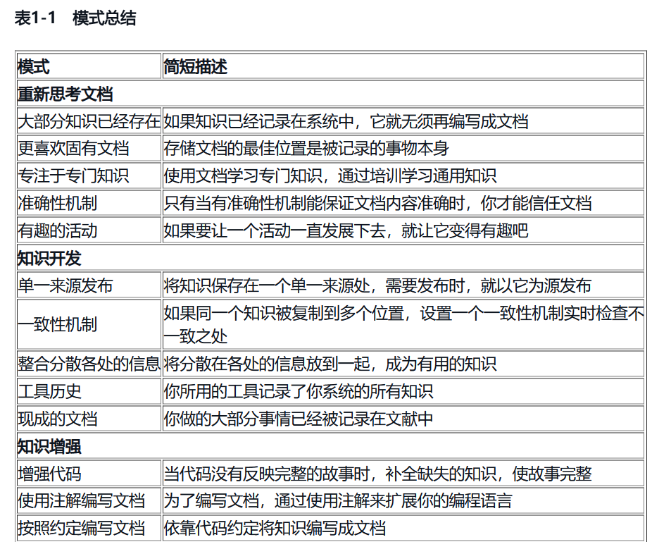
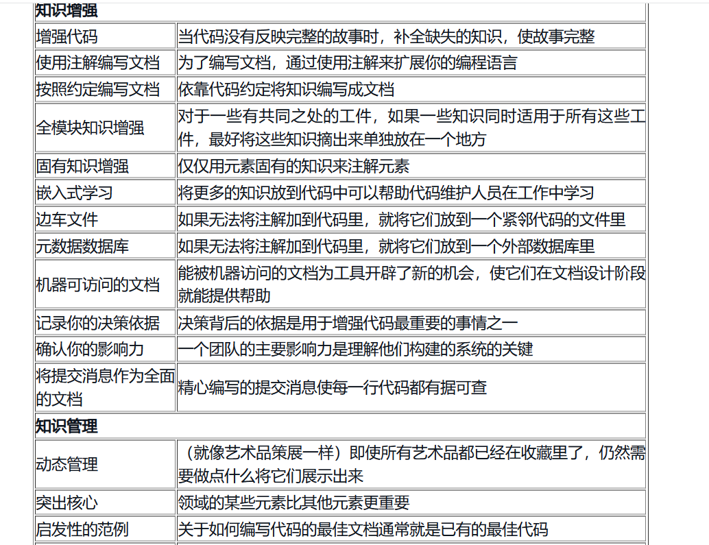
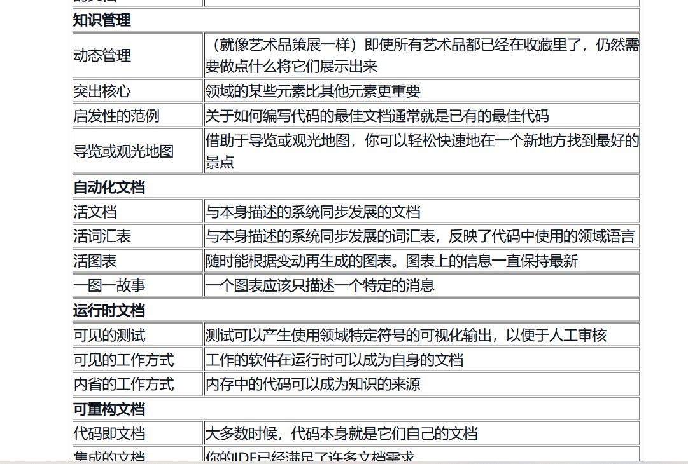
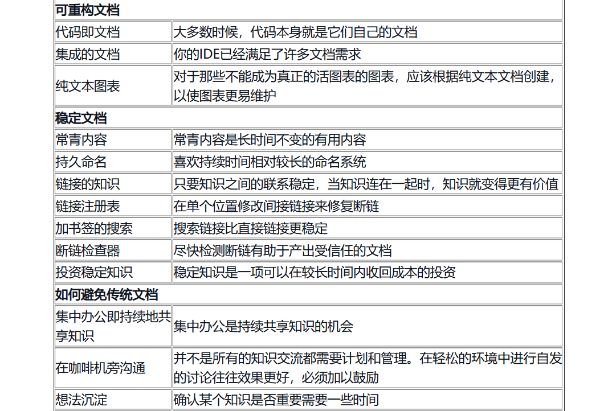
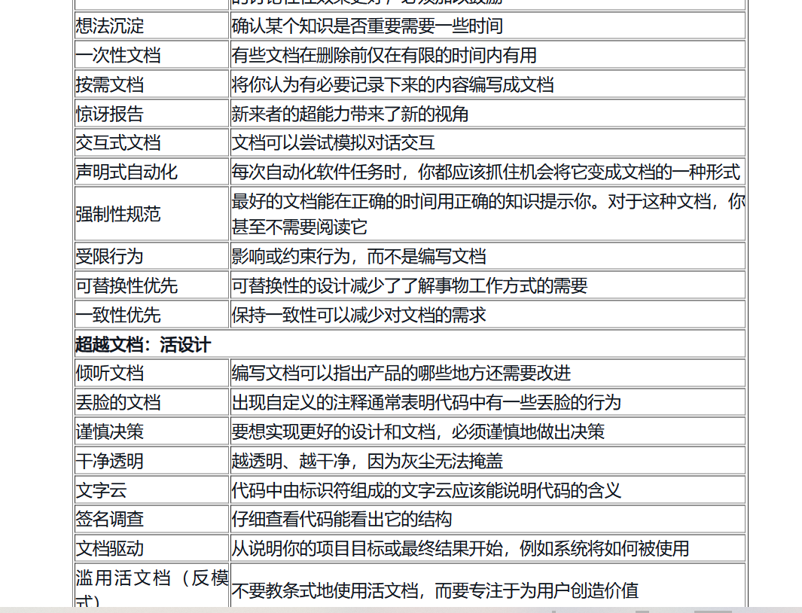
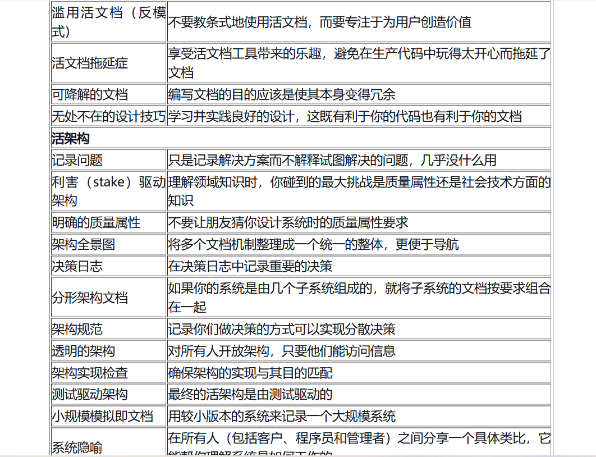
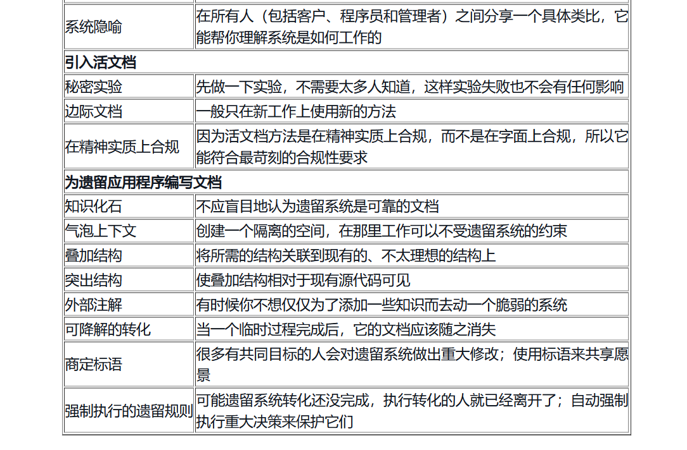
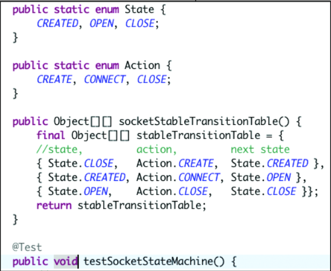

# 活文档设计
本文是《活文档：与代码共同演进》的读书摘录。

为何单纯代码不能清晰描述一切?

> 因为代码描述的是实现，无法描述背景，关联上下文，技术决策上的取舍，以及不足点，以及后续优化点。
> 所以才会出现：TODO refactor， do better 等等注释来标记，备忘。
> 编程语言永远无法说明一切。它们关注其关键范例，并依靠其他机制来表达其余的内容，包括命名、注释和库等

场景文档和代码描述了同一行为，应该信任文档还是信任代码？

> 场景文档，可以提供给非技术人员看。而代码的阅读门槛较高。当一个行为变化时，该信任文档还是信任代码？
> 所以，文档和代码实现的一致性非常重要。如果文档滞后，代码领先，那就应该信任代码。一般都是以代码为准。

单一来源发布

> 让知识只有单一信息源，并在需要时以该来源的内容为准发布知识，这一点很重要。当权威性知识来源是某种编程语言编写的源代码或者是采用某种形式语法的工具配置文件时，让那些无法阅读这些文件的受众可以访问这些知识就变得很有必要。解决这个问题的标准做法是以一种所有人都能看懂的格式来提供文档，比如用简单英文书写的PDF文档、Microsoft Office文档、电子表格或者幻灯片。但是，如果你直接创建一个文档以复制粘贴的方式在文档里包含所有相关知识，那么发生变更时就会很难办。在一个正常运转的项目中，经常变更几乎是必然的

因此，每一项知识都只放在一个地方，使其成为权威性知识来源。当文档受众无法直接访问这些知识，而你又必须为他们提供这些知识时，请从该单一知识来源发布文件。不要通过复制和粘贴的方法将知识元素包含到要发布的文档中，而是使用自动化机制直接从单一的权威性知识来源创建需要发布的文档

发布一个带版本号的快照

测试用例的作用

> 当想要的行为和代码不一致时，测试会失败。这可以提醒你去重构代码，直到测试通过。这样的流程，可以极大增强你敏捷发布的信心。因为测试通过代表着一切正常。

要开始实践，还需要确定是否有单一信息源（可以将它提取出来，生成不同形式的文档），或者是否存在冗余信息源（它们需要一致性机制）。如果知识分散在多个位置，那么你可能需要一种整合机制将其归为一条知识

决策要有故事。人们喜欢故事而且容易记住故事。记录决策的背景信息很重要。要在新的背景信息里重新评估一个决策，必须要有过去做出该决策的背景信息。借助过去的决策，我们可以学习前辈的思想。许多决策的描述也比结果的描述更简洁，因此，与决策产生的所有细节相比，决策更容易在人与人之间传递。如果你能马上告诉我你的意图和背景信息，那么只要我是一个熟练的专业人员，我就可能会做出与你相同的决策。但是，如果没有意图和背景信息，你就会想知道“他们当时在想什么

文档太多等于没有文档，笔记太多等于没有笔记。太多意味着噪声太多，此时很难识别真正重要的信息。 

自省，就是当解释型语言被加载到内存中运行时可以知道对象的类型，以及该对象下有哪些方法等。
python 的 type()、 dir() 。

程序必须能够供人们阅读，偶尔可以供计算机执行。——Harold Abelson、Gerald Jay Sussman和Julie Sussman，《计算机程序的构造和解释》

正如Chris Epstein在一次演讲中说的：“善待未来的自己。”学习怎样使你的代码易于理解，对未来的自己来说是一个奖励。

单元测试中的Arrange-Act-Assert约定

如果你无法改变一个决策，那它就是一个需求。如果你能改变，它就是你的设计。——Alistair Cockburn

投资稳定知识

> 此外，计算与软件架构和设计的基础知识也属于稳定知识类别。不要犹豫，去读一些旧的论文以及映射了这个领域的模式吧。
> 业务领域知识和软件架构的基础知识是常青内容，特别值得学习

成为当你是孩子时希望身边能有的那种成年人。编写那些你开始项目时希望能有的文档。

声明式配置管理

> 用于管理配置的工具中，最受欢迎的是Ansible、Puppet、CfEngine、Chef和Salt。但是，其中一些是命令式的（如Chef），而其他一些是声明式的（如Puppet和Ansible）

很多工具可以用来搭建脚手架，如自定义脚本、Maven原型、Spring Roo、JHipster等。有时也可以使用配置管理工具为新团队成员创建工作设置，或设置以后可以修改的应用程序模板

因此，使用一种机制来执行已成为规范的决策。使用工具检测违规行为并在违规时以可视化的警报形式提供即时反馈。不要浪费时间写没有人阅读的规范文档，而应该使强制执行的机制具有足够的自我描述性，以便可以将其用作规范的参考文档。
因为，才会诞生很多的XXXLint工具。

如果你无法简单地解释某些内容，就说明你对它了解得还不够

因此，自然而然地将活文档一点点引入日常工作，成为工作的一部分。在确定设计决策、意图和依据时就开始对它们做注解。如果有一些闲暇时间或真正需要文档，请将分配的时间用于创建简单的文档自动化，例如简单的活图表或基本词汇表。尽量使文档保持简单，使其在几个小时或更短的时间内就能发挥作用。不要把它说成一场革命，而是只把它当作一种高效做事的天然方式。强调这种方法能带来的收益，而不只是本书提供的理论

一天几次构建，每次构建时，自动化流程可以产生大量功能性文档、广泛的测试结果和覆盖范围、安全性和可访问性检查、设计图表、发布说明（带有请求的功能在工具里的链接）和发布决策电子邮件的归档，这种流程很难被打败。

有一部名为《独木桥》的短剧让我深有感触，讲的就是伴随着成长，人认识自己、寻找自己、宽容自己和接受自己的过程。